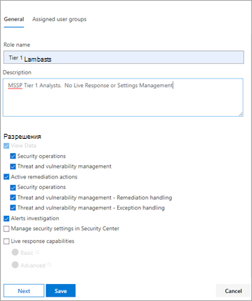
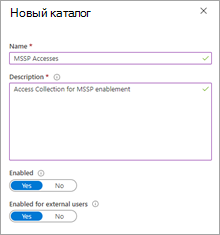
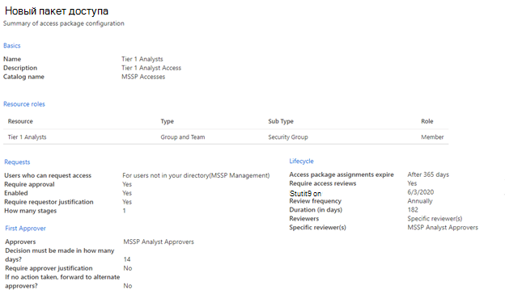
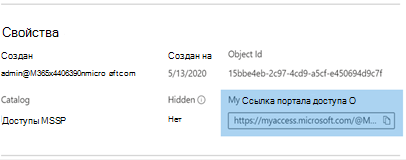

# Предоставление доступа к поставщику управляемых служб безопасности (MSSP) (предварительный просмотр)Grant managed security service provider (MSSP) access (preview)

[!INCLUDE [Microsoft 365 Defender rebranding](../../includes/microsoft-defender.md)]

**Область применения:****Applies to:**
- [Microsoft Defender для конечной точкиMicrosoft Defender for Endpoint](https://go.microsoft.com/fwlink/p/?linkid=2154037)
- [Microsoft 365 DefenderMicrosoft 365 Defender](https://go.microsoft.com/fwlink/?linkid=2118804)

>Хотите испытать Defender для конечной точки?Want to experience Defender for Endpoint? [Зарегистрився для бесплатной пробной.Sign up for a free trial.](https://www.microsoft.com/microsoft-365/windows/microsoft-defender-atp?ocid=docs-mssp-support-abovefoldlink)

>[!IMPORTANT] 
>Некоторые сведения относятся к предварительным выпускам продуктов, которые могут быть существенно изменены до коммерческого выпуска.Some information relates to prereleased product which may be substantially modified before it's commercially released. Корпорация Майкрософт не дает никаких гарантий, явных или подразумеваемых, относительно предоставленных здесь сведений.Microsoft makes no warranties, express or implied, with respect to the information provided here.

Чтобы реализовать решение с делегированием доступа с несколькими клиентами, необходимо выполнить следующие действия:To implement a multi-tenant delegated access solution, take the following steps:

1. Включить [управление доступом на основе ролей](rbac.md) в Defender для конечной точки и подключиться к группам Active Directory (AD).Enable [role-based access control](rbac.md) in Defender for Endpoint and connect with Active Directory (AD) groups.

2. Настройка [пакетов доступа к управлению для](https://docs.microsoft.com/azure/active-directory/governance/identity-governance-overview) запроса доступа и подготовка.Configure [Governance Access Packages](https://docs.microsoft.com/azure/active-directory/governance/identity-governance-overview) for access request and provisioning.

3. Управление запросами и аудитами доступа [в Microsoft Myaccess.](https://docs.microsoft.com/azure/active-directory/governance/entitlement-management-request-approve)Manage access requests and audits in [Microsoft Myaccess](https://docs.microsoft.com/azure/active-directory/governance/entitlement-management-request-approve).

## Включить элементы управления доступом на основе ролей в Microsoft Defender для конечной точкиEnable role-based access controls in Microsoft Defender for Endpoint

1. **Создание групп доступа для ресурсов MSSP в AAD клиента: Группы****Create access groups for MSSP resources in Customer AAD: Groups**

    Эти группы будут связаны с ролями, которые вы создаете в Defender для конечной точки.These groups will be linked to the Roles you create in Defender for Endpoint. Для этого в клиенте AD-клиенте создайте три группы.To do so, in the customer AD tenant, create three groups. В нашем примере мы создадим следующие группы:In our example approach, we create the following groups:

    - Аналитик уровня 1Tier 1 Analyst 
    - Аналитик уровня 2Tier 2 Analyst 
    - Утверждения аналитика MSSPMSSP Analyst Approvers  

2. Создание ролей Defender для конечной точки для соответствующих уровней доступа в защитнике клиента для конечной точки.Create Defender for Endpoint roles for appropriate access levels in Customer Defender for Endpoint.

    Чтобы включить RBAC в центре безопасности microsoft Defender клиента, вы сможете получить доступ к > разрешениям **>** ролей и "Включить роли" из учетной записи пользователя с правами глобального администратора или администратора безопасности.To enable RBAC in the customer Microsoft Defender Security Center, access **Settings > Permissions > Roles** and "Turn on roles", from a user account with Global Administrator or Security Administrator rights.

    

    Затем создайте роли RBAC для удовлетворения потребностей уровня MSSP SOC.Then, create RBAC roles to meet MSSP SOC Tier needs. Связывать эти роли с созданными группами пользователей с помощью "Назначены группы пользователей".Link these roles to the created user groups via "Assigned user groups".

    Две возможные роли:Two possible roles:

    - **Аналитики уровня 1****Tier 1 Analysts**  
      Выполните все действия, за исключением живого ответа и управления настройками безопасности.Perform all actions except for live response and manage security settings.

    - **Аналитики уровня 2****Tier 2 Analysts**  
      Возможности уровня 1 с добавлением [живого ответа](live-response.md)Tier 1 capabilities with the addition to [live response](live-response.md)

    Дополнительные сведения см. в дополнительных сведениях Об использовании управления [доступом на основе ролей.](rbac.md)For more information, see [Use role-based access control](rbac.md).

## Настройка пакетов доступа к управлениюConfigure Governance Access Packages

1.  **Добавление MSSP в качестве связанной организации в AAD клиента: управление удостоверением****Add MSSP as Connected Organization in Customer AAD: Identity Governance**
    
    Добавление MSSP в качестве связанной организации позволит MSSP запрашивать и получать доступ.Adding the MSSP as a connected organization will allow the MSSP to request and have accesses provisioned. 

    Для этого в клиенте AD-клиенте можно получить доступ к организации Identity Governance: Connected.To do so, in the customer AD tenant, access Identity Governance: Connected organization. Добавьте новую организацию и ищите клиента msSP Analyst с помощью tenant ID или Domain.Add a new organization and search for your MSSP Analyst tenant via Tenant ID or Domain. Мы предлагаем создать отдельный клиент AD для аналитиков MSSP.We suggest creating a separate AD tenant for your MSSP Analysts.

2. **Создание каталога ресурсов в AAD клиента: управление удостоверением****Create a resource catalog in Customer AAD: Identity Governance**

    Каталоги ресурсов — это логическое собрание пакетов доступа, созданных в клиенте AD-клиента.Resource catalogs are a logical collection of access packages, created in the customer AD tenant.

    Для этого в клиенте AD-клиенте необходимо получить доступ к управлению удостоверениями: каталоги и добавить **новый каталог.**To do so, in the customer AD tenant,  access Identity Governance: Catalogs, and add **New Catalog**. В нашем примере мы назовем это **msSP Accesses**.In our example, we will call it **MSSP Accesses**. 

    

    Дополнительные сведения см. [в книге Создание каталога ресурсов.](https://docs.microsoft.com/azure/active-directory/governance/entitlement-management-catalog-create)Further more information, see [Create a catalog of resources](https://docs.microsoft.com/azure/active-directory/governance/entitlement-management-catalog-create).

3. **Создание пакетов доступа для ресурсов MSSP Customer AAD: Управление удостоверениями****Create access packages for MSSP resources Customer AAD: Identity Governance**

    Пакеты доступа — это коллекция прав и доступов, которые запросчику будет предоставлено после утверждения.Access packages are the collection of rights and accesses that a requestor will be granted upon approval. 

    Для этого в клиенте AD-клиенте необходимо получить доступ к управлению удостоверениями: пакеты доступа и **добавить новый пакет доступа.**To do so, in the customer AD tenant, access Identity Governance: Access Packages, and add **New Access Package**. Создание пакета доступа для утверждения MSSP и каждого уровня аналитики.Create an access package for the MSSP approvers and each analyst tier. Например, следующая конфигурация аналитики уровня 1 создает пакет доступа, который:For example, the following Tier 1 Analyst configuration creates an access package that:

    - Требуется члену группы AD **msSP Analyst Approvers** для авторизации новых запросовRequires a member of the AD group **MSSP Analyst Approvers** to authorize new requests
    - Имеет ежегодные обзоры доступа, в которых аналитики SOC могут запрашивать расширение доступаHas annual access reviews, where the SOC analysts can request an access extension
    - Запросы могут запрашиваться только пользователями в клиенте MSSP SOCCan only be requested by users in the MSSP SOC Tenant
    - Срок действия авто доступа истекает через 365 днейAccess auto expires after 365 days

    > [!div class="mx-imgBorder"]
    > 

    Дополнительные сведения см. в [дополнительных сведениях о создании нового пакета доступа.](https://docs.microsoft.com/azure/active-directory/governance/entitlement-management-access-package-create)For more information, see [Create a new access package](https://docs.microsoft.com/azure/active-directory/governance/entitlement-management-access-package-create).

4. **Предоставление ссылки запроса на доступ к ресурсам MSSP из AAD клиента: управление удостоверением****Provide access request link to MSSP resources from Customer AAD: Identity Governance**

    Ссылка портала My Access используется аналитиками MSSP SOC для запроса доступа через созданные пакеты доступа.The My Access portal link is used by MSSP SOC analysts to request access via the access packages created. Ссылка долговечна, что означает, что эта же ссылка может использоваться со временем для новых аналитиков.The link is durable, meaning the same link may be used over time for new analysts. Запрос аналитика отправляется в очередь для утверждения с помощью **утверждений аналитиков MSSP.**The analyst request goes into a queue for approval by the **MSSP Analyst Approvers**.

    > [!div class="mx-imgBorder"]
    > 

    Ссылка расположена на странице обзор каждого пакета доступа.The link is located on the overview page of each access package.

## Управление доступомManage access 

1. Просмотр и авторизации запросов доступа в myaccess клиента и/или MSSP.Review and authorize access requests in Customer and/or MSSP myaccess.

    Запросы доступа управляются в клиенте My Access членами группы утверждения аналитиков MSSP.Access requests are managed in the customer My Access, by members of the MSSP Analyst Approvers group.

    Для этого необходимо получить доступ к myaccess клиента с помощью:  `https://myaccess.microsoft.com/@<Customer Domain >` .To do so, access the customer's myaccess using:  `https://myaccess.microsoft.com/@<Customer Domain >`. 

    Пример.Example:  `https://myaccess.microsoft.com/@M365x440XXX.onmicrosoft.com#/`   
2. Утверждение или отказ в запросах в разделе **Утверждения** пользовательского интерфейса.Approve or deny requests in the **Approvals** section of the UI.

    На этом этапе был предусмотрен доступ аналитика, и каждый аналитик должен иметь доступ к Центру безопасности Microsoft Defender клиента: `https://securitycenter.Microsoft.com/?tid=<CustomerTenantId>`At this point, analyst access has been provisioned, and each analyst should be able to access the customer's Microsoft Defender Security Center: `https://securitycenter.Microsoft.com/?tid=<CustomerTenantId>`

## Похожие темыRelated topics
- [Получение доступа к порталу клиентов MSSPAccess the MSSP customer portal](access-mssp-portal.md)
- [Настройка уведомлений оповещенийConfigure alert notifications](configure-mssp-notifications.md)
- [Получение оповещений от владельца клиентаFetch alerts from customer tenant](fetch-alerts-mssp.md)

 

