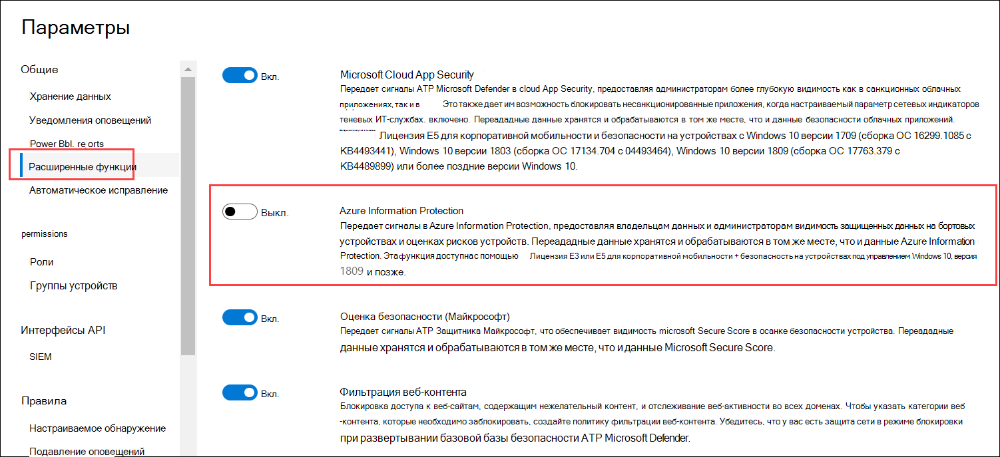
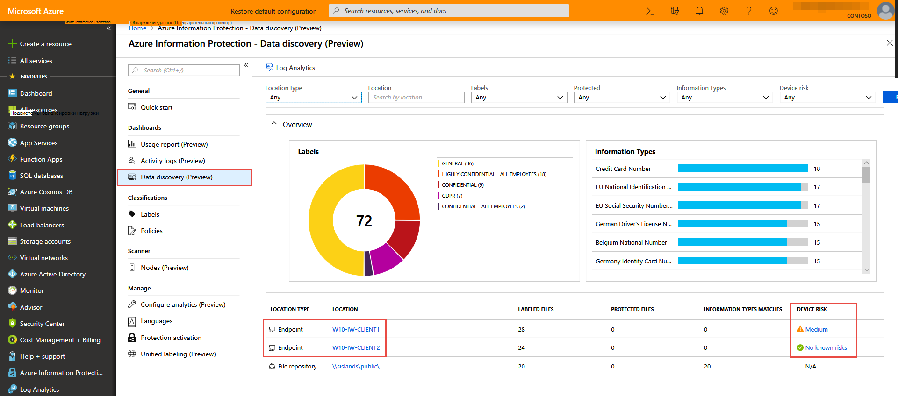

# <a name="information-protection-in-windows-overview"></a>Обзор Information Protection в Windows

[!INCLUDE [Microsoft 365 Defender rebranding](../../includes/microsoft-defender.md)]

**Область применения:**

- [Microsoft Defender для конечной точки](https://go.microsoft.com/fwlink/p/?linkid=2154037)
- [Microsoft 365 Defender](https://go.microsoft.com/fwlink/?linkid=2118804)

> Хотите испытать Defender для конечной точки? [Зарегистрився для бесплатной пробной.](https://www.microsoft.com/microsoft-365/windows/microsoft-defender-atp?ocid=docs-wdatp-exposedapis-abovefoldlink) 


[!include[Prerelease information](../../includes/prerelease.md)]

Защита информации является неотъемлемой частью пакета Microsoft 365 Enterprise, обеспечивая интеллектуальную защиту для обеспечения безопасности конфиденциальных данных, обеспечивая при этом производительность на рабочем месте.


>[!TIP]
> Ознакомьтесь с нашим сообщением в блоге о том, как Microsoft Defender для конечной точки интегрируется с Microsoft Information Protection для обнаружения, защиты и мониторинга конфиденциальных данных [на устройствах Windows.](https://cloudblogs.microsoft.com/microsoftsecure/2019/01/17/windows-defender-atp-integrates-with-microsoft-information-protection-to-discover-protect-and-monitor-sensitive-data-on-windows-devices/)

Defender for Endpoint применяет следующие методы обнаружения, классификации и защиты данных:

- **Обнаружение данных** . Определение конфиденциальных данных на устройствах с Windows в опасности
- **Классификация** данных — автоматически классифицировать данные на основе общих политик microsoft Information Protection (MIP), управляемых в Центре безопасности Office 365 & соответствия требованиям. Автоматическая классификация позволяет защищать конфиденциальные данные, даже если конечный пользователь не классифицировал их вручную.


## <a name="data-discovery-and-data-classification"></a>Обнаружение данных и классификация данных

Defender for Endpoint автоматически обнаруживает файлы с метами конфиденциальности и файлы, содержащие типы конфиденциальной информации.

Метки конфиденциальности классифицируют и помогают защитить конфиденциальный контент.

Типы конфиденциальной информации в реализации office 365 по предотвращению потери данных (DLP) подпадают под две категории:

- По умолчанию
- Пользовательские

Типы конфиденциальной информации по умолчанию включают такие сведения, как номера банковских счетов, номера социального страхования или национальные ID. Дополнительные сведения см. [в дополнительных сведениях о том, как выглядит тип конфиденциальной информации.](https://docs.microsoft.com/office365/securitycompliance/what-the-sensitive-information-types-look-for)

Настраиваемые типы — это те типы, которые вы определяете и предназначено для защиты конфиденциальной информации другого типа (например, номеров сотрудников или номеров проектов). Дополнительные сведения см. [введите настраиваемый тип конфиденциальной информации.](https://docs.microsoft.com/office365/securitycompliance/create-a-custom-sensitive-information-type)

Когда файл создается или редактируется на устройстве Windows, Defender for Endpoint сканирует содержимое, чтобы оценить, содержится ли в нем конфиденциальную информацию.

Включив интеграцию Azure Information Protection, чтобы когда файл, содержащий конфиденциальные сведения, был обнаружен Защитником для конечной точки, хотя метки или типы информации, он автоматически передается в Azure Information Protection с устройства.



Отчетные сигналы можно просмотреть на панели данных Azure Information Protection — Data discovery.

## <a name="azure-information-protection---data-discovery-dashboard"></a>Azure Information Protection — панель мониторинга обнаружения данных

На этой панели мониторинга представлена сводная информация об обнаружении данных, обнаруженных как Защитником для конечной точки, так и Azure Information Protection. Данные из Defender для конечной точки отмечены типом расположения — конечной точкой.



Обратите внимание на столбец риск устройства справа, этот риск устройства выводится непосредственно из Defender для конечной точки, указав уровень риска устройства безопасности, на котором был обнаружен файл, на основе активных угроз безопасности, обнаруженных Defender для конечной точки.

Щелкните на устройстве, чтобы просмотреть список файлов, наблюдаемых на этом устройстве, с метами и типами сведений о конфиденциальности.

>[!NOTE]
>Дайте примерно 15-20 минут на обнаружение панели мониторинга информационной защиты Azure для отражения обнаруженных файлов.

## <a name="log-analytics"></a>Аналитика журналов

Обнаружение данных на основе Defender для конечной точки также доступно в [Azure Log Analytics,](https://docs.microsoft.com/azure/log-analytics/log-analytics-overview)где можно выполнять сложные запросы по необработанных данных.

Дополнительные сведения об аналитике azure Information Protection см. в центре [отчетов для Azure Information Protection.](https://docs.microsoft.com/azure/information-protection/reports-aip)

Откройте Azure Log Analytics на портале Azure и откройте строитель запросов (стандартный или классический).

Чтобы просмотреть данные Defender для конечных точек, выполните запрос, содержащий:

```
InformationProtectionLogs_CL
| where Workload_s == "Windows Defender"
```

**Необходимые условия:**

- Клиенты должны иметь подписку на Azure Information Protection.
- Включение интеграции Azure information Protection в Центре безопасности Microsoft Defender:
    - Перейдите **к параметрам** в Центре безопасности защитника Майкрософт, щелкните **расширенные параметры** под **общим .**


