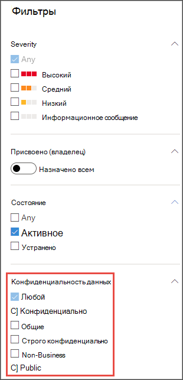
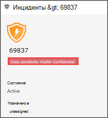
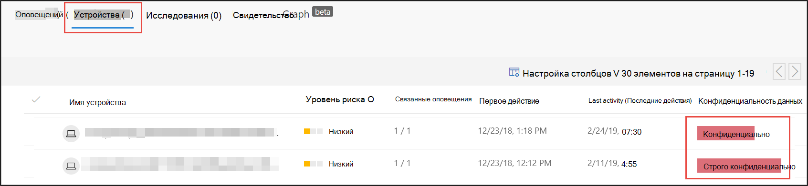
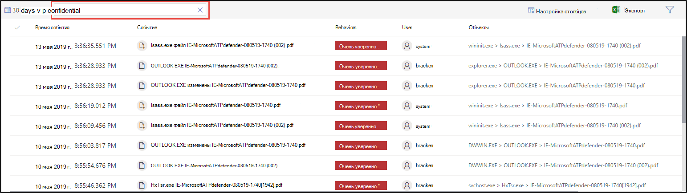

# Использование меток конфиденциальности для определения приоритетов реагирования на инцидентыUse sensitivity labels to prioritize incident response  

[!INCLUDE [Microsoft 365 Defender rebranding](../../includes/microsoft-defender.md)]

**Область применения:****Applies to:**
- [Microsoft Defender для конечной точкиMicrosoft Defender for Endpoint](https://go.microsoft.com/fwlink/p/?linkid=2154037)
- [Microsoft 365 DefenderMicrosoft 365 Defender](https://go.microsoft.com/fwlink/?linkid=2118804)

> Хотите испытать Defender для конечной точки?Want to experience Defender for Endpoint? [Зарегистрився для бесплатной пробной.Sign up for a free trial.](https://www.microsoft.com/microsoft-365/windows/microsoft-defender-atp?ocid=docs-wdatp-exposedapis-abovefoldlink) 

Типичный расширенный жизненный цикл сохраняемой угрозы включает эксфильтрация данных.A typical advanced persistent threat lifecycle involves data exfiltration. При инциденте с безопасностью важно иметь возможность приоритизировать расследования, в которых конфиденциальные файлы могут быть под угрозой, чтобы корпоративные данные и сведения были защищены.In a security incident, it's important to have the ability to prioritize investigations where sensitive files may be jeopardy so that corporate data and information are protected.

Defender for Endpoint позволяет значительно упростить приоритеты инцидентов безопасности с помощью меток конфиденциальности.Defender for Endpoint helps to make the prioritization of security incidents much simpler with the use of sensitivity labels. Метки конфиденциальности быстро выявляют инциденты, которые могут включать устройства с конфиденциальной информацией, например конфиденциальной информацией.Sensitivity labels quickly identify incidents that may involve devices with sensitive information such as confidential information. 

## Расследование инцидентов с конфиденциальными даннымиInvestigate incidents that involve sensitive data
Узнайте, как использовать метки конфиденциальности данных для приоритетов расследования инцидентов.Learn how to use data sensitivity labels to prioritize incident investigation.

>[!NOTE]
>Метки обнаруживаются для Windows 10 версии 1809 или более поздней версии.Labels are detected for Windows 10, version 1809 or later.

1. В Центр безопасности в Microsoft Defender выберите **Инциденты**.In Microsoft Defender Security Center, select **Incidents**. 

2. Прокрутите вправо, чтобы увидеть столбец **"Чувствительность к данным".**Scroll to the right to see the **Data sensitivity** column. В этом столбце отражены метки чувствительности, которые были замечены на устройствах, связанных с инцидентами, что указывает на то, может ли инцидент повлиять на конфиденциальные файлы.This column reflects sensitivity labels that have been observed on devices related to the incidents providing an indication of whether sensitive files may be impacted by the incident.

    

    Можно также фильтровать на основе **чувствительности к данным**You can also filter based on **Data sensitivity** 

    

3. Откройте страницу инцидента для дальнейшего расследования.Open the incident page to further investigate.

    

4. Выберите **вкладку Devices,** чтобы определить устройства, хранимые файлы с метками конфиденциальности.Select the **Devices** tab to identify devices storing files with sensitivity labels.

    
   

5. Выберите устройства, на которых хранятся конфиденциальные данные и которые будут искать в временной шкале, чтобы определить, какие файлы могут повлиять, затем примите соответствующие меры для обеспечения защиты данных.Select the devices that store sensitive data and search through the timeline to identify which files may be impacted then take appropriate action to ensure that data is protected. 

   Вы можете сузить события, показанные на временной шкале устройства, ища метки чувствительности к данным.You can narrow down the events shown on the device timeline by searching for data sensitivity labels. При этом будут показываться только события, связанные с файлами с именем метки.Doing this will show only events associated with files that have said label name.

    

>[!TIP]
>Эти точки данных также выявляются с помощью "DeviceFileEvents" в продвинутой охоте, что позволяет расширенным запросам и обнаружению расписания учитывать метки чувствительности и состояние защиты файлов.These data points are also exposed through the ‘DeviceFileEvents’ in advanced hunting, allowing advanced queries and schedule detection to take into account sensitivity labels and file protection status. 
