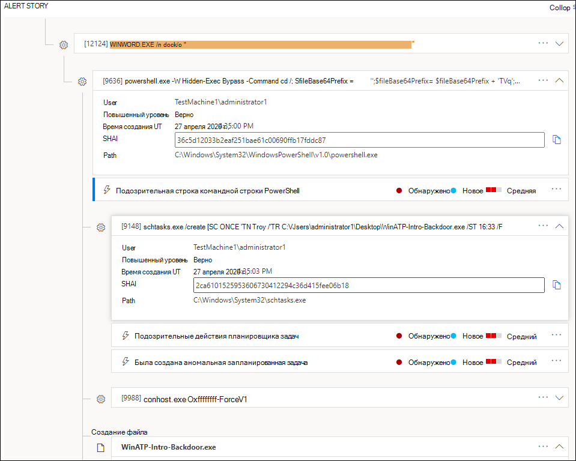
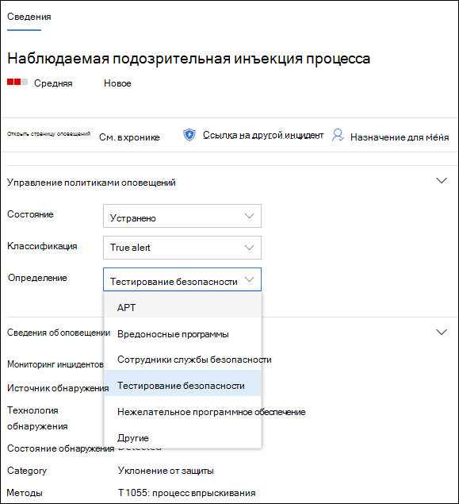
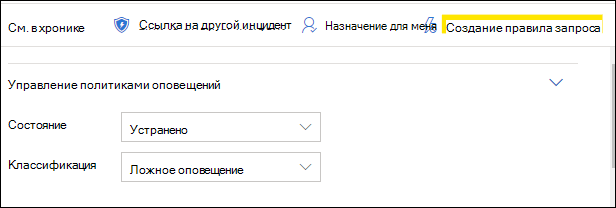

# Исследование оповещений в Microsoft Defender для конечной точки

[!INCLUDE [Microsoft 365 Defender rebranding](../../includes/microsoft-defender.md)]

**Область применения:**
- [Microsoft Defender для конечной точки](https://go.microsoft.com/fwlink/p/?linkid=2146631)
- [Microsoft 365 Defender](https://go.microsoft.com/fwlink/?linkid=2118804)

>Хотите испытать Defender для конечной точки? [Зарегистрився для бесплатной пробной.](https://www.microsoft.com/microsoft-365/windows/microsoft-defender-atp?ocid=docs-wdatp-investigatealerts-abovefoldlink) 

Изучите оповещения, влияющие на вашу сеть, поймите, что они означают, и как их устранить.

Выберите оповещение из очереди оповещений, чтобы перейти на страницу оповещения. В этом представлении содержится название оповещения, затронутые активы, боковые области сведений и история оповещений.

На странице оповещение начните расследование с выбора затронутых активов или любых сущностями в представлении дерева истории оповещения. Области данных автоматически заполняются дополнительными сведениями о выбранном. Чтобы узнать, какие сведения можно просмотреть здесь, ознакомьтесь с оповещениями [Review в Microsoft Defender для конечной точки.](https://docs.microsoft.com/microsoft-365/security/defender-endpoint/review-alerts)

## Исследование с помощью истории оповещений

В истории оповещений рассказывается о срабатывном оповещении, связанных событиях, которые произошли до и после, а также других связанных с ними сущностях.

Объекты являются щелкаемыми, и все объекты, которые не являются оповещением, расширяются с помощью значка расширения на правой стороне карты этого объекта. Объект в фокусе будет указан синей полосой на левой стороне карточки этого объекта, а оповещение в заголовке сначала будет в центре внимания.

Расширь сущностями, чтобы просмотреть сведения с первого взгляда. Выбор объекта переключит контекст области данных на эту сущность и позволит вам просмотреть дополнительные сведения, а также управлять этим объектом. Выбор *...* справа от карточки сущности покажет все действия, доступные для этого объекта. Эти же действия отображаются в области сведений, когда объект находится в фокусе.

> [!NOTE]
> В разделе история оповещения может содержаться несколько оповещений, при этом дополнительные оповещения, связанные с одним деревом выполнения, отображаются до или после выбранного оповещения.

## Действие из области сведений

После выбора объекта, интересуемого, области сведений будут отображаться сведения о выбранном типе объекта, исторические сведения,  когда она доступна, и предлагают элементы управления для принятия действий по этому объекту непосредственно со страницы оповещения.

После того как вы закончили исследование, возвращайся к запущенной оповещению, пометив состояние оповещений как **Разрешено** и классифицировать его как false **alert** или **True alert**. Классификация оповещений помогает настроить эту возможность, чтобы обеспечить более верные оповещения и меньше ложных оповещений.

Если классифицировать его как настоящее оповещение, можно также выбрать определение, как показано на рисунке ниже.

Если вы столкнулись с ложным оповещением с помощью бизнес-приложения, создайте правило подавления, чтобы избежать такого оповещения в будущем.

> [!TIP]
> Если у вас возникли проблемы, не описанные выше, используйте кнопку для предоставления отзывов 🙂 или открытия билета поддержки.

## Статьи по теме
- [Просмотр и организация очереди оповещений Microsoft Defender для конечных точек](alerts-queue.md)
- [Управление оповещениями Защитника Майкрософт для конечных точек](manage-alerts.md)
- [Исследование файла, связанного с предупреждением Defender for Endpoint](investigate-files.md)
- [Исследование устройств в списке устройств Defender для конечных точек](investigate-machines.md)
- [Исследование IP-адреса, связанного с оповещением Defender for Endpoint](investigate-ip.md)
- [Исследование домена, связанного с предупреждением Defender for Endpoint](investigate-domain.md)
- [Исследование учетной записи пользователя в Defender для конечной точки](investigate-user.md)

