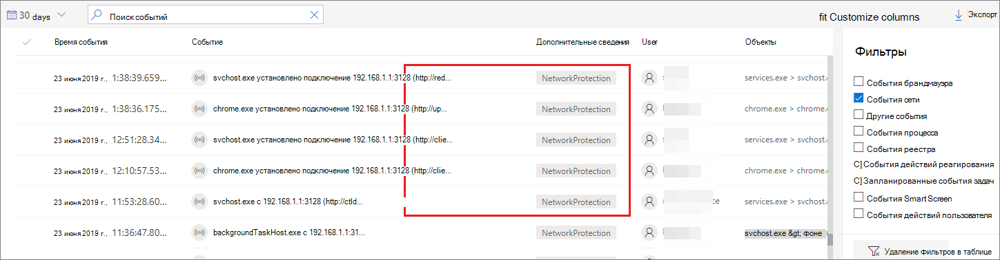
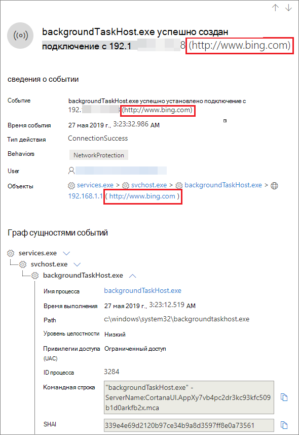

# <a name="investigate-connection-events-that-occur-behind-forward-proxies"></a><span data-ttu-id="ba88f-104">Изучение событий подключения, которые происходят за прокси-сайтами</span><span class="sxs-lookup"><span data-stu-id="ba88f-104">Investigate connection events that occur behind forward proxies</span></span>

[!INCLUDE [Microsoft 365 Defender rebranding](../../includes/microsoft-defender.md)]

<span data-ttu-id="ba88f-105">**Область применения:**</span><span class="sxs-lookup"><span data-stu-id="ba88f-105">**Applies to:**</span></span>
- [<span data-ttu-id="ba88f-106">Microsoft Defender для конечной точки</span><span class="sxs-lookup"><span data-stu-id="ba88f-106">Microsoft Defender for Endpoint</span></span>](https://go.microsoft.com/fwlink/p/?linkid=2154037)
- [<span data-ttu-id="ba88f-107">Microsoft 365 Defender</span><span class="sxs-lookup"><span data-stu-id="ba88f-107">Microsoft 365 Defender</span></span>](https://go.microsoft.com/fwlink/?linkid=2118804)

> <span data-ttu-id="ba88f-108">Хотите испытать Defender для конечной точки?</span><span class="sxs-lookup"><span data-stu-id="ba88f-108">Want to experience Defender for Endpoint?</span></span> [<span data-ttu-id="ba88f-109">Зарегистрився для бесплатной пробной.</span><span class="sxs-lookup"><span data-stu-id="ba88f-109">Sign up for a free trial.</span></span>](https://www.microsoft.com/microsoft-365/windows/microsoft-defender-atp?ocid=docs-wdatp-investigatemachines-abovefoldlink)

<span data-ttu-id="ba88f-110">Defender for Endpoint поддерживает мониторинг сетевого подключения с разных уровней сетевого стека.</span><span class="sxs-lookup"><span data-stu-id="ba88f-110">Defender for Endpoint supports network connection monitoring from different levels of the network stack.</span></span> <span data-ttu-id="ba88f-111">Сложный случай, когда сеть использует прокси-сервер в качестве шлюза в Интернет.</span><span class="sxs-lookup"><span data-stu-id="ba88f-111">A challenging case is when the network uses a forward proxy as a gateway to the Internet.</span></span>

<span data-ttu-id="ba88f-112">Прокси-сервер действует так, как если бы это была целевая конечная точка.</span><span class="sxs-lookup"><span data-stu-id="ba88f-112">The proxy acts as if it was the target endpoint.</span></span>  <span data-ttu-id="ba88f-113">В этих случаях простые мониторы сетевого подключения проверяют подключение к прокси-серверу, который является правильным, но имеет более низкое значение для исследования.</span><span class="sxs-lookup"><span data-stu-id="ba88f-113">In these cases, simple network connection monitors will audit the connections with the proxy which is correct but has lower investigation value.</span></span> 

<span data-ttu-id="ba88f-114">Defender for Endpoint поддерживает расширенный мониторинг уровня HTTP с помощью защиты сети.</span><span class="sxs-lookup"><span data-stu-id="ba88f-114">Defender for Endpoint supports advanced HTTP level monitoring through network protection.</span></span> <span data-ttu-id="ba88f-115">При включенном включаемом событии всплыл новый тип события, который предоставляет реальные целевые доменные имена.</span><span class="sxs-lookup"><span data-stu-id="ba88f-115">When turned on, a new type of event is surfaced which exposes the real target domain names.</span></span>

## <a name="use-network-protection-to-monitor-network-connection-behind-a-firewall"></a><span data-ttu-id="ba88f-116">Защита сети для мониторинга сетевого подключения за брандмауэром</span><span class="sxs-lookup"><span data-stu-id="ba88f-116">Use network protection to monitor network connection behind a firewall</span></span>
<span data-ttu-id="ba88f-117">Мониторинг сетевого подключения за прокси-сервером можно за счет дополнительных сетевых событий, происходящих из защиты сети.</span><span class="sxs-lookup"><span data-stu-id="ba88f-117">Monitoring network connection behind a forward proxy is possible due to additional network events that originate from network protection.</span></span> <span data-ttu-id="ba88f-118">Чтобы увидеть их на временной шкале устройства, включим защиту сети (как минимум в режиме аудита).</span><span class="sxs-lookup"><span data-stu-id="ba88f-118">To see them on a device timeline, turn network protection on (at the minimum in audit mode).</span></span> 

<span data-ttu-id="ba88f-119">Защита сети можно контролировать с помощью следующих режимов:</span><span class="sxs-lookup"><span data-stu-id="ba88f-119">Network protection can be controlled using the following modes:</span></span>

- <span data-ttu-id="ba88f-120">**Блокировка**</span><span class="sxs-lookup"><span data-stu-id="ba88f-120">**Block**</span></span> <br> <span data-ttu-id="ba88f-121">Пользователям или приложениям будет заблокировано подключение к опасным доменам.</span><span class="sxs-lookup"><span data-stu-id="ba88f-121">Users or apps will be blocked from connecting to dangerous domains.</span></span> <span data-ttu-id="ba88f-122">Вы сможете увидеть это действие в Центре безопасности Защитника Майкрософт.</span><span class="sxs-lookup"><span data-stu-id="ba88f-122">You will be able to see this activity in Microsoft Defender Security Center.</span></span>
- <span data-ttu-id="ba88f-123">**Audit**</span><span class="sxs-lookup"><span data-stu-id="ba88f-123">**Audit**</span></span> <br> <span data-ttu-id="ba88f-124">Пользователям или приложениям не будет заблокировано подключение к опасным доменам.</span><span class="sxs-lookup"><span data-stu-id="ba88f-124">Users or apps will not be blocked from connecting to dangerous domains.</span></span> <span data-ttu-id="ba88f-125">Однако вы все равно увидите это действие в Центре безопасности Защитника Майкрософт.</span><span class="sxs-lookup"><span data-stu-id="ba88f-125">However, you will still see this activity in Microsoft Defender Security Center.</span></span>


<span data-ttu-id="ba88f-126">Если отключить защиту сети, пользователям или приложениям не будет заблокировано подключение к опасным доменам.</span><span class="sxs-lookup"><span data-stu-id="ba88f-126">If you turn network protection off, users or apps will not be blocked from connecting to dangerous domains.</span></span> <span data-ttu-id="ba88f-127">Вы не увидите сетевой активности в Центре безопасности Microsoft Defender.</span><span class="sxs-lookup"><span data-stu-id="ba88f-127">You will not see any network activity in Microsoft Defender Security Center.</span></span>

<span data-ttu-id="ba88f-128">Если его не настроить, блокировка сети будет отключена по умолчанию.</span><span class="sxs-lookup"><span data-stu-id="ba88f-128">If you do not configure it, network blocking will be turned off by default.</span></span>

<span data-ttu-id="ba88f-129">Дополнительные сведения см. в [дополнительных сведениях о защите сети.](enable-network-protection.md)</span><span class="sxs-lookup"><span data-stu-id="ba88f-129">For more information, see [Enable network protection](enable-network-protection.md).</span></span>

## <a name="investigation-impact"></a><span data-ttu-id="ba88f-130">Влияние на исследование</span><span class="sxs-lookup"><span data-stu-id="ba88f-130">Investigation impact</span></span>
<span data-ttu-id="ba88f-131">Когда включена защита сети, вы увидите, что на временной шкале устройства IP-адрес будет представлять прокси-сервер, а реальный целевой адрес будет показан.</span><span class="sxs-lookup"><span data-stu-id="ba88f-131">When network protection is turned on, you'll see that on a device's timeline the IP address will keep representing the proxy, while the real target address shows up.</span></span>



<span data-ttu-id="ba88f-133">Дополнительные события, запускаемые на уровне защиты сети, теперь доступны для поверхности реальных имен домена даже за прокси-сервером.</span><span class="sxs-lookup"><span data-stu-id="ba88f-133">Additional events triggered by the network protection layer are now available to surface the real domain names even behind a proxy.</span></span>

<span data-ttu-id="ba88f-134">Сведения о событии:</span><span class="sxs-lookup"><span data-stu-id="ba88f-134">Event's information:</span></span>




## <a name="hunt-for-connection-events-using-advanced-hunting"></a><span data-ttu-id="ba88f-136">Поиск событий подключения с помощью расширенных методов охоты</span><span class="sxs-lookup"><span data-stu-id="ba88f-136">Hunt for connection events using advanced hunting</span></span> 
<span data-ttu-id="ba88f-137">Все новые события подключения доступны для вас, чтобы охотиться на с помощью расширенных охоты, а также.</span><span class="sxs-lookup"><span data-stu-id="ba88f-137">All new connection events are available for you to hunt on through advanced hunting as well.</span></span> <span data-ttu-id="ba88f-138">Так как эти события являются событиями подключения, их можно найти в таблице DeviceNetworkEvents под `ConnecionSuccess` типом действия.</span><span class="sxs-lookup"><span data-stu-id="ba88f-138">Since these events are connection events, you can find them under the DeviceNetworkEvents table under the `ConnecionSuccess` action type.</span></span>

<span data-ttu-id="ba88f-139">С помощью этого простого запроса вы сможете показать все соответствующие события:</span><span class="sxs-lookup"><span data-stu-id="ba88f-139">Using this simple query will show you all the relevant events:</span></span>

```
DeviceNetworkEvents
| where ActionType == "ConnectionSuccess" 
| take 10
```


<span data-ttu-id="ba88f-141">Можно также отфильтровать события, связанные с подключением к самому прокси-серверу.</span><span class="sxs-lookup"><span data-stu-id="ba88f-141">You can also filter out  events that are related to connection to the proxy itself.</span></span> 

<span data-ttu-id="ba88f-142">Для фильтрации подключений к прокси-серверу используйте следующий запрос:</span><span class="sxs-lookup"><span data-stu-id="ba88f-142">Use the following query to filter out the connections to the proxy:</span></span>

```
DeviceNetworkEvents
| where ActionType == "ConnectionSuccess" and RemoteIP != "ProxyIP"  
| take 10
```


## <a name="related-topics"></a><span data-ttu-id="ba88f-143">Статьи по теме</span><span class="sxs-lookup"><span data-stu-id="ba88f-143">Related topics</span></span>
- [<span data-ttu-id="ba88f-144">Применение защиты сети с помощью GP - CSP политики</span><span class="sxs-lookup"><span data-stu-id="ba88f-144">Applying network protection with GP - policy CSP</span></span>](https://docs.microsoft.com/windows/client-management/mdm/policy-csp-defender#defender-enablenetworkprotection)
