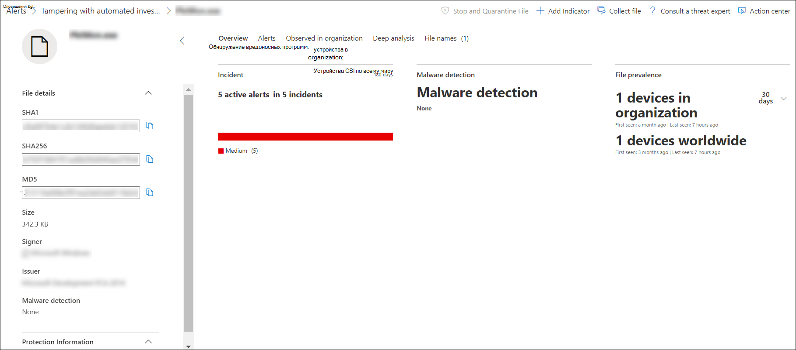
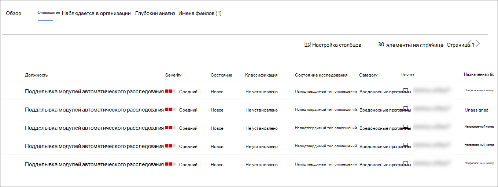
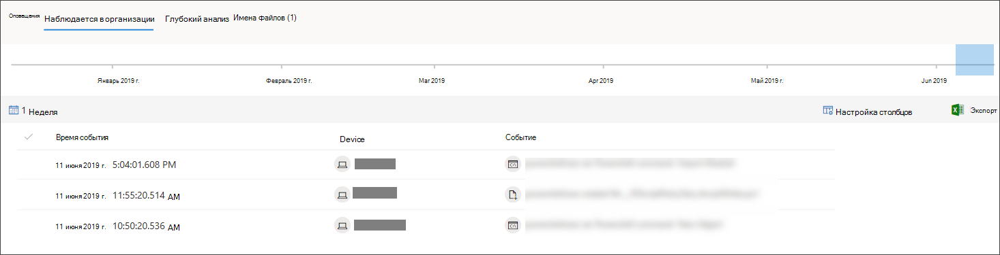

# Исследование файла, связанного с оповещением Microsoft Defender для конечных точекInvestigate a file associated with a Microsoft Defender for Endpoint alert

[!INCLUDE [Microsoft 365 Defender rebranding](../../includes/microsoft-defender.md)]

**Область применения:****Applies to:**
- [Microsoft Defender для конечной точкиMicrosoft Defender for Endpoint](https://go.microsoft.com/fwlink/p/?linkid=2154037)
- [Microsoft 365 DefenderMicrosoft 365 Defender](https://go.microsoft.com/fwlink/?linkid=2118804)

>Хотите испытать Defender для конечной точки?Want to experience Defender for Endpoint? [Зарегистрився для бесплатной пробной.Sign up for a free trial.](https://www.microsoft.com/microsoft-365/windows/microsoft-defender-atp?ocid=docs-wdatp-investigatefiles-abovefoldlink)

Изучите сведения о файле, связанном с определенным предупреждением, поведением или событием, чтобы определить, есть ли в файле вредоносные действия, определить мотивацию атаки и понять потенциальную область нарушения.Investigate the details of a file associated with a specific alert, behavior, or event to help determine if the file exhibits malicious activities, identify the attack motivation, and understand the potential scope of the breach.

Существует множество способов доступа к подробной странице профиля определенного файла.There are many ways to access the detailed profile page of a specific file. Например, можно использовать функцию поиска, щелкнуть ссылку из дерева процесса **оповещения,** графика инцидентов, временной шкалы **артефактов** или выбрать событие, перечисленное в временной шкале **Устройства.**For example, you can  use the search feature, click on a link from the **Alert process tree**, **Incident graph**, **Artifact timeline**, or select an event listed in the **Device timeline**.

После на подробной странице профиля можно переключаться между макетами новых и старых страниц, переключая новую страницу **File.**Once on the detailed profile page, you can switch between the new and old page layouts by toggling **new File page**. В остальной части этой статьи описывается более новая схема страницы.The rest of this article describes the newer page layout.

Сведения можно получить из следующих разделов в представлении файла:You can get information from the following sections in the file view:

- Сведения о файлах, обнаружение вредоносных программ, распространенность файловFile details, Malware detection, File prevalence
- Глубокий анализDeep analysis
- ОповещенияAlerts
- Наблюдается в организацииObserved in organization
- Глубокий анализDeep analysis
- Имена файловFile names

Вы также можете принять меры к файлу на этой странице.You can also take action on a file from this page.

## Действия файлаFile actions

В верхней части страницы профиля, над карточками информации о файлах.Along the top of the profile page, above the file information cards. Действия, которые можно выполнить здесь, включают:Actions you can perform here include:

- Остановка и карантинStop and quarantine
- Индикатор add/editAdd/edit indicator
- Скачивание файлаDownload file
- Обратитесь к эксперту по угрозамConsult a threat expert
- Центр уведомленийAction center

Дополнительные сведения об этих действиях см. в [материалах Take response action on a file.](respond-file-alerts.md)For more information on these actions, see [Take response action on a file](respond-file-alerts.md).

## Сведения о файлах, обнаружение вредоносных программ и распространенность файловFile details, Malware detection, and File prevalence

Сведения о файлах, инциденты, обнаружение вредоносных программ и карты распространения файлов отображают различные атрибуты о файле.The file details, incident, malware detection, and file prevalence cards display various attributes about the file.

Вы увидите такие сведения, как MD5 файла, коэффициент обнаружения общего числа вирусов и обнаружение AV Microsoft Defender, а также распространенность файла.You'll see details such as the file’s MD5, the Virus Total detection ratio, and Microsoft Defender AV detection if available, and the file’s prevalence.

Карта распространенности файлов показывает, где файл был замечен на устройствах в организации и во всем мире.The file prevalence card shows where the file was seen in devices in the organization and worldwide. 

> [!NOTE] 
> Различные пользователи могут видеть разные значения на устройствах в *разделе организации* карты распространения файлов.Different users may see dissimilar values in the *devices in organization* section of the file prevalence card. Это происходит из-за того, что на карте отображаются сведения, основанные на области RBAC, которую имеет пользователь.This is because the card displays information based on the RBAC scope that a user has. Это означает, что если пользователю была предоставлена видимость на определенном наборе устройств, он будет видеть только преобладание файлов на этих устройствах.Meaning, if a user has been granted visibility on a specific set of devices, they will only see the file organizational prevalence on those devices.

## ОповещенияAlerts

Вкладка **Alerts** содержит список оповещений, связанных с файлом.The **Alerts** tab provides a list of alerts that are associated with the file. Этот список охватывает большую часть той же информации, что и очередь оповещений, за исключением группы устройств, если она имеется, к которой относится затронутное устройство.This list covers much of the same information as the Alerts queue, except for the device group, if any, the affected device belongs to. Вы можете выбрать, какие сведения показаны, выбрав настраивать столбцы из панели инструментов над загонами столбцов. You can choose what kind of information is shown by selecting **Customize columns** from the toolbar above the column headers.

## Наблюдается в организацииObserved in organization

Вкладка **Observed в организации** позволяет указать диапазон дат, чтобы увидеть, какие устройства были замечены с файлом.The **Observed in organization** tab allows you to specify a date range to see which devices have been observed with the file.

>[!NOTE]
>Эта вкладка будет показывать максимальное число 100 устройств.This tab will show a maximum number of 100 devices. Чтобы увидеть _все_ устройства с файлом, экспортировать вкладку в  CSV-файл, выбрав экспорт из меню действий над столбцами столбцов вкладки.To see _all_ devices with the file, export the tab to a CSV file, by selecting **Export** from the action menu above the tab's column headers.

Используйте ползунок или селектор диапазона, чтобы быстро указать период времени, который необходимо проверить на события, связанные с файлом.Use the slider or the range selector to quickly specify a time period that you want to check for events involving the file. Вы можете указать окно времени размером с один день.You can specify a time window as small as a single day. Это позволит вам видеть только файлы, которые связывались с этим IP-адресом в то время, резко сокращая ненужные прокрутки и поиск.This will allow you to see only files that communicated with that IP Address at that time, drastically reducing unnecessary scrolling and searching.

## Глубокий анализDeep analysis

Вкладка **Deep analysis** позволяет отправлять файл для глубокого [анализа,](respond-file-alerts.md#deep-analysis)чтобы узнать больше сведений о поведении файла, а также о его последствиях в организациях.The **Deep analysis** tab allows you to [submit the file for deep analysis](respond-file-alerts.md#deep-analysis), to uncover more details about the file's behavior, as well as the effect it is having within your organizations. После отправки файла отчет о глубоком анализе появится на этой вкладке после появления результатов.After you submit the file, the deep analysis report will appear in this tab once results are available. Если глубокий анализ ничего не нашел, отчет будет пустым, а пространство результатов останется пустым.If deep analysis did not find anything, the report will be empty and the results space will remain blank.

## Имена файловFile names

На **вкладке Имена** файлов перечислены все имена, которые были замечены в вашем файле, в организациях.The **File names** tab lists all names the file has been observed to use, within your organizations.

## Статьи по темеRelated topics

- [Просмотр и организация очереди Microsoft Defender для конечных точекView and organize the Microsoft Defender for Endpoint queue](alerts-queue.md)
- [Управление оповещениями Защитника Майкрософт для конечных точекManage Microsoft Defender for Endpoint alerts](manage-alerts.md)
- [Исследование оповещений Microsoft Defender для конечных точекInvestigate Microsoft Defender for Endpoint alerts](investigate-alerts.md)
- [Исследование устройств в списке Устройств конечных точек Microsoft Defender для конечных точекInvestigate devices in the Microsoft Defender for Endpoint Devices list](investigate-machines.md)
- [Исследование IP-адреса, связанного с оповещением Microsoft Defender for EndpointInvestigate an IP address associated with a Microsoft Defender for Endpoint alert](investigate-ip.md)
- [Исследование домена, связанного с оповещением Microsoft Defender for EndpointInvestigate a domain associated with a Microsoft Defender for Endpoint alert](investigate-domain.md)
- [Исследование учетной записи пользователя в Microsoft Defender для конечной точкиInvestigate a user account in Microsoft Defender for Endpoint](investigate-user.md)
- [Действия отклика в файлеTake response actions on a file](respond-file-alerts.md)
