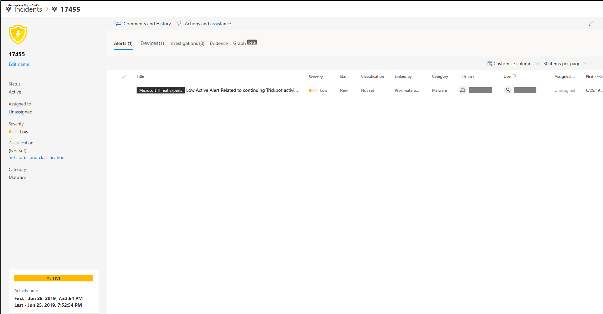
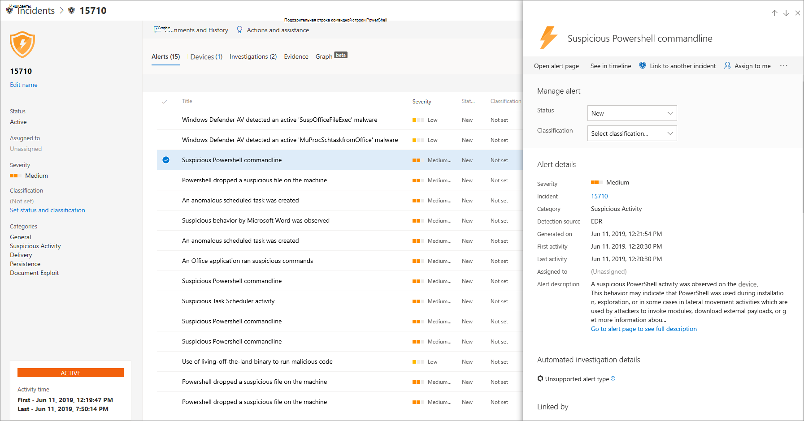
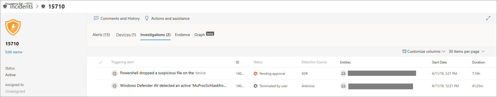
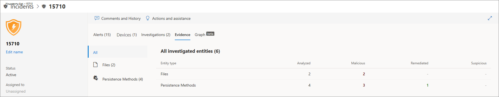
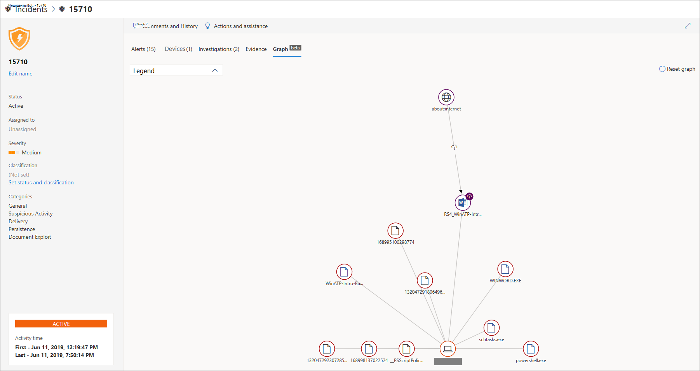
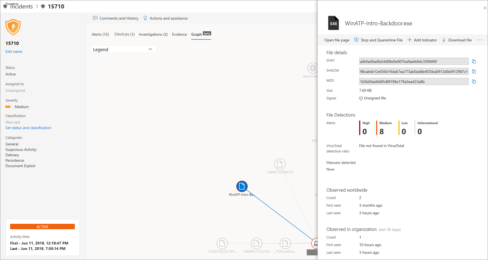

# Расследование инцидентов в Microsoft Defender для конечной точки

[!INCLUDE [Microsoft 365 Defender rebranding](../../includes/microsoft-defender.md)]

**Область применения:**
- [Microsoft Defender для конечной точки](https://go.microsoft.com/fwlink/p/?linkid=2146631)
- [Microsoft 365 Defender](https://go.microsoft.com/fwlink/?linkid=2118804)

Изучите инциденты, влияющие на вашу сеть, поймите, что они означают, и собери доказательства для их устранения. 

При расследовании инцидента вы увидите:
- Сведения об инциденте
- Комментарии и действия инцидента
- Вкладки (оповещения, устройства, исследования, доказательства, график)

> [!VIDEO https://www.microsoft.com/en-us/videoplayer/embed/RE4qLUV]

## Анализ сведений об инцидентах 
Щелкните инцидент, чтобы увидеть области **Инцидента**. Выберите **страницу Открытый** инцидент, чтобы увидеть сведения об инциденте и связанные с ними сведения (оповещения, устройства, расследования, доказательства, график). 

### Оповещения
Вы можете исследовать оповещения и видеть, как они были связаны друг с другом в инциденте. Оповещения сгруппируются в инциденты по следующим причинам:
- Автоматическое расследование . Автоматическое расследование вызвало связанное оповещение при расследовании исходного оповещения 
- Характеристики файла . Файлы, связанные с оповещением, имеют схожие характеристики
- Ручная связь . Пользователь вручную связал оповещения
- Proximate time — оповещения запускались на одном устройстве в течение определенного времени.
- Тот же файл . Файлы, связанные с оповещением, точно такие же
- Тот же URL-адрес. URL-адрес, который вызвал оповещение, точно такой же.

Вы также можете управлять оповещением и видеть метаданные оповещения вместе с другими сведениями. Дополнительные сведения см. в [дополнительных сведениях.](investigate-alerts.md) 

### Устройства
Вы также можете исследовать устройства, которые являются частью данного инцидента или связаны с ним. Дополнительные сведения см. в [дополнительных сведениях.](investigate-machines.md)

### Исследования
Выберите **исследование,** чтобы увидеть все автоматические расследования, запущенные системой в ответ на оповещения об инциденте.

## Проявка доказательств
Microsoft Defender для конечной точки автоматически исследует все поддерживаемые инцидентами события и подозрительные объекты в оповещении, предоставляя автоответчи и сведения о важных файлах, процессах, службах и других. 

Каждый из проанализировавших сущностям будет помечен как зараженный, исправленный или подозрительный. 

## Визуализация связанных угроз кибербезопасности 
Microsoft Defender для конечной точки агрегируется сведения об угрозах в инцидент, чтобы вы могли видеть шаблоны и корреляции, исходящую из различных точек данных. Такую корреляцию можно просмотреть с помощью диаграммы инцидентов.

### График инцидентов
В **графе** рассказывается история атаки на кибербезопасность. Например, он показывает, что было точкой входа, какой индикатор компромисса или активности был замечен на каком устройстве. и т.д.

Вы можете щелкнуть круги на графике инцидентов, чтобы просмотреть сведения о вредоносных файлах, связанных обнаружениях файлов, о том, сколько экземпляров было по всему миру, наблюдалось ли это в организации, если да, то сколько экземпляров.

## Статьи по теме
- [Очередь инцидентов](https://docs.microsoft.com/microsoft-365/security/defender-endpoint/view-incidents-queue)
- [Расследование инцидентов в Microsoft Defender для конечной точки](https://docs.microsoft.com/microsoft-365/security/defender-endpoint/investigate-incidents)
- [Управление microsoft Defender для инцидентов конечной точки](https://docs.microsoft.com/microsoft-365/security/defender-endpoint/manage-incidents)
