# Исследование устройств в списке Устройств конечных точек Microsoft Defender для конечных точек

[!INCLUDE [Microsoft 365 Defender rebranding](../../includes/microsoft-defender.md)]

**Область применения:**
- [Microsoft Defender для конечной точки](https://go.microsoft.com/fwlink/p/?linkid=2146631)
- [Microsoft 365 Defender](https://go.microsoft.com/fwlink/?linkid=2118804)

>Хотите испытать Defender для конечной точки? [Зарегистрився для бесплатной пробной.](https://www.microsoft.com/microsoft-365/windows/microsoft-defender-atp?ocid=docs-wdatp-investigatemachines-abovefoldlink)

Изучите сведения о предупреждении, поднятом на определенном устройстве, чтобы определить другие действия или события, которые могут быть связаны с предупреждением или потенциальной областью нарушения.

> [!NOTE]
> В рамках процесса расследования или ответа можно собрать пакет исследований с устройства. Вот как: [сбор пакета исследований с устройств.](https://docs.microsoft.com/microsoft-365/security/defender-endpoint/respond-machine-alerts#collect-investigation-package-from-devices)

Вы можете щелкнуть по затронутым устройствам всякий раз, когда увидите их на портале, чтобы открыть подробный отчет об этом устройстве. Затронутые устройства определены в следующих областях:

- [Список устройств](investigate-machines.md)
- [Очередь оповещений](alerts-queue.md)
- [Панель мониторинга операций безопасности](security-operations-dashboard.md)
- Любое отдельное оповещение
- Любое представление отдельных сведений о файле
- Представление любых IP-адресов или сведений о домене

При расследовании конкретного устройства вы увидите:

- Сведения о устройстве
- Действия реагирования
- Вкладки (обзор, оповещения, сроки, рекомендации по безопасности, инвентаризация программного обеспечения, обнаруженные уязвимости, отсутствующие ЦБ)
- Карты (активные оповещения, зарегистрированные на пользователях, оценка безопасности)

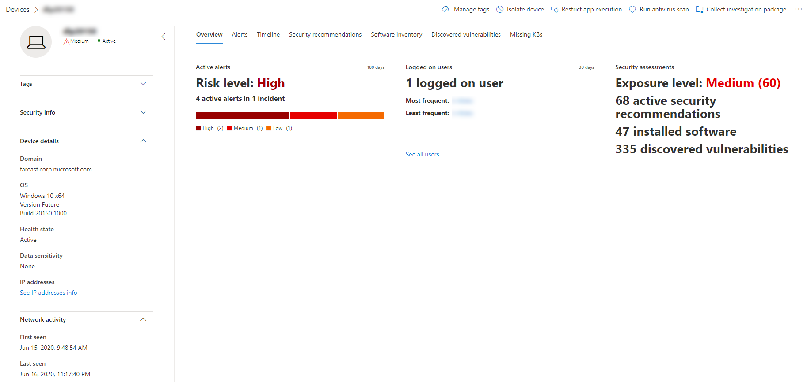

## Сведения о устройстве

В разделе сведения об устройстве содержится информация, например, о состоянии домена, ОС и состояния здоровья устройства. Если на устройстве доступен пакет исследований, вы увидите ссылку, которая позволяет скачать пакет.

## Действия реагирования

Действия ответа, которые запускают по верхней части определенной страницы устройства и включают в себя:

- Управление тегами
- Изолировать устройство
- Ограничение выполнения приложения
- Запуск антивирусного сканирования
- Сбор пакета расследований
- Инициировать сеанс живого ответа
- Инициировать автоматическое расследование
- Обратитесь к эксперту по угрозам
- Центр уведомлений

Действия реагирования можно принимать в центре действий, на определенной странице устройства или на определенной странице файла.

Дополнительные сведения о том, как действовать на устройстве, см. в этой информации. 

Дополнительные сведения см. в [дополнительных сведениях о том, как исследовать объекты пользователей.](investigate-user.md)

## Вкладки

Вкладки предоставляют соответствующие сведения о безопасности и предотвращении угроз, связанные с устройством. На каждой вкладке можно настроить столбцы, которые показаны, выбрав столбцы **Customize** из панели над заголовками столбцов.

### Обзор
На **вкладке Обзор** отображаются [карточки](#cards) для активных оповещений, зарегистрированных в пользователях, и оценки безопасности.

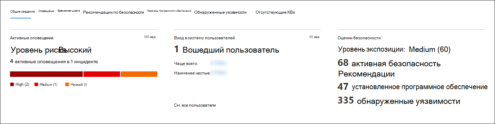

### Оповещения

Вкладка **Alerts** содержит список оповещений, связанных с устройством. Этот список является фильтрованной версией очереди оповещений и показывает краткое описание оповещения, серьезности (высокая, средняя, низкая, информационная), состояния в очереди (новое, в процессе выполнения, разрешено), классификации (не установлено, ложное оповещение, истинное оповещение), состояния расследования, категории оповещения, который обращается к оповещению и последней активности. Вы также можете фильтровать оповещения.

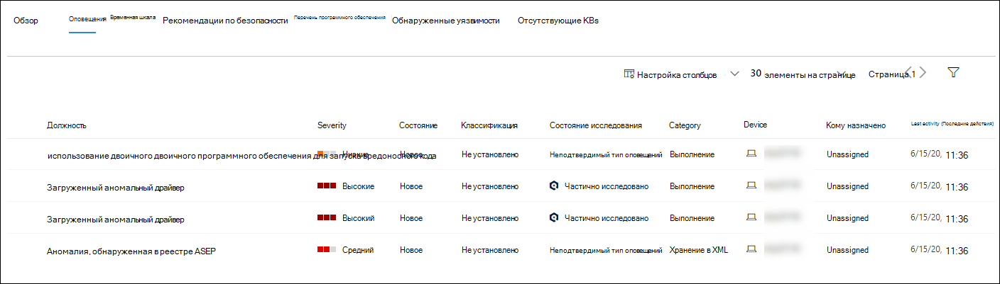

Когда выбран значок круга слева от оповещений, появляется вылет. На этой панели можно управлять оповещением и просматривать дополнительные сведения, такие как номер инцидента и связанные устройства. Одновременно можно выбрать несколько оповещений.

Чтобы просмотреть полное представление оповещений, включая график инцидентов и дерево процессов, выберите название оповещений.

### Временная шкала

Вкладка **Timeline** предоставляет хронологическое представление событий и связанных с ними оповещений, которые наблюдались на устройстве. Это поможет вам соотнести все события, файлы и IP-адреса по отношению к устройству.

Временная шкала также позволяет выборочно сверлить события, которые произошли в течение определенного периода времени. Можно просмотреть временную последовательность событий, произошедших на устройстве за выбранный период времени. Для дальнейшего управления представлением можно фильтровать группы событий или настраивать столбцы.

>[!NOTE]
> Чтобы отобразить события брандмауэра, необходимо включить политику аудита, см. в статью [Подключение платформы фильтрации аудита.](https://docs.microsoft.com/windows/security/threat-protection/auditing/audit-filtering-platform-connection)
>Брандмауэр охватывает следующие события
>
>- [5025](https://docs.microsoft.com/windows/security/threat-protection/auditing/event-5025) — остановлена служба брандмауэра
>- [5031](https://docs.microsoft.com/windows/security/threat-protection/auditing/event-5031) — приложение, заблокированное при приеме входящих подключений в сети
>- [5157](https://docs.microsoft.com/windows/security/threat-protection/auditing/event-5157) — заблокированное подключение

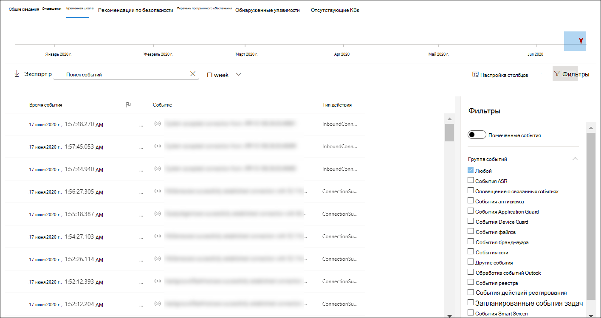

Некоторые функции включают в себя:

- Поиск определенных событий
  - Используйте панели поиска для поиска определенных событий временной шкалы.
- Фильтрация событий с определенной даты
  - Выберите значок календаря в верхней левой части таблицы, чтобы отображать события за прошедший день, неделю, 30 дней или настраиваемый диапазон. По умолчанию установлена временная шкала устройства, которая отображает события за последние 30 дней.
  - Используйте временную шкалу, чтобы перейти к определенному моменту времени, выделив раздел. Стрелки на временной шкале выявляют автоматизированные исследования
- Экспорт подробных событий временной шкалы устройств
  - Экспорт временной шкалы устройства для текущей даты или определенного диапазона дат до семи дней.

Дополнительные сведения о некоторых событиях предоставляются в разделе **Дополнительные сведения.** Эти сведения зависят от типа события, например: 

- Contained by Application Guard - the web browser event was restricted by an isolated container
- Обнаружена активная угроза — обнаружение угрозы произошло во время запуска угрозы.
- Исправление не удалось — попытка устранения обнаруженной угрозы была вызвана, но не удалась
- Исправление успешно — обнаруженная угроза была остановлена и очищена
- Предупреждение, обходить стороной пользователя — Защитник Windows SmartScreen было отклонено и переопределено пользователем.
- Обнаружен подозрительный скрипт — обнаружен потенциально вредоносный сценарий
- Категория оповещений — если событие привело к генерации оповещений, предоставляется категория оповещений ("Лайтальное движение", например).

#### Сведения о событиях
Выберите событие, чтобы просмотреть соответствующие сведения об этом событии. Панель отображает общие сведения о событиях. Когда применимы и доступны данные, также отображается график, на котором показаны связанные сущности и их связи.

Чтобы дополнительно инспектировать события и связанные  с ними события, можно быстро выполнить расширенный запрос на охоту, выбрав **Hunt для связанных событий.** Запрос возвращает выбранное событие и список других событий, произошедших примерно в одно и то же время на той же конечной точке.

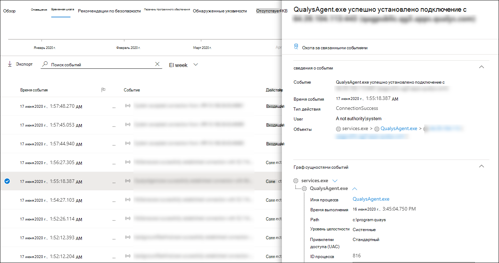

### Рекомендации по безопасности

**Рекомендации по безопасности создаются** в Microsoft Defender для функции управления & уязвимостей в [конечной](tvm-dashboard-insights.md) точке. Выбор рекомендации покажет панель, на которой можно просмотреть соответствующие сведения, такие как описание рекомендации и потенциальные риски, связанные с ее непринятия. Подробные [сведения см. в](tvm-security-recommendation.md) рекомендации по безопасности.

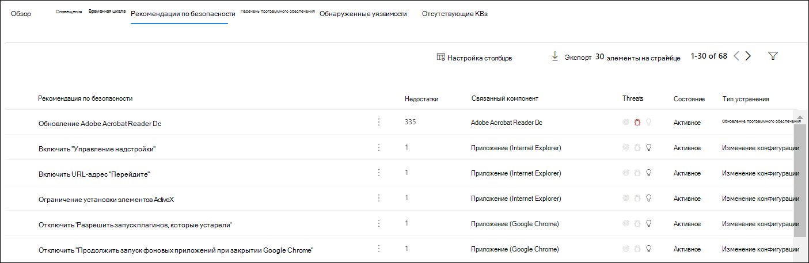

### Перечень программного обеспечения

Вкладка **инвентаризации** программного обеспечения позволяет просматривать программное обеспечение на устройстве, а также любые слабые стороны или угрозы. Выбор имени программного обеспечения позволит вам просмотреть рекомендации по безопасности, обнаруженные уязвимости, установленные устройства и распространение версий. Сведения [о инвентаризации программного](tvm-software-inventory.md) обеспечения

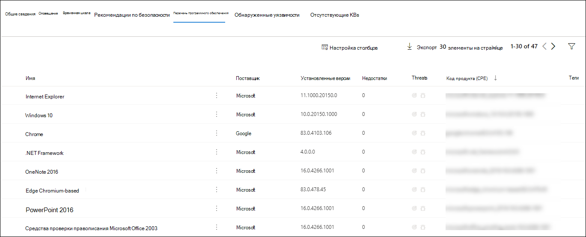

### Обнаруженные уязвимости

На **вкладке "Обнаруженные уязвимости"** показано имя, серьезность и сведения об угрозах обнаруженных уязвимостей на устройстве. При выборе определенных уязвимостей покажут описание и сведения.

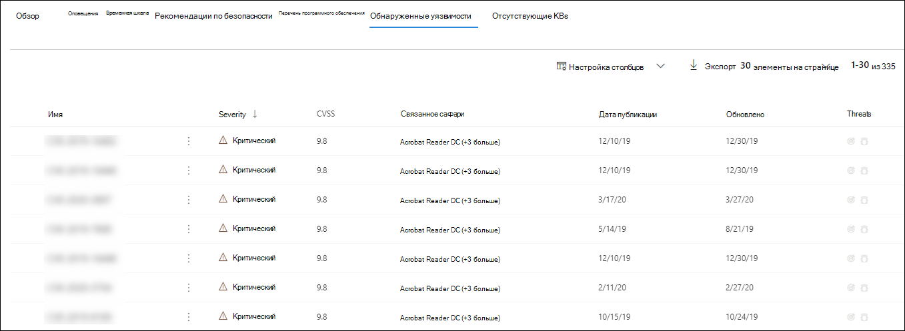

### Отсутствующие KBs
На **вкладке Missing KBs** перечислены отсутствующие обновления безопасности для устройства.

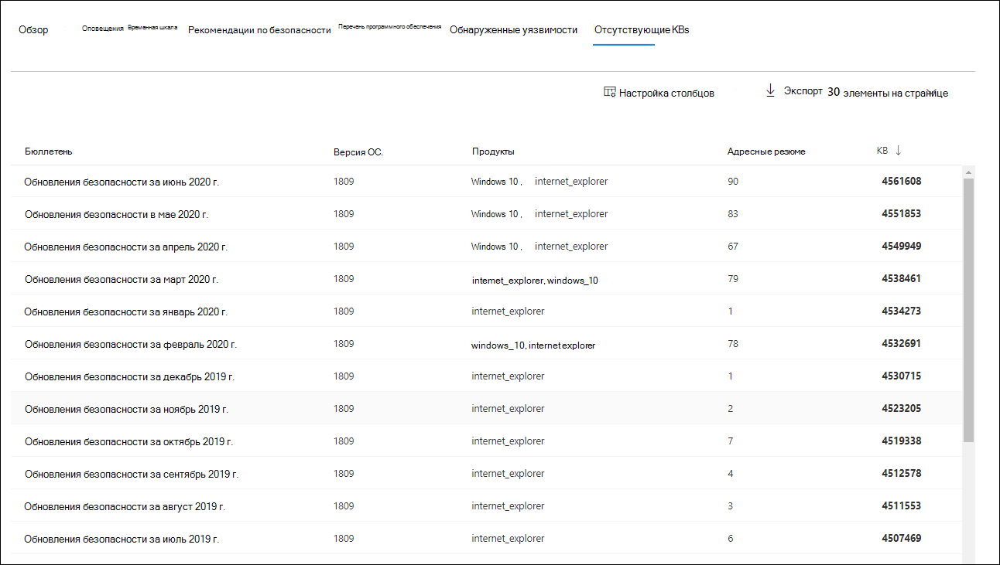

## Карточки

### Активные оповещения

На **карточке Advanced Threat Protection** Azure будет отображаться высокоуровневый обзор оповещений, связанных с устройством и уровнем риска, если вы включили функцию ATP Azure и есть активные оповещений. Дополнительные сведения можно получить в упражнении "Оповещение".

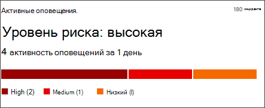

>[!NOTE]
>Необходимо включить интеграцию в Azure ATP и Defender для конечной точки, чтобы использовать эту функцию. В Defender for Endpoint вы можете включить эту функцию в расширенных функциях. Дополнительные сведения о том, как включить расширенные функции, см. в дополнительных [сведениях.](advanced-features.md)

### Вход в систему пользователей

В **карточке** входа в систему пользователей показано, сколько пользователей вошел в систему за последние 30 дней, а также наиболее и наименее часто используемых пользователей. Выбор ссылки "См. все пользователи" открывает области сведений, которая отображает сведения, такие как тип пользователя, войти в тип, и когда пользователь был первым и последним видел. Дополнительные сведения см. в [дополнительных сведениях о том, как исследовать объекты пользователей.](investigate-user.md)

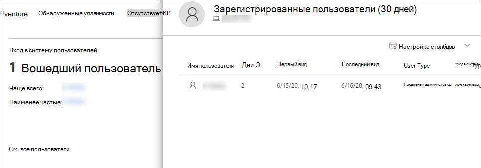

### Оценки безопасности

Карта **оценки безопасности показывает** общий уровень экспозиции, рекомендации по безопасности, установленное программное обеспечение и обнаруженные уязвимости. Уровень экспозиции устройства определяется совокупным воздействием ожидающих рекомендаций по безопасности.

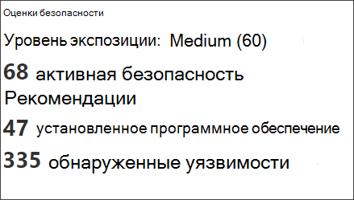

## Статьи по теме

- [Просмотр и организация очереди оповещений Microsoft Defender для конечных точек](alerts-queue.md)
- [Управление оповещениями Защитника Майкрософт для конечных точек](manage-alerts.md)
- [Исследование оповещений Microsoft Defender для конечных точек](investigate-alerts.md)
- [Исследование файла, связанного с предупреждением Defender for Endpoint](investigate-files.md)
- [Исследование IP-адреса, связанного с оповещением Defender for Endpoint](investigate-ip.md)
- [Исследование домена, связанного с предупреждением Defender for Endpoint](investigate-domain.md)
- [Исследование учетной записи пользователя в Defender для конечной точки](investigate-user.md)
- [Рекомендация по безопасности](tvm-security-recommendation.md)
- [Перечень программного обеспечения](tvm-software-inventory.md)
