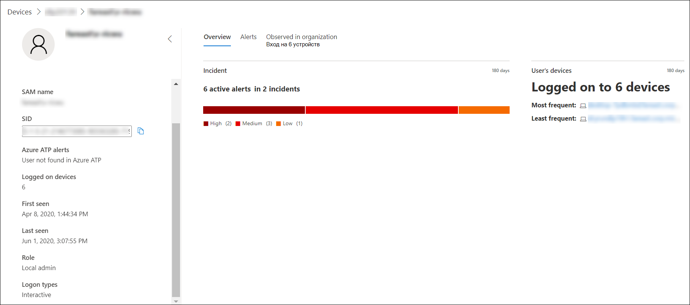

# Исследование учетной записи пользователя в Microsoft Defender для конечной точки

[!INCLUDE [Microsoft 365 Defender rebranding](../../includes/microsoft-defender.md)]

**Область применения:**
- [Microsoft Defender для конечной точки](https://go.microsoft.com/fwlink/p/?linkid=2154037)
- [Microsoft 365 Defender](https://go.microsoft.com/fwlink/?linkid=2118804)

>Хотите испытать Defender для конечной точки? [Зарегистрився для бесплатной пробной.](https://www.microsoft.com/microsoft-365/windows/microsoft-defender-atp?ocid=docs-wdatp-investigatgeuser-abovefoldlink)

## Изучение сущностями учетных записей пользователей

Определите учетные записи пользователей с наиболее активными оповещениями (отображаемой на панели мониторинга как "Пользователи в опасности") и изучите случаи потенциального взлома учетных данных или сводки на связанной учетной записи пользователя при расследовании оповещения или устройства для определения возможного более позднего перемещения между устройствами с этой учетной записью пользователя.

Сведения о учетной записи пользователей можно найти в следующих представлениях:

- Информационная панель
- Очередь оповещений
- Страница сведения об устройстве

В этих представлениях доступна щелкаемая ссылка учетной записи пользователя, которая будет отбирать вас на страницу сведений о учетной записи пользователя, где показано больше сведений о учетной записи пользователя.

При расследовании объекта учетной записи пользователя вы увидите:

- Сведения об учетной записи пользователя, оповещения о защите от угроз Azure Advanced (Azure ATP) и в журнале на устройствах, роли, типе логотипа и другие сведения
- Обзор инцидентов и устройств пользователя
- Оповещений, связанных с этим пользователем
- Наблюдается в организации (устройства, входив в систему)

### Сведения о пользователях

В  области сведений пользователя слева содержится информация о пользователе, например связанных открытых инцидентах, активных оповещений, sam name, SID, Azure ATP оповещений, количество устройств, на которые пользователь вошел, когда пользователь впервые и последний раз был замечен, роли и типы логотипов. В зависимости от функций интеграции, которые вы включили, вы увидите другие сведения. Например, если вы включаете Skype для бизнес-интеграции, вы сможете связаться с пользователем с портала. В разделе Оповещений ATP Azure содержится ссылка на страницу ATP Azure, если вы включили функцию ATP Azure, и есть оповещения, связанные с пользователем.  На странице ATP Azure будут предоставляться дополнительные сведения о оповещениях.

>[!NOTE]
>Необходимо включить интеграцию в Azure ATP и Defender для конечной точки, чтобы использовать эту функцию. В Defender for Endpoint вы можете включить эту функцию в расширенных функциях. Дополнительные сведения о том, как включить расширенные функции, см. в дополнительных [сведениях.](advanced-features.md)

Обзор, оповещений и наблюдаемые в организации — это разные вкладки, на которые отображаются различные атрибуты учетной записи пользователя.

### Обзор

На **вкладке Обзор** показаны сведения об инцидентах и список устройств, на которые входил пользователь. Вы можете расширить их, чтобы увидеть сведения о событиях входа для каждого устройства.

### Оповещения

Вкладка **Alerts** содержит список оповещений, связанных с учетной записью пользователя. Этот список представляет фильтрованное представление очереди Оповещения [и](alerts-queue.md)показывает оповещения, в которых контекст пользователя — это выбранная учетная запись пользователя, дата обнаружения последнего действия, краткое описание оповещений, устройство, связанное с оповещением, серьезность оповещений, состояние оповещений в очереди и назначенное оповещение.

### Наблюдается в организации

Вкладка **Observed** в организации позволяет указать диапазон дат, чтобы увидеть список устройств, на которых был зарегистрирован этот пользователь, наиболее частые и наименее часто регистрируются в учетной записи пользователя для каждого из этих устройств, а также общее число наблюдаемых пользователей на каждом устройстве.

Выбор элемента в таблице "Наблюдаемые" расширит элемент, раскроет дополнительные сведения об устройстве. Непосредственно выбрав ссылку в элементе, вышлет вас на соответствующую страницу.

## Поиск определенных учетных записей пользователей

1. Выберите **пользователя** из **выпадаемого** меню панели поиска.
2. Введите учетную запись пользователя в **поле Поиска.**
3. Щелкните значок поиска или нажмите **кнопку Ввод**.

Отображается список пользователей, совпадающих с текстом запроса. Вы увидите домен и имя учетной записи пользователя, когда учетная запись пользователя была в последний раз замечена, и общее число устройств, на которые она была зарегистрирована, за последние 30 дней.

Результаты можно фильтровать по следующим периодам времени:

- 1 день
- за 3 дня;
- 7 дней
- 30 дней
- 6 месяцев

## Статьи по теме

- [Просмотр и организация очереди оповещений Microsoft Defender для конечных точек](alerts-queue.md)
- [Управление оповещениями Защитника Майкрософт для конечных точек](manage-alerts.md)
- [Исследование оповещений Microsoft Defender для конечных точек](investigate-alerts.md)
- [Исследование файла, связанного с предупреждением Defender for Endpoint](investigate-files.md)
- [Исследование устройств в списке устройств Defender для конечных точек](investigate-machines.md)
- [Исследование IP-адреса, связанного с оповещением Defender for Endpoint](investigate-ip.md)
- [Исследование домена, связанного с предупреждением Defender for Endpoint](investigate-domain.md)
