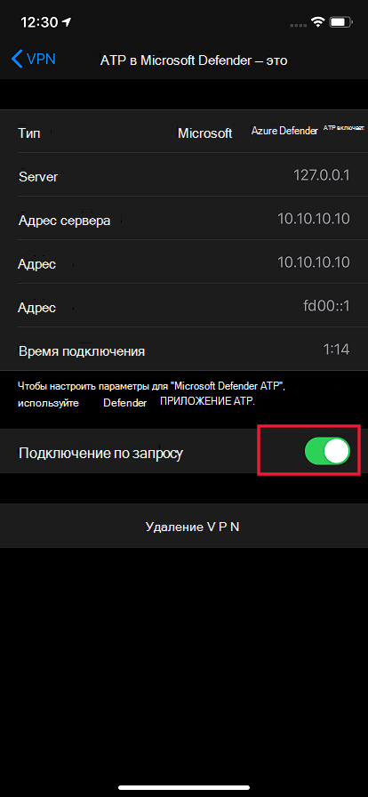
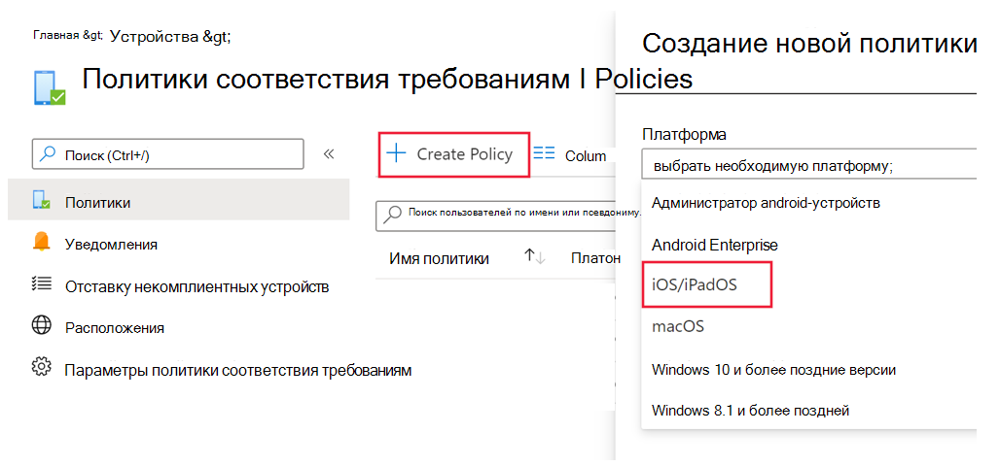
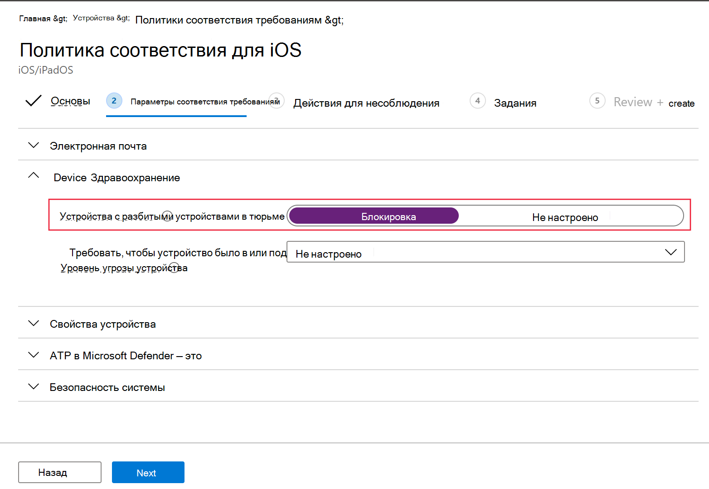
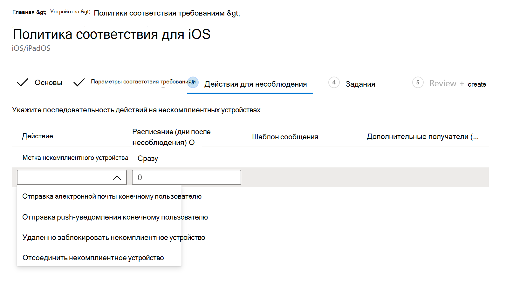

# Настройка Microsoft Defender для конечной точки для функций iOSConfigure Microsoft Defender for Endpoint on iOS features

[!INCLUDE [Microsoft 365 Defender rebranding](../../includes/microsoft-defender.md)]

**Область применения:****Applies to:**
- [Microsoft Defender для конечной точкиMicrosoft Defender for Endpoint](https://go.microsoft.com/fwlink/p/?linkid=2154037)
- [Microsoft 365 DefenderMicrosoft 365 Defender](https://go.microsoft.com/fwlink/?linkid=2118804)

> Хотите испытать Defender для конечной точки?Want to experience Defender for Endpoint? [Зарегистрився для бесплатной пробной.Sign up for a free trial.](https://www.microsoft.com/microsoft-365/windows/microsoft-defender-atp?ocid=docs-wdatp-exposedapis-abovefoldlink) 

> [!NOTE]
> Защитник для конечной точки на iOS будет использовать VPN для предоставления функции веб-защиты.Defender for Endpoint on iOS would use a VPN in order to provide the Web Protection feature. Это не обычный VPN и локальный или самоциклинг VPN, который не принимает трафик за пределами устройства.This is not a regular VPN and is a local/self-looping VPN that does not take traffic outside the device.

## Условный доступ с защитником для конечной точки на iOSConditional Access with Defender for Endpoint on iOS  
Microsoft Defender для конечной точки на iOS наряду с Microsoft Intune и Azure Active Directory позволяет применять политики соответствия требованиям устройств и условного доступа на основе оценки риска устройства.Microsoft Defender for Endpoint on iOS along with Microsoft Intune and Azure Active Directory enables enforcing Device compliance and Conditional Access policies based on device risk score. Defender for Endpoint — это решение mobile Threat Defense (MTD), которое можно развернуть для использования этой возможности с помощью Intune.Defender for Endpoint is a Mobile Threat Defense (MTD) solution that you can deploy to leverage this capability via Intune.

Дополнительные сведения о том, как настроить условный доступ с Помощью Защитника для конечной точки на iOS, см. в дополнительных сведениях [Defender for Endpoint и Intune.](/mem/intune/protect/advanced-threat-protection)For more information about how to set up Conditional Access with Defender for Endpoint on iOS, see [Defender for Endpoint and Intune](/mem/intune/protect/advanced-threat-protection).

### Обнаружение джейлбрейка microsoft Defender для конечной точкиJailbreak detection by Microsoft Defender for Endpoint
Microsoft Defender для конечной точки имеет возможность обнаружения неугодных и управляемых устройств, которые являются jailbroken.Microsoft Defender for Endpoint has the capability of detecting unmanaged and managed devices that are jailbroken. Если обнаружено, что устройство является jailbroken, в Центр безопасности будет отчитаться о высокой опасности, а если условный доступ настроен на основе оценки риска устройства, то устройство будет заблокировано для доступа к корпоративным данным. If a device is detected to be jailbroken, a **High**-risk alert will be reported to Security Center and if Conditional Access is setup based on device risk score, then the device will be blocked from accessing corporate data.

## Веб-защита и VPNWeb Protection and VPN

По умолчанию Защитник для конечной точки на iOS включает и включает функцию веб-защиты.By default, Defender for Endpoint on iOS includes and enables the web protection feature. [Веб-защита](web-protection-overview.md) помогает защитить устройства от веб-угроз и защитить пользователей от фишинговых атак.[Web protection](web-protection-overview.md) helps to secure devices against web threats and protect users from phishing attacks. Защитник для конечной точки на iOS использует VPN, чтобы обеспечить эту защиту.Defender for Endpoint on iOS uses a VPN in order to provide this protection. Обратите внимание, что это локальный VPN, и в отличие от традиционного VPN сетевой трафик не отправляется за пределы устройства.Please note this is a local VPN and unlike traditional VPN, network traffic is not sent outside the device.

Хотя по умолчанию включена, могут быть некоторые случаи, которые требуют отключения VPN.While enabled by default, there might be some cases that require you to disable VPN. Например, необходимо запустить некоторые приложения, которые не работают при настройке VPN.For example, you want to run some apps that do not work when a VPN is configured. В таких случаях можно отключить VPN из приложения на устройстве, следуя следующим ниже шагам:In such cases, you can choose to disable VPN from the app on the device by following the steps below:

1. На устройстве iOS откройте приложение **Параметры,** щелкните или нажмите **кнопку General,** а затем **VPN.**On your iOS device, open the **Settings** app, click or tap **General** and then **VPN**.
1. Щелкните или нажмите кнопку "i" для Microsoft Defender для конечной точки.Click or tap the "i" button for Microsoft Defender for Endpoint.
1. Отключение **Подключение по требованию** для отключения VPN.Toggle off **Connect On Demand** to disable VPN.

    > [!div class="mx-imgBorder"]
    > 

> [!NOTE]
> Веб-защита не будет доступна при отключении VPN.Web Protection will not be available when VPN is disabled. Чтобы повторно включить веб-защиту, откройте приложение Microsoft Defender для конечной точки на устройстве и нажмите кнопку Начните **VPN.**To re-enable Web Protection, open the Microsoft Defender for Endpoint app on the device and click or tap **Start VPN**.

## Совместное существование нескольких профилей VPNCo-existence of multiple VPN profiles

Apple iOS не поддерживает одновременное активное участие нескольких VPN в масштабе устройств.Apple iOS does not support multiple device-wide VPNs to be active simultaneously. Хотя на устройстве может существовать несколько профилей VPN, одновременно может быть активен только один VPN.While multiple VPN profiles can exist on the device, only one VPN can be active at a time.

## Настройка политики соответствия требованиям для устройств, сбитых с джейлбрейкаConfigure compliance policy against jailbroken devices

Чтобы защитить корпоративные данные от доступа на устройствах с iOS, которые могут быть защищены от сбоя, рекомендуется настроить следующую политику соответствия требованиям в Intune.To protect corporate data from being accessed on jailbroken iOS devices, we recommend that you set up the following compliance policy on Intune.

> [!NOTE]
> Обнаружение джейлбрейка — это возможность, предоставляемая Microsoft Defender для конечной точки на iOS.Jailbreak detection is a capability provided by Microsoft Defender for Endpoint on iOS. Однако рекомендуется настроить эту политику в качестве дополнительного уровня защиты от сценариев побега из тюрьмы.However, we recommend that you setup this policy as an additional layer of defense against jailbreak scenarios.

Следуйте ниже шагам, чтобы создать политику соответствия требованиям в отношении устройств jailbroken.Follow the steps below to create a compliance policy against jailbroken devices.

1. В [Microsoft Endpoint Manager центре администрирования](https://go.microsoft.com/fwlink/?linkid=2109431)перейдите к политикам соответствия требованиям **устройств**  ->    ->  **Create Policy**.In [Microsoft Endpoint Manager admin center](https://go.microsoft.com/fwlink/?linkid=2109431), go to **Devices** -> **Compliance policies** -> **Create Policy**. Выберите "iOS/iPadOS" в качестве платформы и нажмите **кнопку Создать**.Select "iOS/iPadOS" as platform and click **Create**.

    > [!div class="mx-imgBorder"]
    > 

2. Укажите имя политики, например "Политика соответствия требованиям для джейлбрейка".Specify a name of the policy, for example "Compliance Policy for Jailbreak".
3. На странице параметры соответствия щелкните, чтобы расширить раздел **"Здоровье** устройств" и нажмите **кнопку Блок** для **устройств Jailbroken.**In the compliance settings page, click to expand **Device Health** section and click **Block** for **Jailbroken devices** field.

    > [!div class="mx-imgBorder"]
    > 

4. В разделе *Действие за несоблюдение* выберите действия в соответствии с вашими требованиями и выберите **Далее**.In the *Action for noncompliance* section, select the actions as per your requirements and select **Next**.

    > [!div class="mx-imgBorder"]
    > 

5. В разделе *Назначения выберите* группы пользователей, которые необходимо включить для этой политики, а затем выберите **Далее**.In the *Assignments* section, select the user groups that you want to include for this policy and then select **Next**.
6. В разделе **Обзор+Создание** убедитесь, что вся введенная информация является правильной, а затем выберите **Создать**.In the **Review+Create** section, verify that all the information entered is correct and then select **Create**.

## Настройка настраиваемых индикаторовConfigure custom indicators

Defender for Endpoint на iOS позволяет администраторам настраивать настраиваемые индикаторы и на устройствах iOS.Defender for Endpoint on iOS enables admins to configure custom indicators on iOS devices as well. Дополнительные сведения о настройке настраиваемых индикаторов см. в см. [в руб. Управление индикаторами.](/microsoft-365/security/defender-endpoint/manage-indicators)For more information on how to configure custom indicators, see [Manage indicators](/microsoft-365/security/defender-endpoint/manage-indicators).

> [!NOTE]
> Defender for Endpoint на iOS поддерживает создание настраиваемой индикаторов только для IP-адресов и URL-адресов/доменов.Defender for Endpoint on iOS supports creating custom indicators only for IP addresses and URLs/domains.

## Сообщить о небезопасном сайтеReport unsafe site

Фишинговые веб-сайты выдают себя за надежные веб-сайты с целью получения личной или финансовой информации.Phishing websites impersonate trustworthy websites for the purpose of obtaining your personal or financial information. Если вы хотите сообщить о веб-сайте, который может быть фишинг-сайтом, посетите страницу Provide feedback about [network](https://www.microsoft.com/wdsi/filesubmission/exploitguard/networkprotection) protection page.Visit the [Provide feedback about network protection](https://www.microsoft.com/wdsi/filesubmission/exploitguard/networkprotection) page if you want to report a website that could be a phishing site.

