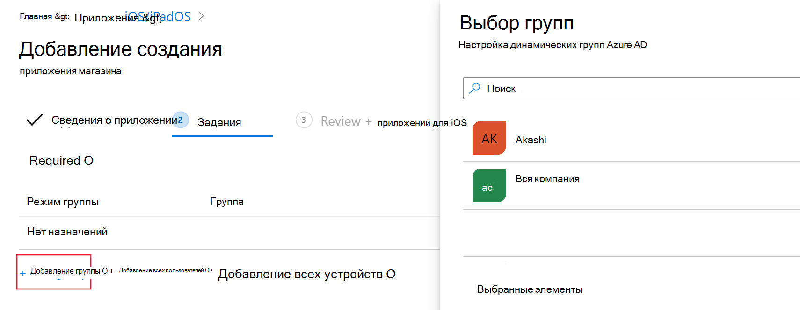
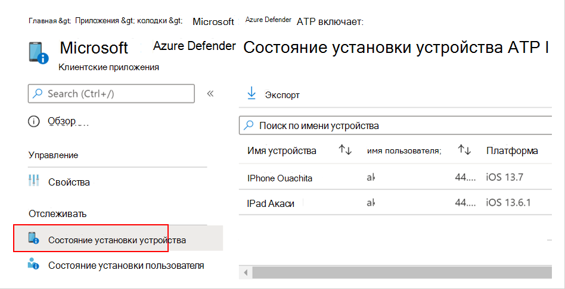
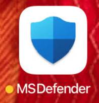
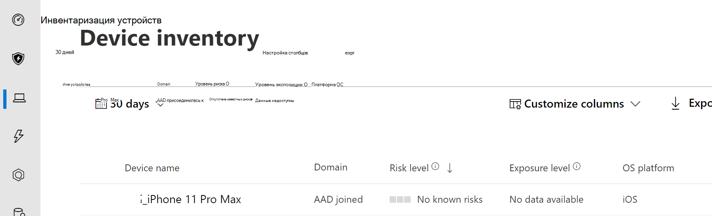
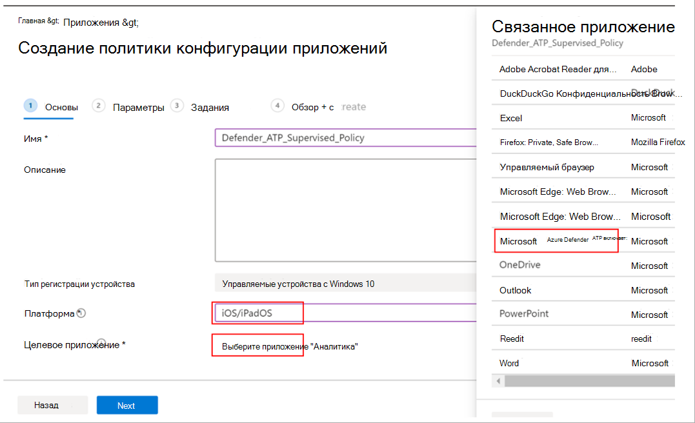
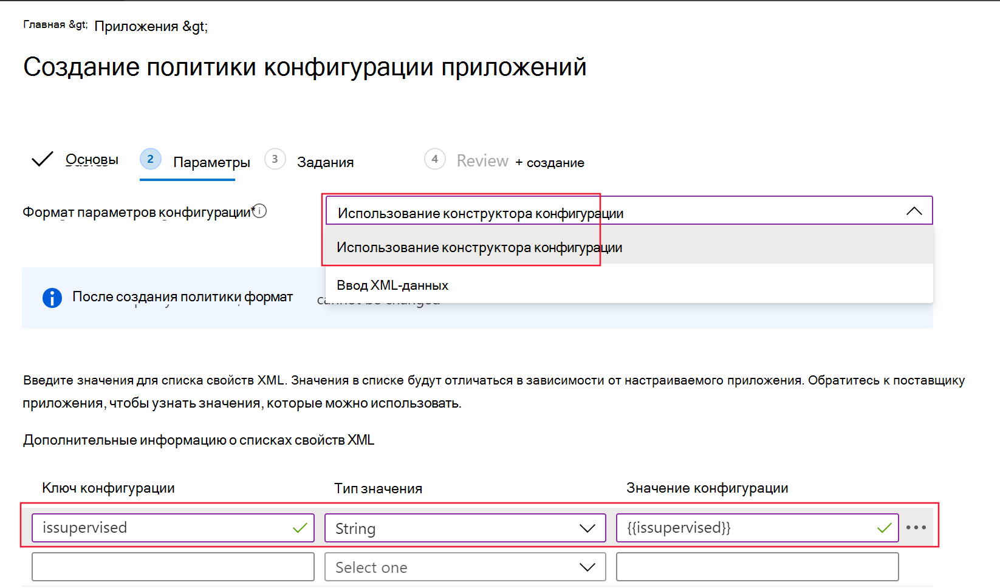
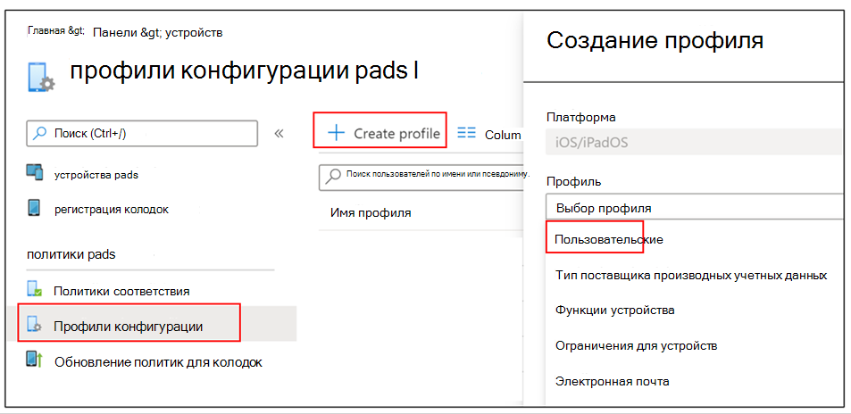

# Развертывание Microsoft Defender для конечной точки для iOS

[!INCLUDE [Microsoft 365 Defender rebranding](../../includes/microsoft-defender.md)]

**Область применения:**
- [Microsoft Defender для конечной точки](https://go.microsoft.com/fwlink/p/?linkid=2154037)
- [Microsoft 365 Defender](https://go.microsoft.com/fwlink/?linkid=2118804)

> Хотите испытать Defender для конечной точки? [Зарегистрився для бесплатной пробной.](https://www.microsoft.com/microsoft-365/windows/microsoft-defender-atp?ocid=docs-wdatp-investigateip-abovefoldlink)

В этом разделе описывается развертывание устройств Defender для конечной точки для iOS на зарегистрированных устройствах портала компаний Intune. Дополнительные сведения о регистрации устройств Intune см. в записи [устройств iOS/iPadOS в Intune.](https://docs.microsoft.com/mem/intune/enrollment/ios-enroll)

## Прежде чем начать

- Убедитесь, что у вас есть доступ к центру администрирования [менеджеров конечных точек Майкрософт.](https://go.microsoft.com/fwlink/?linkid=2109431)

- Убедитесь, что регистрация на iOS будет сделана для пользователей. Пользователям необходимо иметь лицензию Defender для конечной точки, чтобы использовать Defender для конечной точки для iOS. Обратитесь [к назначению лицензий пользователям](https://docs.microsoft.com/azure/active-directory/users-groups-roles/licensing-groups-assign) для получения инструкций по назначению лицензий.

> [!NOTE]
> AtP защитника Microsoft (Microsoft Defender для конечной точки) для iOS теперь доступен в [Магазине приложений Apple.](https://aka.ms/mdatpiosappstore)

## Действия по развертыванию

Развертывание Defender для конечной точки для iOS через портал компании Intune.

### Добавление приложения магазина iOS

1. В [центре администрирования менеджеров](https://go.microsoft.com/fwlink/?linkid=2109431)конечных точек Майкрософт перейдите в **приложение Apps**  ->  **iOS/iPadOS**  ->  **Add**  ->  **iOS Store app** и нажмите **кнопку Выберите**.

    > [!div class="mx-imgBorder"]
    > 

1. На странице Добавление приложения нажмите кнопку Поиск в **Магазине приложений** и введите конечную точку **Microsoft Defender** в панели поиска. В разделе Результаты поиска щелкните конечную точку *Microsoft Defender и* выберите **Выберите**.

1. Выберите **iOS 11.0 в** качестве минимальной операционной системы. Просмотрите остальные сведения о приложении и нажмите **кнопку Далее**.

1. В разделе *Назначения* перейдите в раздел **"Необходимые"** и выберите **группу Добавить.** Затем можно выбрать группу пользователей, которую вы хотите нацелить на Defender для конечной точки для приложения iOS. Нажмите **кнопку Выберите** и **затем далее**.

    > [!NOTE]
    > Выбранная группа пользователей должна состоять из зарегистрированных пользователей Intune.

    > [!div class="mx-imgBorder"]
    > 

1. В разделе *Обзор + Создание* убедитесь, что вся введенная информация является правильной, а затем выберите **Создать**. Через несколько минут приложение Defender для конечной точки должно быть создано успешно, а уведомление должно показываться в правом верхнем углу страницы.

1. На странице информации о приложении, отображаемой  в разделе **Monitor,** выберите состояние установки устройства, чтобы убедиться, что установка устройства успешно завершена.

    > [!div class="mx-imgBorder"]
    > 

## Полное состояние onboarding и проверки

1. После установки защитника для конечной точки для iOS на устройстве вы увидите значок приложения.

    

2. Нажмите значок приложения Defender для конечной точки и выполните инструкции на экране для выполнения действий на борту. Сведения включают принятие конечным пользователем разрешений на iOS, необходимых Defender для конечной точки для iOS.

3. После успешного взбора устройство начнет появляться в списке Устройств в Центре безопасности Microsoft Defender.

    > [!div class="mx-imgBorder"]
    > 

## Настройка Microsoft Defender для конечной точки для режима с контролем

Приложение Microsoft Defender для конечной точки для iOS обладает специальными возможностями на контролируемых устройствах iOS/iPadOS, учитывая повышенные возможности управления, предоставляемые платформой на этих типах устройств. Чтобы воспользоваться этими возможностями, приложению Defender for Endpoint необходимо знать, находится ли устройство в режиме "Контролируемый".

### Настройка режима "Контролируемый" с помощью Intune

Intune позволяет настроить приложение Defender для iOS с помощью политики конфигурации приложений.

   > [!NOTE]
   > Эта политика конфигурации приложений для контролируемых устройств применима только к управляемым устройствам и должна быть ориентирована на все управляемые устройства iOS в качестве наилучшей практики.

1. Войдите в центр администрирования [microsoft Endpoint Manager](https://go.microsoft.com/fwlink/?linkid=2109431) и перейдите к политикам конфигурации **приложений**  >    >  **Добавить**. Щелкните **управляемые устройства.**

    > [!div class="mx-imgBorder"]
    > 

1. На странице *Политика конфигурации приложений* создайте следующие сведения:
    - Имя политики
    - Платформа: Выберите iOS/iPadOS
    - Целевое приложение: Выберите **ATP защитника Майкрософт** из списка

    > [!div class="mx-imgBorder"]
    > 

1. На следующем экране в качестве формата выберите **конструктор конфигурации** Use. Укажите следующее свойство:
    - Ключ конфигурации: issupervised
    - Тип значения: String
    - Значение конфигурации: {{issupervised}}
    
    > [!div class="mx-imgBorder"]
    > 

1. Нажмите **кнопку Далее,** чтобы **открыть страницу Теги области.** Теги области необязательны. Для продолжения нажмите кнопку **Далее**.

1. На странице **Назначения выберите** группы, которые получат этот профиль. В этом сценарии лучше всего нацелить все **устройства.** Дополнительные сведения о назначении профилей см. в странице [Назначение профилей пользователей и устройств.](https://docs.microsoft.com/mem/intune/configuration/device-profile-assign)

   При развертывании в группах пользователей пользователь должен войти на устройство до того, как применяется политика.

   Нажмите кнопку **Далее**.

1. На странице **Обзор + создание,** когда вы сделали, выберите **Создать**. Новый профиль отображается в списке профилей конфигурации.

1. Далее для расширения возможностей защиты от фишинга можно развернуть настраиваемый профиль на контролируемых устройствах iOS. Выполните следующие действия:
    - Скачайте профиль config из [https://aka.ms/mdatpiossupervisedprofile](https://aka.ms/mdatpiossupervisedprofile)
    - Перейдите **к**  ->  **профилям конфигурации устройств iOS/iPadOS**  ->    ->  **Create Profile**

    > [!div class="mx-imgBorder"]
    > 

    - Укай имя профиля. Если вам будет предложено импортировать файл профилей конфигурации, выберите скачаный выше файл.
    - В разделе **Назначение** выберите группу устройств, к которой необходимо применить этот профиль. В качестве наилучшей практики это следует применять ко всем управляемым устройствам iOS. Нажмите кнопку **Далее**.
    - На странице **Обзор + создание,** когда вы сделали, выберите **Создать**. Новый профиль отображается в списке профилей конфигурации.

## Дальнейшие действия

[Настройка Защитника для конечной точки для функций iOS](ios-configure-features.md)
