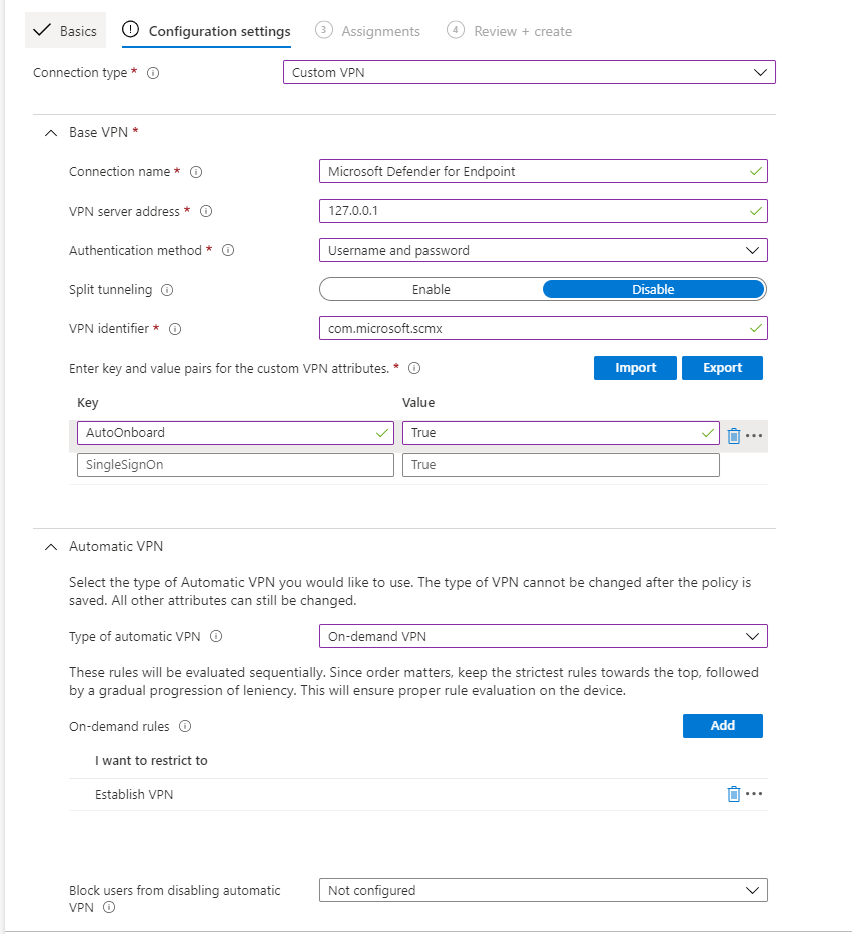

# Развертывание Microsoft Defender для конечной точки на iOSDeploy Microsoft Defender for Endpoint on iOS

[!INCLUDE [Microsoft 365 Defender rebranding](../../includes/microsoft-defender.md)]

**Область применения:****Applies to:**
- [Microsoft Defender для конечной точкиMicrosoft Defender for Endpoint](https://go.microsoft.com/fwlink/p/?linkid=2154037)
- [Microsoft 365 DefenderMicrosoft 365 Defender](https://go.microsoft.com/fwlink/?linkid=2118804)

> Хотите испытать Defender для конечной точки?Want to experience Defender for Endpoint? [Зарегистрився для бесплатной пробной.Sign up for a free trial.](https://www.microsoft.com/microsoft-365/windows/microsoft-defender-atp?ocid=docs-wdatp-investigateip-abovefoldlink)

В этом разделе описывается развертывание Defender для конечной точки на iOS на Корпоративный портал Intune зарегистрированных устройствах.This topic describes deploying Defender for Endpoint on iOS on Intune Company Portal enrolled devices. Дополнительные сведения о регистрации устройств Intune см. в записи [устройств iOS/iPadOS в Intune.](/mem/intune/enrollment/ios-enroll)For more information about Intune device enrollment, see [Enroll iOS/iPadOS devices in Intune](/mem/intune/enrollment/ios-enroll).

## Прежде чем начатьBefore you begin

- Убедитесь, что у вас есть доступ к центру администрирования [менеджеров конечных точек Майкрософт.](https://go.microsoft.com/fwlink/?linkid=2109431)Ensure you have access to [Microsoft Endpoint manager admin center](https://go.microsoft.com/fwlink/?linkid=2109431).

- Убедитесь, что регистрация на iOS будет сделана для пользователей.Ensure iOS enrollment is done for your users. Для использования Defender для конечной точки в iOS пользователям должна быть назначена лицензия Defender для конечной точки.Users need to have a Defender for Endpoint license assigned in order to use Defender for Endpoint on iOS. Обратитесь [к назначению лицензий пользователям](/azure/active-directory/users-groups-roles/licensing-groups-assign) для получения инструкций по назначению лицензий.Refer to [Assign licenses to users](/azure/active-directory/users-groups-roles/licensing-groups-assign) for instructions on how to assign licenses.

> [!NOTE]
> Microsoft Defender для конечной точки на iOS доступен в [Магазине приложений Apple.](https://aka.ms/mdatpiosappstore)Microsoft Defender for Endpoint on iOS is available in the [Apple App Store](https://aka.ms/mdatpiosappstore).

## Действия по развертываниюDeployment steps

Развертывание Defender для конечной точки на iOS через Корпоративный портал Intune.Deploy Defender for Endpoint on iOS via Intune Company Portal.

### Добавление приложения магазина iOSAdd iOS store app

1. В [центре администрирования менеджеров](https://go.microsoft.com/fwlink/?linkid=2109431)конечных точек Майкрософт перейдите в **приложение Apps**  ->  **iOS/iPadOS**  ->  **Add**  ->  **iOS Store app** и нажмите **кнопку Выберите**.In [Microsoft Endpoint manager admin center](https://go.microsoft.com/fwlink/?linkid=2109431), go to **Apps** -> **iOS/iPadOS** -> **Add** -> **iOS store app** and click **Select**.

    > [!div class="mx-imgBorder"]
    > 

1. На странице Добавление приложения нажмите кнопку Поиск в **Магазине приложений** и введите конечную точку **Microsoft Defender** в панели поиска.On the Add app page, click on **Search the App Store** and type **Microsoft Defender Endpoint** in the search bar. В разделе Результаты поиска щелкните конечную точку *Microsoft Defender и* выберите **Выберите**.In the search results section, click on *Microsoft Defender Endpoint* and click **Select**.

1. Выберите **iOS 11.0 в** качестве минимальной операционной системы.Select **iOS 11.0** as the Minimum operating system. Просмотрите остальные сведения о приложении и нажмите **кнопку Далее**.Review the rest of information about the app and click **Next**.

1. В разделе *Назначения* перейдите в раздел **"Необходимые"** и выберите **группу Добавить.**In the *Assignments* section, go to the **Required** section and select **Add group**. Затем можно выбрать группу пользователей, которую вы хотите нацелить на Defender для конечной точки в приложении iOS.You can then choose the user group(s) that you would like to target Defender for Endpoint on iOS app. Нажмите **кнопку Выберите** и **затем далее**.Click **Select** and then **Next**.

    > [!NOTE]
    > Выбранная группа пользователей должна состоять из зарегистрированных пользователей Intune.The selected user group should consist of Intune enrolled users.

    > [!div class="mx-imgBorder"]
    > 

1. В разделе *Обзор + Создание* убедитесь, что вся введенная информация является правильной, а затем выберите **Создать**.In the *Review + Create* section, verify that all the information entered is correct and then select **Create**. Через несколько минут приложение Defender для конечной точки должно быть создано успешно, а уведомление должно показываться в правом верхнем углу страницы.In a few moments, the Defender for Endpoint app should be created successfully, and a notification should show up at the top-right corner of the page.

1. На странице информации о приложении, отображаемой  в разделе **Monitor,** выберите состояние установки устройства, чтобы убедиться, что установка устройства успешно завершена.In the app information page that is displayed, in the **Monitor** section, select **Device install status** to verify that the device installation has completed successfully.

    > [!div class="mx-imgBorder"]
    > 

## Автоматическая встраивка vpn-профиля (упрощенная встраивка)Auto-Onboarding of VPN profile (Simplified Onboarding)

Администраторы могут настроить автоматическую настройку ПРОФИЛЯ VPN.Admins can configure auto-setup of VPN profile. Это автоматически установит VPN-профиль Defender для конечной точки без необходимости этого пользователя во время его работы.This will automatically setup the Defender for Endpoint VPN profile without having the user to do so while onboarding. Обратите внимание, что VPN используется для предоставления функции веб-защиты.Note that VPN is used in order to provide the Web Protection feature. Это не обычный VPN и локальный или самоциклинг VPN, который не принимает трафик за пределами устройства.This is not a regular VPN and is a local/self-looping VPN that does not take traffic outside the device.

1. В [центре администрирования менеджеров конечных точек](https://go.microsoft.com/fwlink/?linkid=2109431)Майкрософт перейдите к **профилям** конфигурации устройств  ->    ->  **Create Profile**.In [Microsoft Endpoint manager admin center](https://go.microsoft.com/fwlink/?linkid=2109431), go to **Devices** -> **Configuration Profiles** -> **Create Profile**.
1. Выберите **платформу** в **виде iOS/iPadOS** и **типа профиля** в **качестве VPN.**Choose **Platform** as **iOS/iPadOS** and **Profile type** as **VPN**. Щелкните **Создать**.Click **Create**.
1. Введите имя профиля и нажмите кнопку **Далее**.Type a name for the profile and click **Next**.
1. Выберите **настраиваемый VPN** для типа подключения и в разделе **Базовый VPN** введите следующее:Select **Custom VPN** for Connection Type and in the **Base VPN** section, enter the following:
    - Имя подключения = Защитник Майкрософт для конечной точкиConnection Name = Microsoft Defender for Endpoint
    - Адрес VPN-сервера = 127.0.0.1VPN server address = 127.0.0.1
    - Метод Auth = "Имя пользователя и пароль"Auth method = "Username and password"
    - Разделение туннелей = ОтключениеSplit Tunneling = Disable
    - ИДЕНТИФИКАТОР VPN = com.microsoft.scmxVPN identifier = com.microsoft.scmx
    - В парах значения ключа введите клавишу **AutoOnboard** и установите значение **True**.In the key-value pairs, enter the key **AutoOnboard** and set the value to **True**.
    - Тип автоматического VPN = VPN по требованиюType of Automatic VPN = On-demand VPN
    - Нажмите **кнопку** Добавить для **правил** по требованию и выберите я хочу сделать следующее = **Установить VPN**, я хочу ограничить = Все **домены**.Click **Add** for **On Demand Rules** and select **I want to do the following = Establish VPN**, **I want to restrict to = All domains**.

    

1. Нажмите кнопку Далее и назначьте профиль целевым пользователям.Click Next and assign the profile to targeted users.
1. В разделе *Обзор + Создание* убедитесь, что вся введенная информация является правильной, а затем выберите **Создать**.In the *Review + Create* section, verify that all the information entered is correct and then select **Create**.

## Полное состояние onboarding и проверкиComplete onboarding and check status

1. После установки Защитника для конечной точки на iOS на устройстве вы увидите значок приложения.Once Defender for Endpoint on iOS has been installed on the device, you  will see the app icon.

    

2. Нажмите значок приложения Defender для конечной точки (MSDefender) и выполните инструкции на экране для выполнения действий на борту.Tap the Defender for Endpoint app icon (MSDefender) and follow the on-screen instructions to complete the onboarding steps. Эти сведения включают принятие конечным пользователем разрешений на iOS, необходимых Defender для конечной точки на iOS.The details include end-user acceptance of iOS permissions required by Defender for Endpoint on iOS.

3. После успешной работы над устройством устройство начнет появляться в списке Устройств в Центр безопасности в Microsoft Defender.Upon successful onboarding, the device will start showing up on the Devices list in Microsoft Defender Security Center.

    > [!div class="mx-imgBorder"]
    > 

## Настройка Microsoft Defender для конечной точки для режима с контролемConfigure Microsoft Defender for Endpoint for Supervised Mode

Microsoft Defender для конечной точки на iOS-приложении имеет специальные возможности на контролируемых устройствах iOS/iPadOS, учитывая повышенные возможности управления, предоставляемые платформой на этих типах устройств.The Microsoft Defender for Endpoint on iOS app has specialized ability on supervised iOS/iPadOS devices, given the increased management capabilities provided by the platform on these types of devices. Чтобы воспользоваться этими возможностями, приложению Defender for Endpoint необходимо знать, находится ли устройство в режиме "Контролируемый".To take advantage of these capabilities, the Defender for Endpoint app needs to know if a device is in Supervised Mode.

### Настройка режима "Контролируемый" с помощью IntuneConfigure Supervised Mode via Intune

Intune позволяет настроить приложение Defender для iOS с помощью политики конфигурации приложений.Intune allows you to configure the Defender for iOS app through an App Configuration policy.

   > [!NOTE]
   > Эта политика конфигурации приложений для контролируемых устройств применима только к управляемым устройствам и должна быть ориентирована на все управляемые устройства iOS в качестве наилучшей практики.This app configuration policy for supervised devices is applicable only to managed devices and should be targeted for all managed iOS devices as a best practice.

1. Войдите в центр [администрирования Microsoft Endpoint Manager и](https://go.microsoft.com/fwlink/?linkid=2109431) перейдите к политикам конфигурации **приложений**  >    >  **Добавить**.Sign in to the [Microsoft Endpoint Manager admin center](https://go.microsoft.com/fwlink/?linkid=2109431) and go to **Apps** > **App configuration policies** > **Add**. Щелкните **управляемые устройства.**Click on **Managed devices**.

    > [!div class="mx-imgBorder"]
    > 

1. На странице *Политика конфигурации приложений* создайте следующие сведения:In the *Create app configuration policy* page, provide the following information:
    - Имя политикиPolicy Name
    - Платформа: Выберите iOS/iPadOSPlatform: Select iOS/iPadOS
    - Целевое приложение: Выберите **конечную точку Защитника Майкрософт** из спискаTargeted app: Select **Microsoft Defender Endpoint** from the list

    > [!div class="mx-imgBorder"]
    > 

1. На следующем экране в качестве формата выберите **конструктор конфигурации** Use.In the next screen, select **Use configuration designer** as the format. Укажите следующее свойство:Specify the following property:
    - Ключ конфигурации: issupervisedConfiguration Key: issupervised
    - Тип значения: StringValue type: String
    - Значение конфигурации: {{issupervised}}Configuration Value: {{issupervised}}
    
    > [!div class="mx-imgBorder"]
    > 

1. Нажмите **кнопку Далее,** чтобы **открыть страницу Теги области.**Click **Next** to open the **Scope tags** page. Теги области необязательны.Scope tags are optional. Для продолжения нажмите кнопку **Далее**.Click **Next** to continue.

1. На странице **Назначения выберите** группы, которые получат этот профиль.On the **Assignments** page, select the groups that will receive this profile. В этом сценарии лучше всего нацелить все **устройства.**For this scenario, it is best practice to target **All Devices**. Дополнительные сведения о назначении профилей см. в странице [Назначение профилей пользователей и устройств.](/mem/intune/configuration/device-profile-assign)For more information on assigning profiles, see [Assign user and device profiles](/mem/intune/configuration/device-profile-assign).

   При развертывании в группах пользователей пользователь должен войти на устройство до того, как применяется политика.When deploying to user groups, a user must sign in to a device before the policy applies.

   Нажмите **Далее**.Click **Next**.

1. На странице **Обзор + создание,** когда вы сделали, выберите **Создать**.On the **Review + create** page, when you're done, choose **Create**. Новый профиль отображается в списке профилей конфигурации.The new profile is displayed in the list of configuration profiles.

1. Далее для расширения возможностей защиты от фишинга можно развернуть настраиваемый профиль на контролируемых устройствах iOS.Next, for enhanced Anti-phishing capabilities, you can deploy a custom profile on the supervised iOS devices. Выполните следующие действия:Follow the steps below:
    - Скачайте профиль config из [https://aka.ms/mdatpiossupervisedprofile](https://aka.ms/mdatpiossupervisedprofile)Download the config profile from [https://aka.ms/mdatpiossupervisedprofile](https://aka.ms/mdatpiossupervisedprofile)
    - Перейдите **к**  ->  **профилям конфигурации устройств iOS/iPadOS**  ->    ->  **Create Profile**Navigate to **Devices** -> **iOS/iPadOS** -> **Configuration profiles** -> **Create Profile**

    > [!div class="mx-imgBorder"]
    > 

    - Укай имя профиля.Provide a name of the profile. Если вам будет предложено импортировать файл профилей конфигурации, выберите скачаный выше файл.When prompted to import a Configuration profile file, select the one downloaded above.
    - В разделе **Назначение** выберите группу устройств, к которой необходимо применить этот профиль.In the **Assignment** section, select the device group to which you want to apply this profile. В качестве наилучшей практики это следует применять ко всем управляемым устройствам iOS.As a best practice, this should be applied to all managed iOS devices. Нажмите **Далее**.Click **Next**.
    - На странице **Обзор + создание,** когда вы сделали, выберите **Создать**.On the **Review + create** page, when you're done, choose **Create**. Новый профиль отображается в списке профилей конфигурации.The new profile is displayed in the list of configuration profiles.

## Дальнейшие действияNext Steps

[Настройка Защитника для конечной точки на функции iOSConfigure Defender for Endpoint on iOS features](ios-configure-features.md)
