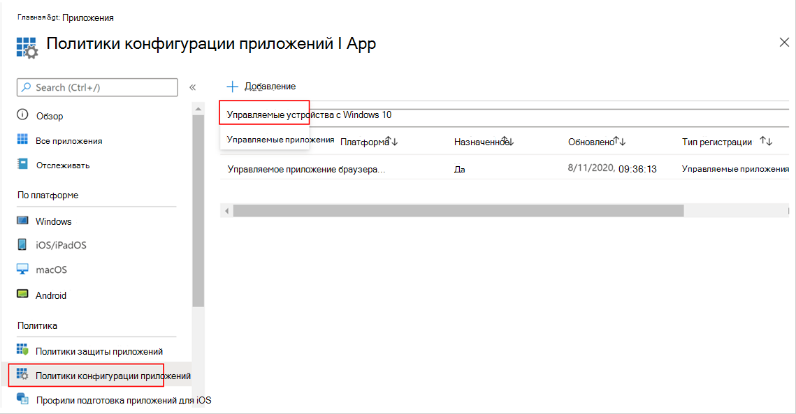

# Развертывание Microsoft Defender для конечной точки на iOS

[!INCLUDE [Microsoft 365 Defender rebranding](../../includes/microsoft-defender.md)]

**Область применения:**
- [Microsoft Defender для конечной точки](https://go.microsoft.com/fwlink/p/?linkid=2154037)
- [Microsoft 365 Defender](https://go.microsoft.com/fwlink/?linkid=2118804)

> Хотите испытать Defender для конечной точки? [Зарегистрився для бесплатной пробной.](https://www.microsoft.com/microsoft-365/windows/microsoft-defender-atp?ocid=docs-wdatp-investigateip-abovefoldlink)

В этом разделе описывается развертывание Defender для конечной точки на iOS на Корпоративный портал Intune зарегистрированных устройствах. Дополнительные сведения о регистрации устройств Intune см. в записи [устройств iOS/iPadOS в Intune.](https://docs.microsoft.com/mem/intune/enrollment/ios-enroll)

## Подготовка к работе

- Убедитесь, что у вас есть доступ к центру администрирования [менеджеров конечных точек Майкрософт.](https://go.microsoft.com/fwlink/?linkid=2109431)

- Убедитесь, что регистрация на iOS будет сделана для пользователей. Для использования Defender для конечной точки в iOS пользователям должна быть назначена лицензия Defender для конечной точки. Обратитесь [к назначению лицензий пользователям](https://docs.microsoft.com/azure/active-directory/users-groups-roles/licensing-groups-assign) для получения инструкций по назначению лицензий.

> [!NOTE]
> Microsoft Defender для конечной точки на iOS теперь доступен в [Магазине приложений Apple.](https://aka.ms/mdatpiosappstore)

## Действия по развертыванию

Развертывание Defender для конечной точки на iOS через Корпоративный портал Intune.

### Добавление приложения магазина iOS

1. В [центре администрирования менеджеров](https://go.microsoft.com/fwlink/?linkid=2109431)конечных точек Майкрософт перейдите в **приложение Apps**  ->  **iOS/iPadOS**  ->  **Add**  ->  **iOS Store app** и нажмите **кнопку Выберите**.

    > [!div class="mx-imgBorder"]
    > 

1. На странице Добавление приложения нажмите кнопку Поиск в **Магазине приложений** и введите конечную точку **Microsoft Defender** в панели поиска. В разделе Результаты поиска щелкните конечную точку *Microsoft Defender и* выберите **Выберите**.

1. Выберите **iOS 11.0 в** качестве минимальной операционной системы. Просмотрите остальные сведения о приложении и нажмите **кнопку Далее**.

1. В разделе *Назначения* перейдите в раздел **"Необходимые"** и выберите **группу Добавить.** Затем можно выбрать группу пользователей, которую вы хотите нацелить на Defender для конечной точки в приложении iOS. Нажмите **кнопку Выберите** и **затем далее**.

    > [!NOTE]
    > Выбранная группа пользователей должна состоять из зарегистрированных пользователей Intune.

    > [!div class="mx-imgBorder"]
    > 

1. В разделе *Обзор + Создание* убедитесь, что вся введенная информация является правильной, а затем выберите **Создать**. Через несколько минут приложение Defender для конечной точки должно быть создано успешно, а уведомление должно показываться в правом верхнем углу страницы.

1. На странице информации о приложении, отображаемой  в разделе **Monitor,** выберите состояние установки устройства, чтобы убедиться, что установка устройства успешно завершена.

    > [!div class="mx-imgBorder"]
    > 

## Автоматическая встраивка vpn-профиля (упрощенная встраивка)

> [!NOTE]
> Автоматическая встраивка vpn-профиля в настоящее время находится в стадии предварительного просмотра, и шаги, указанные в этом разделе, могут быть существенно изменены до его коммерческого выпуска.

Администраторы могут настроить автоматическую настройку ПРОФИЛЯ VPN. Это автоматически установит VPN-профиль Defender для конечной точки без необходимости этого пользователя во время его работы. Обратите внимание, что VPN используется для предоставления функции веб-защиты. Это не обычный VPN и локальный или самоциклинг VPN, который не принимает трафик за пределами устройства.

1. В [центре администрирования администратора](https://go.microsoft.com/fwlink/?linkid=2109431)конечной точки Майкрософт перейдите в **профиль** конфигурации устройств  ->    ->  **Создайте** приложение магазина iOS и нажмите  ->   **кнопку Выберите**.
1. Выберите **платформу** в **виде iOS/iPadOS** и **типа профиля** в **качестве VPN.** Нажмите кнопку **Создать**.
1. Введите имя профиля и нажмите кнопку **Далее**.
1. Выберите **настраиваемый VPN** для типа подключения и в разделе **Базовый VPN** введите следующее:
    - Имя подключения = Защитник Майкрософт для конечной точки
    - Адрес VPN-сервера = 127.0.0.1
    - Метод Auth = "Имя пользователя и пароль"
    - Разделение туннелей = Отключение
    - ИДЕНТИФИКАТОР VPN = com.microsoft.scmx
    - В парах значения ключа введите клавишу **AutoOnboard** и установите значение **True**.
    - Тип автоматического VPN = VPN по требованию
    - Нажмите **кнопку** Добавить для **правил** по требованию и выберите я хочу сделать следующее = **Установить VPN**, я хочу ограничить = Все **домены**.

    

1. Нажмите кнопку Далее и назначьте профиль целевым пользователям.
1. В разделе *Обзор + Создание* убедитесь, что вся введенная информация является правильной, а затем выберите **Создать**.

## Полное состояние onboarding и проверки

1. После установки Защитника для конечной точки на iOS на устройстве вы увидите значок приложения.

    

2. Нажмите значок приложения Defender для конечной точки и выполните инструкции на экране для выполнения действий на борту. Эти сведения включают принятие конечным пользователем разрешений на iOS, необходимых Defender для конечной точки на iOS.

3. После успешной работы над устройством устройство начнет появляться в списке Устройств в Центр безопасности в Microsoft Defender.

    > [!div class="mx-imgBorder"]
    > 

## Настройка Microsoft Defender для конечной точки для режима с контролем

Microsoft Defender для конечной точки на iOS-приложении имеет специальные возможности на контролируемых устройствах iOS/iPadOS, учитывая повышенные возможности управления, предоставляемые платформой на этих типах устройств. Чтобы воспользоваться этими возможностями, приложению Defender for Endpoint необходимо знать, находится ли устройство в режиме "Контролируемый".

### Настройка режима "Контролируемый" с помощью Intune

Intune позволяет настроить приложение Defender для iOS с помощью политики конфигурации приложений.

   > [!NOTE]
   > Эта политика конфигурации приложений для контролируемых устройств применима только к управляемым устройствам и должна быть ориентирована на все управляемые устройства iOS в качестве наилучшей практики.

1. Войдите в центр [администрирования Microsoft Endpoint Manager и](https://go.microsoft.com/fwlink/?linkid=2109431) перейдите к политикам конфигурации **приложений**  >    >  **Добавить**. Щелкните **управляемые устройства.**

    > [!div class="mx-imgBorder"]
    > 

1. На странице *Политика конфигурации приложений* создайте следующие сведения:
    - Имя политики
    - Платформа: Выберите iOS/iPadOS
    - Целевое приложение: **выберите ATP в Защитнике Microsoft** из списка

    > [!div class="mx-imgBorder"]
    > 

1. На следующем экране в качестве формата выберите **конструктор конфигурации** Use. Укажите следующее свойство:
    - Ключ конфигурации: issupervised
    - Тип значения: String
    - Значение конфигурации: {{issupervised}}
    
    > [!div class="mx-imgBorder"]
    > 

1. Нажмите **кнопку Далее,** чтобы **открыть страницу Теги области.** Теги области необязательны. Для продолжения нажмите кнопку **Далее**.

1. На странице **Назначения выберите** группы, которые получат этот профиль. В этом сценарии лучше всего нацелить все **устройства.** Дополнительные сведения о назначении профилей см. в странице [Назначение профилей пользователей и устройств.](https://docs.microsoft.com/mem/intune/configuration/device-profile-assign)

   При развертывании в группах пользователей пользователь должен войти на устройство до того, как применяется политика.

   Нажмите кнопку **Далее**.

1. На странице **Обзор + создание,** когда вы сделали, выберите **Создать**. Новый профиль отображается в списке профилей конфигурации.

1. Далее для расширения возможностей защиты от фишинга можно развернуть настраиваемый профиль на контролируемых устройствах iOS. Выполните следующие действия:
    - Скачайте профиль config из [https://aka.ms/mdatpiossupervisedprofile](https://aka.ms/mdatpiossupervisedprofile)
    - Перейдите **к**  ->  **профилям конфигурации устройств iOS/iPadOS**  ->    ->  **Create Profile**

    > [!div class="mx-imgBorder"]
    > 

    - Укай имя профиля. Если вам будет предложено импортировать файл профилей конфигурации, выберите скачаный выше файл.
    - В разделе **Назначение** выберите группу устройств, к которой необходимо применить этот профиль. В качестве наилучшей практики это следует применять ко всем управляемым устройствам iOS. Нажмите кнопку **Далее**.
    - На странице **Обзор + создание,** когда вы сделали, выберите **Создать**. Новый профиль отображается в списке профилей конфигурации.

## Дальнейшие действия

[Настройка Защитника для конечной точки на функции iOS](ios-configure-features.md)
