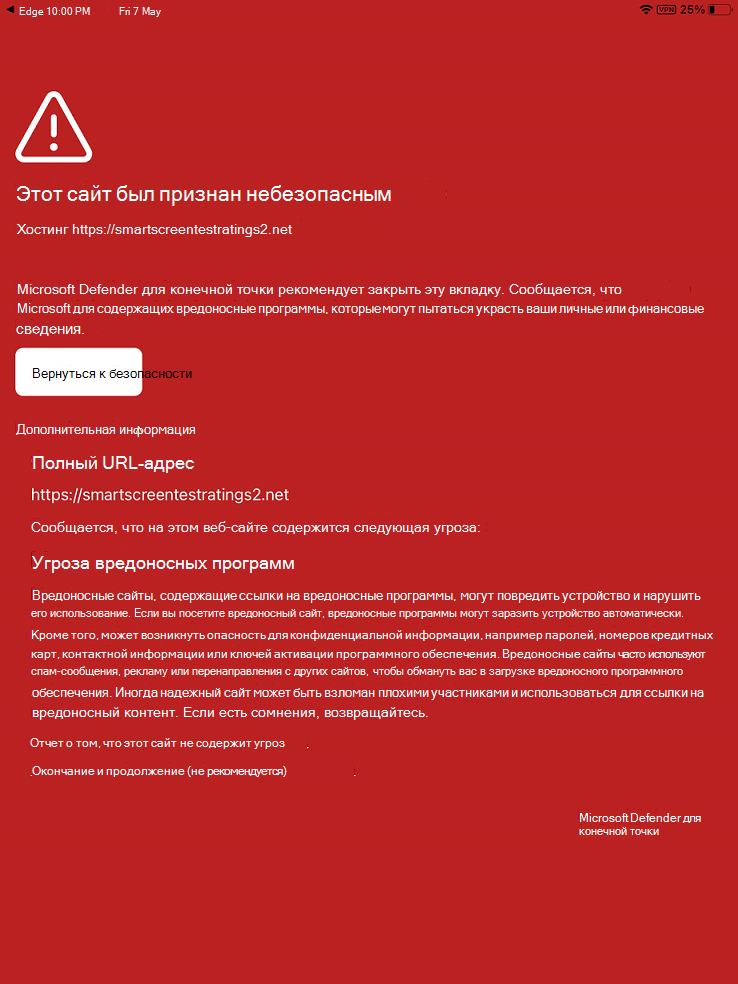

# Устранение неполадок и поиск ответов на вопросы в Microsoft Defender для конечной точки на iOSTroubleshoot issues and find answers to FAQs on Microsoft Defender for Endpoint on iOS

[!INCLUDE [Microsoft 365 Defender rebranding](../../includes/microsoft-defender.md)]

**Область применения:****Applies to:**
- [Microsoft Defender для конечной точкиMicrosoft Defender for Endpoint](https://go.microsoft.com/fwlink/p/?linkid=2154037)
- [Microsoft 365 DefenderMicrosoft 365 Defender](https://go.microsoft.com/fwlink/?linkid=2118804)

> Хотите испытать Defender для конечной точки?Want to experience Defender for Endpoint? [Зарегистрився для бесплатной пробной.Sign up for a free trial.](https://www.microsoft.com/microsoft-365/windows/microsoft-defender-atp?ocid=docs-wdatp-exposedapis-abovefoldlink) 

В этом разделе содержится информация об устранении неполадок, которые помогут вам устранить проблемы, которые могут возникнуть при использовании Microsoft Defender для конечной точки в iOS.This topic provides troubleshooting information to help you address issues that may arise as you use Microsoft Defender for Endpoint on iOS.

> [!NOTE]
> Защитник для конечной точки на iOS будет использовать VPN для предоставления функции веб-защиты.Defender for Endpoint on iOS would use a VPN in order to provide the Web Protection feature. Это не обычный VPN и локальный или самоциклинг VPN, который не принимает трафик за пределами устройства.This is not a regular VPN and is a local/self-looping VPN that does not take traffic outside the device.

## Приложения не работают при включении VPNApps don't work when VPN is turned on
Есть приложения, которые перестают работать при обнаружении активного VPN.There are some apps that stop functioning when an active VPN is detected. Вы можете отключить VPN во время использования таких приложений.You can disable the VPN during the time you are using such apps. 

По умолчанию Защитник для конечной точки на iOS включает и включает функцию веб-защиты.By default, Defender for Endpoint on iOS includes and enables the web protection feature. [Веб-защита](web-protection-overview.md) помогает защитить устройства от веб-угроз и защитить пользователей от фишинговых атак.[Web protection](web-protection-overview.md) helps to secure devices against web threats and protect users from phishing attacks. Защитник для конечной точки на iOS использует VPN, чтобы обеспечить эту защиту.Defender for Endpoint on iOS uses a VPN in order to provide this protection. Обратите внимание, что это локальный VPN, и в отличие от традиционного VPN сетевой трафик не отправляется за пределы устройства.Please note this is a local VPN and unlike traditional VPN, network traffic is not sent outside the device.

Хотя по умолчанию включена, могут быть некоторые случаи, которые требуют отключения VPN.While enabled by default, there might be some cases that require you to disable VPN. Например, необходимо запустить некоторые приложения, которые не работают при настройке VPN.For example, you want to run some apps that do not work when a VPN is configured. В таких случаях можно отключить VPN из приложения на устройстве, следуя следующим ниже шагам:In such cases, you can choose to disable VPN from the app on the device by following the steps below:

1. На устройстве iOS откройте приложение **Параметры,** щелкните или нажмите **кнопку General,** а затем **VPN.**On your iOS device, open the **Settings** app, click or tap **General** and then **VPN**.
1. Щелкните или нажмите кнопку "i" для Microsoft Defender для конечной точки.Click or tap the "i" button for Microsoft Defender for Endpoint.
1. Отключение **Подключение по требованию** для отключения VPN.Toggle off **Connect On Demand** to disable VPN.

    > [!div class="mx-imgBorder"]
    > 

> [!NOTE]
> Веб-защита не будет доступна при отключении VPN.Web Protection will not be available when VPN is disabled. Чтобы повторно включить веб-защиту, откройте приложение Microsoft Defender для конечной точки на устройстве и нажмите кнопку Начните **VPN.**To re-enable Web Protection, open the Microsoft Defender for Endpoint app on the device and click or tap **Start VPN**.

## Совместное существование с несколькими профилями VPNCo-existence with multiple VPN profiles

Apple iOS не поддерживает одновременное активное участие нескольких VPN **в** масштабе устройств.Apple iOS does not support multiple **device-wide** VPNs to be active simultaneously. Хотя на устройстве может существовать несколько профилей VPN, одновременно может быть активен только один VPN.While multiple VPN profiles can exist on the device, only one VPN can be active at a time.

Microsoft Defender для VPN конечной точки может сосуществовать  с другими VPN, настроенными как приложение или *"Личный".*Microsoft Defender for Endpoint VPN can co-exist with other VPNs that are configured as *per-app* or *"Personal"*.

## Потребление батареиBattery consumption

В приложении Параметры iOS отображается только использование батареи приложений, видимых пользователю в течение определенного времени.In the Settings app, iOS only shows battery usage of apps that are visible to the user for a specific duration of time. Использование батареи приложениями, показанными на экране, только в течение этого времени и вычисляется iOS на основе множества факторов, включая использование ЦП и Сети.The battery usage by apps shown on the screen are only for that time duration and is computed by iOS based on a multitude of factors including CPU and Network usage. Microsoft Defender для конечной точки использует локальный VPN-сервер в фоновом режиме для проверки веб-трафика на любые вредоносные веб-сайты или подключения.Microsoft Defender for Endpoint uses a local/loop-back VPN in the background to check web traffic for any malicious websites or connections. Сетевые пакеты из любого приложения проходят эту проверку, что приводит к неправильному вычислению использования батареи Microsoft Defender для конечной точки.Network packets from any app go through this check and that causes the battery usage of Microsoft Defender for Endpoint to be computed inaccurately. Фактическое потребление батареи в Microsoft Defender для конечной точки значительно меньше, чем то, что показано на Параметры на устройстве.The actual battery consumption of Microsoft Defender for Endpoint is much less than what is shown on the Battery Settings page on the device.

В среднем ежедневное использование батареи Microsoft Defender для конечной точки, запущенной в фоновом режиме, составляет примерно **8,81%** от общего расхода батареи в этот день.On an average, per-day battery usage by Microsoft Defender for Endpoint running on the background is **approximately 8.81% of overall battery consumed in that day**. Эта метрика сообщается Apple на основе фактического использования Microsoft Defender для конечной точки на устройствах конечного пользователя и по причинам, указанным выше, также может быть учтена в других приложениях, которые имеют сетевой активности.This metric is reported by Apple based on actual usage of Microsoft Defender for Endpoint on end-user devices and due to reasons mentioned above can also be accounted to other apps that have network activity.

Кроме того, используемый VPN является локальным VPN и в отличие от традиционного VPN, сетевой трафик не отправляется за пределы устройства.Also, the VPN used is a local VPN and unlike a traditional VPN, network traffic is not sent outside the device.

## Использование данныхData usage

Microsoft Defender для конечной точки использует локальный VPN-сервер для проверки веб-трафика на любые вредоносные веб-сайты или подключения.Microsoft Defender for Endpoint uses a local/loopback VPN to check web traffic for any malicious websites or connections. По этой причине использование данных в Microsoft Defender для конечных точек может быть неправильно учтено.Due to this reason, Microsoft Defender for Endpoint data usage can be inaccurately accounted for. Мы также заметили, что если устройство находится только в сотовой сети, использование данных, о чем сообщает поставщик услуг, очень близко к фактическому потреблению, в то время как в приложении Параметры Apple показывает от 1,5 до 2x фактических потребляемых данных.We have also observed that if the device is on cellular network only, the data usage reported by service provider is very close to the actual consumption whereas in the Settings app, Apple shows about 1.5x to 2x of actual data consumed.

У нас есть аналогичные наблюдения и с другими VPN-службами, и мы сообщили об этом в Apple.We have similar observations with other VPN services as well and have reported this to Apple.

Кроме того, для microsoft Defender для конечной точки крайне важно быть в курсе наших дополнительных служб, чтобы обеспечить лучшую защиту.In addition, it is critical for Microsoft Defender for Endpoint to be up to date with our backend services to provide better protection. Однако мы работаем над оптимизацией использования данных Microsoft Defender для конечной точки.However, we are working on optimizing the data usage by Microsoft Defender for Endpoint.

## Сообщить о небезопасном сайтеReport unsafe site

Фишинговые веб-сайты выдают себя за надежные веб-сайты с целью получения личной или финансовой информации.Phishing websites impersonate trustworthy websites for the purpose of obtaining your personal or financial information. Чтобы сообщить о веб-сайте, который может быть фишинг-сайтом, посетите страницу Provide feedback about [network](https://www.microsoft.com/wdsi/filesubmission/exploitguard/networkprotection) protection page.Visit the [Provide feedback about network protection](https://www.microsoft.com/wdsi/filesubmission/exploitguard/networkprotection) page to report a website that could be a phishing site.

## Обнаружен вредоносный сайтMalicious site detected

Microsoft Defender для конечной точки защищает вас от фишинга или других веб-атак.Microsoft Defender for Endpoint protects you against phishing or other web-based attacks. Если обнаружен вредоносный сайт, подключение блокируется, и на портал Центра безопасности организации отправляется оповещение.If a malicious site is detected, the connection is blocked and an alert is sent to the organization's Security Center portal. Оповещение включает доменное имя подключения, удаленный IP-адрес и сведения об устройстве.The alert includes the domain name of the connection, remote IP address and the device details.

Кроме того, уведомление отображается на устройстве iOS.In addition, a notification is shown on the iOS device. Нажатие на уведомление открывает следующий экран для просмотра сведений.Tapping on the notification opens the following screen for the user to review the details.

> [!div class="mx-imgBorder"]
> 

## Данные и конфиденциальностьData and Privacy

Сведения о собранных данных и конфиденциальности см. в материале [Privacy Information - Microsoft Defender for Endpoint on iOS.](ios-privacy.md)For details about data collected and privacy, see [Privacy Information - Microsoft Defender for Endpoint on iOS](ios-privacy.md).

