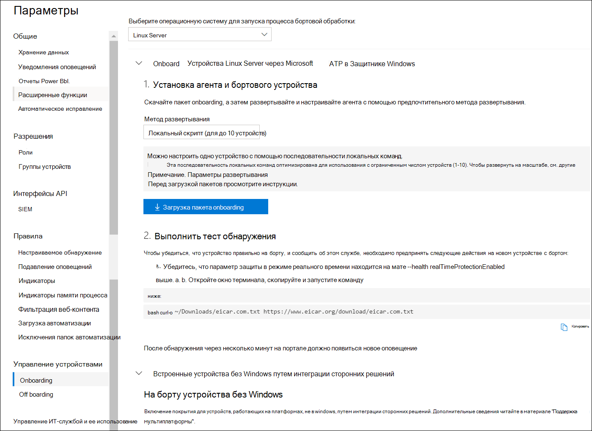

# <a name="deploy-microsoft-defender-for-endpoint-on-linux-manually"></a>Развертывание Microsoft Defender для конечной точки на Linux вручную

[!INCLUDE [Microsoft 365 Defender rebranding](../../includes/microsoft-defender.md)]


**Область применения:**
- [Microsoft Defender для конечной точки](https://go.microsoft.com/fwlink/p/?linkid=2154037)
- [Microsoft 365 Defender](https://go.microsoft.com/fwlink/?linkid=2118804)

> Хотите испытать Defender для конечной точки? [Зарегистрився для бесплатной пробной.](https://www.microsoft.com/microsoft-365/windows/microsoft-defender-atp?ocid=docs-wdatp-investigateip-abovefoldlink)

В этой статье описывается, как развернуть Microsoft Defender для конечной точки на Linux вручную. Успешное развертывание требует выполнения всех следующих задач:

- [Развертывание Microsoft Defender для конечной точки на Linux вручную](#deploy-microsoft-defender-for-endpoint-on-linux-manually)
  - [Необходимые условия и требования к системе](#prerequisites-and-system-requirements)
  - [Настройка репозитория программного обеспечения Linux](#configure-the-linux-software-repository)
    - [RHEL и варианты (CentOS и Oracle Linux)](#rhel-and-variants-centos-and-oracle-linux)
    - [SLES и варианты](#sles-and-variants)
    - [Системы Ubuntu и Debian](#ubuntu-and-debian-systems)
  - [Установка приложения](#application-installation)
  - [Скачайте пакет onboarding](#download-the-onboarding-package)
  - [Конфигурация клиента](#client-configuration)
  - [Сценарий установки](#installer-script)
  - [Проблемы с установкой журнала](#log-installation-issues)
  - [Обновления операционной системы](#operating-system-upgrades)
  - [Uninstallation](#uninstallation)

## <a name="prerequisites-and-system-requirements"></a>Необходимые условия и требования к системе

Перед началом работы см. в [веб-сайте Microsoft Defender для конечной](microsoft-defender-endpoint-linux.md) точки на Linux описание необходимых условий и системных требований для текущей версии программного обеспечения.

## <a name="configure-the-linux-software-repository"></a>Настройка репозитория программного обеспечения Linux

Защитник для конечной точки на Linux можно развернуть с одного из следующих каналов (обозначается ниже как *[канал]):* *инсайдеры-быстрые,* инсайдеры-медленные или *prod*.  Каждый из этих каналов соответствует репозиторию программного обеспечения Linux. Ниже приведены инструкции по настройке устройства для использования одного из этих репозиториев.

Выбор канала определяет тип и частоту обновлений, предлагаемых вашему устройству. Устройства в *инсайдерской* быстрой являются первыми, которые получают обновления и новые функции, а затем инсайдеры *медленно* и, *наконец, prod*.

Для предварительного просмотра новых функций и обеспечения ранней обратной связи рекомендуется настроить  некоторые устройства в вашем предприятии, чтобы использовать как инсайдеры-быстрые, так и *инсайдеры-медленные*.

> [!WARNING]
> Переключение канала после начальной установки требует повторной установки продукта. Чтобы переключить канал продукта: удалить существующий пакет, перенастройте устройство для использования нового канала и выполните действия в этом документе, чтобы установить пакет из нового расположения.

### <a name="rhel-and-variants-centos-and-oracle-linux"></a>RHEL и варианты (CentOS и Oracle Linux)

- Установка, `yum-utils` если она еще не установлена:

    ```bash
    sudo yum install yum-utils
    ```

- Обратите внимание на рассылку и версию и определите ближайшую запись (по мажорной, затем второстепенной) для нее в `https://packages.microsoft.com/config/` статье . Например, RHEL 7.9 ближе к 7.4, чем к 8.

    В приведенных ниже командах *замените [distro]* *и [version]* данными, которые вы определили:

    > [!NOTE]
    > В случае Oracle Linux *замените [дистрибутив]* на "rhel".

    ```bash
    sudo yum-config-manager --add-repo=https://packages.microsoft.com/config/[distro]/[version]/[channel].repo
    ```

    Например, если вы работаете с CentOS 7 и хотите развернуть Defender для конечной точки на Linux из *прод-канала:*

    ```bash
    sudo yum-config-manager --add-repo=https://packages.microsoft.com/config/centos/7/prod.repo
    ```

    Или если вы хотите изучить новые функции на выбранных устройствах, возможно, вам захочется развернуть MDE для Linux на канале с быстрыми *инсайдерами:*

    ```bash
    sudo yum-config-manager --add-repo=https://packages.microsoft.com/config/centos/7/insiders-fast.repo
    ```

- Установите общедоступный ключ Microsoft GPG:

    ```bash
    sudo rpm --import http://packages.microsoft.com/keys/microsoft.asc
    ```

- Скачайте и сделайте возможными все метаданные для текущих репозиториев yum с включенной поддержкой:

    ```bash
    yum makecache
    ```

### <a name="sles-and-variants"></a>SLES и варианты

- Обратите внимание на распространение и версию и определите ближайшую запись (по мажорной, затем второстепенной) для нее под `https://packages.microsoft.com/config/` .

    В следующих командах *замените [distro]* *и [версию]* данными, которые вы определили:

    ```bash
    sudo zypper addrepo -c -f -n microsoft-[channel] https://packages.microsoft.com/config/[distro]/[version]/[channel].repo
    ```

    Например, если вы работаете с SLES 12 и хотите развернуть MDE для Linux из *прод-канала:*

    ```bash
    sudo zypper addrepo -c -f -n microsoft-prod https://packages.microsoft.com/config/sles/12/prod.repo
    ```

- Установите общедоступный ключ Microsoft GPG:

    ```bash
    sudo rpm --import http://packages.microsoft.com/keys/microsoft.asc
    ```

### <a name="ubuntu-and-debian-systems"></a>Системы Ubuntu и Debian

- Установка, `curl` если она еще не установлена:

    ```bash
    sudo apt-get install curl
    ```

- Установка, `libplist-utils` если она еще не установлена:

    ```bash
    sudo apt-get install libplist-utils
    ```

- Обратите внимание на рассылку и версию и определите ближайшую запись (по мажорной, затем второстепенной) для нее в `https://packages.microsoft.com/config` статье .

    В приведенной ниже команде *замените [distro]* *и [version]* данными, которые вы определили:

    ```bash
    curl -o microsoft.list https://packages.microsoft.com/config/[distro]/[version]/[channel].list
    ```

    Например, если вы работаете в Ubuntu 18.04 и хотите развернуть MDE для Linux из *прод-канала:*

    ```bash
    curl -o microsoft.list https://packages.microsoft.com/config/ubuntu/18.04/prod.list
    ```

- Установка конфигурации репозиториев:

    ```bash
    sudo mv ./microsoft.list /etc/apt/sources.list.d/microsoft-[channel].list
    ```
    Например, если вы выбрали *канал prod:*

    ```bash
    sudo mv ./microsoft.list /etc/apt/sources.list.d/microsoft-prod.list
    ```

- Установите `gpg` пакет, если он еще не установлен:

    ```bash
    sudo apt-get install gpg
    ```

  Если `gpg` нет, установите `gnupg` .

- Установите общедоступный ключ Microsoft GPG:

    ```bash
    curl https://packages.microsoft.com/keys/microsoft.asc | sudo apt-key add -
    ```

- Установите драйвер https, если он еще не присутствует:

    ```bash
    sudo apt-get install apt-transport-https
    ```

- Обновление метаданных репозиториев:

    ```bash
    sudo apt-get update
    ```

## <a name="application-installation"></a>Установка приложения

- RHEL и варианты (CentOS и Oracle Linux):

    ```bash
    sudo yum install mdatp
    ```

    Если на вашем устройстве настроено несколько репозиториев Майкрософт, можно уникать, из каких репозиториев установить пакет. В следующем примере показано, как установить пакет из канала, если на этом устройстве также настроен канал `production` `insiders-fast` репозиториев. Такая ситуация может произойти, если вы используете несколько продуктов Майкрософт на вашем устройстве. В зависимости от распространения и версии сервера псевдоним репозитория может быть иным, чем в следующем примере.

    ```bash
    # list all repositories
    yum repolist
    ```
    ```Output
    ...
    packages-microsoft-com-prod               packages-microsoft-com-prod        316
    packages-microsoft-com-prod-insiders-fast packages-microsoft-com-prod-ins      2
    ...
    ```
    ```bash
    # install the package from the production repository
    sudo yum --enablerepo=packages-microsoft-com-prod install mdatp
    ```

- SLES и варианты:

    ```bash
    sudo zypper install mdatp
    ```

    Если на вашем устройстве настроено несколько репозиториев Майкрософт, можно уникать, из каких репозиториев установить пакет. В следующем примере показано, как установить пакет из канала, если на этом устройстве также настроен канал `production` `insiders-fast` репозиториев. Такая ситуация может произойти, если вы используете несколько продуктов Майкрософт на вашем устройстве.

    ```bash
    zypper repos
    ```

    ```Output
    ...
    #  | Alias | Name | ...
    XX | packages-microsoft-com-insiders-fast | microsoft-insiders-fast | ...
    XX | packages-microsoft-com-prod | microsoft-prod | ...
    ...
    ```
    ```bash
    sudo zypper install packages-microsoft-com-prod:mdatp
    ```

- Система Ubuntu и Debian:

    ```bash
    sudo apt-get install mdatp
    ```

    Если на вашем устройстве настроено несколько репозиториев Майкрософт, можно уникать, из каких репозиториев установить пакет. В следующем примере показано, как установить пакет из канала, если на этом устройстве также настроен канал `production` `insiders-fast` репозиториев. Такая ситуация может произойти, если вы используете несколько продуктов Майкрософт на вашем устройстве.

    ```bash
    cat /etc/apt/sources.list.d/*
    ```
    ```Output
    deb [arch=arm64,armhf,amd64] https://packages.microsoft.com/ubuntu/18.04/prod insiders-fast main
    deb [arch=amd64] https://packages.microsoft.com/ubuntu/18.04/prod bionic main
    ```
    ```bash
    sudo apt -t bionic install mdatp
    ```

## <a name="download-the-onboarding-package"></a>Скачайте пакет onboarding

Скачайте бортовой пакет из Центр безопасности в Microsoft Defender:

1. В Центр безопасности в Microsoft Defender перейдите **к Параметры > управления устройствами > onboarding**.
2. В первом выпадаемом меню выберите **Linux Server** в качестве операционной системы. Во втором выпадаемом меню выберите локальный скрипт **(для до 10 устройств)** в качестве метода развертывания.
3. Выберите **пакет загрузки.** Сохраните файл как WindowsDefenderATPOnboardingPackage.zip.

    

4. С командной подсказки убедитесь, что у вас есть файл.
    Извлечение содержимого архива:

    ```bash
    ls -l
    ```

    ```Output
    total 8
    -rw-r--r-- 1 test  staff  5752 Feb 18 11:22 WindowsDefenderATPOnboardingPackage.zip
    ```

    ```bash
    unzip WindowsDefenderATPOnboardingPackage.zip
    ```
    ```Output
    Archive:  WindowsDefenderATPOnboardingPackage.zip
    inflating: MicrosoftDefenderATPOnboardingLinuxServer.py
    ```


## <a name="client-configuration"></a>Конфигурация клиента

1. Скопируйте MicrosoftDefenderATPOnboardingLinuxServer.py на целевое устройство.

    Изначально клиентские устройства не связаны с организацией. Обратите внимание, что атрибут *orgId* пустой:

    ```bash
    mdatp health --field org_id
    ```

2. Запустите MicrosoftDefenderATPOnboardingLinuxServer.py и обратите внимание, что для запуска этой команды необходимо установить `python` на устройстве:

    ```bash
    python MicrosoftDefenderATPOnboardingLinuxServer.py
    ```

3. Убедитесь, что устройство теперь связано с организацией и сообщает допустимый идентификатор организации:

    ```bash
    mdatp health --field org_id
    ```

4. Через несколько минут после завершения установки можно увидеть состояние, вы выполните следующую команду. Возвращаемая величина `1` обозначает, что продукт функционирует так, как ожидалось:

    ```bash
    mdatp health --field healthy
    ```

    > [!IMPORTANT]
    > Когда продукт запускается в первый раз, он скачивает последние определения противомалярийных программ. В зависимости от подключения к Интернету это может занять до нескольких минут. В течение этого времени вышеуказанная команда возвращает значение `false` . Состояние обновления определения можно проверить с помощью следующей команды:
    > ```bash
    > mdatp health --field definitions_status
    > ```
    > Обратите внимание, что после завершения начальной установки может потребоваться настроить прокси-сервер. См. в публикации Configure Defender for Endpoint on Linux для обнаружения статического [прокси-сервера: конфигурация после установки.](https://docs.microsoft.com/microsoft-365/security/defender-endpoint/linux-static-proxy-configuration#post-installation-configuration)

5. Запустите тест обнаружения, чтобы убедиться, что устройство правильно на борту, и сообщить об этом службе. Выполните следующие действия на недавно созданном устройстве:

    - Убедитесь, что в режиме реального времени включена защита (обозначаемая в результате запуска `1` следующей команды):

        ```bash
        mdatp health --field real_time_protection_enabled
        ```

    - Откройте окно терминала. Скопируйте и выполните следующую команду:

        ``` bash
        curl -o /tmp/eicar.com.txt https://www.eicar.org/download/eicar.com.txt
        ```

    - Файл должен был быть карантином для Defender для конечной точки на Linux. Чтобы перечислить все обнаруженные угрозы, используйте следующую команду:

        ```bash
        mdatp threat list
        ```

## <a name="installer-script"></a>Сценарий установки

Кроме того, вы можете [](https://github.com/microsoft/mdatp-xplat/blob/master/linux/installation/mde_installer.sh) использовать автоматический скрипт bash установки, предоставляемый в нашем [репозитории GitHub.](https://github.com/microsoft/mdatp-xplat/)
Сценарий определяет распределение и версию и настраивает устройство, чтобы вытащить последний пакет и установить его.
Вы также можете работать на борту с предоставленным скриптом.

```bash
❯ ./mde_installer.sh --help
usage: basename ./mde_installer.sh [OPTIONS]
Options:
-c|--channel      specify the channel from which you want to install. Default: insiders-fast
-i|--install      install the product
-r|--remove       remove the product
-u|--upgrade      upgrade the existing product
-o|--onboard      onboard/offboard the product with <onboarding_script>
-p|--passive-mode set EPP to passive mode
-t|--tag          set a tag by declaring <name> and <value>. ex: -t GROUP Coders
-m|--min_req      enforce minimum requirements
-w|--clean        remove repo from package manager for a specific channel
-v|--version      print out script version
-h|--help         display help
```

Подробнее [здесь](https://github.com/microsoft/mdatp-xplat/tree/master/linux/installation).

## <a name="log-installation-issues"></a>Проблемы с установкой журнала

Дополнительные [сведения о](linux-resources.md#log-installation-issues) том, как найти автоматически созданный журнал, созданный установщиком при ошибке, см. в дополнительных сведениях о проблемах установки журнала.

## <a name="operating-system-upgrades"></a>Обновления операционной системы

При обновлении операционной системы до новой основной версии необходимо сначала удалить Defender для конечной точки на Linux, установить обновление и, наконец, перенастроить Defender для конечной точки на Linux на вашем устройстве.

## <a name="how-to-migrate-from-insiders-fast-to-production-channel"></a>Миграция из Insiders-Fast в канал Production

1. Удалить версию MDE для Linux "Insiders-Fast channel".

    ``
    sudo yum remove mdatp
    ``

1. Отключение репо MDE для Linux Insiders-Fast  ``
    sudo yum repolist
    ``

    > [!NOTE]
    > Вывод должен показывать "packages-microsoft-com-fast-prod".

    ``
    sudo yum-config-manager --disable packages-microsoft-com-fast-prod
    ``
1. Передиплой MDE для Linux с помощью "Производственного канала".


## <a name="uninstallation"></a>Uninstallation

Сведения о том, как удалить Defender для конечной точки на Linux с клиентских устройств, см. в материале [Uninstall.](linux-resources.md#uninstall)

## <a name="see-also"></a>См. также
- [Изучение проблем со здоровьем агента](health-status.md)
