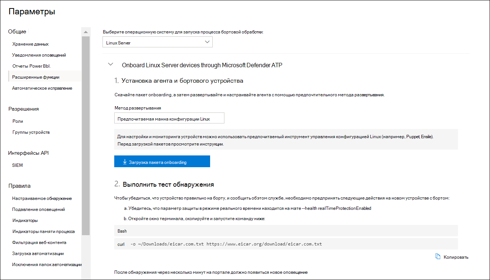

# <a name="deploy-microsoft-defender-for-endpoint-for-linux-with-ansible"></a><span data-ttu-id="ef0ac-104">Развертывание Microsoft Defender для конечной точки для Linux с помощью Ansible</span><span class="sxs-lookup"><span data-stu-id="ef0ac-104">Deploy Microsoft Defender for Endpoint for Linux with Ansible</span></span>

[!INCLUDE [Microsoft 365 Defender rebranding](../../includes/microsoft-defender.md)]


<span data-ttu-id="ef0ac-105">**Область применения:**</span><span class="sxs-lookup"><span data-stu-id="ef0ac-105">**Applies to:**</span></span>
- [<span data-ttu-id="ef0ac-106">Microsoft Defender для конечной точки</span><span class="sxs-lookup"><span data-stu-id="ef0ac-106">Microsoft Defender for Endpoint</span></span>](https://go.microsoft.com/fwlink/p/?linkid=2154037)
- [<span data-ttu-id="ef0ac-107">Microsoft 365 Defender</span><span class="sxs-lookup"><span data-stu-id="ef0ac-107">Microsoft 365 Defender</span></span>](https://go.microsoft.com/fwlink/?linkid=2118804)

> <span data-ttu-id="ef0ac-108">Хотите испытать Defender для конечной точки?</span><span class="sxs-lookup"><span data-stu-id="ef0ac-108">Want to experience Defender for Endpoint?</span></span> [<span data-ttu-id="ef0ac-109">Зарегистрився для бесплатной пробной.</span><span class="sxs-lookup"><span data-stu-id="ef0ac-109">Sign up for a free trial.</span></span>](https://www.microsoft.com/microsoft-365/windows/microsoft-defender-atp?ocid=docs-wdatp-investigateip-abovefoldlink)

<span data-ttu-id="ef0ac-110">В этой статье описывается развертывание Defender для конечной точки для Linux с помощью Ansible.</span><span class="sxs-lookup"><span data-stu-id="ef0ac-110">This article describes how to deploy Defender for Endpoint for Linux using Ansible.</span></span> <span data-ttu-id="ef0ac-111">Успешное развертывание требует выполнения всех следующих задач:</span><span class="sxs-lookup"><span data-stu-id="ef0ac-111">A successful deployment requires the completion of all of the following tasks:</span></span>

- [<span data-ttu-id="ef0ac-112">Скачайте пакет onboarding</span><span class="sxs-lookup"><span data-stu-id="ef0ac-112">Download the onboarding package</span></span>](#download-the-onboarding-package)
- [<span data-ttu-id="ef0ac-113">Создание файлов YaML ansible</span><span class="sxs-lookup"><span data-stu-id="ef0ac-113">Create Ansible YAML files</span></span>](#create-ansible-yaml-files)
- [<span data-ttu-id="ef0ac-114">Развертывание</span><span class="sxs-lookup"><span data-stu-id="ef0ac-114">Deployment</span></span>](#deployment)
- [<span data-ttu-id="ef0ac-115">References</span><span class="sxs-lookup"><span data-stu-id="ef0ac-115">References</span></span>](#references)

## <a name="prerequisites-and-system-requirements"></a><span data-ttu-id="ef0ac-116">Необходимые условия и требования к системе</span><span class="sxs-lookup"><span data-stu-id="ef0ac-116">Prerequisites and system requirements</span></span>

<span data-ttu-id="ef0ac-117">Перед началом работы см. на главной странице [Defender for Endpoint для Linux](microsoft-defender-endpoint-linux.md) описание необходимых условий и системных требований к текущей версии программного обеспечения.</span><span class="sxs-lookup"><span data-stu-id="ef0ac-117">Before you get started, see [the main Defender for Endpoint for Linux page](microsoft-defender-endpoint-linux.md) for a description of prerequisites and system requirements for the current software version.</span></span>

<span data-ttu-id="ef0ac-118">Кроме того, для развертывания Ansible необходимо ознакомиться с задачами администрирования Ansible, настроить ansible и уметь развертывать книги и задачи.</span><span class="sxs-lookup"><span data-stu-id="ef0ac-118">In addition, for Ansible deployment, you need to be familiar with Ansible administration tasks, have Ansible configured, and know how to deploy playbooks and tasks.</span></span> <span data-ttu-id="ef0ac-119">Ansible имеет множество способов выполнения одной и той же задачи.</span><span class="sxs-lookup"><span data-stu-id="ef0ac-119">Ansible has many ways to complete the same task.</span></span> <span data-ttu-id="ef0ac-120">Эти инструкции предполагают доступность поддерживаемых модулей Ansible, таких как *apt* и *unarchive* для развертывания пакета.</span><span class="sxs-lookup"><span data-stu-id="ef0ac-120">These instructions assume availability of supported Ansible modules, such as *apt* and *unarchive* to help deploy the package.</span></span> <span data-ttu-id="ef0ac-121">Ваша организация может использовать другой рабочий процесс.</span><span class="sxs-lookup"><span data-stu-id="ef0ac-121">Your organization might use a different workflow.</span></span> <span data-ttu-id="ef0ac-122">Дополнительные сведения можно найти в [документации Ansible.](https://docs.ansible.com/)</span><span class="sxs-lookup"><span data-stu-id="ef0ac-122">Refer to the [Ansible documentation](https://docs.ansible.com/) for details.</span></span>

- <span data-ttu-id="ef0ac-123">Ansible необходимо установить по крайней мере на одном компьютере (мы назовем его основным компьютером).</span><span class="sxs-lookup"><span data-stu-id="ef0ac-123">Ansible needs to be installed on at least one computer (we will call it the primary computer).</span></span>
- <span data-ttu-id="ef0ac-124">SSH необходимо настроить для учетной записи администратора между основным компьютером и всеми клиентами, и рекомендуется настроить ее с помощью проверки подлинности общедоступных ключей.</span><span class="sxs-lookup"><span data-stu-id="ef0ac-124">SSH must be configured for an administrator account between the primary computer and all clients, and it is recommended be configured with public key authentication.</span></span>
- <span data-ttu-id="ef0ac-125">Для всех клиентов необходимо установить следующее программное обеспечение:</span><span class="sxs-lookup"><span data-stu-id="ef0ac-125">The following software must be installed on all clients:</span></span>
  - <span data-ttu-id="ef0ac-126">curl</span><span class="sxs-lookup"><span data-stu-id="ef0ac-126">curl</span></span>
  - <span data-ttu-id="ef0ac-127">python-apt</span><span class="sxs-lookup"><span data-stu-id="ef0ac-127">python-apt</span></span>

- <span data-ttu-id="ef0ac-128">Все хосты должны быть перечислены в следующем формате в `/etc/ansible/hosts` соответствующем файле:</span><span class="sxs-lookup"><span data-stu-id="ef0ac-128">All hosts must be listed in the following format in the `/etc/ansible/hosts` or relevant file:</span></span>

    ```bash
    [servers]
    host1 ansible_ssh_host=10.171.134.39
    host2 ansible_ssh_host=51.143.50.51
    ```

- <span data-ttu-id="ef0ac-129">Тест Ping:</span><span class="sxs-lookup"><span data-stu-id="ef0ac-129">Ping test:</span></span>

    ```bash
    ansible -m ping all
    ```

## <a name="download-the-onboarding-package"></a><span data-ttu-id="ef0ac-130">Скачайте пакет onboarding</span><span class="sxs-lookup"><span data-stu-id="ef0ac-130">Download the onboarding package</span></span>

<span data-ttu-id="ef0ac-131">Скачайте бортовой пакет из Центра безопасности Защитника Майкрософт:</span><span class="sxs-lookup"><span data-stu-id="ef0ac-131">Download the onboarding package from Microsoft Defender Security Center:</span></span>

1. <span data-ttu-id="ef0ac-132">В Центре безопасности Защитника Майкрософт перейдите в **параметры > управления устройствами > onboarding.**</span><span class="sxs-lookup"><span data-stu-id="ef0ac-132">In Microsoft Defender Security Center, go to **Settings > Device Management > Onboarding**.</span></span>
2. <span data-ttu-id="ef0ac-133">В первом выпадаемом меню выберите **Linux Server** в качестве операционной системы.</span><span class="sxs-lookup"><span data-stu-id="ef0ac-133">In the first drop-down menu, select **Linux Server** as the operating system.</span></span> <span data-ttu-id="ef0ac-134">Во втором выпадаемом меню выберите предпочтительный инструмент управления конфигурацией **Linux** в качестве метода развертывания.</span><span class="sxs-lookup"><span data-stu-id="ef0ac-134">In the second drop-down menu, select **Your preferred Linux configuration management tool** as the deployment method.</span></span>
3. <span data-ttu-id="ef0ac-135">Выберите **пакет загрузки.**</span><span class="sxs-lookup"><span data-stu-id="ef0ac-135">Select **Download onboarding package**.</span></span> <span data-ttu-id="ef0ac-136">Сохраните файл как WindowsDefenderATPOnboardingPackage.zip.</span><span class="sxs-lookup"><span data-stu-id="ef0ac-136">Save the file as WindowsDefenderATPOnboardingPackage.zip.</span></span>

    

4. <span data-ttu-id="ef0ac-138">С командной подсказки убедитесь, что у вас есть файл.</span><span class="sxs-lookup"><span data-stu-id="ef0ac-138">From a command prompt, verify that you have the file.</span></span> <span data-ttu-id="ef0ac-139">Извлечение содержимого архива:</span><span class="sxs-lookup"><span data-stu-id="ef0ac-139">Extract the contents of the archive:</span></span>

    ```bash
    ls -l
    ```
    ```Output
    total 8
    -rw-r--r-- 1 test  staff  4984 Feb 18 11:22 WindowsDefenderATPOnboardingPackage.zip
    ```
    ```bash
    unzip WindowsDefenderATPOnboardingPackage.zip
    ```
    ```Output
    Archive:  WindowsDefenderATPOnboardingPackage.zip
    inflating: mdatp_onboard.json
    ```

## <a name="create-ansible-yaml-files"></a><span data-ttu-id="ef0ac-140">Создание файлов YaML ansible</span><span class="sxs-lookup"><span data-stu-id="ef0ac-140">Create Ansible YAML files</span></span>

<span data-ttu-id="ef0ac-141">Создайте подзадачу или файлы ролей, которые вносят вклад в книгу или задачу.</span><span class="sxs-lookup"><span data-stu-id="ef0ac-141">Create a subtask or role files that contribute to an playbook or task.</span></span>

- <span data-ttu-id="ef0ac-142">Создайте задачу на `onboarding_setup.yml` борту:</span><span class="sxs-lookup"><span data-stu-id="ef0ac-142">Create the onboarding task, `onboarding_setup.yml`:</span></span>

    ```bash
    - name: Create MDATP directories
      file:
        path: /etc/opt/microsoft/mdatp/
        recurse: true
        state: directory
        mode: 0755
        owner: root
        group: root

    - name: Register mdatp_onboard.json
      stat:
        path: /etc/opt/microsoft/mdatp/mdatp_onboard.json
      register: mdatp_onboard

    - name: Extract WindowsDefenderATPOnboardingPackage.zip into /etc/opt/microsoft/mdatp
      unarchive:
        src: WindowsDefenderATPOnboardingPackage.zip
        dest: /etc/opt/microsoft/mdatp
        mode: 0600
        owner: root
        group: root
      when: not mdatp_onboard.stat.exists
    ```

- <span data-ttu-id="ef0ac-143">Добавьте репозиторий Defender для конечной точки и ключ.</span><span class="sxs-lookup"><span data-stu-id="ef0ac-143">Add the Defender for Endpoint repository and key.</span></span>

    <span data-ttu-id="ef0ac-144">Защитник для конечной точки для Linux можно развернуть с одного из следующих каналов (обозначается ниже как *[канал]):* *инсайдеры-быстрые,* инсайдеры-медленные или *prod*.  Каждый из этих каналов соответствует репозиторию программного обеспечения Linux.</span><span class="sxs-lookup"><span data-stu-id="ef0ac-144">Defender for Endpoint for Linux can be deployed from one of the following channels (denoted below as *[channel]*): *insiders-fast*, *insiders-slow*, or *prod*. Each of these channels corresponds to a Linux software repository.</span></span>

    <span data-ttu-id="ef0ac-145">Выбор канала определяет тип и частоту обновлений, предлагаемых вашему устройству.</span><span class="sxs-lookup"><span data-stu-id="ef0ac-145">The choice of the channel determines the type and frequency of updates that are offered to your device.</span></span> <span data-ttu-id="ef0ac-146">Устройства в *инсайдерской* быстрой являются первыми, которые получают обновления и новые функции, а затем инсайдеры *медленно* и, *наконец, prod*.</span><span class="sxs-lookup"><span data-stu-id="ef0ac-146">Devices in *insiders-fast* are the first ones to receive updates and new features, followed later by *insiders-slow* and lastly by *prod*.</span></span>

    <span data-ttu-id="ef0ac-147">Для предварительного просмотра новых функций и обеспечения ранней обратной связи рекомендуется настроить  некоторые устройства в вашем предприятии, чтобы использовать как инсайдеры-быстрые, так и *инсайдеры-медленные*.</span><span class="sxs-lookup"><span data-stu-id="ef0ac-147">In order to preview new features and provide early feedback, it is recommended that you configure some devices in your enterprise to use either *insiders-fast* or *insiders-slow*.</span></span>

    > [!WARNING]
    > <span data-ttu-id="ef0ac-148">Переключение канала после начальной установки требует повторной установки продукта.</span><span class="sxs-lookup"><span data-stu-id="ef0ac-148">Switching the channel after the initial installation requires the product to be reinstalled.</span></span> <span data-ttu-id="ef0ac-149">Чтобы переключить канал продукта: удалить существующий пакет, перенастройте устройство для использования нового канала и выполните действия в этом документе, чтобы установить пакет из нового расположения.</span><span class="sxs-lookup"><span data-stu-id="ef0ac-149">To switch the product channel: uninstall the existing package, re-configure your device to use the new channel, and follow the steps in this document to install the package from the new location.</span></span>

    <span data-ttu-id="ef0ac-150">Обратите внимание на рассылку и версию и определите ближайшую запись для нее в `https://packages.microsoft.com/config/` статье .</span><span class="sxs-lookup"><span data-stu-id="ef0ac-150">Note your distribution and version and identify the closest entry for it under `https://packages.microsoft.com/config/`.</span></span>

    <span data-ttu-id="ef0ac-151">В следующих командах *замените [distro]* *и [версию]* данными, которые вы идентифицировали.</span><span class="sxs-lookup"><span data-stu-id="ef0ac-151">In the following commands, replace *[distro]* and *[version]* with the information you've identified.</span></span>

    > [!NOTE]
    > <span data-ttu-id="ef0ac-152">В случае Oracle Linux *замените [дистрибутив]* на "rhel".</span><span class="sxs-lookup"><span data-stu-id="ef0ac-152">In case of Oracle Linux, replace *[distro]* with “rhel”.</span></span>

  ```bash
  - name: Add Microsoft APT key
    apt_key:
      keyserver: https://packages.microsoft.com/
      id: BC528686B50D79E339D3721CEB3E94ADBE1229CF
    when: ansible_os_family == "Debian"

  - name: Add Microsoft apt repository for MDATP
    apt_repository:
      repo: deb [arch=arm64,armhf,amd64] https://packages.microsoft.com/[distro]/[version]/prod [channel] main
      update_cache: yes
      state: present
      filename: microsoft-[channel].list
    when: ansible_os_family == "Debian"

  - name: Add Microsoft DNF/YUM key
    rpm_key:
      state: present
      key: https://packages.microsoft.com/keys/microsoft.asc
    when: ansible_os_family == "RedHat"

  - name: Add  Microsoft yum repository for MDATP
    yum_repository:
      name: packages-microsoft-com-prod-[channel]
      description: Microsoft Defender for Endpoint
      file: microsoft-[channel]
      baseurl: https://packages.microsoft.com/[distro]/[version]/[channel]/
      gpgcheck: yes
      enabled: Yes
  when: ansible_os_family == "RedHat"
  ```

- <span data-ttu-id="ef0ac-153">Создание установок Ansible и удалить файлы YAML.</span><span class="sxs-lookup"><span data-stu-id="ef0ac-153">Create the Ansible install and uninstall YAML files.</span></span>

    - <span data-ttu-id="ef0ac-154">Для apt-дистрибутивов используйте следующий файл YAML:</span><span class="sxs-lookup"><span data-stu-id="ef0ac-154">For apt-based distributions use the following YAML file:</span></span>

        ```bash
        cat install_mdatp.yml
        ```
        ```Output
        - hosts: servers
          tasks:
            - include: ../roles/onboarding_setup.yml
            - include: ../roles/add_apt_repo.yml
            - apt:
                name: mdatp
                state: latest
                update_cache: yes
        ```

        ```bash
        cat uninstall_mdatp.yml
        ```
        ```Output
        - hosts: servers
        tasks:
            - apt:
                name: mdatp
                state: absent
        ```

    - <span data-ttu-id="ef0ac-155">Для дистрибутивов на основе yum используйте следующий файл YAML:</span><span class="sxs-lookup"><span data-stu-id="ef0ac-155">For yum-based distributions use the following YAML file:</span></span>

        ```bash
        cat install_mdatp_yum.yml
        ```
        ```Output
        - hosts: servers
          tasks:
            - include: ../roles/onboarding_setup.yml
            - include: ../roles/add_yum_repo.yml
            - yum:
              name: mdatp
              state: latest
              enablerepo: packages-microsoft-com-prod-[channel]
        ```

        ```bash
        cat uninstall_mdatp_yum.yml
        ```
        ```Output
        - hosts: servers
        tasks:
            - yum:
               name: mdatp
                state: absent
        ```

## <a name="deployment"></a><span data-ttu-id="ef0ac-156">Развертывание</span><span class="sxs-lookup"><span data-stu-id="ef0ac-156">Deployment</span></span>

<span data-ttu-id="ef0ac-157">Теперь запустите файлы задач в `/etc/ansible/playbooks/` соответствующем каталоге.</span><span class="sxs-lookup"><span data-stu-id="ef0ac-157">Now run the tasks files under `/etc/ansible/playbooks/` or relevant directory.</span></span>

- <span data-ttu-id="ef0ac-158">Установка:</span><span class="sxs-lookup"><span data-stu-id="ef0ac-158">Installation:</span></span>

    ```bash
    ansible-playbook /etc/ansible/playbooks/install_mdatp.yml -i /etc/ansible/hosts
    ```

> [!IMPORTANT]
> <span data-ttu-id="ef0ac-159">Когда продукт запускается в первый раз, он скачивает последние определения противомалярийных программ.</span><span class="sxs-lookup"><span data-stu-id="ef0ac-159">When the product starts for the first time, it downloads the latest antimalware definitions.</span></span> <span data-ttu-id="ef0ac-160">В зависимости от подключения к Интернету это может занять до нескольких минут.</span><span class="sxs-lookup"><span data-stu-id="ef0ac-160">Depending on your Internet connection, this can take up to a few minutes.</span></span>

- <span data-ttu-id="ef0ac-161">Проверка/конфигурация:</span><span class="sxs-lookup"><span data-stu-id="ef0ac-161">Validation/configuration:</span></span>

    ```bash
    ansible -m shell -a 'mdatp connectivity test' all
    ```
    ```bash
    ansible -m shell -a 'mdatp health' all
    ```

- <span data-ttu-id="ef0ac-162">Uninstallation:</span><span class="sxs-lookup"><span data-stu-id="ef0ac-162">Uninstallation:</span></span>

    ```bash
    ansible-playbook /etc/ansible/playbooks/uninstall_mdatp.yml -i /etc/ansible/hosts
    ```

## <a name="log-installation-issues"></a><span data-ttu-id="ef0ac-163">Проблемы с установкой журнала</span><span class="sxs-lookup"><span data-stu-id="ef0ac-163">Log installation issues</span></span>

<span data-ttu-id="ef0ac-164">Дополнительные [сведения о](linux-resources.md#log-installation-issues) том, как найти автоматически созданный журнал, созданный установщиком при ошибке, см. в дополнительных сведениях о проблемах установки журнала.</span><span class="sxs-lookup"><span data-stu-id="ef0ac-164">See [Log installation issues](linux-resources.md#log-installation-issues) for more information on how to find the automatically generated log that is created by the installer when an error occurs.</span></span>

## <a name="operating-system-upgrades"></a><span data-ttu-id="ef0ac-165">Обновления операционной системы</span><span class="sxs-lookup"><span data-stu-id="ef0ac-165">Operating system upgrades</span></span>

<span data-ttu-id="ef0ac-166">При обновлении операционной системы до новой основной версии необходимо сначала удалить Defender для конечной точки для Linux, установить обновление и, наконец, перенастроить Defender для конечной точки для Linux на вашем устройстве.</span><span class="sxs-lookup"><span data-stu-id="ef0ac-166">When upgrading your operating system to a new major version, you must first uninstall Defender for Endpoint for Linux, install the upgrade, and finally reconfigure Defender for Endpoint for Linux on your device.</span></span>

## <a name="references"></a><span data-ttu-id="ef0ac-167">Ссылки</span><span class="sxs-lookup"><span data-stu-id="ef0ac-167">References</span></span>

- [<span data-ttu-id="ef0ac-168">Добавление или удаление репозиториев YUM</span><span class="sxs-lookup"><span data-stu-id="ef0ac-168">Add or remove YUM repositories</span></span>](https://docs.ansible.com/ansible/2.3/yum_repository_module.html)

- [<span data-ttu-id="ef0ac-169">Управление пакетами с помощью менеджера пакетов yum</span><span class="sxs-lookup"><span data-stu-id="ef0ac-169">Manage packages with the yum package manager</span></span>](https://docs.ansible.com/ansible/latest/modules/yum_module.html)

- [<span data-ttu-id="ef0ac-170">Добавление и удаление репозиториев APT</span><span class="sxs-lookup"><span data-stu-id="ef0ac-170">Add and remove APT repositories</span></span>](https://docs.ansible.com/ansible/latest/modules/apt_repository_module.html)

- [<span data-ttu-id="ef0ac-171">Управление пакетами apt</span><span class="sxs-lookup"><span data-stu-id="ef0ac-171">Manage apt-packages</span></span>](https://docs.ansible.com/ansible/latest/modules/apt_module.html)
