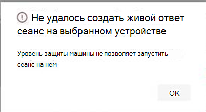

# <a name="investigate-entities-on-devices-using-live-response"></a><span data-ttu-id="53ca6-104">Исследование сущностями на устройствах с использованием живого ответа</span><span class="sxs-lookup"><span data-stu-id="53ca6-104">Investigate entities on devices using live response</span></span>

[!INCLUDE [Microsoft 365 Defender rebranding](../../includes/microsoft-defender.md)]

<span data-ttu-id="53ca6-105">**Область применения:**</span><span class="sxs-lookup"><span data-stu-id="53ca6-105">**Applies to:**</span></span>
- [<span data-ttu-id="53ca6-106">Microsoft Defender для конечной точки</span><span class="sxs-lookup"><span data-stu-id="53ca6-106">Microsoft Defender for Endpoint</span></span>](https://go.microsoft.com/fwlink/p/?linkid=2154037)
- [<span data-ttu-id="53ca6-107">Microsoft 365 Defender</span><span class="sxs-lookup"><span data-stu-id="53ca6-107">Microsoft 365 Defender</span></span>](https://go.microsoft.com/fwlink/?linkid=2118804)


> <span data-ttu-id="53ca6-108">Хотите испытать Defender для конечной точки?</span><span class="sxs-lookup"><span data-stu-id="53ca6-108">Want to experience Defender for Endpoint?</span></span> [<span data-ttu-id="53ca6-109">Зарегистрився для бесплатной пробной.</span><span class="sxs-lookup"><span data-stu-id="53ca6-109">Sign up for a free trial.</span></span>](https://www.microsoft.com/microsoft-365/windows/microsoft-defender-atp?ocid=docs-wdatp-investigateip-abovefoldlink)

<span data-ttu-id="53ca6-110">Живой ответ предоставляет группам операций безопасности мгновенный доступ к устройству (также именуемого машиной) с помощью удаленного подключения к оболочке.</span><span class="sxs-lookup"><span data-stu-id="53ca6-110">Live response gives security operations teams instantaneous access to a device (also referred to as a machine) using a remote shell connection.</span></span> <span data-ttu-id="53ca6-111">Это позволяет вам делать углубленные следственные действия и принимать срочные меры реагирования для оперативного сдерживания выявленных угроз в режиме реального времени.</span><span class="sxs-lookup"><span data-stu-id="53ca6-111">This gives you the power to do in-depth investigative work and take immediate response actions to promptly contain identified threats—in real time.</span></span> 

<span data-ttu-id="53ca6-112">Live response предназначен для повышения эффективности расследований, позволяя группе операций безопасности собирать судебные данные, запускать сценарии, отправлять подозрительные объекты для анализа, устранения угроз и активной охоты на возникающие угрозы.</span><span class="sxs-lookup"><span data-stu-id="53ca6-112">Live response is designed to enhance investigations by enabling your security operations team to collect forensic data, run scripts, send suspicious entities for analysis, remediate threats, and proactively hunt for emerging threats.</span></span><br/><br/>

> [!VIDEO https://www.microsoft.com/videoplayer/embed/RE4qLUW]

<span data-ttu-id="53ca6-113">При живом отклике аналитики могут выполнять все следующие задачи:</span><span class="sxs-lookup"><span data-stu-id="53ca6-113">With live response, analysts can do all of the following tasks:</span></span>
- <span data-ttu-id="53ca6-114">Запустите базовые и расширенные команды, чтобы выполнить следственные работы на устройстве.</span><span class="sxs-lookup"><span data-stu-id="53ca6-114">Run basic and advanced commands to do investigative work on a device.</span></span>
- <span data-ttu-id="53ca6-115">Скачайте файлы, такие как образцы вредоносных программ и результаты скриптов PowerShell.</span><span class="sxs-lookup"><span data-stu-id="53ca6-115">Download files such as malware samples and outcomes of PowerShell scripts.</span></span>
- <span data-ttu-id="53ca6-116">Скачайте файлы в фоновом режиме (новые!).</span><span class="sxs-lookup"><span data-stu-id="53ca6-116">Download files in the background (new!).</span></span>
- <span data-ttu-id="53ca6-117">Upload powerShell скрипт или исполняемый в библиотеку и запустите его на устройстве с уровня клиента.</span><span class="sxs-lookup"><span data-stu-id="53ca6-117">Upload a PowerShell script or executable to the library and run it on a device from a tenant level.</span></span>
- <span data-ttu-id="53ca6-118">Принять или отменить действия по исправлению.</span><span class="sxs-lookup"><span data-stu-id="53ca6-118">Take or undo remediation actions.</span></span>

## <a name="before-you-begin"></a><span data-ttu-id="53ca6-119">Подготовка к работе</span><span class="sxs-lookup"><span data-stu-id="53ca6-119">Before you begin</span></span>

<span data-ttu-id="53ca6-120">Прежде чем инициировать сеанс на устройстве, выполните следующие требования:</span><span class="sxs-lookup"><span data-stu-id="53ca6-120">Before you can initiate a session on a device, make sure you fulfill the following requirements:</span></span>

- <span data-ttu-id="53ca6-121">**Убедитесь, что вы работаете с поддерживаемой версией Windows.**</span><span class="sxs-lookup"><span data-stu-id="53ca6-121">**Verify that you're running a supported version of Windows**.</span></span> <br/>
<span data-ttu-id="53ca6-122">Устройства должны запускать одну из следующих версий Windows</span><span class="sxs-lookup"><span data-stu-id="53ca6-122">Devices must be running one of the following versions of Windows</span></span>

  - <span data-ttu-id="53ca6-123">**Windows 10**</span><span class="sxs-lookup"><span data-stu-id="53ca6-123">**Windows 10**</span></span>
    - <span data-ttu-id="53ca6-124">[Версия 1909 или](https://docs.microsoft.com/windows/whats-new/whats-new-windows-10-version-1909) более поздней версии</span><span class="sxs-lookup"><span data-stu-id="53ca6-124">[Version 1909](https://docs.microsoft.com/windows/whats-new/whats-new-windows-10-version-1909) or later</span></span>  
    - <span data-ttu-id="53ca6-125">[Версия 1903 с](https://docs.microsoft.com/windows/whats-new/whats-new-windows-10-version-1903) [KB4515384](https://support.microsoft.com/en-us/help/4515384/windows-10-update-kb4515384)</span><span class="sxs-lookup"><span data-stu-id="53ca6-125">[Version 1903](https://docs.microsoft.com/windows/whats-new/whats-new-windows-10-version-1903) with [KB4515384](https://support.microsoft.com/en-us/help/4515384/windows-10-update-kb4515384)</span></span>
    - <span data-ttu-id="53ca6-126">[Версия 1809 (RS 5)](https://docs.microsoft.com/windows/whats-new/whats-new-windows-10-version-1809) с [KB4537818](https://support.microsoft.com/help/4537818/windows-10-update-kb4537818)</span><span class="sxs-lookup"><span data-stu-id="53ca6-126">[Version 1809 (RS 5)](https://docs.microsoft.com/windows/whats-new/whats-new-windows-10-version-1809) with [with KB4537818](https://support.microsoft.com/help/4537818/windows-10-update-kb4537818)</span></span>
    - <span data-ttu-id="53ca6-127">[Версия 1803 (RS 4)](https://docs.microsoft.com/windows/whats-new/whats-new-windows-10-version-1803) с [KB4537795](https://support.microsoft.com/help/4537795/windows-10-update-kb4537795)</span><span class="sxs-lookup"><span data-stu-id="53ca6-127">[Version 1803 (RS 4)](https://docs.microsoft.com/windows/whats-new/whats-new-windows-10-version-1803) with [KB4537795](https://support.microsoft.com/help/4537795/windows-10-update-kb4537795)</span></span>
    - <span data-ttu-id="53ca6-128">[Версия 1709 (RS 3)](https://docs.microsoft.com/windows/whats-new/whats-new-windows-10-version-1709) с [KB4537816](https://support.microsoft.com/help/4537816/windows-10-update-kb4537816)</span><span class="sxs-lookup"><span data-stu-id="53ca6-128">[Version 1709 (RS 3)](https://docs.microsoft.com/windows/whats-new/whats-new-windows-10-version-1709) with [KB4537816](https://support.microsoft.com/help/4537816/windows-10-update-kb4537816)</span></span>
  
  - <span data-ttu-id="53ca6-129">**Windows Server 2019 — применимо только для предварительного просмотра для общего просмотра**</span><span class="sxs-lookup"><span data-stu-id="53ca6-129">**Windows Server 2019 - Only applicable for Public preview**</span></span>
    - <span data-ttu-id="53ca6-130">Версия 1903 или (с [KB4515384)](https://support.microsoft.com/en-us/help/4515384/windows-10-update-kb4515384)позже</span><span class="sxs-lookup"><span data-stu-id="53ca6-130">Version 1903 or (with [KB4515384](https://support.microsoft.com/en-us/help/4515384/windows-10-update-kb4515384)) later</span></span> 
    - <span data-ttu-id="53ca6-131">Версия 1809 (с [KB4537818)](https://support.microsoft.com/en-us/help/4537818/windows-10-update-kb4537818)</span><span class="sxs-lookup"><span data-stu-id="53ca6-131">Version 1809 (with [KB4537818](https://support.microsoft.com/en-us/help/4537818/windows-10-update-kb4537818))</span></span>

- <span data-ttu-id="53ca6-132">**Включить живой ответ со страницы расширенных параметров.**</span><span class="sxs-lookup"><span data-stu-id="53ca6-132">**Enable live response from the advanced settings page**.</span></span><br>
<span data-ttu-id="53ca6-133">Необходимо включить функцию живого ответа на странице [Параметры расширенных функций.](advanced-features.md)</span><span class="sxs-lookup"><span data-stu-id="53ca6-133">You'll need to enable the live response capability in the [Advanced features settings](advanced-features.md) page.</span></span>

    >[!NOTE]
    ><span data-ttu-id="53ca6-134">Изменить эти параметры могут только пользователи, у которых есть роли администратора безопасности или глобального администратора.</span><span class="sxs-lookup"><span data-stu-id="53ca6-134">Only users with manage security or global admin roles can edit these settings.</span></span>

- <span data-ttu-id="53ca6-135">**Включить живой ответ для серверов со страницы расширенных параметров** (рекомендуется).</span><span class="sxs-lookup"><span data-stu-id="53ca6-135">**Enable live response for servers from the advanced settings page** (recommended).</span></span><br>

    >[!NOTE]
    ><span data-ttu-id="53ca6-136">Изменить эти параметры могут только пользователи, у которых есть роли администратора безопасности или глобального администратора.</span><span class="sxs-lookup"><span data-stu-id="53ca6-136">Only users with manage security or global admin roles can edit these settings.</span></span>
    
- <span data-ttu-id="53ca6-137">**Убедитесь, что на устройстве** назначен уровень восстановления автоматизации.</span><span class="sxs-lookup"><span data-stu-id="53ca6-137">**Ensure that the device has an Automation Remediation level assigned to it**.</span></span><br>
<span data-ttu-id="53ca6-138">Необходимо включить, по крайней мере, минимальный уровень восстановления для данной группы устройств.</span><span class="sxs-lookup"><span data-stu-id="53ca6-138">You'll need to enable, at least, the minimum Remediation Level for a given Device Group.</span></span> <span data-ttu-id="53ca6-139">В противном случае вы не сможете установить сеанс Live Response для члена этой группы.</span><span class="sxs-lookup"><span data-stu-id="53ca6-139">Otherwise you won't be able to establish a Live Response session to a member of that group.</span></span>

    <span data-ttu-id="53ca6-140">Вы получите следующую ошибку:</span><span class="sxs-lookup"><span data-stu-id="53ca6-140">You'll receive the following error:</span></span>

    

- <span data-ttu-id="53ca6-142">**Включить живое выполнение сценария** без подписи ответа (необязательный).</span><span class="sxs-lookup"><span data-stu-id="53ca6-142">**Enable live response unsigned script execution** (optional).</span></span> <br>

    >[!WARNING]
    ><span data-ttu-id="53ca6-143">Разрешение использования неподписаных скриптов может повысить подверженность угрозам.</span><span class="sxs-lookup"><span data-stu-id="53ca6-143">Allowing the use of unsigned scripts may increase your exposure to threats.</span></span>
 
  <span data-ttu-id="53ca6-144">Не рекомендуется запускать неподписаные скрипты, так как это может повысить подверженность угрозам.</span><span class="sxs-lookup"><span data-stu-id="53ca6-144">Running unsigned scripts is not recommended as it can increase your exposure to threats.</span></span> <span data-ttu-id="53ca6-145">Однако если их необходимо использовать, необходимо включить параметр на странице [Расширенные параметры функций.](advanced-features.md)</span><span class="sxs-lookup"><span data-stu-id="53ca6-145">If you must use them however, you'll need to enable the setting in the [Advanced features settings](advanced-features.md) page.</span></span>
    
- <span data-ttu-id="53ca6-146">**Убедитесь, что у вас есть соответствующие разрешения.**</span><span class="sxs-lookup"><span data-stu-id="53ca6-146">**Ensure that you have the appropriate permissions**.</span></span><br>
    <span data-ttu-id="53ca6-147">Инициировать сеанс могут только пользователи, которые получили соответствующие разрешения.</span><span class="sxs-lookup"><span data-stu-id="53ca6-147">Only users who have been provisioned with the appropriate permissions can initiate a session.</span></span> <span data-ttu-id="53ca6-148">Дополнительные сведения о назначениях ролей см. в дополнительных сведениях [о создании и управлении ролями.](user-roles.md)</span><span class="sxs-lookup"><span data-stu-id="53ca6-148">For more information on role assignments, see [Create and manage roles](user-roles.md).</span></span> 

    > [!IMPORTANT]
    > <span data-ttu-id="53ca6-149">Возможность отправки файла в библиотеку доступна только тем, у кого есть соответствующие разрешения RBAC.</span><span class="sxs-lookup"><span data-stu-id="53ca6-149">The option to upload a file to the library is only available to those with the appropriate RBAC permissions.</span></span> <span data-ttu-id="53ca6-150">Кнопка серым цветом для пользователей с только делегированными разрешениями.</span><span class="sxs-lookup"><span data-stu-id="53ca6-150">The button is greyed out for users with only delegated permissions.</span></span>

    <span data-ttu-id="53ca6-151">В зависимости от роли, предоставленной вам, можно запускать базовые или расширенные команды живого ответа.</span><span class="sxs-lookup"><span data-stu-id="53ca6-151">Depending on the role that's been granted to you, you can run basic or advanced live response commands.</span></span> <span data-ttu-id="53ca6-152">Разрешения пользователей контролируются настраиваемой ролью RBAC.</span><span class="sxs-lookup"><span data-stu-id="53ca6-152">Users permissions are controlled by RBAC custom role.</span></span> 

## <a name="live-response-dashboard-overview"></a><span data-ttu-id="53ca6-153">Обзор панели мониторинга ответов в прямом эфире</span><span class="sxs-lookup"><span data-stu-id="53ca6-153">Live response dashboard overview</span></span>
<span data-ttu-id="53ca6-154">Когда вы инициируете сеанс живого ответа на устройстве, откроется панель мониторинга.</span><span class="sxs-lookup"><span data-stu-id="53ca6-154">When you initiate a live response session on a device, a dashboard opens.</span></span> <span data-ttu-id="53ca6-155">Панель мониторинга предоставляет сведения о сеансе, такие как следующие:</span><span class="sxs-lookup"><span data-stu-id="53ca6-155">The dashboard provides information about the session such as the following:</span></span> 

- <span data-ttu-id="53ca6-156">Кто сеанса</span><span class="sxs-lookup"><span data-stu-id="53ca6-156">Who created the session</span></span>
- <span data-ttu-id="53ca6-157">Когда сеанс начался</span><span class="sxs-lookup"><span data-stu-id="53ca6-157">When the session started</span></span>
- <span data-ttu-id="53ca6-158">Продолжительность сеанса</span><span class="sxs-lookup"><span data-stu-id="53ca6-158">The duration of the session</span></span>

<span data-ttu-id="53ca6-159">Панель мониторинга также предоставляет вам доступ к:</span><span class="sxs-lookup"><span data-stu-id="53ca6-159">The dashboard also gives you access to:</span></span>
- <span data-ttu-id="53ca6-160">Завершить сеанс.</span><span class="sxs-lookup"><span data-stu-id="53ca6-160">Disconnect session</span></span>
- <span data-ttu-id="53ca6-161">Upload файлы в библиотеку</span><span class="sxs-lookup"><span data-stu-id="53ca6-161">Upload files to the library</span></span> 
- <span data-ttu-id="53ca6-162">Консоль команд</span><span class="sxs-lookup"><span data-stu-id="53ca6-162">Command console</span></span>
- <span data-ttu-id="53ca6-163">Журнал команд</span><span class="sxs-lookup"><span data-stu-id="53ca6-163">Command log</span></span>


## <a name="initiate-a-live-response-session-on-a-device"></a><span data-ttu-id="53ca6-164">Инициировать сеанс живого ответа на устройстве</span><span class="sxs-lookup"><span data-stu-id="53ca6-164">Initiate a live response session on a device</span></span> 

1. <span data-ttu-id="53ca6-165">Во входе в Центр безопасности в Microsoft Defender.</span><span class="sxs-lookup"><span data-stu-id="53ca6-165">Sign in to Microsoft Defender Security Center.</span></span>

2. <span data-ttu-id="53ca6-166">Перейдите на страницу списка устройств и выберите устройство для исследования.</span><span class="sxs-lookup"><span data-stu-id="53ca6-166">Navigate to the devices list page and select a device to investigate.</span></span> <span data-ttu-id="53ca6-167">Откроется страница устройств.</span><span class="sxs-lookup"><span data-stu-id="53ca6-167">The devices page opens.</span></span>

3. <span data-ttu-id="53ca6-168">Запустите сеанс живого ответа, выбрав **сеанс инициировать сеанс живого ответа.**</span><span class="sxs-lookup"><span data-stu-id="53ca6-168">Launch the live response session by selecting **Initiate live response session**.</span></span> <span data-ttu-id="53ca6-169">Отображается командная консоль.</span><span class="sxs-lookup"><span data-stu-id="53ca6-169">A command console is displayed.</span></span> <span data-ttu-id="53ca6-170">Подождите, пока сеанс подключается к устройству.</span><span class="sxs-lookup"><span data-stu-id="53ca6-170">Wait while the session connects to the device.</span></span>

4. <span data-ttu-id="53ca6-171">Используйте встроенные команды для следственных действий.</span><span class="sxs-lookup"><span data-stu-id="53ca6-171">Use the built-in commands to do investigative work.</span></span> <span data-ttu-id="53ca6-172">Дополнительные сведения см. в [live response commands.](#live-response-commands)</span><span class="sxs-lookup"><span data-stu-id="53ca6-172">For more information, see [Live response commands](#live-response-commands).</span></span>

5. <span data-ttu-id="53ca6-173">После завершения расследования выберите сеанс **Отключение,** а затем выберите **Подтвердите.**</span><span class="sxs-lookup"><span data-stu-id="53ca6-173">After completing your investigation, select **Disconnect session**, then select **Confirm**.</span></span>

## <a name="live-response-commands"></a><span data-ttu-id="53ca6-174">Команды ответа в прямом эфире</span><span class="sxs-lookup"><span data-stu-id="53ca6-174">Live response commands</span></span>

<span data-ttu-id="53ca6-175">В зависимости от роли, предоставленной вам, можно запускать базовые или расширенные команды живого ответа.</span><span class="sxs-lookup"><span data-stu-id="53ca6-175">Depending on the role that's been granted to you, you can run basic or advanced live response commands.</span></span> <span data-ttu-id="53ca6-176">Разрешения пользователей контролируются пользовательскими ролями RBAC.</span><span class="sxs-lookup"><span data-stu-id="53ca6-176">User permissions are controlled by RBAC custom roles.</span></span> <span data-ttu-id="53ca6-177">Дополнительные сведения о назначениях ролей см. в дополнительных сведениях [о создании и управлении ролями.](user-roles.md)</span><span class="sxs-lookup"><span data-stu-id="53ca6-177">For more information on role assignments, see [Create and manage roles](user-roles.md).</span></span> 


>[!NOTE]
><span data-ttu-id="53ca6-178">Live response — это облачная интерактивная оболочка, так как в зависимости от качества сети и системной нагрузки между конечным пользователем и целевым устройством время отклика может различаться.</span><span class="sxs-lookup"><span data-stu-id="53ca6-178">Live response is a cloud-based interactive shell, as such, specific command experience may vary in response time depending on network quality and system load between the end user and the target device.</span></span>

### <a name="basic-commands"></a><span data-ttu-id="53ca6-179">Основные команды</span><span class="sxs-lookup"><span data-stu-id="53ca6-179">Basic commands</span></span>

<span data-ttu-id="53ca6-180">Следующие команды доступны для ролей пользователей, которые могут выполнять базовые команды **живого** ответа.</span><span class="sxs-lookup"><span data-stu-id="53ca6-180">The following commands are available for user roles that are granted the ability to run **basic** live response commands.</span></span> <span data-ttu-id="53ca6-181">Дополнительные сведения о назначениях ролей см. в дополнительных сведениях [о создании и управлении ролями.](user-roles.md)</span><span class="sxs-lookup"><span data-stu-id="53ca6-181">For more information on role assignments, see [Create and manage roles](user-roles.md).</span></span> 

| <span data-ttu-id="53ca6-182">Команда</span><span class="sxs-lookup"><span data-stu-id="53ca6-182">Command</span></span> | <span data-ttu-id="53ca6-183">Описание</span><span class="sxs-lookup"><span data-stu-id="53ca6-183">Description</span></span> |
|---|---|--- |
|`cd` | <span data-ttu-id="53ca6-184">Изменение текущего каталога.</span><span class="sxs-lookup"><span data-stu-id="53ca6-184">Changes the current directory.</span></span> | 
|`cls` | <span data-ttu-id="53ca6-185">Очищает экран консоли.</span><span class="sxs-lookup"><span data-stu-id="53ca6-185">Clears the console screen.</span></span>  |
|`connect` | <span data-ttu-id="53ca6-186">Инициирует сеанс живого ответа на устройство.</span><span class="sxs-lookup"><span data-stu-id="53ca6-186">Initiates a live response session to the device.</span></span> |
|`connections` | <span data-ttu-id="53ca6-187">Отображает все активные подключения.</span><span class="sxs-lookup"><span data-stu-id="53ca6-187">Shows all the active connections.</span></span> |
|`dir` | <span data-ttu-id="53ca6-188">Показывает список файлов и подтекстов в каталоге.</span><span class="sxs-lookup"><span data-stu-id="53ca6-188">Shows a list of files and subdirectories in a directory.</span></span> |
|`drivers` |  <span data-ttu-id="53ca6-189">Отображает все драйверы, установленные на устройстве.</span><span class="sxs-lookup"><span data-stu-id="53ca6-189">Shows all drivers installed on the device.</span></span> |
|`fg <command ID>` | <span data-ttu-id="53ca6-190">Поместите указанное задание на переднем плане на переднем плане, что делает его текущим заданием.</span><span class="sxs-lookup"><span data-stu-id="53ca6-190">Place the specified job in the foreground in the foreground, making it the current job.</span></span> <br> <span data-ttu-id="53ca6-191">ПРИМЕЧАНИЕ: fg принимает "командный ID", доступный с рабочих мест, а не с PID</span><span class="sxs-lookup"><span data-stu-id="53ca6-191">NOTE: fg takes a “command ID” available from jobs, not a PID</span></span> |
|`fileinfo` | <span data-ttu-id="53ca6-192">Получение сведений о файле.</span><span class="sxs-lookup"><span data-stu-id="53ca6-192">Get information about a file.</span></span> |
|`findfile` | <span data-ttu-id="53ca6-193">Находит файлы с заданным именем на устройстве.</span><span class="sxs-lookup"><span data-stu-id="53ca6-193">Locates files by a given name on the device.</span></span> |
|`getfile <file_path>` | <span data-ttu-id="53ca6-194">Скачивает файл.</span><span class="sxs-lookup"><span data-stu-id="53ca6-194">Downloads a file.</span></span> |
|`help` | <span data-ttu-id="53ca6-195">Предоставляет сведения о справке для команд живого ответа.</span><span class="sxs-lookup"><span data-stu-id="53ca6-195">Provides help information for live response commands.</span></span> |
|`jobs` | <span data-ttu-id="53ca6-196">Показывает в настоящее время запущенные задания, их ID и состояние.</span><span class="sxs-lookup"><span data-stu-id="53ca6-196">Shows currently running jobs, their ID and status.</span></span> |
|`persistence` | <span data-ttu-id="53ca6-197">Показывает все известные методы сохранения на устройстве.</span><span class="sxs-lookup"><span data-stu-id="53ca6-197">Shows all known persistence methods on the device.</span></span> |
|`processes` | <span data-ttu-id="53ca6-198">Отображает все процессы, запущенные на устройстве.</span><span class="sxs-lookup"><span data-stu-id="53ca6-198">Shows all processes running on the device.</span></span> |
|`registry` | <span data-ttu-id="53ca6-199">Отображает значения реестра.</span><span class="sxs-lookup"><span data-stu-id="53ca6-199">Shows registry values.</span></span> |
|`scheduledtasks` | <span data-ttu-id="53ca6-200">Отображает все запланированные задачи на устройстве.</span><span class="sxs-lookup"><span data-stu-id="53ca6-200">Shows all scheduled tasks on the device.</span></span> |
|`services` | <span data-ttu-id="53ca6-201">Отображает все службы на устройстве.</span><span class="sxs-lookup"><span data-stu-id="53ca6-201">Shows all services on the device.</span></span> |
|`trace` | <span data-ttu-id="53ca6-202">Задает режим ведения журнала терминала для отлаживания.</span><span class="sxs-lookup"><span data-stu-id="53ca6-202">Sets the terminal's logging mode to debug.</span></span> |

### <a name="advanced-commands"></a><span data-ttu-id="53ca6-203">Расширенные команды</span><span class="sxs-lookup"><span data-stu-id="53ca6-203">Advanced commands</span></span>
<span data-ttu-id="53ca6-204">Для ролей пользователей, которые имеют возможность запускать расширенные команды живого ответа, доступны следующие команды. </span><span class="sxs-lookup"><span data-stu-id="53ca6-204">The following commands are available for user roles that are granted the ability to run **advanced** live response commands.</span></span> <span data-ttu-id="53ca6-205">Дополнительные сведения о назначениях ролей см. в дополнительных сведениях [о создании и управлении ролями.](user-roles.md)</span><span class="sxs-lookup"><span data-stu-id="53ca6-205">For more information on role assignments, see [Create and manage roles](user-roles.md).</span></span> 

| <span data-ttu-id="53ca6-206">Команда</span><span class="sxs-lookup"><span data-stu-id="53ca6-206">Command</span></span> | <span data-ttu-id="53ca6-207">Описание</span><span class="sxs-lookup"><span data-stu-id="53ca6-207">Description</span></span> |
|---|---|
| `analyze` | <span data-ttu-id="53ca6-208">Анализирует объект с различными двигателями инкриминации для вынесения вердикта.</span><span class="sxs-lookup"><span data-stu-id="53ca6-208">Analyses the entity with various incrimination engines to reach a verdict.</span></span> |
| `run` | <span data-ttu-id="53ca6-209">Запускает скрипт PowerShell из библиотеки на устройстве.</span><span class="sxs-lookup"><span data-stu-id="53ca6-209">Runs a PowerShell script from the library on the device.</span></span> |
| `library` | <span data-ttu-id="53ca6-210">Списки файлов, которые были загружены в библиотеку живого ответа.</span><span class="sxs-lookup"><span data-stu-id="53ca6-210">Lists files that were uploaded to the live response library.</span></span> |
| `putfile` | <span data-ttu-id="53ca6-211">Помещает файл из библиотеки на устройство.</span><span class="sxs-lookup"><span data-stu-id="53ca6-211">Puts a file from the library to the device.</span></span> <span data-ttu-id="53ca6-212">Файлы сохраняются в рабочей папке и удаляются при перезапуске устройства по умолчанию.</span><span class="sxs-lookup"><span data-stu-id="53ca6-212">Files are saved in a working folder and are deleted when the device restarts by default.</span></span> |
| `remediate` | <span data-ttu-id="53ca6-213">Исправление объекта на устройстве.</span><span class="sxs-lookup"><span data-stu-id="53ca6-213">Remediates an entity on the device.</span></span> <span data-ttu-id="53ca6-214">Действие по исправлению будет отличаться в зависимости от типа объекта:</span><span class="sxs-lookup"><span data-stu-id="53ca6-214">The remediation action will vary depending on the entity type:</span></span><br><span data-ttu-id="53ca6-215">- Файл: удаление</span><span class="sxs-lookup"><span data-stu-id="53ca6-215">- File: delete</span></span><br><span data-ttu-id="53ca6-216">- Процесс: остановка, удаление файла изображений</span><span class="sxs-lookup"><span data-stu-id="53ca6-216">- Process: stop, delete image file</span></span><br><span data-ttu-id="53ca6-217">- Служба: остановка, удаление файла изображений</span><span class="sxs-lookup"><span data-stu-id="53ca6-217">- Service: stop, delete image file</span></span><br><span data-ttu-id="53ca6-218">- Запись реестра: удаление</span><span class="sxs-lookup"><span data-stu-id="53ca6-218">- Registry entry: delete</span></span><br><span data-ttu-id="53ca6-219">- Запланированная задача: удаление</span><span class="sxs-lookup"><span data-stu-id="53ca6-219">- Scheduled task: remove</span></span><br><span data-ttu-id="53ca6-220">- Элемент папки запуска: удаление файла</span><span class="sxs-lookup"><span data-stu-id="53ca6-220">- Startup folder item: delete file</span></span> <br> <span data-ttu-id="53ca6-221">ПРИМЕЧАНИЕ. Эта команда имеет предпосылок команду.</span><span class="sxs-lookup"><span data-stu-id="53ca6-221">NOTE: This command has a prerequisite command.</span></span> <span data-ttu-id="53ca6-222">Вы можете использовать команду `-auto` совместно с `remediate` автоматическим запуском необходимой команды.</span><span class="sxs-lookup"><span data-stu-id="53ca6-222">You can use the `-auto` command in conjunction with `remediate` to automatically run the prerequisite command.</span></span> 
|`undo` | <span data-ttu-id="53ca6-223">Восстанавливает объект, который был исправлен.</span><span class="sxs-lookup"><span data-stu-id="53ca6-223">Restores an entity that was remediated.</span></span> |


## <a name="use-live-response-commands"></a><span data-ttu-id="53ca6-224">Использование команд живого ответа</span><span class="sxs-lookup"><span data-stu-id="53ca6-224">Use live response commands</span></span>

<span data-ttu-id="53ca6-225">Команды, которые можно использовать в консоли, придерживаются аналогичных принципов [Windows команд.](https://docs.microsoft.com/windows-server/administration/windows-commands/windows-commands#BKMK_c)</span><span class="sxs-lookup"><span data-stu-id="53ca6-225">The commands that you can use in the console follow similar principles as [Windows Commands](https://docs.microsoft.com/windows-server/administration/windows-commands/windows-commands#BKMK_c).</span></span>

<span data-ttu-id="53ca6-226">Расширенные команды предлагают более надежный набор действий, которые позволяют принимать более мощные действия, такие как скачивание и загрузка файла, запуск скриптов на устройстве и действия по исправлению на объекте.</span><span class="sxs-lookup"><span data-stu-id="53ca6-226">The advanced commands offer a more robust set of actions that allow you to take more powerful actions such as download and upload a file, run scripts on the device, and take remediation actions on an entity.</span></span>

### <a name="get-a-file-from-the-device"></a><span data-ttu-id="53ca6-227">Получить файл с устройства</span><span class="sxs-lookup"><span data-stu-id="53ca6-227">Get a file from the device</span></span>

<span data-ttu-id="53ca6-228">Для сценариев, когда вы хотите получить файл с исследуемой вами устройства, можно использовать `getfile` команду.</span><span class="sxs-lookup"><span data-stu-id="53ca6-228">For scenarios when you'd like get a file from a device you're investigating, you can use the `getfile` command.</span></span> <span data-ttu-id="53ca6-229">Это позволяет сохранить файл с устройства для дальнейшего исследования.</span><span class="sxs-lookup"><span data-stu-id="53ca6-229">This allows you to save the file from the device for further investigation.</span></span>

>[!NOTE]
><span data-ttu-id="53ca6-230">Применяются следующие ограничения размера файла:</span><span class="sxs-lookup"><span data-stu-id="53ca6-230">The following file size limits apply:</span></span>
>- <span data-ttu-id="53ca6-231">`getfile` ограничение: 3 ГБ</span><span class="sxs-lookup"><span data-stu-id="53ca6-231">`getfile` limit: 3 GB</span></span>
>- <span data-ttu-id="53ca6-232">`fileinfo` ограничение: 10 ГБ</span><span class="sxs-lookup"><span data-stu-id="53ca6-232">`fileinfo` limit: 10 GB</span></span>
>- <span data-ttu-id="53ca6-233">`library` ограничение: 250 МБ</span><span class="sxs-lookup"><span data-stu-id="53ca6-233">`library` limit: 250 MB</span></span>

### <a name="download-a-file-in-the-background"></a><span data-ttu-id="53ca6-234">Скачайте файл в фоновом режиме</span><span class="sxs-lookup"><span data-stu-id="53ca6-234">Download a file in the background</span></span>

<span data-ttu-id="53ca6-235">Чтобы группа операций безопасности продолжила изучение влияния устройства, файлы теперь можно скачивать в фоновом режиме.</span><span class="sxs-lookup"><span data-stu-id="53ca6-235">To enable your security operations team to continue investigating an impacted device, files can now be downloaded in the background.</span></span>

- <span data-ttu-id="53ca6-236">Чтобы скачать файл в фоновом режиме, в командной консоли живого ответа введите `download <file_path> &` .</span><span class="sxs-lookup"><span data-stu-id="53ca6-236">To download a file in the background, in the live response command console, type `download <file_path> &`.</span></span>
- <span data-ttu-id="53ca6-237">Если вы ожидаете скачивания файла, его можно переместить в фоновом режиме с помощью Ctrl + Z.</span><span class="sxs-lookup"><span data-stu-id="53ca6-237">If you are waiting for a file to be downloaded, you can move it to the background by using Ctrl + Z.</span></span>
- <span data-ttu-id="53ca6-238">Чтобы скачать файл на переднем плане, в командной консоли живого ответа введите `fg <command_id>` .</span><span class="sxs-lookup"><span data-stu-id="53ca6-238">To bring a file download to the foreground, in the live response command console, type `fg <command_id>`.</span></span>

<span data-ttu-id="53ca6-239">Ниже приводятся примеры:</span><span class="sxs-lookup"><span data-stu-id="53ca6-239">Here are some examples:</span></span>


|<span data-ttu-id="53ca6-240">Command</span><span class="sxs-lookup"><span data-stu-id="53ca6-240">Command</span></span>  |<span data-ttu-id="53ca6-241">Действие</span><span class="sxs-lookup"><span data-stu-id="53ca6-241">What it does</span></span>  |
|---------|---------|
|`getfile "C:\windows\some_file.exe" &`     |<span data-ttu-id="53ca6-242">Начинается загрузка файла с *some_file.exe* в фоновом режиме.</span><span class="sxs-lookup"><span data-stu-id="53ca6-242">Starts downloading a file named *some_file.exe* in the background.</span></span>         |
|`fg 1234`     |<span data-ttu-id="53ca6-243">Возвращает загрузку с командным ИД *1234* на переднем плане.</span><span class="sxs-lookup"><span data-stu-id="53ca6-243">Returns a download with command ID *1234* to the foreground.</span></span>         |


### <a name="put-a-file-in-the-library"></a><span data-ttu-id="53ca6-244">Поместите файл в библиотеку</span><span class="sxs-lookup"><span data-stu-id="53ca6-244">Put a file in the library</span></span>

<span data-ttu-id="53ca6-245">В живом отклике есть библиотека, в которой можно вложить файлы.</span><span class="sxs-lookup"><span data-stu-id="53ca6-245">Live response has a library where you can put files into.</span></span> <span data-ttu-id="53ca6-246">В библиотеке хранится файлы (например, сценарии), которые можно запускать в сеансе живого ответа на уровне клиента.</span><span class="sxs-lookup"><span data-stu-id="53ca6-246">The library stores files (such as scripts) that can be run in a live response session at the tenant level.</span></span>

<span data-ttu-id="53ca6-247">Живой отклик позволяет запускать скрипты PowerShell, однако прежде чем запустить их, необходимо сначала поместить файлы в библиотеку.</span><span class="sxs-lookup"><span data-stu-id="53ca6-247">Live response allows PowerShell scripts to run, however you must first put the files into the library before you can run them.</span></span> 

<span data-ttu-id="53ca6-248">Вы можете иметь коллекцию скриптов PowerShell, которые можно запускать на устройствах, с помощью которые вы инициируете сеансы живого ответа.</span><span class="sxs-lookup"><span data-stu-id="53ca6-248">You can have a collection of PowerShell scripts that can run on devices that you initiate live response sessions with.</span></span> 

#### <a name="to-upload-a-file-in-the-library"></a><span data-ttu-id="53ca6-249">Отправка файла в библиотеку</span><span class="sxs-lookup"><span data-stu-id="53ca6-249">To upload a file in the library</span></span>

1. <span data-ttu-id="53ca6-250">Щелкните **Upload файл в библиотеку.**</span><span class="sxs-lookup"><span data-stu-id="53ca6-250">Click **Upload file to library**.</span></span> 

2. <span data-ttu-id="53ca6-251">Щелкните **Обзор** и выберите файл.</span><span class="sxs-lookup"><span data-stu-id="53ca6-251">Click **Browse** and select the file.</span></span>

3. <span data-ttu-id="53ca6-252">Краткое описание.</span><span class="sxs-lookup"><span data-stu-id="53ca6-252">Provide a brief description.</span></span>

4. <span data-ttu-id="53ca6-253">Укажите, хотите ли вы переписать файл с таким же именем.</span><span class="sxs-lookup"><span data-stu-id="53ca6-253">Specify if you'd like to overwrite a file with the same name.</span></span>

5. <span data-ttu-id="53ca6-254">Если вы хотите быть, узнайте, какие параметры необходимы для скрипта, выберите поле для проверки параметров скрипта.</span><span class="sxs-lookup"><span data-stu-id="53ca6-254">If you'd like to be,  know what parameters are needed for the script, select the script parameters check box.</span></span> <span data-ttu-id="53ca6-255">В текстовом поле введите пример и описание.</span><span class="sxs-lookup"><span data-stu-id="53ca6-255">In the text field, enter an example and a description.</span></span>

6. <span data-ttu-id="53ca6-256">Нажмите **кнопку Подтвердить**.</span><span class="sxs-lookup"><span data-stu-id="53ca6-256">Click **Confirm**.</span></span> 

7. <span data-ttu-id="53ca6-257">(Необязательный) Чтобы убедиться, что файл был загружен в библиотеку, запустите `library` команду.</span><span class="sxs-lookup"><span data-stu-id="53ca6-257">(Optional) To verify that the file was uploaded to the library, run the `library` command.</span></span>


### <a name="cancel-a-command"></a><span data-ttu-id="53ca6-258">Отмена команды</span><span class="sxs-lookup"><span data-stu-id="53ca6-258">Cancel a command</span></span>
<span data-ttu-id="53ca6-259">В любое время во время сеанса можно отменить команду, нажав CTRL + C.</span><span class="sxs-lookup"><span data-stu-id="53ca6-259">Anytime during a session, you can cancel a command by pressing CTRL + C.</span></span>  

>[!WARNING]
><span data-ttu-id="53ca6-260">Использование этого ярлыка не остановит команду в стороне агента.</span><span class="sxs-lookup"><span data-stu-id="53ca6-260">Using this shortcut will not stop the command in the agent side.</span></span> <span data-ttu-id="53ca6-261">Он отменит команду только на портале.</span><span class="sxs-lookup"><span data-stu-id="53ca6-261">It will only cancel the command in the portal.</span></span> <span data-ttu-id="53ca6-262">Таким образом, изменение операций, таких как "исправление", может продолжаться, в то время как команда отменяется.</span><span class="sxs-lookup"><span data-stu-id="53ca6-262">So, changing operations such as "remediate" may continue, while the command is canceled.</span></span> 

## <a name="run-a-powershell-script"></a><span data-ttu-id="53ca6-263">Запуск сценария PowerShell</span><span class="sxs-lookup"><span data-stu-id="53ca6-263">Run a PowerShell script</span></span> 

<span data-ttu-id="53ca6-264">Прежде чем запустить сценарий PowerShell, сначала необходимо отправить его в библиотеку.</span><span class="sxs-lookup"><span data-stu-id="53ca6-264">Before you can run a PowerShell script, you must first upload it to the library.</span></span> 

<span data-ttu-id="53ca6-265">После отправки сценария в библиотеку используйте команду `run` для запуска сценария.</span><span class="sxs-lookup"><span data-stu-id="53ca6-265">After uploading the script to the library, use the `run` command to run the script.</span></span>

<span data-ttu-id="53ca6-266">Если вы планируете использовать неподписаный скрипт в сеансе, необходимо включить параметр на странице [Расширенные параметры функций.](advanced-features.md)</span><span class="sxs-lookup"><span data-stu-id="53ca6-266">If you plan to use an unsigned script in the session, you'll need to enable the setting in the [Advanced features settings](advanced-features.md) page.</span></span>

>[!WARNING]
><span data-ttu-id="53ca6-267">Разрешение использования неподписаных скриптов может повысить подверженность угрозам.</span><span class="sxs-lookup"><span data-stu-id="53ca6-267">Allowing the use of unsigned scripts may increase your exposure to threats.</span></span>

## <a name="apply-command-parameters"></a><span data-ttu-id="53ca6-268">Применение параметров команды</span><span class="sxs-lookup"><span data-stu-id="53ca6-268">Apply command parameters</span></span>

- <span data-ttu-id="53ca6-269">Просмотр справки консоли, чтобы узнать о параметрах команды.</span><span class="sxs-lookup"><span data-stu-id="53ca6-269">View the console help to learn about command parameters.</span></span> <span data-ttu-id="53ca6-270">Чтобы узнать об отдельной команде, запустите:</span><span class="sxs-lookup"><span data-stu-id="53ca6-270">To learn about an individual command, run:</span></span>
 
    `help <command name>`

- <span data-ttu-id="53ca6-271">При применении параметров к командам обратите внимание, что параметры обрабатываются на основе фиксированного порядка:</span><span class="sxs-lookup"><span data-stu-id="53ca6-271">When applying parameters to commands, note that parameters are handled based on a fixed order:</span></span>
 
    `<command name> param1 param2` 

- <span data-ttu-id="53ca6-272">При указании параметров за пределами фиксированного порядка укажите имя параметра с дефисом перед предоставлением значения:</span><span class="sxs-lookup"><span data-stu-id="53ca6-272">When specifying parameters outside of the fixed order, specify the name of the parameter with a hyphen before providing the value:</span></span>
 
    `<command name> -param2_name param2`

- <span data-ttu-id="53ca6-273">При использовании команд с необходимыми командами можно использовать флаги:</span><span class="sxs-lookup"><span data-stu-id="53ca6-273">When using commands that have prerequisite commands, you can use flags:</span></span>

    <span data-ttu-id="53ca6-274">`<command name> -type file -id <file path> - auto` или `remediate file <file path> - auto`.</span><span class="sxs-lookup"><span data-stu-id="53ca6-274">`<command name> -type file -id <file path> - auto` or `remediate file <file path> - auto`.</span></span>

## <a name="supported-output-types"></a><span data-ttu-id="53ca6-275">Поддерживаемые типы выходных данных</span><span class="sxs-lookup"><span data-stu-id="53ca6-275">Supported output types</span></span>

<span data-ttu-id="53ca6-276">Live response поддерживает типы вывода таблицы и формата JSON.</span><span class="sxs-lookup"><span data-stu-id="53ca6-276">Live response supports table and JSON format output types.</span></span> <span data-ttu-id="53ca6-277">Для каждой команды по умолчанию существует выходное поведение.</span><span class="sxs-lookup"><span data-stu-id="53ca6-277">For each command, there's a default output behavior.</span></span> <span data-ttu-id="53ca6-278">Вы можете изменить выход в предпочтительном формате вывода с помощью следующих команд:</span><span class="sxs-lookup"><span data-stu-id="53ca6-278">You can modify the output in your preferred output format using the following commands:</span></span>

- `-output json`
- `-output table`

>[!NOTE]
><span data-ttu-id="53ca6-279">Меньше полей отображается в формате таблицы из-за ограниченного пространства.</span><span class="sxs-lookup"><span data-stu-id="53ca6-279">Fewer fields are shown in table format due to the limited space.</span></span> <span data-ttu-id="53ca6-280">Чтобы узнать больше о результатах, можно использовать команду вывода JSON, чтобы показать дополнительные сведения.</span><span class="sxs-lookup"><span data-stu-id="53ca6-280">To see more details in the output, you can use the JSON output command so that more details are shown.</span></span>

## <a name="supported-output-pipes"></a><span data-ttu-id="53ca6-281">Поддерживаемые выходные трубы</span><span class="sxs-lookup"><span data-stu-id="53ca6-281">Supported output pipes</span></span>

<span data-ttu-id="53ca6-282">Live response поддерживает выходные трубопроводы в CLI и файл.</span><span class="sxs-lookup"><span data-stu-id="53ca6-282">Live response supports output piping to CLI and file.</span></span> <span data-ttu-id="53ca6-283">CLI — это поведение вывода по умолчанию.</span><span class="sxs-lookup"><span data-stu-id="53ca6-283">CLI is the default output behavior.</span></span> <span data-ttu-id="53ca6-284">Вывод можно с помощью следующей команды: [command] > [filename].txt.</span><span class="sxs-lookup"><span data-stu-id="53ca6-284">You can pipe the output to a file using the following command: [command] > [filename].txt.</span></span>  

<span data-ttu-id="53ca6-285">Пример:</span><span class="sxs-lookup"><span data-stu-id="53ca6-285">Example:</span></span>

```console
processes > output.txt
```

## <a name="view-the-command-log"></a><span data-ttu-id="53ca6-286">Просмотр журнала команд</span><span class="sxs-lookup"><span data-stu-id="53ca6-286">View the command log</span></span>

<span data-ttu-id="53ca6-287">Выберите **вкладку Журнал Команд,** чтобы увидеть команды, используемые на устройстве во время сеанса.</span><span class="sxs-lookup"><span data-stu-id="53ca6-287">Select the **Command log** tab to see the commands used on the device during a session.</span></span> <span data-ttu-id="53ca6-288">Каждая команда отслеживается с полными сведениями, такими как:</span><span class="sxs-lookup"><span data-stu-id="53ca6-288">Each command is tracked with full details such as:</span></span>
- <span data-ttu-id="53ca6-289">ID</span><span class="sxs-lookup"><span data-stu-id="53ca6-289">ID</span></span>
- <span data-ttu-id="53ca6-290">Командная строка</span><span class="sxs-lookup"><span data-stu-id="53ca6-290">Command line</span></span>
- <span data-ttu-id="53ca6-291">Duration</span><span class="sxs-lookup"><span data-stu-id="53ca6-291">Duration</span></span>
- <span data-ttu-id="53ca6-292">Боковая планка состояния и ввода или вывода</span><span class="sxs-lookup"><span data-stu-id="53ca6-292">Status and input or output side bar</span></span>

## <a name="limitations"></a><span data-ttu-id="53ca6-293">Ограничения</span><span class="sxs-lookup"><span data-stu-id="53ca6-293">Limitations</span></span>

- <span data-ttu-id="53ca6-294">Сеансы живого ответа ограничиваются 25 сеансами живого ответа одновременно.</span><span class="sxs-lookup"><span data-stu-id="53ca6-294">Live response sessions are limited to 25 live response sessions at a time.</span></span>
- <span data-ttu-id="53ca6-295">Время неактивного сеанса неактивного ответа в прямом эфире составляет 30 минут.</span><span class="sxs-lookup"><span data-stu-id="53ca6-295">Live response session inactive timeout value is 30 minutes.</span></span> 
- <span data-ttu-id="53ca6-296">Пользователь может инициировать до 10 одновременно сеансов.</span><span class="sxs-lookup"><span data-stu-id="53ca6-296">A user can initiate up to 10 concurrent sessions.</span></span>
- <span data-ttu-id="53ca6-297">Устройство может быть только в одном сеансе одновременно.</span><span class="sxs-lookup"><span data-stu-id="53ca6-297">A device can only be in one session at a time.</span></span>
- <span data-ttu-id="53ca6-298">Применяются следующие ограничения размера файла:</span><span class="sxs-lookup"><span data-stu-id="53ca6-298">The following file size limits apply:</span></span>
   - <span data-ttu-id="53ca6-299">`getfile` ограничение: 3 ГБ</span><span class="sxs-lookup"><span data-stu-id="53ca6-299">`getfile` limit: 3 GB</span></span>
   - <span data-ttu-id="53ca6-300">`fileinfo` ограничение: 10 ГБ</span><span class="sxs-lookup"><span data-stu-id="53ca6-300">`fileinfo` limit: 10 GB</span></span>
   - <span data-ttu-id="53ca6-301">`library` ограничение: 250 МБ</span><span class="sxs-lookup"><span data-stu-id="53ca6-301">`library` limit: 250 MB</span></span>

## <a name="related-article"></a><span data-ttu-id="53ca6-302">Связанная статья</span><span class="sxs-lookup"><span data-stu-id="53ca6-302">Related article</span></span>
- [<span data-ttu-id="53ca6-303">Примеры команд Live response</span><span class="sxs-lookup"><span data-stu-id="53ca6-303">Live response command examples</span></span>](live-response-command-examples.md)
