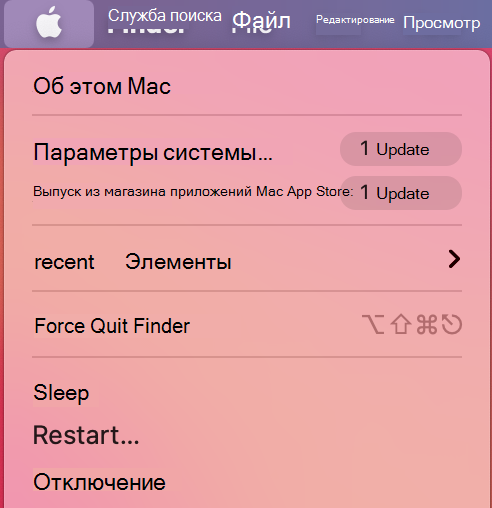
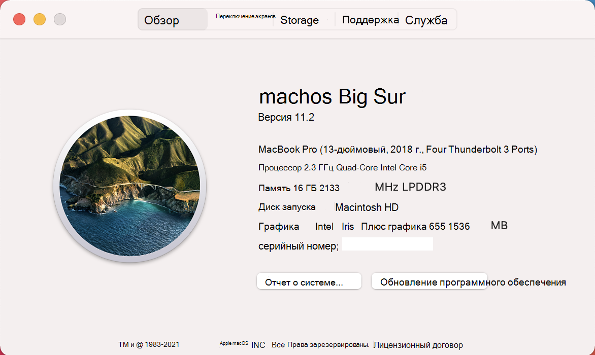

# <a name="device-control-for-macos"></a>Управление устройствами для macOS

[!INCLUDE [Microsoft 365 Defender rebranding](../../includes/microsoft-defender.md)]

**Область применения:**
- [Microsoft Defender для конечной точки](https://go.microsoft.com/fwlink/p/?linkid=2146631)
- [Microsoft 365 Defender](https://go.microsoft.com/fwlink/?linkid=2118804)

> Хотите испытать Microsoft Defender для конечной точки? [Зарегистрився для бесплатной пробной.](https://www.microsoft.com/microsoft-365/windows/microsoft-defender-atp?ocid=docs-wdatp-exposedapis-abovefoldlink)

[!include[Prerelease information](../../includes/prerelease.md)]

## <a name="requirements"></a>Требования

Управление устройствами для macOS имеет следующие условия:

>[!div class="checklist"]
> - Право Microsoft Defender для конечной точки (может быть пробным)
> - Минимальная версия ОС: macOS 10.15.4 или более
> - Минимальная версия продукта: 101.24.59
> - Устройство должно работать с расширениями системы (это по умолчанию для macOS 11 Big Sur). 
> 
>   Вы можете проверить, работает ли ваше устройство на системных расширениях, подав следующую команду, и убедиться, что оно печатает `endpoint_security_extension` на консоли: 
> 
>   ```bash
>   mdatp health --field real_time_protection_subsystem 
>   ```
> - Ваше устройство должно быть в `Beta` (ранее `InsiderFast` называемом) канале обновления Microsoft AutoUpdate. Дополнительные сведения см. в [сайте Deploy updates for Microsoft Defender for Endpoint for Mac.](mac-updates.md)
> 
>   Вы можете проверить канал обновления с помощью следующей команды: 
> 
>    ```bash
>    mdatp health --field release_ring 
>    ```
>
>    Если вышеуказанная команда не распечатает или `Beta` `InsiderFast` не выполнит следующую команду из терминала. Обновление канала вступает в силу в следующий раз, когда продукт запускается (при следующем обновлении продукта или при перезагрузке устройства). 
> 
>    ```bash
>    defaults write com.microsoft.autoupdate2 ChannelName -string Beta
>    ```
>
>    Кроме того, если вы находитесь в управляемой среде (JAMF или Intune), вы можете настроить канал обновления удаленно. Дополнительные сведения см. в [сайте Deploy updates for Microsoft Defender for Endpoint for Mac.](mac-updates.md) 

## <a name="device-control-policy"></a>Политика управления устройствами

Чтобы настроить управление устройствами для macOS, необходимо создать политику, описываемую ограничения, которые необходимо ввести в организации.

Политика управления устройством включена в профиль конфигурации, используемый для настройки всех остальных параметров продукта. Дополнительные сведения см. в [странице Конфигурация структуры профилей.](mac-preferences.md#configuration-profile-structure)

В профиле конфигурации политика управления устройствами определяется в следующем разделе:

|||
|:---|:---|
| **Домен** | `com.microsoft.wdav` |
| **Раздел** | deviceControl |
| **Тип данных** | Словарь (вложенные предпочтения) |
| **Comments** | В следующих разделах описано содержимое словаря. |

Политика управления устройствами может использоваться для:

- [Настройка целевого URL-адреса для уведомлений, поднятых с помощью управления устройствами](#customize-url-target-for-notifications-raised-by-device-control)
- [Разрешить или заблокировать съемные устройства](#allow-or-block-removable-devices)

### <a name="customize-url-target-for-notifications-raised-by-device-control"></a>Настройка URL-адреса для уведомлений, поднятых с помощью управления устройствами

Если на устройстве применена политика управления устройствами (например, доступ к съемным носитему устройству ограничен), пользователю отображается уведомление.


Когда конечные пользователи щелкают это уведомление, веб-страница открывается в браузере по умолчанию. Вы можете настроить URL-адрес, открываемый при нажатии уведомления конечными пользователями.

|||
|:---|:---|
| **Домен** | `com.microsoft.wdav` |
| **Раздел** | navigationTarget |
| **Тип данных** | Строка |
| **Comments** | Если не определено, продукт использует URL-адрес по умолчанию, указывающий на общую страницу с объяснением действий, принятых продуктом. |

### <a name="allow-or-block-removable-devices"></a>Разрешить или заблокировать съемные устройства

Съемный раздел мультимедиа политики управления устройствами используется для ограничения доступа к съемным носителям. 

> [!NOTE]
> В настоящее время поддерживаются следующие типы съемных мультимедиа, которые могут быть включены в политику: устройства хранения USB.

|||
|:---|:---|
| **Домен** | `com.microsoft.wdav` |
| **Раздел** | removableMediaPolicy |
| **Тип данных** | Словарь (вложенные предпочтения) |
| **Comments** | В следующих разделах описано содержимое словаря. |

Этот раздел политики иерархичен, что обеспечивает максимальную гибкость и охватывает широкий диапазон случаев использования. На верхнем уровне находятся поставщики, идентифицированные по ID поставщика. Для каждого поставщика существуют продукты, идентифицированные по ID продукта. Наконец, для каждого продукта существуют серийные номера, обозначающие конкретные устройства.

```
|-- policy top level 
    |-- vendor 1 
        |-- product 1 
            |-- serial number 1 
            ...
            |-- serial number N 
        ...
        |-- product N 
    ...
    |-- vendor N
```

Сведения о поиске идентификаторов устройств см. в документе [Look up device identifiers.](#look-up-device-identifiers)

Политика оценивается от самой конкретной записи до самой общей. То есть, когда устройство подключено, продукт пытается найти наиболее конкретное совпадение в политике для каждого съемного устройства мультимедиа и применить разрешения на этом уровне. Если нет совпадения, применяется следующий оптимальный совпадение, в том числе разрешение, указанное на верхнем уровне, которое является по умолчанию, если устройство не соответствует какой-либо другой записи в политике.

#### <a name="policy-enforcement-level"></a>Уровень правоприменения политики

В разделе съемное мультимедиа можно установить уровень правоприменения, который может принять одно из следующих значений:

- `audit` - В соответствии с этим уровнем правоприменения, если доступ к устройству ограничен, пользователю отображается уведомление, однако устройство все еще можно использовать. Этот уровень применения может быть полезен для оценки эффективности политики.
- `block` — В соответствии с этим уровнем обеспечения выполнения операций, которые пользователь может выполнять на устройстве, ограничивается тем, что определено в политике. Кроме того, пользователь получает уведомление. 

|||
|:---|:---|
| **Домен** | `com.microsoft.wdav` |
| **Раздел** | enforcementLevel |
| **Тип данных** | String |
| **Возможные значения** | аудит (по умолчанию) <br/> block |

#### <a name="default-permission-level"></a>Уровень разрешений по умолчанию

На верхнем уровне съемного раздела мультимедиа можно настроить уровень разрешений по умолчанию для устройств, которые не соответствуют ни к чему другому в политике.

Этот параметр может быть заданной для:

- `none` - Операции на устройстве не выполняются
- Сочетание следующих значений:
    - `read` - Операции чтения разрешены на устройстве
    - `write` - Операции записи разрешены на устройстве
    - `execute` - Выполнение операций разрешено на устройстве

> [!NOTE]
> Если они присутствуют на уровне разрешений, любые другие разрешения `none` `read` `write` (или) будут `execute` игнорироваться.

> [!NOTE]
> Разрешение `execute` относится только к выполнению бинарей Mach-O. Он не включает выполнение скриптов или других типов полезной нагрузки.

|||
|:---|:---|
| **Домен** | `com.microsoft.wdav` |
| **Раздел** | разрешение |
| **Тип данных** | Массив строк |
| **Возможные значения** | нет <br/> read <br/> write <br/> выполнение |

#### <a name="restrict-removable-media-by-vendor-product-and-serial-number"></a>Ограничение съемных мультимедиа поставщиком, продуктом и серийным номером

Как описано в [описании Разрешить](#allow-or-block-removable-devices)или блокировать съемные устройства, съемные носитли, такие как USB-устройства, могут быть идентифицированы по ID поставщика, ID продукта и серийному номеру.

На верхнем уровне политики съемных мультимедиа можно дополнительно определить более подробное ограничение на уровне поставщика. 

Словарь содержит одну или несколько записей, каждая запись `vendors` которых идентифицирована по ID поставщика.

|||
|:---|:---|
| **Домен** | `com.microsoft.wdav` |
| **Раздел** | поставщики |
| **Тип данных** | Словарь (вложенные предпочтения) |

Для каждого поставщика можно указать желаемый уровень разрешений для устройств этого поставщика.

|||
|:---|:---|
| **Домен** | `com.microsoft.wdav` |
| **Раздел** | разрешение |
| **Тип данных** | Массив строк |
| **Возможные значения** | Такой же, [как уровень разрешений по умолчанию](#default-permission-level) |

Кроме того, можно дополнительно указать набор продуктов, принадлежащих этому поставщику, для которого определяются более гранулярные разрешения. Словарь содержит одну или несколько записей, каждая запись `products` которых идентифицирована по ID продукта. 

|||
|:---|:---|
| **Домен** | `com.microsoft.wdav` |
| **Раздел** | продукты |
| **Тип данных** | Словарь (вложенные предпочтения) |

Для каждого продукта можно указать нужный уровень разрешений для этого продукта.

|||
|:---|:---|
| **Домен** | `com.microsoft.wdav` |
| **Раздел** | разрешение |
| **Тип данных** | Массив строк |
| **Возможные значения** | Такой же, [как уровень разрешений по умолчанию](#default-permission-level) |

Кроме того, можно указать необязательный набор серийных номеров, для которых определены более детализативные разрешения.

Словарь `serialNumbers` содержит одну или несколько записей, каждая запись которых идентифицирована серийным номером.

|||
|:---|:---|
| **Домен** | `com.microsoft.wdav` |
| **Раздел** | serialNumbers |
| **Тип данных** | Словарь (вложенные предпочтения) |

Для каждого серийного номера можно указать нужный уровень разрешений.

|||
|:---|:---|
| **Домен** | `com.microsoft.wdav` |
| **Раздел** | разрешение |
| **Тип данных** | Массив строк |
| **Возможные значения** | Такой же, [как уровень разрешений по умолчанию](#default-permission-level) |

#### <a name="example-device-control-policy"></a>Пример политики управления устройствами

В следующем примере показано, как все вышеперечисленные понятия можно объединить в политику управления устройствами. В следующем примере обратите внимание на иерархический характер съемной политики мультимедиа.

```xml
<?xml version="1.0" encoding="UTF-8"?> 
<!DOCTYPE plist PUBLIC "-//Apple//DTD PLIST 1.0//EN" "http://www.apple.com/DTDs/PropertyList-1.0.dtd"> 
<plist version="1.0"> 
<dict> 
    <key>deviceControl</key> 
    <dict> 
        <key>navigationTarget</key> 
        <string>[custom URL for notifications]</string> 
        <key>removableMediaPolicy</key> 
        <dict> 
            <key>enforcementLevel</key> 
            <string>[enforcement level]</string> <!-- audit / block --> 
            <key>permission</key> 
            <array> 
                <string>[permission]</string> <!-- none / read / write / execute --> 
                <!-- other permissions -->
            </array> 
            <key>vendors</key> 
            <dict> 
                <key>[vendor id]</key> 
                <dict>
                    <key>permission</key> 
                    <array> 
                        <string>[permission]</string> <!-- none / read / write / execute --> 
                        <!-- other permissions -->
                    </array> 
                    <key>products</key> 
                    <dict> 
                        <key>[product id]</key> 
                        <dict> 
                            <key>permission</key> 
                            <array> 
                                <string>[permission]</string> <!-- none / read / write / execute --> 
                                <!-- other permissions -->
                            </array> 
                            <key>serialNumbers</key> 
                            <dict> 
                                <key>[serial-number]</key> 
                                <array> 
                                    <string>[permission]</string> <!-- none / read / write / execute --> 
                                    <!-- other permissions -->
                                </array> 
                                <!-- other serial numbers --> 
                            </dict> 
                        </dict> 
                        <!-- other products --> 
                    </dict> 
                </dict> 
                <!-- other vendors --> 
            </dict> 
        </dict> 
    </dict> 
</dict> 
</plist> 
```

В следующих документах мы включили дополнительные примеры политик управления устройствами:

- [Примеры политик управления устройствами для Intune](mac-device-control-intune.md)
- [Примеры политик управления устройствами для JAMF](mac-device-control-jamf.md)

#### <a name="look-up-device-identifiers"></a>Искать идентификаторы устройств

Чтобы найти ID поставщика, ID продукта и серийный номер USB-устройства:

1. Войдите в устройство Mac.
1. Подключите usb-устройство, для которого необходимо искать идентификаторы.
1. В меню macOS верхнего уровня выберите **About This Mac**.

    

1. Выберите **системный отчет**.

    

1. В левом столбце выберите **USB.**

    

1. В **usb Device Tree** перейдите на подключенное устройство USB.

    

1. Отображаются ИД поставщика, ИД продукта и серийный номер. При добавлении id поставщика и ИД продукта в съемную политику мультимедиа необходимо добавить только часть после `0x` . Например, на приведенной ниже картинке имеется ИД поставщика и `1000` ID продукта `090c` .

#### <a name="discover-usb-devices-in-your-organization"></a>Обнаружение USB-устройств в организации

Вы можете просматривать события изменения крепления, перенагрузки и изменения громкости, происходящие с USB-устройств в Microsoft Defender для продвинутой охоты endpoint. Эти события могут быть полезны для выявления подозрительных действий по использованию или проведения внутренних расследований.

```
DeviceEvents 
    | where ActionType == "UsbDriveMount" or ActionType == "UsbDriveUnmount" or ActionType == "UsbDriveDriveLetterChanged"
    | where DeviceId == "<device ID>"
```

## <a name="device-control-policy-deployment"></a>Развертывание политики управления устройствами

Политика управления устройствами должна быть включена рядом с другими настройками продукта, как описано в параметрах [Set preferences for Microsoft Defender for Endpoint для Mac.](mac-preferences.md)

Этот профиль можно развернуть с помощью инструкций, перечисленных в [развертывании профиля Конфигурация.](mac-preferences.md#configuration-profile-deployment)

## <a name="troubleshooting-tips"></a>Советы по устранению неполадок

После нажатия профиля конфигурации через Intune или JAMF вы можете проверить, был ли он успешно подхвален продуктом, подав следующую команду из терминала:

```bash
mdatp device-control removable-media policy list
```

Эта команда напечатает для стандартного вывода политику управления устройствами, используемую продуктом. В случае принтов убедитесь, что a) профиль конфигурации действительно был оттеснен на ваше устройство из консоли управления, и b) это допустимая политика управления устройствами, как описано в этом `Policy is empty` документе.

На устройстве, где политика была успешно доставлена и где подключено одно или несколько устройств, можно выполнить следующую команду, чтобы перечислить все устройства и эффективные разрешения, применяемые к ним.

```bash
mdatp device-control removable-media devices list
```

Пример вывода.

```Output
.Device(s)
|-o Name: Untitled 1, Permission ["read", "execute"]
| |-o Vendor: General "fff0"
| |-o Product: USB Flash Disk "1000"
| |-o Serial number: "04ZSSMHI2O7WBVOA"
| |-o Mount point: "/Volumes/TESTUSB"
```

В этом примере подключено только одно съемное мультимедиа-устройство, которое имеет и разрешения, в соответствии с политикой управления устройством, доставленной `read` `execute` на устройство.

## <a name="related-topics"></a>Статьи по теме

- [Примеры политик управления устройствами для Intune](mac-device-control-intune.md)
- [Примеры политик управления устройствами для JAMF](mac-device-control-jamf.md)