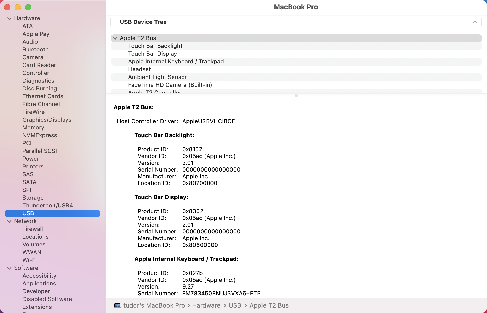

# <a name="device-control-for-macos"></a><span data-ttu-id="16e5f-104">Управление устройствами для macOS</span><span class="sxs-lookup"><span data-stu-id="16e5f-104">Device control for macOS</span></span>

[!INCLUDE [Microsoft 365 Defender rebranding](../../includes/microsoft-defender.md)]

<span data-ttu-id="16e5f-105">**Область применения:**</span><span class="sxs-lookup"><span data-stu-id="16e5f-105">**Applies to:**</span></span>
- [<span data-ttu-id="16e5f-106">Microsoft Defender для конечной точки</span><span class="sxs-lookup"><span data-stu-id="16e5f-106">Microsoft Defender for Endpoint</span></span>](https://go.microsoft.com/fwlink/p/?linkid=2154037)
- [<span data-ttu-id="16e5f-107">Microsoft 365 Defender</span><span class="sxs-lookup"><span data-stu-id="16e5f-107">Microsoft 365 Defender</span></span>](https://go.microsoft.com/fwlink/?linkid=2118804)

> <span data-ttu-id="16e5f-108">Хотите испытать Microsoft Defender для конечной точки?</span><span class="sxs-lookup"><span data-stu-id="16e5f-108">Want to experience Microsoft Defender for Endpoint?</span></span> [<span data-ttu-id="16e5f-109">Зарегистрився для бесплатной пробной.</span><span class="sxs-lookup"><span data-stu-id="16e5f-109">Sign up for a free trial.</span></span>](https://www.microsoft.com/microsoft-365/windows/microsoft-defender-atp?ocid=docs-wdatp-exposedapis-abovefoldlink)

## <a name="requirements"></a><span data-ttu-id="16e5f-110">Требования</span><span class="sxs-lookup"><span data-stu-id="16e5f-110">Requirements</span></span>

<span data-ttu-id="16e5f-111">Управление устройствами для macOS имеет следующие условия:</span><span class="sxs-lookup"><span data-stu-id="16e5f-111">Device control for macOS has the following prerequisites:</span></span>

>[!div class="checklist"]
> - <span data-ttu-id="16e5f-112">Право Microsoft Defender для конечной точки (может быть пробным)</span><span class="sxs-lookup"><span data-stu-id="16e5f-112">Microsoft Defender for Endpoint entitlement (can be trial)</span></span>
> - <span data-ttu-id="16e5f-113">Минимальная версия ОС: macOS 11 или более</span><span class="sxs-lookup"><span data-stu-id="16e5f-113">Minimum OS version: macOS 11 or higher</span></span>
> - <span data-ttu-id="16e5f-114">Минимальная версия продукта: 101.34.20</span><span class="sxs-lookup"><span data-stu-id="16e5f-114">Minimum product version: 101.34.20</span></span>

## <a name="device-control-policy"></a><span data-ttu-id="16e5f-115">Политика управления устройствами</span><span class="sxs-lookup"><span data-stu-id="16e5f-115">Device control policy</span></span>

<span data-ttu-id="16e5f-116">Чтобы настроить управление устройствами для macOS, необходимо создать политику, описываемую ограничения, которые необходимо ввести в организации.</span><span class="sxs-lookup"><span data-stu-id="16e5f-116">To configure device control for macOS, you must create a policy that describes the restrictions you want to put in place within your organization.</span></span>

<span data-ttu-id="16e5f-117">Политика управления устройством включена в профиль конфигурации, используемый для настройки всех остальных параметров продукта.</span><span class="sxs-lookup"><span data-stu-id="16e5f-117">The device control policy is included in the configuration profile used to configure all other product settings.</span></span> <span data-ttu-id="16e5f-118">Дополнительные сведения см. в [странице Конфигурация структуры профилей.](mac-preferences.md#configuration-profile-structure)</span><span class="sxs-lookup"><span data-stu-id="16e5f-118">For more information, see [Configuration profile structure](mac-preferences.md#configuration-profile-structure).</span></span>

<span data-ttu-id="16e5f-119">В профиле конфигурации политика управления устройствами определяется в следующем разделе:</span><span class="sxs-lookup"><span data-stu-id="16e5f-119">Within the configuration profile, the device control policy is defined in the following section:</span></span>

|<span data-ttu-id="16e5f-120">Section</span><span class="sxs-lookup"><span data-stu-id="16e5f-120">Section</span></span>|<span data-ttu-id="16e5f-121">Значение</span><span class="sxs-lookup"><span data-stu-id="16e5f-121">Value</span></span>|
|:---|:---|
| <span data-ttu-id="16e5f-122">**Домен**</span><span class="sxs-lookup"><span data-stu-id="16e5f-122">**Domain**</span></span> | `com.microsoft.wdav` |
| <span data-ttu-id="16e5f-123">**Key**</span><span class="sxs-lookup"><span data-stu-id="16e5f-123">**Key**</span></span> | <span data-ttu-id="16e5f-124">deviceControl</span><span class="sxs-lookup"><span data-stu-id="16e5f-124">deviceControl</span></span> |
| <span data-ttu-id="16e5f-125">**Тип данных**</span><span class="sxs-lookup"><span data-stu-id="16e5f-125">**Data type**</span></span> | <span data-ttu-id="16e5f-126">Словарь (вложенные предпочтения)</span><span class="sxs-lookup"><span data-stu-id="16e5f-126">Dictionary (nested preference)</span></span> |
| <span data-ttu-id="16e5f-127">**Comments**</span><span class="sxs-lookup"><span data-stu-id="16e5f-127">**Comments**</span></span> | <span data-ttu-id="16e5f-128">В следующих разделах описано содержимое словаря.</span><span class="sxs-lookup"><span data-stu-id="16e5f-128">See the following sections for a description of the dictionary contents.</span></span> |

<span data-ttu-id="16e5f-129">Политика управления устройствами может использоваться для:</span><span class="sxs-lookup"><span data-stu-id="16e5f-129">The device control policy can be used to:</span></span>

- [<span data-ttu-id="16e5f-130">Настройка целевого URL-адреса для уведомлений, поднятых с помощью управления устройствами</span><span class="sxs-lookup"><span data-stu-id="16e5f-130">Customize the URL target for notifications raised by device control</span></span>](#customize-url-target-for-notifications-raised-by-device-control)
- [<span data-ttu-id="16e5f-131">Разрешить или заблокировать съемные устройства</span><span class="sxs-lookup"><span data-stu-id="16e5f-131">Allow or block removable devices</span></span>](#allow-or-block-removable-devices)

### <a name="customize-url-target-for-notifications-raised-by-device-control"></a><span data-ttu-id="16e5f-132">Настройка URL-адреса для уведомлений, поднятых с помощью управления устройствами</span><span class="sxs-lookup"><span data-stu-id="16e5f-132">Customize URL target for notifications raised by device control</span></span>

<span data-ttu-id="16e5f-133">Если на устройстве применена политика управления устройствами (например, доступ к съемным носитему устройству ограничен), пользователю отображается уведомление.</span><span class="sxs-lookup"><span data-stu-id="16e5f-133">When the device control policy that you have put in place is enforced on a device (for example, access to a removable media device is restricted), a notification is displayed to the user.</span></span>


<span data-ttu-id="16e5f-135">Когда конечные пользователи щелкают это уведомление, веб-страница открывается в браузере по умолчанию.</span><span class="sxs-lookup"><span data-stu-id="16e5f-135">When end users click this notification, a web page is opened in the default browser.</span></span> <span data-ttu-id="16e5f-136">Вы можете настроить URL-адрес, открываемый при нажатии уведомления конечными пользователями.</span><span class="sxs-lookup"><span data-stu-id="16e5f-136">You can configure the URL that is opened when end users click the notification.</span></span>

|<span data-ttu-id="16e5f-137">Section</span><span class="sxs-lookup"><span data-stu-id="16e5f-137">Section</span></span>|<span data-ttu-id="16e5f-138">Значение</span><span class="sxs-lookup"><span data-stu-id="16e5f-138">Value</span></span>|
|:---|:---|
| <span data-ttu-id="16e5f-139">**Домен**</span><span class="sxs-lookup"><span data-stu-id="16e5f-139">**Domain**</span></span> | `com.microsoft.wdav` |
| <span data-ttu-id="16e5f-140">**Key**</span><span class="sxs-lookup"><span data-stu-id="16e5f-140">**Key**</span></span> | <span data-ttu-id="16e5f-141">navigationTarget</span><span class="sxs-lookup"><span data-stu-id="16e5f-141">navigationTarget</span></span> |
| <span data-ttu-id="16e5f-142">**Тип данных**</span><span class="sxs-lookup"><span data-stu-id="16e5f-142">**Data type**</span></span> | <span data-ttu-id="16e5f-143">String</span><span class="sxs-lookup"><span data-stu-id="16e5f-143">String</span></span> |
| <span data-ttu-id="16e5f-144">**Comments**</span><span class="sxs-lookup"><span data-stu-id="16e5f-144">**Comments**</span></span> | <span data-ttu-id="16e5f-145">Если не определено, продукт использует URL-адрес по умолчанию, указывающий на общую страницу с объяснением действий, принятых продуктом.</span><span class="sxs-lookup"><span data-stu-id="16e5f-145">If not defined, the product uses a default URL pointing to a generic page explaining the action taken by the product.</span></span> |

### <a name="allow-or-block-removable-devices"></a><span data-ttu-id="16e5f-146">Разрешить или заблокировать съемные устройства</span><span class="sxs-lookup"><span data-stu-id="16e5f-146">Allow or block removable devices</span></span>

<span data-ttu-id="16e5f-147">Съемный раздел мультимедиа политики управления устройствами используется для ограничения доступа к съемным носителям.</span><span class="sxs-lookup"><span data-stu-id="16e5f-147">The removable media section of the device control policy is used to restrict access to removable media.</span></span> 

> [!NOTE]
> <span data-ttu-id="16e5f-148">В настоящее время поддерживаются следующие типы съемных мультимедиа, которые могут быть включены в политику: устройства хранения USB.</span><span class="sxs-lookup"><span data-stu-id="16e5f-148">The following types of removable media are currently supported and can be included in the policy: USB storage devices.</span></span>

|<span data-ttu-id="16e5f-149">Section</span><span class="sxs-lookup"><span data-stu-id="16e5f-149">Section</span></span>|<span data-ttu-id="16e5f-150">Значение</span><span class="sxs-lookup"><span data-stu-id="16e5f-150">Value</span></span>|
|:---|:---|
| <span data-ttu-id="16e5f-151">**Домен**</span><span class="sxs-lookup"><span data-stu-id="16e5f-151">**Domain**</span></span> | `com.microsoft.wdav` |
| <span data-ttu-id="16e5f-152">**Key**</span><span class="sxs-lookup"><span data-stu-id="16e5f-152">**Key**</span></span> | <span data-ttu-id="16e5f-153">removableMediaPolicy</span><span class="sxs-lookup"><span data-stu-id="16e5f-153">removableMediaPolicy</span></span> |
| <span data-ttu-id="16e5f-154">**Тип данных**</span><span class="sxs-lookup"><span data-stu-id="16e5f-154">**Data type**</span></span> | <span data-ttu-id="16e5f-155">Словарь (вложенные предпочтения)</span><span class="sxs-lookup"><span data-stu-id="16e5f-155">Dictionary (nested preference)</span></span> |
| <span data-ttu-id="16e5f-156">**Comments**</span><span class="sxs-lookup"><span data-stu-id="16e5f-156">**Comments**</span></span> | <span data-ttu-id="16e5f-157">В следующих разделах описано содержимое словаря.</span><span class="sxs-lookup"><span data-stu-id="16e5f-157">See the following sections for a description of the dictionary contents.</span></span> |

<span data-ttu-id="16e5f-158">Этот раздел политики иерархичен, что обеспечивает максимальную гибкость и охватывает широкий диапазон случаев использования.</span><span class="sxs-lookup"><span data-stu-id="16e5f-158">This section of the policy is hierarchical, allowing for maximum flexibility and covering a wide range of use cases.</span></span> <span data-ttu-id="16e5f-159">На верхнем уровне находятся поставщики, идентифицированные по ID поставщика.</span><span class="sxs-lookup"><span data-stu-id="16e5f-159">At the top level are vendors, identified by a vendor ID.</span></span> <span data-ttu-id="16e5f-160">Для каждого поставщика существуют продукты, идентифицированные по ID продукта.</span><span class="sxs-lookup"><span data-stu-id="16e5f-160">For each vendor, there are products, identified by a product ID.</span></span> <span data-ttu-id="16e5f-161">Наконец, для каждого продукта существуют серийные номера, обозначающие конкретные устройства.</span><span class="sxs-lookup"><span data-stu-id="16e5f-161">Finally, for each product there are serial numbers denoting specific devices.</span></span>

```
|-- policy top level 
    |-- vendor 1 
        |-- product 1 
            |-- serial number 1 
            ...
            |-- serial number N 
        ...
        |-- product N 
    ...
    |-- vendor N
```

<span data-ttu-id="16e5f-162">Сведения о поиске идентификаторов устройств см. в документе [Look up device identifiers.](#look-up-device-identifiers)</span><span class="sxs-lookup"><span data-stu-id="16e5f-162">For information on how to find the device identifiers, see [Look up device identifiers](#look-up-device-identifiers).</span></span>

<span data-ttu-id="16e5f-163">Политика оценивается от самой конкретной записи до самой общей.</span><span class="sxs-lookup"><span data-stu-id="16e5f-163">The policy is evaluated from the most specific entry to the most general one.</span></span> <span data-ttu-id="16e5f-164">То есть, когда устройство подключено, продукт пытается найти наиболее конкретное совпадение в политике для каждого съемного устройства мультимедиа и применить разрешения на этом уровне.</span><span class="sxs-lookup"><span data-stu-id="16e5f-164">Meaning, when a device is plugged in, the product tries to find the most specific match in the policy for each removable media device and apply the permissions at that level.</span></span> <span data-ttu-id="16e5f-165">Если нет совпадения, применяется следующий оптимальный совпадение, в том числе разрешение, указанное на верхнем уровне, которое является по умолчанию, если устройство не соответствует какой-либо другой записи в политике.</span><span class="sxs-lookup"><span data-stu-id="16e5f-165">If there is no match, then the next best match is applied, all the way to the permission specified at the top level, which is the default when a device does not match any other entry in the policy.</span></span>

#### <a name="policy-enforcement-level"></a><span data-ttu-id="16e5f-166">Уровень правоприменения политики</span><span class="sxs-lookup"><span data-stu-id="16e5f-166">Policy enforcement level</span></span>

<span data-ttu-id="16e5f-167">В разделе съемное мультимедиа можно установить уровень правоприменения, который может принять одно из следующих значений:</span><span class="sxs-lookup"><span data-stu-id="16e5f-167">Under the removable media section, there is an option to set the enforcement level, which can take one of the following values:</span></span>

- <span data-ttu-id="16e5f-168">`audit` - В соответствии с этим уровнем правоприменения, если доступ к устройству ограничен, пользователю отображается уведомление, однако устройство все еще можно использовать.</span><span class="sxs-lookup"><span data-stu-id="16e5f-168">`audit` - Under this enforcement level, if access to a device is restricted, a notification is displayed to the user, however the device can still be used.</span></span> <span data-ttu-id="16e5f-169">Этот уровень применения может быть полезен для оценки эффективности политики.</span><span class="sxs-lookup"><span data-stu-id="16e5f-169">This enforcement level can be useful to evaluate the effectiveness of a policy.</span></span>
- <span data-ttu-id="16e5f-170">`block` — В соответствии с этим уровнем обеспечения выполнения операций, которые пользователь может выполнять на устройстве, ограничивается тем, что определено в политике.</span><span class="sxs-lookup"><span data-stu-id="16e5f-170">`block` - Under this enforcement level, the operations that the user can perform on the device are limited to what is defined in the policy.</span></span> <span data-ttu-id="16e5f-171">Кроме того, пользователь получает уведомление.</span><span class="sxs-lookup"><span data-stu-id="16e5f-171">Furthermore, a notification is raised to the user.</span></span> 

> [!NOTE] 
> <span data-ttu-id="16e5f-172">По умолчанию установлен уровень правоприменения `audit` .</span><span class="sxs-lookup"><span data-stu-id="16e5f-172">By default, the enforcement level is set to `audit`.</span></span> 

|<span data-ttu-id="16e5f-173">Section</span><span class="sxs-lookup"><span data-stu-id="16e5f-173">Section</span></span>|<span data-ttu-id="16e5f-174">Значение</span><span class="sxs-lookup"><span data-stu-id="16e5f-174">Value</span></span>|
|:---|:---|
| <span data-ttu-id="16e5f-175">**Домен**</span><span class="sxs-lookup"><span data-stu-id="16e5f-175">**Domain**</span></span> | `com.microsoft.wdav` |
| <span data-ttu-id="16e5f-176">**Key**</span><span class="sxs-lookup"><span data-stu-id="16e5f-176">**Key**</span></span> | <span data-ttu-id="16e5f-177">enforcementLevel</span><span class="sxs-lookup"><span data-stu-id="16e5f-177">enforcementLevel</span></span> |
| <span data-ttu-id="16e5f-178">**Тип данных**</span><span class="sxs-lookup"><span data-stu-id="16e5f-178">**Data type**</span></span> | <span data-ttu-id="16e5f-179">String</span><span class="sxs-lookup"><span data-stu-id="16e5f-179">String</span></span> |
| <span data-ttu-id="16e5f-180">**Возможные значения**</span><span class="sxs-lookup"><span data-stu-id="16e5f-180">**Possible values**</span></span> | <span data-ttu-id="16e5f-181">аудит (по умолчанию)</span><span class="sxs-lookup"><span data-stu-id="16e5f-181">audit (default)</span></span> <br/> <span data-ttu-id="16e5f-182">block</span><span class="sxs-lookup"><span data-stu-id="16e5f-182">block</span></span> |

#### <a name="default-permission-level"></a><span data-ttu-id="16e5f-183">Уровень разрешений по умолчанию</span><span class="sxs-lookup"><span data-stu-id="16e5f-183">Default permission level</span></span>

<span data-ttu-id="16e5f-184">На верхнем уровне съемного раздела мультимедиа можно настроить уровень разрешений по умолчанию для устройств, которые не соответствуют ни к чему другому в политике.</span><span class="sxs-lookup"><span data-stu-id="16e5f-184">At the top level of the removable media section, you can configure the default permission level for devices that do not match anything else in the policy.</span></span>

<span data-ttu-id="16e5f-185">Этот параметр может быть заданной для:</span><span class="sxs-lookup"><span data-stu-id="16e5f-185">This setting can be set to:</span></span>

- <span data-ttu-id="16e5f-186">`none` - Операции на устройстве не выполняются</span><span class="sxs-lookup"><span data-stu-id="16e5f-186">`none` - No operations can be performed on the device</span></span>
- <span data-ttu-id="16e5f-187">Сочетание следующих значений:</span><span class="sxs-lookup"><span data-stu-id="16e5f-187">A combination of the following values:</span></span>
    - <span data-ttu-id="16e5f-188">`read` - Операции чтения разрешены на устройстве</span><span class="sxs-lookup"><span data-stu-id="16e5f-188">`read` - Read operations are permitted on the device</span></span>
    - <span data-ttu-id="16e5f-189">`write` - Операции записи разрешены на устройстве</span><span class="sxs-lookup"><span data-stu-id="16e5f-189">`write` - Write operations are permitted on the device</span></span>
    - <span data-ttu-id="16e5f-190">`execute` - Выполнение операций разрешено на устройстве</span><span class="sxs-lookup"><span data-stu-id="16e5f-190">`execute` - Execute operations are permitted on the device</span></span>

> [!NOTE]
> <span data-ttu-id="16e5f-191">Если они присутствуют на уровне разрешений, любые другие разрешения `none` `read` `write` (или) будут `execute` игнорироваться.</span><span class="sxs-lookup"><span data-stu-id="16e5f-191">If `none` is present in the permission level, any other permissions (`read`, `write`, or `execute`) will be ignored.</span></span>

> [!NOTE]
> <span data-ttu-id="16e5f-192">Разрешение `execute` относится только к выполнению бинарей Mach-O.</span><span class="sxs-lookup"><span data-stu-id="16e5f-192">The `execute` permission only refers to execution of Mach-O binaries.</span></span> <span data-ttu-id="16e5f-193">Он не включает выполнение скриптов или других типов полезной нагрузки.</span><span class="sxs-lookup"><span data-stu-id="16e5f-193">It does not include execution of scripts or other types of payloads.</span></span>

|<span data-ttu-id="16e5f-194">Section</span><span class="sxs-lookup"><span data-stu-id="16e5f-194">Section</span></span>|<span data-ttu-id="16e5f-195">Значение</span><span class="sxs-lookup"><span data-stu-id="16e5f-195">Value</span></span>|
|:---|:---|
| <span data-ttu-id="16e5f-196">**Домен**</span><span class="sxs-lookup"><span data-stu-id="16e5f-196">**Domain**</span></span> | `com.microsoft.wdav` |
| <span data-ttu-id="16e5f-197">**Key**</span><span class="sxs-lookup"><span data-stu-id="16e5f-197">**Key**</span></span> | <span data-ttu-id="16e5f-198">разрешение</span><span class="sxs-lookup"><span data-stu-id="16e5f-198">permission</span></span> |
| <span data-ttu-id="16e5f-199">**Тип данных**</span><span class="sxs-lookup"><span data-stu-id="16e5f-199">**Data type**</span></span> | <span data-ttu-id="16e5f-200">Массив строк</span><span class="sxs-lookup"><span data-stu-id="16e5f-200">Array of strings</span></span> |
| <span data-ttu-id="16e5f-201">**Возможные значения**</span><span class="sxs-lookup"><span data-stu-id="16e5f-201">**Possible values**</span></span> | <span data-ttu-id="16e5f-202">нет</span><span class="sxs-lookup"><span data-stu-id="16e5f-202">none</span></span> <br/> <span data-ttu-id="16e5f-203">read</span><span class="sxs-lookup"><span data-stu-id="16e5f-203">read</span></span> <br/> <span data-ttu-id="16e5f-204">write</span><span class="sxs-lookup"><span data-stu-id="16e5f-204">write</span></span> <br/> <span data-ttu-id="16e5f-205">выполнение</span><span class="sxs-lookup"><span data-stu-id="16e5f-205">execute</span></span> |

#### <a name="restrict-removable-media-by-vendor-product-and-serial-number"></a><span data-ttu-id="16e5f-206">Ограничение съемных мультимедиа поставщиком, продуктом и серийным номером</span><span class="sxs-lookup"><span data-stu-id="16e5f-206">Restrict removable media by vendor, product, and serial number</span></span>

<span data-ttu-id="16e5f-207">Как описано в [описании Разрешить](#allow-or-block-removable-devices)или блокировать съемные устройства, съемные носитли, такие как USB-устройства, могут быть идентифицированы по ID поставщика, ID продукта и серийному номеру.</span><span class="sxs-lookup"><span data-stu-id="16e5f-207">As described in [Allow or block removable devices](#allow-or-block-removable-devices), removable media such as USB devices can be identified by the vendor ID, product ID, and serial number.</span></span>

<span data-ttu-id="16e5f-208">На верхнем уровне политики съемных мультимедиа можно дополнительно определить более подробное ограничение на уровне поставщика.</span><span class="sxs-lookup"><span data-stu-id="16e5f-208">At the top level of the removable media policy, you can optionally define more granular restrictions at the vendor level.</span></span> 

<span data-ttu-id="16e5f-209">Словарь содержит одну или несколько записей, каждая запись `vendors` которых идентифицирована по ID поставщика.</span><span class="sxs-lookup"><span data-stu-id="16e5f-209">The `vendors` dictionary contains one or more entries, with each entry being identified by the vendor ID.</span></span>

|<span data-ttu-id="16e5f-210">Section</span><span class="sxs-lookup"><span data-stu-id="16e5f-210">Section</span></span>|<span data-ttu-id="16e5f-211">Значение</span><span class="sxs-lookup"><span data-stu-id="16e5f-211">Value</span></span>|
|:---|:---|
| <span data-ttu-id="16e5f-212">**Домен**</span><span class="sxs-lookup"><span data-stu-id="16e5f-212">**Domain**</span></span> | `com.microsoft.wdav` |
| <span data-ttu-id="16e5f-213">**Key**</span><span class="sxs-lookup"><span data-stu-id="16e5f-213">**Key**</span></span> | <span data-ttu-id="16e5f-214">поставщики</span><span class="sxs-lookup"><span data-stu-id="16e5f-214">vendors</span></span> |
| <span data-ttu-id="16e5f-215">**Тип данных**</span><span class="sxs-lookup"><span data-stu-id="16e5f-215">**Data type**</span></span> | <span data-ttu-id="16e5f-216">Словарь (вложенные предпочтения)</span><span class="sxs-lookup"><span data-stu-id="16e5f-216">Dictionary (nested preference)</span></span> |

<span data-ttu-id="16e5f-217">Для каждого поставщика можно указать желаемый уровень разрешений для устройств этого поставщика.</span><span class="sxs-lookup"><span data-stu-id="16e5f-217">For each vendor, you can specify the desired permission level for devices from that vendor.</span></span>

|<span data-ttu-id="16e5f-218">Section</span><span class="sxs-lookup"><span data-stu-id="16e5f-218">Section</span></span>|<span data-ttu-id="16e5f-219">Значение</span><span class="sxs-lookup"><span data-stu-id="16e5f-219">Value</span></span>|
|:---|:---|
| <span data-ttu-id="16e5f-220">**Домен**</span><span class="sxs-lookup"><span data-stu-id="16e5f-220">**Domain**</span></span> | `com.microsoft.wdav` |
| <span data-ttu-id="16e5f-221">**Key**</span><span class="sxs-lookup"><span data-stu-id="16e5f-221">**Key**</span></span> | <span data-ttu-id="16e5f-222">разрешение</span><span class="sxs-lookup"><span data-stu-id="16e5f-222">permission</span></span> |
| <span data-ttu-id="16e5f-223">**Тип данных**</span><span class="sxs-lookup"><span data-stu-id="16e5f-223">**Data type**</span></span> | <span data-ttu-id="16e5f-224">Массив строк</span><span class="sxs-lookup"><span data-stu-id="16e5f-224">Array of strings</span></span> |
| <span data-ttu-id="16e5f-225">**Возможные значения**</span><span class="sxs-lookup"><span data-stu-id="16e5f-225">**Possible values**</span></span> | <span data-ttu-id="16e5f-226">Такой же, [как уровень разрешений по умолчанию](#default-permission-level)</span><span class="sxs-lookup"><span data-stu-id="16e5f-226">Same as [Default permission level](#default-permission-level)</span></span> |

<span data-ttu-id="16e5f-227">Кроме того, можно дополнительно указать набор продуктов, принадлежащих этому поставщику, для которого определяются более гранулярные разрешения.</span><span class="sxs-lookup"><span data-stu-id="16e5f-227">Furthermore, you can optionally specify the set of products belonging to that vendor for which more granular permissions are defined.</span></span> <span data-ttu-id="16e5f-228">Словарь содержит одну или несколько записей, каждая запись `products` которых идентифицирована по ID продукта.</span><span class="sxs-lookup"><span data-stu-id="16e5f-228">The `products` dictionary contains one or more entries, with each entry being identified by the product ID.</span></span> 

|<span data-ttu-id="16e5f-229">Section</span><span class="sxs-lookup"><span data-stu-id="16e5f-229">Section</span></span>|<span data-ttu-id="16e5f-230">Значение</span><span class="sxs-lookup"><span data-stu-id="16e5f-230">Value</span></span>|
|:---|:---|
| <span data-ttu-id="16e5f-231">**Домен**</span><span class="sxs-lookup"><span data-stu-id="16e5f-231">**Domain**</span></span> | `com.microsoft.wdav` |
| <span data-ttu-id="16e5f-232">**Key**</span><span class="sxs-lookup"><span data-stu-id="16e5f-232">**Key**</span></span> | <span data-ttu-id="16e5f-233">продукты</span><span class="sxs-lookup"><span data-stu-id="16e5f-233">products</span></span> |
| <span data-ttu-id="16e5f-234">**Тип данных**</span><span class="sxs-lookup"><span data-stu-id="16e5f-234">**Data type**</span></span> | <span data-ttu-id="16e5f-235">Словарь (вложенные предпочтения)</span><span class="sxs-lookup"><span data-stu-id="16e5f-235">Dictionary (nested preference)</span></span> |

<span data-ttu-id="16e5f-236">Для каждого продукта можно указать нужный уровень разрешений для этого продукта.</span><span class="sxs-lookup"><span data-stu-id="16e5f-236">For each product, you can specify the desired permission level for that product.</span></span>

|<span data-ttu-id="16e5f-237">Section</span><span class="sxs-lookup"><span data-stu-id="16e5f-237">Section</span></span>|<span data-ttu-id="16e5f-238">Значение</span><span class="sxs-lookup"><span data-stu-id="16e5f-238">Value</span></span>|
|:---|:---|
| <span data-ttu-id="16e5f-239">**Домен**</span><span class="sxs-lookup"><span data-stu-id="16e5f-239">**Domain**</span></span> | `com.microsoft.wdav` |
| <span data-ttu-id="16e5f-240">**Key**</span><span class="sxs-lookup"><span data-stu-id="16e5f-240">**Key**</span></span> | <span data-ttu-id="16e5f-241">разрешение</span><span class="sxs-lookup"><span data-stu-id="16e5f-241">permission</span></span> |
| <span data-ttu-id="16e5f-242">**Тип данных**</span><span class="sxs-lookup"><span data-stu-id="16e5f-242">**Data type**</span></span> | <span data-ttu-id="16e5f-243">Массив строк</span><span class="sxs-lookup"><span data-stu-id="16e5f-243">Array of strings</span></span> |
| <span data-ttu-id="16e5f-244">**Возможные значения**</span><span class="sxs-lookup"><span data-stu-id="16e5f-244">**Possible values**</span></span> | <span data-ttu-id="16e5f-245">Такой же, [как уровень разрешений по умолчанию](#default-permission-level)</span><span class="sxs-lookup"><span data-stu-id="16e5f-245">Same as [Default permission level](#default-permission-level)</span></span> |

<span data-ttu-id="16e5f-246">Кроме того, можно указать необязательный набор серийных номеров, для которых определены более детализативные разрешения.</span><span class="sxs-lookup"><span data-stu-id="16e5f-246">Furthermore, you can specify an optional set of serial numbers for which more granular permissions are defined.</span></span>

<span data-ttu-id="16e5f-247">Словарь `serialNumbers` содержит одну или несколько записей, каждая запись которых идентифицирована серийным номером.</span><span class="sxs-lookup"><span data-stu-id="16e5f-247">The `serialNumbers` dictionary contains one or more entries, with each entry being identified by the serial number.</span></span>

|<span data-ttu-id="16e5f-248">Section</span><span class="sxs-lookup"><span data-stu-id="16e5f-248">Section</span></span>|<span data-ttu-id="16e5f-249">Значение</span><span class="sxs-lookup"><span data-stu-id="16e5f-249">Value</span></span>|
|:---|:---|
| <span data-ttu-id="16e5f-250">**Домен**</span><span class="sxs-lookup"><span data-stu-id="16e5f-250">**Domain**</span></span> | `com.microsoft.wdav` |
| <span data-ttu-id="16e5f-251">**Key**</span><span class="sxs-lookup"><span data-stu-id="16e5f-251">**Key**</span></span> | <span data-ttu-id="16e5f-252">serialNumbers</span><span class="sxs-lookup"><span data-stu-id="16e5f-252">serialNumbers</span></span> |
| <span data-ttu-id="16e5f-253">**Тип данных**</span><span class="sxs-lookup"><span data-stu-id="16e5f-253">**Data type**</span></span> | <span data-ttu-id="16e5f-254">Словарь (вложенные предпочтения)</span><span class="sxs-lookup"><span data-stu-id="16e5f-254">Dictionary (nested preference)</span></span> |

<span data-ttu-id="16e5f-255">Для каждого серийного номера можно указать нужный уровень разрешений.</span><span class="sxs-lookup"><span data-stu-id="16e5f-255">For each serial number, you can specify the desired permission level.</span></span>

|<span data-ttu-id="16e5f-256">Section</span><span class="sxs-lookup"><span data-stu-id="16e5f-256">Section</span></span>|<span data-ttu-id="16e5f-257">Значение</span><span class="sxs-lookup"><span data-stu-id="16e5f-257">Value</span></span>|
|:---|:---|
| <span data-ttu-id="16e5f-258">**Домен**</span><span class="sxs-lookup"><span data-stu-id="16e5f-258">**Domain**</span></span> | `com.microsoft.wdav` |
| <span data-ttu-id="16e5f-259">**Key**</span><span class="sxs-lookup"><span data-stu-id="16e5f-259">**Key**</span></span> | <span data-ttu-id="16e5f-260">разрешение</span><span class="sxs-lookup"><span data-stu-id="16e5f-260">permission</span></span> |
| <span data-ttu-id="16e5f-261">**Тип данных**</span><span class="sxs-lookup"><span data-stu-id="16e5f-261">**Data type**</span></span> | <span data-ttu-id="16e5f-262">Массив строк</span><span class="sxs-lookup"><span data-stu-id="16e5f-262">Array of strings</span></span> |
| <span data-ttu-id="16e5f-263">**Возможные значения**</span><span class="sxs-lookup"><span data-stu-id="16e5f-263">**Possible values**</span></span> | <span data-ttu-id="16e5f-264">Такой же, [как уровень разрешений по умолчанию](#default-permission-level)</span><span class="sxs-lookup"><span data-stu-id="16e5f-264">Same as [Default permission level](#default-permission-level)</span></span> |

#### <a name="example-device-control-policy"></a><span data-ttu-id="16e5f-265">Пример политики управления устройствами</span><span class="sxs-lookup"><span data-stu-id="16e5f-265">Example device control policy</span></span>

<span data-ttu-id="16e5f-266">В следующем примере показано, как все вышеперечисленные понятия можно объединить в политику управления устройствами.</span><span class="sxs-lookup"><span data-stu-id="16e5f-266">The following example shows how all of the above concepts can be combined into a device control policy.</span></span> <span data-ttu-id="16e5f-267">В следующем примере обратите внимание на иерархический характер съемной политики мультимедиа.</span><span class="sxs-lookup"><span data-stu-id="16e5f-267">In the following example, note the hierarchical nature of the removable media policy.</span></span>

```xml
<?xml version="1.0" encoding="UTF-8"?> 
<!DOCTYPE plist PUBLIC "-//Apple//DTD PLIST 1.0//EN" "http://www.apple.com/DTDs/PropertyList-1.0.dtd"> 
<plist version="1.0"> 
<dict> 
    <key>deviceControl</key> 
    <dict> 
        <key>navigationTarget</key> 
        <string>[custom URL for notifications]</string> 
        <key>removableMediaPolicy</key> 
        <dict> 
            <key>enforcementLevel</key> 
            <string>[enforcement level]</string> <!-- audit / block --> 
            <key>permission</key> 
            <array> 
                <string>[permission]</string> <!-- none / read / write / execute --> 
                <!-- other permissions -->
            </array> 
            <key>vendors</key> 
            <dict> 
                <key>[vendor id]</key> 
                <dict>
                    <key>permission</key> 
                    <array> 
                        <string>[permission]</string> <!-- none / read / write / execute --> 
                        <!-- other permissions -->
                    </array> 
                    <key>products</key> 
                    <dict> 
                        <key>[product id]</key> 
                        <dict> 
                            <key>permission</key> 
                            <array> 
                                <string>[permission]</string> <!-- none / read / write / execute --> 
                                <!-- other permissions -->
                            </array> 
                            <key>serialNumbers</key> 
                            <dict> 
                                <key>[serial-number]</key> 
                                <array> 
                                    <string>[permission]</string> <!-- none / read / write / execute --> 
                                    <!-- other permissions -->
                                </array> 
                                <!-- other serial numbers --> 
                            </dict> 
                        </dict> 
                        <!-- other products --> 
                    </dict> 
                </dict> 
                <!-- other vendors --> 
            </dict> 
        </dict> 
    </dict> 
</dict> 
</plist> 
```

<span data-ttu-id="16e5f-268">В следующих документах мы включили дополнительные примеры политик управления устройствами:</span><span class="sxs-lookup"><span data-stu-id="16e5f-268">We have included more examples of device control policies in the following documents:</span></span>

- [<span data-ttu-id="16e5f-269">Примеры политик управления устройствами для Intune</span><span class="sxs-lookup"><span data-stu-id="16e5f-269">Examples of device control policies for Intune</span></span>](mac-device-control-intune.md)
- [<span data-ttu-id="16e5f-270">Примеры политик управления устройствами для JAMF</span><span class="sxs-lookup"><span data-stu-id="16e5f-270">Examples of device control policies for JAMF</span></span>](mac-device-control-jamf.md)

#### <a name="look-up-device-identifiers"></a><span data-ttu-id="16e5f-271">Искать идентификаторы устройств</span><span class="sxs-lookup"><span data-stu-id="16e5f-271">Look up device identifiers</span></span>

<span data-ttu-id="16e5f-272">Чтобы найти ID поставщика, ID продукта и серийный номер USB-устройства:</span><span class="sxs-lookup"><span data-stu-id="16e5f-272">To find the vendor ID, product ID, and serial number of a USB device:</span></span>

1. <span data-ttu-id="16e5f-273">Войдите в устройство Mac.</span><span class="sxs-lookup"><span data-stu-id="16e5f-273">Log into a Mac device.</span></span>
1. <span data-ttu-id="16e5f-274">Подключите usb-устройство, для которого необходимо искать идентификаторы.</span><span class="sxs-lookup"><span data-stu-id="16e5f-274">Plug in the USB device for which you want to look up the identifiers.</span></span>
1. <span data-ttu-id="16e5f-275">В меню macOS верхнего уровня выберите **About This Mac**.</span><span class="sxs-lookup"><span data-stu-id="16e5f-275">In the top-level menu of macOS, select **About This Mac**.</span></span>

    

1. <span data-ttu-id="16e5f-277">Выберите **системный отчет**.</span><span class="sxs-lookup"><span data-stu-id="16e5f-277">Select **System Report**.</span></span>

    

1. <span data-ttu-id="16e5f-279">В левом столбце выберите **USB.**</span><span class="sxs-lookup"><span data-stu-id="16e5f-279">From the left column, select **USB**.</span></span>

    

1. <span data-ttu-id="16e5f-281">В **usb Device Tree** перейдите на подключенное устройство USB.</span><span class="sxs-lookup"><span data-stu-id="16e5f-281">Under **USB Device Tree**, navigate to the USB device that you plugged in.</span></span>

    

1. <span data-ttu-id="16e5f-283">Отображаются ИД поставщика, ИД продукта и серийный номер.</span><span class="sxs-lookup"><span data-stu-id="16e5f-283">The vendor ID, product ID, and serial number are displayed.</span></span> <span data-ttu-id="16e5f-284">При добавлении id поставщика и ИД продукта в съемную политику мультимедиа необходимо добавить только часть после `0x` .</span><span class="sxs-lookup"><span data-stu-id="16e5f-284">When adding the vendor ID and product ID to the removable media policy, you must only add the part after `0x`.</span></span> <span data-ttu-id="16e5f-285">Например, на приведенной ниже картинке имеется ИД поставщика и `1000` ID продукта `090c` .</span><span class="sxs-lookup"><span data-stu-id="16e5f-285">For example, in the below image, vendor ID is `1000` and product ID is `090c`.</span></span>

#### <a name="discover-usb-devices-in-your-organization"></a><span data-ttu-id="16e5f-286">Обнаружение USB-устройств в организации</span><span class="sxs-lookup"><span data-stu-id="16e5f-286">Discover USB devices in your organization</span></span>

<span data-ttu-id="16e5f-287">Вы можете просматривать события изменения крепления, перенагрузки и изменения громкости, происходящие с USB-устройств в Microsoft Defender для продвинутой охоты endpoint.</span><span class="sxs-lookup"><span data-stu-id="16e5f-287">You can view mount, unmount, and volume change events originating from USB devices in Microsoft Defender for Endpoint advanced hunting.</span></span> <span data-ttu-id="16e5f-288">Эти события могут быть полезны для выявления подозрительных действий по использованию или проведения внутренних расследований.</span><span class="sxs-lookup"><span data-stu-id="16e5f-288">These events can be helpful to identify suspicious usage activity or perform internal investigations.</span></span>

```
DeviceEvents 
    | where ActionType == "UsbDriveMounted" or ActionType == "UsbDriveUnmounted" or ActionType == "UsbDriveDriveLetterChanged"
    | where DeviceId == "<device ID>"
```

## <a name="device-control-policy-deployment"></a><span data-ttu-id="16e5f-289">Развертывание политики управления устройствами</span><span class="sxs-lookup"><span data-stu-id="16e5f-289">Device control policy deployment</span></span>

<span data-ttu-id="16e5f-290">Политика управления устройствами должна быть включена рядом с другими настройками продукта, как описано в параметрах [Set preferences for Microsoft Defender for Endpoint на macOS.](mac-preferences.md)</span><span class="sxs-lookup"><span data-stu-id="16e5f-290">The device control policy must be included next to the other product settings, as described in [Set preferences for Microsoft Defender for Endpoint on macOS](mac-preferences.md).</span></span>

<span data-ttu-id="16e5f-291">Этот профиль можно развернуть с помощью инструкций, перечисленных в [развертывании профиля Конфигурация.](mac-preferences.md#configuration-profile-deployment)</span><span class="sxs-lookup"><span data-stu-id="16e5f-291">This profile can be deployed using the instructions listed in [Configuration profile deployment](mac-preferences.md#configuration-profile-deployment).</span></span>

## <a name="troubleshooting-tips"></a><span data-ttu-id="16e5f-292">Советы по устранению неполадок</span><span class="sxs-lookup"><span data-stu-id="16e5f-292">Troubleshooting tips</span></span>

<span data-ttu-id="16e5f-293">После нажатия профиля конфигурации через Intune или JAMF вы можете проверить, был ли он успешно подхвален продуктом, подав следующую команду из терминала:</span><span class="sxs-lookup"><span data-stu-id="16e5f-293">After pushing the configuration profile through Intune or JAMF, you can check if it was successfully picked up by the product by running the following command from the Terminal:</span></span>

```bash
mdatp device-control removable-media policy list
```

<span data-ttu-id="16e5f-294">Эта команда напечатает для стандартного вывода политику управления устройствами, используемую продуктом.</span><span class="sxs-lookup"><span data-stu-id="16e5f-294">This command will print to standard output the device control policy that the product is using.</span></span> <span data-ttu-id="16e5f-295">В случае принтов убедитесь, что a) профиль конфигурации действительно был оттеснен на ваше устройство из консоли управления, и b) это допустимая политика управления устройствами, как описано в этом `Policy is empty` документе.</span><span class="sxs-lookup"><span data-stu-id="16e5f-295">In case this prints `Policy is empty`, make sure that (a) the configuration profile has indeed been pushed to your device from the management console, and (b) it is a valid device control policy, as described in this document.</span></span>

<span data-ttu-id="16e5f-296">На устройстве, где политика была успешно доставлена и где подключено одно или несколько устройств, можно выполнить следующую команду, чтобы перечислить все устройства и эффективные разрешения, применяемые к ним.</span><span class="sxs-lookup"><span data-stu-id="16e5f-296">On a device where the policy has been delivered successfully and where there are one or more devices plugged in, you can run the following command to list all devices and the effective permissions applied to them.</span></span>

```bash
mdatp device-control removable-media devices list
```

<span data-ttu-id="16e5f-297">Пример вывода.</span><span class="sxs-lookup"><span data-stu-id="16e5f-297">Example of output:</span></span>

```Output
.Device(s)
|-o Name: Untitled 1, Permission ["read", "execute"]
| |-o Vendor: General "fff0"
| |-o Product: USB Flash Disk "1000"
| |-o Serial number: "04ZSSMHI2O7WBVOA"
| |-o Mount point: "/Volumes/TESTUSB"
```

<span data-ttu-id="16e5f-298">В этом примере подключено только одно съемное мультимедиа-устройство, которое имеет и разрешения, в соответствии с политикой управления устройством, доставленной `read` `execute` на устройство.</span><span class="sxs-lookup"><span data-stu-id="16e5f-298">In the above example, there is only one removable media device plugged in and it has `read` and `execute` permissions, according to the device control policy that was delivered to the device.</span></span>

## <a name="related-topics"></a><span data-ttu-id="16e5f-299">Статьи по теме</span><span class="sxs-lookup"><span data-stu-id="16e5f-299">Related topics</span></span>

- [<span data-ttu-id="16e5f-300">Примеры политик управления устройствами для Intune</span><span class="sxs-lookup"><span data-stu-id="16e5f-300">Examples of device control policies for Intune</span></span>](mac-device-control-intune.md)
- [<span data-ttu-id="16e5f-301">Примеры политик управления устройствами для JAMF</span><span class="sxs-lookup"><span data-stu-id="16e5f-301">Examples of device control policies for JAMF</span></span>](mac-device-control-jamf.md)
