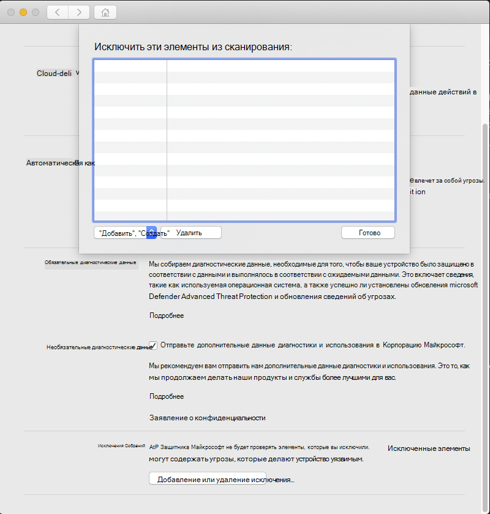

# <a name="configure-and-validate-exclusions-for-microsoft-defender-for-endpoint-for-mac"></a><span data-ttu-id="6a305-105">Настройка и проверка исключений для Microsoft Defender для конечной точки для Mac</span><span class="sxs-lookup"><span data-stu-id="6a305-105">Configure and validate exclusions for Microsoft Defender for Endpoint for Mac</span></span>

[!INCLUDE [Microsoft 365 Defender rebranding](../../includes/microsoft-defender.md)]


<span data-ttu-id="6a305-106">**Область применения:**</span><span class="sxs-lookup"><span data-stu-id="6a305-106">**Applies to:**</span></span>
- [<span data-ttu-id="6a305-107">Microsoft Defender для конечной точки</span><span class="sxs-lookup"><span data-stu-id="6a305-107">Microsoft Defender for Endpoint</span></span>](https://go.microsoft.com/fwlink/p/?linkid=2154037)
- [<span data-ttu-id="6a305-108">Microsoft 365 Defender</span><span class="sxs-lookup"><span data-stu-id="6a305-108">Microsoft 365 Defender</span></span>](https://go.microsoft.com/fwlink/?linkid=2118804)

> <span data-ttu-id="6a305-109">Хотите испытать Defender для конечной точки?</span><span class="sxs-lookup"><span data-stu-id="6a305-109">Want to experience Defender for Endpoint?</span></span> [<span data-ttu-id="6a305-110">Зарегистрився для бесплатной пробной.</span><span class="sxs-lookup"><span data-stu-id="6a305-110">Sign up for a free trial.</span></span>](https://www.microsoft.com/microsoft-365/windows/microsoft-defender-atp?ocid=docs-wdatp-investigateip-abovefoldlink)

<span data-ttu-id="6a305-111">В этой статье данная статья содержит сведения о том, как определить исключения, применимые к проверкам по запросу, а также защиту и мониторинг в режиме реального времени.</span><span class="sxs-lookup"><span data-stu-id="6a305-111">This article provides information on how to define exclusions that apply to on-demand scans, and real-time protection and monitoring.</span></span>

>[!IMPORTANT]
><span data-ttu-id="6a305-112">Исключения, описанные в этой статье, не применяются к другим возможностям Defender for Endpoint для Mac, включая обнаружение конечной точки и ответ (EDR).</span><span class="sxs-lookup"><span data-stu-id="6a305-112">The exclusions described in this article don't apply to other Defender for Endpoint for Mac capabilities, including endpoint detection and response (EDR).</span></span> <span data-ttu-id="6a305-113">Файлы, исключаемые с помощью методов, описанных в этой статье, по-прежнему могут вызывать оповещения EDR и другие обнаружения.</span><span class="sxs-lookup"><span data-stu-id="6a305-113">Files that you exclude using the methods described in this article can still trigger EDR alerts and other detections.</span></span>

<span data-ttu-id="6a305-114">Некоторые файлы, папки, процессы и файлы, открытые процессом, можно исключить из defender for Endpoint для сканирования Mac.</span><span class="sxs-lookup"><span data-stu-id="6a305-114">You can exclude certain files, folders, processes, and process-opened files from Defender for Endpoint for Mac scans.</span></span>

<span data-ttu-id="6a305-115">Исключения могут быть полезны, чтобы избежать неправильных обнаружений в файлах или программном обеспечении, уникальных или настраиваемых для вашей организации.</span><span class="sxs-lookup"><span data-stu-id="6a305-115">Exclusions can be useful to avoid incorrect detections on files or software that are unique or customized to your organization.</span></span> <span data-ttu-id="6a305-116">Они также могут быть полезны для смягчения проблем с производительностью, вызванных Defender для конечной точки для Mac.</span><span class="sxs-lookup"><span data-stu-id="6a305-116">They can also be useful for mitigating performance issues caused by Defender for Endpoint for Mac.</span></span>

>[!WARNING]
><span data-ttu-id="6a305-117">Определение исключений снижает защиту, предложенную Defender для конечной точки для Mac.</span><span class="sxs-lookup"><span data-stu-id="6a305-117">Defining exclusions lowers the protection offered by Defender for Endpoint for Mac.</span></span> <span data-ttu-id="6a305-118">Всегда следует оценивать риски, связанные с реализацией исключений, и следует исключить только те файлы, которые, как вы уверены, не являются вредоносными.</span><span class="sxs-lookup"><span data-stu-id="6a305-118">You should always evaluate the risks that are associated with implementing exclusions, and you should only exclude files that you are confident are not malicious.</span></span>

## <a name="supported-exclusion-types"></a><span data-ttu-id="6a305-119">Поддерживаемые типы исключений</span><span class="sxs-lookup"><span data-stu-id="6a305-119">Supported exclusion types</span></span>

<span data-ttu-id="6a305-120">В таблице ниже показаны типы исключений, поддерживаемые Защитником для конечной точки для Mac.</span><span class="sxs-lookup"><span data-stu-id="6a305-120">The follow table shows the exclusion types supported by Defender for Endpoint for Mac.</span></span>

<span data-ttu-id="6a305-121">Исключения</span><span class="sxs-lookup"><span data-stu-id="6a305-121">Exclusion</span></span> | <span data-ttu-id="6a305-122">Определение</span><span class="sxs-lookup"><span data-stu-id="6a305-122">Definition</span></span> | <span data-ttu-id="6a305-123">Примеры</span><span class="sxs-lookup"><span data-stu-id="6a305-123">Examples</span></span>
---|---|---
<span data-ttu-id="6a305-124">Расширение файла</span><span class="sxs-lookup"><span data-stu-id="6a305-124">File extension</span></span> | <span data-ttu-id="6a305-125">Все файлы с расширением в любом месте на компьютере</span><span class="sxs-lookup"><span data-stu-id="6a305-125">All files with the extension, anywhere on the machine</span></span> | `.test`
<span data-ttu-id="6a305-126">Файл</span><span class="sxs-lookup"><span data-stu-id="6a305-126">File</span></span> | <span data-ttu-id="6a305-127">Определенный файл, определенный по полному пути</span><span class="sxs-lookup"><span data-stu-id="6a305-127">A specific file identified by the full path</span></span> | `/var/log/test.log`<br/>`/var/log/*.log`<br/>`/var/log/install.?.log`
<span data-ttu-id="6a305-128">Folder</span><span class="sxs-lookup"><span data-stu-id="6a305-128">Folder</span></span> | <span data-ttu-id="6a305-129">Все файлы в указанной папке (повторно)</span><span class="sxs-lookup"><span data-stu-id="6a305-129">All files under the specified folder (recursively)</span></span> | `/var/log/`<br/>`/var/*/`
<span data-ttu-id="6a305-130">Процесс</span><span class="sxs-lookup"><span data-stu-id="6a305-130">Process</span></span> | <span data-ttu-id="6a305-131">Определенный процесс (указанный полным путем или именем файла) и все файлы, открытые в нем.</span><span class="sxs-lookup"><span data-stu-id="6a305-131">A specific process (specified either by the full path or file name) and all files opened by it</span></span> | `/bin/cat`<br/>`cat`<br/>`c?t`

<span data-ttu-id="6a305-132">Исключения файлов, папок и процессов поддерживают следующие подкарды:</span><span class="sxs-lookup"><span data-stu-id="6a305-132">File, folder, and process exclusions support the following wildcards:</span></span>

<span data-ttu-id="6a305-133">Подстановочный знак</span><span class="sxs-lookup"><span data-stu-id="6a305-133">Wildcard</span></span> | <span data-ttu-id="6a305-134">Описание</span><span class="sxs-lookup"><span data-stu-id="6a305-134">Description</span></span> | <span data-ttu-id="6a305-135">Пример</span><span class="sxs-lookup"><span data-stu-id="6a305-135">Example</span></span> | <span data-ttu-id="6a305-136">Совпадения</span><span class="sxs-lookup"><span data-stu-id="6a305-136">Matches</span></span> | <span data-ttu-id="6a305-137">Не совпадает</span><span class="sxs-lookup"><span data-stu-id="6a305-137">Does not match</span></span>
---|---|---|---|---
\* |    <span data-ttu-id="6a305-138">Совпадает с любым числом символов, в том числе без них (обратите внимание, что при данной подмастерье используется внутри пути, она заменит только одну папку)</span><span class="sxs-lookup"><span data-stu-id="6a305-138">Matches any number of any characters including none (note that when this wildcard is used inside a path it will substitute only one folder)</span></span> | `/var/*/*.log` | `/var/log/system.log` | `/var/log/nested/system.log`
<span data-ttu-id="6a305-139">?</span><span class="sxs-lookup"><span data-stu-id="6a305-139">?</span></span> | <span data-ttu-id="6a305-140">Соответствует любому отдельному символу</span><span class="sxs-lookup"><span data-stu-id="6a305-140">Matches any single character</span></span> | `file?.log` | `file1.log`<br/>`file2.log` | `file123.log`

>[!NOTE]
><span data-ttu-id="6a305-141">При оценке исключений продукт пытается устранить твердые ссылки.</span><span class="sxs-lookup"><span data-stu-id="6a305-141">The product attempts to resolve firmlinks when evaluating exclusions.</span></span> <span data-ttu-id="6a305-142">Разрешение Firmlink не работает, если исключение содержит подтеки или целевой файл (на `Data` томе) не существует.</span><span class="sxs-lookup"><span data-stu-id="6a305-142">Firmlink resolution does not work when the exclusion contains wildcards or the target file (on the `Data` volume) does not exist.</span></span>

## <a name="how-to-configure-the-list-of-exclusions"></a><span data-ttu-id="6a305-143">Настройка списка исключений</span><span class="sxs-lookup"><span data-stu-id="6a305-143">How to configure the list of exclusions</span></span>

### <a name="from-the-management-console"></a><span data-ttu-id="6a305-144">Из консоли управления</span><span class="sxs-lookup"><span data-stu-id="6a305-144">From the management console</span></span>

<span data-ttu-id="6a305-145">Дополнительные сведения о настройке исключений из JAMF, Intune или другой консоли управления см. в примере [Set preferences for Defender for Endpoint for Mac.](mac-preferences.md)</span><span class="sxs-lookup"><span data-stu-id="6a305-145">For more information on how to configure exclusions from JAMF, Intune, or another management console, see [Set preferences for Defender for Endpoint for Mac](mac-preferences.md).</span></span>

### <a name="from-the-user-interface"></a><span data-ttu-id="6a305-146">Из пользовательского интерфейса</span><span class="sxs-lookup"><span data-stu-id="6a305-146">From the user interface</span></span>

<span data-ttu-id="6a305-147">Откройте приложение Defender для конечной точки и перейдите **к** управлению настройками Добавить или Удалить исключение... , как показано на следующем  >  скриншоте:</span><span class="sxs-lookup"><span data-stu-id="6a305-147">Open the Defender for Endpoint application and navigate to **Manage settings** > **Add or Remove Exclusion...**, as shown in the following screenshot:</span></span>



<span data-ttu-id="6a305-149">Выберите тип исключения, который необходимо добавить и следовать подсказкам.</span><span class="sxs-lookup"><span data-stu-id="6a305-149">Select the type of exclusion that you wish to add and follow the prompts.</span></span>

## <a name="validate-exclusions-lists-with-the-eicar-test-file"></a><span data-ttu-id="6a305-150">Проверка списков исключений в тестовом файле EICAR</span><span class="sxs-lookup"><span data-stu-id="6a305-150">Validate exclusions lists with the EICAR test file</span></span>

<span data-ttu-id="6a305-151">Вы можете проверить, работают ли списки исключений, `curl` скачав тестовый файл.</span><span class="sxs-lookup"><span data-stu-id="6a305-151">You can validate that your exclusion lists are working by using `curl` to download a test file.</span></span>

<span data-ttu-id="6a305-152">В следующем фрагменте Bash замените файл, соответствующий `test.txt` правилам исключения.</span><span class="sxs-lookup"><span data-stu-id="6a305-152">In the following Bash snippet, replace `test.txt` with a file that conforms to your exclusion rules.</span></span> <span data-ttu-id="6a305-153">Например, если вы исключили `.testing` расширение, замените `test.txt` `test.testing` .</span><span class="sxs-lookup"><span data-stu-id="6a305-153">For example, if you have excluded the `.testing` extension, replace `test.txt` with `test.testing`.</span></span> <span data-ttu-id="6a305-154">Если вы тестируете путь, убедитесь, что вы запустите команду в этом пути.</span><span class="sxs-lookup"><span data-stu-id="6a305-154">If you are testing a path, ensure that you run the command within that path.</span></span>

```bash
curl -o test.txt https://www.eicar.org/download/eicar.com.txt
```

<span data-ttu-id="6a305-155">Если Защитник для конечной точки для Mac сообщает о вредоносных программах, то правило не работает.</span><span class="sxs-lookup"><span data-stu-id="6a305-155">If Defender for Endpoint for Mac reports malware, then the rule is not working.</span></span> <span data-ttu-id="6a305-156">Если нет отчета о вредоносных программах, а загруженный файл существует, то исключение работает.</span><span class="sxs-lookup"><span data-stu-id="6a305-156">If there is no report of malware, and the downloaded file exists, then the exclusion is working.</span></span> <span data-ttu-id="6a305-157">Вы можете открыть файл, чтобы подтвердить, что содержимое является таким же, как описано на веб-сайте [тестового файла EICAR](http://2016.eicar.org/86-0-Intended-use.html).</span><span class="sxs-lookup"><span data-stu-id="6a305-157">You can open the file to confirm that the contents are the same as what is described on the [EICAR test file website](http://2016.eicar.org/86-0-Intended-use.html).</span></span>

<span data-ttu-id="6a305-158">Если у вас нет доступа к Интернету, вы можете создать собственный тестовый файл EICAR.</span><span class="sxs-lookup"><span data-stu-id="6a305-158">If you do not have Internet access, you can create your own EICAR test file.</span></span> <span data-ttu-id="6a305-159">Напишите строку EICAR в новый текстовый файл со следующей командой Bash:</span><span class="sxs-lookup"><span data-stu-id="6a305-159">Write the EICAR string to a new text file with the following Bash command:</span></span>

```bash
echo 'X5O!P%@AP[4\PZX54(P^)7CC)7}$EICAR-STANDARD-ANTIVIRUS-TEST-FILE!$H+H*' > test.txt
```

<span data-ttu-id="6a305-160">Вы также можете скопировать строку в пустой текстовый файл и попытаться сохранить ее с именем файла или в папке, вы пытаетсяе исключить.</span><span class="sxs-lookup"><span data-stu-id="6a305-160">You can also copy the string into a blank text file and attempt to save it with the file name or in the folder you are attempting to exclude.</span></span>

## <a name="allow-threats"></a><span data-ttu-id="6a305-161">Разрешить угрозы</span><span class="sxs-lookup"><span data-stu-id="6a305-161">Allow threats</span></span>

<span data-ttu-id="6a305-162">Помимо исключения определенного контента из проверки можно также настроить продукт, чтобы не обнаруживать некоторые классы угроз (определенных именем угрозы).</span><span class="sxs-lookup"><span data-stu-id="6a305-162">In addition to excluding certain content from being scanned, you can also configure the product not to detect some classes of threats (identified by the threat name).</span></span> <span data-ttu-id="6a305-163">Вы должны соблюдать осторожность при использовании этой функции, так как она может оставить устройство незащищенным.</span><span class="sxs-lookup"><span data-stu-id="6a305-163">You should exercise caution when using this functionality, as it can leave your device unprotected.</span></span>

<span data-ttu-id="6a305-164">Чтобы добавить имя угрозы в разрешенный список, выполните следующую команду:</span><span class="sxs-lookup"><span data-stu-id="6a305-164">To add a threat name to the allowed list, execute the following command:</span></span>

```bash
mdatp threat allowed add --name [threat-name]
```

<span data-ttu-id="6a305-165">Имя угрозы, связанное с обнаружением на устройстве, можно получить с помощью следующей команды:</span><span class="sxs-lookup"><span data-stu-id="6a305-165">The threat name associated with a detection on your device can be obtained using the following command:</span></span>

```bash
mdatp threat list
```

<span data-ttu-id="6a305-166">Например, чтобы добавить (имя угрозы, связанное с обнаружением EICAR) в разрешенный `EICAR-Test-File (not a virus)` список, выполните следующую команду:</span><span class="sxs-lookup"><span data-stu-id="6a305-166">For example, to add `EICAR-Test-File (not a virus)` (the threat name associated with the EICAR detection) to the allowed list, execute the following command:</span></span>

```bash
mdatp threat allowed add --name "EICAR-Test-File (not a virus)"
```
