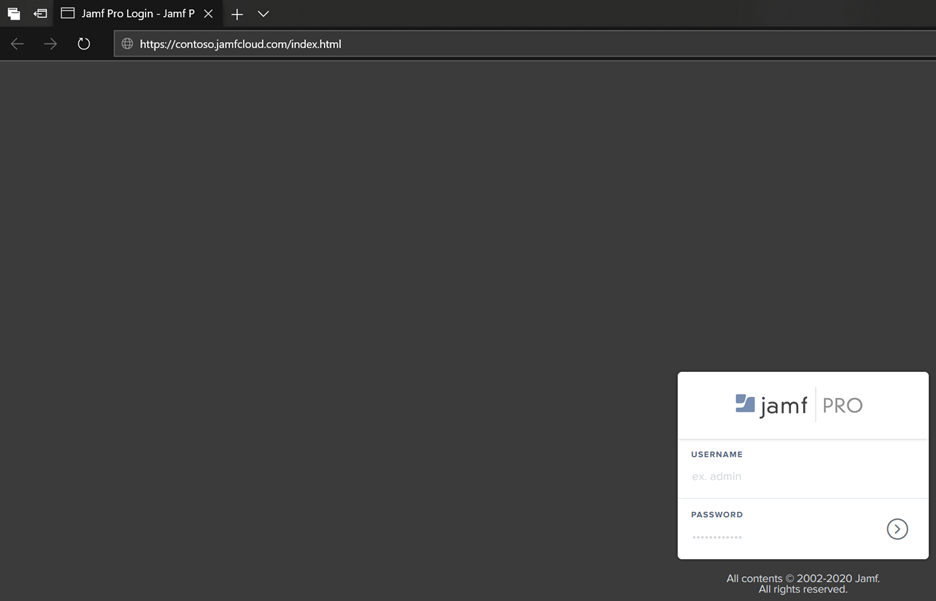
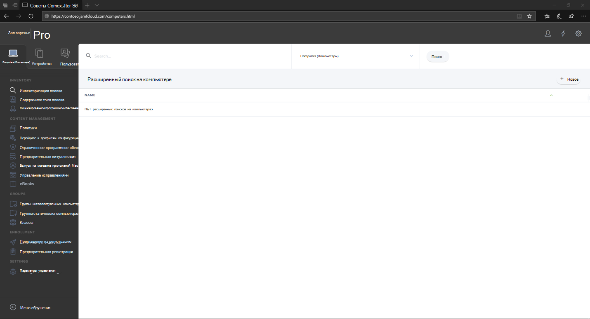

# Вход в Jamf Pro

[!INCLUDE [Microsoft 365 Defender rebranding](../../includes/microsoft-defender.md)]

**Область применения:**
- [Microsoft Defender для конечной точки](https://go.microsoft.com/fwlink/p/?linkid=2154037)
- [Microsoft 365 Defender](https://go.microsoft.com/fwlink/?linkid=2118804)

> Хотите испытать Defender для конечной точки? [Зарегистрився для бесплатной пробной.](https://www.microsoft.com/microsoft-365/windows/microsoft-defender-atp?ocid=docs-wdatp-investigateip-abovefoldlink)

1. Введите учетные данные.

    

2. Выбор **компьютеров**.

    

3. Вы увидите доступные параметры.

     

## Следующий шаг
[Настройка групп устройств в Jamf Pro](mac-jamfpro-device-groups.md)

