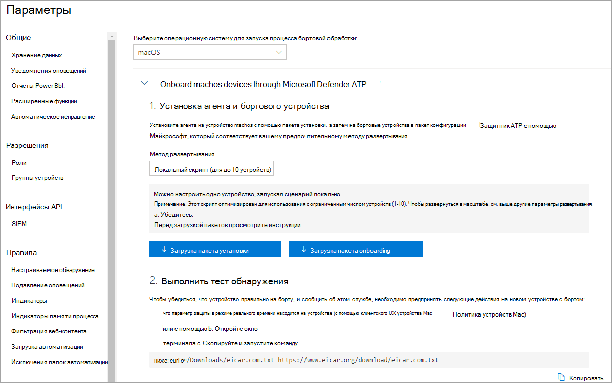
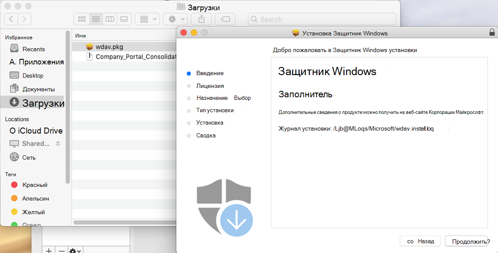
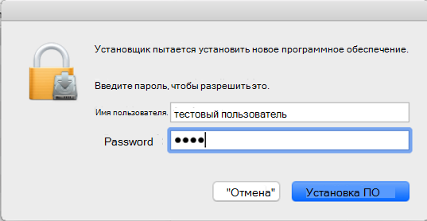
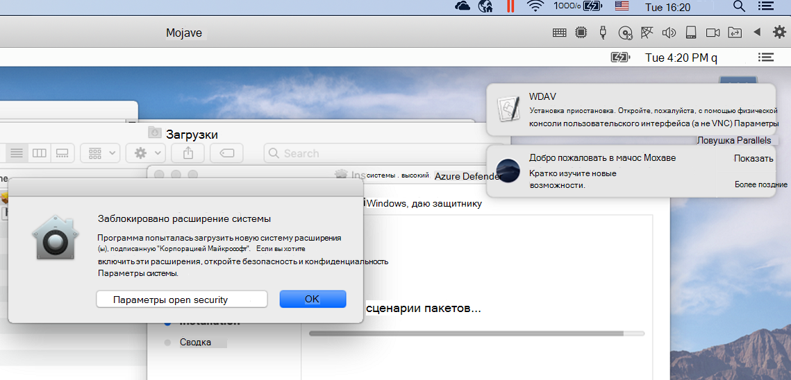
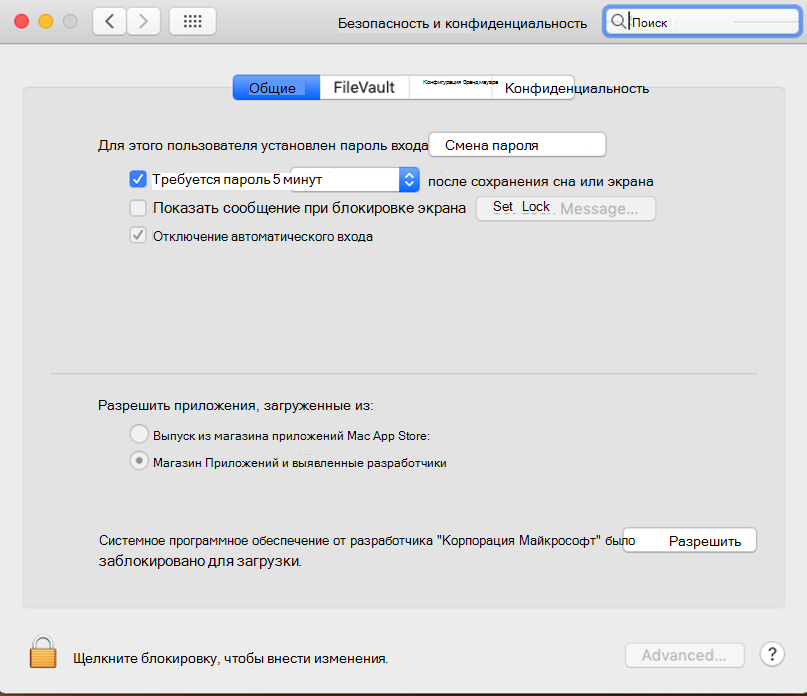
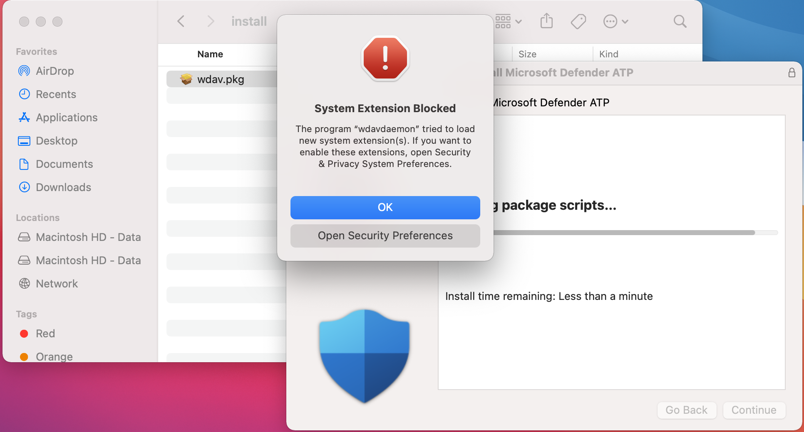
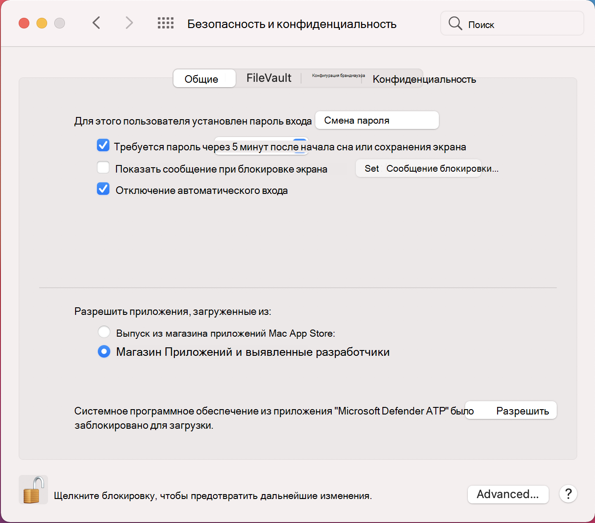
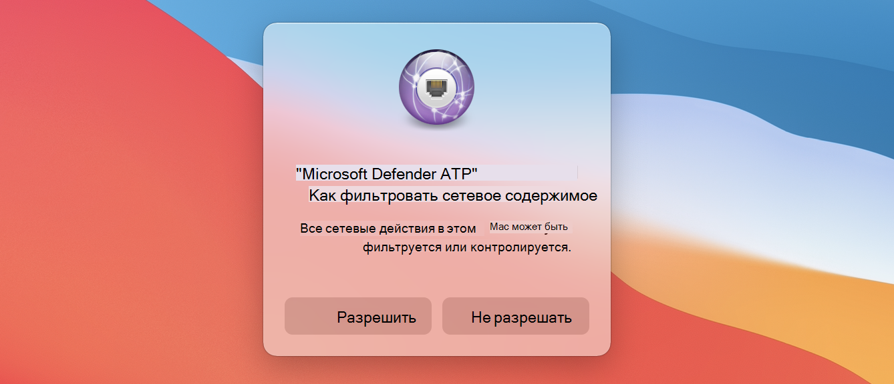
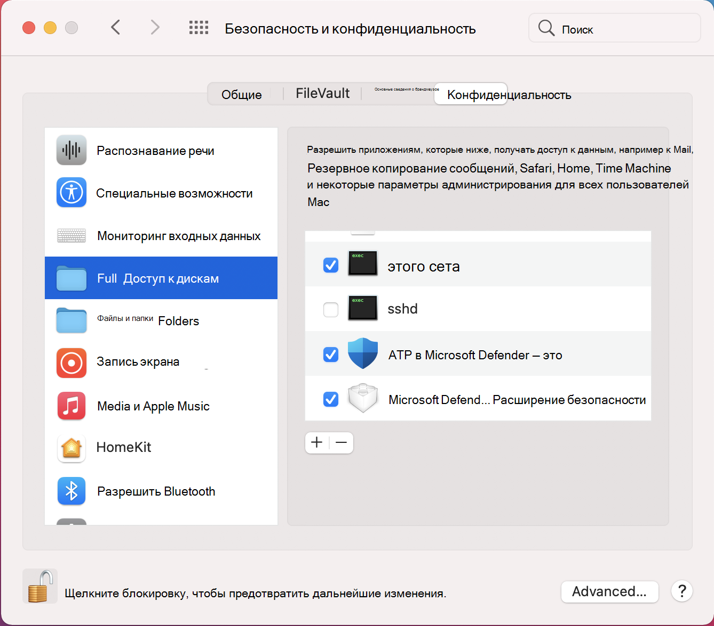

# <a name="manual-deployment-for-microsoft-defender-for-endpoint-for-macos"></a>Ручное развертывание для Microsoft Defender для конечной точки для macOS

[!INCLUDE [Microsoft 365 Defender rebranding](../../includes/microsoft-defender.md)]

**Область применения:**
- [Microsoft Defender для конечной точки](https://go.microsoft.com/fwlink/p/?linkid=2154037)
- [Microsoft 365 Defender](https://go.microsoft.com/fwlink/?linkid=2118804)

> Хотите испытать Defender для конечной точки? [Зарегистрився для бесплатной пробной.](https://www.microsoft.com/microsoft-365/windows/microsoft-defender-atp?ocid=docs-wdatp-investigateip-abovefoldlink)

В этом разделе описывается, как развернуть Microsoft Defender для конечной точки для macOS вручную. Успешное развертывание требует выполнения всех следующих действий:
- [Загрузка пакетов установки и загрузки](#download-installation-and-onboarding-packages)
- [Установка приложения (macOS 10.15 и более старые версии)](#application-installation-macos-1015-and-older-versions)
- [Установка приложения (macOS 11 и более новые версии)](#application-installation-macos-11-and-newer-versions)
- [Конфигурация клиента](#client-configuration)

## <a name="prerequisites-and-system-requirements"></a>Необходимые условия и требования к системе

Перед началом работы см. на главной странице [Microsoft Defender for Endpoint для macOS](microsoft-defender-endpoint-mac.md) описание необходимых условий и системных требований для текущей версии программного обеспечения.

## <a name="download-installation-and-onboarding-packages"></a>Загрузка пакетов установки и загрузки

Скачайте пакеты установки и загрузки из Центра безопасности Защитника Майкрософт:

1. В Центре безопасности Защитника Майкрософт перейдите в **параметры > управления устройствами > onboarding.**
2. В разделе 1 страницы установите операционную систему для **macOS** и метода развертывания к **локальному сценарию.**
3. В разделе 2 страницы выберите **пакет установки Загрузка**. Сохраните его как wdav.pkg в локальном каталоге.
4. В разделе 2 страницы выберите **пакет Загрузка onboarding**. Сохраните его WindowsDefenderATPOnboardingPackage.zip в том же каталоге.

    

5. В командной подсказке убедитесь, что у вас есть два файла.
    
## <a name="application-installation-macos-1015-and-older-versions"></a>Установка приложения (macOS 10.15 и более старые версии)

Чтобы завершить этот процесс, на устройстве должны быть привилегии администратора.

1. Перейдите к скачаемой wdav.pkg в Finder и откройте его.

    

2. Выберите **Продолжить,** согласитесь с условиями лицензии и введите пароль при запросе.

    

   > [!IMPORTANT]
   > Вам будет предложено разрешить установку драйвера из Microsoft (либо "Расширение системы заблокировано", либо "Установка заблокирована" или оба. Необходимо разрешить установку драйвера.

   

3. Выберите **параметры Open Security Preferences** или **Open System Preferences > безопасности & конфиденциальности.** Выберите **Разрешить:**

    

   Продолжается установка.

   > [!CAUTION]
   > Если вы не выберите **Разрешить,** установка будет продолжаться через 5 минут. Microsoft Defender для конечной точки будет загружен, но некоторые функции, например защита в режиме реального времени, будут отключены. Сведения [о том,](mac-support-kext.md) как устранить неполадки в расширении ядра, см. в выпуске "Устранение неполадок".

> [!NOTE]
> MacOS может потребовать перезагрузить устройство при первой установке Microsoft Defender для конечной точки. Защита в режиме реального времени не будет доступна до перезагрузки устройства.

## <a name="application-installation-macos-11-and-newer-versions"></a>Установка приложения (macOS 11 и более новые версии)

Чтобы завершить этот процесс, на устройстве должны быть привилегии администратора.

1. Перейдите к скачаемой wdav.pkg в Finder и откройте его.

    

2. Выберите **Продолжить,** согласитесь с условиями лицензии и введите пароль при запросе.

3. По завершении процесса установки вам будет назначено утверждение системных расширений, используемых продуктом. Выберите **параметры открытой безопасности.**

    

4. Из окна **конфиденциальности & безопасности** выберите **Разрешить**.

    

5. Повторите действия 3 & 4 для всех расширений системы, распространяемых с помощью Microsoft Defender для конечной точки для Mac.

6. В рамках возможностей обнаружения конечных точек и ответов Microsoft Defender for Endpoint для Mac проверяет трафик розетки и передает эти сведения на портал Центра безопасности Microsoft Defender. Если вам предложено предоставить разрешения Microsoft Defender для конечной точки для фильтрации сетевого трафика, выберите **Разрешить**.

    

7. Откройте **систему настройки** безопасности & конфиденциальности и перейдите на вкладку Конфиденциальность. Предоставление полного доступа к диску в ПТП Microsoft Defender и Расширение безопасности конечной точки  >     **ATP Защитника Майкрософт.** 

    

## <a name="client-configuration"></a>Конфигурация клиента

1. Скопируйте wdav.pkg и MicrosoftDefenderATPOnboardingMacOs.py на устройство, на котором развернут Microsoft Defender для конечной точки для macOS.

    Клиентские устройства не связаны с orgId. Обратите внимание, что *атрибут orgId* пустой.

    ```bash
    mdatp health --field org_id
    ```

2. Запустите скрипт Python для установки файла конфигурации:

    ```bash
    /usr/bin/python MicrosoftDefenderATPOnboardingMacOs.py
    ```

3. Убедитесь, что устройство теперь связано с организацией и сообщает о допустимой *orgId:*

    ```bash
    mdatp health --field org_id
    ```

После установки вы увидите значок Microsoft Defender в панели состояния macOS в правом верхнем углу.

   
   

## <a name="how-to-allow-full-disk-access"></a>Как разрешить полный доступ к диску

> [!CAUTION]
> MacOS 10.15 (Catalina) содержит новые улучшения безопасности и конфиденциальности. Начиная с этой версии, по умолчанию приложения не могут получить доступ к определенным расположениям на диске (например, документы, скачивания, настольные компьютеры и т.д.) без явного согласия. При отсутствии такого согласия Microsoft Defender для конечной точки не может полностью защитить ваше устройство.

Чтобы предоставить согласие, откройте параметры system Preferences -> безопасности & конфиденциальности -> конфиденциальности -> полный доступ к диску. Щелкните значок блокировки, чтобы внести изменения (в нижней части диалогового окна). Выберите Microsoft Defender для конечной точки.

## <a name="logging-installation-issues"></a>Проблемы с установкой журнала

Дополнительные [сведения](mac-resources.md#logging-installation-issues) о том, как найти автоматически созданный журнал, созданный установщиком при ошибке, см. в дополнительных сведениях.

## <a name="uninstallation"></a>Uninstallation

Сведения о том, как удалить Microsoft Defender для конечной точки для macOS с клиентских устройств, см. в материале [Uninstalling.](mac-resources.md#uninstalling)
