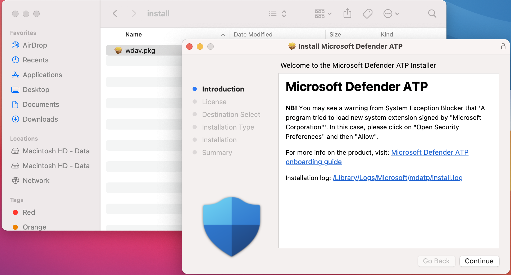

# <a name="manual-deployment-for-microsoft-defender-for-endpoint-for-macos"></a><span data-ttu-id="8dd19-104">Ручное развертывание для Microsoft Defender для конечной точки для macOS</span><span class="sxs-lookup"><span data-stu-id="8dd19-104">Manual deployment for Microsoft Defender for Endpoint for macOS</span></span>

[!INCLUDE [Microsoft 365 Defender rebranding](../../includes/microsoft-defender.md)]

<span data-ttu-id="8dd19-105">**Область применения:**</span><span class="sxs-lookup"><span data-stu-id="8dd19-105">**Applies to:**</span></span>
- [<span data-ttu-id="8dd19-106">Microsoft Defender для конечной точки</span><span class="sxs-lookup"><span data-stu-id="8dd19-106">Microsoft Defender for Endpoint</span></span>](https://go.microsoft.com/fwlink/p/?linkid=2146631)
- [<span data-ttu-id="8dd19-107">Microsoft 365 Defender</span><span class="sxs-lookup"><span data-stu-id="8dd19-107">Microsoft 365 Defender</span></span>](https://go.microsoft.com/fwlink/?linkid=2118804)

> <span data-ttu-id="8dd19-108">Хотите испытать Defender для конечной точки?</span><span class="sxs-lookup"><span data-stu-id="8dd19-108">Want to experience Defender for Endpoint?</span></span> [<span data-ttu-id="8dd19-109">Зарегистрився для бесплатной пробной.</span><span class="sxs-lookup"><span data-stu-id="8dd19-109">Sign up for a free trial.</span></span>](https://www.microsoft.com/microsoft-365/windows/microsoft-defender-atp?ocid=docs-wdatp-investigateip-abovefoldlink)

<span data-ttu-id="8dd19-110">В этом разделе описывается, как развернуть Microsoft Defender для конечной точки для macOS вручную.</span><span class="sxs-lookup"><span data-stu-id="8dd19-110">This topic describes how to deploy Microsoft Defender for Endpoint for macOS manually.</span></span> <span data-ttu-id="8dd19-111">Успешное развертывание требует выполнения всех следующих действий:</span><span class="sxs-lookup"><span data-stu-id="8dd19-111">A successful deployment requires the completion of all of the following steps:</span></span>
- [<span data-ttu-id="8dd19-112">Загрузка пакетов установки и загрузки</span><span class="sxs-lookup"><span data-stu-id="8dd19-112">Download installation and onboarding packages</span></span>](#download-installation-and-onboarding-packages)
- [<span data-ttu-id="8dd19-113">Установка приложения (macOS 10.15 и более старые версии)</span><span class="sxs-lookup"><span data-stu-id="8dd19-113">Application installation (macOS 10.15 and older versions)</span></span>](#application-installation-macos-1015-and-older-versions)
- [<span data-ttu-id="8dd19-114">Установка приложения (macOS 11 и более новые версии)</span><span class="sxs-lookup"><span data-stu-id="8dd19-114">Application installation (macOS 11 and newer versions)</span></span>](#application-installation-macos-11-and-newer-versions)
- [<span data-ttu-id="8dd19-115">Конфигурация клиента</span><span class="sxs-lookup"><span data-stu-id="8dd19-115">Client configuration</span></span>](#client-configuration)

## <a name="prerequisites-and-system-requirements"></a><span data-ttu-id="8dd19-116">Необходимые условия и требования к системе</span><span class="sxs-lookup"><span data-stu-id="8dd19-116">Prerequisites and system requirements</span></span>

<span data-ttu-id="8dd19-117">Перед началом работы см. на главной странице [Microsoft Defender for Endpoint для macOS](microsoft-defender-endpoint-mac.md) описание необходимых условий и системных требований для текущей версии программного обеспечения.</span><span class="sxs-lookup"><span data-stu-id="8dd19-117">Before you get started, see [the main Microsoft Defender for Endpoint for macOS page](microsoft-defender-endpoint-mac.md) for a description of prerequisites and system requirements for the current software version.</span></span>

## <a name="download-installation-and-onboarding-packages"></a><span data-ttu-id="8dd19-118">Загрузка пакетов установки и загрузки</span><span class="sxs-lookup"><span data-stu-id="8dd19-118">Download installation and onboarding packages</span></span>

<span data-ttu-id="8dd19-119">Скачайте пакеты установки и загрузки из Центра безопасности Защитника Майкрософт:</span><span class="sxs-lookup"><span data-stu-id="8dd19-119">Download the installation and onboarding packages from Microsoft Defender Security Center:</span></span>

1. <span data-ttu-id="8dd19-120">В Центре безопасности Защитника Майкрософт перейдите в **параметры > управления устройствами > onboarding.**</span><span class="sxs-lookup"><span data-stu-id="8dd19-120">In Microsoft Defender Security Center, go to **Settings > Device Management > Onboarding**.</span></span>
2. <span data-ttu-id="8dd19-121">В разделе 1 страницы установите операционную систему для **macOS** и метода развертывания к **локальному сценарию.**</span><span class="sxs-lookup"><span data-stu-id="8dd19-121">In Section 1 of the page, set operating system to **macOS** and Deployment method to **Local script**.</span></span>
3. <span data-ttu-id="8dd19-122">В разделе 2 страницы выберите **пакет установки Загрузка**.</span><span class="sxs-lookup"><span data-stu-id="8dd19-122">In Section 2 of the page, select **Download installation package**.</span></span> <span data-ttu-id="8dd19-123">Сохраните его как wdav.pkg в локальном каталоге.</span><span class="sxs-lookup"><span data-stu-id="8dd19-123">Save it as wdav.pkg to a local directory.</span></span>
4. <span data-ttu-id="8dd19-124">В разделе 2 страницы выберите **пакет Загрузка onboarding**.</span><span class="sxs-lookup"><span data-stu-id="8dd19-124">In Section 2 of the page, select **Download onboarding package**.</span></span> <span data-ttu-id="8dd19-125">Сохраните его WindowsDefenderATPOnboardingPackage.zip в том же каталоге.</span><span class="sxs-lookup"><span data-stu-id="8dd19-125">Save it as WindowsDefenderATPOnboardingPackage.zip to the same directory.</span></span>

    

5. <span data-ttu-id="8dd19-127">В командной подсказке убедитесь, что у вас есть два файла.</span><span class="sxs-lookup"><span data-stu-id="8dd19-127">From a command prompt, verify that you have the two files.</span></span>
    
## <a name="application-installation-macos-1015-and-older-versions"></a><span data-ttu-id="8dd19-128">Установка приложения (macOS 10.15 и более старые версии)</span><span class="sxs-lookup"><span data-stu-id="8dd19-128">Application installation (macOS 10.15 and older versions)</span></span>

<span data-ttu-id="8dd19-129">Чтобы завершить этот процесс, на устройстве должны быть привилегии администратора.</span><span class="sxs-lookup"><span data-stu-id="8dd19-129">To complete this process, you must have admin privileges on the device.</span></span>

1. <span data-ttu-id="8dd19-130">Перейдите к скачаемой wdav.pkg в Finder и откройте его.</span><span class="sxs-lookup"><span data-stu-id="8dd19-130">Navigate to the downloaded wdav.pkg in Finder and open it.</span></span>

    

2. <span data-ttu-id="8dd19-132">Выберите **Продолжить,** согласитесь с условиями лицензии и введите пароль при запросе.</span><span class="sxs-lookup"><span data-stu-id="8dd19-132">Select **Continue**, agree with the License terms, and enter the password when prompted.</span></span>

    

   > [!IMPORTANT]
   > <span data-ttu-id="8dd19-134">Вам будет предложено разрешить установку драйвера из Microsoft (либо "Расширение системы заблокировано", либо "Установка заблокирована" или оба.</span><span class="sxs-lookup"><span data-stu-id="8dd19-134">You will be prompted to allow a driver from Microsoft to be installed (either "System Extension Blocked" or "Installation is on hold" or both.</span></span> <span data-ttu-id="8dd19-135">Необходимо разрешить установку драйвера.</span><span class="sxs-lookup"><span data-stu-id="8dd19-135">The driver must be allowed to be installed.</span></span>

   

3. <span data-ttu-id="8dd19-137">Выберите **параметры Open Security Preferences** или **Open System Preferences > безопасности & конфиденциальности.**</span><span class="sxs-lookup"><span data-stu-id="8dd19-137">Select **Open Security Preferences** or **Open System Preferences > Security & Privacy**.</span></span> <span data-ttu-id="8dd19-138">Выберите **Разрешить:**</span><span class="sxs-lookup"><span data-stu-id="8dd19-138">Select **Allow**:</span></span>

    

   <span data-ttu-id="8dd19-140">Продолжается установка.</span><span class="sxs-lookup"><span data-stu-id="8dd19-140">The installation proceeds.</span></span>

   > [!CAUTION]
   > <span data-ttu-id="8dd19-141">Если вы не выберите **Разрешить,** установка будет продолжаться через 5 минут.</span><span class="sxs-lookup"><span data-stu-id="8dd19-141">If you don't select **Allow**, the installation will proceed after 5 minutes.</span></span> <span data-ttu-id="8dd19-142">Microsoft Defender для конечной точки будет загружен, но некоторые функции, например защита в режиме реального времени, будут отключены.</span><span class="sxs-lookup"><span data-stu-id="8dd19-142">Microsoft Defender for Endpoint will be loaded, but some features, such as real-time protection, will be disabled.</span></span> <span data-ttu-id="8dd19-143">Сведения [о том,](mac-support-kext.md) как устранить неполадки в расширении ядра, см. в выпуске "Устранение неполадок".</span><span class="sxs-lookup"><span data-stu-id="8dd19-143">See [Troubleshoot kernel extension issues](mac-support-kext.md) for information on how to resolve this.</span></span>

> [!NOTE]
> <span data-ttu-id="8dd19-144">MacOS может потребовать перезагрузить устройство при первой установке Microsoft Defender для конечной точки.</span><span class="sxs-lookup"><span data-stu-id="8dd19-144">macOS may request to reboot the device upon the first installation of Microsoft Defender for Endpoint.</span></span> <span data-ttu-id="8dd19-145">Защита в режиме реального времени не будет доступна до перезагрузки устройства.</span><span class="sxs-lookup"><span data-stu-id="8dd19-145">Real-time protection will not be available until the device is rebooted.</span></span>

## <a name="application-installation-macos-11-and-newer-versions"></a><span data-ttu-id="8dd19-146">Установка приложения (macOS 11 и более новые версии)</span><span class="sxs-lookup"><span data-stu-id="8dd19-146">Application installation (macOS 11 and newer versions)</span></span>

<span data-ttu-id="8dd19-147">Чтобы завершить этот процесс, на устройстве должны быть привилегии администратора.</span><span class="sxs-lookup"><span data-stu-id="8dd19-147">To complete this process, you must have admin privileges on the device.</span></span>

1. <span data-ttu-id="8dd19-148">Перейдите к скачаемой wdav.pkg в Finder и откройте его.</span><span class="sxs-lookup"><span data-stu-id="8dd19-148">Navigate to the downloaded wdav.pkg in Finder and open it.</span></span>

    

2. <span data-ttu-id="8dd19-150">Выберите **Продолжить,** согласитесь с условиями лицензии и введите пароль при запросе.</span><span class="sxs-lookup"><span data-stu-id="8dd19-150">Select **Continue**, agree with the License terms, and enter the password when prompted.</span></span>

3. <span data-ttu-id="8dd19-151">По завершении процесса установки вам будет назначено утверждение системных расширений, используемых продуктом.</span><span class="sxs-lookup"><span data-stu-id="8dd19-151">At the end of the installation process, you will be promoted to approve the system extensions used by the product.</span></span> <span data-ttu-id="8dd19-152">Выберите **параметры открытой безопасности.**</span><span class="sxs-lookup"><span data-stu-id="8dd19-152">Select **Open Security Preferences**.</span></span>

    

4. <span data-ttu-id="8dd19-154">Из окна **конфиденциальности & безопасности** выберите **Разрешить**.</span><span class="sxs-lookup"><span data-stu-id="8dd19-154">From the **Security & Privacy** window, select **Allow**.</span></span>

    

5. <span data-ttu-id="8dd19-156">Повторите действия 3 & 4 для всех расширений системы, распространяемых с помощью Microsoft Defender для конечной точки для Mac.</span><span class="sxs-lookup"><span data-stu-id="8dd19-156">Repeat steps 3 & 4 for all system extensions distributed with Microsoft Defender for Endpoint for Mac.</span></span>

6. <span data-ttu-id="8dd19-157">В рамках возможностей обнаружения конечных точек и ответов Microsoft Defender for Endpoint для Mac проверяет трафик розетки и передает эти сведения на портал Центра безопасности Microsoft Defender.</span><span class="sxs-lookup"><span data-stu-id="8dd19-157">As part of the Endpoint Detection and Response capabilities, Microsoft Defender for Endpoint for Mac inspects socket traffic and reports this information to the Microsoft Defender Security Center portal.</span></span> <span data-ttu-id="8dd19-158">Если вам предложено предоставить разрешения Microsoft Defender для конечной точки для фильтрации сетевого трафика, выберите **Разрешить**.</span><span class="sxs-lookup"><span data-stu-id="8dd19-158">When prompted to grant Microsoft Defender for Endpoint permissions to filter network traffic, select **Allow**.</span></span>

    

7. <span data-ttu-id="8dd19-160">Откройте **систему настройки** безопасности & конфиденциальности и перейдите на вкладку Конфиденциальность. Предоставление полного доступа к диску в ПТП Microsoft Defender и Расширение безопасности конечной точки  >     **ATP Защитника Майкрософт.** </span><span class="sxs-lookup"><span data-stu-id="8dd19-160">Open **System Preferences** > **Security & Privacy** and navigate to the **Privacy** tab. Grant **Full Disk Access** permission to **Microsoft Defender ATP** and **Microsoft Defender ATP Endpoint Security Extension**.</span></span>

    

## <a name="client-configuration"></a><span data-ttu-id="8dd19-162">Конфигурация клиента</span><span class="sxs-lookup"><span data-stu-id="8dd19-162">Client configuration</span></span>

1. <span data-ttu-id="8dd19-163">Скопируйте wdav.pkg и MicrosoftDefenderATPOnboardingMacOs.py на устройство, на котором развернут Microsoft Defender для конечной точки для macOS.</span><span class="sxs-lookup"><span data-stu-id="8dd19-163">Copy wdav.pkg and MicrosoftDefenderATPOnboardingMacOs.py to the device where you deploy Microsoft Defender for Endpoint for macOS.</span></span>

    <span data-ttu-id="8dd19-164">Устройство клиента не связано с orgId.</span><span class="sxs-lookup"><span data-stu-id="8dd19-164">The client device is not associated with orgId.</span></span> <span data-ttu-id="8dd19-165">Обратите внимание, что *атрибут orgId* пустой.</span><span class="sxs-lookup"><span data-stu-id="8dd19-165">Note that the *orgId* attribute is blank.</span></span>

    ```bash
    mdatp health --field org_id
    ```

2. <span data-ttu-id="8dd19-166">Запустите скрипт Python для установки файла конфигурации:</span><span class="sxs-lookup"><span data-stu-id="8dd19-166">Run the Python script to install the configuration file:</span></span>

    ```bash
    /usr/bin/python MicrosoftDefenderATPOnboardingMacOs.py
    ```

3. <span data-ttu-id="8dd19-167">Убедитесь, что устройство теперь связано с организацией и сообщает о допустимой *orgId:*</span><span class="sxs-lookup"><span data-stu-id="8dd19-167">Verify that the device is now associated with your organization and reports a valid *orgId*:</span></span>

    ```bash
    mdatp health --field org_id
    ```

<span data-ttu-id="8dd19-168">После установки вы увидите значок Microsoft Defender в панели состояния macOS в правом верхнем углу.</span><span class="sxs-lookup"><span data-stu-id="8dd19-168">After installation, you'll see the Microsoft Defender icon in the macOS status bar in the top-right corner.</span></span>

   
   

## <a name="how-to-allow-full-disk-access"></a><span data-ttu-id="8dd19-170">Как разрешить полный доступ к диску</span><span class="sxs-lookup"><span data-stu-id="8dd19-170">How to Allow Full Disk Access</span></span>

> [!CAUTION]
> <span data-ttu-id="8dd19-171">MacOS 10.15 (Catalina) содержит новые улучшения безопасности и конфиденциальности.</span><span class="sxs-lookup"><span data-stu-id="8dd19-171">macOS 10.15 (Catalina) contains new security and privacy enhancements.</span></span> <span data-ttu-id="8dd19-172">Начиная с этой версии, по умолчанию приложения не могут получить доступ к определенным расположениям на диске (например, документы, скачивания, настольные компьютеры и т.д.) без явного согласия.</span><span class="sxs-lookup"><span data-stu-id="8dd19-172">Beginning with this version, by default, applications are not able to access certain locations on disk (such as Documents, Downloads, Desktop, etc.) without explicit consent.</span></span> <span data-ttu-id="8dd19-173">При отсутствии такого согласия Microsoft Defender для конечной точки не может полностью защитить ваше устройство.</span><span class="sxs-lookup"><span data-stu-id="8dd19-173">In the absence of this consent, Microsoft Defender for Endpoint is not able to fully protect your device.</span></span>

<span data-ttu-id="8dd19-174">Чтобы предоставить согласие, откройте параметры system Preferences -> безопасности & конфиденциальности -> конфиденциальности -> полный доступ к диску.</span><span class="sxs-lookup"><span data-stu-id="8dd19-174">To grant consent, open System Preferences -> Security & Privacy -> Privacy -> Full Disk Access.</span></span> <span data-ttu-id="8dd19-175">Щелкните значок блокировки, чтобы внести изменения (в нижней части диалогового окна).</span><span class="sxs-lookup"><span data-stu-id="8dd19-175">Click the lock icon to make changes (bottom of the dialog box).</span></span> <span data-ttu-id="8dd19-176">Выберите Microsoft Defender для конечной точки.</span><span class="sxs-lookup"><span data-stu-id="8dd19-176">Select Microsoft Defender for Endpoint.</span></span>

## <a name="logging-installation-issues"></a><span data-ttu-id="8dd19-177">Проблемы с установкой журнала</span><span class="sxs-lookup"><span data-stu-id="8dd19-177">Logging installation issues</span></span>

<span data-ttu-id="8dd19-178">Дополнительные [сведения](mac-resources.md#logging-installation-issues) о том, как найти автоматически созданный журнал, созданный установщиком при ошибке, см. в дополнительных сведениях.</span><span class="sxs-lookup"><span data-stu-id="8dd19-178">See [Logging installation issues](mac-resources.md#logging-installation-issues) for more information on how to find the automatically generated log that is created by the installer when an error occurs.</span></span>

## <a name="uninstallation"></a><span data-ttu-id="8dd19-179">Uninstallation</span><span class="sxs-lookup"><span data-stu-id="8dd19-179">Uninstallation</span></span>

<span data-ttu-id="8dd19-180">Сведения о том, как удалить Microsoft Defender для конечной точки для macOS с клиентских устройств, см. в материале [Uninstalling.](mac-resources.md#uninstalling)</span><span class="sxs-lookup"><span data-stu-id="8dd19-180">See [Uninstalling](mac-resources.md#uninstalling) for details on how to remove Microsoft Defender for Endpoint for macOS from client devices.</span></span>
