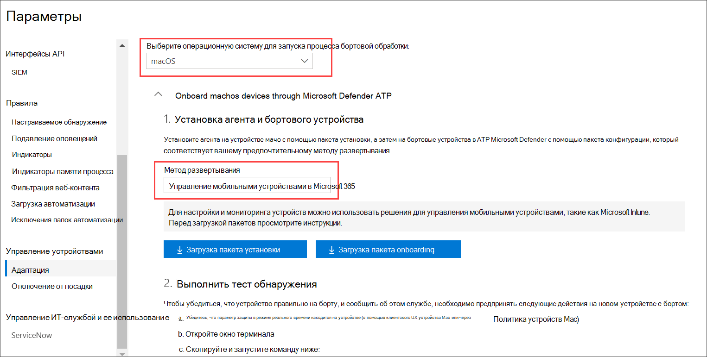
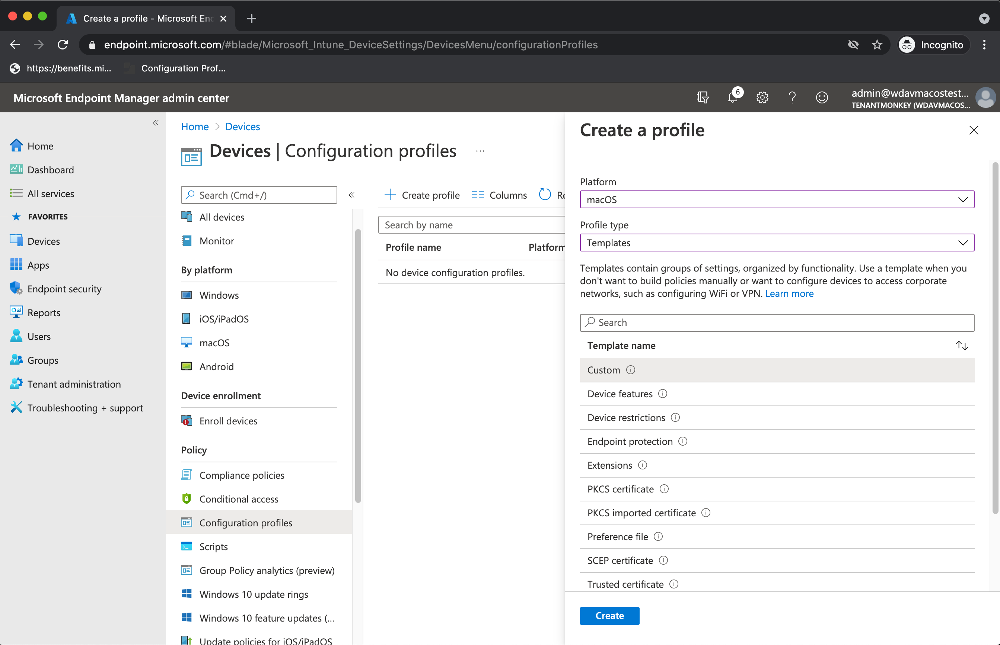
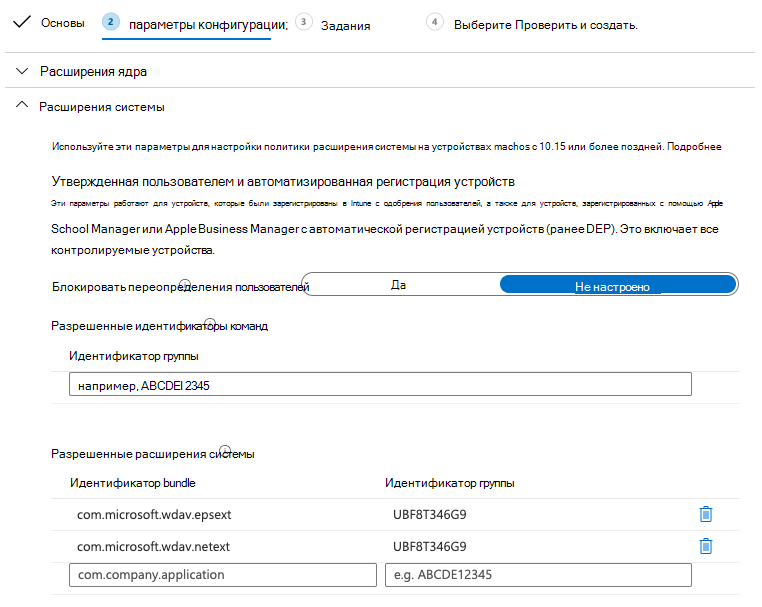
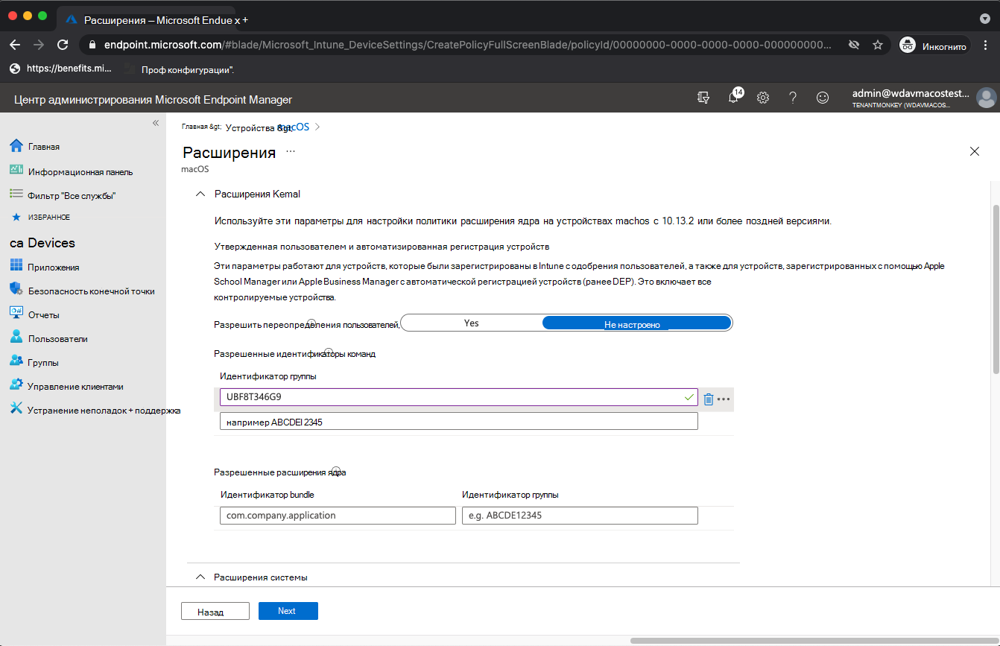
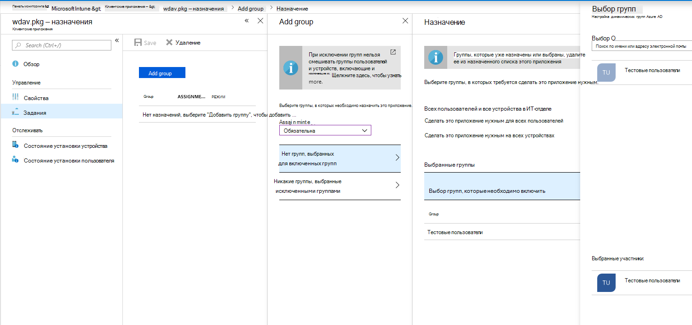
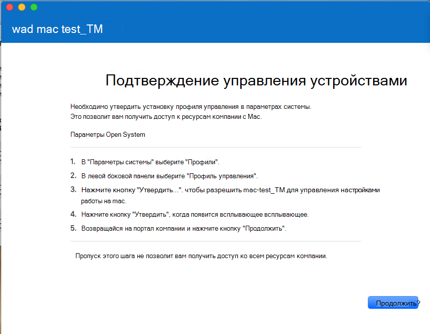
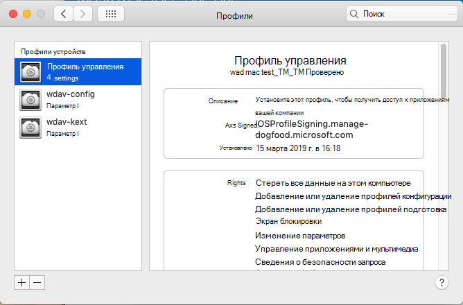
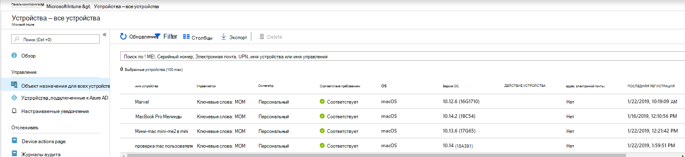
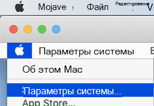
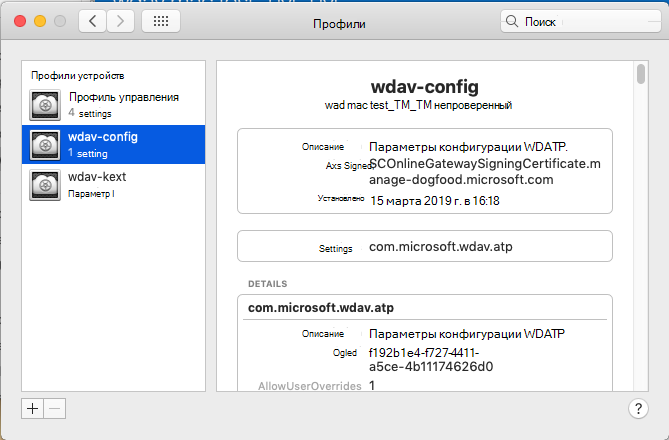

# <a name="intune-based-deployment-for-microsoft-defender-for-endpoint-on-macos"></a>Развертывание на основе intune для Microsoft Defender для конечной точки на macOS

[!INCLUDE [Microsoft 365 Defender rebranding](../../includes/microsoft-defender.md)]

**Область применения:**

- [Microsoft Defender для конечной точки в macOS](microsoft-defender-endpoint-mac.md)

В этом разделе описывается развертывание Microsoft Defender для конечной точки на macOS через Intune. Успешное развертывание требует выполнения всех следующих действий:

1. [Скачайте пакет onboarding](#download-the-onboarding-package)
1. [Установка клиентских устройств](#client-device-setup)
1. [Утверждение расширений системы](#approve-system-extensions)
1. [Создание профилей конфигурации системы](#create-system-configuration-profiles)
1. [Публикация приложения](#publish-application)

## <a name="prerequisites-and-system-requirements"></a>Необходимые условия и требования к системе

Перед началом работы см. в главной странице [Microsoft Defender for Endpoint](microsoft-defender-endpoint-mac.md) на странице macOS описание необходимых условий и системных требований к текущей версии программного обеспечения.

## <a name="overview"></a>Обзор

В следующей таблице подводятся итоги действий, которые необходимо предпринять для развертывания и управления Microsoft Defender для конечной точки на Mac с помощью Intune. Более подробные действия доступны ниже.

| Шаг | Примеры имен файлов | BundleIdentifier |
|-|-|-|
| [Скачайте пакет onboarding](#download-the-onboarding-package) | WindowsDefenderATPOnboarding__MDATP_wdav.atp.xml | com.microsoft.wdav.atp |
| [Утверждение расширения системы для Защитника Майкрософт для конечной точки](#approve-system-extensions) | MDATP_SysExt.xml | Н/Д |
| [Утверждение расширения ядра для Microsoft Defender для конечной точки](#download-the-onboarding-package) | MDATP_KExt.xml | Н/Д |
| [Предоставление полного доступа к диску Microsoft Defender для конечной точки](#full-disk-access) | MDATP_tcc_Catalina_or_newer.xml | com.microsoft.wdav.tcc |
| [Политика расширения сети](#network-filter) | MDATP_NetExt.xml | Н/Д |
| [Настройка Microsoft AutoUpdate (MAU)](mac-updates.md#intune) | MDATP_Microsoft_AutoUpdate.xml | com.microsoft.autoupdate2 |
| [Microsoft Defender для параметров конфигурации конечной точки](mac-preferences.md#intune-profile-1)<br/><br/> **Примечание:** Если вы планируете запустить сторонний AV для macOS, задай `passiveMode` . `true` | MDATP_WDAV_and_exclusion_settings_Preferences.xml | com.microsoft.wdav |
| [Настройка уведомлений Microsoft Defender для конечной точки и ms AutoUpdate (MAU)](mac-updates.md) | MDATP_MDAV_Tray_and_AutoUpdate2.mobileconfig | com.microsoft.autoupdate2 или com.microsoft.wdav.tray |


## <a name="download-the-onboarding-package"></a>Скачайте пакет onboarding

Скачайте бортовые пакеты из Центр безопасности в Microsoft Defender:

1. В Центр безопасности в Microsoft Defender перейдите **к Параметры**  >  **управления**  >  **устройствами.**

2. Установите операционную систему **для macOS** и метод развертывания для управления мобильными устройствами **и Microsoft Intune.**

    

3. Выберите **пакет загрузки.** Сохраните его _WindowsDefenderATPOnboardingPackage.zip_ в том же каталоге.

4. Извлечение содержимого .zip файла:

    ```bash
    unzip WindowsDefenderATPOnboardingPackage.zip
    ```
    ```Output
    Archive:  WindowsDefenderATPOnboardingPackage.zip
    warning:  WindowsDefenderATPOnboardingPackage.zip appears to use backslashes as path separators
      inflating: intune/kext.xml
      inflating: intune/WindowsDefenderATPOnboarding.xml
      inflating: jamf/WindowsDefenderATPOnboarding.plist
    ```

## <a name="create-system-configuration-profiles"></a>Создание профилей конфигурации системы

Следующий шаг — создание профилей конфигурации системы, необходимых Microsoft Defender для конечной точки.
В центре [администрирования Microsoft Endpoint Manager](https://endpoint.microsoft.com/) **открытые** профили  >  **конфигурации устройств.**

### <a name="onboarding-blob"></a>Вметь blob

Этот профиль содержит сведения о лицензии для Microsoft Defender для конечной точки, без нее он будет сообщать, что она не лицензирована.

1. Выберите **Создание профиля в** **профилях конфигурации.**
1. Выберите  = **шаблоны типов** **профилей Platform** macOS = . **Имя шаблона** = **Настраиваемый**. Щелкните **Создать**.

    > [!div class="mx-imgBorder"]
    > 

1. Выберите имя для профиля, например "MDATP для macOS". Нажмите **Далее**.

    > [!div class="mx-imgBorder"]
    > 

1. Выберите имя имени профиля конфигурации, например "MDATP для macOS".
1. Выберите intune/WindowsDefenderATPOnboarding.xml, извлеченный из пакета onboarding выше, в качестве файла профиля конфигурации.

    > [!div class="mx-imgBorder"]
    > 

1. Нажмите **Далее**.
1. Назначение устройств на **вкладке Назначение.** Нажмите **кнопку Далее**.

    > [!div class="mx-imgBorder"]
    > 

1. Обзор и **создание**.
1. Откройте   >  **профили конфигурации устройств**, вы можете увидеть созданный профиль там.

    > [!div class="mx-imgBorder"]
    > 

### <a name="approve-system-extensions"></a>Утверждение расширений системы

Этот профиль необходим для macOS 10.15 (Catalina) или более нового. Он будет игнорироваться на более старых macOS.

1. Выберите **Создание профиля в** **профилях конфигурации.**
1. Выберите  = **шаблоны типов** **профилей Platform** macOS = . **Имя шаблона** = **Расширения**. Щелкните **Создать**.
1. На **вкладке Basics** назови имя этому новому профилю.
1. На **вкладке Параметры конфигурации** расширяйте **расширения системы,** добавьте следующие записи в разделе **Разрешенные расширения** системы:

    Идентификатор bundle         | Идентификатор группы
    --------------------------|----------------
    com.microsoft.wdav.epsext | UBF8T346G9
    com.microsoft.wdav.netext | UBF8T346G9

    > [!div class="mx-imgBorder"]
    > 

1. На **вкладке Назначения** назначьте этот профиль всем пользователям **& всем устройствам.**
1. Просмотрите и создайте этот профиль конфигурации.

### <a name="kernel-extensions"></a>Расширения ядра

Этот профиль необходим для macOS 10.15 (Catalina) или старше. Он будет игнорироваться на более новых macOS.

> [!CAUTION]
> Устройства Apple Silicon (M1) не поддерживают KEXT. Установка профиля конфигурации, состоящего из политик KEXT, не будет работать на этих устройствах.

1. Выберите **Создание профиля в** **профилях конфигурации.**
1. Выберите  = **шаблоны типов** **профилей Platform** macOS = . **Имя шаблона** = **Расширения**. Щелкните **Создать**.
1. На **вкладке Basics** назови имя этому новому профилю.
1. На **вкладке Параметры конфигурации** разоширим **расширения ядра.**
1. Установите **идентификатор команды в** **UBF8T346G9** и нажмите **кнопку Далее**.

    > [!div class="mx-imgBorder"]
    > 

1. На **вкладке Назначения** назначьте этот профиль всем пользователям **& всем устройствам.**
1. Просмотрите и создайте этот профиль конфигурации.

### <a name="full-disk-access"></a>Полный доступ к диску

   > [!CAUTION]
   > MacOS 10.15 (Catalina) содержит новые улучшения безопасности и конфиденциальности. Начиная с этой версии, по умолчанию приложения не могут получить доступ к определенным расположениям на диске (например, документы, скачивания, настольные компьютеры и т.д.) без явного согласия. При отсутствии такого согласия Microsoft Defender для конечной точки не может полностью защитить ваше устройство.
   >
   > Этот профиль конфигурации предоставляет полный дисковый доступ к Microsoft Defender для конечной точки. Если вы ранее настраивали Microsoft Defender для конечной точки через Intune, рекомендуем обновить развертывание с помощью этого профиля конфигурации.

Скачайте [**fulldisk.mobileconfig**](https://raw.githubusercontent.com/microsoft/mdatp-xplat/master/macos/mobileconfig/profiles/kext.mobileconfig) из [нашего GitHub репозиторий](https://github.com/microsoft/mdatp-xplat/tree/master/macos/mobileconfig/profiles).

Выполните инструкции по использованию [blob onboarding](#onboarding-blob) сверху, используя "MDATP полный доступ к диску" в качестве имени профиля и скачав **имя профиля конфигурации fulldisk.mobileconfig.**

### <a name="network-filter"></a>Фильтр сети

В рамках возможностей обнаружения конечных точек и ответов Microsoft Defender для конечной точки на macOS проверяет трафик розетки и передает эти сведения на Центр безопасности в Microsoft Defender портал. Следующая политика позволяет сетевому расширению выполнять эту функцию.

Скачайте [**netfilter.mobileconfig**](https://raw.githubusercontent.com/microsoft/mdatp-xplat/master/macos/mobileconfig/profiles/kext.mobileconfig) из [нашего GitHub репозиторий](https://github.com/microsoft/mdatp-xplat/tree/master/macos/mobileconfig/profiles).

Выполните инструкции по использованию [blob onboarding](#onboarding-blob) сверху, используя "фильтр сети MDATP" в качестве имени профиля и скачав **имя профиля конфигурации netfilter.mobileconfig.**

### <a name="notifications"></a>Уведомления

Этот профиль используется для того, чтобы позволить Microsoft Defender для конечной точки на macOS и Microsoft Auto Update отображать уведомления в пользовательском интерфейсе на macOS 10.15 (Catalina) или более новых.

Скачайте [**notif.mobileconfig**](https://raw.githubusercontent.com/microsoft/mdatp-xplat/master/macos/mobileconfig/profiles/kext.mobileconfig) из [нашего GitHub репозиторий](https://github.com/microsoft/mdatp-xplat/tree/master/macos/mobileconfig/profiles).

Следуйте инструкциям по использованию [blob onboarding](#onboarding-blob) сверху, используя "фильтр сети MDATP" в качестве имени профиля, а также загрузите **notif.mobileconfig** в качестве имени профиля конфигурации.

### <a name="view-status"></a>Просмотр состояния

После распространения изменений Intune на зарегистрированные устройства вы можете увидеть их, перечисленные в состоянии **Monitor**  >  **Device:**

> [!div class="mx-imgBorder"]
> 

## <a name="publish-application"></a>Публикация приложения

Этот шаг позволяет развертывать Microsoft Defender для конечной точки на зарегистрированных машинах.

1. В центре [администрирования Microsoft Endpoint Manager](https://endpoint.microsoft.com/)откройте **приложения.**

    > [!div class="mx-imgBorder"]
    > 

1. Выберите по платформе > macOS > Добавить.
1. Выберите  = **macOS типа приложения,** нажмите **кнопку Выберите**.

    > [!div class="mx-imgBorder"]
    > 

1. Сохранить значения по умолчанию, нажмите **кнопку Далее**.

    > [!div class="mx-imgBorder"]
    > 

1. Добавление назначений, нажмите **кнопку Далее**.

    > [!div class="mx-imgBorder"]
    > 

1. Обзор и **создание**.
1. Вы можете **посетить MacOS платформы Apps** By, чтобы увидеть его  >    >   в списке всех приложений.

    > [!div class="mx-imgBorder"]
    > 

(Подробные сведения можно найти на странице [Intune](/mem/intune/apps/apps-advanced-threat-protection-macos)для развертывания Defender.)

   > [!CAUTION]
   > Необходимо создать все необходимые профили конфигурации и нажать их на все машины, как было объяснено выше.

## <a name="client-device-setup"></a>Установка клиентских устройств

Вам не требуется специальная подготовка для устройства Mac за пределами стандартной Корпоративный портал [установки.](/intune-user-help/enroll-your-device-in-intune-macos-cp)

1. Подтверждение управления устройствами.

    > [!div class="mx-imgBorder"]
    > 

    Выберите **параметры Open System Preferences,** найдите **профиль** управления в списке и выберите **Утверждение...**. Ваш профиль управления будет отображаться как **Проверенный:**

    

2. Выберите **Продолжить** и завершить регистрацию.

   Теперь вы можете записать больше устройств. Вы также можете записать их позже, после завершения настройки системы и пакетов приложений.

3. В Intune откройте **управление**  >  **устройствами**  >  **все устройства.** Здесь вы можете увидеть ваше устройство среди перечисленных ниже.

   > [!div class="mx-imgBorder"]
   > 

## <a name="verify-client-device-state"></a>Проверка состояния клиентского устройства

1. После развертывания профилей конфигурации на устройствах откройте **профили** системных  >  **предпочтений** на устройстве Mac.

    > [!div class="mx-imgBorder"]
    > 

    

2. Убедитесь, что следующие профили конфигурации присутствуют и устанавливаются. Профиль **управления должен** быть профилем системы Intune. _Wdav-config_ и _wdav-kext_ — это профили конфигурации системы, добавленные в Intune:

    

3. В правом верхнем углу также следует увидеть значок Microsoft Defender для конечных точек:

    > [!div class="mx-imgBorder"]
    > 

## <a name="troubleshooting"></a>Устранение неполадок

Проблема. Лицензия не найдена.

Решение. Выполните следующие действия, чтобы создать профиль устройства с WindowsDefenderATPOnboarding.xml.

## <a name="logging-installation-issues"></a>Проблемы с установкой журнала

Дополнительные сведения о том, как найти автоматически созданный журнал, созданный установщиком при ошибке, см. в примере проблемы с [установкой журнала.](mac-resources.md#logging-installation-issues)

## <a name="uninstallation"></a>Uninstallation

Сведения о том, как удалить Microsoft Defender для конечной точки на macOS с клиентских устройств, см. в материале [Uninstalling.](mac-resources.md#uninstalling)
