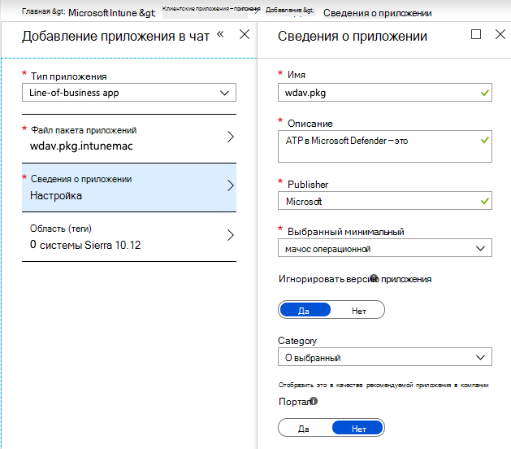
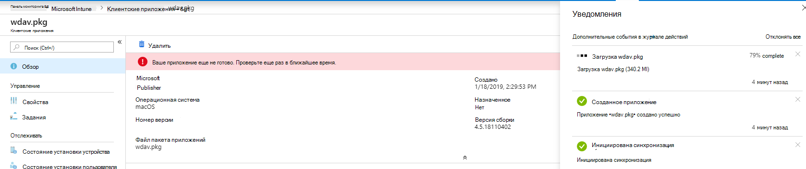
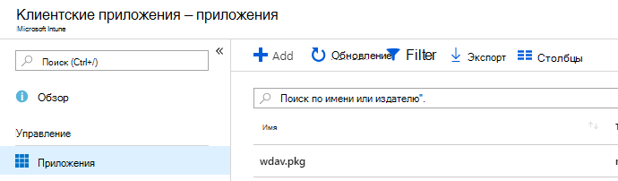
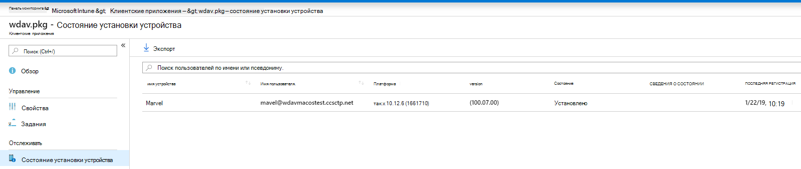

# <a name="intune-based-deployment-for-microsoft-defender-for-endpoint-for-mac"></a><span data-ttu-id="9fdff-104">Развертывание на основе intune для Microsoft Defender для конечной точки для Mac</span><span class="sxs-lookup"><span data-stu-id="9fdff-104">Intune-based deployment for Microsoft Defender for Endpoint for Mac</span></span>

[!INCLUDE [Microsoft 365 Defender rebranding](../../includes/microsoft-defender.md)]


> [!NOTE]
> <span data-ttu-id="9fdff-105">В этой документации объясняется устаревший метод развертывания и настройки Microsoft Defender для конечной точки на устройствах macOS.</span><span class="sxs-lookup"><span data-stu-id="9fdff-105">This documentation explains the legacy method for deploying and configuring Microsoft Defender for Endpoint on macOS devices.</span></span> <span data-ttu-id="9fdff-106">Родной опыт теперь доступен в консоли MEM.</span><span class="sxs-lookup"><span data-stu-id="9fdff-106">The native experience is now available in the MEM console.</span></span> <span data-ttu-id="9fdff-107">Выпуск родного пользовательского интерфейса в консоли MEM предоставляет администраторам гораздо более простой способ настройки и развертывания приложения и отправки его на устройства macOS.</span><span class="sxs-lookup"><span data-stu-id="9fdff-107">The release of the native UI in the MEM console provide admins with a much simpler way to configure and deploy the application and send it down to macOS devices.</span></span> <br> <br>
><span data-ttu-id="9fdff-108">В блоге meM упрощает развертывание [Microsoft Defender для конечной точки для macOS,](https://techcommunity.microsoft.com/t5/microsoft-endpoint-manager-blog/microsoft-endpoint-manager-simplifies-deployment-of-microsoft/ba-p/1322995) объясняя новые возможности.</span><span class="sxs-lookup"><span data-stu-id="9fdff-108">The blog post [MEM simplifies deployment of Microsoft Defender for Endpoint for macOS](https://techcommunity.microsoft.com/t5/microsoft-endpoint-manager-blog/microsoft-endpoint-manager-simplifies-deployment-of-microsoft/ba-p/1322995) explains the new features.</span></span> <span data-ttu-id="9fdff-109">Чтобы настроить приложение, перейдите в [Параметры для Microsoft Defender для конечной](https://docs.microsoft.com/mem/intune/protect/antivirus-microsoft-defender-settings-macos)точки для Mac в Microsoft InTune .</span><span class="sxs-lookup"><span data-stu-id="9fdff-109">To configure the app, go to [Settings for Microsoft Defender for Endpoint for Mac in Microsoft InTune](https://docs.microsoft.com/mem/intune/protect/antivirus-microsoft-defender-settings-macos).</span></span> <span data-ttu-id="9fdff-110">Чтобы развернуть приложение, перейдите к [добавлению Microsoft Defender для конечной точки в macOS-устройства с помощью Microsoft Intune.](https://docs.microsoft.com/mem/intune/apps/apps-advanced-threat-protection-macos)</span><span class="sxs-lookup"><span data-stu-id="9fdff-110">To deploy the app, go to [Add Microsoft Defender for Endpoint to macOS devices using Microsoft Intune](https://docs.microsoft.com/mem/intune/apps/apps-advanced-threat-protection-macos).</span></span>

<span data-ttu-id="9fdff-111">**Область применения:**</span><span class="sxs-lookup"><span data-stu-id="9fdff-111">**Applies to:**</span></span>

- [<span data-ttu-id="9fdff-112">Microsoft Defender для конечной точки для Mac</span><span class="sxs-lookup"><span data-stu-id="9fdff-112">Microsoft Defender for Endpoint for Mac</span></span>](microsoft-defender-endpoint-mac.md)

<span data-ttu-id="9fdff-113">В этом разделе описывается развертывание Microsoft Defender для конечной точки для Mac с помощью Intune.</span><span class="sxs-lookup"><span data-stu-id="9fdff-113">This topic describes how to deploy Microsoft Defender for Endpoint for Mac through Intune.</span></span> <span data-ttu-id="9fdff-114">Успешное развертывание требует выполнения всех следующих действий:</span><span class="sxs-lookup"><span data-stu-id="9fdff-114">A successful deployment requires the completion of all of the following steps:</span></span>

1. [<span data-ttu-id="9fdff-115">Загрузка пакетов установки и загрузки</span><span class="sxs-lookup"><span data-stu-id="9fdff-115">Download installation and onboarding packages</span></span>](#download-installation-and-onboarding-packages)
1. [<span data-ttu-id="9fdff-116">Установка клиентских устройств</span><span class="sxs-lookup"><span data-stu-id="9fdff-116">Client device setup</span></span>](#client-device-setup)
1. [<span data-ttu-id="9fdff-117">Утверждение расширений системы</span><span class="sxs-lookup"><span data-stu-id="9fdff-117">Approve system extensions</span></span>](#approve-system-extensions)
1. [<span data-ttu-id="9fdff-118">Создание профилей конфигурации системы</span><span class="sxs-lookup"><span data-stu-id="9fdff-118">Create System Configuration profiles</span></span>](#create-system-configuration-profiles)
1. [<span data-ttu-id="9fdff-119">Публикация приложения</span><span class="sxs-lookup"><span data-stu-id="9fdff-119">Publish application</span></span>](#publish-application)

## <a name="prerequisites-and-system-requirements"></a><span data-ttu-id="9fdff-120">Необходимые условия и требования к системе</span><span class="sxs-lookup"><span data-stu-id="9fdff-120">Prerequisites and system requirements</span></span>

<span data-ttu-id="9fdff-121">Перед началом работы см. на главной странице [Microsoft Defender for Endpoint для Mac](microsoft-defender-endpoint-mac.md) описание необходимых условий и системных требований к текущей версии программного обеспечения.</span><span class="sxs-lookup"><span data-stu-id="9fdff-121">Before you get started, see [the main Microsoft Defender for Endpoint for Mac page](microsoft-defender-endpoint-mac.md) for a description of prerequisites and system requirements for the current software version.</span></span>

## <a name="overview"></a><span data-ttu-id="9fdff-122">Обзор</span><span class="sxs-lookup"><span data-stu-id="9fdff-122">Overview</span></span>

<span data-ttu-id="9fdff-123">В следующей таблице подводятся итоги действий, которые необходимо предпринять для развертывания и управления Microsoft Defender для конечных точек для Mac с помощью Intune.</span><span class="sxs-lookup"><span data-stu-id="9fdff-123">The following table summarizes the steps you would need to take to deploy and manage Microsoft Defender for Endpoint for Macs, via Intune.</span></span> <span data-ttu-id="9fdff-124">Более подробные действия доступны ниже.</span><span class="sxs-lookup"><span data-stu-id="9fdff-124">More detailed steps are available below.</span></span>

| <span data-ttu-id="9fdff-125">Действие</span><span class="sxs-lookup"><span data-stu-id="9fdff-125">Step</span></span> | <span data-ttu-id="9fdff-126">Примеры имен файлов</span><span class="sxs-lookup"><span data-stu-id="9fdff-126">Sample file names</span></span> | <span data-ttu-id="9fdff-127">BundleIdentifier</span><span class="sxs-lookup"><span data-stu-id="9fdff-127">BundleIdentifier</span></span> |
|-|-|-|
| [<span data-ttu-id="9fdff-128">Загрузка пакетов установки и загрузки</span><span class="sxs-lookup"><span data-stu-id="9fdff-128">Download installation and onboarding packages</span></span>](#download-installation-and-onboarding-packages) | <span data-ttu-id="9fdff-129">WindowsDefenderATPOnboarding__MDATP_wdav.atp.xml</span><span class="sxs-lookup"><span data-stu-id="9fdff-129">WindowsDefenderATPOnboarding__MDATP_wdav.atp.xml</span></span> | <span data-ttu-id="9fdff-130">com.microsoft.wdav.atp</span><span class="sxs-lookup"><span data-stu-id="9fdff-130">com.microsoft.wdav.atp</span></span> |
| [<span data-ttu-id="9fdff-131">Утверждение расширения системы для Защитника Майкрософт для конечной точки</span><span class="sxs-lookup"><span data-stu-id="9fdff-131">Approve System Extension for Microsoft Defender for Endpoint</span></span>](#approve-system-extensions) | <span data-ttu-id="9fdff-132">MDATP_SysExt.xml</span><span class="sxs-lookup"><span data-stu-id="9fdff-132">MDATP_SysExt.xml</span></span> | <span data-ttu-id="9fdff-133">Недоступно</span><span class="sxs-lookup"><span data-stu-id="9fdff-133">N/A</span></span> |
| [<span data-ttu-id="9fdff-134">Утверждение расширения ядра для Microsoft Defender для конечной точки</span><span class="sxs-lookup"><span data-stu-id="9fdff-134">Approve Kernel Extension for Microsoft Defender for Endpoint</span></span>](#download-installation-and-onboarding-packages) | <span data-ttu-id="9fdff-135">MDATP_KExt.xml</span><span class="sxs-lookup"><span data-stu-id="9fdff-135">MDATP_KExt.xml</span></span> | <span data-ttu-id="9fdff-136">Недоступно</span><span class="sxs-lookup"><span data-stu-id="9fdff-136">N/A</span></span> |
| [<span data-ttu-id="9fdff-137">Предоставление полного доступа к диску Microsoft Defender для конечной точки</span><span class="sxs-lookup"><span data-stu-id="9fdff-137">Grant full disk access to Microsoft Defender for Endpoint</span></span>](#create-system-configuration-profiles-step-8) | <span data-ttu-id="9fdff-138">MDATP_tcc_Catalina_or_newer.xml</span><span class="sxs-lookup"><span data-stu-id="9fdff-138">MDATP_tcc_Catalina_or_newer.xml</span></span> | <span data-ttu-id="9fdff-139">com.microsoft.wdav.tcc</span><span class="sxs-lookup"><span data-stu-id="9fdff-139">com.microsoft.wdav.tcc</span></span> |
| [<span data-ttu-id="9fdff-140">Политика расширения сети</span><span class="sxs-lookup"><span data-stu-id="9fdff-140">Network Extension policy</span></span>](#create-system-configuration-profiles-step-9) | <span data-ttu-id="9fdff-141">MDATP_NetExt.xml</span><span class="sxs-lookup"><span data-stu-id="9fdff-141">MDATP_NetExt.xml</span></span> | <span data-ttu-id="9fdff-142">Недоступно</span><span class="sxs-lookup"><span data-stu-id="9fdff-142">N/A</span></span> |
| [<span data-ttu-id="9fdff-143">Настройка Microsoft AutoUpdate (MAU)</span><span class="sxs-lookup"><span data-stu-id="9fdff-143">Configure Microsoft AutoUpdate (MAU)</span></span>](https://docs.microsoft.com/microsoft-365/security/defender-endpoint/mac-updates#intune) | <span data-ttu-id="9fdff-144">MDATP_Microsoft_AutoUpdate.xml</span><span class="sxs-lookup"><span data-stu-id="9fdff-144">MDATP_Microsoft_AutoUpdate.xml</span></span> | <span data-ttu-id="9fdff-145">com.microsoft.autoupdate2</span><span class="sxs-lookup"><span data-stu-id="9fdff-145">com.microsoft.autoupdate2</span></span> |
| [<span data-ttu-id="9fdff-146">Microsoft Defender для параметров конфигурации конечной точки</span><span class="sxs-lookup"><span data-stu-id="9fdff-146">Microsoft Defender for Endpoint configuration settings</span></span>](https://docs.microsoft.com/microsoft-365/security/defender-endpoint/mac-preferences#intune-profile-1)<br/><br/> <span data-ttu-id="9fdff-147">**Примечание:** Если вы планируете запустить сторонний AV для macOS, задай `passiveMode` . `true`</span><span class="sxs-lookup"><span data-stu-id="9fdff-147">**Note:** If you're planning to run a third-party AV for macOS, set `passiveMode` to `true`.</span></span> | <span data-ttu-id="9fdff-148">MDATP_WDAV_and_exclusion_settings_Preferences.xml</span><span class="sxs-lookup"><span data-stu-id="9fdff-148">MDATP_WDAV_and_exclusion_settings_Preferences.xml</span></span> | <span data-ttu-id="9fdff-149">com.microsoft.wdav</span><span class="sxs-lookup"><span data-stu-id="9fdff-149">com.microsoft.wdav</span></span> |
| [<span data-ttu-id="9fdff-150">Настройка уведомлений Microsoft Defender для конечной точки и ms AutoUpdate (MAU)</span><span class="sxs-lookup"><span data-stu-id="9fdff-150">Configure Microsoft Defender for Endpoint and MS AutoUpdate (MAU) notifications</span></span>](#create-system-configuration-profiles-step-10) | <span data-ttu-id="9fdff-151">MDATP_MDAV_Tray_and_AutoUpdate2.mobileconfig</span><span class="sxs-lookup"><span data-stu-id="9fdff-151">MDATP_MDAV_Tray_and_AutoUpdate2.mobileconfig</span></span> | <span data-ttu-id="9fdff-152">com.microsoft.autoupdate2 или com.microsoft.wdav.tray</span><span class="sxs-lookup"><span data-stu-id="9fdff-152">com.microsoft.autoupdate2 or com.microsoft.wdav.tray</span></span> |

## <a name="download-installation-and-onboarding-packages"></a><span data-ttu-id="9fdff-153">Загрузка пакетов установки и загрузки</span><span class="sxs-lookup"><span data-stu-id="9fdff-153">Download installation and onboarding packages</span></span>

<span data-ttu-id="9fdff-154">Скачайте пакеты установки и загрузки из Центра безопасности Защитника Майкрософт:</span><span class="sxs-lookup"><span data-stu-id="9fdff-154">Download the installation and onboarding packages from Microsoft Defender Security Center:</span></span>

1. <span data-ttu-id="9fdff-155">В центре безопасности Microsoft Defender перейдите к **onboarding Settings**  >  **Device Management**  >  **Onboarding**.</span><span class="sxs-lookup"><span data-stu-id="9fdff-155">In Microsoft Defender Security Center, go to **Settings** > **Device Management** > **Onboarding**.</span></span>

2. <span data-ttu-id="9fdff-156">Установите операционную систему **для macOS** и метод развертывания для управления мобильными устройствами **/ Microsoft Intune**.</span><span class="sxs-lookup"><span data-stu-id="9fdff-156">Set the operating system to **macOS** and the deployment method to **Mobile Device Management / Microsoft Intune**.</span></span>

    

3. <span data-ttu-id="9fdff-158">Выберите **пакет установки Загрузка**.</span><span class="sxs-lookup"><span data-stu-id="9fdff-158">Select **Download installation package**.</span></span> <span data-ttu-id="9fdff-159">Сохраните его _как wdav.pkg_ в локальном каталоге.</span><span class="sxs-lookup"><span data-stu-id="9fdff-159">Save it as _wdav.pkg_ to a local directory.</span></span>

4. <span data-ttu-id="9fdff-160">Выберите **пакет загрузки.**</span><span class="sxs-lookup"><span data-stu-id="9fdff-160">Select **Download onboarding package**.</span></span> <span data-ttu-id="9fdff-161">Сохраните его _WindowsDefenderATPOnboardingPackage.zip_ в том же каталоге.</span><span class="sxs-lookup"><span data-stu-id="9fdff-161">Save it as _WindowsDefenderATPOnboardingPackage.zip_ to the same directory.</span></span>

5. <span data-ttu-id="9fdff-162">Скачайте **IntuneAppUtil из** [https://docs.microsoft.com/intune/lob-apps-macos](https://docs.microsoft.com/intune/lob-apps-macos) .</span><span class="sxs-lookup"><span data-stu-id="9fdff-162">Download **IntuneAppUtil** from [https://docs.microsoft.com/intune/lob-apps-macos](https://docs.microsoft.com/intune/lob-apps-macos).</span></span>

6. <span data-ttu-id="9fdff-163">В командной подсказке убедитесь, что у вас есть три файла.</span><span class="sxs-lookup"><span data-stu-id="9fdff-163">From a command prompt, verify that you have the three files.</span></span>
  

    ```bash
    ls -l
    ```

    ```Output
    total 721688
    -rw-r--r--  1 test  staff     269280 Mar 15 11:25 IntuneAppUtil
    -rw-r--r--  1 test  staff      11821 Mar 15 09:23 WindowsDefenderATPOnboardingPackage.zip
    -rw-r--r--  1 test  staff  354531845 Mar 13 08:57 wdav.pkg
    ```
7. <span data-ttu-id="9fdff-164">Извлечение содержимого файлов .zip:</span><span class="sxs-lookup"><span data-stu-id="9fdff-164">Extract the contents of the .zip files:</span></span>

    ```bash
    unzip WindowsDefenderATPOnboardingPackage.zip
    ```
    ```Output
    Archive:  WindowsDefenderATPOnboardingPackage.zip
    warning:  WindowsDefenderATPOnboardingPackage.zip appears to use backslashes as path separators
      inflating: intune/kext.xml
      inflating: intune/WindowsDefenderATPOnboarding.xml
      inflating: jamf/WindowsDefenderATPOnboarding.plist
    ```

8. <span data-ttu-id="9fdff-165">Сделайте IntuneAppUtil исполняемым:</span><span class="sxs-lookup"><span data-stu-id="9fdff-165">Make IntuneAppUtil an executable:</span></span>

    ```bash
    chmod +x IntuneAppUtil
    ```

9. <span data-ttu-id="9fdff-166">Создание пакета wdav.pkg.intunemac из wdav.pkg:</span><span class="sxs-lookup"><span data-stu-id="9fdff-166">Create the wdav.pkg.intunemac package from wdav.pkg:</span></span>

    ```bash
    ./IntuneAppUtil -c wdav.pkg -o . -i "com.microsoft.wdav" -n "1.0.0"
    ```
    ```Output
    Microsoft Intune Application Utility for Mac OS X
    Version: 1.0.0.0
    Copyright 2018 Microsoft Corporation

    Creating intunemac file for /Users/test/Downloads/wdav.pkg
    Composing the intunemac file output
    Output written to ./wdav.pkg.intunemac.

    IntuneAppUtil successfully processed "wdav.pkg",
    to deploy refer to the product documentation.
    ```

## <a name="client-device-setup"></a><span data-ttu-id="9fdff-167">Установка клиентских устройств</span><span class="sxs-lookup"><span data-stu-id="9fdff-167">Client device setup</span></span>

<span data-ttu-id="9fdff-168">Вам не требуется специальная подготовка для устройства Mac за пределами стандартной установки [портала компании.](https://docs.microsoft.com/intune-user-help/enroll-your-device-in-intune-macos-cp)</span><span class="sxs-lookup"><span data-stu-id="9fdff-168">You don't need any special provisioning for a Mac device beyond a standard [Company Portal installation](https://docs.microsoft.com/intune-user-help/enroll-your-device-in-intune-macos-cp).</span></span>

1. <span data-ttu-id="9fdff-169">Подтверждение управления устройствами.</span><span class="sxs-lookup"><span data-stu-id="9fdff-169">Confirm device management.</span></span>

   

    <span data-ttu-id="9fdff-171">Выберите **параметры Open System Preferences,** найдите **профиль** управления в списке и выберите **Утверждение...**. Ваш профиль управления будет отображаться как **Проверенный:**</span><span class="sxs-lookup"><span data-stu-id="9fdff-171">Select **Open System Preferences**, locate **Management Profile** on the list, and select **Approve...**. Your Management Profile would be displayed as **Verified**:</span></span>

    

2. <span data-ttu-id="9fdff-173">Выберите **Продолжить** и завершить регистрацию.</span><span class="sxs-lookup"><span data-stu-id="9fdff-173">Select **Continue** and complete the enrollment.</span></span>

   <span data-ttu-id="9fdff-174">Теперь вы можете записать больше устройств.</span><span class="sxs-lookup"><span data-stu-id="9fdff-174">You may now enroll more devices.</span></span> <span data-ttu-id="9fdff-175">Вы также можете записать их позже, после завершения настройки системы и пакетов приложений.</span><span class="sxs-lookup"><span data-stu-id="9fdff-175">You can also enroll them later, after you have finished provisioning system configuration and application packages.</span></span>

3. <span data-ttu-id="9fdff-176">В Intune откройте **управление**  >  **устройствами**  >  **все устройства.**</span><span class="sxs-lookup"><span data-stu-id="9fdff-176">In Intune, open **Manage** > **Devices** > **All devices**.</span></span> <span data-ttu-id="9fdff-177">Здесь вы можете увидеть ваше устройство среди перечисленных ниже.</span><span class="sxs-lookup"><span data-stu-id="9fdff-177">Here you can see your device among those listed:</span></span>

   > [!div class="mx-imgBorder"]
   > <span data-ttu-id="9fdff-178"></span><span class="sxs-lookup"><span data-stu-id="9fdff-178"></span></span>

## <a name="approve-system-extensions"></a><span data-ttu-id="9fdff-179">Утверждение расширений системы</span><span class="sxs-lookup"><span data-stu-id="9fdff-179">Approve System Extensions</span></span>

<span data-ttu-id="9fdff-180">Утверждение расширений системы:</span><span class="sxs-lookup"><span data-stu-id="9fdff-180">To approve the system extensions:</span></span>

1. <span data-ttu-id="9fdff-181">В Intune откройте **конфигурацию Manage**  >  **Device.**</span><span class="sxs-lookup"><span data-stu-id="9fdff-181">In Intune, open **Manage** > **Device configuration**.</span></span> <span data-ttu-id="9fdff-182">Выберите **Управление**  >  **профилями**  >  **Создание профиля**.</span><span class="sxs-lookup"><span data-stu-id="9fdff-182">Select **Manage** > **Profiles** > **Create Profile**.</span></span>

2. <span data-ttu-id="9fdff-183">Выберите имя для профиля.</span><span class="sxs-lookup"><span data-stu-id="9fdff-183">Choose a name for the profile.</span></span> <span data-ttu-id="9fdff-184">Изменение **платформы=macOS на** **тип profile=Extensions**.</span><span class="sxs-lookup"><span data-stu-id="9fdff-184">Change **Platform=macOS** to **Profile type=Extensions**.</span></span> <span data-ttu-id="9fdff-185">Нажмите **Создать**.</span><span class="sxs-lookup"><span data-stu-id="9fdff-185">Select **Create**.</span></span>

3. <span data-ttu-id="9fdff-186">На **вкладке Basics** назови имя этому новому профилю.</span><span class="sxs-lookup"><span data-stu-id="9fdff-186">In the **Basics** tab, give a name to this new profile.</span></span>

4. <span data-ttu-id="9fdff-187">На **вкладке Параметры конфигурации** добавьте следующие записи в разделе Разрешенные расширения **системы:**</span><span class="sxs-lookup"><span data-stu-id="9fdff-187">In the **Configuration settings** tab, add the following entries in the **Allowed system extensions** section:</span></span>

    <span data-ttu-id="9fdff-188">Идентификатор bundle</span><span class="sxs-lookup"><span data-stu-id="9fdff-188">Bundle identifier</span></span>         | <span data-ttu-id="9fdff-189">Идентификатор группы</span><span class="sxs-lookup"><span data-stu-id="9fdff-189">Team identifier</span></span>
    --------------------------|----------------
    <span data-ttu-id="9fdff-190">com.microsoft.wdav.epsext</span><span class="sxs-lookup"><span data-stu-id="9fdff-190">com.microsoft.wdav.epsext</span></span> | <span data-ttu-id="9fdff-191">UBF8T346G9</span><span class="sxs-lookup"><span data-stu-id="9fdff-191">UBF8T346G9</span></span>
    <span data-ttu-id="9fdff-192">com.microsoft.wdav.netext</span><span class="sxs-lookup"><span data-stu-id="9fdff-192">com.microsoft.wdav.netext</span></span> | <span data-ttu-id="9fdff-193">UBF8T346G9</span><span class="sxs-lookup"><span data-stu-id="9fdff-193">UBF8T346G9</span></span>

    > [!div class="mx-imgBorder"]
    > <span data-ttu-id="9fdff-194"></span><span class="sxs-lookup"><span data-stu-id="9fdff-194"></span></span>

5. <span data-ttu-id="9fdff-195">На **вкладке Назначения** назначьте этот профиль всем пользователям **& всем устройствам.**</span><span class="sxs-lookup"><span data-stu-id="9fdff-195">In the **Assignments** tab, assign this profile to **All Users & All devices**.</span></span>

6. <span data-ttu-id="9fdff-196">Просмотрите и создайте этот профиль конфигурации.</span><span class="sxs-lookup"><span data-stu-id="9fdff-196">Review and create this configuration profile.</span></span>

## <a name="create-system-configuration-profiles"></a><span data-ttu-id="9fdff-197">Создание профилей конфигурации системы</span><span class="sxs-lookup"><span data-stu-id="9fdff-197">Create System Configuration profiles</span></span>

1. <span data-ttu-id="9fdff-198">В Intune откройте **конфигурацию Manage**  >  **Device.**</span><span class="sxs-lookup"><span data-stu-id="9fdff-198">In Intune, open **Manage** > **Device configuration**.</span></span> <span data-ttu-id="9fdff-199">Выберите **Управление**  >  **профилями**  >  **Создание профиля**.</span><span class="sxs-lookup"><span data-stu-id="9fdff-199">Select **Manage** > **Profiles** > **Create Profile**.</span></span>

2. <span data-ttu-id="9fdff-200">Выберите имя для профиля.</span><span class="sxs-lookup"><span data-stu-id="9fdff-200">Choose a name for the profile.</span></span> <span data-ttu-id="9fdff-201">Изменение **platform=macOS на** **тип profile=Custom.**</span><span class="sxs-lookup"><span data-stu-id="9fdff-201">Change **Platform=macOS** to **Profile type=Custom**.</span></span> <span data-ttu-id="9fdff-202">Выберите **Configure**.</span><span class="sxs-lookup"><span data-stu-id="9fdff-202">Select **Configure**.</span></span>

3. <span data-ttu-id="9fdff-203">Откройте профиль конфигурации и загрузите intune/kext.xml.</span><span class="sxs-lookup"><span data-stu-id="9fdff-203">Open the configuration profile and upload intune/kext.xml.</span></span> <span data-ttu-id="9fdff-204">Этот файл был создан в одном из предыдущих разделов.</span><span class="sxs-lookup"><span data-stu-id="9fdff-204">This file was created in one of the preceding sections.</span></span>

4. <span data-ttu-id="9fdff-205">Нажмите кнопку **ОК**.</span><span class="sxs-lookup"><span data-stu-id="9fdff-205">Select **OK**.</span></span>

    

5. <span data-ttu-id="9fdff-207">Выберите **управление**  >  **назначениями.**</span><span class="sxs-lookup"><span data-stu-id="9fdff-207">Select **Manage** > **Assignments**.</span></span> <span data-ttu-id="9fdff-208">На **вкладке Включить** выберите Назначение всем пользователям & **всех устройств.**</span><span class="sxs-lookup"><span data-stu-id="9fdff-208">In the **Include** tab, select **Assign to All Users & All devices**.</span></span>

6. <span data-ttu-id="9fdff-209">Повторите шаги с 1 по 5 для дополнительных профилей.</span><span class="sxs-lookup"><span data-stu-id="9fdff-209">Repeat steps 1 through 5 for more profiles.</span></span>

7. <span data-ttu-id="9fdff-210">Создайте другой профиль, назовите ему имя и загрузите файл intune/WindowsDefenderATPOnboarding.xml.</span><span class="sxs-lookup"><span data-stu-id="9fdff-210">Create another profile, give it a name, and upload the intune/WindowsDefenderATPOnboarding.xml file.</span></span>

8. <span data-ttu-id="9fdff-211">Скачайте **fulldisk.mobileconfig из** нашего репозитория [GitHub](https://raw.githubusercontent.com/microsoft/mdatp-xplat/master/macos/mobileconfig/profiles/fulldisk.mobileconfig) и сохраните его как **tcc.xml**.</span><span class="sxs-lookup"><span data-stu-id="9fdff-211">Download **fulldisk.mobileconfig** from [our GitHub repository](https://raw.githubusercontent.com/microsoft/mdatp-xplat/master/macos/mobileconfig/profiles/fulldisk.mobileconfig) and save it as **tcc.xml**.</span></span> <span data-ttu-id="9fdff-212">Создайте другой профиль, дайте ему любое имя и загрузите в него этот файл.<a name="create-system-configuration-profiles-step-8" id = "create-system-configuration-profiles-step-8"></a></span><span class="sxs-lookup"><span data-stu-id="9fdff-212">Create another profile, give it any name and upload this file to it.<a name="create-system-configuration-profiles-step-8" id = "create-system-configuration-profiles-step-8"></a></span></span>

   > [!CAUTION]
   > <span data-ttu-id="9fdff-213">MacOS 10.15 (Catalina) содержит новые улучшения безопасности и конфиденциальности.</span><span class="sxs-lookup"><span data-stu-id="9fdff-213">macOS 10.15 (Catalina) contains new security and privacy enhancements.</span></span> <span data-ttu-id="9fdff-214">Начиная с этой версии, по умолчанию приложения не могут получить доступ к определенным расположениям на диске (например, документы, скачивания, настольные компьютеры и т.д.) без явного согласия.</span><span class="sxs-lookup"><span data-stu-id="9fdff-214">Beginning with this version, by default, applications are not able to access certain locations on disk (such as Documents, Downloads, Desktop, etc.) without explicit consent.</span></span> <span data-ttu-id="9fdff-215">При отсутствии такого согласия Microsoft Defender для конечной точки не может полностью защитить ваше устройство.</span><span class="sxs-lookup"><span data-stu-id="9fdff-215">In the absence of this consent, Microsoft Defender for Endpoint is not able to fully protect your device.</span></span>
   >
   > <span data-ttu-id="9fdff-216">Этот профиль конфигурации предоставляет полный дисковый доступ к Microsoft Defender для конечной точки.</span><span class="sxs-lookup"><span data-stu-id="9fdff-216">This configuration profile grants Full Disk Access to Microsoft Defender for Endpoint.</span></span> <span data-ttu-id="9fdff-217">Если вы ранее настраивали Microsoft Defender для конечной точки через Intune, рекомендуем обновить развертывание с помощью этого профиля конфигурации.</span><span class="sxs-lookup"><span data-stu-id="9fdff-217">If you previously configured Microsoft Defender for Endpoint through Intune, we recommend you update the deployment with this configuration profile.</span></span>

9. <span data-ttu-id="9fdff-218">В рамках возможностей обнаружения конечных точек и ответов Microsoft Defender for Endpoint для Mac проверяет трафик розетки и передает эти сведения на портал Центра безопасности Microsoft Defender.</span><span class="sxs-lookup"><span data-stu-id="9fdff-218">As part of the Endpoint Detection and Response capabilities, Microsoft Defender for Endpoint for Mac inspects socket traffic and reports this information to the Microsoft Defender Security Center portal.</span></span> <span data-ttu-id="9fdff-219">Следующая политика позволяет сетевому расширению выполнять эту функцию.</span><span class="sxs-lookup"><span data-stu-id="9fdff-219">The following policy allows the network extension to perform this functionality.</span></span> <span data-ttu-id="9fdff-220">Скачайте **netfilter.mobileconfig** из нашего репозитория [GitHub,](https://raw.githubusercontent.com/microsoft/mdatp-xplat/master/macos/mobileconfig/profiles/netfilter.mobileconfig)сохраните его как netext.xml и разверните его с помощью тех же действий, что и в предыдущих разделах.</span><span class="sxs-lookup"><span data-stu-id="9fdff-220">Download **netfilter.mobileconfig** from [our GitHub repository](https://raw.githubusercontent.com/microsoft/mdatp-xplat/master/macos/mobileconfig/profiles/netfilter.mobileconfig), save it as netext.xml and deploy it using the same steps as in the previous sections.</span></span> <a name = "create-system-configuration-profiles-step-9" id = "create-system-configuration-profiles-step-9"></a>

10. <span data-ttu-id="9fdff-221">Чтобы позволить Microsoft Defender для конечной точки для Mac и Microsoft Auto Update отображать уведомления в пользовательском интерфейсе на macOS 10.15 (Catalina), скачайте из нашего репозитория `notif.mobileconfig` [GitHub](https://raw.githubusercontent.com/microsoft/mdatp-xplat/master/macos/mobileconfig/profiles/notif.mobileconfig) и импортируете их в качестве настраиваемой полезной нагрузки.</span><span class="sxs-lookup"><span data-stu-id="9fdff-221">To allow Microsoft Defender for Endpoint for Mac and Microsoft Auto Update to display notifications in UI on macOS 10.15 (Catalina), download `notif.mobileconfig` from [our GitHub repository](https://raw.githubusercontent.com/microsoft/mdatp-xplat/master/macos/mobileconfig/profiles/notif.mobileconfig) and import it as a custom payload.</span></span> <a name = "create-system-configuration-profiles-step-10" id = "create-system-configuration-profiles-step-10"></a>

11. <span data-ttu-id="9fdff-222">Выберите **Управление > назначения**.</span><span class="sxs-lookup"><span data-stu-id="9fdff-222">Select **Manage > Assignments**.</span></span>  <span data-ttu-id="9fdff-223">На **вкладке Включить** выберите Назначение всем пользователям & **всех устройств.**</span><span class="sxs-lookup"><span data-stu-id="9fdff-223">In the **Include** tab, select **Assign to All Users & All devices**.</span></span>

<span data-ttu-id="9fdff-224">После распространения изменений Intune на зарегистрированные устройства вы можете увидеть их, перечисленные в состоянии **Monitor**  >  **Device:**</span><span class="sxs-lookup"><span data-stu-id="9fdff-224">Once the Intune changes are propagated to the enrolled devices, you can see them listed under **Monitor** > **Device status**:</span></span>

> [!div class="mx-imgBorder"]
> <span data-ttu-id="9fdff-225"></span><span class="sxs-lookup"><span data-stu-id="9fdff-225"></span></span>

## <a name="publish-application"></a><span data-ttu-id="9fdff-226">Публикация приложения</span><span class="sxs-lookup"><span data-stu-id="9fdff-226">Publish application</span></span>

1. <span data-ttu-id="9fdff-227">В Intune откройте лезвие **> клиентских приложений.**</span><span class="sxs-lookup"><span data-stu-id="9fdff-227">In Intune, open the **Manage > Client apps** blade.</span></span> <span data-ttu-id="9fdff-228">Выберите **приложения > добавить**.</span><span class="sxs-lookup"><span data-stu-id="9fdff-228">Select **Apps > Add**.</span></span>

2. <span data-ttu-id="9fdff-229">Выберите **тип приложения=Other/Line-of-business app**.</span><span class="sxs-lookup"><span data-stu-id="9fdff-229">Select **App type=Other/Line-of-business app**.</span></span>

3. <span data-ttu-id="9fdff-230">Выберите **file=wdav.pkg.intunemac**.</span><span class="sxs-lookup"><span data-stu-id="9fdff-230">Select **file=wdav.pkg.intunemac**.</span></span> <span data-ttu-id="9fdff-231">Выберите **ОК** для отправки.</span><span class="sxs-lookup"><span data-stu-id="9fdff-231">Select **OK** to upload.</span></span>

4. <span data-ttu-id="9fdff-232">Выберите **Настройка и** добавление необходимых сведений.</span><span class="sxs-lookup"><span data-stu-id="9fdff-232">Select **Configure** and add the required information.</span></span>

5. <span data-ttu-id="9fdff-233">Используйте **macOS High Sierra 10.14** в качестве минимальной ОС.</span><span class="sxs-lookup"><span data-stu-id="9fdff-233">Use **macOS High Sierra 10.14** as the minimum OS.</span></span>

6. <span data-ttu-id="9fdff-234">Установите *версию приложения Ignore* на **да**.</span><span class="sxs-lookup"><span data-stu-id="9fdff-234">Set *Ignore app version* to **Yes**.</span></span> <span data-ttu-id="9fdff-235">Другие параметры могут быть любым произвольным значением.</span><span class="sxs-lookup"><span data-stu-id="9fdff-235">Other settings can be any arbitrary value.</span></span>

    > [!CAUTION]
    > <span data-ttu-id="9fdff-236">Параметр *Игнорировать версию приложения* **не** влияет на способность приложения получать обновления с помощью Microsoft AutoUpdate.</span><span class="sxs-lookup"><span data-stu-id="9fdff-236">Setting *Ignore app version* to **No** impacts the ability of the application to receive updates through Microsoft AutoUpdate.</span></span> <span data-ttu-id="9fdff-237">Дополнительные сведения об обновлении продукта см. в [веб-сайте Deploy updates for Microsoft Defender for Endpoint for Mac.](mac-updates.md)</span><span class="sxs-lookup"><span data-stu-id="9fdff-237">See [Deploy updates for Microsoft Defender for Endpoint for Mac](mac-updates.md) for additional information about how the product is updated.</span></span>
    >
    > <span data-ttu-id="9fdff-238">Если версия, загруженная Intune, ниже, чем версия на устройстве, то будет установлена более низкая версия, что фактически понизит рейтинг Microsoft Defender для endpoint.</span><span class="sxs-lookup"><span data-stu-id="9fdff-238">If the version uploaded by Intune is lower than the version on the device, then the lower version will be installed, effectively downgrading Microsoft Defender for Endpoint.</span></span> <span data-ttu-id="9fdff-239">Это может привести к не функционируют приложения.</span><span class="sxs-lookup"><span data-stu-id="9fdff-239">This could result in a non-functioning application.</span></span> <span data-ttu-id="9fdff-240">Дополнительные сведения об обновлении продукта см. в [веб-сайте Deploy updates for Microsoft Defender for Endpoint for Mac.](mac-updates.md)</span><span class="sxs-lookup"><span data-stu-id="9fdff-240">See [Deploy updates for Microsoft Defender for Endpoint for Mac](mac-updates.md) for additional information about how the product is updated.</span></span> <span data-ttu-id="9fdff-241">Если вы развернули Microsoft Defender  для конечной точки с набором **"Нет"** версии приложения, измените ее на **Да.**</span><span class="sxs-lookup"><span data-stu-id="9fdff-241">If you deployed Microsoft Defender for Endpoint with *Ignore app version* set to **No**, please change it to **Yes**.</span></span> <span data-ttu-id="9fdff-242">Если Microsoft Defender для конечной точки по-прежнему не может быть установлен на клиентских устройствах, удалить Microsoft Defender для конечной точки и нажмите обновленную политику.</span><span class="sxs-lookup"><span data-stu-id="9fdff-242">If Microsoft Defender for Endpoint still cannot be installed on a client device, then uninstall Microsoft Defender for Endpoint and push the updated policy.</span></span>
     
    > [!div class="mx-imgBorder"]
    > <span data-ttu-id="9fdff-243"></span><span class="sxs-lookup"><span data-stu-id="9fdff-243"></span></span>

7. <span data-ttu-id="9fdff-244">Выберите **ОК** и **Добавьте**.</span><span class="sxs-lookup"><span data-stu-id="9fdff-244">Select **OK** and **Add**.</span></span>

    > [!div class="mx-imgBorder"]
    > <span data-ttu-id="9fdff-245"></span><span class="sxs-lookup"><span data-stu-id="9fdff-245"></span></span>

8. <span data-ttu-id="9fdff-246">Загрузка пакета может занять несколько минут.</span><span class="sxs-lookup"><span data-stu-id="9fdff-246">It may take a few moments to upload the package.</span></span> <span data-ttu-id="9fdff-247">После этого выберите пакет из списка и перейдите в **группу "Назначения"** **и "Добавить".**</span><span class="sxs-lookup"><span data-stu-id="9fdff-247">After it's done, select the package from the list and go to **Assignments** and **Add group**.</span></span>

    > [!div class="mx-imgBorder"]
    > <span data-ttu-id="9fdff-248"></span><span class="sxs-lookup"><span data-stu-id="9fdff-248"></span></span>

9. <span data-ttu-id="9fdff-249">Изменение **типа назначения** на **Required**.</span><span class="sxs-lookup"><span data-stu-id="9fdff-249">Change **Assignment type** to **Required**.</span></span>

10. <span data-ttu-id="9fdff-250">Выберите **включенные группы.**</span><span class="sxs-lookup"><span data-stu-id="9fdff-250">Select **Included Groups**.</span></span> <span data-ttu-id="9fdff-251">Выберите **Make this app required for all devices=Yes.**</span><span class="sxs-lookup"><span data-stu-id="9fdff-251">Select **Make this app required for all devices=Yes**.</span></span> <span data-ttu-id="9fdff-252">Выберите **группу Выберите, чтобы** включить и добавить группу, которая содержит пользователей, на которые нужно нацелить.</span><span class="sxs-lookup"><span data-stu-id="9fdff-252">Select **Select group to include** and add a group that contains the users you want to target.</span></span> <span data-ttu-id="9fdff-253">Выберите **ОК** и **сохранить**.</span><span class="sxs-lookup"><span data-stu-id="9fdff-253">Select **OK** and **Save**.</span></span>

    > [!div class="mx-imgBorder"]
    > <span data-ttu-id="9fdff-254"></span><span class="sxs-lookup"><span data-stu-id="9fdff-254"></span></span>

11. <span data-ttu-id="9fdff-255">Через некоторое время приложение будет опубликовано на всех зарегистрированных устройствах.</span><span class="sxs-lookup"><span data-stu-id="9fdff-255">After some time the application will be published to all enrolled devices.</span></span> <span data-ttu-id="9fdff-256">Вы можете увидеть его, перечисленные в **Монитор**  >  **устройства**, в **состоянии установки устройства**:</span><span class="sxs-lookup"><span data-stu-id="9fdff-256">You can see it listed in **Monitor** > **Device**, under **Device install status**:</span></span>

    > [!div class="mx-imgBorder"]
    > <span data-ttu-id="9fdff-257"></span><span class="sxs-lookup"><span data-stu-id="9fdff-257"></span></span>

## <a name="verify-client-device-state"></a><span data-ttu-id="9fdff-258">Проверка состояния клиентского устройства</span><span class="sxs-lookup"><span data-stu-id="9fdff-258">Verify client device state</span></span>

1. <span data-ttu-id="9fdff-259">После развертывания профилей конфигурации на устройствах откройте **профили** системных  >  **предпочтений** на устройстве Mac.</span><span class="sxs-lookup"><span data-stu-id="9fdff-259">After the configuration profiles are deployed to your devices, open **System Preferences** > **Profiles** on your Mac device.</span></span>

    <span data-ttu-id="9fdff-260"></span><span class="sxs-lookup"><span data-stu-id="9fdff-260"></span></span><br/>
    <span data-ttu-id="9fdff-261"></span><span class="sxs-lookup"><span data-stu-id="9fdff-261"></span></span>

2. <span data-ttu-id="9fdff-262">Убедитесь, что следующие профили конфигурации присутствуют и устанавливаются.</span><span class="sxs-lookup"><span data-stu-id="9fdff-262">Verify that the following configuration profiles are present and installed.</span></span> <span data-ttu-id="9fdff-263">Профиль **управления должен** быть профилем системы Intune.</span><span class="sxs-lookup"><span data-stu-id="9fdff-263">The **Management Profile** should be the Intune system profile.</span></span> <span data-ttu-id="9fdff-264">_Wdav-config_ и _wdav-kext_ — это профили конфигурации системы, добавленные в Intune: </span><span class="sxs-lookup"><span data-stu-id="9fdff-264">_Wdav-config_ and _wdav-kext_ are system configuration profiles that were added in Intune: </span></span>

3. <span data-ttu-id="9fdff-265">Вы также должны увидеть значок Microsoft Defender в правом верхнем углу:</span><span class="sxs-lookup"><span data-stu-id="9fdff-265">You should also see the Microsoft Defender icon in the top-right corner:</span></span>

    > [!div class="mx-imgBorder"]
    > <span data-ttu-id="9fdff-266"></span><span class="sxs-lookup"><span data-stu-id="9fdff-266"></span></span>

## <a name="troubleshooting"></a><span data-ttu-id="9fdff-267">Устранение неполадок</span><span class="sxs-lookup"><span data-stu-id="9fdff-267">Troubleshooting</span></span>

<span data-ttu-id="9fdff-268">Проблема. Лицензия не найдена</span><span class="sxs-lookup"><span data-stu-id="9fdff-268">Issue: No license found</span></span>

<span data-ttu-id="9fdff-269">Решение. Выполните действия, которые были выше, чтобы создать профиль устройства с помощью WindowsDefenderATPOnboarding.xml</span><span class="sxs-lookup"><span data-stu-id="9fdff-269">Solution: Follow the steps above to create a device profile using WindowsDefenderATPOnboarding.xml</span></span>

## <a name="logging-installation-issues"></a><span data-ttu-id="9fdff-270">Проблемы с установкой журнала</span><span class="sxs-lookup"><span data-stu-id="9fdff-270">Logging installation issues</span></span>

<span data-ttu-id="9fdff-271">Дополнительные сведения о том, как найти автоматически созданный журнал, созданный установщиком при ошибке, см. в примере проблемы с [установкой журнала.](mac-resources.md#logging-installation-issues)</span><span class="sxs-lookup"><span data-stu-id="9fdff-271">For more information on how to find the automatically generated log that is created by the installer when an error occurs, see [Logging installation issues](mac-resources.md#logging-installation-issues).</span></span>

## <a name="uninstallation"></a><span data-ttu-id="9fdff-272">Uninstallation</span><span class="sxs-lookup"><span data-stu-id="9fdff-272">Uninstallation</span></span>

<span data-ttu-id="9fdff-273">Сведения о том, как удалить Microsoft Defender для конечной точки для Mac с клиентских устройств, см. в материале [Uninstalling.](mac-resources.md#uninstalling)</span><span class="sxs-lookup"><span data-stu-id="9fdff-273">See [Uninstalling](mac-resources.md#uninstalling) for details on how to remove Microsoft Defender for Endpoint for Mac from client devices.</span></span>
