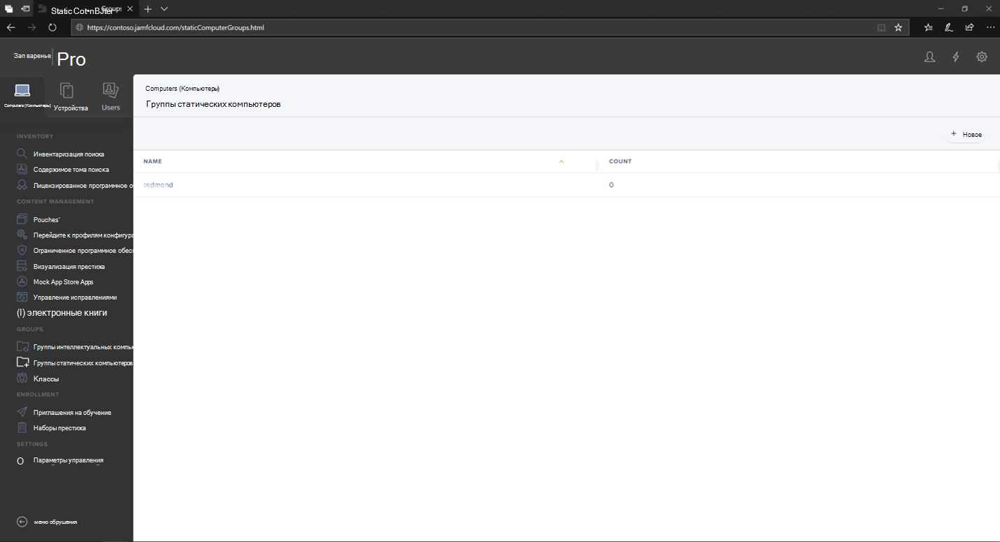
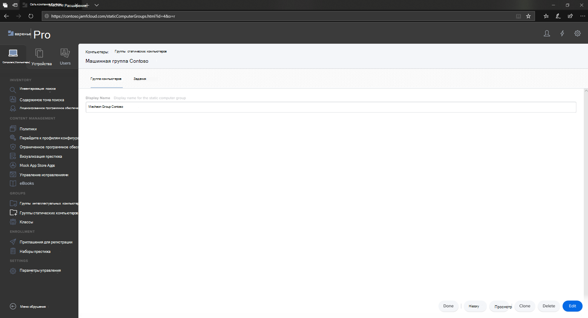
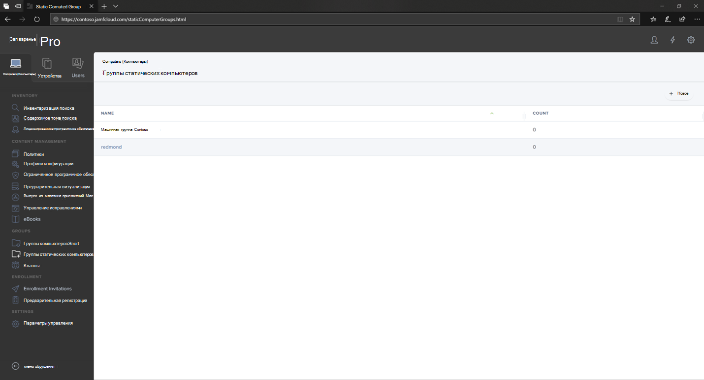

# Настройка Microsoft Defender для конечной точки для групп устройств macOS в Jamf Pro

[!INCLUDE [Microsoft 365 Defender rebranding](../../includes/microsoft-defender.md)]

**Область применения:**
- [Microsoft Defender для конечной точки](https://go.microsoft.com/fwlink/p/?linkid=2154037)
- [Microsoft 365 Defender](https://go.microsoft.com/fwlink/?linkid=2118804)

> Хотите испытать Defender для конечной точки? [Зарегистрився для бесплатной пробной.](https://www.microsoft.com/microsoft-365/windows/microsoft-defender-atp?ocid=docs-wdatp-investigateip-abovefoldlink)

Настройка групп устройств, аналогичных организационным группам групповой политики, коллекции устройств Microsoft Endpoint Configuration Manager и группам устройств Intune.

1. Перейдите к **статическим компьютерным группам.**

2. Выберите **New**. 

    

3. Укай имя дисплея и выберите **Сохранить**.

    

4. Теперь вы увидите компьютерную группу **Contoso** в статических **компьютерных группах.**

    

## Следующий шаг
- [Настройка Microsoft Defender для конечной точки для политик macOS в Jamf Pro](mac-jamfpro-policies.md)
