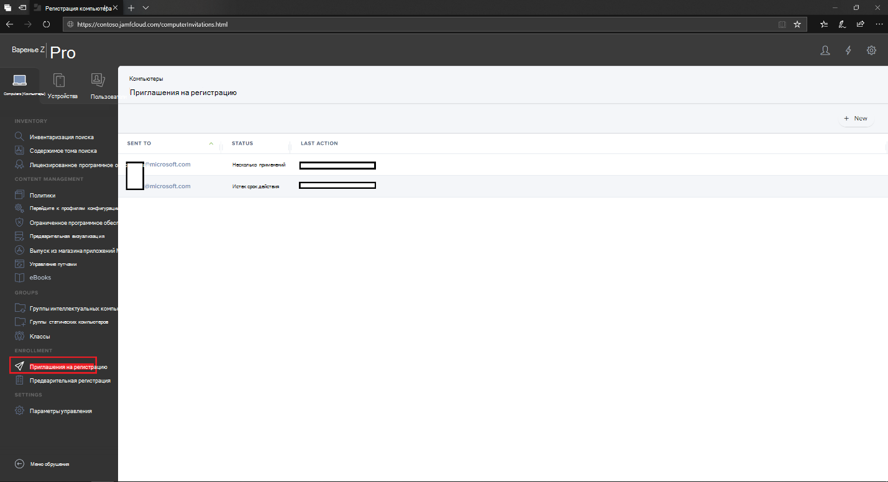
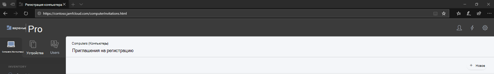
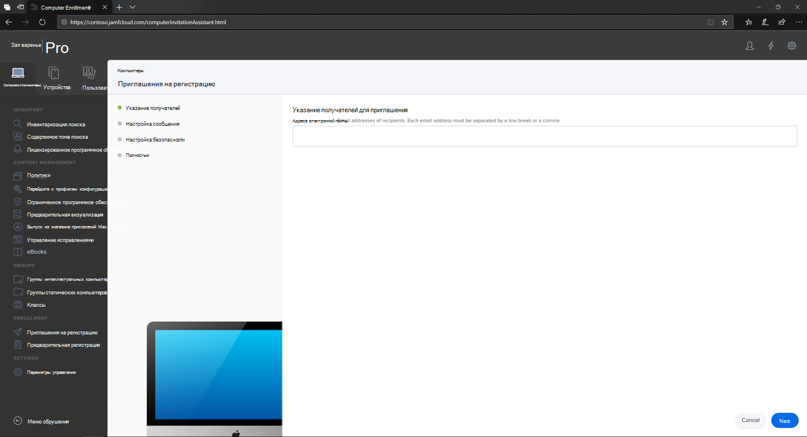
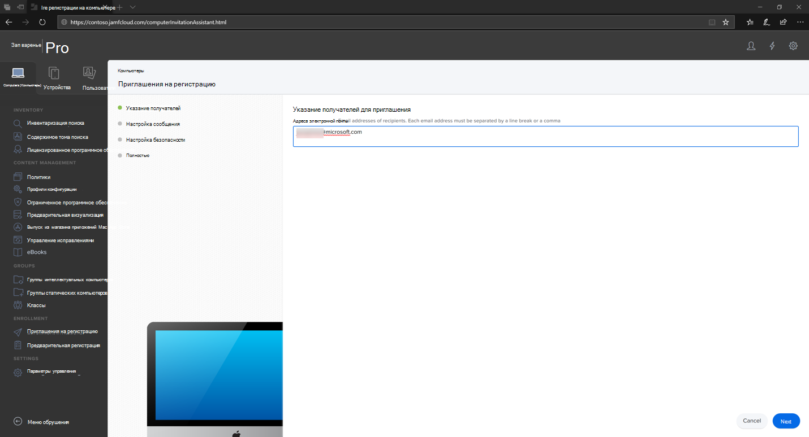
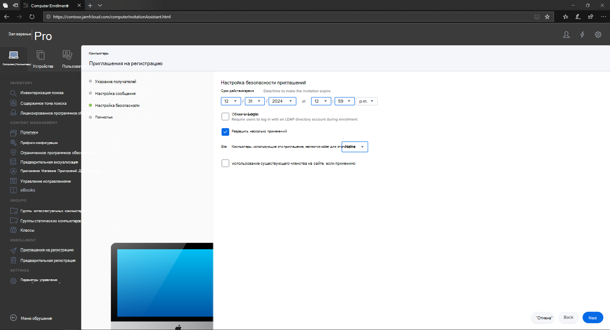
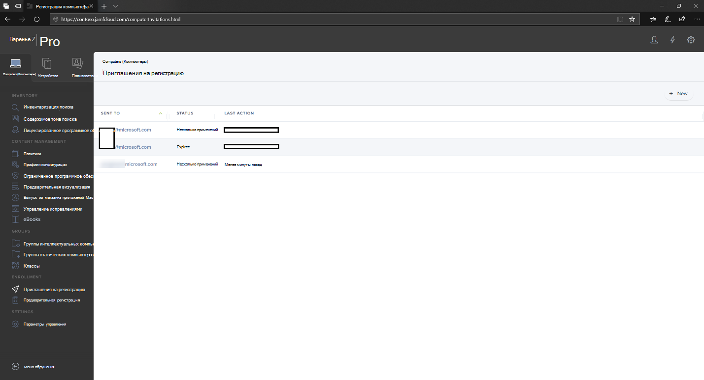
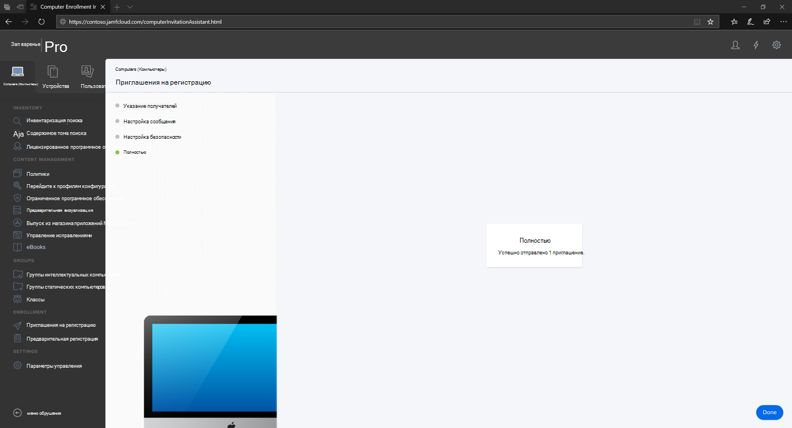
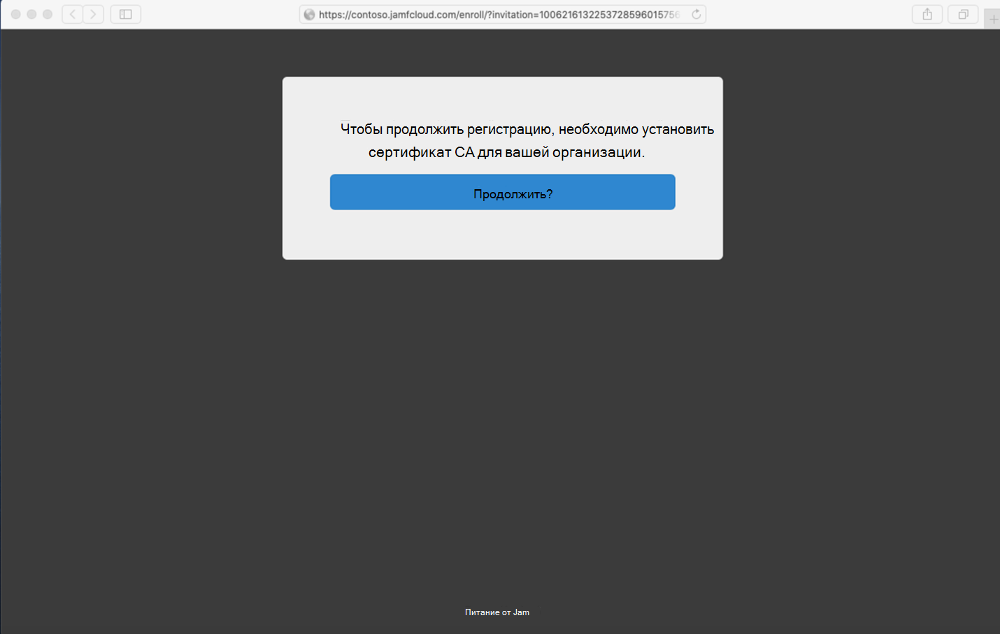
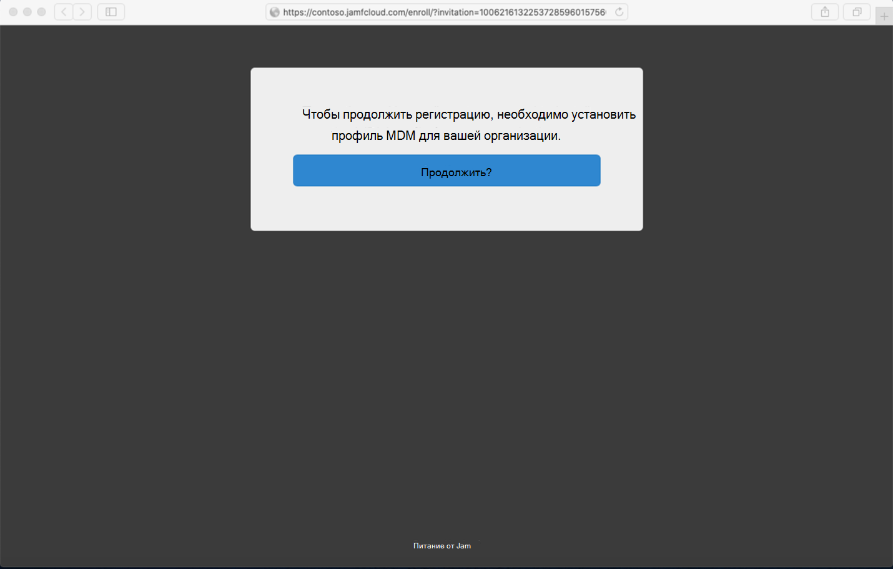
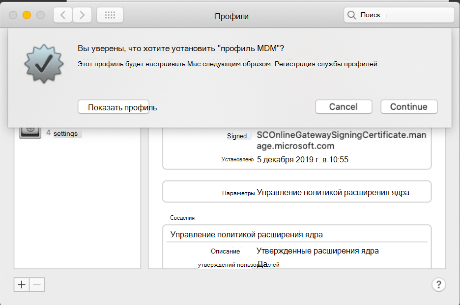

# Регистрация Microsoft Defender для конечной точки на устройствах macOS в Jamf ProEnroll Microsoft Defender for Endpoint on macOS devices into Jamf Pro 

[!INCLUDE [Microsoft 365 Defender rebranding](../../includes/microsoft-defender.md)]

**Область применения:****Applies to:**
- [Microsoft Defender для конечной точкиMicrosoft Defender for Endpoint](https://go.microsoft.com/fwlink/p/?linkid=2154037)
- [Microsoft 365 DefenderMicrosoft 365 Defender](https://go.microsoft.com/fwlink/?linkid=2118804)

> Хотите испытать Defender для конечной точки?Want to experience Defender for Endpoint? [Зарегистрився для бесплатной пробной.Sign up for a free trial.](https://www.microsoft.com/microsoft-365/windows/microsoft-defender-atp?ocid=docs-wdatp-investigateip-abovefoldlink)

## Регистрация устройств macOSEnroll macOS devices

Существует несколько методов регистрации в JamF.There are multiple methods of getting enrolled to JamF.

В этой статье вы сможете использовать два метода:This article will guide you on two methods:

- [Метод 1. Приглашения на регистрациюMethod 1:  Enrollment Invitations](#enrollment-method-1-enrollment-invitations)
- [Метод 2. Предварительная регистрацияMethod 2:  Prestage Enrollments](#enrollment-method-2-prestage-enrollments)

Полный список см. в [списке О регистрации на компьютере.](https://docs.jamf.com/9.9/casper-suite/administrator-guide/About_Computer_Enrollment.html)For a complete list, see [About Computer Enrollment](https://docs.jamf.com/9.9/casper-suite/administrator-guide/About_Computer_Enrollment.html).

## Метод регистрации 1. Приглашения на регистрациюEnrollment Method 1: Enrollment Invitations

1. В панели мониторинга Jamf Pro перейдите к **приглашениям для регистрации.**In the Jamf Pro dashboard, navigate to **Enrollment invitations**.

    

2. Выберите **+ Новый**.Select **+ New**.

    

3. В **указать получателей для** приглашения > **по** адресам электронной почты введите адрес электронной почты (es) получателей.In **Specify Recipients for the Invitation** > under **Email Addresses** enter the e-mail address(es) of the recipients.

    

    

    Например: janedoe@contoso.comFor example: janedoe@contoso.com

    

4. Настройка сообщения для приглашения.Configure the message for the invitation.

    

    

    

    

## Метод регистрации 2. Предварительная регистрацияEnrollment Method 2: Prestage Enrollments

1. В панели мониторинга Jamf Pro перейдите к **предварительной регистрации.**In the Jamf Pro dashboard, navigate to **Prestage enrollments**.

    

2. Следуйте инструкциям в [записях предварительного выполнения](https://docs.jamf.com/9.9/casper-suite/administrator-guide/Computer_PreStage_Enrollments.html)компьютера.Follow the instructions in [Computer PreStage Enrollments](https://docs.jamf.com/9.9/casper-suite/administrator-guide/Computer_PreStage_Enrollments.html).

## Регистрация устройства macOSEnroll macOS device

1. Выберите **Продолжить** и установить сертификат ЦС из окна **"Параметры системы".**Select **Continue** and install the CA certificate from a **System Preferences** window.

    

2. После установки сертификата CA вернись в окно браузера и выберите **Продолжить** и установить профиль MDM.Once CA certificate is installed, return to the browser window and select **Continue** and install the MDM profile. 

    

3. Выберите **Разрешить** скачивание из JAMF.Select **Allow** to downloads from JAMF.

    

4. Выберите **Продолжить** работу с установкой профиля MDM.Select **Continue** to proceed with the MDM Profile installation. 

    

5. Выберите **Продолжить** установку профиля MDM.Select **Continue** to install the MDM Profile.

    

6. Выберите **Продолжить**  для завершения конфигурации.Select **Continue**  to complete the configuration. 

    
