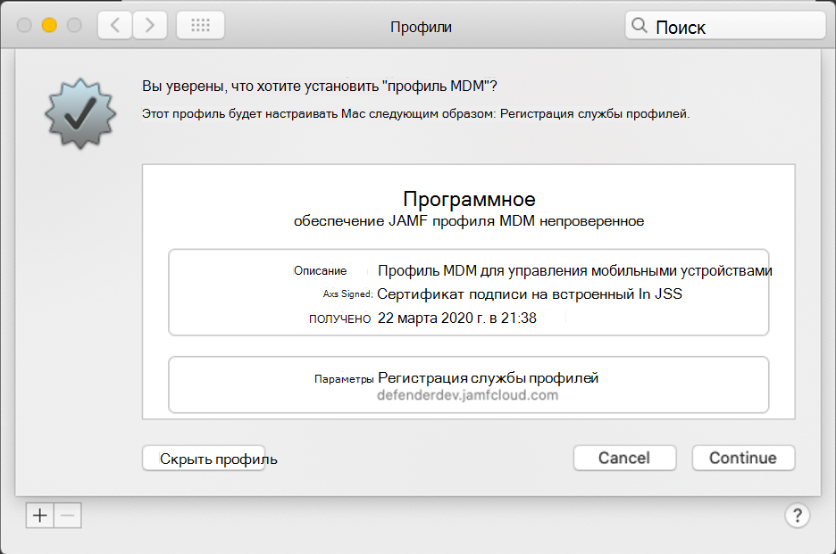
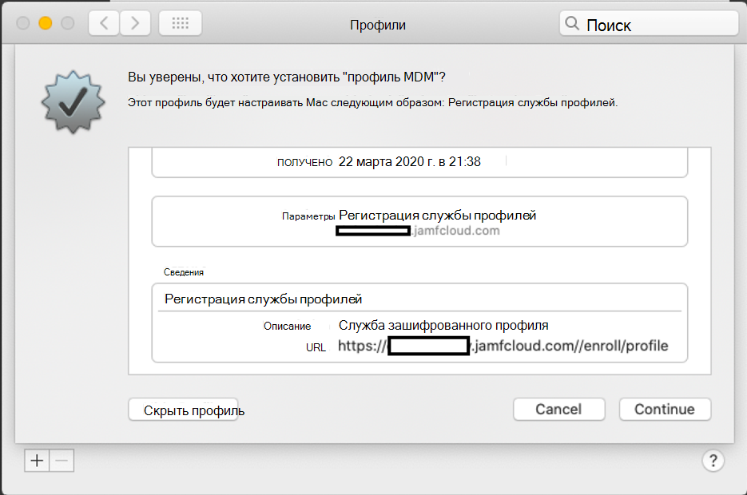

# Регистрация Microsoft Defender для конечной точки на устройствах macOS в Jamf Pro 

[!INCLUDE [Microsoft 365 Defender rebranding](../../includes/microsoft-defender.md)]

**Область применения:**
- [Microsoft Defender для конечной точки](https://go.microsoft.com/fwlink/p/?linkid=2154037)
- [Microsoft 365 Defender](https://go.microsoft.com/fwlink/?linkid=2118804)

> Хотите испытать Defender для конечной точки? [Зарегистрився для бесплатной пробной.](https://www.microsoft.com/microsoft-365/windows/microsoft-defender-atp?ocid=docs-wdatp-investigateip-abovefoldlink)

## Регистрация устройств macOS

Существует несколько методов регистрации в JamF.

В этой статье вы сможете использовать два метода:

- [Метод 1. Приглашения на регистрацию](#enrollment-method-1-enrollment-invitations)
- [Метод 2. Предварительная регистрация](#enrollment-method-2-prestage-enrollments)

Полный список см. в [списке О регистрации на компьютере.](https://docs.jamf.com/9.9/casper-suite/administrator-guide/About_Computer_Enrollment.html)

## Метод регистрации 1. Приглашения на регистрацию

1. В панели мониторинга Jamf Pro перейдите к **приглашениям для регистрации.**

    

2. Выберите **+ Новый**.

    

3. В **указать получателей для** приглашения > **по** адресам электронной почты введите адрес электронной почты (es) получателей.

    

    

    Например: janedoe@contoso.com

    

4. Настройка сообщения для приглашения.

    

    

    

    

## Метод регистрации 2. Предварительная регистрация

1. В панели мониторинга Jamf Pro перейдите к **предварительной регистрации.**

    

2. Следуйте инструкциям в [записях предварительного выполнения](https://docs.jamf.com/9.9/casper-suite/administrator-guide/Computer_PreStage_Enrollments.html)компьютера.

## Регистрация устройства macOS

1. Выберите **Продолжить** и установить сертификат ЦС из окна **"Параметры системы".**

    

2. После установки сертификата CA вернись в окно браузера и выберите **Продолжить** и установить профиль MDM. 

    

3. Выберите **Разрешить** скачивание из JAMF.

    

4. Выберите **Продолжить** работу с установкой профиля MDM. 

    

5. Выберите **Продолжить** установку профиля MDM.

    

6. Выберите **Продолжить**  для завершения конфигурации. 

    
