# <a name="set-up-the-microsoft-defender-for-endpoint-on-macos-policies-in-jamf-pro"></a><span data-ttu-id="c8de5-104">Настройка конечной точки Microsoft Defender для политик macOS в Jamf Pro</span><span class="sxs-lookup"><span data-stu-id="c8de5-104">Set up the Microsoft Defender for Endpoint on macOS policies in Jamf Pro</span></span>

[!INCLUDE [Microsoft 365 Defender rebranding](../../includes/microsoft-defender.md)]


<span data-ttu-id="c8de5-105">**Область применения:**</span><span class="sxs-lookup"><span data-stu-id="c8de5-105">**Applies to:**</span></span>

- [<span data-ttu-id="c8de5-106">Защитник для конечной точки на Mac</span><span class="sxs-lookup"><span data-stu-id="c8de5-106">Defender for Endpoint on Mac</span></span>](microsoft-defender-endpoint-mac.md)

<span data-ttu-id="c8de5-107">На этой странице вы сможете найти необходимые действия, чтобы настроить политики macOS в Jamf Pro.</span><span class="sxs-lookup"><span data-stu-id="c8de5-107">This page will guide you through the steps you need to take to set up macOS policies in Jamf Pro.</span></span>

<span data-ttu-id="c8de5-108">Необходимо предпринять следующие действия:</span><span class="sxs-lookup"><span data-stu-id="c8de5-108">You'll need to take the following steps:</span></span>

1. [<span data-ttu-id="c8de5-109">Получите пакет onboarding Microsoft Defender для конечной точки</span><span class="sxs-lookup"><span data-stu-id="c8de5-109">Get the Microsoft Defender for Endpoint onboarding package</span></span>](#step-1-get-the-microsoft-defender-for-endpoint-onboarding-package)

2. [<span data-ttu-id="c8de5-110">Создание профиля конфигурации в Jamf Pro с помощью бортового пакета</span><span class="sxs-lookup"><span data-stu-id="c8de5-110">Create a configuration profile in Jamf Pro using the onboarding package</span></span>](#step-2-create-a-configuration-profile-in-jamf-pro-using-the-onboarding-package)

3. [<span data-ttu-id="c8de5-111">Настройка параметров конечных точек Microsoft Defender</span><span class="sxs-lookup"><span data-stu-id="c8de5-111">Configure Microsoft Defender for Endpoint settings</span></span>](#step-3-configure-microsoft-defender-for-endpoint-settings)

4. [<span data-ttu-id="c8de5-112">Настройка параметров уведомлений Microsoft Defender для конечной точки</span><span class="sxs-lookup"><span data-stu-id="c8de5-112">Configure Microsoft Defender for Endpoint notification settings</span></span>](#step-4-configure-notifications-settings)

5. [<span data-ttu-id="c8de5-113">Настройка Microsoft AutoUpdate (MAU)</span><span class="sxs-lookup"><span data-stu-id="c8de5-113">Configure Microsoft AutoUpdate (MAU)</span></span>](#step-5-configure-microsoft-autoupdate-mau)

6. [<span data-ttu-id="c8de5-114">Предоставление полного доступа к диску Microsoft Defender для конечной точки</span><span class="sxs-lookup"><span data-stu-id="c8de5-114">Grant full disk access to Microsoft Defender for Endpoint</span></span>](#step-6-grant-full-disk-access-to-microsoft-defender-for-endpoint)

7. [<span data-ttu-id="c8de5-115">Утверждение расширения ядра для Microsoft Defender для конечной точки</span><span class="sxs-lookup"><span data-stu-id="c8de5-115">Approve Kernel extension for Microsoft Defender for Endpoint</span></span>](#step-7-approve-kernel-extension-for-microsoft-defender-for-endpoint)

8. [<span data-ttu-id="c8de5-116">Утверждение расширений системы для Microsoft Defender для конечной точки</span><span class="sxs-lookup"><span data-stu-id="c8de5-116">Approve System extensions for Microsoft Defender for Endpoint</span></span>](#step-8-approve-system-extensions-for-microsoft-defender-for-endpoint)

9. [<span data-ttu-id="c8de5-117">Настройка расширения сети</span><span class="sxs-lookup"><span data-stu-id="c8de5-117">Configure Network Extension</span></span>](#step-9-configure-network-extension)

10. [<span data-ttu-id="c8de5-118">Расписание сканирования с помощью Microsoft Defender для конечной точки на macOS</span><span class="sxs-lookup"><span data-stu-id="c8de5-118">Schedule scans with Microsoft Defender for Endpoint on macOS</span></span>](https://docs.microsoft.com/windows/security/threat-protection/microsoft-defender-atp/mac-schedule-scan-atp)

11. [<span data-ttu-id="c8de5-119">Развертывание Microsoft Defender для конечной точки на macOS</span><span class="sxs-lookup"><span data-stu-id="c8de5-119">Deploy Microsoft Defender for Endpoint on macOS</span></span>](#step-11-deploy-microsoft-defender-for-endpoint-on-macos)


## <a name="step-1-get-the-microsoft-defender-for-endpoint-onboarding-package"></a><span data-ttu-id="c8de5-120">Шаг 1. Получить пакет onboarding Microsoft Defender для конечной точки</span><span class="sxs-lookup"><span data-stu-id="c8de5-120">Step 1: Get the Microsoft Defender for Endpoint onboarding package</span></span>

1. <span data-ttu-id="c8de5-121">В [Центре безопасности Защитника Майкрософт](https://securitycenter.microsoft.com )перейдите к **параметрам > onboarding**.</span><span class="sxs-lookup"><span data-stu-id="c8de5-121">In [Microsoft Defender Security Center](https://securitycenter.microsoft.com ), navigate to **Settings > Onboarding**.</span></span> 

2. <span data-ttu-id="c8de5-122">Выберите macOS в качестве операционной системы, а метод развертывания — управление мобильными устройствами и Microsoft Intune.</span><span class="sxs-lookup"><span data-stu-id="c8de5-122">Select macOS as the operating system and Mobile Device Management / Microsoft Intune as the deployment method.</span></span>

    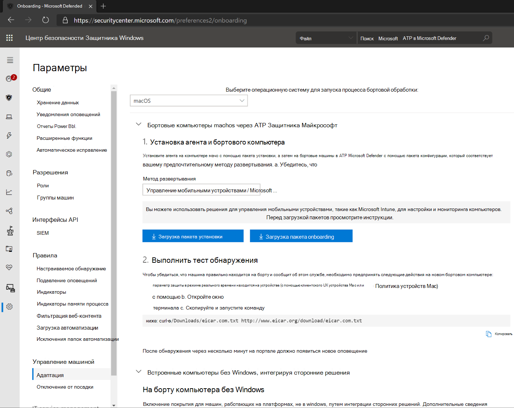

3. <span data-ttu-id="c8de5-124">Выберите **пакет загрузки** (WindowsDefenderATPOnboardingPackage.zip).</span><span class="sxs-lookup"><span data-stu-id="c8de5-124">Select **Download onboarding package** (WindowsDefenderATPOnboardingPackage.zip).</span></span>

4. <span data-ttu-id="c8de5-125">`WindowsDefenderATPOnboardingPackage.zip`Извлечение .</span><span class="sxs-lookup"><span data-stu-id="c8de5-125">Extract `WindowsDefenderATPOnboardingPackage.zip`.</span></span>

5. <span data-ttu-id="c8de5-126">Скопируйте файл в предпочтительное расположение.</span><span class="sxs-lookup"><span data-stu-id="c8de5-126">Copy the file to your preferred location.</span></span> <span data-ttu-id="c8de5-127">Пример: `C:\Users\JaneDoe_or_JohnDoe.contoso\Downloads\WindowsDefenderATPOnboardingPackage_macOS_MDM_contoso\jamf\WindowsDefenderATPOnboarding.plist`.</span><span class="sxs-lookup"><span data-stu-id="c8de5-127">For example,  `C:\Users\JaneDoe_or_JohnDoe.contoso\Downloads\WindowsDefenderATPOnboardingPackage_macOS_MDM_contoso\jamf\WindowsDefenderATPOnboarding.plist`.</span></span>


## <a name="step-2-create-a-configuration-profile-in-jamf-pro-using-the-onboarding-package"></a><span data-ttu-id="c8de5-128">Шаг 2. Создание профиля конфигурации в Jamf Pro с помощью пакета onboarding</span><span class="sxs-lookup"><span data-stu-id="c8de5-128">Step 2: Create a configuration profile in Jamf Pro using the onboarding package</span></span>

1. <span data-ttu-id="c8de5-129">Найдите файл `WindowsDefenderATPOnboarding.plist` из предыдущего раздела.</span><span class="sxs-lookup"><span data-stu-id="c8de5-129">Locate the file `WindowsDefenderATPOnboarding.plist` from the previous section.</span></span>

   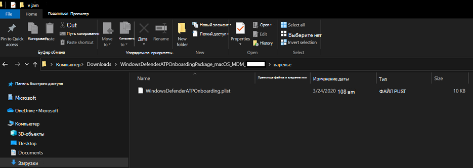

 
2. <span data-ttu-id="c8de5-131">В панели мониторинга Jamf Pro выберите **New**.</span><span class="sxs-lookup"><span data-stu-id="c8de5-131">In the Jamf Pro dashboard, select **New**.</span></span>

    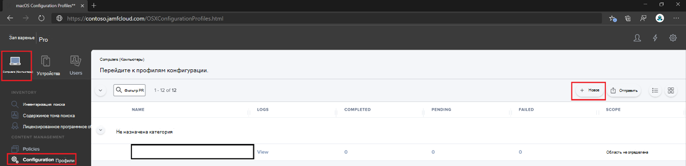

3. <span data-ttu-id="c8de5-133">Введите следующие сведения:</span><span class="sxs-lookup"><span data-stu-id="c8de5-133">Enter the following details:</span></span>

   <span data-ttu-id="c8de5-134">**Общие**</span><span class="sxs-lookup"><span data-stu-id="c8de5-134">**General**</span></span>
   - <span data-ttu-id="c8de5-135">Имя: бортовая система MDATP для macOS</span><span class="sxs-lookup"><span data-stu-id="c8de5-135">Name: MDATP onboarding for macOS</span></span>
   - <span data-ttu-id="c8de5-136">Описание. Бортовая система MDATP EDR для macOS</span><span class="sxs-lookup"><span data-stu-id="c8de5-136">Description: MDATP EDR onboarding for macOS</span></span>
   - <span data-ttu-id="c8de5-137">Категории: None (нет)</span><span class="sxs-lookup"><span data-stu-id="c8de5-137">Category: None</span></span>
   - <span data-ttu-id="c8de5-138">Метод рассылки: установка автоматически</span><span class="sxs-lookup"><span data-stu-id="c8de5-138">Distribution Method: Install Automatically</span></span>
   - <span data-ttu-id="c8de5-139">Уровень: уровень компьютера</span><span class="sxs-lookup"><span data-stu-id="c8de5-139">Level: Computer Level</span></span>

4. <span data-ttu-id="c8de5-140">В **приложении & настраиваемые параметры** выберите **Настройка**.</span><span class="sxs-lookup"><span data-stu-id="c8de5-140">In **Application & Custom Settings** select **Configure**.</span></span>

    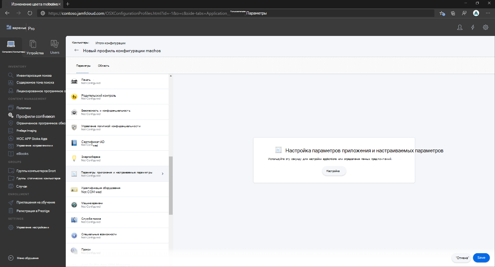

5. <span data-ttu-id="c8de5-142">Выберите **Файл загрузки (PLIST-файл),** а затем **введите домен preference:** `com.microsoft.wdav.atp` .</span><span class="sxs-lookup"><span data-stu-id="c8de5-142">Select **Upload File (PLIST file)** then in **Preference Domain** enter: `com.microsoft.wdav.atp`.</span></span> 

    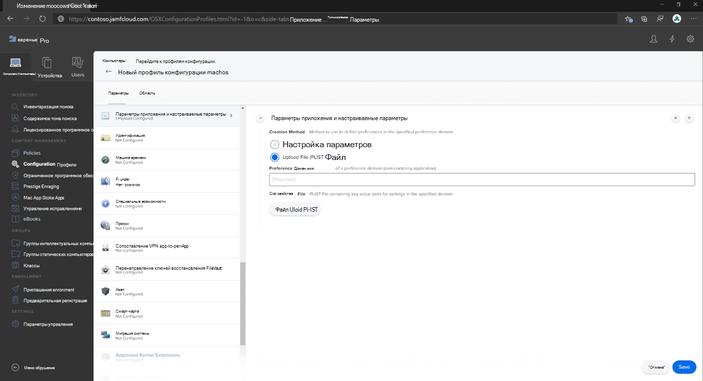

    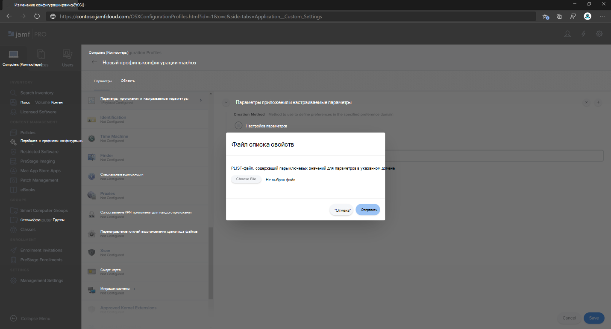

7. <span data-ttu-id="c8de5-145">Выберите **Открыть** и выбрать файл вмеяния.</span><span class="sxs-lookup"><span data-stu-id="c8de5-145">Select **Open** and select the onboarding file.</span></span>

    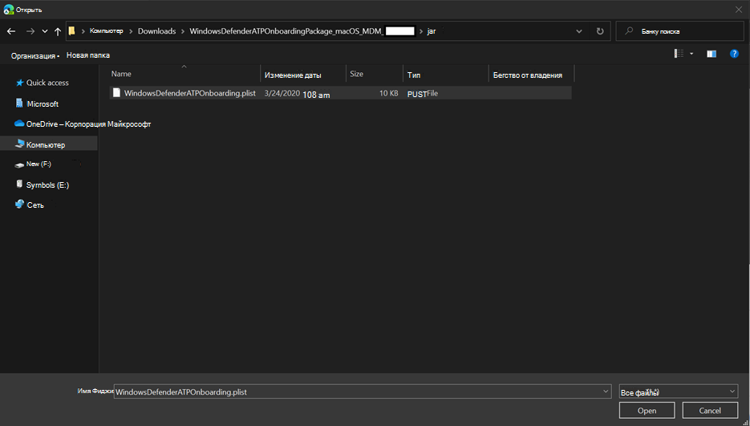

8. <span data-ttu-id="c8de5-147">Выберите **Upload**.</span><span class="sxs-lookup"><span data-stu-id="c8de5-147">Select **Upload**.</span></span> 

    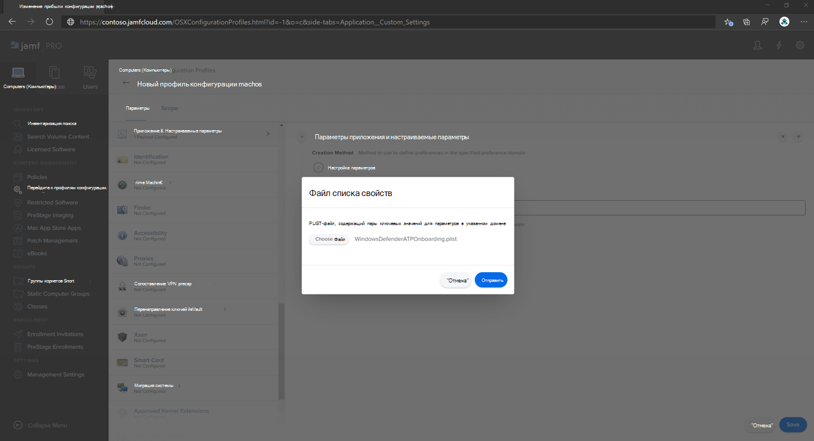


9. <span data-ttu-id="c8de5-149">Выберите **вкладку Область.**</span><span class="sxs-lookup"><span data-stu-id="c8de5-149">Select the **Scope** tab.</span></span>

    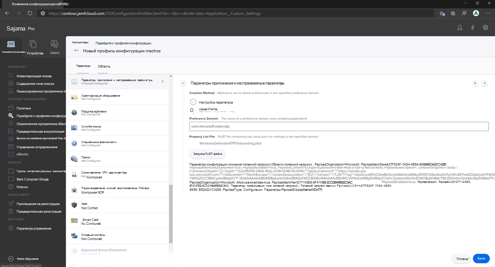

10. <span data-ttu-id="c8de5-151">Выберите целевые компьютеры.</span><span class="sxs-lookup"><span data-stu-id="c8de5-151">Select the target computers.</span></span>

    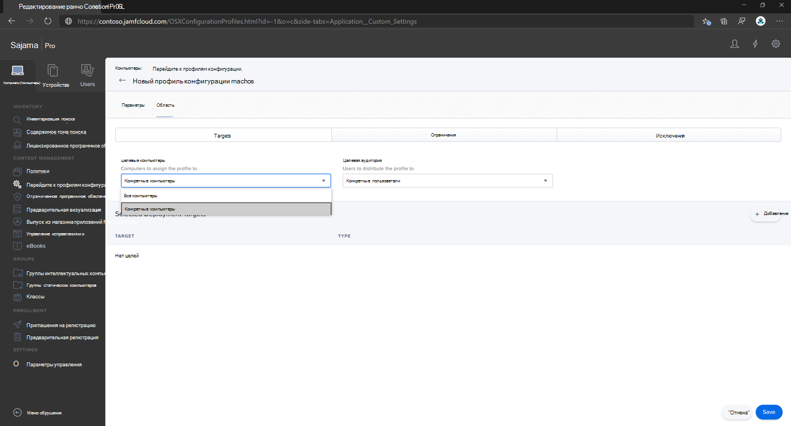

    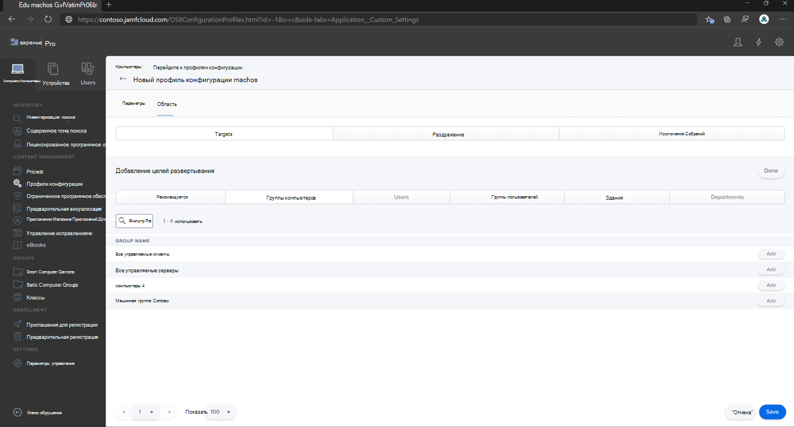 

11. <span data-ttu-id="c8de5-154">Нажмите **Сохранить**.</span><span class="sxs-lookup"><span data-stu-id="c8de5-154">Select **Save**.</span></span>

    

    

12. <span data-ttu-id="c8de5-157">Нажмите кнопку **Готово**.</span><span class="sxs-lookup"><span data-stu-id="c8de5-157">Select **Done**.</span></span>

    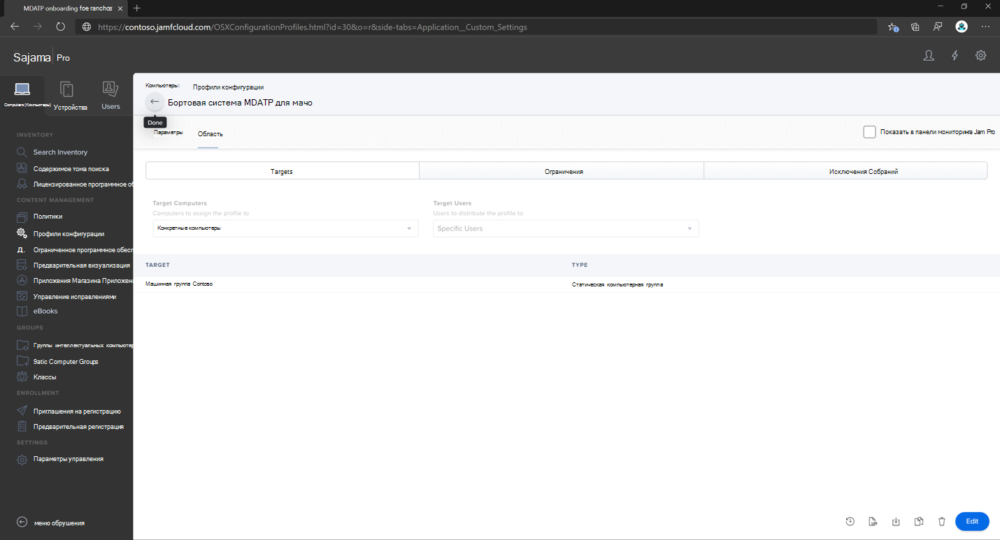

    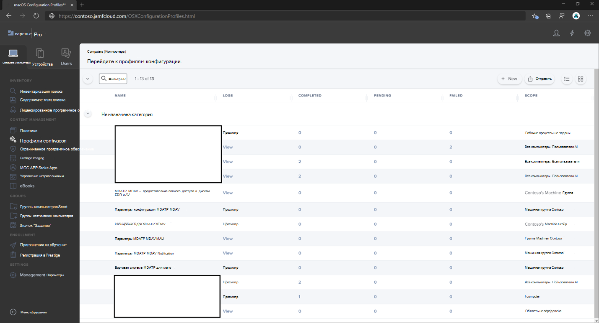

## <a name="step-3-configure-microsoft-defender-for-endpoint-settings"></a><span data-ttu-id="c8de5-160">Шаг 3. Настройка защитника Майкрософт для параметров конечной точки</span><span class="sxs-lookup"><span data-stu-id="c8de5-160">Step 3: Configure Microsoft Defender for Endpoint settings</span></span>

1.  <span data-ttu-id="c8de5-161">Используйте следующие параметры конфигурации Microsoft Defender для конечных точек:</span><span class="sxs-lookup"><span data-stu-id="c8de5-161">Use the following Microsoft Defender for Endpoint configuration settings:</span></span>

    - <span data-ttu-id="c8de5-162">enableRealTimeProtection</span><span class="sxs-lookup"><span data-stu-id="c8de5-162">enableRealTimeProtection</span></span>
    - <span data-ttu-id="c8de5-163">passiveMode</span><span class="sxs-lookup"><span data-stu-id="c8de5-163">passiveMode</span></span>
    
    >[!NOTE]
    ><span data-ttu-id="c8de5-164">Не включено по умолчанию, если вы планируете запустить сторонний AV для macOS, установите `true` его.</span><span class="sxs-lookup"><span data-stu-id="c8de5-164">Not turned on by default, if you are planning to run a third-party AV for macOS, set it to `true`.</span></span>

    - <span data-ttu-id="c8de5-165">исключения</span><span class="sxs-lookup"><span data-stu-id="c8de5-165">exclusions</span></span>
    - <span data-ttu-id="c8de5-166">excludedPath</span><span class="sxs-lookup"><span data-stu-id="c8de5-166">excludedPath</span></span>
    - <span data-ttu-id="c8de5-167">excludedFileExtension</span><span class="sxs-lookup"><span data-stu-id="c8de5-167">excludedFileExtension</span></span>
    - <span data-ttu-id="c8de5-168">excludedFileName</span><span class="sxs-lookup"><span data-stu-id="c8de5-168">excludedFileName</span></span>
    - <span data-ttu-id="c8de5-169">exclusionsMergePolicy</span><span class="sxs-lookup"><span data-stu-id="c8de5-169">exclusionsMergePolicy</span></span>
    - <span data-ttu-id="c8de5-170">allowedThreats</span><span class="sxs-lookup"><span data-stu-id="c8de5-170">allowedThreats</span></span>
    
    >[!NOTE]
    ><span data-ttu-id="c8de5-171">EICAR находится в примере, если вы проходите проверку концепции, удалите ее, особенно если вы тестируете EICAR.</span><span class="sxs-lookup"><span data-stu-id="c8de5-171">EICAR is on the sample, if you are going through a proof-of-concept, remove it especially if you are testing EICAR.</span></span>
        
    - <span data-ttu-id="c8de5-172">disallowedThreatActions</span><span class="sxs-lookup"><span data-stu-id="c8de5-172">disallowedThreatActions</span></span>
    - <span data-ttu-id="c8de5-173">potentially_unwanted_application</span><span class="sxs-lookup"><span data-stu-id="c8de5-173">potentially_unwanted_application</span></span>
    - <span data-ttu-id="c8de5-174">archive_bomb</span><span class="sxs-lookup"><span data-stu-id="c8de5-174">archive_bomb</span></span>
    - <span data-ttu-id="c8de5-175">cloudService</span><span class="sxs-lookup"><span data-stu-id="c8de5-175">cloudService</span></span>
    - <span data-ttu-id="c8de5-176">automaticSampleSubmission</span><span class="sxs-lookup"><span data-stu-id="c8de5-176">automaticSampleSubmission</span></span>
    - <span data-ttu-id="c8de5-177">tags</span><span class="sxs-lookup"><span data-stu-id="c8de5-177">tags</span></span>
    - <span data-ttu-id="c8de5-178">hideStatusMenuIcon</span><span class="sxs-lookup"><span data-stu-id="c8de5-178">hideStatusMenuIcon</span></span>
    
     <span data-ttu-id="c8de5-179">Сведения см. в [списке свойств для профиля конфигурации Jamf.](mac-preferences.md#property-list-for-jamf-configuration-profile)</span><span class="sxs-lookup"><span data-stu-id="c8de5-179">For information, see [Property list for Jamf configuration profile](mac-preferences.md#property-list-for-jamf-configuration-profile).</span></span>

     ```XML
     <?xml version="1.0" encoding="UTF-8"?>
     <!DOCTYPE plist PUBLIC "-//Apple//DTD PLIST 1.0//EN" "http://www.apple.com/DTDs/PropertyList-1.0.dtd">
     <plist version="1.0">
     <dict>
         <key>antivirusEngine</key>
         <dict>
             <key>enableRealTimeProtection</key>
             <true/>
             <key>passiveMode</key>
             <false/>
             <key>exclusions</key>
             <array>
                 <dict>
                     <key>$type</key>
                     <string>excludedPath</string>
                     <key>isDirectory</key>
                     <false/>
                     <key>path</key>
                     <string>/var/log/system.log</string>
                 </dict>
                 <dict>
                     <key>$type</key>
                     <string>excludedPath</string>
                     <key>isDirectory</key>
                     <true/>
                     <key>path</key>
                     <string>/home</string>
                 </dict>
                 <dict>
                     <key>$type</key>
                     <string>excludedFileExtension</string>
                     <key>extension</key>
                     <string>pdf</string>
                 </dict>
                 <dict>
                     <key>$type</key>
                     <string>excludedFileName</string>
                     <key>name</key>
                     <string>cat</string>
                 </dict>
             </array>
             <key>exclusionsMergePolicy</key>
             <string>merge</string>
             <key>allowedThreats</key>
             <array>
                 <string>EICAR-Test-File (not a virus)</string>
             </array>
             <key>disallowedThreatActions</key>
             <array>
                 <string>allow</string>
                 <string>restore</string>
             </array>
             <key>threatTypeSettings</key>
             <array>
                 <dict>
                     <key>key</key>
                     <string>potentially_unwanted_application</string>
                     <key>value</key>
                     <string>block</string>
                 </dict>
                 <dict>
                     <key>key</key>
                     <string>archive_bomb</string>
                     <key>value</key>
                     <string>audit</string>
                 </dict>
             </array>
             <key>threatTypeSettingsMergePolicy</key>
             <string>merge</string>
         </dict>
         <key>cloudService</key>
         <dict>
             <key>enabled</key>
             <true/>
             <key>diagnosticLevel</key>
             <string>optional</string>
             <key>automaticSampleSubmission</key>
             <true/>
         </dict>
         <key>edr</key>
         <dict>
             <key>tags</key>
             <array>
                 <dict>
                     <key>key</key>
                     <string>GROUP</string>
                     <key>value</key>
                     <string>ExampleTag</string>
                 </dict>
             </array>
         </dict>
         <key>userInterface</key>
         <dict>
             <key>hideStatusMenuIcon</key>
             <false/>
         </dict>
     </dict>
     </plist>
     ```

2. <span data-ttu-id="c8de5-180">Сохраните файл как `MDATP_MDAV_configuration_settings.plist` .</span><span class="sxs-lookup"><span data-stu-id="c8de5-180">Save the file as `MDATP_MDAV_configuration_settings.plist`.</span></span>


3.  <span data-ttu-id="c8de5-181">В панели мониторинга Jamf Pro выберите **General**.</span><span class="sxs-lookup"><span data-stu-id="c8de5-181">In the Jamf Pro dashboard, select **General**.</span></span>

    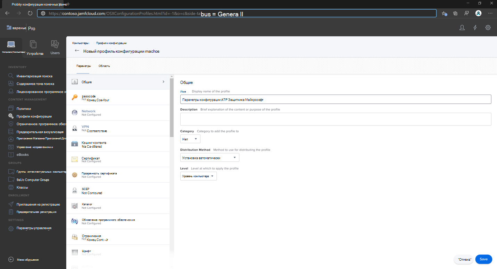

4. <span data-ttu-id="c8de5-183">Введите следующие сведения:</span><span class="sxs-lookup"><span data-stu-id="c8de5-183">Enter the following details:</span></span>

    <span data-ttu-id="c8de5-184">**Общие**</span><span class="sxs-lookup"><span data-stu-id="c8de5-184">**General**</span></span>
    
    - <span data-ttu-id="c8de5-185">Имя: параметры конфигурации MDATP MDAV</span><span class="sxs-lookup"><span data-stu-id="c8de5-185">Name: MDATP MDAV configuration settings</span></span>
    - <span data-ttu-id="c8de5-186">Описание:\<blank\></span><span class="sxs-lookup"><span data-stu-id="c8de5-186">Description:\<blank\></span></span>
    - <span data-ttu-id="c8de5-187">Категория: Нет (по умолчанию)</span><span class="sxs-lookup"><span data-stu-id="c8de5-187">Category: None (default)</span></span>
    - <span data-ttu-id="c8de5-188">Метод рассылки: установка автоматически (по умолчанию)</span><span class="sxs-lookup"><span data-stu-id="c8de5-188">Distribution Method: Install Automatically(default)</span></span>
    - <span data-ttu-id="c8de5-189">Уровень: уровень компьютера (по умолчанию)</span><span class="sxs-lookup"><span data-stu-id="c8de5-189">Level: Computer Level(default)</span></span>

    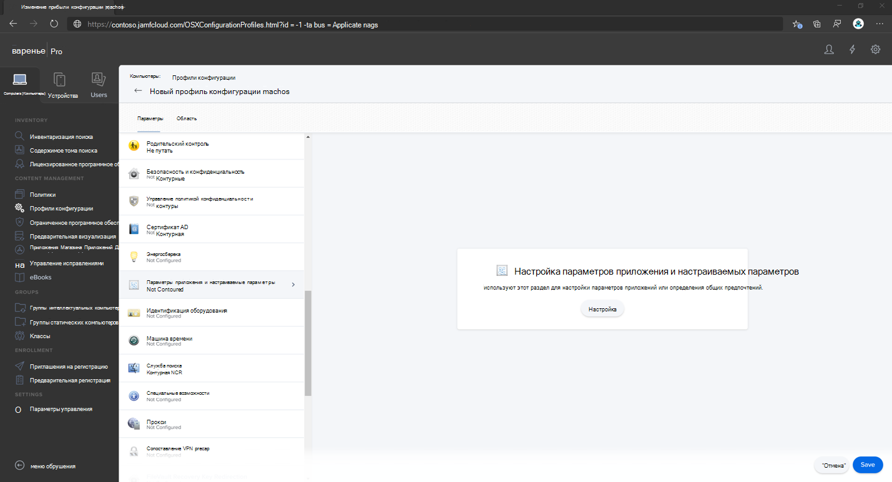

5. <span data-ttu-id="c8de5-191">В **приложении & настраиваемые параметры** выберите **Настройка**.</span><span class="sxs-lookup"><span data-stu-id="c8de5-191">In **Application & Custom Settings** select **Configure**.</span></span>

    

6. <span data-ttu-id="c8de5-193">Выберите **файл загрузки (PLIST-файл).**</span><span class="sxs-lookup"><span data-stu-id="c8de5-193">Select **Upload File (PLIST file)**.</span></span>

    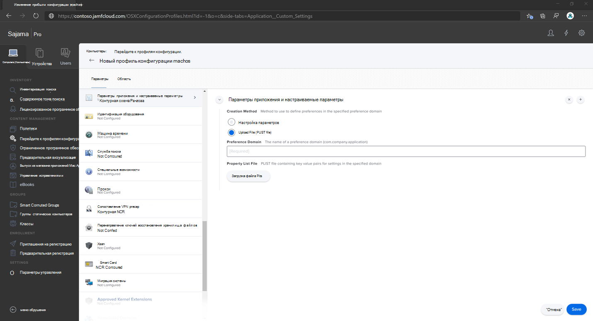

7. <span data-ttu-id="c8de5-195">В **домене Preferences введите,** `com.microsoft.wdav` а затем выберите Файл  **загрузки PLIST**.</span><span class="sxs-lookup"><span data-stu-id="c8de5-195">In **Preferences Domain**, enter `com.microsoft.wdav`, then select  **Upload PLIST File**.</span></span>

    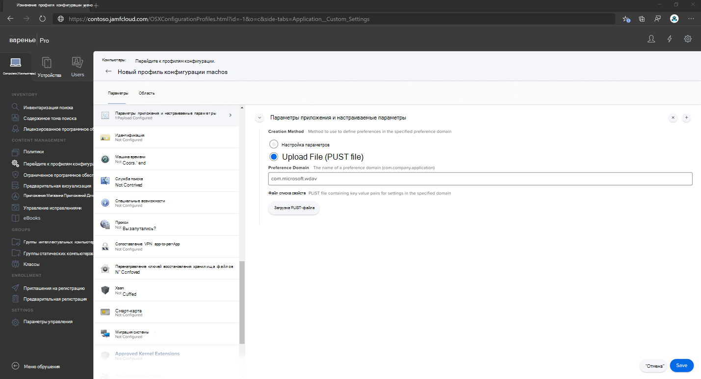

8. <span data-ttu-id="c8de5-197">Выберите **выберите файл**.</span><span class="sxs-lookup"><span data-stu-id="c8de5-197">Select **Choose File**.</span></span>

    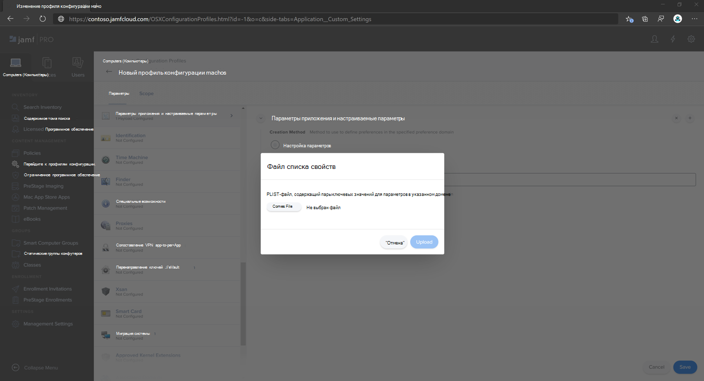

9. <span data-ttu-id="c8de5-199">Выберите **список MDATP_MDAV_configuration_settings.plist,** а затем **откройте**.</span><span class="sxs-lookup"><span data-stu-id="c8de5-199">Select the **MDATP_MDAV_configuration_settings.plist**, then select **Open**.</span></span>

    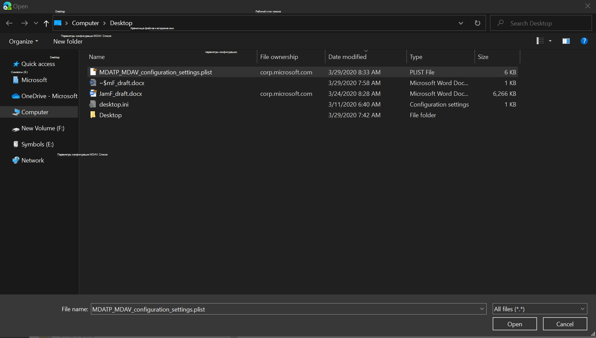

10. <span data-ttu-id="c8de5-201">Выберите **Upload**.</span><span class="sxs-lookup"><span data-stu-id="c8de5-201">Select **Upload**.</span></span>

    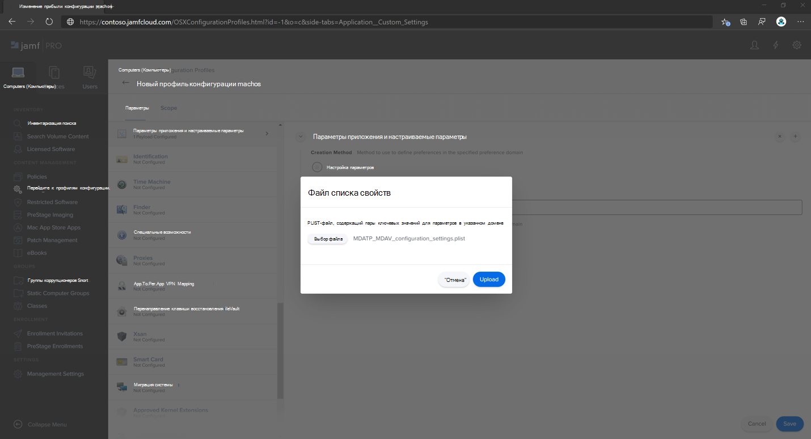

    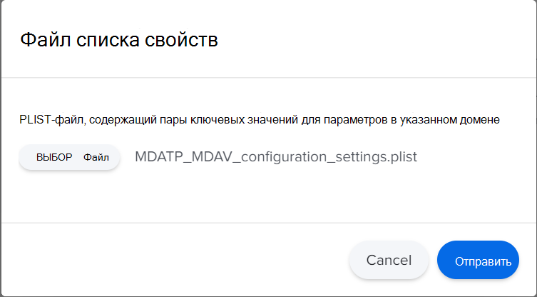

    >[!NOTE]
    ><span data-ttu-id="c8de5-204">Если вы загрузите файл Intune, вы получите следующую ошибку:</span><span class="sxs-lookup"><span data-stu-id="c8de5-204">If you happen to upload the Intune file, you'll get the following error:</span></span><br>
    ><span data-ttu-id="c8de5-205">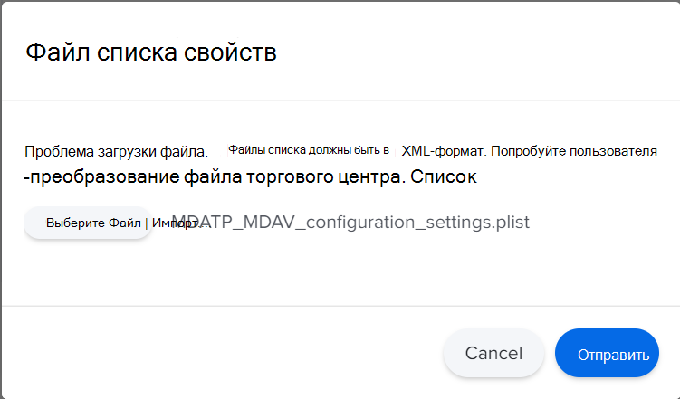</span><span class="sxs-lookup"><span data-stu-id="c8de5-205"></span></span>


11. <span data-ttu-id="c8de5-206">Нажмите **Сохранить**.</span><span class="sxs-lookup"><span data-stu-id="c8de5-206">Select **Save**.</span></span> 

    

12. <span data-ttu-id="c8de5-208">Файл загружен.</span><span class="sxs-lookup"><span data-stu-id="c8de5-208">The file is uploaded.</span></span>

    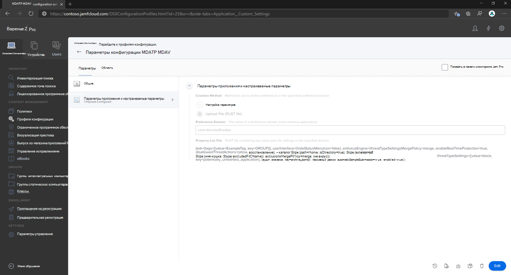

    

13. <span data-ttu-id="c8de5-211">Выберите **вкладку Область.**</span><span class="sxs-lookup"><span data-stu-id="c8de5-211">Select the **Scope** tab.</span></span>

    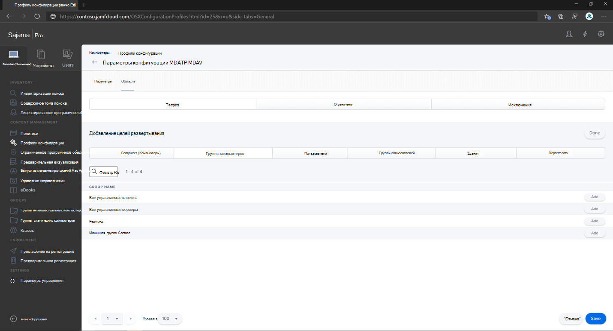

14. <span data-ttu-id="c8de5-213">Выберите **машинную группу Contoso.**</span><span class="sxs-lookup"><span data-stu-id="c8de5-213">Select **Contoso's Machine Group**.</span></span> 

15. <span data-ttu-id="c8de5-214">Выберите **Добавить,** а затем **выберите Сохранить**.</span><span class="sxs-lookup"><span data-stu-id="c8de5-214">Select **Add**, then select **Save**.</span></span>

    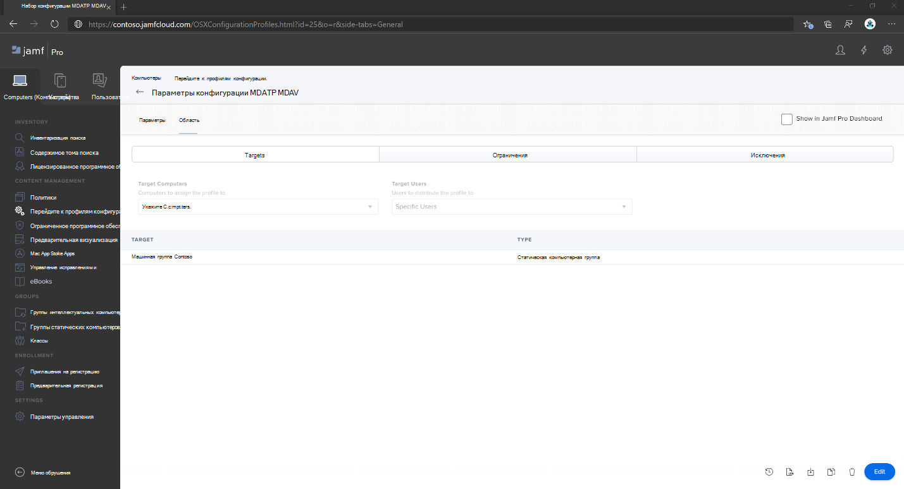

    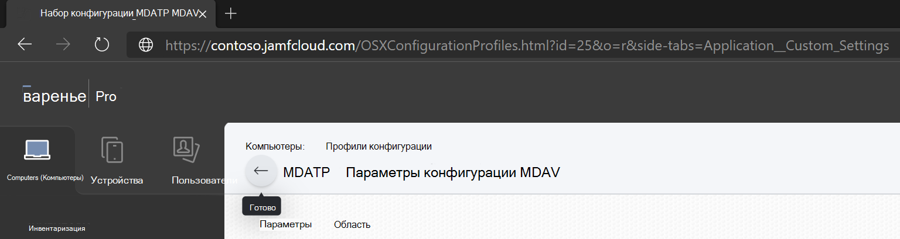

16. <span data-ttu-id="c8de5-217">Нажмите кнопку **Готово**.</span><span class="sxs-lookup"><span data-stu-id="c8de5-217">Select **Done**.</span></span> <span data-ttu-id="c8de5-218">Вы увидите новый профиль **Конфигурация**.</span><span class="sxs-lookup"><span data-stu-id="c8de5-218">You'll see the new **Configuration profile**.</span></span>

    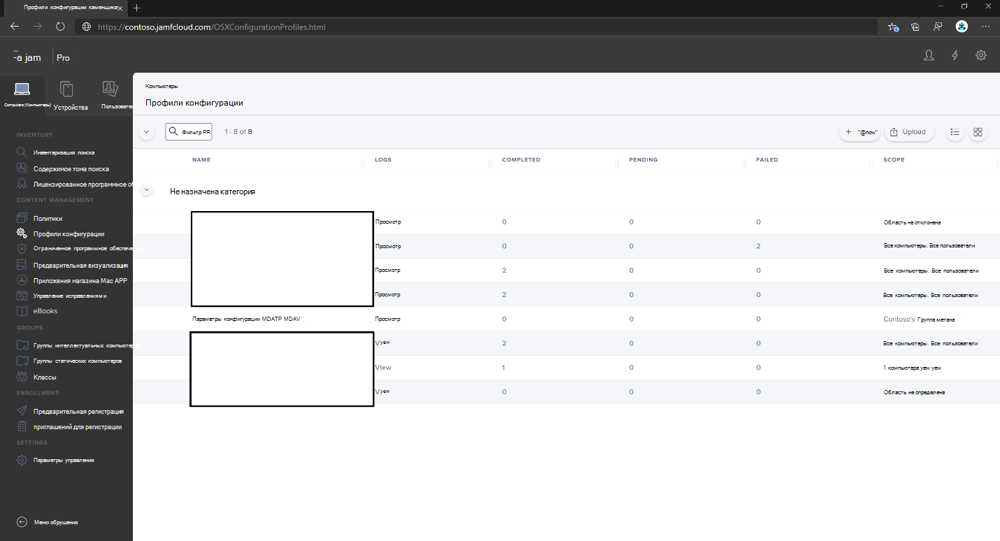


## <a name="step-4-configure-notifications-settings"></a><span data-ttu-id="c8de5-220">Шаг 4. Настройка параметров уведомлений</span><span class="sxs-lookup"><span data-stu-id="c8de5-220">Step 4: Configure notifications settings</span></span>

<span data-ttu-id="c8de5-221">Эти действия применимы к macOS 10.15 (Catalina) или более новым.</span><span class="sxs-lookup"><span data-stu-id="c8de5-221">These steps are applicable of macOS 10.15 (Catalina) or newer.</span></span>

1. <span data-ttu-id="c8de5-222">В панели мониторинга Jamf Pro выберите **компьютеры,** а затем **профили конфигурации.**</span><span class="sxs-lookup"><span data-stu-id="c8de5-222">In the Jamf Pro dashboard, select **Computers**, then **Configuration Profiles**.</span></span>

2. <span data-ttu-id="c8de5-223">Нажмите **кнопку New** и введите следующие сведения для **Параметры**:</span><span class="sxs-lookup"><span data-stu-id="c8de5-223">Click **New**, and enter the following details for **Options**:</span></span>
    
    - <span data-ttu-id="c8de5-224">Tab **General:**</span><span class="sxs-lookup"><span data-stu-id="c8de5-224">Tab **General**:</span></span> 
        - <span data-ttu-id="c8de5-225">**Имя:** параметры MDATP MDAV Notification</span><span class="sxs-lookup"><span data-stu-id="c8de5-225">**Name**: MDATP MDAV Notification settings</span></span>
        - <span data-ttu-id="c8de5-226">**Описание:** macOS 10.15 (Catalina) или более новый</span><span class="sxs-lookup"><span data-stu-id="c8de5-226">**Description**: macOS 10.15 (Catalina) or newer</span></span>
        - <span data-ttu-id="c8de5-227">**Категория:** Нет *(по умолчанию)*</span><span class="sxs-lookup"><span data-stu-id="c8de5-227">**Category**: None *(default)*</span></span>
        - <span data-ttu-id="c8de5-228">**Метод рассылки:** Установка автоматически *(по умолчанию)*</span><span class="sxs-lookup"><span data-stu-id="c8de5-228">**Distribution Method**: Install Automatically *(default)*</span></span>
        - <span data-ttu-id="c8de5-229">**Уровень**: Уровень компьютера *(по умолчанию)*</span><span class="sxs-lookup"><span data-stu-id="c8de5-229">**Level**: Computer Level *(default)*</span></span>

        

    - <span data-ttu-id="c8de5-231">Tab **Notifications,** **нажмите кнопку Добавить** и введите следующие значения:</span><span class="sxs-lookup"><span data-stu-id="c8de5-231">Tab **Notifications**, click **Add**, and enter the following values:</span></span>
        - <span data-ttu-id="c8de5-232">**Bundle ID:**`com.microsoft.wdav.tray`</span><span class="sxs-lookup"><span data-stu-id="c8de5-232">**Bundle ID**: `com.microsoft.wdav.tray`</span></span>
        - <span data-ttu-id="c8de5-233">**Критические оповещения:** нажмите **кнопку Отключение**</span><span class="sxs-lookup"><span data-stu-id="c8de5-233">**Critical Alerts**: Click **Disable**</span></span>
        - <span data-ttu-id="c8de5-234">**Уведомления:** щелкните **Включить**</span><span class="sxs-lookup"><span data-stu-id="c8de5-234">**Notifications**: Click **Enable**</span></span>
        - <span data-ttu-id="c8de5-235">**Тип оповещения баннера:** **Выберите включить и** временно **(по** *умолчанию)*</span><span class="sxs-lookup"><span data-stu-id="c8de5-235">**Banner alert type**: Select **Include** and **Temporary** *(default)*</span></span>
        - <span data-ttu-id="c8de5-236">**Уведомления на экране блокировки:** нажмите кнопку **Скрыть**</span><span class="sxs-lookup"><span data-stu-id="c8de5-236">**Notifications on lock screen**: Click **Hide**</span></span>
        - <span data-ttu-id="c8de5-237">**Уведомления в Центре уведомлений:** щелкните **отображение**</span><span class="sxs-lookup"><span data-stu-id="c8de5-237">**Notifications in Notification Center**: Click **Display**</span></span>
        - <span data-ttu-id="c8de5-238">**Значок приложения Badge:** Щелкните **Дисплей**</span><span class="sxs-lookup"><span data-stu-id="c8de5-238">**Badge app icon**: Click **Display**</span></span>

        

    - <span data-ttu-id="c8de5-240">Tab **Notifications**, **щелкните Добавить** еще раз, прокрутите вниз **к новым настройкам уведомлений**</span><span class="sxs-lookup"><span data-stu-id="c8de5-240">Tab **Notifications**, click **Add** one more time, scroll down to **New Notifications Settings**</span></span>
        - <span data-ttu-id="c8de5-241">**Bundle ID:**`com.microsoft.autoupdate2`</span><span class="sxs-lookup"><span data-stu-id="c8de5-241">**Bundle ID**: `com.microsoft.autoupdate2`</span></span>
        - <span data-ttu-id="c8de5-242">Настройка остальных параметров на те же значения, что и выше</span><span class="sxs-lookup"><span data-stu-id="c8de5-242">Configure the rest of the settings to the same values as above</span></span>

        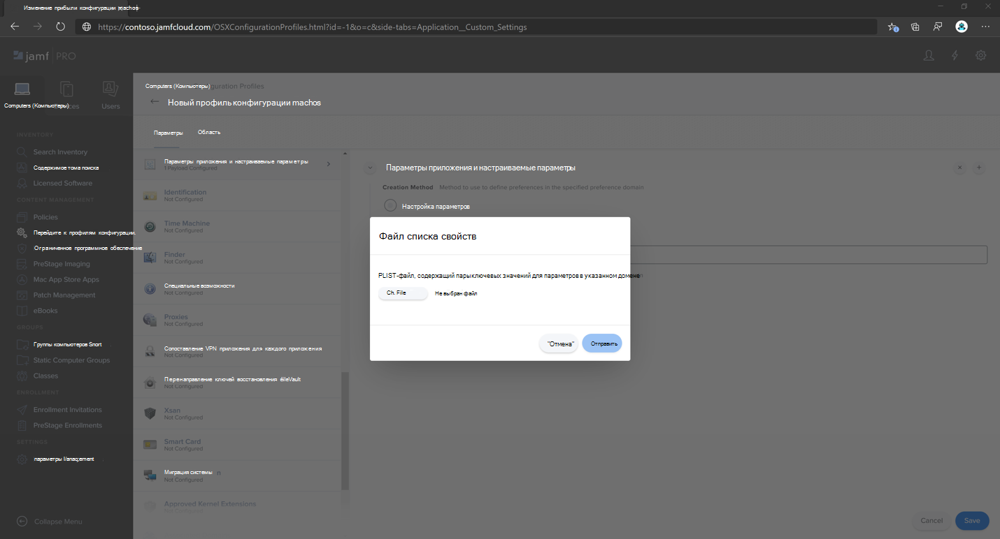

        <span data-ttu-id="c8de5-244">Обратите внимание, что теперь у вас есть две "таблицы" с конфигурациями уведомлений, одна для bundle **ID: com.microsoft.wdav.tray** и другая для **Bundle ID: com.microsoft.autoupdate2**.</span><span class="sxs-lookup"><span data-stu-id="c8de5-244">Note that now you have two 'tables' with notification configurations, one for **Bundle ID: com.microsoft.wdav.tray**, and another for **Bundle ID: com.microsoft.autoupdate2**.</span></span> <span data-ttu-id="c8de5-245">Хотя вы можете настроить параметры оповещения в зависимости от ваших требований, набор ID должен быть точно таким же, как описано ранее, и **включить** переключатель должен быть **включен** для **уведомлений**.</span><span class="sxs-lookup"><span data-stu-id="c8de5-245">While you can configure alert settings per your requirements, Bundle IDs must be exactly the same as described before, and **Include** switch must be **On** for **Notifications**.</span></span>

3. <span data-ttu-id="c8de5-246">Выберите **вкладку Область,** а **затем** добавьте .</span><span class="sxs-lookup"><span data-stu-id="c8de5-246">Select the **Scope** tab, then select **Add**.</span></span>

    

4. <span data-ttu-id="c8de5-248">Выберите **машинную группу Contoso.**</span><span class="sxs-lookup"><span data-stu-id="c8de5-248">Select **Contoso's Machine Group**.</span></span> 

5. <span data-ttu-id="c8de5-249">Выберите **Добавить,** а затем **выберите Сохранить**.</span><span class="sxs-lookup"><span data-stu-id="c8de5-249">Select **Add**, then select **Save**.</span></span>
    
    
    
    

6. <span data-ttu-id="c8de5-252">Нажмите кнопку **Готово**.</span><span class="sxs-lookup"><span data-stu-id="c8de5-252">Select **Done**.</span></span> <span data-ttu-id="c8de5-253">Вы увидите новый профиль **Конфигурация**.</span><span class="sxs-lookup"><span data-stu-id="c8de5-253">You'll see the new **Configuration profile**.</span></span>
    <span data-ttu-id="c8de5-254">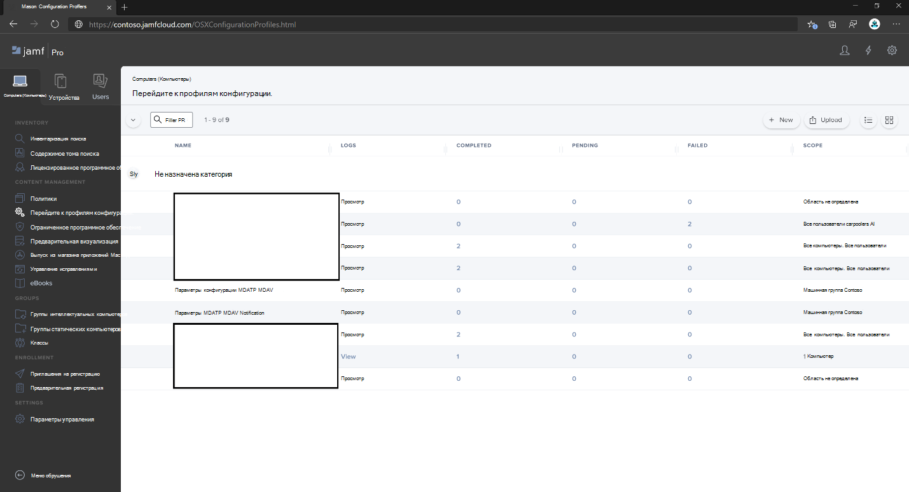</span><span class="sxs-lookup"><span data-stu-id="c8de5-254"></span></span>

## <a name="step-5-configure-microsoft-autoupdate-mau"></a><span data-ttu-id="c8de5-255">Шаг 5. Настройка Microsoft AutoUpdate (MAU)</span><span class="sxs-lookup"><span data-stu-id="c8de5-255">Step 5: Configure Microsoft AutoUpdate (MAU)</span></span>

1. <span data-ttu-id="c8de5-256">Используйте следующие параметры конфигурации Microsoft Defender для конечных точек:</span><span class="sxs-lookup"><span data-stu-id="c8de5-256">Use the following Microsoft Defender for Endpoint configuration settings:</span></span>

      ```XML
   <?xml version="1.0" encoding="UTF-8"?>
   <!DOCTYPE plist PUBLIC "-//Apple//DTD PLIST 1.0//EN" "http://www.apple.com/DTDs/PropertyList-1.0.dtd">
   <plist version="1.0">
   <dict>
    <key>ChannelName</key>
    <string>Current</string>
    <key>HowToCheck</key>
    <string>AutomaticDownload</string>
    <key>EnableCheckForUpdatesButton</key>
    <true/>
    <key>DisableInsiderCheckbox</key>
    <false/>
    <key>SendAllTelemetryEnabled</key>
    <true/>
   </dict>
   </plist>
   ```

2. <span data-ttu-id="c8de5-257">Сохраните его как `MDATP_MDAV_MAU_settings.plist` .</span><span class="sxs-lookup"><span data-stu-id="c8de5-257">Save it as `MDATP_MDAV_MAU_settings.plist`.</span></span>

3. <span data-ttu-id="c8de5-258">В панели мониторинга Jamf Pro выберите **General**.</span><span class="sxs-lookup"><span data-stu-id="c8de5-258">In the Jamf Pro dashboard, select **General**.</span></span> 

    

4. <span data-ttu-id="c8de5-260">Введите следующие сведения:</span><span class="sxs-lookup"><span data-stu-id="c8de5-260">Enter the following details:</span></span>

    <span data-ttu-id="c8de5-261">**Общие**</span><span class="sxs-lookup"><span data-stu-id="c8de5-261">**General**</span></span> 
    
    - <span data-ttu-id="c8de5-262">Имя: параметры MDATP MDAV MAU</span><span class="sxs-lookup"><span data-stu-id="c8de5-262">Name: MDATP MDAV MAU settings</span></span>
    - <span data-ttu-id="c8de5-263">Описание. Параметры Microsoft AutoUpdate для MDATP для macOS</span><span class="sxs-lookup"><span data-stu-id="c8de5-263">Description: Microsoft AutoUpdate settings for MDATP for macOS</span></span>
    - <span data-ttu-id="c8de5-264">Категория: Нет (по умолчанию)</span><span class="sxs-lookup"><span data-stu-id="c8de5-264">Category: None (default)</span></span>
    - <span data-ttu-id="c8de5-265">Метод рассылки: установка автоматически (по умолчанию)</span><span class="sxs-lookup"><span data-stu-id="c8de5-265">Distribution Method: Install Automatically(default)</span></span>
    - <span data-ttu-id="c8de5-266">Уровень: уровень компьютера (по умолчанию)</span><span class="sxs-lookup"><span data-stu-id="c8de5-266">Level: Computer Level(default)</span></span>

5. <span data-ttu-id="c8de5-267">В **приложении & настраиваемые параметры** выберите **Настройка**.</span><span class="sxs-lookup"><span data-stu-id="c8de5-267">In **Application & Custom Settings** select **Configure**.</span></span>

    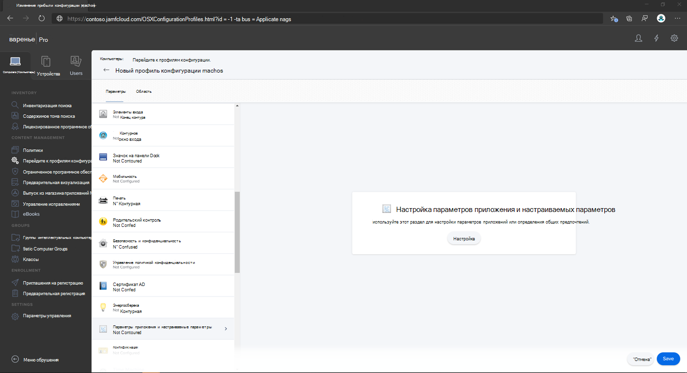

6. <span data-ttu-id="c8de5-269">Выберите **файл загрузки (PLIST-файл).**</span><span class="sxs-lookup"><span data-stu-id="c8de5-269">Select **Upload File (PLIST file)**.</span></span>

      

7. <span data-ttu-id="c8de5-271">В **домене Preference** введите: `com.microsoft.autoupdate2` затем выберите Файл **загрузки PLIST.**</span><span class="sxs-lookup"><span data-stu-id="c8de5-271">In **Preference Domain** enter: `com.microsoft.autoupdate2`, then select **Upload PLIST File**.</span></span>

    

8. <span data-ttu-id="c8de5-273">Выберите **выберите файл**.</span><span class="sxs-lookup"><span data-stu-id="c8de5-273">Select **Choose File**.</span></span>

    

9. <span data-ttu-id="c8de5-275">Выберите **MDATP_MDAV_MAU_settings.plist**.</span><span class="sxs-lookup"><span data-stu-id="c8de5-275">Select **MDATP_MDAV_MAU_settings.plist**.</span></span>

    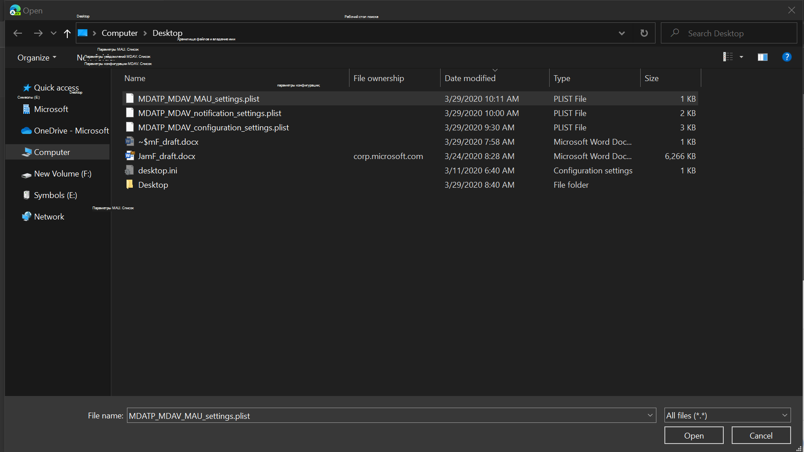

10. <span data-ttu-id="c8de5-277">Выберите **Upload**.</span><span class="sxs-lookup"><span data-stu-id="c8de5-277">Select **Upload**.</span></span>
    <span data-ttu-id="c8de5-278">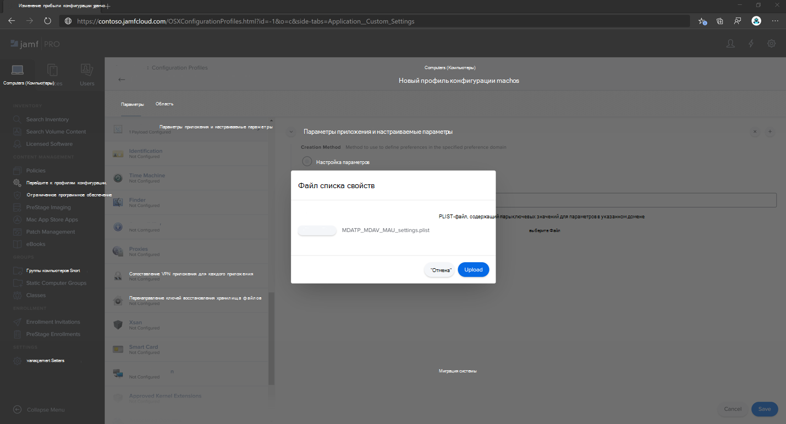</span><span class="sxs-lookup"><span data-stu-id="c8de5-278"></span></span>

    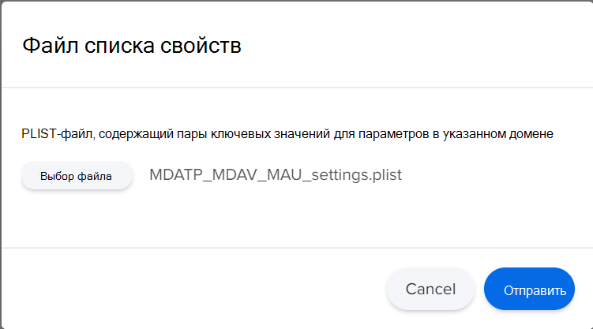

11. <span data-ttu-id="c8de5-280">Нажмите **Сохранить**.</span><span class="sxs-lookup"><span data-stu-id="c8de5-280">Select **Save**.</span></span>

    

12. <span data-ttu-id="c8de5-282">Выберите **вкладку Область.**</span><span class="sxs-lookup"><span data-stu-id="c8de5-282">Select the **Scope** tab.</span></span>
   
     

13. <span data-ttu-id="c8de5-284">Нажмите кнопку **Добавить**.</span><span class="sxs-lookup"><span data-stu-id="c8de5-284">Select **Add**.</span></span>
    
    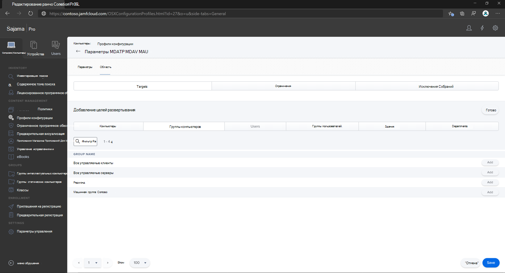

    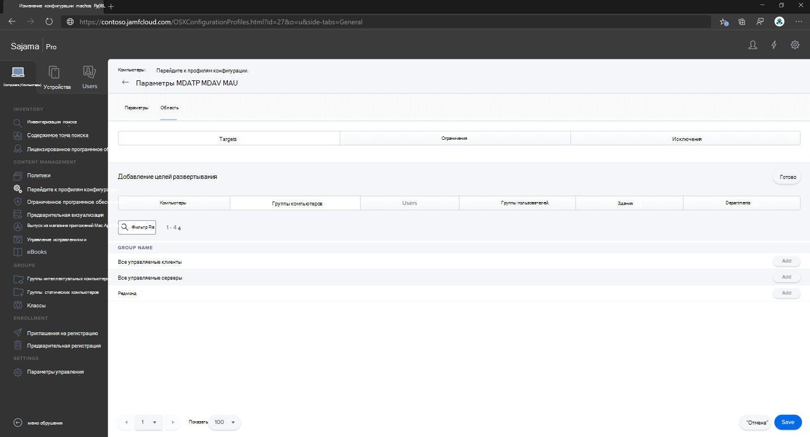

    

14. <span data-ttu-id="c8de5-288">Нажмите кнопку **Готово**.</span><span class="sxs-lookup"><span data-stu-id="c8de5-288">Select **Done**.</span></span>
    
    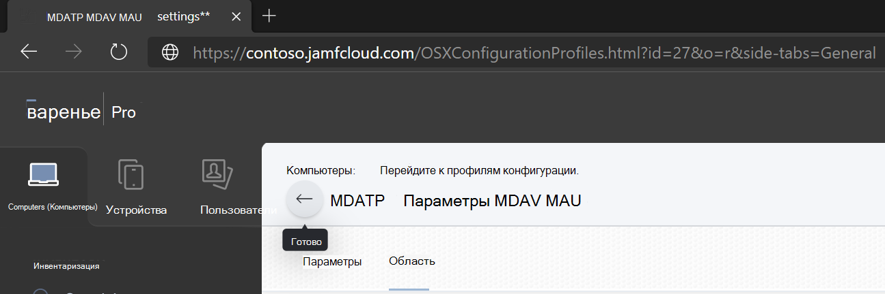

## <a name="step-6-grant-full-disk-access-to-microsoft-defender-for-endpoint"></a><span data-ttu-id="c8de5-290">Шаг 6. Предоставление полного доступа к диску Microsoft Defender для конечной точки</span><span class="sxs-lookup"><span data-stu-id="c8de5-290">Step 6: Grant full disk access to Microsoft Defender for Endpoint</span></span>

1. <span data-ttu-id="c8de5-291">В панели мониторинга Jamf Pro выберите **профили конфигурации.**</span><span class="sxs-lookup"><span data-stu-id="c8de5-291">In the Jamf Pro dashboard, select **Configuration Profiles**.</span></span>

    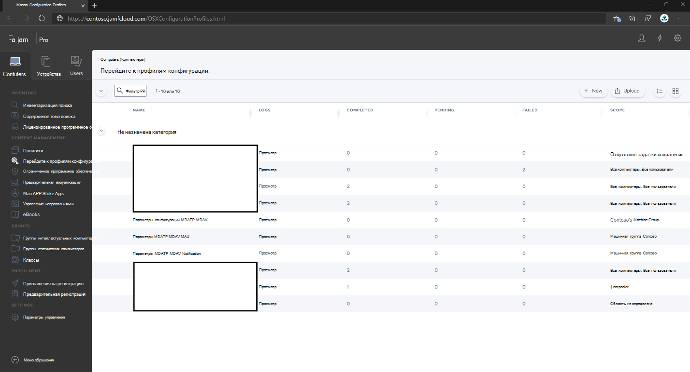

2. <span data-ttu-id="c8de5-293">Выберите **+ Новый**.</span><span class="sxs-lookup"><span data-stu-id="c8de5-293">Select **+ New**.</span></span> 

3. <span data-ttu-id="c8de5-294">Введите следующие сведения:</span><span class="sxs-lookup"><span data-stu-id="c8de5-294">Enter the following details:</span></span>

    <span data-ttu-id="c8de5-295">**Общие**</span><span class="sxs-lookup"><span data-stu-id="c8de5-295">**General**</span></span> 
    - <span data-ttu-id="c8de5-296">Имя: MDATP MDAV — предоставление полного доступа к диску EDR и AV</span><span class="sxs-lookup"><span data-stu-id="c8de5-296">Name: MDATP MDAV - grant Full Disk Access to EDR and AV</span></span>
    - <span data-ttu-id="c8de5-297">Описание. Для macOS Catalina или более нового управления политикой конфиденциальности</span><span class="sxs-lookup"><span data-stu-id="c8de5-297">Description: On macOS Catalina or newer, the new Privacy Preferences Policy Control</span></span>
    - <span data-ttu-id="c8de5-298">Категории: None (нет)</span><span class="sxs-lookup"><span data-stu-id="c8de5-298">Category: None</span></span>
    - <span data-ttu-id="c8de5-299">Метод рассылки: установка автоматически</span><span class="sxs-lookup"><span data-stu-id="c8de5-299">Distribution method: Install Automatically</span></span>
    - <span data-ttu-id="c8de5-300">Уровень: уровень компьютера</span><span class="sxs-lookup"><span data-stu-id="c8de5-300">Level: Computer level</span></span>


    

4. <span data-ttu-id="c8de5-302">В **Настройка политики настройки предпочтений конфиденциальности выберите** **Настройка**.</span><span class="sxs-lookup"><span data-stu-id="c8de5-302">In **Configure Privacy Preferences Policy Control** select **Configure**.</span></span>

    

5. <span data-ttu-id="c8de5-304">В правилах управления **политиками конфиденциальности** введите следующие сведения:</span><span class="sxs-lookup"><span data-stu-id="c8de5-304">In **Privacy Preferences Policy Control**, enter the following details:</span></span>

    - <span data-ttu-id="c8de5-305">Идентификатор: `com.microsoft.wdav`</span><span class="sxs-lookup"><span data-stu-id="c8de5-305">Identifier: `com.microsoft.wdav`</span></span>
    - <span data-ttu-id="c8de5-306">Тип идентификатора: идентификатор пакета</span><span class="sxs-lookup"><span data-stu-id="c8de5-306">Identifier Type: Bundle ID</span></span>
    - <span data-ttu-id="c8de5-307">Требование кода: `identifier "com.microsoft.wdav" and anchor apple generic and certificate 1[field.1.2.840.113635.100.6.2.6] /* exists */ and certificate leaf[field.1.2.840.113635.100.6.1.13] /* exists */ and certificate leaf[subject.OU] = UBF8T346G9`</span><span class="sxs-lookup"><span data-stu-id="c8de5-307">Code Requirement: `identifier "com.microsoft.wdav" and anchor apple generic and certificate 1[field.1.2.840.113635.100.6.2.6] /* exists */ and certificate leaf[field.1.2.840.113635.100.6.1.13] /* exists */ and certificate leaf[subject.OU] = UBF8T346G9`</span></span>


    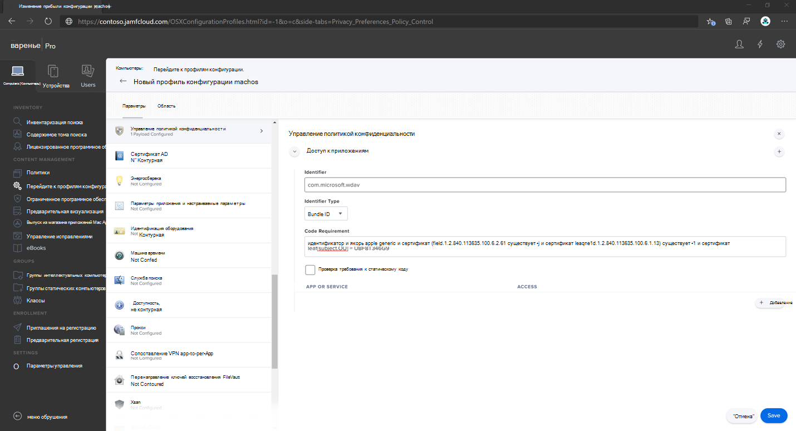

6. <span data-ttu-id="c8de5-309">Выберите **+ Добавить**.</span><span class="sxs-lookup"><span data-stu-id="c8de5-309">Select **+ Add**.</span></span>

    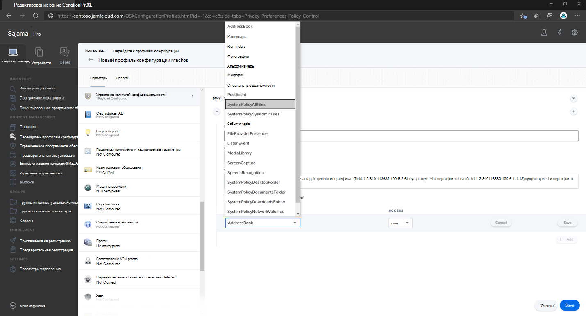

    - <span data-ttu-id="c8de5-311">В приложении или службе: установите **systemPolicyAllFiles**</span><span class="sxs-lookup"><span data-stu-id="c8de5-311">Under App or service: Set to **SystemPolicyAllFiles**</span></span>

    - <span data-ttu-id="c8de5-312">В статье "Доступ": набор **разрешить**</span><span class="sxs-lookup"><span data-stu-id="c8de5-312">Under "access": Set to **Allow**</span></span>

7. <span data-ttu-id="c8de5-313">Выберите **Сохранить** (не тот, который внизу справа).</span><span class="sxs-lookup"><span data-stu-id="c8de5-313">Select **Save** (not the one at the bottom right).</span></span>

    

8. <span data-ttu-id="c8de5-315">Щелкните `+` знак рядом с **доступом к приложению,** чтобы добавить новую запись.</span><span class="sxs-lookup"><span data-stu-id="c8de5-315">Click the `+` sign next to **App Access** to add a new entry.</span></span>

    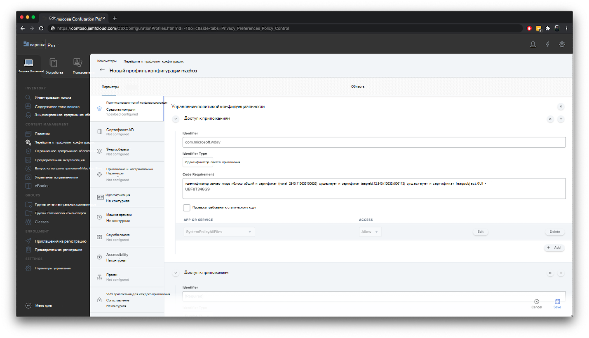

9. <span data-ttu-id="c8de5-317">Введите следующие сведения:</span><span class="sxs-lookup"><span data-stu-id="c8de5-317">Enter the following details:</span></span>

    - <span data-ttu-id="c8de5-318">Идентификатор: `com.microsoft.wdav.epsext`</span><span class="sxs-lookup"><span data-stu-id="c8de5-318">Identifier: `com.microsoft.wdav.epsext`</span></span>
    - <span data-ttu-id="c8de5-319">Тип идентификатора: идентификатор пакета</span><span class="sxs-lookup"><span data-stu-id="c8de5-319">Identifier Type: Bundle ID</span></span>
    - <span data-ttu-id="c8de5-320">Требование кода: `identifier "com.microsoft.wdav.epsext" and anchor apple generic and certificate 1[field.1.2.840.113635.100.6.2.6] /* exists */ and certificate leaf[field.1.2.840.113635.100.6.1.13] /* exists */ and certificate leaf[subject.OU] = UBF8T346G9`</span><span class="sxs-lookup"><span data-stu-id="c8de5-320">Code Requirement: `identifier "com.microsoft.wdav.epsext" and anchor apple generic and certificate 1[field.1.2.840.113635.100.6.2.6] /* exists */ and certificate leaf[field.1.2.840.113635.100.6.1.13] /* exists */ and certificate leaf[subject.OU] = UBF8T346G9`</span></span>

10. <span data-ttu-id="c8de5-321">Выберите **+ Добавить**.</span><span class="sxs-lookup"><span data-stu-id="c8de5-321">Select **+ Add**.</span></span>

    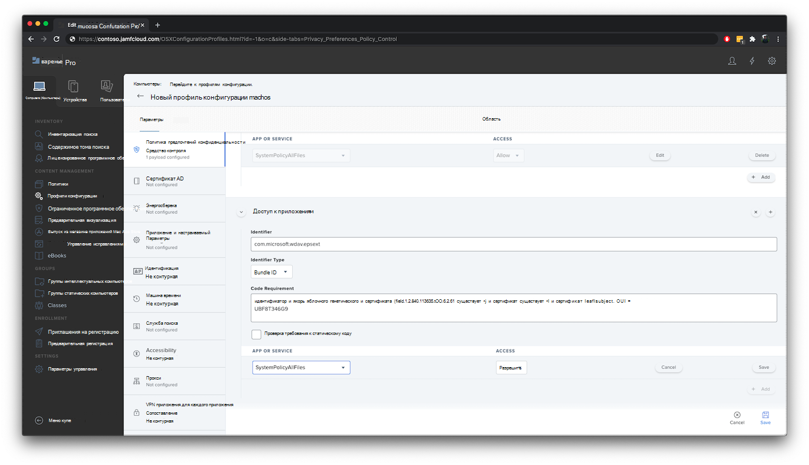

    - <span data-ttu-id="c8de5-323">В приложении или службе: установите **systemPolicyAllFiles**</span><span class="sxs-lookup"><span data-stu-id="c8de5-323">Under App or service: Set to **SystemPolicyAllFiles**</span></span>

    - <span data-ttu-id="c8de5-324">В статье "Доступ": набор **разрешить**</span><span class="sxs-lookup"><span data-stu-id="c8de5-324">Under "access": Set to **Allow**</span></span>

11. <span data-ttu-id="c8de5-325">Выберите **Сохранить** (не тот, который внизу справа).</span><span class="sxs-lookup"><span data-stu-id="c8de5-325">Select **Save** (not the one at the bottom right).</span></span>

    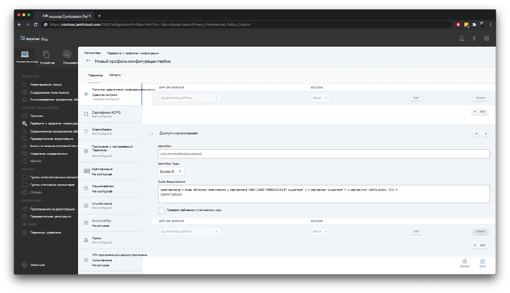

12. <span data-ttu-id="c8de5-327">Выберите **вкладку Область.**</span><span class="sxs-lookup"><span data-stu-id="c8de5-327">Select the **Scope** tab.</span></span>

    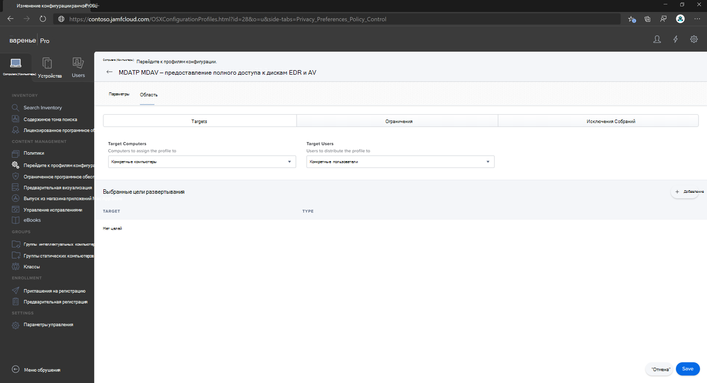

13. <span data-ttu-id="c8de5-329">Выберите **+ Добавить**.</span><span class="sxs-lookup"><span data-stu-id="c8de5-329">Select **+ Add**.</span></span>

    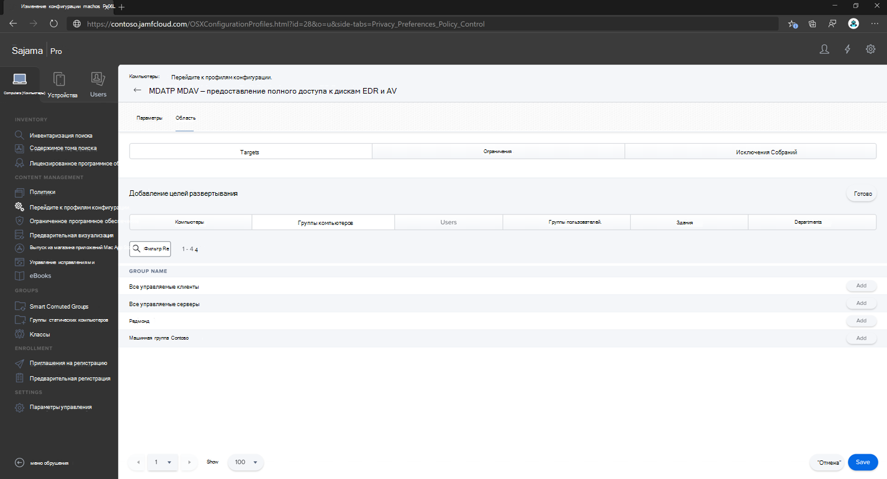

14. <span data-ttu-id="c8de5-331">Выберите **группы** компьютеров > **под названием** группы > **выберите MachineGroup Contoso.**</span><span class="sxs-lookup"><span data-stu-id="c8de5-331">Select **Computer Groups** > under **Group Name** > select **Contoso's MachineGroup**.</span></span> 

    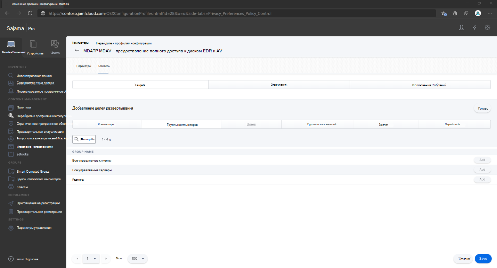

15. <span data-ttu-id="c8de5-333">Нажмите кнопку **Добавить**.</span><span class="sxs-lookup"><span data-stu-id="c8de5-333">Select **Add**.</span></span> 

16. <span data-ttu-id="c8de5-334">Нажмите **Сохранить**.</span><span class="sxs-lookup"><span data-stu-id="c8de5-334">Select **Save**.</span></span> 
    
17. <span data-ttu-id="c8de5-335">Нажмите кнопку **Готово**.</span><span class="sxs-lookup"><span data-stu-id="c8de5-335">Select **Done**.</span></span>
    
    
    
    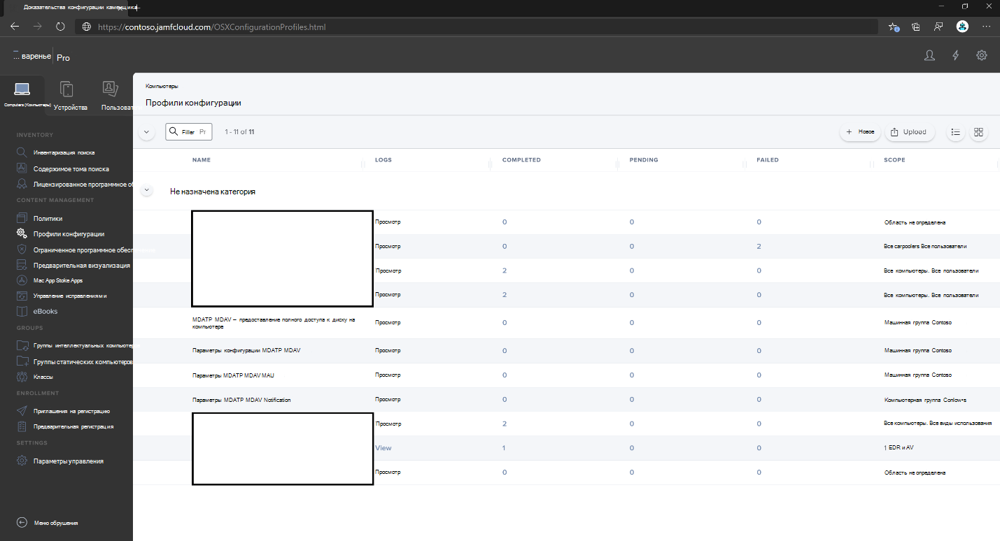

<span data-ttu-id="c8de5-338">Кроме того, вы можете скачать [fulldisk.mobileconfig](https://github.com/microsoft/mdatp-xplat/blob/master/macos/mobileconfig/profiles/fulldisk.mobileconfig) и загрузить его в профили конфигурации JAMF, как описано в развертывании пользовательских профилей конфигурации с помощью [Jamf Pro| Метод 2. Загрузите профиль конфигурации в Jamf Pro](https://www.jamf.com/jamf-nation/articles/648/deploying-custom-configuration-profiles-using-jamf-pro).</span><span class="sxs-lookup"><span data-stu-id="c8de5-338">Alternatively, you can download [fulldisk.mobileconfig](https://github.com/microsoft/mdatp-xplat/blob/master/macos/mobileconfig/profiles/fulldisk.mobileconfig) and upload it to JAMF Configuration Profiles as described in [Deploying Custom Configuration Profiles using Jamf Pro|Method 2: Upload a Configuration Profile to Jamf Pro](https://www.jamf.com/jamf-nation/articles/648/deploying-custom-configuration-profiles-using-jamf-pro).</span></span>

## <a name="step-7-approve-kernel-extension-for-microsoft-defender-for-endpoint"></a><span data-ttu-id="c8de5-339">Шаг 7. Утверждение расширения ядра для Microsoft Defender для конечной точки</span><span class="sxs-lookup"><span data-stu-id="c8de5-339">Step 7: Approve Kernel extension for Microsoft Defender for Endpoint</span></span>

> [!CAUTION]
> <span data-ttu-id="c8de5-340">Устройства Apple Silicon (M1) не поддерживают KEXT.</span><span class="sxs-lookup"><span data-stu-id="c8de5-340">Apple Silicon (M1) devices do not support KEXT.</span></span> <span data-ttu-id="c8de5-341">Установка профиля конфигурации, состоящего из политик KEXT, не будет работать на этих устройствах.</span><span class="sxs-lookup"><span data-stu-id="c8de5-341">Installation of a configuration profile consisting KEXT policies will fail on these devices.</span></span>

1. <span data-ttu-id="c8de5-342">В **профилях конфигурации** выберите **+ New**.</span><span class="sxs-lookup"><span data-stu-id="c8de5-342">In the **Configuration Profiles**, select **+ New**.</span></span>

    

2. <span data-ttu-id="c8de5-344">Введите следующие сведения:</span><span class="sxs-lookup"><span data-stu-id="c8de5-344">Enter the following details:</span></span>

    <span data-ttu-id="c8de5-345">**Общие**</span><span class="sxs-lookup"><span data-stu-id="c8de5-345">**General**</span></span> 
    
    - <span data-ttu-id="c8de5-346">Имя. Расширение Ядра MDAV MDAV</span><span class="sxs-lookup"><span data-stu-id="c8de5-346">Name: MDATP MDAV Kernel Extension</span></span>
    - <span data-ttu-id="c8de5-347">Описание: расширение ядра MDATP (kext)</span><span class="sxs-lookup"><span data-stu-id="c8de5-347">Description: MDATP kernel extension (kext)</span></span>
    - <span data-ttu-id="c8de5-348">Категории: None (нет)</span><span class="sxs-lookup"><span data-stu-id="c8de5-348">Category: None</span></span>
    - <span data-ttu-id="c8de5-349">Метод рассылки: установка автоматически</span><span class="sxs-lookup"><span data-stu-id="c8de5-349">Distribution Method: Install Automatically</span></span>
    - <span data-ttu-id="c8de5-350">Уровень: уровень компьютера</span><span class="sxs-lookup"><span data-stu-id="c8de5-350">Level: Computer Level</span></span>

    

3. <span data-ttu-id="c8de5-352">В **Настройка утвержденных расширений ядра** выберите **Настройка**.</span><span class="sxs-lookup"><span data-stu-id="c8de5-352">In **Configure Approved Kernel Extensions** select **Configure**.</span></span>

    

   
4. <span data-ttu-id="c8de5-354">В **утвержденных расширениях ядра** введите следующие сведения:</span><span class="sxs-lookup"><span data-stu-id="c8de5-354">In **Approved Kernel Extensions** Enter the following details:</span></span>

    - <span data-ttu-id="c8de5-355">Имя отображения: Корпорация Майкрософт.</span><span class="sxs-lookup"><span data-stu-id="c8de5-355">Display Name: Microsoft Corp.</span></span>
    - <span data-ttu-id="c8de5-356">ID команды: UBF8T346G9</span><span class="sxs-lookup"><span data-stu-id="c8de5-356">Team ID: UBF8T346G9</span></span>

    

5. <span data-ttu-id="c8de5-358">Выберите **вкладку Область.**</span><span class="sxs-lookup"><span data-stu-id="c8de5-358">Select the **Scope** tab.</span></span>

    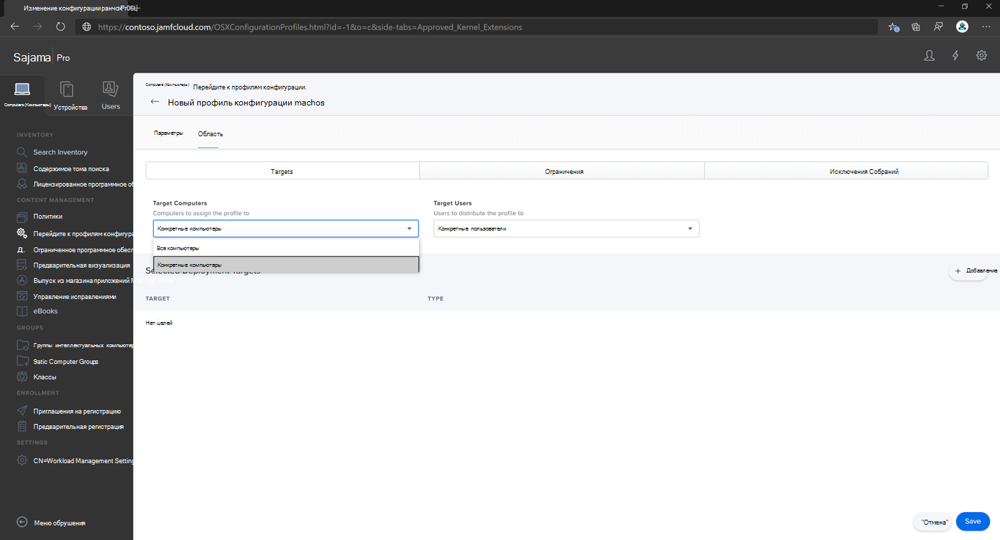

6. <span data-ttu-id="c8de5-360">Выберите **+ Добавить**.</span><span class="sxs-lookup"><span data-stu-id="c8de5-360">Select **+ Add**.</span></span>

7. <span data-ttu-id="c8de5-361">Выберите **группы** > **в соответствии с названием** группы > выберите **группу машин Contoso.**</span><span class="sxs-lookup"><span data-stu-id="c8de5-361">Select **Computer Groups** > under **Group Name** > select **Contoso's Machine Group**.</span></span>

8. <span data-ttu-id="c8de5-362">Выберите **+ Добавить**.</span><span class="sxs-lookup"><span data-stu-id="c8de5-362">Select **+ Add**.</span></span>

    

9. <span data-ttu-id="c8de5-364">Нажмите **Сохранить**.</span><span class="sxs-lookup"><span data-stu-id="c8de5-364">Select **Save**.</span></span>

    

10. <span data-ttu-id="c8de5-366">Нажмите кнопку **Готово**.</span><span class="sxs-lookup"><span data-stu-id="c8de5-366">Select **Done**.</span></span>

    

<span data-ttu-id="c8de5-368">Кроме того, вы можете скачать [kext.mobileconfig](https://github.com/microsoft/mdatp-xplat/blob/master/macos/mobileconfig/profiles/kext.mobileconfig) и загрузить его в профили конфигурации JAMF, как описано в развертывании пользовательских профилей конфигурации с помощью [Jamf Pro| Метод 2. Загрузите профиль конфигурации в Jamf Pro](https://www.jamf.com/jamf-nation/articles/648/deploying-custom-configuration-profiles-using-jamf-pro).</span><span class="sxs-lookup"><span data-stu-id="c8de5-368">Alternatively, you can download [kext.mobileconfig](https://github.com/microsoft/mdatp-xplat/blob/master/macos/mobileconfig/profiles/kext.mobileconfig) and upload it to JAMF Configuration Profiles as described in [Deploying Custom Configuration Profiles using Jamf Pro|Method 2: Upload a Configuration Profile to Jamf Pro](https://www.jamf.com/jamf-nation/articles/648/deploying-custom-configuration-profiles-using-jamf-pro).</span></span>

## <a name="step-8-approve-system-extensions-for-microsoft-defender-for-endpoint"></a><span data-ttu-id="c8de5-369">Шаг 8. Утверждение расширений системы для Microsoft Defender для конечной точки</span><span class="sxs-lookup"><span data-stu-id="c8de5-369">Step 8: Approve System extensions for Microsoft Defender for Endpoint</span></span>

1. <span data-ttu-id="c8de5-370">В **профилях конфигурации** выберите **+ New**.</span><span class="sxs-lookup"><span data-stu-id="c8de5-370">In the **Configuration Profiles**, select **+ New**.</span></span>

    

2. <span data-ttu-id="c8de5-372">Введите следующие сведения:</span><span class="sxs-lookup"><span data-stu-id="c8de5-372">Enter the following details:</span></span>

    <span data-ttu-id="c8de5-373">**Общие**</span><span class="sxs-lookup"><span data-stu-id="c8de5-373">**General**</span></span>
    
    - <span data-ttu-id="c8de5-374">Имя: MDATP MDAV System Extensions</span><span class="sxs-lookup"><span data-stu-id="c8de5-374">Name: MDATP MDAV System Extensions</span></span>
    - <span data-ttu-id="c8de5-375">Описание: расширения системы MDATP</span><span class="sxs-lookup"><span data-stu-id="c8de5-375">Description: MDATP system extensions</span></span>
    - <span data-ttu-id="c8de5-376">Категории: None (нет)</span><span class="sxs-lookup"><span data-stu-id="c8de5-376">Category: None</span></span>
    - <span data-ttu-id="c8de5-377">Метод рассылки: установка автоматически</span><span class="sxs-lookup"><span data-stu-id="c8de5-377">Distribution Method: Install Automatically</span></span>
    - <span data-ttu-id="c8de5-378">Уровень: уровень компьютера</span><span class="sxs-lookup"><span data-stu-id="c8de5-378">Level: Computer Level</span></span>

    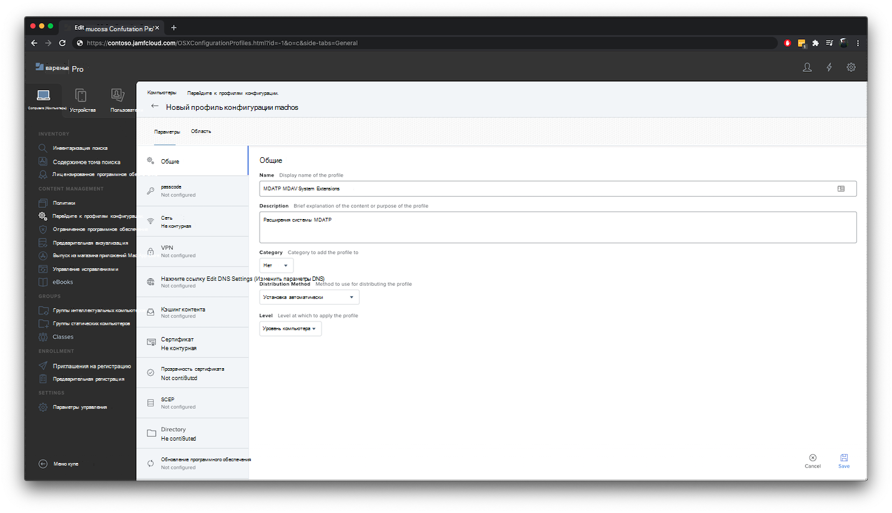

3. <span data-ttu-id="c8de5-380">В **расширении системы** выберите **Настройка**.</span><span class="sxs-lookup"><span data-stu-id="c8de5-380">In **System Extensions** select **Configure**.</span></span>

   

4. <span data-ttu-id="c8de5-382">В **расширении системы введите** следующие сведения:</span><span class="sxs-lookup"><span data-stu-id="c8de5-382">In **System Extensions** enter the following details:</span></span>

   - <span data-ttu-id="c8de5-383">Имя отображения: расширения системы Microsoft Corp.</span><span class="sxs-lookup"><span data-stu-id="c8de5-383">Display Name: Microsoft Corp. System Extensions</span></span>
   - <span data-ttu-id="c8de5-384">Типы расширения системы: разрешенные расширения системы</span><span class="sxs-lookup"><span data-stu-id="c8de5-384">System Extension Types: Allowed System Extensions</span></span>
   - <span data-ttu-id="c8de5-385">Идентификатор команды: UBF8T346G9</span><span class="sxs-lookup"><span data-stu-id="c8de5-385">Team Identifier: UBF8T346G9</span></span>
   - <span data-ttu-id="c8de5-386">Разрешенные расширения системы:</span><span class="sxs-lookup"><span data-stu-id="c8de5-386">Allowed System Extensions:</span></span>
     - <span data-ttu-id="c8de5-387">**com.microsoft.wdav.epsext**</span><span class="sxs-lookup"><span data-stu-id="c8de5-387">**com.microsoft.wdav.epsext**</span></span>
     - <span data-ttu-id="c8de5-388">**com.microsoft.wdav.netext**</span><span class="sxs-lookup"><span data-stu-id="c8de5-388">**com.microsoft.wdav.netext**</span></span>

    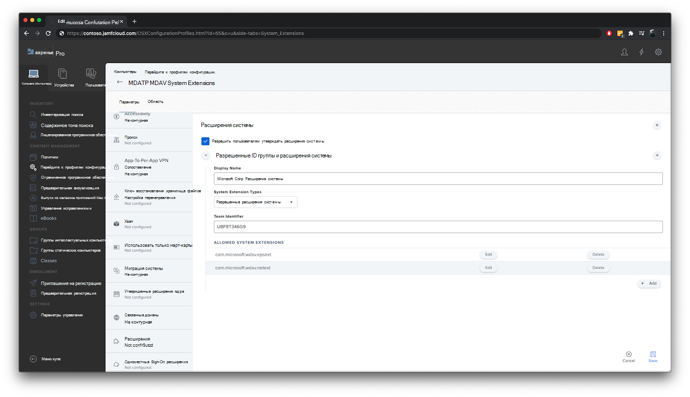

5. <span data-ttu-id="c8de5-390">Выберите **вкладку Область.**</span><span class="sxs-lookup"><span data-stu-id="c8de5-390">Select the **Scope** tab.</span></span>

    

6. <span data-ttu-id="c8de5-392">Выберите **+ Добавить**.</span><span class="sxs-lookup"><span data-stu-id="c8de5-392">Select **+ Add**.</span></span>

7. <span data-ttu-id="c8de5-393">Выберите **группы** > **в соответствии с названием** группы > выберите **группу машин Contoso.**</span><span class="sxs-lookup"><span data-stu-id="c8de5-393">Select **Computer Groups** > under **Group Name** > select **Contoso's Machine Group**.</span></span>

8. <span data-ttu-id="c8de5-394">Выберите **+ Добавить**.</span><span class="sxs-lookup"><span data-stu-id="c8de5-394">Select **+ Add**.</span></span>

   

9. <span data-ttu-id="c8de5-396">Нажмите **Сохранить**.</span><span class="sxs-lookup"><span data-stu-id="c8de5-396">Select **Save**.</span></span>

   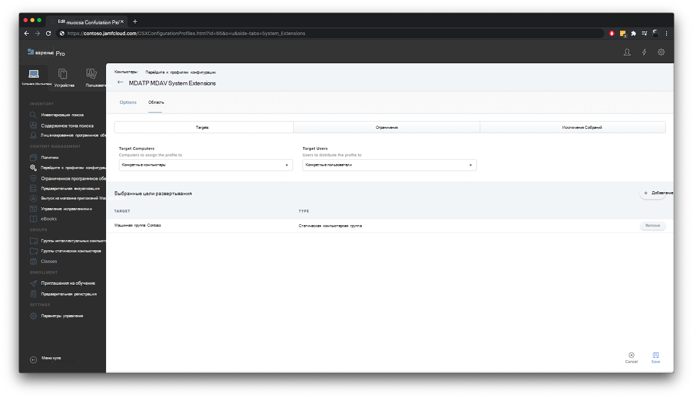

10. <span data-ttu-id="c8de5-398">Нажмите кнопку **Готово**.</span><span class="sxs-lookup"><span data-stu-id="c8de5-398">Select **Done**.</span></span>

    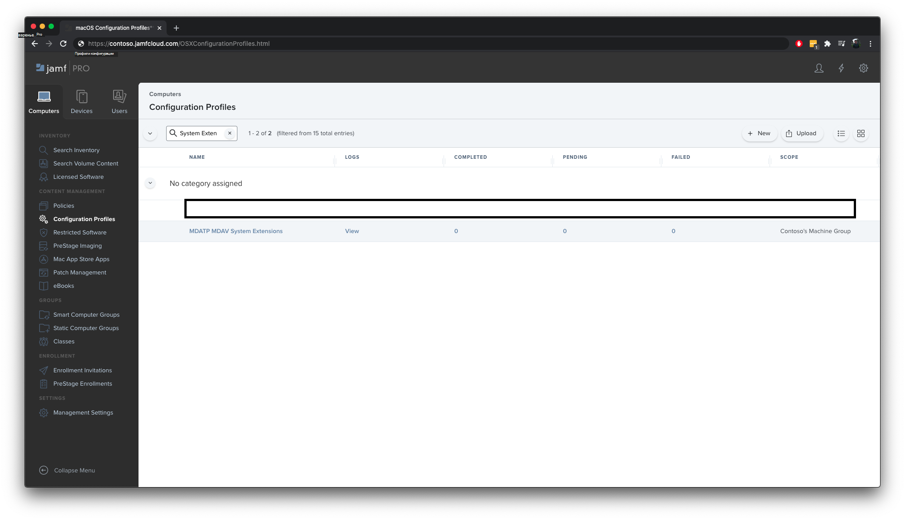

## <a name="step-9-configure-network-extension"></a><span data-ttu-id="c8de5-400">Шаг 9. Настройка расширения сети</span><span class="sxs-lookup"><span data-stu-id="c8de5-400">Step 9: Configure Network Extension</span></span>

<span data-ttu-id="c8de5-401">В рамках возможностей обнаружения конечных точек и ответов Microsoft Defender for Endpoint на macOS проверяет трафик розетки и передает эти сведения на портал Центра безопасности Microsoft Defender.</span><span class="sxs-lookup"><span data-stu-id="c8de5-401">As part of the Endpoint Detection and Response capabilities, Microsoft Defender for Endpoint on macOS inspects socket traffic and reports this information to the Microsoft Defender Security Center portal.</span></span> <span data-ttu-id="c8de5-402">Следующая политика позволяет сетевому расширению выполнять эту функцию.</span><span class="sxs-lookup"><span data-stu-id="c8de5-402">The following policy allows the network extension to perform this functionality.</span></span>

<span data-ttu-id="c8de5-403">Эти действия применимы к macOS 10.15 (Catalina) или более новым.</span><span class="sxs-lookup"><span data-stu-id="c8de5-403">These steps are applicable of macOS 10.15 (Catalina) or newer.</span></span>

1. <span data-ttu-id="c8de5-404">В панели мониторинга Jamf Pro выберите **компьютеры,** а затем **профили конфигурации.**</span><span class="sxs-lookup"><span data-stu-id="c8de5-404">In the Jamf Pro dashboard, select **Computers**, then **Configuration Profiles**.</span></span>

2. <span data-ttu-id="c8de5-405">Нажмите **кнопку New** и введите следующие сведения для **Параметры**:</span><span class="sxs-lookup"><span data-stu-id="c8de5-405">Click **New**, and enter the following details for **Options**:</span></span>

    - <span data-ttu-id="c8de5-406">Tab **General:**</span><span class="sxs-lookup"><span data-stu-id="c8de5-406">Tab **General**:</span></span> 
        - <span data-ttu-id="c8de5-407">**Имя:** Расширение сети ATP Защитника Майкрософт</span><span class="sxs-lookup"><span data-stu-id="c8de5-407">**Name**: Microsoft Defender ATP Network Extension</span></span>
        - <span data-ttu-id="c8de5-408">**Описание:** macOS 10.15 (Catalina) или более новый</span><span class="sxs-lookup"><span data-stu-id="c8de5-408">**Description**: macOS 10.15 (Catalina) or newer</span></span>
        - <span data-ttu-id="c8de5-409">**Категория:** Нет *(по умолчанию)*</span><span class="sxs-lookup"><span data-stu-id="c8de5-409">**Category**: None *(default)*</span></span>
        - <span data-ttu-id="c8de5-410">**Метод рассылки:** Установка автоматически *(по умолчанию)*</span><span class="sxs-lookup"><span data-stu-id="c8de5-410">**Distribution Method**: Install Automatically *(default)*</span></span>
        - <span data-ttu-id="c8de5-411">**Уровень**: Уровень компьютера *(по умолчанию)*</span><span class="sxs-lookup"><span data-stu-id="c8de5-411">**Level**: Computer Level *(default)*</span></span>

    - <span data-ttu-id="c8de5-412">Фильтр **контента вкладок:**</span><span class="sxs-lookup"><span data-stu-id="c8de5-412">Tab **Content Filter**:</span></span>
        - <span data-ttu-id="c8de5-413">**Имя фильтра:** фильтр контента ATP Защитника Майкрософт</span><span class="sxs-lookup"><span data-stu-id="c8de5-413">**Filter Name**: Microsoft Defender ATP Content Filter</span></span>
        - <span data-ttu-id="c8de5-414">**Идентификатор:**`com.microsoft.wdav`</span><span class="sxs-lookup"><span data-stu-id="c8de5-414">**Identifier**: `com.microsoft.wdav`</span></span>
        - <span data-ttu-id="c8de5-415">Оставьте **адрес службы**, **организация**, **имя пользователя**, **пароль**, **сертификат** пустой (**Включить** *не* выбран)</span><span class="sxs-lookup"><span data-stu-id="c8de5-415">Leave **Service Address**, **Organization**, **User Name**, **Password**, **Certificate** blank (**Include** is *not* selected)</span></span>
        - <span data-ttu-id="c8de5-416">**Порядок фильтрации:** Инспектор</span><span class="sxs-lookup"><span data-stu-id="c8de5-416">**Filter Order**: Inspector</span></span>
        - <span data-ttu-id="c8de5-417">**Фильтр socket:**`com.microsoft.wdav.netext`</span><span class="sxs-lookup"><span data-stu-id="c8de5-417">**Socket Filter**: `com.microsoft.wdav.netext`</span></span>
        - <span data-ttu-id="c8de5-418">**Назначенное требование фильтра socket:**`identifier "com.microsoft.wdav.netext" and anchor apple generic and certificate 1[field.1.2.840.113635.100.6.2.6] /* exists */ and certificate leaf[field.1.2.840.113635.100.6.1.13] /* exists */ and certificate leaf[subject.OU] = UBF8T346G9`</span><span class="sxs-lookup"><span data-stu-id="c8de5-418">**Socket Filter Designated Requirement**: `identifier "com.microsoft.wdav.netext" and anchor apple generic and certificate 1[field.1.2.840.113635.100.6.2.6] /* exists */ and certificate leaf[field.1.2.840.113635.100.6.1.13] /* exists */ and certificate leaf[subject.OU] = UBF8T346G9`</span></span>
        - <span data-ttu-id="c8de5-419">Оставьте **поля сетевого** фильтра пустыми **(Включить** *не* выбрано)</span><span class="sxs-lookup"><span data-stu-id="c8de5-419">Leave **Network Filter** fields blank (**Include** is *not* selected)</span></span>

        <span data-ttu-id="c8de5-420">Обратите **внимание, что идентификатор,** **фильтр socket и** **фильтр socket** назначенные точные значения требования, указанные выше.</span><span class="sxs-lookup"><span data-stu-id="c8de5-420">Note that **Identifier**, **Socket Filter** and **Socket Filter Designated Requirement** exact values as specified above.</span></span>

        

3. <span data-ttu-id="c8de5-422">Выберите **вкладку Область.**</span><span class="sxs-lookup"><span data-stu-id="c8de5-422">Select the **Scope** tab.</span></span>

   

4. <span data-ttu-id="c8de5-424">Выберите **+ Добавить**.</span><span class="sxs-lookup"><span data-stu-id="c8de5-424">Select **+ Add**.</span></span>

5. <span data-ttu-id="c8de5-425">Выберите **группы** > **в соответствии с названием** группы > выберите **группу машин Contoso.**</span><span class="sxs-lookup"><span data-stu-id="c8de5-425">Select **Computer Groups** > under **Group Name** > select **Contoso's Machine Group**.</span></span>

6. <span data-ttu-id="c8de5-426">Выберите **+ Добавить**.</span><span class="sxs-lookup"><span data-stu-id="c8de5-426">Select **+ Add**.</span></span>

    

7. <span data-ttu-id="c8de5-428">Нажмите **Сохранить**.</span><span class="sxs-lookup"><span data-stu-id="c8de5-428">Select **Save**.</span></span>

    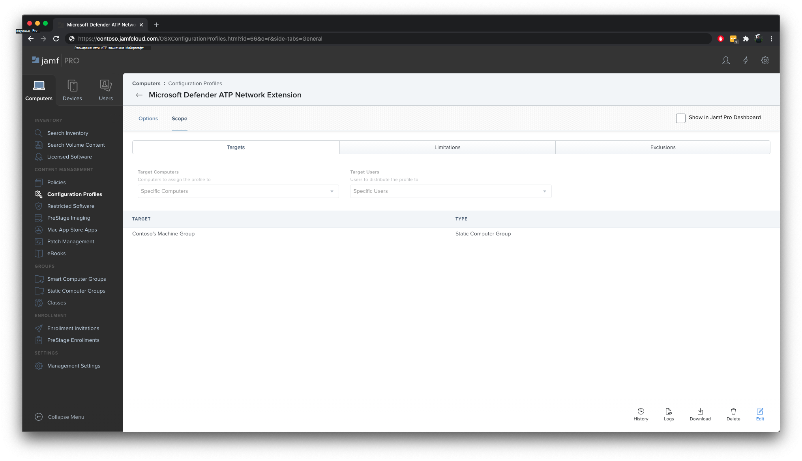

8. <span data-ttu-id="c8de5-430">Нажмите кнопку **Готово**.</span><span class="sxs-lookup"><span data-stu-id="c8de5-430">Select **Done**.</span></span>

    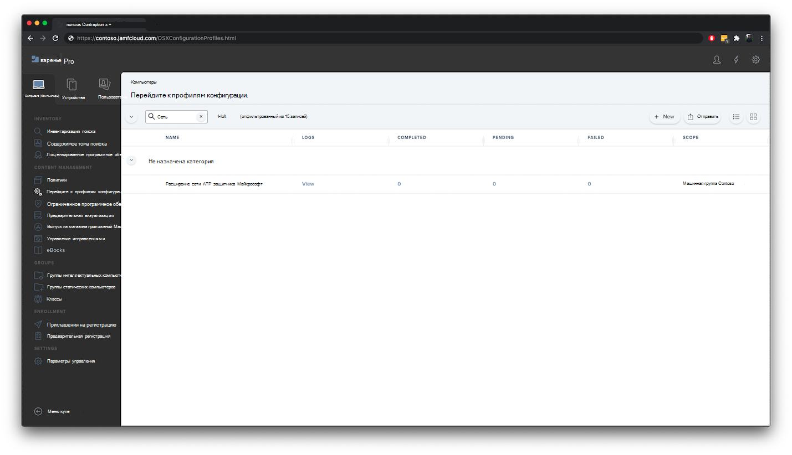

<span data-ttu-id="c8de5-432">Кроме того, вы можете скачать [netfilter.mobileconfig](https://github.com/microsoft/mdatp-xplat/blob/master/macos/mobileconfig/profiles/netfilter.mobileconfig) и загрузить его в профили конфигурации JAMF, как описано в развертывании пользовательских профилей конфигурации с помощью [Jamf Pro| Метод 2. Загрузите профиль конфигурации в Jamf Pro](https://www.jamf.com/jamf-nation/articles/648/deploying-custom-configuration-profiles-using-jamf-pro).</span><span class="sxs-lookup"><span data-stu-id="c8de5-432">Alternatively, you can download [netfilter.mobileconfig](https://github.com/microsoft/mdatp-xplat/blob/master/macos/mobileconfig/profiles/netfilter.mobileconfig) and upload it to JAMF Configuration Profiles as described in [Deploying Custom Configuration Profiles using Jamf Pro|Method 2: Upload a Configuration Profile to Jamf Pro](https://www.jamf.com/jamf-nation/articles/648/deploying-custom-configuration-profiles-using-jamf-pro).</span></span>


## <a name="step-10-schedule-scans-with-microsoft-defender-for-endpoint-on-macos"></a><span data-ttu-id="c8de5-433">Шаг 10. Расписание сканирования с помощью Microsoft Defender для конечной точки на macOS</span><span class="sxs-lookup"><span data-stu-id="c8de5-433">Step 10: Schedule scans with Microsoft Defender for Endpoint on macOS</span></span>
<span data-ttu-id="c8de5-434">Следуйте инструкциям по [проверке расписания с помощью Microsoft Defender для конечной точки на macOS.](https://docs.microsoft.com/windows/security/threat-protection/microsoft-defender-atp/mac-schedule-scan-atp)</span><span class="sxs-lookup"><span data-stu-id="c8de5-434">Follow the instructions on [Schedule scans with Microsoft Defender for Endpoint on macOS](https://docs.microsoft.com/windows/security/threat-protection/microsoft-defender-atp/mac-schedule-scan-atp).</span></span>


## <a name="step-11-deploy-microsoft-defender-for-endpoint-on-macos"></a><span data-ttu-id="c8de5-435">Шаг 11. Развертывание Microsoft Defender для конечной точки на macOS</span><span class="sxs-lookup"><span data-stu-id="c8de5-435">Step 11: Deploy Microsoft Defender for Endpoint on macOS</span></span>

1. <span data-ttu-id="c8de5-436">Перейдите к сохраненным `wdav.pkg` местам.</span><span class="sxs-lookup"><span data-stu-id="c8de5-436">Navigate to where you saved `wdav.pkg`.</span></span>

    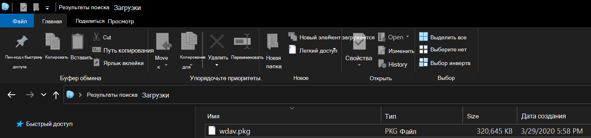

2. <span data-ttu-id="c8de5-438">Переименуй его в `wdav_MDM_Contoso_200329.pkg` .</span><span class="sxs-lookup"><span data-stu-id="c8de5-438">Rename it to `wdav_MDM_Contoso_200329.pkg`.</span></span>

    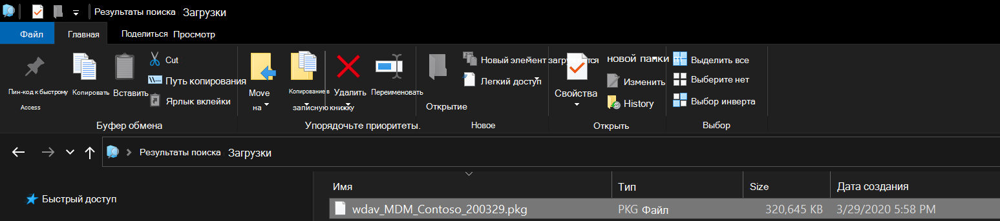

3. <span data-ttu-id="c8de5-440">Откройте панель мониторинга Jamf Pro.</span><span class="sxs-lookup"><span data-stu-id="c8de5-440">Open the Jamf Pro dashboard.</span></span>

    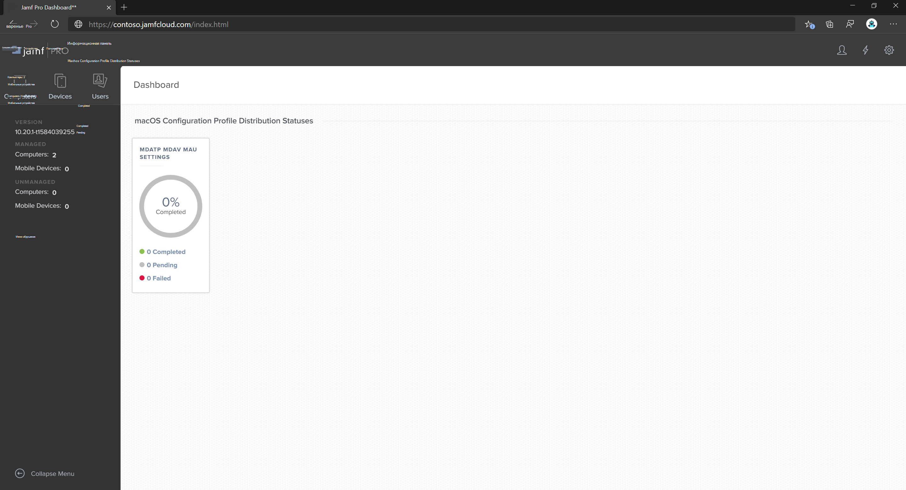

4. <span data-ttu-id="c8de5-442">Выберите компьютер и нажмите значок передач в верхней части, а затем выберите **управление компьютером**.</span><span class="sxs-lookup"><span data-stu-id="c8de5-442">Select your computer and click the gear icon at the top, then select **Computer Management**.</span></span>

    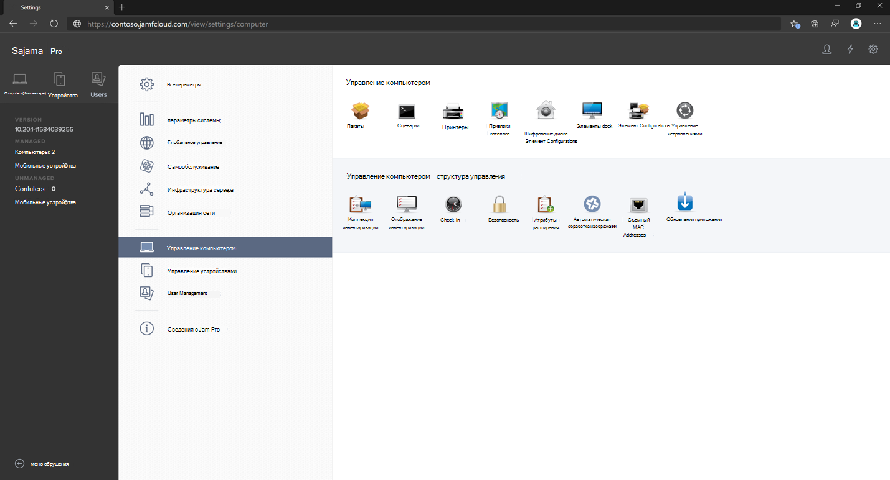

5. <span data-ttu-id="c8de5-444">В **пакетах** выберите **+ New**.</span><span class="sxs-lookup"><span data-stu-id="c8de5-444">In **Packages**, select **+ New**.</span></span> 
    <span data-ttu-id="c8de5-445"></span><span class="sxs-lookup"><span data-stu-id="c8de5-445"></span></span>

6. <span data-ttu-id="c8de5-446">В **новом пакете** введите следующие сведения:</span><span class="sxs-lookup"><span data-stu-id="c8de5-446">In **New Package** Enter the following details:</span></span>

    <span data-ttu-id="c8de5-447">**Общая вкладка**</span><span class="sxs-lookup"><span data-stu-id="c8de5-447">**General tab**</span></span>
    - <span data-ttu-id="c8de5-448">Имя отображения. Оставьте его пустым на данный момент.</span><span class="sxs-lookup"><span data-stu-id="c8de5-448">Display Name: Leave it blank for now.</span></span> <span data-ttu-id="c8de5-449">Потому что она будет сброшена при выборе pkg.</span><span class="sxs-lookup"><span data-stu-id="c8de5-449">Because it will be reset when you choose your pkg.</span></span>
    - <span data-ttu-id="c8de5-450">Категория: Нет (по умолчанию)</span><span class="sxs-lookup"><span data-stu-id="c8de5-450">Category: None (default)</span></span>
    - <span data-ttu-id="c8de5-451">Имя файла: выберите файл</span><span class="sxs-lookup"><span data-stu-id="c8de5-451">Filename: Choose File</span></span>

    

    <span data-ttu-id="c8de5-453">Откройте файл и указать его `wdav.pkg` или `wdav_MDM_Contoso_200329.pkg` .</span><span class="sxs-lookup"><span data-stu-id="c8de5-453">Open the file and point it to `wdav.pkg` or `wdav_MDM_Contoso_200329.pkg`.</span></span>
    
    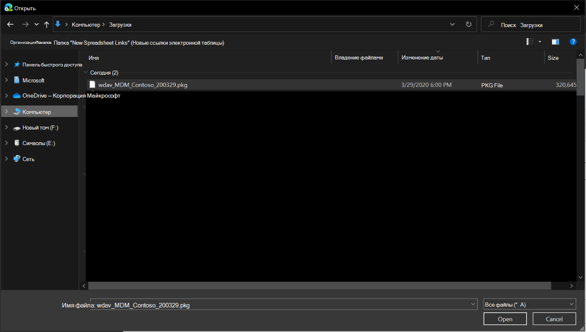

7. <span data-ttu-id="c8de5-455">Выберите **Открыть**.</span><span class="sxs-lookup"><span data-stu-id="c8de5-455">Select **Open**.</span></span> <span data-ttu-id="c8de5-456">Установите имя **отображения в** Microsoft **Defender Advanced Threat Protection и антивирус Microsoft Defender.**</span><span class="sxs-lookup"><span data-stu-id="c8de5-456">Set the **Display Name** to **Microsoft Defender Advanced Threat Protection and Microsoft Defender Antivirus**.</span></span>

    <span data-ttu-id="c8de5-457">**Файл Manifest не** требуется.</span><span class="sxs-lookup"><span data-stu-id="c8de5-457">**Manifest File** is not required.</span></span> <span data-ttu-id="c8de5-458">Расширенные средства защиты от угроз Microsoft Defender работают без файла Манифеста.</span><span class="sxs-lookup"><span data-stu-id="c8de5-458">Microsoft Defender Advanced Threat Protection works without Manifest File.</span></span>
    
    <span data-ttu-id="c8de5-459">**Вкладка с параметрами**</span><span class="sxs-lookup"><span data-stu-id="c8de5-459">**Options tab**</span></span><br> <span data-ttu-id="c8de5-460">Сохранение значений по умолчанию.</span><span class="sxs-lookup"><span data-stu-id="c8de5-460">Keep default values.</span></span>

    <span data-ttu-id="c8de5-461">**Вкладка Ограничения**</span><span class="sxs-lookup"><span data-stu-id="c8de5-461">**Limitations tab**</span></span><br> <span data-ttu-id="c8de5-462">Сохранение значений по умолчанию.</span><span class="sxs-lookup"><span data-stu-id="c8de5-462">Keep default values.</span></span>
    
     
   
8. <span data-ttu-id="c8de5-464">Нажмите **Сохранить**.</span><span class="sxs-lookup"><span data-stu-id="c8de5-464">Select **Save**.</span></span> <span data-ttu-id="c8de5-465">Пакет загружается в Jamf Pro.</span><span class="sxs-lookup"><span data-stu-id="c8de5-465">The package is uploaded to Jamf Pro.</span></span> 

   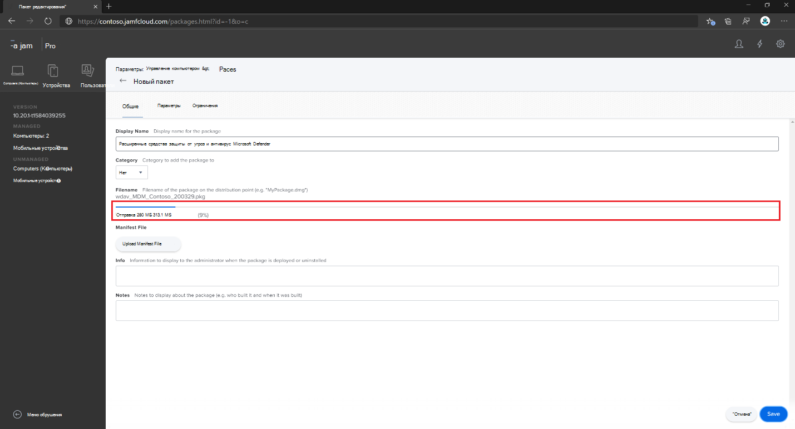

   <span data-ttu-id="c8de5-467">Чтобы пакет был доступен для развертывания, может занять несколько минут.</span><span class="sxs-lookup"><span data-stu-id="c8de5-467">It can take a few minutes for the package to be available for deployment.</span></span>
   
   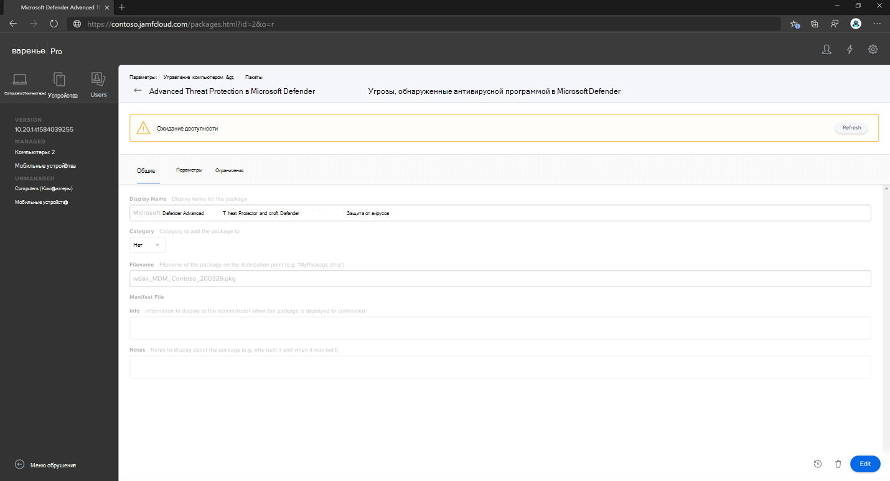

9. <span data-ttu-id="c8de5-469">Перейдите на **страницу Политики.**</span><span class="sxs-lookup"><span data-stu-id="c8de5-469">Navigate to the **Policies** page.</span></span>

    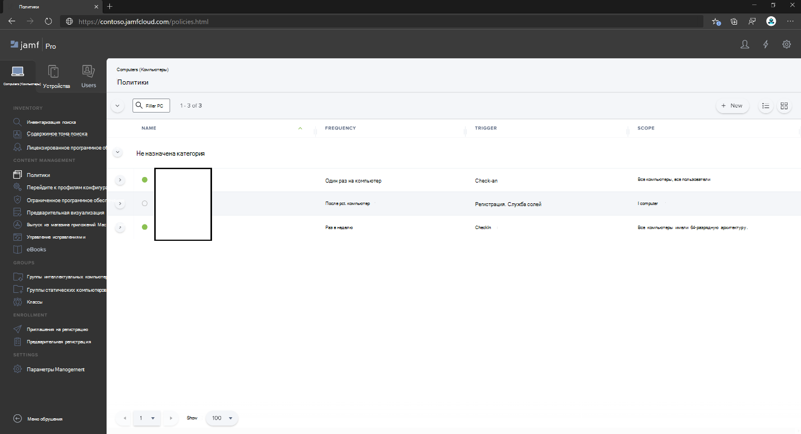

10. <span data-ttu-id="c8de5-471">Выберите **+ Новое** для создания новой политики.</span><span class="sxs-lookup"><span data-stu-id="c8de5-471">Select **+ New** to create a new policy.</span></span>

    


11. <span data-ttu-id="c8de5-473">В **общем введите** следующие сведения:</span><span class="sxs-lookup"><span data-stu-id="c8de5-473">In **General** Enter the following details:</span></span>

    - <span data-ttu-id="c8de5-474">Имя отображения: MDATP onboarding Contoso 200329 v100.86.92 или более поздней</span><span class="sxs-lookup"><span data-stu-id="c8de5-474">Display name: MDATP Onboarding Contoso 200329 v100.86.92 or later</span></span>

    

12. <span data-ttu-id="c8de5-476">Выберите **повторяемую регистрацию.**</span><span class="sxs-lookup"><span data-stu-id="c8de5-476">Select **Recurring Check-in**.</span></span> 
    
    

  
13. <span data-ttu-id="c8de5-478">Нажмите **Сохранить**.</span><span class="sxs-lookup"><span data-stu-id="c8de5-478">Select **Save**.</span></span> 
 
14. <span data-ttu-id="c8de5-479">Выберите **пакеты > настройка**.</span><span class="sxs-lookup"><span data-stu-id="c8de5-479">Select **Packages > Configure**.</span></span>
 
    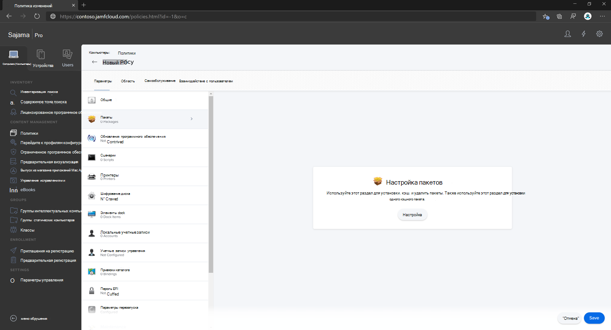

15. <span data-ttu-id="c8de5-481">Выберите **кнопку Добавить** рядом с **расширенным антивирусом Microsoft Defender Advanced Threat Protection и Microsoft Defender.**</span><span class="sxs-lookup"><span data-stu-id="c8de5-481">Select the **Add** button next to **Microsoft Defender Advanced Threat Protection and Microsoft Defender Antivirus**.</span></span>

    

16. <span data-ttu-id="c8de5-483">Нажмите **Сохранить**.</span><span class="sxs-lookup"><span data-stu-id="c8de5-483">Select **Save**.</span></span>

    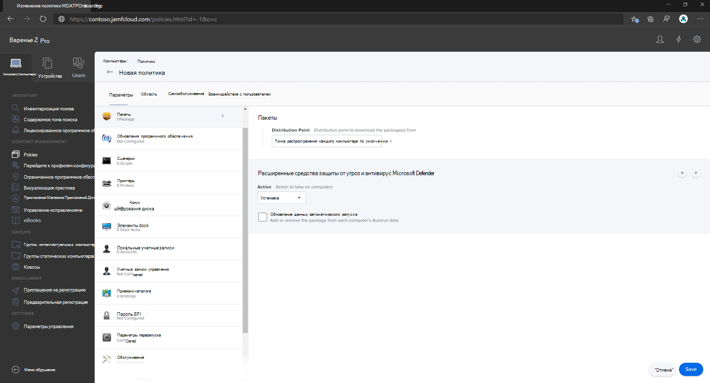

17. <span data-ttu-id="c8de5-485">Выберите **вкладку Область.**</span><span class="sxs-lookup"><span data-stu-id="c8de5-485">Select the **Scope** tab.</span></span>  

    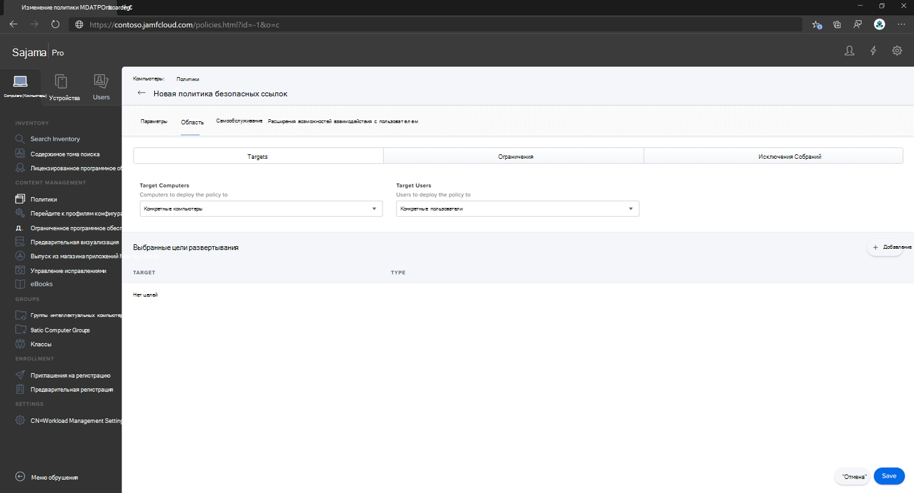

18. <span data-ttu-id="c8de5-487">Выберите целевые компьютеры.</span><span class="sxs-lookup"><span data-stu-id="c8de5-487">Select the target computers.</span></span>

    

    <span data-ttu-id="c8de5-489">**Scope**</span><span class="sxs-lookup"><span data-stu-id="c8de5-489">**Scope**</span></span>
    
    <span data-ttu-id="c8de5-490">Нажмите кнопку **Добавить**.</span><span class="sxs-lookup"><span data-stu-id="c8de5-490">Select **Add**.</span></span>
    
    

    

    <span data-ttu-id="c8de5-493">**Самообслуживка**</span><span class="sxs-lookup"><span data-stu-id="c8de5-493">**Self-Service**</span></span>
    
    

19. <span data-ttu-id="c8de5-495">Нажмите кнопку **Готово**.</span><span class="sxs-lookup"><span data-stu-id="c8de5-495">Select **Done**.</span></span> 

    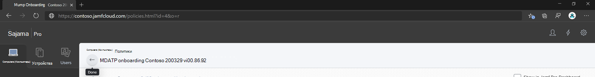

    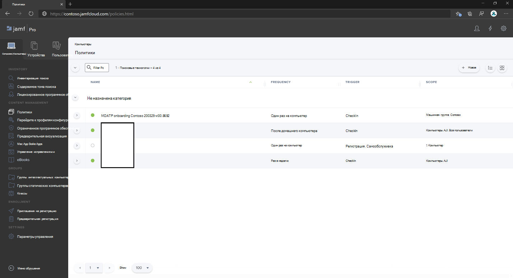


