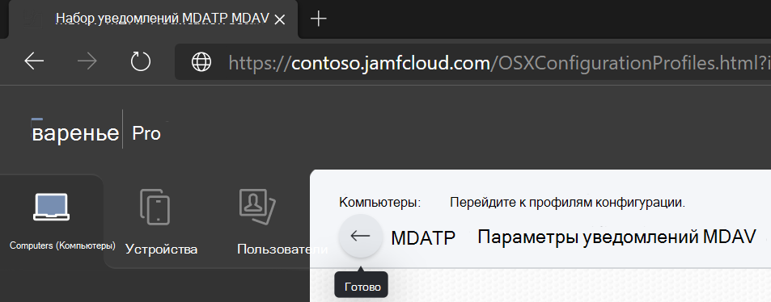

# <a name="set-up-the-microsoft-defender-for-endpoint-on-macos-policies-in-jamf-pro"></a>Настройка конечной точки Microsoft Defender для политик macOS в Jamf Pro

[!INCLUDE [Microsoft 365 Defender rebranding](../../includes/microsoft-defender.md)]


**Область применения:**

- [Защитник для конечной точки на Mac](microsoft-defender-endpoint-mac.md)

На этой странице вы сможете найти необходимые действия, чтобы настроить политики macOS в Jamf Pro.

Необходимо предпринять следующие действия:

1. [Получите пакет onboarding Microsoft Defender для конечной точки](#step-1-get-the-microsoft-defender-for-endpoint-onboarding-package)

2. [Создание профиля конфигурации в Jamf Pro с помощью пакета onboarding](#step-2-create-a-configuration-profile-in-jamf-pro-using-the-onboarding-package)

3. [Настройка параметров конечных точек Microsoft Defender](#step-3-configure-microsoft-defender-for-endpoint-settings)

4. [Настройка параметров уведомлений Microsoft Defender для конечной точки](#step-4-configure-notifications-settings)

5. [Настройка Microsoft AutoUpdate (MAU)](#step-5-configure-microsoft-autoupdate-mau)

6. [Предоставление полного доступа к диску Microsoft Defender для конечной точки](#step-6-grant-full-disk-access-to-microsoft-defender-for-endpoint)

7. [Утверждение расширения ядра для Microsoft Defender для конечной точки](#step-7-approve-kernel-extension-for-microsoft-defender-for-endpoint)

8. [Утверждение расширений системы для Microsoft Defender для конечной точки](#step-8-approve-system-extensions-for-microsoft-defender-for-endpoint)

9. [Настройка расширения сети](#step-9-configure-network-extension)

10. [Расписание сканирования с помощью Microsoft Defender для конечной точки на macOS](/windows/security/threat-protection/microsoft-defender-atp/mac-schedule-scan-atp)

11. [Развертывание Microsoft Defender для конечной точки на macOS](#step-11-deploy-microsoft-defender-for-endpoint-on-macos)


## <a name="step-1-get-the-microsoft-defender-for-endpoint-onboarding-package"></a>Шаг 1. Получить пакет onboarding Microsoft Defender для конечной точки

1. В [Центр безопасности в Microsoft Defender](https://securitycenter.microsoft.com)перейдите **к Параметры > onboarding**.

2. Выберите macOS в качестве операционной системы и метод управления мобильными устройствами Microsoft Intune в качестве метода развертывания.

    

3. Выберите **пакет загрузки** (WindowsDefenderATPOnboardingPackage.zip).

4. `WindowsDefenderATPOnboardingPackage.zip`Извлечение .

5. Скопируйте файл в предпочтительное расположение. Пример: `C:\Users\JaneDoe_or_JohnDoe.contoso\Downloads\WindowsDefenderATPOnboardingPackage_macOS_MDM_contoso\jamf\WindowsDefenderATPOnboarding.plist`.


## <a name="step-2-create-a-configuration-profile-in-jamf-pro-using-the-onboarding-package"></a>Шаг 2. Создание профиля конфигурации в Jamf Pro с помощью бортового пакета

1. Найдите файл `WindowsDefenderATPOnboarding.plist` из предыдущего раздела.

   


2. В панели мониторинга Jamf Pro выберите **New**.

    

3. Введите следующие сведения:

   **Общие**
   - Имя: бортовая система MDATP для macOS
   - Описание: MDATP EDR для macOS
   - Категории: None (нет)
   - Метод рассылки: установка автоматически
   - Уровень: уровень компьютера

4. В **приложении & настраиваемые Параметры** выберите **Configure**.

    

5. Выберите **Upload файл (PLIST-файл),** а затем **введите параметр Preference Domain:** `com.microsoft.wdav.atp` .

    

    

6. Выберите **Открыть** и выбрать файл вмеяния.

    

7. Выберите **Upload**.

    

8. Выберите **вкладку Область.**

    

9. Выберите целевые компьютеры.

    

    

10. Нажмите **Сохранить**.

    

    

11. Нажмите кнопку **Готово**.

    

    

## <a name="step-3-configure-microsoft-defender-for-endpoint-settings"></a>Шаг 3. Настройка защитника Майкрософт для параметров конечной точки

Вы можете использовать интерфейс JAMF Pro для редактирования отдельных параметров конфигурации Microsoft Defender или использовать устаревший метод, создав Plist конфигурации в текстовом редакторе и загрузив его в JAMF Pro.

Обратите внимание, что вы должны использовать точные параметры в качестве домена preference, Microsoft Defender использует только это имя и `com.microsoft.wdav`  `com.microsoft.wdav.ext` загружает управляемые параметры!

(Версия может использоваться в редких случаях, когда вы предпочитаете использовать метод GUI, но также необходимо настроить параметр, который еще не был добавлен в `com.microsoft.wdav.ext` схему.)

### <a name="gui-method"></a>Метод GUI

1. Скачайте schema.jsфайл из GitHub Defender и [сохраните](https://github.com/microsoft/mdatp-xplat/tree/master/macos/schema) его в локальном файле:

    ```bash
    curl -o ~/Documents/schema.json https://raw.githubusercontent.com/microsoft/mdatp-xplat/master/macos/schema/schema.json
    ```

2. Создайте новый профиль конфигурации в профиле компьютеров > конфигурации, введите следующие сведения на вкладке **General:**

    

    - Имя: параметры конфигурации MDATP MDAV
    - Описание:\<blank\>
    - Категория: Нет (по умолчанию)
    - Уровень: уровень компьютера (по умолчанию)
    - Метод рассылки: установка автоматически (по умолчанию)

3. Прокрутите вниз до **вкладки Application & custom Параметры,** выберите внешние **приложения,** нажмите кнопку **Добавить** и использовать настраиваемую схему в качестве источника для использования для домена предпочтений. 

    

4. Введите в качестве домена настройки нажмите кнопку Добавить схему и Upload schema.jsфайл, `com.microsoft.wdav` загруженный на шаге  1.  Щелкните **Сохранить**.

    

5. Все поддерживаемые параметры конфигурации Microsoft Defender можно увидеть ниже в **статье Preference Domain Properties.** Нажмите **кнопку Добавить или Удалить свойства,** чтобы выбрать параметры, которыми вы хотите управлять, и нажмите **кнопку Ок,** чтобы сохранить изменения. (Параметры невыбранный не будет включен в управляемой конфигурации, конечный пользователь сможет настроить эти параметры на своих машинах.)

    

6. Изменение значений параметров на нужные значения. Дополнительные сведения **можно нажать,** чтобы получить документацию для определенного параметра. (Вы можете щелкнуть предварительный просмотр **списка Plist,** чтобы проверить, как будет выглядеть plist конфигурации. Щелкните **редактор формы,** чтобы вернуться к визуальному редактору.)

    

7. Выберите **вкладку Область.**

    

8. Выберите **машинную группу Contoso.**

9. Выберите **Добавить,** а затем **выберите Сохранить**.

    

    

10. Нажмите кнопку **Готово**. Вы увидите новый профиль **Конфигурация**.

    

Microsoft Defender со временем добавляет новые параметры. Эти новые параметры будут добавлены в схему, а новая версия будет опубликована в Github.
Для обновления необходимо скачать обновленную схему, изменить существующий профиль конфигурации и изменить схему на вкладке **Application & Custom Параметры.** 

### <a name="legacy-method"></a>Устаревший метод

1. Используйте следующие параметры конфигурации Microsoft Defender для конечных точек:

    - enableRealTimeProtection
    - passiveMode

    >[!NOTE]
    >Не включено по умолчанию, если вы планируете запустить сторонний AV для macOS, установите `true` его.

    - исключения
    - excludedPath
    - excludedFileExtension
    - excludedFileName
    - exclusionsMergePolicy
    - allowedThreats

    >[!NOTE]
    >EICAR находится в примере, если вы проходите проверку концепции, удалите ее, особенно если вы тестируете EICAR.

    - disallowedThreatActions
    - potentially_unwanted_application
    - archive_bomb
    - cloudService
    - automaticSampleSubmission
    - tags
    - hideStatusMenuIcon

     Сведения см. в [списке свойств для профиля конфигурации Jamf.](mac-preferences.md#property-list-for-jamf-configuration-profile)

     ```XML
     <?xml version="1.0" encoding="UTF-8"?>
     <!DOCTYPE plist PUBLIC "-//Apple//DTD PLIST 1.0//EN" "http://www.apple.com/DTDs/PropertyList-1.0.dtd">
     <plist version="1.0">
     <dict>
         <key>antivirusEngine</key>
         <dict>
             <key>enableRealTimeProtection</key>
             <true/>
             <key>passiveMode</key>
             <false/>
             <key>exclusions</key>
             <array>
                 <dict>
                     <key>$type</key>
                     <string>excludedPath</string>
                     <key>isDirectory</key>
                     <false/>
                     <key>path</key>
                     <string>/var/log/system.log</string>
                 </dict>
                 <dict>
                     <key>$type</key>
                     <string>excludedPath</string>
                     <key>isDirectory</key>
                     <true/>
                     <key>path</key>
                     <string>/home</string>
                 </dict>
                 <dict>
                     <key>$type</key>
                     <string>excludedFileExtension</string>
                     <key>extension</key>
                     <string>pdf</string>
                 </dict>
                 <dict>
                     <key>$type</key>
                     <string>excludedFileName</string>
                     <key>name</key>
                     <string>cat</string>
                 </dict>
             </array>
             <key>exclusionsMergePolicy</key>
             <string>merge</string>
             <key>allowedThreats</key>
             <array>
                 <string>EICAR-Test-File (not a virus)</string>
             </array>
             <key>disallowedThreatActions</key>
             <array>
                 <string>allow</string>
                 <string>restore</string>
             </array>
             <key>threatTypeSettings</key>
             <array>
                 <dict>
                     <key>key</key>
                     <string>potentially_unwanted_application</string>
                     <key>value</key>
                     <string>block</string>
                 </dict>
                 <dict>
                     <key>key</key>
                     <string>archive_bomb</string>
                     <key>value</key>
                     <string>audit</string>
                 </dict>
             </array>
             <key>threatTypeSettingsMergePolicy</key>
             <string>merge</string>
         </dict>
         <key>cloudService</key>
         <dict>
             <key>enabled</key>
             <true/>
             <key>diagnosticLevel</key>
             <string>optional</string>
             <key>automaticSampleSubmission</key>
             <true/>
         </dict>
         <key>edr</key>
         <dict>
             <key>tags</key>
             <array>
                 <dict>
                     <key>key</key>
                     <string>GROUP</string>
                     <key>value</key>
                     <string>ExampleTag</string>
                 </dict>
             </array>
         </dict>
         <key>userInterface</key>
         <dict>
             <key>hideStatusMenuIcon</key>
             <false/>
         </dict>
     </dict>
     </plist>
     ```

2. Сохраните файл как `MDATP_MDAV_configuration_settings.plist` .

3. В панели мониторинга Jamf Pro откройте **компьютеры,** а также там **профили конфигурации.** Нажмите *кнопку* * New (и перейдите на **вкладку General.**

    

4. Введите следующие сведения:

    **Общие**

    - Имя: параметры конфигурации MDATP MDAV
    - Описание:\<blank\>
    - Категория: Нет (по умолчанию)
    - Метод рассылки: установка автоматически (по умолчанию)
    - Уровень: уровень компьютера (по умолчанию)

    

5. В **приложении & настраиваемые Параметры** выберите **Configure**.

    

6. Выберите **Upload файл (PLIST-файл).**

    

7. В **домене Preferences** введите, а затем `com.microsoft.wdav` выберите Upload **PLIST File**.

    

8. Выберите **выберите файл**.

    

9. Выберите **список MDATP_MDAV_configuration_settings.plist,** а затем **откройте**.

    

10. Выберите **Upload**.

    

    

    >[!NOTE]
    >Если вы загрузите файл Intune, вы получите следующую ошибку:<br>
    >


11. Нажмите **Сохранить**.

    

12. Файл загружен.

    

    

13. Выберите **вкладку Область.**

    

14. Выберите **машинную группу Contoso.**

15. Выберите **Добавить,** а затем **выберите Сохранить**.

    

    

16. Нажмите кнопку **Готово**. Вы увидите новый профиль **Конфигурация**.

    

## <a name="step-4-configure-notifications-settings"></a>Шаг 4. Настройка параметров уведомлений

Эти действия применимы к macOS 10.15 (Catalina) или более новым.

1. В панели мониторинга Jamf Pro выберите **компьютеры,** а затем **профили конфигурации.**

2. Нажмите **кнопку New** и введите следующие сведения для **Параметры**:

    - Tab **General:**
        - **Имя:** параметры MDATP MDAV Notification
        - **Описание:** macOS 10.15 (Catalina) или более новый
        - **Категория:** Нет *(по умолчанию)*
        - **Метод рассылки:** Установка автоматически *(по умолчанию)*
        - **Уровень**: Уровень компьютера *(по умолчанию)*

        

    - Tab **Notifications,** **нажмите кнопку Добавить** и введите следующие значения:
        - **Bundle ID:**`com.microsoft.wdav.tray`
        - **Критические оповещения:** нажмите **кнопку Отключение**
        - **Уведомления:** щелкните **Включить**
        - **Тип оповещения баннера:** **Выберите включить и** временно **(по** *умолчанию)*
        - **Уведомления на экране блокировки:** нажмите кнопку **Скрыть**
        - **Уведомления в Центре уведомлений:** щелкните **отображение**
        - **Значок приложения Badge:** Щелкните **Дисплей**

        

    - Tab **Notifications**, **щелкните Добавить** еще раз, прокрутите вниз, чтобы **новые уведомления Параметры**
        - **Bundle ID:**`com.microsoft.autoupdate2`
        - Настройка остальных параметров на те же значения, что и выше

        

        Обратите внимание, что теперь у вас есть две "таблицы" с конфигурациями уведомлений, одна для bundle **ID: com.microsoft.wdav.tray** и другая для **Bundle ID: com.microsoft.autoupdate2**. Хотя вы можете настроить параметры оповещения в зависимости от ваших требований, набор ID должен быть точно таким же, как описано ранее, и **включить** переключатель должен быть **включен** для **уведомлений**.

3. Выберите **вкладку Область,** а **затем** добавьте .

    

4. Выберите **машинную группу Contoso.**

5. Выберите **Добавить,** а затем **выберите Сохранить**.

    

    

6. Нажмите кнопку **Готово**. Вы увидите новый профиль **Конфигурация**.
    

## <a name="step-5-configure-microsoft-autoupdate-mau"></a>Шаг 5. Настройка Microsoft AutoUpdate (MAU)

1. Используйте следующие параметры конфигурации Microsoft Defender для конечных точек:

      ```XML
   <?xml version="1.0" encoding="UTF-8"?>
   <!DOCTYPE plist PUBLIC "-//Apple//DTD PLIST 1.0//EN" "http://www.apple.com/DTDs/PropertyList-1.0.dtd">
   <plist version="1.0">
   <dict>
    <key>ChannelName</key>
    <string>Current</string>
    <key>HowToCheck</key>
    <string>AutomaticDownload</string>
    <key>EnableCheckForUpdatesButton</key>
    <true/>
    <key>DisableInsiderCheckbox</key>
    <false/>
    <key>SendAllTelemetryEnabled</key>
    <true/>
   </dict>
   </plist>
   ```

2. Сохраните его как `MDATP_MDAV_MAU_settings.plist` .

3. В панели мониторинга Jamf Pro выберите **General**.

    

4. Введите следующие сведения:

    **Общие**

    - Имя: параметры MDATP MDAV MAU
    - Описание. Параметры Microsoft AutoUpdate для MDATP для macOS
    - Категория: Нет (по умолчанию)
    - Метод рассылки: установка автоматически (по умолчанию)
    - Уровень: уровень компьютера (по умолчанию)

5. В **приложении & настраиваемые Параметры** выберите **Configure**.

    

6. Выберите **Upload файл (PLIST-файл).**

    

7. В **домене Preference** введите: `com.microsoft.autoupdate2` затем выберите Upload **PLIST File**.

    

8. Выберите **выберите файл**.

    

9. Выберите **MDATP_MDAV_MAU_settings.plist**.

    

10. Выберите **Upload**.
    

    

11. Нажмите **Сохранить**.

    

12. Выберите **вкладку Область.**

     

13. Нажмите кнопку **Добавить**.

    

    

    

14. Нажмите кнопку **Готово**.

    

## <a name="step-6-grant-full-disk-access-to-microsoft-defender-for-endpoint"></a>Шаг 6. Предоставление полного доступа к диску Microsoft Defender для конечной точки

1. В панели мониторинга Jamf Pro выберите **профили конфигурации.**

    

2. Выберите **+ Новый**.

3. Введите следующие сведения:

    **Общие**
    - Имя: MDATP MDAV — предоставление полного доступа к EDR и AV
    - Описание. Для macOS Catalina или более нового управления политикой конфиденциальности
    - Категории: None (нет)
    - Метод рассылки: установка автоматически
    - Уровень: уровень компьютера


    

4. В **Настройка политики настройки предпочтений конфиденциальности выберите** **Настройка**.

    

5. В правилах управления **политиками конфиденциальности** введите следующие сведения:

    - Идентификатор: `com.microsoft.wdav`
    - Тип идентификатора: идентификатор пакета
    - Требование кода: `identifier "com.microsoft.wdav" and anchor apple generic and certificate 1[field.1.2.840.113635.100.6.2.6] /* exists */ and certificate leaf[field.1.2.840.113635.100.6.1.13] /* exists */ and certificate leaf[subject.OU] = UBF8T346G9`


    

6. Выберите **+ Добавить**.

    

    - В приложении или службе: установите **systemPolicyAllFiles**

    - В статье "Доступ": набор **разрешить**

7. Выберите **Сохранить** (не тот, который внизу справа).

    

8. Щелкните `+` знак рядом с **доступом к приложению,** чтобы добавить новую запись.

    

9. Введите следующие сведения:

    - Идентификатор: `com.microsoft.wdav.epsext`
    - Тип идентификатора: идентификатор пакета
    - Требование кода: `identifier "com.microsoft.wdav.epsext" and anchor apple generic and certificate 1[field.1.2.840.113635.100.6.2.6] /* exists */ and certificate leaf[field.1.2.840.113635.100.6.1.13] /* exists */ and certificate leaf[subject.OU] = UBF8T346G9`

10. Выберите **+ Добавить**.

    

    - В приложении или службе: установите **systemPolicyAllFiles**

    - В статье "Доступ": набор **разрешить**

11. Выберите **Сохранить** (не тот, который внизу справа).

    

12. Выберите **вкладку Область.**

    

13. Выберите **+ Добавить**.

    

14. Выберите **группы** компьютеров > **под названием** группы > **выберите MachineGroup Contoso.**

    

15. Нажмите кнопку **Добавить**.

16. Нажмите **Сохранить**.

17. Нажмите кнопку **Готово**.

    

    

Кроме того, вы можете скачать [fulldisk.mobileconfig](https://github.com/microsoft/mdatp-xplat/blob/master/macos/mobileconfig/profiles/fulldisk.mobileconfig) и загрузить его в профили конфигурации JAMF, как описано в развертывании пользовательских профилей конфигурации с помощью [Jamf Pro| Метод 2. Upload профиль конфигурации в Jamf Pro](https://www.jamf.com/jamf-nation/articles/648/deploying-custom-configuration-profiles-using-jamf-pro).

## <a name="step-7-approve-kernel-extension-for-microsoft-defender-for-endpoint"></a>Шаг 7. Утверждение расширения ядра для Microsoft Defender для конечной точки

> [!CAUTION]
> Устройства Apple Silicon (M1) не поддерживают KEXT. Установка профиля конфигурации, состоящего из политик KEXT, не будет работать на этих устройствах.

1. В **профилях конфигурации** выберите **+ New**.

    

2. Введите следующие сведения:

    **Общие**

    - Имя. Расширение Ядра MDAV MDAV
    - Описание: расширение ядра MDATP (kext)
    - Категории: None (нет)
    - Метод рассылки: установка автоматически
    - Уровень: уровень компьютера

    

3. В **Настройка утвержденных расширений ядра** выберите **Настройка**.

    


4. В **утвержденных расширениях ядра** введите следующие сведения:

    - Имя отображения: Корпорация Майкрософт.
    - ID команды: UBF8T346G9

    

5. Выберите **вкладку Область.**

    

6. Выберите **+ Добавить**.

7. Выберите **группы** > **в соответствии с названием** группы > выберите **группу машин Contoso.**

8. Выберите **+ Добавить**.

    

9. Нажмите **Сохранить**.

    

10. Нажмите кнопку **Готово**.

    

Кроме того, вы можете скачать [kext.mobileconfig](https://github.com/microsoft/mdatp-xplat/blob/master/macos/mobileconfig/profiles/kext.mobileconfig) и загрузить его в профили конфигурации JAMF, как описано в развертывании пользовательских профилей конфигурации с помощью [Jamf Pro| Метод 2. Upload профиль конфигурации в Jamf Pro](https://www.jamf.com/jamf-nation/articles/648/deploying-custom-configuration-profiles-using-jamf-pro).

## <a name="step-8-approve-system-extensions-for-microsoft-defender-for-endpoint"></a>Шаг 8. Утверждение расширений системы для Microsoft Defender для конечной точки

1. В **профилях конфигурации** выберите **+ New**.

    

2. Введите следующие сведения:

    **Общие**

    - Имя: MDATP MDAV System Extensions
    - Описание: расширения системы MDATP
    - Категории: None (нет)
    - Метод рассылки: установка автоматически
    - Уровень: уровень компьютера

    

3. В **расширении системы** выберите **Настройка**.

   

4. В **расширении системы введите** следующие сведения:

   - Имя отображения: расширения системы Microsoft Corp.
   - Типы расширения системы: разрешенные расширения системы
   - Идентификатор команды: UBF8T346G9
   - Разрешенные расширения системы:
     - **com.microsoft.wdav.epsext**
     - **com.microsoft.wdav.netext**

    

5. Выберите **вкладку Область.**

    

6. Выберите **+ Добавить**.

7. Выберите **группы** > **в соответствии с названием** группы > выберите **группу машин Contoso.**

8. Выберите **+ Добавить**.

   

9. Нажмите **Сохранить**.

   

10. Нажмите кнопку **Готово**.

    

## <a name="step-9-configure-network-extension"></a>Шаг 9. Настройка расширения сети

В рамках возможностей обнаружения конечных точек и ответов Microsoft Defender для конечной точки на macOS проверяет трафик розетки и передает эти сведения на Центр безопасности в Microsoft Defender портал. Следующая политика позволяет сетевому расширению выполнять эту функцию.

Эти действия применимы к macOS 10.15 (Catalina) или более новым.

1. В панели мониторинга Jamf Pro выберите **компьютеры,** а затем **профили конфигурации.**

2. Нажмите **кнопку New** и введите следующие сведения для **Параметры**:

    - Tab **General:**
        - **Имя:** Расширение сети ATP Защитника Майкрософт
        - **Описание:** macOS 10.15 (Catalina) или более новый
        - **Категория:** Нет *(по умолчанию)*
        - **Метод рассылки:** Установка автоматически *(по умолчанию)*
        - **Уровень**: Уровень компьютера *(по умолчанию)*

    - Фильтр **контента вкладок:**
        - **Имя фильтра:** фильтр контента ATP Защитника Майкрософт
        - **Идентификатор:**`com.microsoft.wdav`
        - Оставьте **адрес службы**, **организация**, **имя пользователя**, **пароль**, **сертификат** пустой (**Включить** *не* выбран)
        - **Порядок фильтрации:** Инспектор
        - **Фильтр socket:**`com.microsoft.wdav.netext`
        - **Назначенное требование фильтра socket:**`identifier "com.microsoft.wdav.netext" and anchor apple generic and certificate 1[field.1.2.840.113635.100.6.2.6] /* exists */ and certificate leaf[field.1.2.840.113635.100.6.1.13] /* exists */ and certificate leaf[subject.OU] = UBF8T346G9`
        - Оставьте **поля сетевого** фильтра пустыми **(Включить** *не* выбрано)

        Обратите **внимание, что идентификатор,** **фильтр socket и** **фильтр socket** назначенные точные значения требования, указанные выше.

        

3. Выберите **вкладку Область.**

   

4. Выберите **+ Добавить**.

5. Выберите **группы** > **в соответствии с названием** группы > выберите **группу машин Contoso.**

6. Выберите **+ Добавить**.

    

7. Нажмите **Сохранить**.

    

8. Нажмите кнопку **Готово**.

    

Кроме того, вы можете скачать [netfilter.mobileconfig](https://github.com/microsoft/mdatp-xplat/blob/master/macos/mobileconfig/profiles/netfilter.mobileconfig) и загрузить его в профили конфигурации JAMF, как описано в развертывании пользовательских профилей конфигурации с помощью [Jamf Pro| Метод 2. Upload профиль конфигурации в Jamf Pro](https://www.jamf.com/jamf-nation/articles/648/deploying-custom-configuration-profiles-using-jamf-pro).


## <a name="step-10-schedule-scans-with-microsoft-defender-for-endpoint-on-macos"></a>Шаг 10. Расписание сканирования с помощью Microsoft Defender для конечной точки на macOS
Следуйте инструкциям по [проверке расписания с помощью Microsoft Defender для конечной точки на macOS.](/windows/security/threat-protection/microsoft-defender-atp/mac-schedule-scan-atp)


## <a name="step-11-deploy-microsoft-defender-for-endpoint-on-macos"></a>Шаг 11. Развертывание Microsoft Defender для конечной точки на macOS

1. Перейдите к сохраненным `wdav.pkg` местам.

    

2. Переименуй его в `wdav_MDM_Contoso_200329.pkg` .

    

3. Откройте панель мониторинга Pro Jamf.

    

4. Выберите компьютер и нажмите значок передач в верхней части, а затем выберите **управление компьютером**.

    

5. В **пакетах** выберите **+ New**.
    

6. В **новом пакете** введите следующие сведения:

    **Общая вкладка**
    - Имя отображения. Оставьте его пустым на данный момент. Потому что она будет сброшена при выборе pkg.
    - Категория: Нет (по умолчанию)
    - Имя файла: выберите файл

    

    Откройте файл и указать его `wdav.pkg` или `wdav_MDM_Contoso_200329.pkg` .

    

7. Выберите **Открыть**. Установите **имя отображения в** **Microsoft Defender Advanced Threat Protection и антивирусная программа в Microsoft Defender**.

    **Файл Manifest не** требуется. Microsoft Defender для конечной точки работает без Файла Манифеста.

    **Вкладка с параметрами**<br> Сохранение значений по умолчанию.

    **Вкладка Ограничения**<br> Сохранение значений по умолчанию.

     

8. Нажмите **Сохранить**. Пакет загружается в Jamf Pro.

   

   Чтобы пакет был доступен для развертывания, может занять несколько минут.

   

9. Перейдите на **страницу Политики.**

    

10. Выберите **+ Новое** для создания новой политики.

    


11. В **общем введите** следующие сведения:

    - Имя отображения: MDATP onboarding Contoso 200329 v100.86.92 или более поздней

    

12. Выберите **повторяемую регистрацию.**

    


13. Нажмите **Сохранить**.

14. Выберите **пакеты > настройка**.

    

15. Выберите **кнопку Добавить** рядом с **microsoft Defender Advanced Threat Protection и антивирусная программа в Microsoft Defender.**

    

16. Нажмите **Сохранить**.

    

17. Выберите **вкладку Область.**

    

18. Выберите целевые компьютеры.

    

    **Scope**

    Нажмите кнопку **Добавить**.

    

    

    **Самообслуживка**

    

19. Нажмите кнопку **Готово**.

    

    


