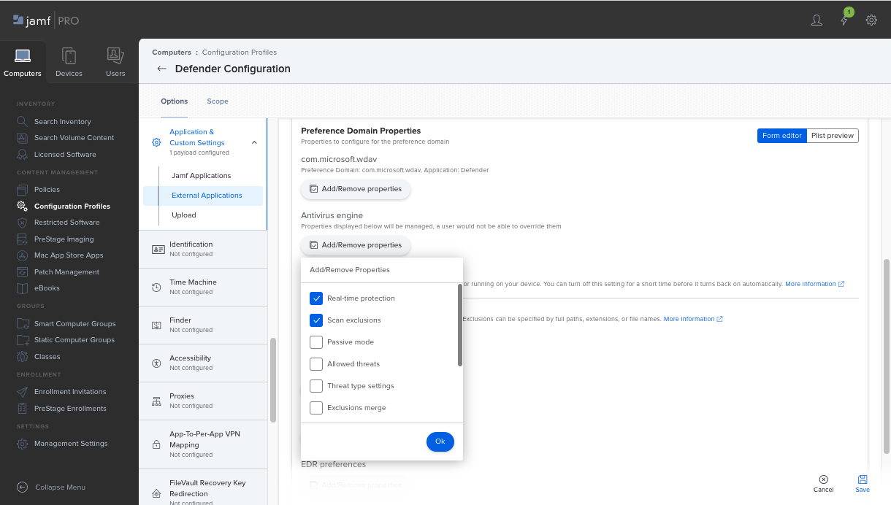

# <a name="set-up-the-microsoft-defender-for-endpoint-on-macos-policies-in-jamf-pro"></a><span data-ttu-id="9714a-104">Настройка конечной точки Microsoft Defender для политик macOS в Jamf Pro</span><span class="sxs-lookup"><span data-stu-id="9714a-104">Set up the Microsoft Defender for Endpoint on macOS policies in Jamf Pro</span></span>

[!INCLUDE [Microsoft 365 Defender rebranding](../../includes/microsoft-defender.md)]


<span data-ttu-id="9714a-105">**Область применения:**</span><span class="sxs-lookup"><span data-stu-id="9714a-105">**Applies to:**</span></span>

- [<span data-ttu-id="9714a-106">Защитник для конечной точки на Mac</span><span class="sxs-lookup"><span data-stu-id="9714a-106">Defender for Endpoint on Mac</span></span>](microsoft-defender-endpoint-mac.md)

<span data-ttu-id="9714a-107">На этой странице вы сможете найти необходимые действия, чтобы настроить политики macOS в Jamf Pro.</span><span class="sxs-lookup"><span data-stu-id="9714a-107">This page will guide you through the steps you need to take to set up macOS policies in Jamf Pro.</span></span>

<span data-ttu-id="9714a-108">Необходимо предпринять следующие действия:</span><span class="sxs-lookup"><span data-stu-id="9714a-108">You'll need to take the following steps:</span></span>

1. [<span data-ttu-id="9714a-109">Получите пакет onboarding Microsoft Defender для конечной точки</span><span class="sxs-lookup"><span data-stu-id="9714a-109">Get the Microsoft Defender for Endpoint onboarding package</span></span>](#step-1-get-the-microsoft-defender-for-endpoint-onboarding-package)

2. [<span data-ttu-id="9714a-110">Создание профиля конфигурации в Jamf Pro с помощью пакета onboarding</span><span class="sxs-lookup"><span data-stu-id="9714a-110">Create a configuration profile in Jamf Pro using the onboarding package</span></span>](#step-2-create-a-configuration-profile-in-jamf-pro-using-the-onboarding-package)

3. [<span data-ttu-id="9714a-111">Настройка параметров конечных точек Microsoft Defender</span><span class="sxs-lookup"><span data-stu-id="9714a-111">Configure Microsoft Defender for Endpoint settings</span></span>](#step-3-configure-microsoft-defender-for-endpoint-settings)

4. [<span data-ttu-id="9714a-112">Настройка параметров уведомлений Microsoft Defender для конечной точки</span><span class="sxs-lookup"><span data-stu-id="9714a-112">Configure Microsoft Defender for Endpoint notification settings</span></span>](#step-4-configure-notifications-settings)

5. [<span data-ttu-id="9714a-113">Настройка Microsoft AutoUpdate (MAU)</span><span class="sxs-lookup"><span data-stu-id="9714a-113">Configure Microsoft AutoUpdate (MAU)</span></span>](#step-5-configure-microsoft-autoupdate-mau)

6. [<span data-ttu-id="9714a-114">Предоставление полного доступа к диску Microsoft Defender для конечной точки</span><span class="sxs-lookup"><span data-stu-id="9714a-114">Grant full disk access to Microsoft Defender for Endpoint</span></span>](#step-6-grant-full-disk-access-to-microsoft-defender-for-endpoint)

7. [<span data-ttu-id="9714a-115">Утверждение расширения ядра для Microsoft Defender для конечной точки</span><span class="sxs-lookup"><span data-stu-id="9714a-115">Approve Kernel extension for Microsoft Defender for Endpoint</span></span>](#step-7-approve-kernel-extension-for-microsoft-defender-for-endpoint)

8. [<span data-ttu-id="9714a-116">Утверждение расширений системы для Microsoft Defender для конечной точки</span><span class="sxs-lookup"><span data-stu-id="9714a-116">Approve System extensions for Microsoft Defender for Endpoint</span></span>](#step-8-approve-system-extensions-for-microsoft-defender-for-endpoint)

9. [<span data-ttu-id="9714a-117">Настройка расширения сети</span><span class="sxs-lookup"><span data-stu-id="9714a-117">Configure Network Extension</span></span>](#step-9-configure-network-extension)

10. [<span data-ttu-id="9714a-118">Расписание сканирования с помощью Microsoft Defender для конечной точки на macOS</span><span class="sxs-lookup"><span data-stu-id="9714a-118">Schedule scans with Microsoft Defender for Endpoint on macOS</span></span>](/windows/security/threat-protection/microsoft-defender-atp/mac-schedule-scan-atp)

11. [<span data-ttu-id="9714a-119">Развертывание Microsoft Defender для конечной точки на macOS</span><span class="sxs-lookup"><span data-stu-id="9714a-119">Deploy Microsoft Defender for Endpoint on macOS</span></span>](#step-11-deploy-microsoft-defender-for-endpoint-on-macos)


## <a name="step-1-get-the-microsoft-defender-for-endpoint-onboarding-package"></a><span data-ttu-id="9714a-120">Шаг 1. Получить пакет onboarding Microsoft Defender для конечной точки</span><span class="sxs-lookup"><span data-stu-id="9714a-120">Step 1: Get the Microsoft Defender for Endpoint onboarding package</span></span>

1. <span data-ttu-id="9714a-121">В [Центр безопасности в Microsoft Defender](https://securitycenter.microsoft.com)перейдите **к Параметры > onboarding**.</span><span class="sxs-lookup"><span data-stu-id="9714a-121">In [Microsoft Defender Security Center](https://securitycenter.microsoft.com), navigate to **Settings > Onboarding**.</span></span>

2. <span data-ttu-id="9714a-122">Выберите macOS в качестве операционной системы и метод управления мобильными устройствами Microsoft Intune в качестве метода развертывания.</span><span class="sxs-lookup"><span data-stu-id="9714a-122">Select macOS as the operating system and Mobile Device Management / Microsoft Intune as the deployment method.</span></span>

    

3. <span data-ttu-id="9714a-124">Выберите **пакет загрузки** (WindowsDefenderATPOnboardingPackage.zip).</span><span class="sxs-lookup"><span data-stu-id="9714a-124">Select **Download onboarding package** (WindowsDefenderATPOnboardingPackage.zip).</span></span>

4. <span data-ttu-id="9714a-125">`WindowsDefenderATPOnboardingPackage.zip`Извлечение .</span><span class="sxs-lookup"><span data-stu-id="9714a-125">Extract `WindowsDefenderATPOnboardingPackage.zip`.</span></span>

5. <span data-ttu-id="9714a-126">Скопируйте файл в предпочтительное расположение.</span><span class="sxs-lookup"><span data-stu-id="9714a-126">Copy the file to your preferred location.</span></span> <span data-ttu-id="9714a-127">Пример: `C:\Users\JaneDoe_or_JohnDoe.contoso\Downloads\WindowsDefenderATPOnboardingPackage_macOS_MDM_contoso\jamf\WindowsDefenderATPOnboarding.plist`.</span><span class="sxs-lookup"><span data-stu-id="9714a-127">For example,  `C:\Users\JaneDoe_or_JohnDoe.contoso\Downloads\WindowsDefenderATPOnboardingPackage_macOS_MDM_contoso\jamf\WindowsDefenderATPOnboarding.plist`.</span></span>


## <a name="step-2-create-a-configuration-profile-in-jamf-pro-using-the-onboarding-package"></a><span data-ttu-id="9714a-128">Шаг 2. Создание профиля конфигурации в Jamf Pro с помощью бортового пакета</span><span class="sxs-lookup"><span data-stu-id="9714a-128">Step 2: Create a configuration profile in Jamf Pro using the onboarding package</span></span>

1. <span data-ttu-id="9714a-129">Найдите файл `WindowsDefenderATPOnboarding.plist` из предыдущего раздела.</span><span class="sxs-lookup"><span data-stu-id="9714a-129">Locate the file `WindowsDefenderATPOnboarding.plist` from the previous section.</span></span>

   


2. <span data-ttu-id="9714a-131">В панели мониторинга Jamf Pro выберите **New**.</span><span class="sxs-lookup"><span data-stu-id="9714a-131">In the Jamf Pro dashboard, select **New**.</span></span>

    

3. <span data-ttu-id="9714a-133">Введите следующие сведения:</span><span class="sxs-lookup"><span data-stu-id="9714a-133">Enter the following details:</span></span>

   <span data-ttu-id="9714a-134">**Общие**</span><span class="sxs-lookup"><span data-stu-id="9714a-134">**General**</span></span>
   - <span data-ttu-id="9714a-135">Имя: бортовая система MDATP для macOS</span><span class="sxs-lookup"><span data-stu-id="9714a-135">Name: MDATP onboarding for macOS</span></span>
   - <span data-ttu-id="9714a-136">Описание: MDATP EDR для macOS</span><span class="sxs-lookup"><span data-stu-id="9714a-136">Description: MDATP EDR onboarding for macOS</span></span>
   - <span data-ttu-id="9714a-137">Категории: None (нет)</span><span class="sxs-lookup"><span data-stu-id="9714a-137">Category: None</span></span>
   - <span data-ttu-id="9714a-138">Метод рассылки: установка автоматически</span><span class="sxs-lookup"><span data-stu-id="9714a-138">Distribution Method: Install Automatically</span></span>
   - <span data-ttu-id="9714a-139">Уровень: уровень компьютера</span><span class="sxs-lookup"><span data-stu-id="9714a-139">Level: Computer Level</span></span>

4. <span data-ttu-id="9714a-140">В **приложении & настраиваемые Параметры** выберите **Configure**.</span><span class="sxs-lookup"><span data-stu-id="9714a-140">In **Application & Custom Settings** select **Configure**.</span></span>

    

5. <span data-ttu-id="9714a-142">Выберите **Upload файл (PLIST-файл),** а затем **введите параметр Preference Domain:** `com.microsoft.wdav.atp` .</span><span class="sxs-lookup"><span data-stu-id="9714a-142">Select **Upload File (PLIST file)** then in **Preference Domain** enter: `com.microsoft.wdav.atp`.</span></span>

    

    

6. <span data-ttu-id="9714a-145">Выберите **Открыть** и выбрать файл вмеяния.</span><span class="sxs-lookup"><span data-stu-id="9714a-145">Select **Open** and select the onboarding file.</span></span>

    

7. <span data-ttu-id="9714a-147">Выберите **Upload**.</span><span class="sxs-lookup"><span data-stu-id="9714a-147">Select **Upload**.</span></span>

    

8. <span data-ttu-id="9714a-149">Выберите **вкладку Область.**</span><span class="sxs-lookup"><span data-stu-id="9714a-149">Select the **Scope** tab.</span></span>

    

9. <span data-ttu-id="9714a-151">Выберите целевые компьютеры.</span><span class="sxs-lookup"><span data-stu-id="9714a-151">Select the target computers.</span></span>

    

    

10. <span data-ttu-id="9714a-154">Нажмите **Сохранить**.</span><span class="sxs-lookup"><span data-stu-id="9714a-154">Select **Save**.</span></span>

    

    

11. <span data-ttu-id="9714a-157">Нажмите кнопку **Готово**.</span><span class="sxs-lookup"><span data-stu-id="9714a-157">Select **Done**.</span></span>

    

    

## <a name="step-3-configure-microsoft-defender-for-endpoint-settings"></a><span data-ttu-id="9714a-160">Шаг 3. Настройка защитника Майкрософт для параметров конечной точки</span><span class="sxs-lookup"><span data-stu-id="9714a-160">Step 3: Configure Microsoft Defender for Endpoint settings</span></span>

<span data-ttu-id="9714a-161">Вы можете использовать интерфейс JAMF Pro для редактирования отдельных параметров конфигурации Microsoft Defender или использовать устаревший метод, создав Plist конфигурации в текстовом редакторе и загрузив его в JAMF Pro.</span><span class="sxs-lookup"><span data-stu-id="9714a-161">You can either use JAMF Pro GUI to edit individual settings of the Microsoft Defender configuration, or use the legacy method by creating a configuration Plist in a text editor, and uploading it to JAMF Pro.</span></span>

<span data-ttu-id="9714a-162">Обратите внимание, что вы должны использовать точные параметры в качестве домена preference, Microsoft Defender использует только это имя и `com.microsoft.wdav`  `com.microsoft.wdav.ext` загружает управляемые параметры!</span><span class="sxs-lookup"><span data-stu-id="9714a-162">Note that you must use exact `com.microsoft.wdav` as the **Preference Domain**, Microsoft Defender uses only this name and `com.microsoft.wdav.ext` to load its managed settings!</span></span>

<span data-ttu-id="9714a-163">(Версия может использоваться в редких случаях, когда вы предпочитаете использовать метод GUI, но также необходимо настроить параметр, который еще не был добавлен в `com.microsoft.wdav.ext` схему.)</span><span class="sxs-lookup"><span data-stu-id="9714a-163">(The `com.microsoft.wdav.ext` version may be used in rare cases when you prefer to use GUI method, but also need to configure a setting that has not been added to the schema yet.)</span></span>

### <a name="gui-method"></a><span data-ttu-id="9714a-164">Метод GUI</span><span class="sxs-lookup"><span data-stu-id="9714a-164">GUI method</span></span>

1. <span data-ttu-id="9714a-165">Скачайте schema.jsфайл из GitHub Defender и [сохраните](https://github.com/microsoft/mdatp-xplat/tree/master/macos/schema) его в локальном файле:</span><span class="sxs-lookup"><span data-stu-id="9714a-165">Download schema.json file from [Defender's GitHub repository](https://github.com/microsoft/mdatp-xplat/tree/master/macos/schema) and save it to a local file:</span></span>

    ```bash
    curl -o ~/Documents/schema.json https://raw.githubusercontent.com/microsoft/mdatp-xplat/master/macos/schema/schema.json
    ```

2. <span data-ttu-id="9714a-166">Создайте новый профиль конфигурации в профиле компьютеров > конфигурации, введите следующие сведения на вкладке **General:**</span><span class="sxs-lookup"><span data-stu-id="9714a-166">Create a new Configuration Profile under Computers -> Configuration Profiles, enter the following details on the **General** tab:</span></span>

    

    - <span data-ttu-id="9714a-168">Имя: параметры конфигурации MDATP MDAV</span><span class="sxs-lookup"><span data-stu-id="9714a-168">Name: MDATP MDAV configuration settings</span></span>
    - <span data-ttu-id="9714a-169">Описание:\<blank\></span><span class="sxs-lookup"><span data-stu-id="9714a-169">Description:\<blank\></span></span>
    - <span data-ttu-id="9714a-170">Категория: Нет (по умолчанию)</span><span class="sxs-lookup"><span data-stu-id="9714a-170">Category: None (default)</span></span>
    - <span data-ttu-id="9714a-171">Уровень: уровень компьютера (по умолчанию)</span><span class="sxs-lookup"><span data-stu-id="9714a-171">Level: Computer Level (default)</span></span>
    - <span data-ttu-id="9714a-172">Метод рассылки: установка автоматически (по умолчанию)</span><span class="sxs-lookup"><span data-stu-id="9714a-172">Distribution Method: Install Automatically (default)</span></span>

3. <span data-ttu-id="9714a-173">Прокрутите вниз до **вкладки Application & custom Параметры,** выберите внешние **приложения,** нажмите кнопку **Добавить** и использовать настраиваемую схему в качестве источника для использования для домена предпочтений. </span><span class="sxs-lookup"><span data-stu-id="9714a-173">Scroll down to the **Application & Custom Settings** tab, select **External Applications**, click **Add** and use **Custom Schema** as Source to use for the preference domain.</span></span>

    

4. <span data-ttu-id="9714a-175">Введите в качестве домена настройки нажмите кнопку Добавить схему и Upload schema.jsфайл, `com.microsoft.wdav` загруженный на шаге  1. </span><span class="sxs-lookup"><span data-stu-id="9714a-175">Enter `com.microsoft.wdav` as the Preference Domain, click on **Add Schema** and **Upload** the schema.json file downloaded on Step 1.</span></span> <span data-ttu-id="9714a-176">Щелкните **Сохранить**.</span><span class="sxs-lookup"><span data-stu-id="9714a-176">Click **Save**.</span></span>

    

5. <span data-ttu-id="9714a-178">Все поддерживаемые параметры конфигурации Microsoft Defender можно увидеть ниже в **статье Preference Domain Properties.**</span><span class="sxs-lookup"><span data-stu-id="9714a-178">You can see all supported Microsoft Defender configuration settings below, under **Preference Domain Properties**.</span></span> <span data-ttu-id="9714a-179">Нажмите **кнопку Добавить или Удалить свойства,** чтобы выбрать параметры, которыми вы хотите управлять, и нажмите **кнопку Ок,** чтобы сохранить изменения.</span><span class="sxs-lookup"><span data-stu-id="9714a-179">Click **Add/Remove properties** to select the settings that you want to be managed, and click **Ok** to save your changes.</span></span> <span data-ttu-id="9714a-180">(Параметры невыбранный не будет включен в управляемой конфигурации, конечный пользователь сможет настроить эти параметры на своих машинах.)</span><span class="sxs-lookup"><span data-stu-id="9714a-180">(Settings left unselected will not be included into the managed configuration, an end user will be able to configure those settings on their machines.)</span></span>

    

6. <span data-ttu-id="9714a-182">Изменение значений параметров на нужные значения.</span><span class="sxs-lookup"><span data-stu-id="9714a-182">Change values of the settings to desired values.</span></span> <span data-ttu-id="9714a-183">Дополнительные сведения **можно нажать,** чтобы получить документацию для определенного параметра.</span><span class="sxs-lookup"><span data-stu-id="9714a-183">You can click **More information** to get documentation for a particular setting.</span></span> <span data-ttu-id="9714a-184">(Вы можете щелкнуть предварительный просмотр **списка Plist,** чтобы проверить, как будет выглядеть plist конфигурации.</span><span class="sxs-lookup"><span data-stu-id="9714a-184">(You may click **Plist preview** to inspect what the configuration plist will look like.</span></span> <span data-ttu-id="9714a-185">Щелкните **редактор формы,** чтобы вернуться к визуальному редактору.)</span><span class="sxs-lookup"><span data-stu-id="9714a-185">Click **Form editor** to return to the visual editor.)</span></span>

    

7. <span data-ttu-id="9714a-187">Выберите **вкладку Область.**</span><span class="sxs-lookup"><span data-stu-id="9714a-187">Select the **Scope** tab.</span></span>

    

8. <span data-ttu-id="9714a-189">Выберите **машинную группу Contoso.**</span><span class="sxs-lookup"><span data-stu-id="9714a-189">Select **Contoso's Machine Group**.</span></span>

9. <span data-ttu-id="9714a-190">Выберите **Добавить,** а затем **выберите Сохранить**.</span><span class="sxs-lookup"><span data-stu-id="9714a-190">Select **Add**, then select **Save**.</span></span>

    

    

10. <span data-ttu-id="9714a-193">Нажмите кнопку **Готово**.</span><span class="sxs-lookup"><span data-stu-id="9714a-193">Select **Done**.</span></span> <span data-ttu-id="9714a-194">Вы увидите новый профиль **Конфигурация**.</span><span class="sxs-lookup"><span data-stu-id="9714a-194">You'll see the new **Configuration profile**.</span></span>

    

<span data-ttu-id="9714a-196">Microsoft Defender со временем добавляет новые параметры.</span><span class="sxs-lookup"><span data-stu-id="9714a-196">Microsoft Defender adds new settings over time.</span></span> <span data-ttu-id="9714a-197">Эти новые параметры будут добавлены в схему, а новая версия будет опубликована в Github.</span><span class="sxs-lookup"><span data-stu-id="9714a-197">These new settings will be added to the schema, and a new version will be published to Github.</span></span>
<span data-ttu-id="9714a-198">Для обновления необходимо скачать обновленную схему, изменить существующий профиль конфигурации и изменить схему на вкладке **Application & Custom Параметры.** </span><span class="sxs-lookup"><span data-stu-id="9714a-198">All you need to do to have updates is to download an updated schema, edit existing configuration profile, and **Edit schema** at the **Application & Custom Settings** tab.</span></span>

### <a name="legacy-method"></a><span data-ttu-id="9714a-199">Устаревший метод</span><span class="sxs-lookup"><span data-stu-id="9714a-199">Legacy method</span></span>

1. <span data-ttu-id="9714a-200">Используйте следующие параметры конфигурации Microsoft Defender для конечных точек:</span><span class="sxs-lookup"><span data-stu-id="9714a-200">Use the following Microsoft Defender for Endpoint configuration settings:</span></span>

    - <span data-ttu-id="9714a-201">enableRealTimeProtection</span><span class="sxs-lookup"><span data-stu-id="9714a-201">enableRealTimeProtection</span></span>
    - <span data-ttu-id="9714a-202">passiveMode</span><span class="sxs-lookup"><span data-stu-id="9714a-202">passiveMode</span></span>

    >[!NOTE]
    ><span data-ttu-id="9714a-203">Не включено по умолчанию, если вы планируете запустить сторонний AV для macOS, установите `true` его.</span><span class="sxs-lookup"><span data-stu-id="9714a-203">Not turned on by default, if you are planning to run a third-party AV for macOS, set it to `true`.</span></span>

    - <span data-ttu-id="9714a-204">исключения</span><span class="sxs-lookup"><span data-stu-id="9714a-204">exclusions</span></span>
    - <span data-ttu-id="9714a-205">excludedPath</span><span class="sxs-lookup"><span data-stu-id="9714a-205">excludedPath</span></span>
    - <span data-ttu-id="9714a-206">excludedFileExtension</span><span class="sxs-lookup"><span data-stu-id="9714a-206">excludedFileExtension</span></span>
    - <span data-ttu-id="9714a-207">excludedFileName</span><span class="sxs-lookup"><span data-stu-id="9714a-207">excludedFileName</span></span>
    - <span data-ttu-id="9714a-208">exclusionsMergePolicy</span><span class="sxs-lookup"><span data-stu-id="9714a-208">exclusionsMergePolicy</span></span>
    - <span data-ttu-id="9714a-209">allowedThreats</span><span class="sxs-lookup"><span data-stu-id="9714a-209">allowedThreats</span></span>

    >[!NOTE]
    ><span data-ttu-id="9714a-210">EICAR находится в примере, если вы проходите проверку концепции, удалите ее, особенно если вы тестируете EICAR.</span><span class="sxs-lookup"><span data-stu-id="9714a-210">EICAR is on the sample, if you are going through a proof-of-concept, remove it especially if you are testing EICAR.</span></span>

    - <span data-ttu-id="9714a-211">disallowedThreatActions</span><span class="sxs-lookup"><span data-stu-id="9714a-211">disallowedThreatActions</span></span>
    - <span data-ttu-id="9714a-212">potentially_unwanted_application</span><span class="sxs-lookup"><span data-stu-id="9714a-212">potentially_unwanted_application</span></span>
    - <span data-ttu-id="9714a-213">archive_bomb</span><span class="sxs-lookup"><span data-stu-id="9714a-213">archive_bomb</span></span>
    - <span data-ttu-id="9714a-214">cloudService</span><span class="sxs-lookup"><span data-stu-id="9714a-214">cloudService</span></span>
    - <span data-ttu-id="9714a-215">automaticSampleSubmission</span><span class="sxs-lookup"><span data-stu-id="9714a-215">automaticSampleSubmission</span></span>
    - <span data-ttu-id="9714a-216">tags</span><span class="sxs-lookup"><span data-stu-id="9714a-216">tags</span></span>
    - <span data-ttu-id="9714a-217">hideStatusMenuIcon</span><span class="sxs-lookup"><span data-stu-id="9714a-217">hideStatusMenuIcon</span></span>

     <span data-ttu-id="9714a-218">Сведения см. в [списке свойств для профиля конфигурации Jamf.](mac-preferences.md#property-list-for-jamf-configuration-profile)</span><span class="sxs-lookup"><span data-stu-id="9714a-218">For information, see [Property list for Jamf configuration profile](mac-preferences.md#property-list-for-jamf-configuration-profile).</span></span>

     ```XML
     <?xml version="1.0" encoding="UTF-8"?>
     <!DOCTYPE plist PUBLIC "-//Apple//DTD PLIST 1.0//EN" "http://www.apple.com/DTDs/PropertyList-1.0.dtd">
     <plist version="1.0">
     <dict>
         <key>antivirusEngine</key>
         <dict>
             <key>enableRealTimeProtection</key>
             <true/>
             <key>passiveMode</key>
             <false/>
             <key>exclusions</key>
             <array>
                 <dict>
                     <key>$type</key>
                     <string>excludedPath</string>
                     <key>isDirectory</key>
                     <false/>
                     <key>path</key>
                     <string>/var/log/system.log</string>
                 </dict>
                 <dict>
                     <key>$type</key>
                     <string>excludedPath</string>
                     <key>isDirectory</key>
                     <true/>
                     <key>path</key>
                     <string>/home</string>
                 </dict>
                 <dict>
                     <key>$type</key>
                     <string>excludedFileExtension</string>
                     <key>extension</key>
                     <string>pdf</string>
                 </dict>
                 <dict>
                     <key>$type</key>
                     <string>excludedFileName</string>
                     <key>name</key>
                     <string>cat</string>
                 </dict>
             </array>
             <key>exclusionsMergePolicy</key>
             <string>merge</string>
             <key>allowedThreats</key>
             <array>
                 <string>EICAR-Test-File (not a virus)</string>
             </array>
             <key>disallowedThreatActions</key>
             <array>
                 <string>allow</string>
                 <string>restore</string>
             </array>
             <key>threatTypeSettings</key>
             <array>
                 <dict>
                     <key>key</key>
                     <string>potentially_unwanted_application</string>
                     <key>value</key>
                     <string>block</string>
                 </dict>
                 <dict>
                     <key>key</key>
                     <string>archive_bomb</string>
                     <key>value</key>
                     <string>audit</string>
                 </dict>
             </array>
             <key>threatTypeSettingsMergePolicy</key>
             <string>merge</string>
         </dict>
         <key>cloudService</key>
         <dict>
             <key>enabled</key>
             <true/>
             <key>diagnosticLevel</key>
             <string>optional</string>
             <key>automaticSampleSubmission</key>
             <true/>
         </dict>
         <key>edr</key>
         <dict>
             <key>tags</key>
             <array>
                 <dict>
                     <key>key</key>
                     <string>GROUP</string>
                     <key>value</key>
                     <string>ExampleTag</string>
                 </dict>
             </array>
         </dict>
         <key>userInterface</key>
         <dict>
             <key>hideStatusMenuIcon</key>
             <false/>
         </dict>
     </dict>
     </plist>
     ```

2. <span data-ttu-id="9714a-219">Сохраните файл как `MDATP_MDAV_configuration_settings.plist` .</span><span class="sxs-lookup"><span data-stu-id="9714a-219">Save the file as `MDATP_MDAV_configuration_settings.plist`.</span></span>

3. <span data-ttu-id="9714a-220">В панели мониторинга Jamf Pro откройте **компьютеры,** а также там **профили конфигурации.**</span><span class="sxs-lookup"><span data-stu-id="9714a-220">In the Jamf Pro dashboard, open **Computers**, and there **Configuration Profiles**.</span></span> <span data-ttu-id="9714a-221">Нажмите *кнопку* \* New (и перейдите на **вкладку General.**</span><span class="sxs-lookup"><span data-stu-id="9714a-221">Click \**New(* and switch to the **General** tab.</span></span>

    

4. <span data-ttu-id="9714a-223">Введите следующие сведения:</span><span class="sxs-lookup"><span data-stu-id="9714a-223">Enter the following details:</span></span>

    <span data-ttu-id="9714a-224">**Общие**</span><span class="sxs-lookup"><span data-stu-id="9714a-224">**General**</span></span>

    - <span data-ttu-id="9714a-225">Имя: параметры конфигурации MDATP MDAV</span><span class="sxs-lookup"><span data-stu-id="9714a-225">Name: MDATP MDAV configuration settings</span></span>
    - <span data-ttu-id="9714a-226">Описание:\<blank\></span><span class="sxs-lookup"><span data-stu-id="9714a-226">Description:\<blank\></span></span>
    - <span data-ttu-id="9714a-227">Категория: Нет (по умолчанию)</span><span class="sxs-lookup"><span data-stu-id="9714a-227">Category: None (default)</span></span>
    - <span data-ttu-id="9714a-228">Метод рассылки: установка автоматически (по умолчанию)</span><span class="sxs-lookup"><span data-stu-id="9714a-228">Distribution Method: Install Automatically(default)</span></span>
    - <span data-ttu-id="9714a-229">Уровень: уровень компьютера (по умолчанию)</span><span class="sxs-lookup"><span data-stu-id="9714a-229">Level: Computer Level(default)</span></span>

    

5. <span data-ttu-id="9714a-231">В **приложении & настраиваемые Параметры** выберите **Configure**.</span><span class="sxs-lookup"><span data-stu-id="9714a-231">In **Application & Custom Settings** select **Configure**.</span></span>

    

6. <span data-ttu-id="9714a-233">Выберите **Upload файл (PLIST-файл).**</span><span class="sxs-lookup"><span data-stu-id="9714a-233">Select **Upload File (PLIST file)**.</span></span>

    

7. <span data-ttu-id="9714a-235">В **домене Preferences** введите, а затем `com.microsoft.wdav` выберите Upload **PLIST File**.</span><span class="sxs-lookup"><span data-stu-id="9714a-235">In **Preferences Domain**, enter `com.microsoft.wdav`, then select  **Upload PLIST File**.</span></span>

    

8. <span data-ttu-id="9714a-237">Выберите **выберите файл**.</span><span class="sxs-lookup"><span data-stu-id="9714a-237">Select **Choose File**.</span></span>

    

9. <span data-ttu-id="9714a-239">Выберите **список MDATP_MDAV_configuration_settings.plist,** а затем **откройте**.</span><span class="sxs-lookup"><span data-stu-id="9714a-239">Select the **MDATP_MDAV_configuration_settings.plist**, then select **Open**.</span></span>

    

10. <span data-ttu-id="9714a-241">Выберите **Upload**.</span><span class="sxs-lookup"><span data-stu-id="9714a-241">Select **Upload**.</span></span>

    

    

    >[!NOTE]
    ><span data-ttu-id="9714a-244">Если вы загрузите файл Intune, вы получите следующую ошибку:</span><span class="sxs-lookup"><span data-stu-id="9714a-244">If you happen to upload the Intune file, you'll get the following error:</span></span><br>
    ><span data-ttu-id="9714a-245"></span><span class="sxs-lookup"><span data-stu-id="9714a-245"></span></span>


11. <span data-ttu-id="9714a-246">Нажмите **Сохранить**.</span><span class="sxs-lookup"><span data-stu-id="9714a-246">Select **Save**.</span></span>

    

12. <span data-ttu-id="9714a-248">Файл загружен.</span><span class="sxs-lookup"><span data-stu-id="9714a-248">The file is uploaded.</span></span>

    

    

13. <span data-ttu-id="9714a-251">Выберите **вкладку Область.**</span><span class="sxs-lookup"><span data-stu-id="9714a-251">Select the **Scope** tab.</span></span>

    

14. <span data-ttu-id="9714a-253">Выберите **машинную группу Contoso.**</span><span class="sxs-lookup"><span data-stu-id="9714a-253">Select **Contoso's Machine Group**.</span></span>

15. <span data-ttu-id="9714a-254">Выберите **Добавить,** а затем **выберите Сохранить**.</span><span class="sxs-lookup"><span data-stu-id="9714a-254">Select **Add**, then select **Save**.</span></span>

    

    

16. <span data-ttu-id="9714a-257">Нажмите кнопку **Готово**.</span><span class="sxs-lookup"><span data-stu-id="9714a-257">Select **Done**.</span></span> <span data-ttu-id="9714a-258">Вы увидите новый профиль **Конфигурация**.</span><span class="sxs-lookup"><span data-stu-id="9714a-258">You'll see the new **Configuration profile**.</span></span>

    

## <a name="step-4-configure-notifications-settings"></a><span data-ttu-id="9714a-260">Шаг 4. Настройка параметров уведомлений</span><span class="sxs-lookup"><span data-stu-id="9714a-260">Step 4: Configure notifications settings</span></span>

<span data-ttu-id="9714a-261">Эти действия применимы к macOS 10.15 (Catalina) или более новым.</span><span class="sxs-lookup"><span data-stu-id="9714a-261">These steps are applicable of macOS 10.15 (Catalina) or newer.</span></span>

1. <span data-ttu-id="9714a-262">В панели мониторинга Jamf Pro выберите **компьютеры,** а затем **профили конфигурации.**</span><span class="sxs-lookup"><span data-stu-id="9714a-262">In the Jamf Pro dashboard, select **Computers**, then **Configuration Profiles**.</span></span>

2. <span data-ttu-id="9714a-263">Нажмите **кнопку New** и введите следующие сведения для **Параметры**:</span><span class="sxs-lookup"><span data-stu-id="9714a-263">Click **New**, and enter the following details for **Options**:</span></span>

    - <span data-ttu-id="9714a-264">Tab **General:**</span><span class="sxs-lookup"><span data-stu-id="9714a-264">Tab **General**:</span></span>
        - <span data-ttu-id="9714a-265">**Имя:** параметры MDATP MDAV Notification</span><span class="sxs-lookup"><span data-stu-id="9714a-265">**Name**: MDATP MDAV Notification settings</span></span>
        - <span data-ttu-id="9714a-266">**Описание:** macOS 10.15 (Catalina) или более новый</span><span class="sxs-lookup"><span data-stu-id="9714a-266">**Description**: macOS 10.15 (Catalina) or newer</span></span>
        - <span data-ttu-id="9714a-267">**Категория:** Нет *(по умолчанию)*</span><span class="sxs-lookup"><span data-stu-id="9714a-267">**Category**: None *(default)*</span></span>
        - <span data-ttu-id="9714a-268">**Метод рассылки:** Установка автоматически *(по умолчанию)*</span><span class="sxs-lookup"><span data-stu-id="9714a-268">**Distribution Method**: Install Automatically *(default)*</span></span>
        - <span data-ttu-id="9714a-269">**Уровень**: Уровень компьютера *(по умолчанию)*</span><span class="sxs-lookup"><span data-stu-id="9714a-269">**Level**: Computer Level *(default)*</span></span>

        

    - <span data-ttu-id="9714a-271">Tab **Notifications,** **нажмите кнопку Добавить** и введите следующие значения:</span><span class="sxs-lookup"><span data-stu-id="9714a-271">Tab **Notifications**, click **Add**, and enter the following values:</span></span>
        - <span data-ttu-id="9714a-272">**Bundle ID:**`com.microsoft.wdav.tray`</span><span class="sxs-lookup"><span data-stu-id="9714a-272">**Bundle ID**: `com.microsoft.wdav.tray`</span></span>
        - <span data-ttu-id="9714a-273">**Критические оповещения:** нажмите **кнопку Отключение**</span><span class="sxs-lookup"><span data-stu-id="9714a-273">**Critical Alerts**: Click **Disable**</span></span>
        - <span data-ttu-id="9714a-274">**Уведомления:** щелкните **Включить**</span><span class="sxs-lookup"><span data-stu-id="9714a-274">**Notifications**: Click **Enable**</span></span>
        - <span data-ttu-id="9714a-275">**Тип оповещения баннера:** **Выберите включить и** временно **(по** *умолчанию)*</span><span class="sxs-lookup"><span data-stu-id="9714a-275">**Banner alert type**: Select **Include** and **Temporary** *(default)*</span></span>
        - <span data-ttu-id="9714a-276">**Уведомления на экране блокировки:** нажмите кнопку **Скрыть**</span><span class="sxs-lookup"><span data-stu-id="9714a-276">**Notifications on lock screen**: Click **Hide**</span></span>
        - <span data-ttu-id="9714a-277">**Уведомления в Центре уведомлений:** щелкните **отображение**</span><span class="sxs-lookup"><span data-stu-id="9714a-277">**Notifications in Notification Center**: Click **Display**</span></span>
        - <span data-ttu-id="9714a-278">**Значок приложения Badge:** Щелкните **Дисплей**</span><span class="sxs-lookup"><span data-stu-id="9714a-278">**Badge app icon**: Click **Display**</span></span>

        

    - <span data-ttu-id="9714a-280">Tab **Notifications**, **щелкните Добавить** еще раз, прокрутите вниз, чтобы **новые уведомления Параметры**</span><span class="sxs-lookup"><span data-stu-id="9714a-280">Tab **Notifications**, click **Add** one more time, scroll down to **New Notifications Settings**</span></span>
        - <span data-ttu-id="9714a-281">**Bundle ID:**`com.microsoft.autoupdate2`</span><span class="sxs-lookup"><span data-stu-id="9714a-281">**Bundle ID**: `com.microsoft.autoupdate2`</span></span>
        - <span data-ttu-id="9714a-282">Настройка остальных параметров на те же значения, что и выше</span><span class="sxs-lookup"><span data-stu-id="9714a-282">Configure the rest of the settings to the same values as above</span></span>

        

        <span data-ttu-id="9714a-284">Обратите внимание, что теперь у вас есть две "таблицы" с конфигурациями уведомлений, одна для bundle **ID: com.microsoft.wdav.tray** и другая для **Bundle ID: com.microsoft.autoupdate2**.</span><span class="sxs-lookup"><span data-stu-id="9714a-284">Note that now you have two 'tables' with notification configurations, one for **Bundle ID: com.microsoft.wdav.tray**, and another for **Bundle ID: com.microsoft.autoupdate2**.</span></span> <span data-ttu-id="9714a-285">Хотя вы можете настроить параметры оповещения в зависимости от ваших требований, набор ID должен быть точно таким же, как описано ранее, и **включить** переключатель должен быть **включен** для **уведомлений**.</span><span class="sxs-lookup"><span data-stu-id="9714a-285">While you can configure alert settings per your requirements, Bundle IDs must be exactly the same as described before, and **Include** switch must be **On** for **Notifications**.</span></span>

3. <span data-ttu-id="9714a-286">Выберите **вкладку Область,** а **затем** добавьте .</span><span class="sxs-lookup"><span data-stu-id="9714a-286">Select the **Scope** tab, then select **Add**.</span></span>

    

4. <span data-ttu-id="9714a-288">Выберите **машинную группу Contoso.**</span><span class="sxs-lookup"><span data-stu-id="9714a-288">Select **Contoso's Machine Group**.</span></span>

5. <span data-ttu-id="9714a-289">Выберите **Добавить,** а затем **выберите Сохранить**.</span><span class="sxs-lookup"><span data-stu-id="9714a-289">Select **Add**, then select **Save**.</span></span>

    

    

6. <span data-ttu-id="9714a-292">Нажмите кнопку **Готово**.</span><span class="sxs-lookup"><span data-stu-id="9714a-292">Select **Done**.</span></span> <span data-ttu-id="9714a-293">Вы увидите новый профиль **Конфигурация**.</span><span class="sxs-lookup"><span data-stu-id="9714a-293">You'll see the new **Configuration profile**.</span></span>
    <span data-ttu-id="9714a-294"></span><span class="sxs-lookup"><span data-stu-id="9714a-294"></span></span>

## <a name="step-5-configure-microsoft-autoupdate-mau"></a><span data-ttu-id="9714a-295">Шаг 5. Настройка Microsoft AutoUpdate (MAU)</span><span class="sxs-lookup"><span data-stu-id="9714a-295">Step 5: Configure Microsoft AutoUpdate (MAU)</span></span>

1. <span data-ttu-id="9714a-296">Используйте следующие параметры конфигурации Microsoft Defender для конечных точек:</span><span class="sxs-lookup"><span data-stu-id="9714a-296">Use the following Microsoft Defender for Endpoint configuration settings:</span></span>

      ```XML
   <?xml version="1.0" encoding="UTF-8"?>
   <!DOCTYPE plist PUBLIC "-//Apple//DTD PLIST 1.0//EN" "http://www.apple.com/DTDs/PropertyList-1.0.dtd">
   <plist version="1.0">
   <dict>
    <key>ChannelName</key>
    <string>Current</string>
    <key>HowToCheck</key>
    <string>AutomaticDownload</string>
    <key>EnableCheckForUpdatesButton</key>
    <true/>
    <key>DisableInsiderCheckbox</key>
    <false/>
    <key>SendAllTelemetryEnabled</key>
    <true/>
   </dict>
   </plist>
   ```

2. <span data-ttu-id="9714a-297">Сохраните его как `MDATP_MDAV_MAU_settings.plist` .</span><span class="sxs-lookup"><span data-stu-id="9714a-297">Save it as `MDATP_MDAV_MAU_settings.plist`.</span></span>

3. <span data-ttu-id="9714a-298">В панели мониторинга Jamf Pro выберите **General**.</span><span class="sxs-lookup"><span data-stu-id="9714a-298">In the Jamf Pro dashboard, select **General**.</span></span>

    

4. <span data-ttu-id="9714a-300">Введите следующие сведения:</span><span class="sxs-lookup"><span data-stu-id="9714a-300">Enter the following details:</span></span>

    <span data-ttu-id="9714a-301">**Общие**</span><span class="sxs-lookup"><span data-stu-id="9714a-301">**General**</span></span>

    - <span data-ttu-id="9714a-302">Имя: параметры MDATP MDAV MAU</span><span class="sxs-lookup"><span data-stu-id="9714a-302">Name: MDATP MDAV MAU settings</span></span>
    - <span data-ttu-id="9714a-303">Описание. Параметры Microsoft AutoUpdate для MDATP для macOS</span><span class="sxs-lookup"><span data-stu-id="9714a-303">Description: Microsoft AutoUpdate settings for MDATP for macOS</span></span>
    - <span data-ttu-id="9714a-304">Категория: Нет (по умолчанию)</span><span class="sxs-lookup"><span data-stu-id="9714a-304">Category: None (default)</span></span>
    - <span data-ttu-id="9714a-305">Метод рассылки: установка автоматически (по умолчанию)</span><span class="sxs-lookup"><span data-stu-id="9714a-305">Distribution Method: Install Automatically(default)</span></span>
    - <span data-ttu-id="9714a-306">Уровень: уровень компьютера (по умолчанию)</span><span class="sxs-lookup"><span data-stu-id="9714a-306">Level: Computer Level(default)</span></span>

5. <span data-ttu-id="9714a-307">В **приложении & настраиваемые Параметры** выберите **Configure**.</span><span class="sxs-lookup"><span data-stu-id="9714a-307">In **Application & Custom Settings** select **Configure**.</span></span>

    

6. <span data-ttu-id="9714a-309">Выберите **Upload файл (PLIST-файл).**</span><span class="sxs-lookup"><span data-stu-id="9714a-309">Select **Upload File (PLIST file)**.</span></span>

    

7. <span data-ttu-id="9714a-311">В **домене Preference** введите: `com.microsoft.autoupdate2` затем выберите Upload **PLIST File**.</span><span class="sxs-lookup"><span data-stu-id="9714a-311">In **Preference Domain** enter: `com.microsoft.autoupdate2`, then select **Upload PLIST File**.</span></span>

    

8. <span data-ttu-id="9714a-313">Выберите **выберите файл**.</span><span class="sxs-lookup"><span data-stu-id="9714a-313">Select **Choose File**.</span></span>

    

9. <span data-ttu-id="9714a-315">Выберите **MDATP_MDAV_MAU_settings.plist**.</span><span class="sxs-lookup"><span data-stu-id="9714a-315">Select **MDATP_MDAV_MAU_settings.plist**.</span></span>

    

10. <span data-ttu-id="9714a-317">Выберите **Upload**.</span><span class="sxs-lookup"><span data-stu-id="9714a-317">Select **Upload**.</span></span>
    <span data-ttu-id="9714a-318"></span><span class="sxs-lookup"><span data-stu-id="9714a-318"></span></span>

    

11. <span data-ttu-id="9714a-320">Нажмите **Сохранить**.</span><span class="sxs-lookup"><span data-stu-id="9714a-320">Select **Save**.</span></span>

    

12. <span data-ttu-id="9714a-322">Выберите **вкладку Область.**</span><span class="sxs-lookup"><span data-stu-id="9714a-322">Select the **Scope** tab.</span></span>

     

13. <span data-ttu-id="9714a-324">Нажмите кнопку **Добавить**.</span><span class="sxs-lookup"><span data-stu-id="9714a-324">Select **Add**.</span></span>

    

    

    

14. <span data-ttu-id="9714a-328">Нажмите кнопку **Готово**.</span><span class="sxs-lookup"><span data-stu-id="9714a-328">Select **Done**.</span></span>

    

## <a name="step-6-grant-full-disk-access-to-microsoft-defender-for-endpoint"></a><span data-ttu-id="9714a-330">Шаг 6. Предоставление полного доступа к диску Microsoft Defender для конечной точки</span><span class="sxs-lookup"><span data-stu-id="9714a-330">Step 6: Grant full disk access to Microsoft Defender for Endpoint</span></span>

1. <span data-ttu-id="9714a-331">В панели мониторинга Jamf Pro выберите **профили конфигурации.**</span><span class="sxs-lookup"><span data-stu-id="9714a-331">In the Jamf Pro dashboard, select **Configuration Profiles**.</span></span>

    

2. <span data-ttu-id="9714a-333">Выберите **+ Новый**.</span><span class="sxs-lookup"><span data-stu-id="9714a-333">Select **+ New**.</span></span>

3. <span data-ttu-id="9714a-334">Введите следующие сведения:</span><span class="sxs-lookup"><span data-stu-id="9714a-334">Enter the following details:</span></span>

    <span data-ttu-id="9714a-335">**Общие**</span><span class="sxs-lookup"><span data-stu-id="9714a-335">**General**</span></span>
    - <span data-ttu-id="9714a-336">Имя: MDATP MDAV — предоставление полного доступа к EDR и AV</span><span class="sxs-lookup"><span data-stu-id="9714a-336">Name: MDATP MDAV - grant Full Disk Access to EDR and AV</span></span>
    - <span data-ttu-id="9714a-337">Описание. Для macOS Catalina или более нового управления политикой конфиденциальности</span><span class="sxs-lookup"><span data-stu-id="9714a-337">Description: On macOS Catalina or newer, the new Privacy Preferences Policy Control</span></span>
    - <span data-ttu-id="9714a-338">Категории: None (нет)</span><span class="sxs-lookup"><span data-stu-id="9714a-338">Category: None</span></span>
    - <span data-ttu-id="9714a-339">Метод рассылки: установка автоматически</span><span class="sxs-lookup"><span data-stu-id="9714a-339">Distribution method: Install Automatically</span></span>
    - <span data-ttu-id="9714a-340">Уровень: уровень компьютера</span><span class="sxs-lookup"><span data-stu-id="9714a-340">Level: Computer level</span></span>


    

4. <span data-ttu-id="9714a-342">В **Настройка политики настройки предпочтений конфиденциальности выберите** **Настройка**.</span><span class="sxs-lookup"><span data-stu-id="9714a-342">In **Configure Privacy Preferences Policy Control** select **Configure**.</span></span>

    

5. <span data-ttu-id="9714a-344">В правилах управления **политиками конфиденциальности** введите следующие сведения:</span><span class="sxs-lookup"><span data-stu-id="9714a-344">In **Privacy Preferences Policy Control**, enter the following details:</span></span>

    - <span data-ttu-id="9714a-345">Идентификатор: `com.microsoft.wdav`</span><span class="sxs-lookup"><span data-stu-id="9714a-345">Identifier: `com.microsoft.wdav`</span></span>
    - <span data-ttu-id="9714a-346">Тип идентификатора: идентификатор пакета</span><span class="sxs-lookup"><span data-stu-id="9714a-346">Identifier Type: Bundle ID</span></span>
    - <span data-ttu-id="9714a-347">Требование кода: `identifier "com.microsoft.wdav" and anchor apple generic and certificate 1[field.1.2.840.113635.100.6.2.6] /* exists */ and certificate leaf[field.1.2.840.113635.100.6.1.13] /* exists */ and certificate leaf[subject.OU] = UBF8T346G9`</span><span class="sxs-lookup"><span data-stu-id="9714a-347">Code Requirement: `identifier "com.microsoft.wdav" and anchor apple generic and certificate 1[field.1.2.840.113635.100.6.2.6] /* exists */ and certificate leaf[field.1.2.840.113635.100.6.1.13] /* exists */ and certificate leaf[subject.OU] = UBF8T346G9`</span></span>


    

6. <span data-ttu-id="9714a-349">Выберите **+ Добавить**.</span><span class="sxs-lookup"><span data-stu-id="9714a-349">Select **+ Add**.</span></span>

    

    - <span data-ttu-id="9714a-351">В приложении или службе: установите **systemPolicyAllFiles**</span><span class="sxs-lookup"><span data-stu-id="9714a-351">Under App or service: Set to **SystemPolicyAllFiles**</span></span>

    - <span data-ttu-id="9714a-352">В статье "Доступ": набор **разрешить**</span><span class="sxs-lookup"><span data-stu-id="9714a-352">Under "access": Set to **Allow**</span></span>

7. <span data-ttu-id="9714a-353">Выберите **Сохранить** (не тот, который внизу справа).</span><span class="sxs-lookup"><span data-stu-id="9714a-353">Select **Save** (not the one at the bottom right).</span></span>

    

8. <span data-ttu-id="9714a-355">Щелкните `+` знак рядом с **доступом к приложению,** чтобы добавить новую запись.</span><span class="sxs-lookup"><span data-stu-id="9714a-355">Click the `+` sign next to **App Access** to add a new entry.</span></span>

    

9. <span data-ttu-id="9714a-357">Введите следующие сведения:</span><span class="sxs-lookup"><span data-stu-id="9714a-357">Enter the following details:</span></span>

    - <span data-ttu-id="9714a-358">Идентификатор: `com.microsoft.wdav.epsext`</span><span class="sxs-lookup"><span data-stu-id="9714a-358">Identifier: `com.microsoft.wdav.epsext`</span></span>
    - <span data-ttu-id="9714a-359">Тип идентификатора: идентификатор пакета</span><span class="sxs-lookup"><span data-stu-id="9714a-359">Identifier Type: Bundle ID</span></span>
    - <span data-ttu-id="9714a-360">Требование кода: `identifier "com.microsoft.wdav.epsext" and anchor apple generic and certificate 1[field.1.2.840.113635.100.6.2.6] /* exists */ and certificate leaf[field.1.2.840.113635.100.6.1.13] /* exists */ and certificate leaf[subject.OU] = UBF8T346G9`</span><span class="sxs-lookup"><span data-stu-id="9714a-360">Code Requirement: `identifier "com.microsoft.wdav.epsext" and anchor apple generic and certificate 1[field.1.2.840.113635.100.6.2.6] /* exists */ and certificate leaf[field.1.2.840.113635.100.6.1.13] /* exists */ and certificate leaf[subject.OU] = UBF8T346G9`</span></span>

10. <span data-ttu-id="9714a-361">Выберите **+ Добавить**.</span><span class="sxs-lookup"><span data-stu-id="9714a-361">Select **+ Add**.</span></span>

    

    - <span data-ttu-id="9714a-363">В приложении или службе: установите **systemPolicyAllFiles**</span><span class="sxs-lookup"><span data-stu-id="9714a-363">Under App or service: Set to **SystemPolicyAllFiles**</span></span>

    - <span data-ttu-id="9714a-364">В статье "Доступ": набор **разрешить**</span><span class="sxs-lookup"><span data-stu-id="9714a-364">Under "access": Set to **Allow**</span></span>

11. <span data-ttu-id="9714a-365">Выберите **Сохранить** (не тот, который внизу справа).</span><span class="sxs-lookup"><span data-stu-id="9714a-365">Select **Save** (not the one at the bottom right).</span></span>

    

12. <span data-ttu-id="9714a-367">Выберите **вкладку Область.**</span><span class="sxs-lookup"><span data-stu-id="9714a-367">Select the **Scope** tab.</span></span>

    

13. <span data-ttu-id="9714a-369">Выберите **+ Добавить**.</span><span class="sxs-lookup"><span data-stu-id="9714a-369">Select **+ Add**.</span></span>

    

14. <span data-ttu-id="9714a-371">Выберите **группы** компьютеров > **под названием** группы > **выберите MachineGroup Contoso.**</span><span class="sxs-lookup"><span data-stu-id="9714a-371">Select **Computer Groups** > under **Group Name** > select **Contoso's MachineGroup**.</span></span>

    

15. <span data-ttu-id="9714a-373">Нажмите кнопку **Добавить**.</span><span class="sxs-lookup"><span data-stu-id="9714a-373">Select **Add**.</span></span>

16. <span data-ttu-id="9714a-374">Нажмите **Сохранить**.</span><span class="sxs-lookup"><span data-stu-id="9714a-374">Select **Save**.</span></span>

17. <span data-ttu-id="9714a-375">Нажмите кнопку **Готово**.</span><span class="sxs-lookup"><span data-stu-id="9714a-375">Select **Done**.</span></span>

    

    

<span data-ttu-id="9714a-378">Кроме того, вы можете скачать [fulldisk.mobileconfig](https://github.com/microsoft/mdatp-xplat/blob/master/macos/mobileconfig/profiles/fulldisk.mobileconfig) и загрузить его в профили конфигурации JAMF, как описано в развертывании пользовательских профилей конфигурации с помощью [Jamf Pro| Метод 2. Upload профиль конфигурации в Jamf Pro](https://www.jamf.com/jamf-nation/articles/648/deploying-custom-configuration-profiles-using-jamf-pro).</span><span class="sxs-lookup"><span data-stu-id="9714a-378">Alternatively, you can download [fulldisk.mobileconfig](https://github.com/microsoft/mdatp-xplat/blob/master/macos/mobileconfig/profiles/fulldisk.mobileconfig) and upload it to JAMF Configuration Profiles as described in [Deploying Custom Configuration Profiles using Jamf Pro|Method 2: Upload a Configuration Profile to Jamf Pro](https://www.jamf.com/jamf-nation/articles/648/deploying-custom-configuration-profiles-using-jamf-pro).</span></span>

## <a name="step-7-approve-kernel-extension-for-microsoft-defender-for-endpoint"></a><span data-ttu-id="9714a-379">Шаг 7. Утверждение расширения ядра для Microsoft Defender для конечной точки</span><span class="sxs-lookup"><span data-stu-id="9714a-379">Step 7: Approve Kernel extension for Microsoft Defender for Endpoint</span></span>

> [!CAUTION]
> <span data-ttu-id="9714a-380">Устройства Apple Silicon (M1) не поддерживают KEXT.</span><span class="sxs-lookup"><span data-stu-id="9714a-380">Apple Silicon (M1) devices do not support KEXT.</span></span> <span data-ttu-id="9714a-381">Установка профиля конфигурации, состоящего из политик KEXT, не будет работать на этих устройствах.</span><span class="sxs-lookup"><span data-stu-id="9714a-381">Installation of a configuration profile consisting KEXT policies will fail on these devices.</span></span>

1. <span data-ttu-id="9714a-382">В **профилях конфигурации** выберите **+ New**.</span><span class="sxs-lookup"><span data-stu-id="9714a-382">In the **Configuration Profiles**, select **+ New**.</span></span>

    

2. <span data-ttu-id="9714a-384">Введите следующие сведения:</span><span class="sxs-lookup"><span data-stu-id="9714a-384">Enter the following details:</span></span>

    <span data-ttu-id="9714a-385">**Общие**</span><span class="sxs-lookup"><span data-stu-id="9714a-385">**General**</span></span>

    - <span data-ttu-id="9714a-386">Имя. Расширение Ядра MDAV MDAV</span><span class="sxs-lookup"><span data-stu-id="9714a-386">Name: MDATP MDAV Kernel Extension</span></span>
    - <span data-ttu-id="9714a-387">Описание: расширение ядра MDATP (kext)</span><span class="sxs-lookup"><span data-stu-id="9714a-387">Description: MDATP kernel extension (kext)</span></span>
    - <span data-ttu-id="9714a-388">Категории: None (нет)</span><span class="sxs-lookup"><span data-stu-id="9714a-388">Category: None</span></span>
    - <span data-ttu-id="9714a-389">Метод рассылки: установка автоматически</span><span class="sxs-lookup"><span data-stu-id="9714a-389">Distribution Method: Install Automatically</span></span>
    - <span data-ttu-id="9714a-390">Уровень: уровень компьютера</span><span class="sxs-lookup"><span data-stu-id="9714a-390">Level: Computer Level</span></span>

    

3. <span data-ttu-id="9714a-392">В **Настройка утвержденных расширений ядра** выберите **Настройка**.</span><span class="sxs-lookup"><span data-stu-id="9714a-392">In **Configure Approved Kernel Extensions** select **Configure**.</span></span>

    


4. <span data-ttu-id="9714a-394">В **утвержденных расширениях ядра** введите следующие сведения:</span><span class="sxs-lookup"><span data-stu-id="9714a-394">In **Approved Kernel Extensions** Enter the following details:</span></span>

    - <span data-ttu-id="9714a-395">Имя отображения: Корпорация Майкрософт.</span><span class="sxs-lookup"><span data-stu-id="9714a-395">Display Name: Microsoft Corp.</span></span>
    - <span data-ttu-id="9714a-396">ID команды: UBF8T346G9</span><span class="sxs-lookup"><span data-stu-id="9714a-396">Team ID: UBF8T346G9</span></span>

    

5. <span data-ttu-id="9714a-398">Выберите **вкладку Область.**</span><span class="sxs-lookup"><span data-stu-id="9714a-398">Select the **Scope** tab.</span></span>

    

6. <span data-ttu-id="9714a-400">Выберите **+ Добавить**.</span><span class="sxs-lookup"><span data-stu-id="9714a-400">Select **+ Add**.</span></span>

7. <span data-ttu-id="9714a-401">Выберите **группы** > **в соответствии с названием** группы > выберите **группу машин Contoso.**</span><span class="sxs-lookup"><span data-stu-id="9714a-401">Select **Computer Groups** > under **Group Name** > select **Contoso's Machine Group**.</span></span>

8. <span data-ttu-id="9714a-402">Выберите **+ Добавить**.</span><span class="sxs-lookup"><span data-stu-id="9714a-402">Select **+ Add**.</span></span>

    

9. <span data-ttu-id="9714a-404">Нажмите **Сохранить**.</span><span class="sxs-lookup"><span data-stu-id="9714a-404">Select **Save**.</span></span>

    

10. <span data-ttu-id="9714a-406">Нажмите кнопку **Готово**.</span><span class="sxs-lookup"><span data-stu-id="9714a-406">Select **Done**.</span></span>

    

<span data-ttu-id="9714a-408">Кроме того, вы можете скачать [kext.mobileconfig](https://github.com/microsoft/mdatp-xplat/blob/master/macos/mobileconfig/profiles/kext.mobileconfig) и загрузить его в профили конфигурации JAMF, как описано в развертывании пользовательских профилей конфигурации с помощью [Jamf Pro| Метод 2. Upload профиль конфигурации в Jamf Pro](https://www.jamf.com/jamf-nation/articles/648/deploying-custom-configuration-profiles-using-jamf-pro).</span><span class="sxs-lookup"><span data-stu-id="9714a-408">Alternatively, you can download [kext.mobileconfig](https://github.com/microsoft/mdatp-xplat/blob/master/macos/mobileconfig/profiles/kext.mobileconfig) and upload it to JAMF Configuration Profiles as described in [Deploying Custom Configuration Profiles using Jamf Pro|Method 2: Upload a Configuration Profile to Jamf Pro](https://www.jamf.com/jamf-nation/articles/648/deploying-custom-configuration-profiles-using-jamf-pro).</span></span>

## <a name="step-8-approve-system-extensions-for-microsoft-defender-for-endpoint"></a><span data-ttu-id="9714a-409">Шаг 8. Утверждение расширений системы для Microsoft Defender для конечной точки</span><span class="sxs-lookup"><span data-stu-id="9714a-409">Step 8: Approve System extensions for Microsoft Defender for Endpoint</span></span>

1. <span data-ttu-id="9714a-410">В **профилях конфигурации** выберите **+ New**.</span><span class="sxs-lookup"><span data-stu-id="9714a-410">In the **Configuration Profiles**, select **+ New**.</span></span>

    

2. <span data-ttu-id="9714a-412">Введите следующие сведения:</span><span class="sxs-lookup"><span data-stu-id="9714a-412">Enter the following details:</span></span>

    <span data-ttu-id="9714a-413">**Общие**</span><span class="sxs-lookup"><span data-stu-id="9714a-413">**General**</span></span>

    - <span data-ttu-id="9714a-414">Имя: MDATP MDAV System Extensions</span><span class="sxs-lookup"><span data-stu-id="9714a-414">Name: MDATP MDAV System Extensions</span></span>
    - <span data-ttu-id="9714a-415">Описание: расширения системы MDATP</span><span class="sxs-lookup"><span data-stu-id="9714a-415">Description: MDATP system extensions</span></span>
    - <span data-ttu-id="9714a-416">Категории: None (нет)</span><span class="sxs-lookup"><span data-stu-id="9714a-416">Category: None</span></span>
    - <span data-ttu-id="9714a-417">Метод рассылки: установка автоматически</span><span class="sxs-lookup"><span data-stu-id="9714a-417">Distribution Method: Install Automatically</span></span>
    - <span data-ttu-id="9714a-418">Уровень: уровень компьютера</span><span class="sxs-lookup"><span data-stu-id="9714a-418">Level: Computer Level</span></span>

    

3. <span data-ttu-id="9714a-420">В **расширении системы** выберите **Настройка**.</span><span class="sxs-lookup"><span data-stu-id="9714a-420">In **System Extensions** select **Configure**.</span></span>

   

4. <span data-ttu-id="9714a-422">В **расширении системы введите** следующие сведения:</span><span class="sxs-lookup"><span data-stu-id="9714a-422">In **System Extensions** enter the following details:</span></span>

   - <span data-ttu-id="9714a-423">Имя отображения: расширения системы Microsoft Corp.</span><span class="sxs-lookup"><span data-stu-id="9714a-423">Display Name: Microsoft Corp. System Extensions</span></span>
   - <span data-ttu-id="9714a-424">Типы расширения системы: разрешенные расширения системы</span><span class="sxs-lookup"><span data-stu-id="9714a-424">System Extension Types: Allowed System Extensions</span></span>
   - <span data-ttu-id="9714a-425">Идентификатор команды: UBF8T346G9</span><span class="sxs-lookup"><span data-stu-id="9714a-425">Team Identifier: UBF8T346G9</span></span>
   - <span data-ttu-id="9714a-426">Разрешенные расширения системы:</span><span class="sxs-lookup"><span data-stu-id="9714a-426">Allowed System Extensions:</span></span>
     - <span data-ttu-id="9714a-427">**com.microsoft.wdav.epsext**</span><span class="sxs-lookup"><span data-stu-id="9714a-427">**com.microsoft.wdav.epsext**</span></span>
     - <span data-ttu-id="9714a-428">**com.microsoft.wdav.netext**</span><span class="sxs-lookup"><span data-stu-id="9714a-428">**com.microsoft.wdav.netext**</span></span>

    

5. <span data-ttu-id="9714a-430">Выберите **вкладку Область.**</span><span class="sxs-lookup"><span data-stu-id="9714a-430">Select the **Scope** tab.</span></span>

    

6. <span data-ttu-id="9714a-432">Выберите **+ Добавить**.</span><span class="sxs-lookup"><span data-stu-id="9714a-432">Select **+ Add**.</span></span>

7. <span data-ttu-id="9714a-433">Выберите **группы** > **в соответствии с названием** группы > выберите **группу машин Contoso.**</span><span class="sxs-lookup"><span data-stu-id="9714a-433">Select **Computer Groups** > under **Group Name** > select **Contoso's Machine Group**.</span></span>

8. <span data-ttu-id="9714a-434">Выберите **+ Добавить**.</span><span class="sxs-lookup"><span data-stu-id="9714a-434">Select **+ Add**.</span></span>

   

9. <span data-ttu-id="9714a-436">Нажмите **Сохранить**.</span><span class="sxs-lookup"><span data-stu-id="9714a-436">Select **Save**.</span></span>

   

10. <span data-ttu-id="9714a-438">Нажмите кнопку **Готово**.</span><span class="sxs-lookup"><span data-stu-id="9714a-438">Select **Done**.</span></span>

    

## <a name="step-9-configure-network-extension"></a><span data-ttu-id="9714a-440">Шаг 9. Настройка расширения сети</span><span class="sxs-lookup"><span data-stu-id="9714a-440">Step 9: Configure Network Extension</span></span>

<span data-ttu-id="9714a-441">В рамках возможностей обнаружения конечных точек и ответов Microsoft Defender для конечной точки на macOS проверяет трафик розетки и передает эти сведения на Центр безопасности в Microsoft Defender портал.</span><span class="sxs-lookup"><span data-stu-id="9714a-441">As part of the Endpoint Detection and Response capabilities, Microsoft Defender for Endpoint on macOS inspects socket traffic and reports this information to the Microsoft Defender Security Center portal.</span></span> <span data-ttu-id="9714a-442">Следующая политика позволяет сетевому расширению выполнять эту функцию.</span><span class="sxs-lookup"><span data-stu-id="9714a-442">The following policy allows the network extension to perform this functionality.</span></span>

<span data-ttu-id="9714a-443">Эти действия применимы к macOS 10.15 (Catalina) или более новым.</span><span class="sxs-lookup"><span data-stu-id="9714a-443">These steps are applicable of macOS 10.15 (Catalina) or newer.</span></span>

1. <span data-ttu-id="9714a-444">В панели мониторинга Jamf Pro выберите **компьютеры,** а затем **профили конфигурации.**</span><span class="sxs-lookup"><span data-stu-id="9714a-444">In the Jamf Pro dashboard, select **Computers**, then **Configuration Profiles**.</span></span>

2. <span data-ttu-id="9714a-445">Нажмите **кнопку New** и введите следующие сведения для **Параметры**:</span><span class="sxs-lookup"><span data-stu-id="9714a-445">Click **New**, and enter the following details for **Options**:</span></span>

    - <span data-ttu-id="9714a-446">Tab **General:**</span><span class="sxs-lookup"><span data-stu-id="9714a-446">Tab **General**:</span></span>
        - <span data-ttu-id="9714a-447">**Имя:** Расширение сети ATP Защитника Майкрософт</span><span class="sxs-lookup"><span data-stu-id="9714a-447">**Name**: Microsoft Defender ATP Network Extension</span></span>
        - <span data-ttu-id="9714a-448">**Описание:** macOS 10.15 (Catalina) или более новый</span><span class="sxs-lookup"><span data-stu-id="9714a-448">**Description**: macOS 10.15 (Catalina) or newer</span></span>
        - <span data-ttu-id="9714a-449">**Категория:** Нет *(по умолчанию)*</span><span class="sxs-lookup"><span data-stu-id="9714a-449">**Category**: None *(default)*</span></span>
        - <span data-ttu-id="9714a-450">**Метод рассылки:** Установка автоматически *(по умолчанию)*</span><span class="sxs-lookup"><span data-stu-id="9714a-450">**Distribution Method**: Install Automatically *(default)*</span></span>
        - <span data-ttu-id="9714a-451">**Уровень**: Уровень компьютера *(по умолчанию)*</span><span class="sxs-lookup"><span data-stu-id="9714a-451">**Level**: Computer Level *(default)*</span></span>

    - <span data-ttu-id="9714a-452">Фильтр **контента вкладок:**</span><span class="sxs-lookup"><span data-stu-id="9714a-452">Tab **Content Filter**:</span></span>
        - <span data-ttu-id="9714a-453">**Имя фильтра:** фильтр контента ATP Защитника Майкрософт</span><span class="sxs-lookup"><span data-stu-id="9714a-453">**Filter Name**: Microsoft Defender ATP Content Filter</span></span>
        - <span data-ttu-id="9714a-454">**Идентификатор:**`com.microsoft.wdav`</span><span class="sxs-lookup"><span data-stu-id="9714a-454">**Identifier**: `com.microsoft.wdav`</span></span>
        - <span data-ttu-id="9714a-455">Оставьте **адрес службы**, **организация**, **имя пользователя**, **пароль**, **сертификат** пустой (**Включить** *не* выбран)</span><span class="sxs-lookup"><span data-stu-id="9714a-455">Leave **Service Address**, **Organization**, **User Name**, **Password**, **Certificate** blank (**Include** is *not* selected)</span></span>
        - <span data-ttu-id="9714a-456">**Порядок фильтрации:** Инспектор</span><span class="sxs-lookup"><span data-stu-id="9714a-456">**Filter Order**: Inspector</span></span>
        - <span data-ttu-id="9714a-457">**Фильтр socket:**`com.microsoft.wdav.netext`</span><span class="sxs-lookup"><span data-stu-id="9714a-457">**Socket Filter**: `com.microsoft.wdav.netext`</span></span>
        - <span data-ttu-id="9714a-458">**Назначенное требование фильтра socket:**`identifier "com.microsoft.wdav.netext" and anchor apple generic and certificate 1[field.1.2.840.113635.100.6.2.6] /* exists */ and certificate leaf[field.1.2.840.113635.100.6.1.13] /* exists */ and certificate leaf[subject.OU] = UBF8T346G9`</span><span class="sxs-lookup"><span data-stu-id="9714a-458">**Socket Filter Designated Requirement**: `identifier "com.microsoft.wdav.netext" and anchor apple generic and certificate 1[field.1.2.840.113635.100.6.2.6] /* exists */ and certificate leaf[field.1.2.840.113635.100.6.1.13] /* exists */ and certificate leaf[subject.OU] = UBF8T346G9`</span></span>
        - <span data-ttu-id="9714a-459">Оставьте **поля сетевого** фильтра пустыми **(Включить** *не* выбрано)</span><span class="sxs-lookup"><span data-stu-id="9714a-459">Leave **Network Filter** fields blank (**Include** is *not* selected)</span></span>

        <span data-ttu-id="9714a-460">Обратите **внимание, что идентификатор,** **фильтр socket и** **фильтр socket** назначенные точные значения требования, указанные выше.</span><span class="sxs-lookup"><span data-stu-id="9714a-460">Note that **Identifier**, **Socket Filter** and **Socket Filter Designated Requirement** exact values as specified above.</span></span>

        

3. <span data-ttu-id="9714a-462">Выберите **вкладку Область.**</span><span class="sxs-lookup"><span data-stu-id="9714a-462">Select the **Scope** tab.</span></span>

   

4. <span data-ttu-id="9714a-464">Выберите **+ Добавить**.</span><span class="sxs-lookup"><span data-stu-id="9714a-464">Select **+ Add**.</span></span>

5. <span data-ttu-id="9714a-465">Выберите **группы** > **в соответствии с названием** группы > выберите **группу машин Contoso.**</span><span class="sxs-lookup"><span data-stu-id="9714a-465">Select **Computer Groups** > under **Group Name** > select **Contoso's Machine Group**.</span></span>

6. <span data-ttu-id="9714a-466">Выберите **+ Добавить**.</span><span class="sxs-lookup"><span data-stu-id="9714a-466">Select **+ Add**.</span></span>

    

7. <span data-ttu-id="9714a-468">Нажмите **Сохранить**.</span><span class="sxs-lookup"><span data-stu-id="9714a-468">Select **Save**.</span></span>

    

8. <span data-ttu-id="9714a-470">Нажмите кнопку **Готово**.</span><span class="sxs-lookup"><span data-stu-id="9714a-470">Select **Done**.</span></span>

    

<span data-ttu-id="9714a-472">Кроме того, вы можете скачать [netfilter.mobileconfig](https://github.com/microsoft/mdatp-xplat/blob/master/macos/mobileconfig/profiles/netfilter.mobileconfig) и загрузить его в профили конфигурации JAMF, как описано в развертывании пользовательских профилей конфигурации с помощью [Jamf Pro| Метод 2. Upload профиль конфигурации в Jamf Pro](https://www.jamf.com/jamf-nation/articles/648/deploying-custom-configuration-profiles-using-jamf-pro).</span><span class="sxs-lookup"><span data-stu-id="9714a-472">Alternatively, you can download [netfilter.mobileconfig](https://github.com/microsoft/mdatp-xplat/blob/master/macos/mobileconfig/profiles/netfilter.mobileconfig) and upload it to JAMF Configuration Profiles as described in [Deploying Custom Configuration Profiles using Jamf Pro|Method 2: Upload a Configuration Profile to Jamf Pro](https://www.jamf.com/jamf-nation/articles/648/deploying-custom-configuration-profiles-using-jamf-pro).</span></span>


## <a name="step-10-schedule-scans-with-microsoft-defender-for-endpoint-on-macos"></a><span data-ttu-id="9714a-473">Шаг 10. Расписание сканирования с помощью Microsoft Defender для конечной точки на macOS</span><span class="sxs-lookup"><span data-stu-id="9714a-473">Step 10: Schedule scans with Microsoft Defender for Endpoint on macOS</span></span>
<span data-ttu-id="9714a-474">Следуйте инструкциям по [проверке расписания с помощью Microsoft Defender для конечной точки на macOS.](/windows/security/threat-protection/microsoft-defender-atp/mac-schedule-scan-atp)</span><span class="sxs-lookup"><span data-stu-id="9714a-474">Follow the instructions on [Schedule scans with Microsoft Defender for Endpoint on macOS](/windows/security/threat-protection/microsoft-defender-atp/mac-schedule-scan-atp).</span></span>


## <a name="step-11-deploy-microsoft-defender-for-endpoint-on-macos"></a><span data-ttu-id="9714a-475">Шаг 11. Развертывание Microsoft Defender для конечной точки на macOS</span><span class="sxs-lookup"><span data-stu-id="9714a-475">Step 11: Deploy Microsoft Defender for Endpoint on macOS</span></span>

1. <span data-ttu-id="9714a-476">Перейдите к сохраненным `wdav.pkg` местам.</span><span class="sxs-lookup"><span data-stu-id="9714a-476">Navigate to where you saved `wdav.pkg`.</span></span>

    

2. <span data-ttu-id="9714a-478">Переименуй его в `wdav_MDM_Contoso_200329.pkg` .</span><span class="sxs-lookup"><span data-stu-id="9714a-478">Rename it to `wdav_MDM_Contoso_200329.pkg`.</span></span>

    

3. <span data-ttu-id="9714a-480">Откройте панель мониторинга Pro Jamf.</span><span class="sxs-lookup"><span data-stu-id="9714a-480">Open the Jamf Pro dashboard.</span></span>

    

4. <span data-ttu-id="9714a-482">Выберите компьютер и нажмите значок передач в верхней части, а затем выберите **управление компьютером**.</span><span class="sxs-lookup"><span data-stu-id="9714a-482">Select your computer and click the gear icon at the top, then select **Computer Management**.</span></span>

    

5. <span data-ttu-id="9714a-484">В **пакетах** выберите **+ New**.</span><span class="sxs-lookup"><span data-stu-id="9714a-484">In **Packages**, select **+ New**.</span></span>
    <span data-ttu-id="9714a-485"></span><span class="sxs-lookup"><span data-stu-id="9714a-485"></span></span>

6. <span data-ttu-id="9714a-486">В **новом пакете** введите следующие сведения:</span><span class="sxs-lookup"><span data-stu-id="9714a-486">In **New Package** Enter the following details:</span></span>

    <span data-ttu-id="9714a-487">**Общая вкладка**</span><span class="sxs-lookup"><span data-stu-id="9714a-487">**General tab**</span></span>
    - <span data-ttu-id="9714a-488">Имя отображения. Оставьте его пустым на данный момент.</span><span class="sxs-lookup"><span data-stu-id="9714a-488">Display Name: Leave it blank for now.</span></span> <span data-ttu-id="9714a-489">Потому что она будет сброшена при выборе pkg.</span><span class="sxs-lookup"><span data-stu-id="9714a-489">Because it will be reset when you choose your pkg.</span></span>
    - <span data-ttu-id="9714a-490">Категория: Нет (по умолчанию)</span><span class="sxs-lookup"><span data-stu-id="9714a-490">Category: None (default)</span></span>
    - <span data-ttu-id="9714a-491">Имя файла: выберите файл</span><span class="sxs-lookup"><span data-stu-id="9714a-491">Filename: Choose File</span></span>

    

    <span data-ttu-id="9714a-493">Откройте файл и указать его `wdav.pkg` или `wdav_MDM_Contoso_200329.pkg` .</span><span class="sxs-lookup"><span data-stu-id="9714a-493">Open the file and point it to `wdav.pkg` or `wdav_MDM_Contoso_200329.pkg`.</span></span>

    

7. <span data-ttu-id="9714a-495">Выберите **Открыть**.</span><span class="sxs-lookup"><span data-stu-id="9714a-495">Select **Open**.</span></span> <span data-ttu-id="9714a-496">Установите **имя отображения в** **Microsoft Defender Advanced Threat Protection и антивирусная программа в Microsoft Defender**.</span><span class="sxs-lookup"><span data-stu-id="9714a-496">Set the **Display Name** to **Microsoft Defender Advanced Threat Protection and Microsoft Defender Antivirus**.</span></span>

    <span data-ttu-id="9714a-497">**Файл Manifest не** требуется.</span><span class="sxs-lookup"><span data-stu-id="9714a-497">**Manifest File** is not required.</span></span> <span data-ttu-id="9714a-498">Microsoft Defender для конечной точки работает без Файла Манифеста.</span><span class="sxs-lookup"><span data-stu-id="9714a-498">Microsoft Defender for Endpoint works without Manifest File.</span></span>

    <span data-ttu-id="9714a-499">**Вкладка с параметрами**</span><span class="sxs-lookup"><span data-stu-id="9714a-499">**Options tab**</span></span><br> <span data-ttu-id="9714a-500">Сохранение значений по умолчанию.</span><span class="sxs-lookup"><span data-stu-id="9714a-500">Keep default values.</span></span>

    <span data-ttu-id="9714a-501">**Вкладка Ограничения**</span><span class="sxs-lookup"><span data-stu-id="9714a-501">**Limitations tab**</span></span><br> <span data-ttu-id="9714a-502">Сохранение значений по умолчанию.</span><span class="sxs-lookup"><span data-stu-id="9714a-502">Keep default values.</span></span>

     

8. <span data-ttu-id="9714a-504">Нажмите **Сохранить**.</span><span class="sxs-lookup"><span data-stu-id="9714a-504">Select **Save**.</span></span> <span data-ttu-id="9714a-505">Пакет загружается в Jamf Pro.</span><span class="sxs-lookup"><span data-stu-id="9714a-505">The package is uploaded to Jamf Pro.</span></span>

   

   <span data-ttu-id="9714a-507">Чтобы пакет был доступен для развертывания, может занять несколько минут.</span><span class="sxs-lookup"><span data-stu-id="9714a-507">It can take a few minutes for the package to be available for deployment.</span></span>

   

9. <span data-ttu-id="9714a-509">Перейдите на **страницу Политики.**</span><span class="sxs-lookup"><span data-stu-id="9714a-509">Navigate to the **Policies** page.</span></span>

    

10. <span data-ttu-id="9714a-511">Выберите **+ Новое** для создания новой политики.</span><span class="sxs-lookup"><span data-stu-id="9714a-511">Select **+ New** to create a new policy.</span></span>

    


11. <span data-ttu-id="9714a-513">В **общем введите** следующие сведения:</span><span class="sxs-lookup"><span data-stu-id="9714a-513">In **General** Enter the following details:</span></span>

    - <span data-ttu-id="9714a-514">Имя отображения: MDATP onboarding Contoso 200329 v100.86.92 или более поздней</span><span class="sxs-lookup"><span data-stu-id="9714a-514">Display name: MDATP Onboarding Contoso 200329 v100.86.92 or later</span></span>

    

12. <span data-ttu-id="9714a-516">Выберите **повторяемую регистрацию.**</span><span class="sxs-lookup"><span data-stu-id="9714a-516">Select **Recurring Check-in**.</span></span>

    


13. <span data-ttu-id="9714a-518">Нажмите **Сохранить**.</span><span class="sxs-lookup"><span data-stu-id="9714a-518">Select **Save**.</span></span>

14. <span data-ttu-id="9714a-519">Выберите **пакеты > настройка**.</span><span class="sxs-lookup"><span data-stu-id="9714a-519">Select **Packages > Configure**.</span></span>

    

15. <span data-ttu-id="9714a-521">Выберите **кнопку Добавить** рядом с **microsoft Defender Advanced Threat Protection и антивирусная программа в Microsoft Defender.**</span><span class="sxs-lookup"><span data-stu-id="9714a-521">Select the **Add** button next to **Microsoft Defender Advanced Threat Protection and Microsoft Defender Antivirus**.</span></span>

    

16. <span data-ttu-id="9714a-523">Нажмите **Сохранить**.</span><span class="sxs-lookup"><span data-stu-id="9714a-523">Select **Save**.</span></span>

    

17. <span data-ttu-id="9714a-525">Выберите **вкладку Область.**</span><span class="sxs-lookup"><span data-stu-id="9714a-525">Select the **Scope** tab.</span></span>

    

18. <span data-ttu-id="9714a-527">Выберите целевые компьютеры.</span><span class="sxs-lookup"><span data-stu-id="9714a-527">Select the target computers.</span></span>

    

    <span data-ttu-id="9714a-529">**Scope**</span><span class="sxs-lookup"><span data-stu-id="9714a-529">**Scope**</span></span>

    <span data-ttu-id="9714a-530">Нажмите кнопку **Добавить**.</span><span class="sxs-lookup"><span data-stu-id="9714a-530">Select **Add**.</span></span>

    

    

    <span data-ttu-id="9714a-533">**Самообслуживка**</span><span class="sxs-lookup"><span data-stu-id="9714a-533">**Self-Service**</span></span>

    

19. <span data-ttu-id="9714a-535">Нажмите кнопку **Готово**.</span><span class="sxs-lookup"><span data-stu-id="9714a-535">Select **Done**.</span></span>

    

    


