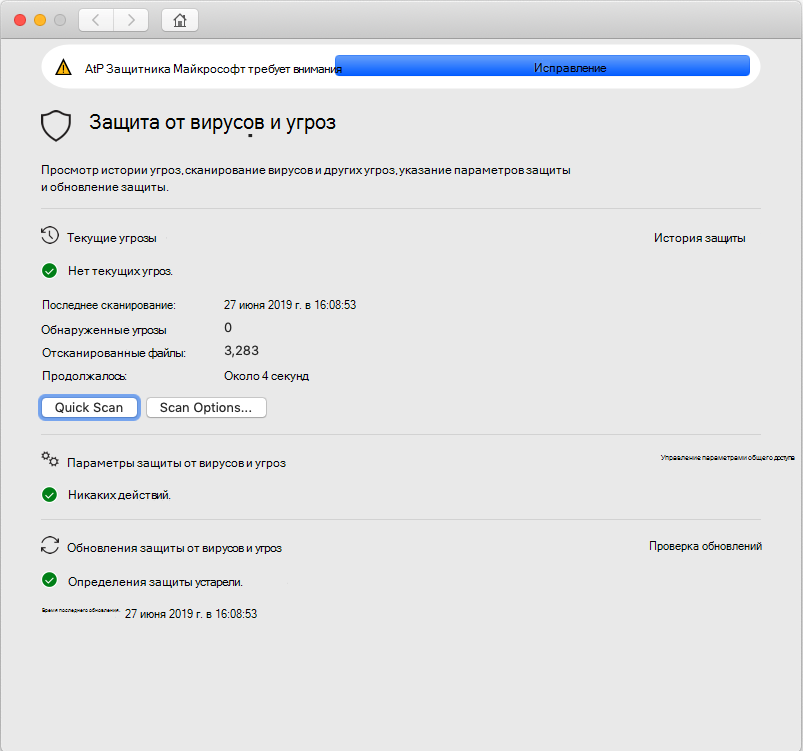
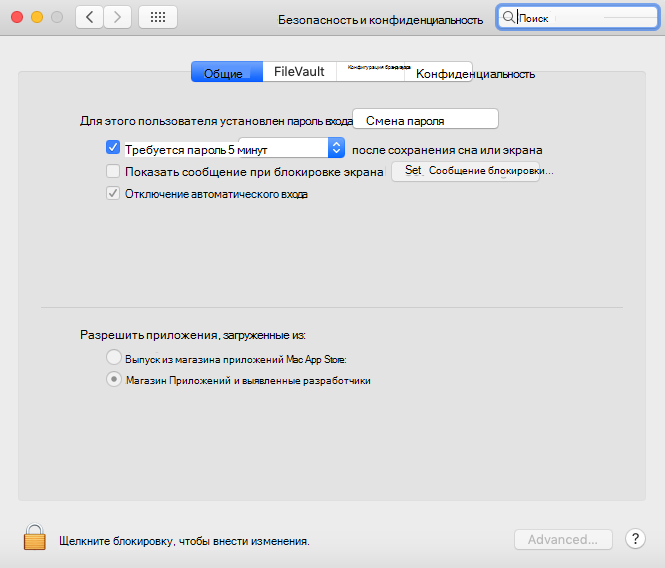

# <a name="troubleshoot-kernel-extension-issues-in-microsoft-defender-for-endpoint-for-mac"></a>Устранение неполадок с расширением ядра в Microsoft Defender для конечной точки для Mac

[!INCLUDE [Microsoft 365 Defender rebranding](../../includes/microsoft-defender.md)]


**Область применения:**

- [Microsoft Defender для конечной точки для Mac](microsoft-defender-endpoint-mac.md)
- [Microsoft Defender для конечной точки](https://go.microsoft.com/fwlink/p/?linkid=2154037)
- [Microsoft 365 Defender](https://go.microsoft.com/fwlink/?linkid=2118804)

> Хотите испытать Microsoft Defender для конечной точки? [Зарегистрився для бесплатной пробной.](https://www.microsoft.com/microsoft-365/windows/microsoft-defender-atp?ocid=docs-wdatp-exposedapis-abovefoldlink)

В этой статье данная статья содержит сведения о том, как устранить проблемы с расширением ядра, которое установлено в рамках Microsoft Defender для конечной точки для Mac.

Начиная с macOS High Sierra (10.13), macOS требует явного утверждения всех расширений ядра до того, как они будут разрешены для запуска на устройстве.

Если вы не одобрили расширение ядра во время развертывания и установки Microsoft Defender для конечной точки для Mac, приложение отображает баннер, в результате чего вы сможете включить его:

   

Вы также можете запустить ```mdatp health``` . Он сообщает, включена ли защита в режиме реального времени, но недоступна. Это означает, что расширение ядра не утверждено для запуска на устройстве.

```bash
mdatp health
```
```Output
...
real_time_protection_enabled                : false
real_time_protection_available              : true
...
```

В следующих разделах указаны инструкции по решению этой проблемы в зависимости от метода, используемого для развертывания Microsoft Defender для конечной точки для Mac.

## <a name="managed-deployment"></a>Управляемое развертывание

См. инструкции, соответствующие средству управления, который использовался для развертывания продукта:

- [Развертывание на основе JAMF](mac-install-with-jamf.md)
- [Развертывание на основе Microsoft Intune](mac-install-with-intune.md#create-system-configuration-profiles)

## <a name="manual-deployment"></a>Ручное развертывание

Если с момента установки продукта прошло менее 30 минут, перейдите к system **Preferences** Security & Privacy, где необходимо разрешить системное программное обеспечение от разработчиков  >  "Корпорация  Майкрософт".

Если вы не видите эту подсказку, это означает, что прошло 30 или более минут, и расширение ядра еще не было утверждено для запуска на устройстве:



В этом случае необходимо выполнить следующие действия, чтобы снова вызвать поток утверждения.

1. В терминале попытайтесь установить драйвер. Следующая операция будет неудачной, так как расширение ядра не было утверждено для запуска на устройстве. Тем не менее, он будет запускать поток утверждения снова.

    ```bash
    sudo kextutil /Library/Extensions/wdavkext.kext
    ```
    
    ```Output
    Kext rejected due to system policy: <OSKext 0x7fc34d528390 [0x7fffa74aa8e0]> { URL = "file:///Library/StagedExtensions/Library/Extensions/wdavkext.kext/", ID = "com.microsoft.wdavkext" }
    Kext rejected due to system policy: <OSKext 0x7fc34d528390 [0x7fffa74aa8e0]> { URL = "file:///Library/StagedExtensions/Library/Extensions/wdavkext.kext/", ID = "com.microsoft.wdavkext" }
    Diagnostics for /Library/Extensions/wdavkext.kext:
    ```

2. Open **System Preferences**  >  **Security & конфиденциальности** из меню. (Сначала закрой его, если он открыт.)

3. **Разрешить** системное программное обеспечение от разработчиков "Корпорация Майкрософт"

4. В терминале установите драйвер снова. На этот раз операция будет успешной:

    ```bash
    sudo kextutil /Library/Extensions/wdavkext.kext
    ```

    Баннер должен исчезнуть из приложения Defender и теперь должен сообщить, что защита в режиме реального времени включена и ```mdatp health``` доступна:

    ```bash
    mdatp health
    ```

    ```Output
    ...
    real_time_protection_enabled                : true
    real_time_protection_available              : true
    ...
    ```
