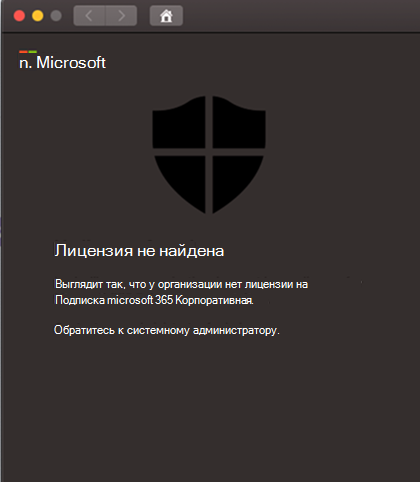

# Устранение неполадок с лицензиями для Microsoft Defender для конечной точки на macOSTroubleshoot license issues for Microsoft Defender for Endpoint on macOS

[!INCLUDE [Microsoft 365 Defender rebranding](../../includes/microsoft-defender.md)]

**Область применения:****Applies to:**

- [Microsoft Defender для конечной точки на macOSMicrosoft Defender for Endpoint on macOS](microsoft-defender-endpoint-mac.md)
- [Microsoft Defender для конечной точкиMicrosoft Defender for Endpoint](https://go.microsoft.com/fwlink/p/?linkid=2154037)
- [Microsoft 365 DefenderMicrosoft 365 Defender](https://go.microsoft.com/fwlink/?linkid=2118804)

> Хотите испытать Microsoft Defender для конечной точки?Want to experience Microsoft Defender for Endpoint? [Зарегистрився для бесплатной пробной.Sign up for a free trial.](https://www.microsoft.com/microsoft-365/windows/microsoft-defender-atp?ocid=docs-wdatp-exposedapis-abovefoldlink)

Во время проверки развертывания [macOS](microsoft-defender-endpoint-mac.md) и  ручного развертывания в Microsoft Defender для конечной точки или проверки концепции (PoC) вы можете получить следующую ошибку:While you are going through [Microsoft Defender for Endpoint on macOS](microsoft-defender-endpoint-mac.md) and [Manual deployment](mac-install-manually.md) testing or a Proof Of Concept (PoC), you might get the following error:

**Сообщение:****Message:** 

Лицензия не найденаNo license found

Похоже, у вашей организации нет лицензии на подписку microsoft 365 Enterprise.Looks like your organization does not have a license for Microsoft 365 Enterprise subscription.

Обратитесь к системному администратору.Contact your administrator for help.

**Причина:****Cause:** 

Вы развернули и/или установили microsoft Defender для конечной точки на пакете macOS (&quot;Пакет установки загрузки"), но, возможно, вы запустите сценарий конфигурации ("Скачайте пакет onboarding").You deployed and/or installed the Microsoft Defender for Endpoint on macOS package ("Download installation package") but you might have run the configuration script ("Download onboarding package").

**Решение:****Solution:**

Следуйте инструкциям MicrosoftDefenderATPOnboardingMacOs.py, задокументированным здесь: [конфигурация клиента](mac-install-manually.md#client-configuration)Follow the MicrosoftDefenderATPOnboardingMacOs.py instructions documented here: [Client configuration](mac-install-manually.md#client-configuration)

