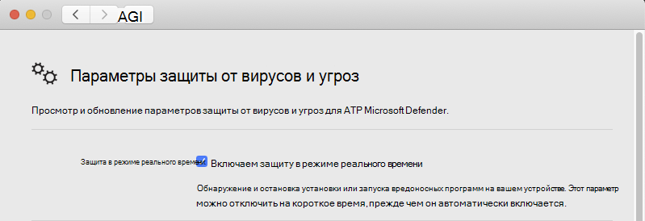

# <a name="troubleshoot-performance-issues-for-microsoft-defender-for-endpoint-on-macos"></a><span data-ttu-id="69193-104">Устранение неполадок с производительностью для Microsoft Defender для конечной точки на macOS</span><span class="sxs-lookup"><span data-stu-id="69193-104">Troubleshoot performance issues for Microsoft Defender for Endpoint on macOS</span></span>

[!INCLUDE [Microsoft 365 Defender rebranding](../../includes/microsoft-defender.md)]


<span data-ttu-id="69193-105">**Область применения:**</span><span class="sxs-lookup"><span data-stu-id="69193-105">**Applies to:**</span></span>

- [<span data-ttu-id="69193-106">Microsoft Defender для конечной точки в macOS</span><span class="sxs-lookup"><span data-stu-id="69193-106">Microsoft Defender for Endpoint on macOS</span></span>](microsoft-defender-endpoint-mac.md)
- [<span data-ttu-id="69193-107">Microsoft Defender для конечной точки</span><span class="sxs-lookup"><span data-stu-id="69193-107">Microsoft Defender for Endpoint</span></span>](https://go.microsoft.com/fwlink/p/?linkid=2154037)
- [<span data-ttu-id="69193-108">Microsoft 365 Defender</span><span class="sxs-lookup"><span data-stu-id="69193-108">Microsoft 365 Defender</span></span>](https://go.microsoft.com/fwlink/?linkid=2118804)

> <span data-ttu-id="69193-109">Хотите испытать Microsoft Defender для конечной точки?</span><span class="sxs-lookup"><span data-stu-id="69193-109">Want to experience Microsoft Defender for Endpoint?</span></span> [<span data-ttu-id="69193-110">Зарегистрився для бесплатной пробной.</span><span class="sxs-lookup"><span data-stu-id="69193-110">Sign up for a free trial.</span></span>](https://www.microsoft.com/microsoft-365/windows/microsoft-defender-atp?ocid=docs-wdatp-exposedapis-abovefoldlink)

<span data-ttu-id="69193-111">В этом разделе приводится ряд общих действий, которые можно использовать для сужение проблем производительности, связанных с Microsoft Defender для конечной точки на macOS.</span><span class="sxs-lookup"><span data-stu-id="69193-111">This topic provides some general steps that can be used to narrow down performance issues related to Microsoft Defender for Endpoint on macOS.</span></span>

<span data-ttu-id="69193-112">Защита в режиме реального времени (RTP) — это функция Microsoft Defender для конечной точки на macOS, которая непрерывно отслеживает и защищает устройство от угроз.</span><span class="sxs-lookup"><span data-stu-id="69193-112">Real-time protection (RTP) is a feature of Microsoft Defender for Endpoint on macOS that continuously monitors and protects your device against threats.</span></span> <span data-ttu-id="69193-113">Он состоит из мониторинга файлов и процессов и других процессов.</span><span class="sxs-lookup"><span data-stu-id="69193-113">It consists of file and process monitoring and other heuristics.</span></span>

<span data-ttu-id="69193-114">В зависимости от запущенных приложений и характеристик устройства при запуске Microsoft Defender для конечной точки на macOS может возникнуть неоптимиальная производительность.</span><span class="sxs-lookup"><span data-stu-id="69193-114">Depending on the applications that you're running and your device characteristics, you may experience suboptimal performance when running Microsoft Defender for Endpoint on macOS.</span></span> <span data-ttu-id="69193-115">В частности, приложения или системные процессы, которые имеют доступ к многим ресурсам в течение короткого времени, могут привести к проблеме производительности в Microsoft Defender для конечной точки на macOS.</span><span class="sxs-lookup"><span data-stu-id="69193-115">In particular, applications or system processes that access many resources over a short timespan can lead to performance issues in Microsoft Defender for Endpoint on macOS.</span></span>

<span data-ttu-id="69193-116">Для устранения неполадок и устранения этих проблем можно использовать следующие действия:</span><span class="sxs-lookup"><span data-stu-id="69193-116">The following steps can be used to troubleshoot and mitigate these issues:</span></span>

1. <span data-ttu-id="69193-117">Отключать защиту в режиме реального времени с помощью одного из следующих методов и наблюдать, повышается ли производительность.</span><span class="sxs-lookup"><span data-stu-id="69193-117">Disable real-time protection using one of the following methods and observe whether the performance improves.</span></span> <span data-ttu-id="69193-118">Этот подход помогает сузить, вносит ли Microsoft Defender для конечной точки на macOS вклад в проблемы производительности.</span><span class="sxs-lookup"><span data-stu-id="69193-118">This approach helps narrow down whether Microsoft Defender for Endpoint on macOS is contributing to the performance issues.</span></span>

      <span data-ttu-id="69193-119">Если устройство не управляется организацией, защита в режиме реального времени может быть отключена с помощью одного из следующих вариантов:</span><span class="sxs-lookup"><span data-stu-id="69193-119">If your device is not managed by your organization, real-time protection can be disabled using one of the following options:</span></span>

    - <span data-ttu-id="69193-120">Из пользовательского интерфейса.</span><span class="sxs-lookup"><span data-stu-id="69193-120">From the user interface.</span></span> <span data-ttu-id="69193-121">Откройте Microsoft Defender для конечной точки на macOS и перейдите к **управлению настройками.**</span><span class="sxs-lookup"><span data-stu-id="69193-121">Open Microsoft Defender for Endpoint on macOS and navigate to **Manage settings**.</span></span>

      

    - <span data-ttu-id="69193-123">Из терминала.</span><span class="sxs-lookup"><span data-stu-id="69193-123">From the Terminal.</span></span> <span data-ttu-id="69193-124">В целях безопасности эта операция требует высоты.</span><span class="sxs-lookup"><span data-stu-id="69193-124">For security purposes, this operation requires elevation.</span></span>

      ```bash
      mdatp config real-time-protection --value disabled
      ```

      <span data-ttu-id="69193-125">Если устройство управляется организацией, защита в режиме реального времени может быть отключена администратором с помощью инструкций в наборе предпочтений для Microsoft Defender для конечной точки на [macOS.](mac-preferences.md)</span><span class="sxs-lookup"><span data-stu-id="69193-125">If your device is managed by your organization, real-time protection can be disabled by your administrator using the instructions in [Set preferences for Microsoft Defender for Endpoint on macOS](mac-preferences.md).</span></span>
      
      <span data-ttu-id="69193-126">Если проблема производительности сохраняется во время отключения защиты в режиме реального времени, ее происхождение может быть компонентом обнаружения конечной точки и ответа.</span><span class="sxs-lookup"><span data-stu-id="69193-126">If the performance problem persists while real-time protection is off, the origin of the problem could be the endpoint detection and response component.</span></span> <span data-ttu-id="69193-127">В этом случае обратитесь в службу поддержки клиентов для получения дополнительных инструкций и смягчения последствий.</span><span class="sxs-lookup"><span data-stu-id="69193-127">In this case, please contact customer support for further instructions and mitigation.</span></span>

2. <span data-ttu-id="69193-128">Откройте finder и перейдите **к**  >  **утилитам приложений**.</span><span class="sxs-lookup"><span data-stu-id="69193-128">Open Finder and navigate to **Applications** > **Utilities**.</span></span> <span data-ttu-id="69193-129">Откройте **монитор активности** и проанализируйте, какие приложения используют ресурсы в вашей системе.</span><span class="sxs-lookup"><span data-stu-id="69193-129">Open **Activity Monitor** and analyze which applications are using the resources on your system.</span></span> <span data-ttu-id="69193-130">Типичные примеры включают обновление программного обеспечения и компиляторы.</span><span class="sxs-lookup"><span data-stu-id="69193-130">Typical examples include software updaters and compilers.</span></span>

1. <span data-ttu-id="69193-131">Чтобы найти приложения, запускающие наибольшее сканировать, можно использовать статистику в режиме реального времени, собранную Defender для конечной точки на Mac.</span><span class="sxs-lookup"><span data-stu-id="69193-131">To find the applications that are triggering the most scans, you can use real-time statistics gathered by Defender for Endpoint on Mac.</span></span>

      > [!NOTE]
      > <span data-ttu-id="69193-132">Эта функция доступна в версии 100.90.70 или более новой версии.</span><span class="sxs-lookup"><span data-stu-id="69193-132">This feature is available in version 100.90.70 or newer.</span></span>
      <span data-ttu-id="69193-133">Эта функция включена по умолчанию на **каналах Dogfood** и **InsiderFast.**</span><span class="sxs-lookup"><span data-stu-id="69193-133">This feature is enabled by default on the **Dogfood** and **InsiderFast** channels.</span></span> <span data-ttu-id="69193-134">Если вы используете другой канал обновления, эту функцию можно включить из командной строки:</span><span class="sxs-lookup"><span data-stu-id="69193-134">If you're using a different update channel, this feature can be enabled from the command line:</span></span>
      ```bash
      mdatp config real-time-protection-statistics  --value enabled
      ```

      <span data-ttu-id="69193-135">Эта функция требует включения защиты в режиме реального времени.</span><span class="sxs-lookup"><span data-stu-id="69193-135">This feature requires real-time protection to be enabled.</span></span> <span data-ttu-id="69193-136">Чтобы проверить состояние защиты в режиме реального времени, запустите следующую команду:</span><span class="sxs-lookup"><span data-stu-id="69193-136">To check the status of real-time protection, run the following command:</span></span>

      ```bash
      mdatp health --field real_time_protection_enabled
      ```

    <span data-ttu-id="69193-137">Убедитесь, **что real_time_protection_enabled** запись верна.</span><span class="sxs-lookup"><span data-stu-id="69193-137">Verify that the **real_time_protection_enabled** entry is true.</span></span> <span data-ttu-id="69193-138">В противном случае запустите следующую команду, чтобы включить ее:</span><span class="sxs-lookup"><span data-stu-id="69193-138">Otherwise, run the following command to enable it:</span></span>

      ```bash
      mdatp config real-time-protection --value enabled
      ```

      ```output
      Configuration property updated
      ```

      <span data-ttu-id="69193-139">Чтобы собрать текущую статистику, запустите:</span><span class="sxs-lookup"><span data-stu-id="69193-139">To collect current statistics, run:</span></span>

      ```bash
      mdatp config real-time-protection --value enabled
      ```

      > [!NOTE]
      > <span data-ttu-id="69193-140">Использование **json --output** (обратите внимание на двойной тир) обеспечивает готовность формата вывода к разметки.</span><span class="sxs-lookup"><span data-stu-id="69193-140">Using **--output json** (note the double dash) ensures that the output format is ready for parsing.</span></span>
      <span data-ttu-id="69193-141">На выходе этой команды будут отсканироваться все процессы и связанные с ними действия сканирования.</span><span class="sxs-lookup"><span data-stu-id="69193-141">The output of this command will show all processes and their associated scan activity.</span></span>

1. <span data-ttu-id="69193-142">В системе Mac скачайте образец анализара Python high_cpu_parser.py с помощью команды:</span><span class="sxs-lookup"><span data-stu-id="69193-142">On your Mac system, download the sample Python parser high_cpu_parser.py using the command:</span></span>

    ```bash
    wget -c https://raw.githubusercontent.com/microsoft/mdatp-xplat/master/linux/diagnostic/high_cpu_parser.py
    ```

    <span data-ttu-id="69193-143">Выход этой команды должен быть похож на следующие:</span><span class="sxs-lookup"><span data-stu-id="69193-143">The output of this command should be similar to the following:</span></span>

    ```Output
    --2020-11-14 11:27:27-- https://raw.githubusercontent.com/microsoft.
    mdatp-xplat/master/linus/diagnostic/high_cpu_parser.py
    Resolving raw.githubusercontent.com (raw.githubusercontent.com)... 151.101.xxx.xxx
    Connecting to raw.githubusercontent.com (raw.githubusercontent.com)| 151.101.xxx.xxx| :443... connected.
    HTTP request sent, awaiting response... 200 OK
    Length: 1020 [text/plain]
    Saving to: 'high_cpu_parser.py'
    100%[===========================================>] 1,020    --.-K/s   in 
    0s
    ```

1. <span data-ttu-id="69193-144">Далее введите следующие команды:</span><span class="sxs-lookup"><span data-stu-id="69193-144">Next, type the following commands:</span></span>

      ```bash
        chmod +x high_cpu_parser.py
      ```

      ```bash
        cat real_time_protection.json | python high_cpu_parser.py  > real_time_protection.log
      ```

      <span data-ttu-id="69193-145">Вывод выше — это список основных участников проблем производительности.</span><span class="sxs-lookup"><span data-stu-id="69193-145">The output of the above is a list of the top contributors to performance issues.</span></span> <span data-ttu-id="69193-146">Первый столбец — идентификатор процесса (PID), второй — имя процесса te, а последний — число отсканированных файлов, отсортированных по воздействию.</span><span class="sxs-lookup"><span data-stu-id="69193-146">The first column is the process identifier (PID), the second column is te process name, and the last column is the number of scanned files, sorted by impact.</span></span>

      <span data-ttu-id="69193-147">Например, выход команды будет чем-то похожим на ниже:</span><span class="sxs-lookup"><span data-stu-id="69193-147">For example, the output of the command will be something like the below:</span></span>

      ```output
        ... > python ~/repo/mdatp-xplat/linux/diagnostic/high_cpu_parser.py <~Downloads/output.json | head -n 10
        27432 None 76703
        73467 actool     1249
        73914 xcodebuild 1081
        73873 bash 1050
        27475 None 836
        1    launchd    407
        73468 ibtool     344
        549  telemetryd_v1   325
        4764 None 228
        125  CrashPlanService 164
      ```

      <span data-ttu-id="69193-148">Чтобы повысить производительность Defender для конечной точки на Mac, найдите точку с самым высоким номером в строке Total files scanned и добавьте исключение для него.</span><span class="sxs-lookup"><span data-stu-id="69193-148">To improve the performance of Defender for Endpoint on Mac, locate the one with the highest number under the Total files scanned row and add an exclusion for it.</span></span> <span data-ttu-id="69193-149">Дополнительные сведения см. в [дополнительных сведениях: Настройка и проверка исключений для Defender для конечной точки в Linux.](linux-exclusions.md)</span><span class="sxs-lookup"><span data-stu-id="69193-149">For more information, see [Configure and validate exclusions for Defender for Endpoint on Linux](linux-exclusions.md).</span></span>

      > [!NOTE]
      > <span data-ttu-id="69193-150">Приложение хранит статистику в памяти и отслеживает активность файлов только с момента ее начала и включения защиты в режиме реального времени.</span><span class="sxs-lookup"><span data-stu-id="69193-150">The application stores statistics in memory and only keeps track of file activity since it was started and real-time protection was enabled.</span></span> <span data-ttu-id="69193-151">Процессы, запущенные до или во время отключения защиты в режиме реального времени, не учитываются.</span><span class="sxs-lookup"><span data-stu-id="69193-151">Processes that were launched before or during periods when real time protection was off are not counted.</span></span> <span data-ttu-id="69193-152">Кроме того, учитываются только события, которые вызвали сканирование.</span><span class="sxs-lookup"><span data-stu-id="69193-152">Additionally, only events which triggered scans are counted.</span></span>
      > 
1. <span data-ttu-id="69193-153">Настройка Microsoft Defender для конечной точки на macOS с исключениями для процессов или расположения дисков, которые способствуют проблеме производительности и повторно включить защиту в режиме реального времени.</span><span class="sxs-lookup"><span data-stu-id="69193-153">Configure Microsoft Defender for Endpoint on macOS with exclusions for the processes or disk locations that contribute to the performance issues and re-enable real-time protection.</span></span>

     <span data-ttu-id="69193-154">Подробнее см. в материале Настройка и проверка [исключений для Microsoft Defender для конечной точки на macOS.](mac-exclusions.md)</span><span class="sxs-lookup"><span data-stu-id="69193-154">See [Configure and validate exclusions for Microsoft Defender for Endpoint on macOS](mac-exclusions.md) for details.</span></span>
