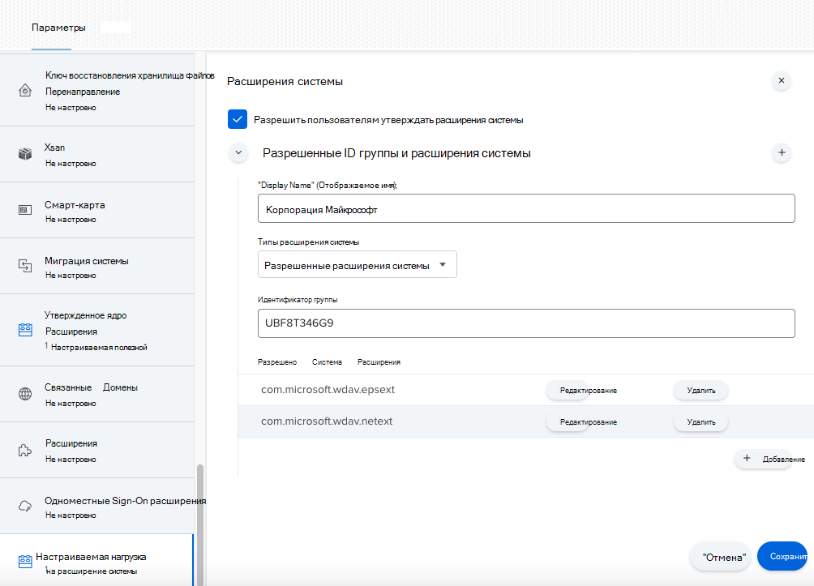
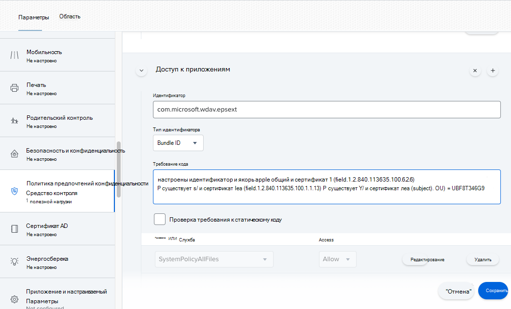

# <a name="new-configuration-profiles-for-macos-catalina-and-newer-versions-of-macos"></a>Новые профили конфигурации для macOS Catalina и более новые версии macOS

[!INCLUDE [Microsoft 365 Defender rebranding](../../includes/microsoft-defender.md)]

**Область применения:**
- [Microsoft Defender для конечной точки](https://go.microsoft.com/fwlink/p/?linkid=2154037)
- [Microsoft 365 Defender](https://go.microsoft.com/fwlink/?linkid=2118804)

> Хотите испытать Microsoft Defender для конечной точки? [Зарегистрився для бесплатной пробной.](https://www.microsoft.com/microsoft-365/windows/microsoft-defender-atp?ocid=docs-wdatp-exposedapis-abovefoldlink)

В соответствии с эволюцией macOS мы готовим Microsoft Defender для конечной точки для обновления macOS, которое использует расширения системы вместо расширений ядра. Это обновление будет применимо только к macOS Catalina (10.15.4) и более новым версиям macOS.

Если вы развернули Microsoft Defender для конечной точки на macOS в управляемой среде (через JAMF, Intune или другое решение MDM), необходимо развернуть новые профили конфигурации. Если эти действия не будут предприняты, пользователи будут получать запросы на утверждение для запуска этих новых компонентов.

## <a name="jamf"></a>JAMF

### <a name="system-extensions-policy"></a>Политика расширения системы

Чтобы утвердить расширения системы, создайте следующую полезною нагрузку:

1. В **компьютерах > параметры конфигурации** выберите **Параметры > расширения системы**.
2. Выберите **разрешенные расширения системы** из **отсевного** списка типов расширения системы.
3. Используйте **UBF8T346G9 для** team Id.
4. Добавьте в список разрешенных расширений системы следующие идентификаторы **пакетов:**

    - **com.microsoft.wdav.epsext**
    - **com.microsoft.wdav.netext**

    

### <a name="privacy-preferences-policy-control"></a>Управление политикой конфиденциальности

Добавьте следующую полезной нагрузки JAMF, чтобы предоставить полный дисковый доступ к расширению безопасности конечной точки Microsoft Defender для конечной точки. Эта политика является предварительным условием для запуска расширения на устройстве.

1. Выберите   >  **параметры управления политиками конфиденциальности.**
2. Используйте `com.microsoft.wdav.epsext` в качестве **идентификатора** и `Bundle ID` как тип **Bundle.**
3. Настройка требования к коду `identifier "com.microsoft.wdav.epsext" and anchor apple generic and certificate 1[field.1.2.840.113635.100.6.2.6] /* exists */ and certificate leaf[field.1.2.840.113635.100.6.1.13] /* exists */ and certificate leaf[subject.OU] = UBF8T346G9`
4. Установите **приложение или службу** **в SystemPolicyAllFiles** и доступ к **Разрешить**.

    

### <a name="network-extension-policy"></a>Политика расширения сети

В рамках возможностей обнаружения конечных точек и ответов Microsoft Defender для конечной точки на macOS проверяет трафик розетки и передает эти сведения на Центр безопасности в Microsoft Defender портал. Следующая политика позволяет сетевому расширению выполнять эту функцию.

>[!NOTE]
>JAMF не имеет встроенной поддержки политик фильтрации контента, которые являются необходимым условием для включения расширений сети, которые Microsoft Defender для конечной точки на macOS устанавливает на устройстве. Кроме того, JAMF иногда изменяет содержимое развернутых политик.
>Таким образом, следующие действия предоставляют обходное решение, которое включает подписание профиля конфигурации.

1. Сохраните на устройстве следующий контент в виде `com.microsoft.network-extension.mobileconfig` текстового редактора:

    ```xml
    <?xml version="1.0" encoding="UTF-8"?><!DOCTYPE plist PUBLIC "-//Apple//DTD PLIST 1.0//EN" "http://www.apple.com/DTDs/PropertyList-1.0.dtd">
    <plist version="1">
        <dict>
            <key>PayloadUUID</key>
            <string>DA2CC794-488B-4AFF-89F7-6686A7E7B8AB</string>
            <key>PayloadType</key>
            <string>Configuration</string>
            <key>PayloadOrganization</key>
            <string>Microsoft Corporation</string>
            <key>PayloadIdentifier</key>
            <string>DA2CC794-488B-4AFF-89F7-6686A7E7B8AB</string>
            <key>PayloadDisplayName</key>
            <string>Microsoft Defender ATP Network Extension</string>
            <key>PayloadDescription</key>
            <string/>
            <key>PayloadVersion</key>
            <integer>1</integer>
            <key>PayloadEnabled</key>
            <true/>
            <key>PayloadRemovalDisallowed</key>
            <true/>
            <key>PayloadScope</key>
            <string>System</string>
            <key>PayloadContent</key>
            <array>
                <dict>
                    <key>PayloadUUID</key>
                    <string>2BA070D9-2233-4827-AFC1-1F44C8C8E527</string>
                    <key>PayloadType</key>
                    <string>com.apple.webcontent-filter</string>
                    <key>PayloadOrganization</key>
                    <string>Microsoft Corporation</string>
                    <key>PayloadIdentifier</key>
                    <string>CEBF7A71-D9A1-48BD-8CCF-BD9D18EC155A</string>
                    <key>PayloadDisplayName</key>
                    <string>Approved Network Extension</string>
                    <key>PayloadDescription</key>
                    <string/>
                    <key>PayloadVersion</key>
                    <integer>1</integer>
                    <key>PayloadEnabled</key>
                    <true/>
                    <key>FilterType</key>
                    <string>Plugin</string>
                    <key>UserDefinedName</key>
                    <string>Microsoft Defender ATP Network Extension</string>
                    <key>PluginBundleID</key>
                    <string>com.microsoft.wdav</string>
                    <key>FilterSockets</key>
                    <true/>
                    <key>FilterDataProviderBundleIdentifier</key>
                    <string>com.microsoft.wdav.netext</string>
                    <key>FilterDataProviderDesignatedRequirement</key>
                    <string>identifier "com.microsoft.wdav.netext" and anchor apple generic and certificate 1[field.1.2.840.113635.100.6.2.6] /* exists */ and certificate leaf[field.1.2.840.113635.100.6.1.13] /* exists */ and certificate leaf[subject.OU] = UBF8T346G9</string>
                </dict>
            </array>
        </dict>
    </plist>
    ```

2. Убедитесь, что вышеуказанный файл был скопирован правильно, запуская `plutil` утилиту в терминале:

    ```bash
    $ plutil -lint <PathToFile>/com.microsoft.network-extension.mobileconfig
    ```

    Например, если файл хранился в Документах:

    ```bash
    $ plutil -lint ~/Documents/com.microsoft.network-extension.mobileconfig
    ```
    
    Убедитесь, что команда `OK` выводит.
        
    ```bash
    <PathToFile>/com.microsoft.network-extension.mobileconfig: OK
    ```
    
3. Следуйте инструкциям на [этой странице,](https://www.jamf.com/jamf-nation/articles/649/creating-a-signing-certificate-using-jamf-pro-s-built-in-certificate-authority) чтобы создать сертификат подписи с помощью встроенного органа сертификата JAMF.

4. После создания и установки сертификата на устройство запустите следующую команду из терминала, чтобы подписать файл:

    ```bash
    $ security cms -S -N "<CertificateName>" -i <PathToFile>/com.microsoft.network-extension.mobileconfig -o <PathToSignedFile>/com.microsoft.network-extension.signed.mobileconfig
    ```
    
    Например, если имя сертификата **— SigningCertificate,** а подписанный файл будет храниться в документах:
    
    ```bash
    $ security cms -S -N "SigningCertificate" -i ~/Documents/com.microsoft.network-extension.mobileconfig -o ~/Documents/com.microsoft.network-extension.signed.mobileconfig
    ```
    
5. С портала JAMF перейдите к профилям **конфигурации** и нажмите **кнопку Upload.** Выберите `com.microsoft.network-extension.signed.mobileconfig` при запросе файла.

## <a name="intune"></a>Intune

### <a name="system-extensions-policy"></a>Политика расширения системы

Утверждение расширений системы:

1. В Intune откройте **конфигурацию Manage**  >  **Device.** Выберите **Управление**  >  **профилями**  >  **Создание профиля**.
2. Выберите имя для профиля. Изменение **платформы=macOS на** **тип profile=Extensions**. Выберите пункт **Создать**.
3. На `Basics` вкладке дайте имя новому профилю.
4. На `Configuration settings` вкладке добавьте следующие записи в `Allowed system extensions` разделе:

    Идентификатор bundle         | Идентификатор группы
    --------------------------|----------------
    com.microsoft.wdav.epsext | UBF8T346G9
    com.microsoft.wdav.netext | UBF8T346G9

    

5. На вкладке назначьте этот профиль всем пользователям `Assignments` **& всем устройствам.**
6. Просмотрите и создайте этот профиль конфигурации.

### <a name="create-and-deploy-the-custom-configuration-profile"></a>Создание и развертывание профиля настраиваемой конфигурации

Следующий профиль конфигурации позволяет расширению сети и предоставляет полный дисковый доступ к расширению системы безопасности конечных точек. 

Сохранение следующего контента в файле **с именемsysext.xml:**

```xml
<?xml version="1.0" encoding="UTF-8"?><!DOCTYPE plist PUBLIC "-//Apple//DTD PLIST 1.0//EN" "http://www.apple.com/DTDs/PropertyList-1.0.dtd">
<plist version="1">
    <dict>
        <key>PayloadUUID</key>
        <string>7E53AC50-B88D-4132-99B6-29F7974EAA3C</string>
        <key>PayloadType</key>
        <string>Configuration</string>
        <key>PayloadOrganization</key>
        <string>Microsoft Corporation</string>
        <key>PayloadIdentifier</key>
        <string>7E53AC50-B88D-4132-99B6-29F7974EAA3C</string>
        <key>PayloadDisplayName</key>
        <string>Microsoft Defender ATP System Extensions</string>
        <key>PayloadDescription</key>
        <string/>
        <key>PayloadVersion</key>
        <integer>1</integer>
        <key>PayloadEnabled</key>
        <true/>
        <key>PayloadRemovalDisallowed</key>
        <true/>
        <key>PayloadScope</key>
        <string>System</string>
        <key>PayloadContent</key>
        <array>
            <dict>
                <key>PayloadUUID</key>
                <string>2BA070D9-2233-4827-AFC1-1F44C8C8E527</string>
                <key>PayloadType</key>
                <string>com.apple.webcontent-filter</string>
                <key>PayloadOrganization</key>
                <string>Microsoft Corporation</string>
                <key>PayloadIdentifier</key>
                <string>CEBF7A71-D9A1-48BD-8CCF-BD9D18EC155A</string>
                <key>PayloadDisplayName</key>
                <string>Approved Network Extension</string>
                <key>PayloadDescription</key>
                <string/>
                <key>PayloadVersion</key>
                <integer>1</integer>
                <key>PayloadEnabled</key>
                <true/>
                <key>FilterType</key>
                <string>Plugin</string>
                <key>UserDefinedName</key>
                <string>Microsoft Defender ATP Network Extension</string>
                <key>PluginBundleID</key>
                <string>com.microsoft.wdav</string>
                <key>FilterSockets</key>
                <true/>
                <key>FilterDataProviderBundleIdentifier</key>
                <string>com.microsoft.wdav.netext</string>
                <key>FilterDataProviderDesignatedRequirement</key>
                <string>identifier &quot;com.microsoft.wdav.netext&quot; and anchor apple generic and certificate 1[field.1.2.840.113635.100.6.2.6] /* exists */ and certificate leaf[field.1.2.840.113635.100.6.1.13] /* exists */ and certificate leaf[subject.OU] = UBF8T346G9</string>
            </dict>
            <dict>
                <key>PayloadUUID</key>
                <string>56105E89-C7C8-4A95-AEE6-E11B8BEA0366</string>
                <key>PayloadType</key>
                <string>com.apple.TCC.configuration-profile-policy</string>
                <key>PayloadOrganization</key>
                <string>Microsoft Corporation</string>
                <key>PayloadIdentifier</key>
                <string>56105E89-C7C8-4A95-AEE6-E11B8BEA0366</string>
                <key>PayloadDisplayName</key>
                <string>Privacy Preferences Policy Control</string>
                <key>PayloadDescription</key>
                <string/>
                <key>PayloadVersion</key>
                <integer>1</integer>
                <key>PayloadEnabled</key>
                <true/>
                <key>Services</key>
                <dict>
                    <key>SystemPolicyAllFiles</key>
                    <array>
                        <dict>
                            <key>Identifier</key>
                            <string>com.microsoft.wdav.epsext</string>
                            <key>CodeRequirement</key>
                            <string>identifier "com.microsoft.wdav.epsext" and anchor apple generic and certificate 1[field.1.2.840.113635.100.6.2.6] /* exists */ and certificate leaf[field.1.2.840.113635.100.6.1.13] /* exists */ and certificate leaf[subject.OU] = UBF8T346G9</string>
                            <key>IdentifierType</key>
                            <string>bundleID</string>
                            <key>StaticCode</key>
                            <integer>0</integer>
                            <key>Allowed</key>
                            <integer>1</integer>
                        </dict>
                    </array>
                </dict>
            </dict>
        </array>
    </dict>
</plist>
```

Убедитесь, что вышеуказанный файл был скопирован правильно. Из терминала запустите следующую команду и убедитесь, что она `OK` выводит:

```bash
$ plutil -lint sysext.xml
sysext.xml: OK
```

Чтобы развернуть этот настраиваемый профиль конфигурации:

1.  В Intune откройте **конфигурацию Manage**  >  **Device.** Выберите **Управление**  >  **профилями**  >  **Создание профиля**.
2. Выберите имя для профиля. Изменение **платформы=macOS** и **типа профиля=Custom.** Выберите **Configure**.
3.  Откройте профиль конфигурации и **загрузитеsysext.xml.** Этот файл был создан на предыдущем этапе.
4.  Нажмите кнопку **ОК**.

    

5. На вкладке назначьте этот профиль всем пользователям `Assignments` **& всем устройствам.**
6. Просмотрите и создайте этот профиль конфигурации.
