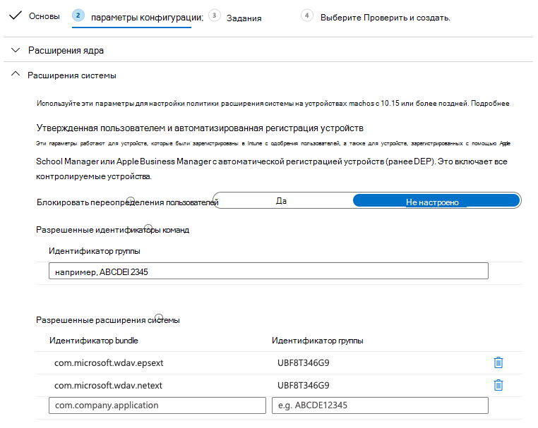
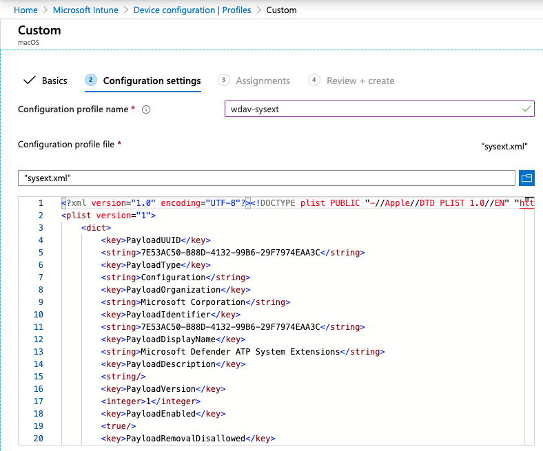

# <a name="new-configuration-profiles-for-macos-catalina-and-newer-versions-of-macos"></a><span data-ttu-id="7ac96-104">Новые профили конфигурации для macOS Catalina и более новые версии macOS</span><span class="sxs-lookup"><span data-stu-id="7ac96-104">New configuration profiles for macOS Catalina and newer versions of macOS</span></span>

[!INCLUDE [Microsoft 365 Defender rebranding](../../includes/microsoft-defender.md)]

<span data-ttu-id="7ac96-105">**Область применения:**</span><span class="sxs-lookup"><span data-stu-id="7ac96-105">**Applies to:**</span></span>
- [<span data-ttu-id="7ac96-106">Microsoft Defender для конечной точки</span><span class="sxs-lookup"><span data-stu-id="7ac96-106">Microsoft Defender for Endpoint</span></span>](https://go.microsoft.com/fwlink/p/?linkid=2146631)
- [<span data-ttu-id="7ac96-107">Microsoft 365 Defender</span><span class="sxs-lookup"><span data-stu-id="7ac96-107">Microsoft 365 Defender</span></span>](https://go.microsoft.com/fwlink/?linkid=2118804)

> <span data-ttu-id="7ac96-108">Хотите испытать Microsoft Defender для конечной точки?</span><span class="sxs-lookup"><span data-stu-id="7ac96-108">Want to experience Microsoft Defender for Endpoint?</span></span> [<span data-ttu-id="7ac96-109">Зарегистрився для бесплатной пробной.</span><span class="sxs-lookup"><span data-stu-id="7ac96-109">Sign up for a free trial.</span></span>](https://www.microsoft.com/microsoft-365/windows/microsoft-defender-atp?ocid=docs-wdatp-exposedapis-abovefoldlink)

<span data-ttu-id="7ac96-110">В соответствии с эволюцией macOS мы готовим обновление Microsoft Defender для конечной точки для Mac, которое использует расширения системы вместо расширений ядра.</span><span class="sxs-lookup"><span data-stu-id="7ac96-110">In alignment with macOS evolution, we are preparing a Microsoft Defender for Endpoint for Mac update that leverages system extensions instead of kernel extensions.</span></span> <span data-ttu-id="7ac96-111">Это обновление будет применимо только к macOS Catalina (10.15.4) и более новым версиям macOS.</span><span class="sxs-lookup"><span data-stu-id="7ac96-111">This update will only be applicable to macOS Catalina (10.15.4) and newer versions of macOS.</span></span>

<span data-ttu-id="7ac96-112">Если вы развернули Microsoft Defender для конечной точки для Mac в управляемой среде (через JAMF, Intune или другое решение MDM), необходимо развернуть новые профили конфигурации.</span><span class="sxs-lookup"><span data-stu-id="7ac96-112">If you have deployed Microsoft Defender for Endpoint for Mac in a managed environment (through JAMF, Intune, or another MDM solution), you must deploy new configuration profiles.</span></span> <span data-ttu-id="7ac96-113">Если эти действия не будут предприняты, пользователи будут получать запросы на утверждение для запуска этих новых компонентов.</span><span class="sxs-lookup"><span data-stu-id="7ac96-113">Failure to do these steps will result in users getting approval prompts to run these new components.</span></span>

## <a name="jamf"></a><span data-ttu-id="7ac96-114">JAMF</span><span class="sxs-lookup"><span data-stu-id="7ac96-114">JAMF</span></span>

### <a name="system-extensions-policy"></a><span data-ttu-id="7ac96-115">Политика расширения системы</span><span class="sxs-lookup"><span data-stu-id="7ac96-115">System Extensions Policy</span></span>

<span data-ttu-id="7ac96-116">Чтобы утвердить расширения системы, создайте следующую полезною нагрузку:</span><span class="sxs-lookup"><span data-stu-id="7ac96-116">To approve the system extensions, create the following payload:</span></span>

1. <span data-ttu-id="7ac96-117">В **компьютерах > параметры конфигурации** выберите **Параметры > расширения системы**.</span><span class="sxs-lookup"><span data-stu-id="7ac96-117">In **Computers > Configuration Profiles** select **Options > System Extensions**.</span></span>
2. <span data-ttu-id="7ac96-118">Выберите **разрешенные расширения системы** из **отсевного** списка типов расширения системы.</span><span class="sxs-lookup"><span data-stu-id="7ac96-118">Select **Allowed System Extensions** from the **System Extension Types** drop-down list.</span></span>
3. <span data-ttu-id="7ac96-119">Используйте **UBF8T346G9 для** team Id.</span><span class="sxs-lookup"><span data-stu-id="7ac96-119">Use **UBF8T346G9** for Team Id.</span></span>
4. <span data-ttu-id="7ac96-120">Добавьте в список разрешенных расширений системы следующие идентификаторы **пакетов:**</span><span class="sxs-lookup"><span data-stu-id="7ac96-120">Add the following bundle identifiers to the **Allowed System Extensions** list:</span></span>

    - <span data-ttu-id="7ac96-121">**com.microsoft.wdav.epsext**</span><span class="sxs-lookup"><span data-stu-id="7ac96-121">**com.microsoft.wdav.epsext**</span></span>
    - <span data-ttu-id="7ac96-122">**com.microsoft.wdav.netext**</span><span class="sxs-lookup"><span data-stu-id="7ac96-122">**com.microsoft.wdav.netext**</span></span>

    

### <a name="privacy-preferences-policy-control"></a><span data-ttu-id="7ac96-124">Управление политикой конфиденциальности</span><span class="sxs-lookup"><span data-stu-id="7ac96-124">Privacy Preferences Policy Control</span></span>

<span data-ttu-id="7ac96-125">Добавьте следующую полезной нагрузки JAMF, чтобы предоставить полный дисковый доступ к расширению безопасности конечной точки Microsoft Defender для конечной точки.</span><span class="sxs-lookup"><span data-stu-id="7ac96-125">Add the following JAMF payload to grant Full Disk Access to the Microsoft Defender for Endpoint Endpoint Security Extension.</span></span> <span data-ttu-id="7ac96-126">Эта политика является предварительным условием для запуска расширения на устройстве.</span><span class="sxs-lookup"><span data-stu-id="7ac96-126">This policy is a pre-requisite for running the extension on your device.</span></span>

1. <span data-ttu-id="7ac96-127">Выберите   >  **параметры управления политиками конфиденциальности.**</span><span class="sxs-lookup"><span data-stu-id="7ac96-127">Select **Options** > **Privacy Preferences Policy Control**.</span></span>
2. <span data-ttu-id="7ac96-128">Используйте `com.microsoft.wdav.epsext` в качестве **идентификатора** и `Bundle ID` как тип **Bundle.**</span><span class="sxs-lookup"><span data-stu-id="7ac96-128">Use `com.microsoft.wdav.epsext` as the **Identifier** and `Bundle ID` as **Bundle type**.</span></span>
3. <span data-ttu-id="7ac96-129">Настройка требования к коду `identifier "com.microsoft.wdav.epsext" and anchor apple generic and certificate 1[field.1.2.840.113635.100.6.2.6] /* exists */ and certificate leaf[field.1.2.840.113635.100.6.1.13] /* exists */ and certificate leaf[subject.OU] = UBF8T346G9`</span><span class="sxs-lookup"><span data-stu-id="7ac96-129">Set Code Requirement to `identifier "com.microsoft.wdav.epsext" and anchor apple generic and certificate 1[field.1.2.840.113635.100.6.2.6] /* exists */ and certificate leaf[field.1.2.840.113635.100.6.1.13] /* exists */ and certificate leaf[subject.OU] = UBF8T346G9`</span></span>
4. <span data-ttu-id="7ac96-130">Установите **приложение или службу** **в SystemPolicyAllFiles** и доступ к **Разрешить**.</span><span class="sxs-lookup"><span data-stu-id="7ac96-130">Set **App or service** to **SystemPolicyAllFiles** and access to **Allow**.</span></span>

    

### <a name="network-extension-policy"></a><span data-ttu-id="7ac96-132">Политика расширения сети</span><span class="sxs-lookup"><span data-stu-id="7ac96-132">Network Extension Policy</span></span>

<span data-ttu-id="7ac96-133">В рамках возможностей обнаружения конечных точек и ответов Microsoft Defender for Endpoint для Mac проверяет трафик розетки и передает эти сведения на портал Центра безопасности Microsoft Defender.</span><span class="sxs-lookup"><span data-stu-id="7ac96-133">As part of the Endpoint Detection and Response capabilities, Microsoft Defender for Endpoint for Mac inspects socket traffic and reports this information to the Microsoft Defender Security Center portal.</span></span> <span data-ttu-id="7ac96-134">Следующая политика позволяет сетевому расширению выполнять эту функцию.</span><span class="sxs-lookup"><span data-stu-id="7ac96-134">The following policy allows the network extension to perform this functionality.</span></span>

>[!NOTE]
><span data-ttu-id="7ac96-135">JAMF не имеет встроенной поддержки политик фильтрации контента, которые являются необходимым условием для включения расширений сети, которые Microsoft Defender для конечной точки для Mac устанавливает на устройстве.</span><span class="sxs-lookup"><span data-stu-id="7ac96-135">JAMF doesn’t have built-in support for content filtering policies, which are a pre-requisite for enabling the network extensions that Microsoft Defender for Endpoint for Mac installs on the device.</span></span> <span data-ttu-id="7ac96-136">Кроме того, JAMF иногда изменяет содержимое развернутых политик.</span><span class="sxs-lookup"><span data-stu-id="7ac96-136">Furthermore, JAMF sometimes changes the content of the policies being deployed.</span></span>
><span data-ttu-id="7ac96-137">Таким образом, следующие действия предоставляют обходное решение, которое включает подписание профиля конфигурации.</span><span class="sxs-lookup"><span data-stu-id="7ac96-137">As such, the following steps provide a workaround that involve signing the configuration profile.</span></span>

1. <span data-ttu-id="7ac96-138">Сохраните на устройстве следующий контент в виде `com.microsoft.network-extension.mobileconfig` текстового редактора:</span><span class="sxs-lookup"><span data-stu-id="7ac96-138">Save the following content to your device as `com.microsoft.network-extension.mobileconfig` using a text editor:</span></span>

    ```xml
    <?xml version="1.0" encoding="UTF-8"?><!DOCTYPE plist PUBLIC "-//Apple//DTD PLIST 1.0//EN" "http://www.apple.com/DTDs/PropertyList-1.0.dtd">
    <plist version="1">
        <dict>
            <key>PayloadUUID</key>
            <string>DA2CC794-488B-4AFF-89F7-6686A7E7B8AB</string>
            <key>PayloadType</key>
            <string>Configuration</string>
            <key>PayloadOrganization</key>
            <string>Microsoft Corporation</string>
            <key>PayloadIdentifier</key>
            <string>DA2CC794-488B-4AFF-89F7-6686A7E7B8AB</string>
            <key>PayloadDisplayName</key>
            <string>Microsoft Defender ATP Network Extension</string>
            <key>PayloadDescription</key>
            <string/>
            <key>PayloadVersion</key>
            <integer>1</integer>
            <key>PayloadEnabled</key>
            <true/>
            <key>PayloadRemovalDisallowed</key>
            <true/>
            <key>PayloadScope</key>
            <string>System</string>
            <key>PayloadContent</key>
            <array>
                <dict>
                    <key>PayloadUUID</key>
                    <string>2BA070D9-2233-4827-AFC1-1F44C8C8E527</string>
                    <key>PayloadType</key>
                    <string>com.apple.webcontent-filter</string>
                    <key>PayloadOrganization</key>
                    <string>Microsoft Corporation</string>
                    <key>PayloadIdentifier</key>
                    <string>CEBF7A71-D9A1-48BD-8CCF-BD9D18EC155A</string>
                    <key>PayloadDisplayName</key>
                    <string>Approved Network Extension</string>
                    <key>PayloadDescription</key>
                    <string/>
                    <key>PayloadVersion</key>
                    <integer>1</integer>
                    <key>PayloadEnabled</key>
                    <true/>
                    <key>FilterType</key>
                    <string>Plugin</string>
                    <key>UserDefinedName</key>
                    <string>Microsoft Defender ATP Network Extension</string>
                    <key>PluginBundleID</key>
                    <string>com.microsoft.wdav</string>
                    <key>FilterSockets</key>
                    <true/>
                    <key>FilterDataProviderBundleIdentifier</key>
                    <string>com.microsoft.wdav.netext</string>
                    <key>FilterDataProviderDesignatedRequirement</key>
                    <string>identifier "com.microsoft.wdav.netext" and anchor apple generic and certificate 1[field.1.2.840.113635.100.6.2.6] /* exists */ and certificate leaf[field.1.2.840.113635.100.6.1.13] /* exists */ and certificate leaf[subject.OU] = UBF8T346G9</string>
                </dict>
            </array>
        </dict>
    </plist>
    ```

2. <span data-ttu-id="7ac96-139">Убедитесь, что вышеуказанный файл был скопирован правильно, запуская `plutil` утилиту в терминале:</span><span class="sxs-lookup"><span data-stu-id="7ac96-139">Verify that the above file was copied correctly by running the `plutil` utility in the Terminal:</span></span>

    ```bash
    $ plutil -lint <PathToFile>/com.microsoft.network-extension.mobileconfig
    ```

    <span data-ttu-id="7ac96-140">Например, если файл хранился в Документах:</span><span class="sxs-lookup"><span data-stu-id="7ac96-140">For example, if the file was stored in Documents:</span></span>

    ```bash
    $ plutil -lint ~/Documents/com.microsoft.network-extension.mobileconfig
    ```
    
    <span data-ttu-id="7ac96-141">Убедитесь, что команда `OK` выводит.</span><span class="sxs-lookup"><span data-stu-id="7ac96-141">Verify that the command outputs `OK`.</span></span>
        
    ```bash
    <PathToFile>/com.microsoft.network-extension.mobileconfig: OK
    ```
    
3. <span data-ttu-id="7ac96-142">Следуйте инструкциям на [этой странице,](https://www.jamf.com/jamf-nation/articles/649/creating-a-signing-certificate-using-jamf-pro-s-built-in-certificate-authority) чтобы создать сертификат подписи с помощью встроенного органа сертификата JAMF.</span><span class="sxs-lookup"><span data-stu-id="7ac96-142">Follow the instructions on [this page](https://www.jamf.com/jamf-nation/articles/649/creating-a-signing-certificate-using-jamf-pro-s-built-in-certificate-authority) to create a signing certificate using JAMF’s built-in certificate authority.</span></span>

4. <span data-ttu-id="7ac96-143">После создания и установки сертификата на устройство запустите следующую команду из терминала, чтобы подписать файл:</span><span class="sxs-lookup"><span data-stu-id="7ac96-143">After the certificate is created and installed to your device, run the following command from the Terminal to sign the file:</span></span>

    ```bash
    $ security cms -S -N "<CertificateName>" -i <PathToFile>/com.microsoft.network-extension.mobileconfig -o <PathToSignedFile>/com.microsoft.network-extension.signed.mobileconfig
    ```
    
    <span data-ttu-id="7ac96-144">Например, если имя сертификата **— SigningCertificate,** а подписанный файл будет храниться в документах:</span><span class="sxs-lookup"><span data-stu-id="7ac96-144">For example, if the certificate name is **SigningCertificate** and the signed file is going to be stored in Documents:</span></span>
    
    ```bash
    $ security cms -S -N "SigningCertificate" -i ~/Documents/com.microsoft.network-extension.mobileconfig -o ~/Documents/com.microsoft.network-extension.signed.mobileconfig
    ```
    
5. <span data-ttu-id="7ac96-145">С портала JAMF перейдите к **профилям конфигурации** и нажмите кнопку **Upload.**</span><span class="sxs-lookup"><span data-stu-id="7ac96-145">From the JAMF portal, navigate to **Configuration Profiles** and click the **Upload** button.</span></span> <span data-ttu-id="7ac96-146">Выберите `com.microsoft.network-extension.signed.mobileconfig` при запросе файла.</span><span class="sxs-lookup"><span data-stu-id="7ac96-146">Select `com.microsoft.network-extension.signed.mobileconfig` when prompted for the file.</span></span>

## <a name="intune"></a><span data-ttu-id="7ac96-147">Intune</span><span class="sxs-lookup"><span data-stu-id="7ac96-147">Intune</span></span>

### <a name="system-extensions-policy"></a><span data-ttu-id="7ac96-148">Политика расширения системы</span><span class="sxs-lookup"><span data-stu-id="7ac96-148">System Extensions Policy</span></span>

<span data-ttu-id="7ac96-149">Утверждение расширений системы:</span><span class="sxs-lookup"><span data-stu-id="7ac96-149">To approve the system extensions:</span></span>

1. <span data-ttu-id="7ac96-150">В Intune откройте **конфигурацию Manage**  >  **Device.**</span><span class="sxs-lookup"><span data-stu-id="7ac96-150">In Intune, open **Manage** > **Device configuration**.</span></span> <span data-ttu-id="7ac96-151">Выберите **Управление**  >  **профилями**  >  **Создание профиля**.</span><span class="sxs-lookup"><span data-stu-id="7ac96-151">Select **Manage** > **Profiles** > **Create Profile**.</span></span>
2. <span data-ttu-id="7ac96-152">Выберите имя для профиля.</span><span class="sxs-lookup"><span data-stu-id="7ac96-152">Choose a name for the profile.</span></span> <span data-ttu-id="7ac96-153">Изменение **платформы=macOS на** **тип profile=Extensions**.</span><span class="sxs-lookup"><span data-stu-id="7ac96-153">Change **Platform=macOS** to **Profile type=Extensions**.</span></span> <span data-ttu-id="7ac96-154">Нажмите **Создать**.</span><span class="sxs-lookup"><span data-stu-id="7ac96-154">Select **Create**.</span></span>
3. <span data-ttu-id="7ac96-155">На `Basics` вкладке дайте имя новому профилю.</span><span class="sxs-lookup"><span data-stu-id="7ac96-155">In the `Basics` tab, give a name to this new profile.</span></span>
4. <span data-ttu-id="7ac96-156">На `Configuration settings` вкладке добавьте следующие записи в `Allowed system extensions` разделе:</span><span class="sxs-lookup"><span data-stu-id="7ac96-156">In the `Configuration settings` tab, add the following entries in the `Allowed system extensions` section:</span></span>

    <span data-ttu-id="7ac96-157">Идентификатор bundle</span><span class="sxs-lookup"><span data-stu-id="7ac96-157">Bundle identifier</span></span>         | <span data-ttu-id="7ac96-158">Идентификатор группы</span><span class="sxs-lookup"><span data-stu-id="7ac96-158">Team identifier</span></span>
    --------------------------|----------------
    <span data-ttu-id="7ac96-159">com.microsoft.wdav.epsext</span><span class="sxs-lookup"><span data-stu-id="7ac96-159">com.microsoft.wdav.epsext</span></span> | <span data-ttu-id="7ac96-160">UBF8T346G9</span><span class="sxs-lookup"><span data-stu-id="7ac96-160">UBF8T346G9</span></span>
    <span data-ttu-id="7ac96-161">com.microsoft.wdav.netext</span><span class="sxs-lookup"><span data-stu-id="7ac96-161">com.microsoft.wdav.netext</span></span> | <span data-ttu-id="7ac96-162">UBF8T346G9</span><span class="sxs-lookup"><span data-stu-id="7ac96-162">UBF8T346G9</span></span>

    

5. <span data-ttu-id="7ac96-164">На вкладке назначьте этот профиль всем пользователям `Assignments` **& всем устройствам.**</span><span class="sxs-lookup"><span data-stu-id="7ac96-164">In the `Assignments` tab, assign this profile to **All Users & All devices**.</span></span>
6. <span data-ttu-id="7ac96-165">Просмотрите и создайте этот профиль конфигурации.</span><span class="sxs-lookup"><span data-stu-id="7ac96-165">Review and create this configuration profile.</span></span>

### <a name="create-and-deploy-the-custom-configuration-profile"></a><span data-ttu-id="7ac96-166">Создание и развертывание профиля настраиваемой конфигурации</span><span class="sxs-lookup"><span data-stu-id="7ac96-166">Create and deploy the Custom Configuration Profile</span></span>

<span data-ttu-id="7ac96-167">Следующий профиль конфигурации позволяет расширению сети и предоставляет полный дисковый доступ к расширению системы безопасности конечных точек.</span><span class="sxs-lookup"><span data-stu-id="7ac96-167">The following configuration profile enables the network extension and grants Full Disk Access to the Endpoint Security system extension.</span></span> 

<span data-ttu-id="7ac96-168">Сохранение следующего контента в файле **с именемsysext.xml:**</span><span class="sxs-lookup"><span data-stu-id="7ac96-168">Save the following content to a file named **sysext.xml**:</span></span>

```xml
<?xml version="1.0" encoding="UTF-8"?><!DOCTYPE plist PUBLIC "-//Apple//DTD PLIST 1.0//EN" "http://www.apple.com/DTDs/PropertyList-1.0.dtd">
<plist version="1">
    <dict>
        <key>PayloadUUID</key>
        <string>7E53AC50-B88D-4132-99B6-29F7974EAA3C</string>
        <key>PayloadType</key>
        <string>Configuration</string>
        <key>PayloadOrganization</key>
        <string>Microsoft Corporation</string>
        <key>PayloadIdentifier</key>
        <string>7E53AC50-B88D-4132-99B6-29F7974EAA3C</string>
        <key>PayloadDisplayName</key>
        <string>Microsoft Defender ATP System Extensions</string>
        <key>PayloadDescription</key>
        <string/>
        <key>PayloadVersion</key>
        <integer>1</integer>
        <key>PayloadEnabled</key>
        <true/>
        <key>PayloadRemovalDisallowed</key>
        <true/>
        <key>PayloadScope</key>
        <string>System</string>
        <key>PayloadContent</key>
        <array>
            <dict>
                <key>PayloadUUID</key>
                <string>2BA070D9-2233-4827-AFC1-1F44C8C8E527</string>
                <key>PayloadType</key>
                <string>com.apple.webcontent-filter</string>
                <key>PayloadOrganization</key>
                <string>Microsoft Corporation</string>
                <key>PayloadIdentifier</key>
                <string>CEBF7A71-D9A1-48BD-8CCF-BD9D18EC155A</string>
                <key>PayloadDisplayName</key>
                <string>Approved Network Extension</string>
                <key>PayloadDescription</key>
                <string/>
                <key>PayloadVersion</key>
                <integer>1</integer>
                <key>PayloadEnabled</key>
                <true/>
                <key>FilterType</key>
                <string>Plugin</string>
                <key>UserDefinedName</key>
                <string>Microsoft Defender ATP Network Extension</string>
                <key>PluginBundleID</key>
                <string>com.microsoft.wdav</string>
                <key>FilterSockets</key>
                <true/>
                <key>FilterDataProviderBundleIdentifier</key>
                <string>com.microsoft.wdav.netext</string>
                <key>FilterDataProviderDesignatedRequirement</key>
                <string>identifier &quot;com.microsoft.wdav.netext&quot; and anchor apple generic and certificate 1[field.1.2.840.113635.100.6.2.6] /* exists */ and certificate leaf[field.1.2.840.113635.100.6.1.13] /* exists */ and certificate leaf[subject.OU] = UBF8T346G9</string>
            </dict>
            <dict>
                <key>PayloadUUID</key>
                <string>56105E89-C7C8-4A95-AEE6-E11B8BEA0366</string>
                <key>PayloadType</key>
                <string>com.apple.TCC.configuration-profile-policy</string>
                <key>PayloadOrganization</key>
                <string>Microsoft Corporation</string>
                <key>PayloadIdentifier</key>
                <string>56105E89-C7C8-4A95-AEE6-E11B8BEA0366</string>
                <key>PayloadDisplayName</key>
                <string>Privacy Preferences Policy Control</string>
                <key>PayloadDescription</key>
                <string/>
                <key>PayloadVersion</key>
                <integer>1</integer>
                <key>PayloadEnabled</key>
                <true/>
                <key>Services</key>
                <dict>
                    <key>SystemPolicyAllFiles</key>
                    <array>
                        <dict>
                            <key>Identifier</key>
                            <string>com.microsoft.wdav.epsext</string>
                            <key>CodeRequirement</key>
                            <string>identifier "com.microsoft.wdav.epsext" and anchor apple generic and certificate 1[field.1.2.840.113635.100.6.2.6] /* exists */ and certificate leaf[field.1.2.840.113635.100.6.1.13] /* exists */ and certificate leaf[subject.OU] = UBF8T346G9</string>
                            <key>IdentifierType</key>
                            <string>bundleID</string>
                            <key>StaticCode</key>
                            <integer>0</integer>
                            <key>Allowed</key>
                            <integer>1</integer>
                        </dict>
                    </array>
                </dict>
            </dict>
        </array>
    </dict>
</plist>
```

<span data-ttu-id="7ac96-169">Убедитесь, что вышеуказанный файл был скопирован правильно.</span><span class="sxs-lookup"><span data-stu-id="7ac96-169">Verify that the above file was copied correctly.</span></span> <span data-ttu-id="7ac96-170">Из терминала запустите следующую команду и убедитесь, что она `OK` выводит:</span><span class="sxs-lookup"><span data-stu-id="7ac96-170">From the Terminal, run the following command and verify that it outputs `OK`:</span></span>

```bash
$ plutil -lint sysext.xml
sysext.xml: OK
```

<span data-ttu-id="7ac96-171">Чтобы развернуть этот настраиваемый профиль конфигурации:</span><span class="sxs-lookup"><span data-stu-id="7ac96-171">To deploy this custom configuration profile:</span></span>

1.  <span data-ttu-id="7ac96-172">В Intune откройте **конфигурацию Manage**  >  **Device.**</span><span class="sxs-lookup"><span data-stu-id="7ac96-172">In Intune, open **Manage** > **Device configuration**.</span></span> <span data-ttu-id="7ac96-173">Выберите **Управление**  >  **профилями**  >  **Создание профиля**.</span><span class="sxs-lookup"><span data-stu-id="7ac96-173">Select **Manage** > **Profiles** > **Create profile**.</span></span>
2. <span data-ttu-id="7ac96-174">Выберите имя для профиля.</span><span class="sxs-lookup"><span data-stu-id="7ac96-174">Choose a name for the profile.</span></span> <span data-ttu-id="7ac96-175">Изменение **платформы=macOS** и **типа профиля=Custom.**</span><span class="sxs-lookup"><span data-stu-id="7ac96-175">Change **Platform=macOS** and **Profile type=Custom**.</span></span> <span data-ttu-id="7ac96-176">Выберите **Configure**.</span><span class="sxs-lookup"><span data-stu-id="7ac96-176">Select **Configure**.</span></span>
3.  <span data-ttu-id="7ac96-177">Откройте профиль конфигурации и **загрузитеsysext.xml.**</span><span class="sxs-lookup"><span data-stu-id="7ac96-177">Open the configuration profile and upload **sysext.xml**.</span></span> <span data-ttu-id="7ac96-178">Этот файл был создан на предыдущем этапе.</span><span class="sxs-lookup"><span data-stu-id="7ac96-178">This file was created in the preceding step.</span></span>
4.  <span data-ttu-id="7ac96-179">Нажмите кнопку **ОК**.</span><span class="sxs-lookup"><span data-stu-id="7ac96-179">Select **OK**.</span></span>

    

5. <span data-ttu-id="7ac96-181">На вкладке назначьте этот профиль всем пользователям `Assignments` **& всем устройствам.**</span><span class="sxs-lookup"><span data-stu-id="7ac96-181">In the `Assignments` tab, assign this profile to **All Users & All devices**.</span></span>
6. <span data-ttu-id="7ac96-182">Просмотрите и создайте этот профиль конфигурации.</span><span class="sxs-lookup"><span data-stu-id="7ac96-182">Review and create this configuration profile.</span></span>
