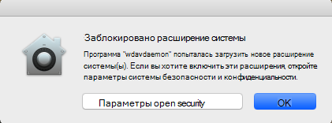
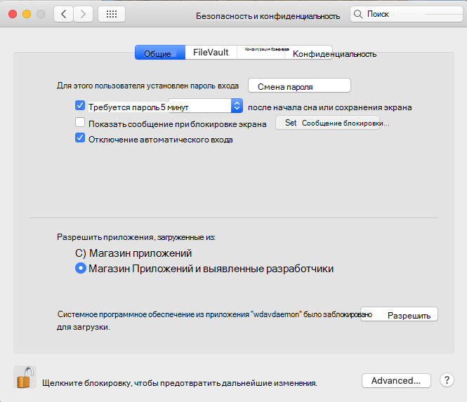
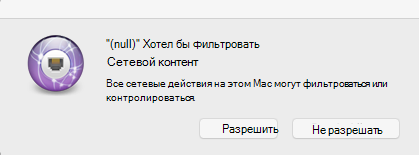
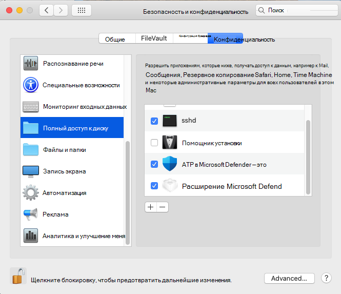

# <a name="microsoft-defender-for-endpoint-for-mac---system-extensions-public-preview"></a>Microsoft Defender для конечной точки для Mac — общедоступный предварительный просмотр расширений системы)

**Область применения:**
- [Microsoft Defender для конечной точки](https://go.microsoft.com/fwlink/p/?linkid=2154037)
- [Microsoft 365 Defender](https://go.microsoft.com/fwlink/?linkid=2118804)

> Хотите испытать Microsoft Defender для конечной точки? [Зарегистрився для бесплатной пробной.](https://www.microsoft.com/microsoft-365/windows/microsoft-defender-atp?ocid=docs-wdatp-exposedapis-abovefoldlink)

В соответствии с эволюцией macOS мы готовим обновление Defender for Endpoint для Mac, которое использует расширения системы вместо расширения ядра. Это обновление будет применяться только к macOS Catalina (10.15.4) и более поздним версиям macOS.

Эта функция в настоящее время находится в публичном предварительном просмотре. В этой статье описывается, как включить эту функцию на вашем устройстве. Вы можете попробовать эту функцию локально на своем устройстве или настроить ее удаленно с помощью средства управления.

Эти действия предполагают, что на устройстве уже запущен Защитник для конечной точки. Дополнительные сведения см. [на этой странице.](microsoft-defender-endpoint-mac.md)

## <a name="known-issues"></a>Известные проблемы

- Мы получили сообщения о том, что расширение сети вмешивается в расширение Apple SSO Kerberos.
- В текущей версии продукта по-прежнему устанавливается расширение ядра. Расширение ядра используется только в качестве механизма отката и будет удалено до того, как эта функция достигнет общего просмотра.
- Мы по-прежнему работаем над версией продукта, которая развертывается и функционирует должным образом на macOS 11 Big Sur.

## <a name="deployment-prerequisites"></a>Предпосылки развертывания

- Минимальная версия операционной системы macOS: **10.15.4**
- Минимальная версия продукта: **101.03.73**
- Устройство должно быть в канале быстрого обновления **Insider.** Вы можете проверить канал обновления, используя следующую команду:

  ```bash
  mdatp health --field release_ring
  ```

  Если устройство еще не находится в канале быстрого обновления Insider, выполните следующую команду из терминала. Обновление канала вступает в силу при следующем старте продукта (при установке следующего обновления продукта или при перезагрузке устройства).

  ```bash
  defaults write com.microsoft.autoupdate2 ChannelName -string Beta
  ```

  Кроме того, если вы в управляемой среде (JAMF или Intune), вы можете настроить канал обновления удаленно. Дополнительные сведения см. в [ссылке Развертывание обновлений для ATP Microsoft Defender для Mac: Установите имя канала.](mac-updates.md#set-the-channel-name)

## <a name="deployment-steps"></a>Действия по развертыванию

Выполните действия развертывания, соответствующие вашей среде, и предпочтительный метод о попробовать эту функцию.

### <a name="manual-deployment"></a>Ручное развертывание

#### <a name="approve-the-system-extensions-and-enable-the-network-extension"></a>Утверждение расширений системы и расширение сети

1. После того как все необходимые условия развертывания будут выполнены, перезапустите устройство, чтобы запустить процесс утверждения и активации расширения системы.

   Вы увидите серию системных подсказок для утверждения расширений системы Defender для конечных точек. Необходимо утвердить **все** подсказки из серии, так как macOS требует явного утверждения для каждого расширения, которое defender for Endpoint для Mac устанавливает на устройстве.
   
   Для каждого утверждения выберите **параметры Open Security Preferences** и выберите **Разрешить** разрешить запуск расширения системы.

   > [!IMPORTANT]
   > Необходимо закрыть и открыть окно **безопасности системных**  >  **предпочтений & конфиденциальности** между последующими утверждениями. В противном случае macOS не будет отображать следующее утверждение.

   > [!IMPORTANT]
   > Перед тем, как продукт возвращается к расширению ядра, существует минутное время. Это гарантирует защиту устройства.
   >
   > Если у вас больше минуты, перезапустите daemon, перезагрузив устройство или снова с помощью запуска `sudo killall -9 wdavdaemon` потока утверждения.

   

   

1. После утверждения расширений системы macOS запросит утверждение для фильтрации сетевого трафика. Нажмите **кнопку Разрешить**.

   

#### <a name="grant-full-disk-access-to-the-endpoint-security-system-extension"></a>Предоставление полного доступа к диску для расширения системы безопасности конечных точек

Откройте **вкладку Безопасность** системных  >  **предпочтений & конфиденциальности** и предоставить полный дисковый доступ к расширению безопасности конечной точки  >   Microsoft **Defender.** 



#### <a name="reboot-your-device"></a>Перезагрузка устройства

Чтобы изменения вступили в силу, необходимо перезагрузать устройство.

#### <a name="verify-that-the-system-extensions-are-running"></a>Убедитесь, что расширения системы запущены

Из терминала запустите следующую команду:

```bash
mdatp health --field real_time_protection_subsystem
```

Вывод `endpoint_security_extension` терминала указывает, что продукт использует функции расширения системы.

### <a name="managed-deployment"></a>Управляемое развертывание

Обратитесь к новым профилям конфигурации [для macOS Catalina](mac-sysext-policies.md#jamf) и более новым версиям macOS: JAMF для новых профилей конфигурации, которые необходимо развернуть для этой новой функции.

В дополнение к этим профилям убедитесь, что целевые устройства должны быть в канале быстрого обновления Insider, как описано в [предпосылках развертывания.](#deployment-prerequisites)

На устройстве, где выполнены все необходимые условия и развернуты новые профили конфигурации, запустите следующую команду:

```bash
$ mdatp health --field real_time_protection_subsystem
```

Если эта команда печатает, `endpoint_security_extension` продукт использует функции расширения системы.

## <a name="validate-basic-scenarios"></a>Проверка базовых сценариев

1. Тестирование обнаружения европейского института компьютерных антивирусных исследований (EICAR). Из окна терминала запустите следующую команду:

   ```bash
   curl -o eicar.txt https://secure.eicar.org/eicar.com.txt
   ```

   Убедитесь, что файл EICAR находится на карантине. Вы можете проверить состояние файла на странице История защиты в пользовательском интерфейсе или из командной строки с помощью следующей команды:

    ```bash
    mdatp threat list
    ```

2. Проверьте сценарий DIY обнаружения конечных точек и ответов (EDR). Из окна терминала запустите следующую команду:

   ```bash
   curl -o "MDATP MacOS DIY.zip" https://aka.ms/mdatpmacosdiy
   ```

   Проверка того, что на портале на странице машины для сценариев EICAR и EDR DIY появились два оповещения.

## <a name="frequently-asked-questions"></a>Вопросы и ответы

- В. Почему я все еще вижу при `kernel_extension` `mdatp health --field real_time_protection_subsystem` запуске?

    Ответ: Переназначься в раздел [Предварительные](#deployment-prerequisites) условия развертывания и дважды проверьте, выполнены ли все необходимые условия. Если все необходимые условия выполнены, перезапустите устройство и повторите проверку.

- В. Когда будет поддерживаться macOS 11 Big Sur?

    О. Мы активно работаем над добавлением поддержки macOS 11. Дополнительные сведения мы выложим на новую [страницу What's.](mac-whatsnew.md)
