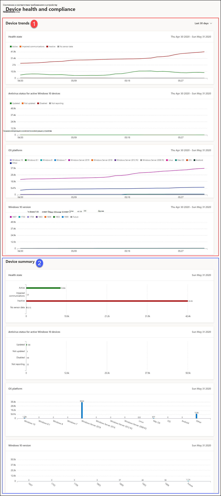

# Отчет о состоянии устройств и соответствия требованиям в Microsoft Defender для конечной точки

[!INCLUDE [Microsoft 365 Defender rebranding](../../includes/microsoft-defender.md)]

**Область применения:**
- [Microsoft Defender для конечной точки](https://go.microsoft.com/fwlink/p/?linkid=2154037)
- [Microsoft 365 Defender](https://go.microsoft.com/fwlink/?linkid=2118804)

> Хотите испытать Microsoft Defender для конечной точки? [Зарегистрився для бесплатной пробной.](https://www.microsoft.com/microsoft-365/windows/microsoft-defender-atp?ocid=docs-wdatp-exposedapis-abovefoldlink)

Отчет о состоянии устройств предоставляет сведения о устройствах в организации на высоком уровне. Отчет содержит сведения о состоянии здоровья датчика, состоянии антивируса, платформах ОС и Windows 10 версиях.

Панель мониторинга структурирована в два раздела: 
 
Section | Описание
:---|:---
1 | Тенденции устройства
2 | Сводка устройств (текущий день)
 
 
## Тенденции устройства 
По умолчанию в трендах устройств отображаются сведения об устройстве за 30-дневный период, заканчивающийся в последний полный день. Чтобы получить более точное представление о тенденциях, происходящих в вашей организации, вы можете отладить отчетный период, отрегулив показанный период времени. Чтобы настроить период времени, выберите диапазон времени из параметров отсев:
 
- 30 дней
- 3 месяцев
- 6 месяцев
- Пользовательские

>[!NOTE]
>Эти фильтры применяются только в разделе тенденции устройства. Это не влияет на раздел сводки устройств.

## Сводка устройств 
В то время как в трендах устройств показаны сведения об устройстве в тренде, в сводке устройства показана информация об устройстве, охватившая текущий день. 

>[!NOTE]
>Данные, отражающиеся в сводной статье, могут быть за 180 дней до текущей даты. Например, если сегодня 27 марта 2019 г., данные сводного раздела будут отражать цифры, начиная с 28 сентября 2018 г. по 27 марта 2019 г. 
> Фильтр, применяемый в разделе тенденции, не применяется в сводной части. 
 
Раздел тенденции устройства позволяет сверлить список устройств с соответствующим фильтром, примененным к ней. Например, щелкнув на панели Неактивный в карточке состояния здоровья датчика, вы сможете получить список устройств с результатами, показывающими только устройства, состояние датчика которых неактивно. 
 
 
 
## Атрибуты устройства
Отчет состоит из карт, отображает следующие атрибуты устройства:
 
- **Состояние здоровья:** показывает сведения о состоянии датчика на устройствах, обеспечивая агрегированное представление устройств, активных, испытывающих нарушения связи, неактивных или не просматривающих данных датчиков.
  
- **Состояние антивируса для** Windows 10 устройств: показывает количество устройств и состояние антивирусная программа в Microsoft Defender.
    
- **Платформы ОС:** показывает распространение платформ ОС, которые существуют в вашей организации. 
 
- **Windows 10:** показывает распространение Windows 10 устройств и их версий в организации.
 
 
 
## Фильтрация данных
 
Используйте предоставленные фильтры, чтобы включить или исключить устройства с определенными атрибутами.

Можно выбрать несколько фильтров для применения из атрибутов устройства. 
 
>[!NOTE]
>Эти фильтры применяются **для всех** карт в отчете.
 
Например, чтобы показать данные о Windows 10 устройствах с состоянием здоровья active sensor:
 
1. В **фильтрах > состояние состояния > Active**.
2. Затем выберите **платформы ОС > Windows 10**.
3. Нажмите **Применить**.

## Связанная тема
- [Отчет о защите от угроз](threat-protection-reports.md)
