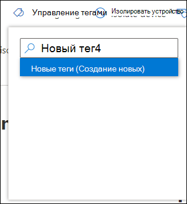
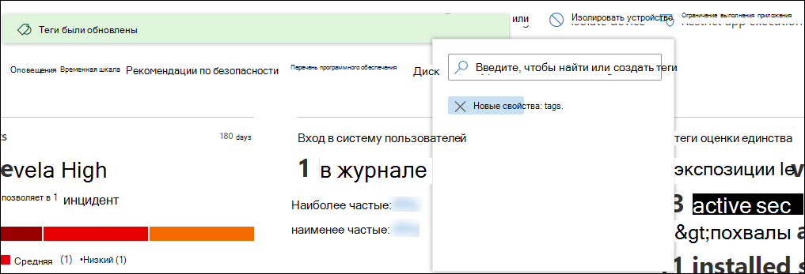

# Создание и управление тегами устройств

[!INCLUDE [Microsoft 365 Defender rebranding](../../includes/microsoft-defender.md)]

**Область применения:**
- [Microsoft Defender для конечной точки](https://go.microsoft.com/fwlink/p/?linkid=2146631)
- [Microsoft 365 Defender](https://go.microsoft.com/fwlink/?linkid=2118804)

> Хотите испытать Microsoft Defender для конечной точки? [Зарегистрився для бесплатной пробной.](https://www.microsoft.com/microsoft-365/windows/microsoft-defender-atp?ocid=docs-wdatp-exposedapis-abovefoldlink)

Добавьте теги на устройствах, чтобы создать логическую групповую принадлежность. Теги устройств поддерживают правильное сопоставление сети, позволяя прикреплять различные теги для захвата контекста и включения динамического создания списка в рамках инцидента. Теги можно использовать в качестве фильтра в представлении списка **Устройств** или для групповых устройств. Дополнительные сведения о группировке устройств см. в дополнительных сведениях [о создании и управлении группами устройств.](machine-groups.md)

Теги на устройствах можно добавлять следующими способами:

- Использование портала
- Настройка ключевого значения реестра

> [!NOTE]
> Может возникнуть задержка между временем, когда тег добавляется на устройство, и его доступностью в списке устройств и на странице устройства.  

Чтобы добавить теги устройств с помощью API, см. [aPI add or remove device tags.](add-or-remove-machine-tags.md)

## Добавление тегов устройств и управление ими с помощью портала

1. Выберите устройство, на которое нужно управлять тегами. Вы можете выбрать или найти устройство из любого из следующих представлений:

   - **Панель мониторинга операций безопасности** — выберите имя устройства из верхнего устройства с разделом активных оповещений.
   - **Очередь оповещений** . Выберите имя устройства рядом с значком устройства из очереди оповещений.
   - **Список устройств** . Выберите имя устройства из списка устройств.
   - **Поле поиска** — выберите устройство из выпадающее меню и введите имя устройства.

     Вы также можете получить на страницу оповещения через файл и IP-представления.

2. Выберите **Управление тегами** из ряда действий ответа.

    

3. Введите, чтобы найти или создать теги

    

Теги добавляются в представление устройства и будут также отражены в представлении **списка Устройств.** Затем можно использовать фильтр **Теги,** чтобы увидеть соответствующий список устройств.

>[!NOTE]
> Фильтрация может не работать с именами тегов, которые содержат скобки. 
> При создании нового тега отображается список существующих тегов. В списке показаны только теги, созданные через портал. Существующие теги, созданные с клиентских устройств, не будут отображаться.

Вы также можете удалить теги из этого представления.

## Добавление тегов устройств, установив ключевое значение реестра

>[!NOTE]
> Применимо только на следующих устройствах:
>- Windows 10, версия 1709 или более поздней версии
>- Windows Server, версия 1803 или более поздней версии
>- Windows Server 2016
>- Windows Server 2012 R2
>- Windows Server 2008 R2 с пакетом обновления 1 (SP1)
>- Windows 8.1
>- Windows 7 SP1

> [!NOTE] 
> Максимальное количество символов, которые можно установить в теге, — 200.

Устройства с похожими тегами могут быть удобными, если необходимо применить контекстное действие к определенному списку устройств.

Используйте следующую запись ключа реестра, чтобы добавить тег на устройстве:

- Ключ реестра: `HKEY_LOCAL_MACHINE\SOFTWARE\Policies\Microsoft\Windows Advanced Threat Protection\DeviceTagging\`
- Ключевое значение реестра (REG_SZ): `Group`
- Данные ключей реестра: `Name of the tag you want to set`

>[!NOTE]
>Тег устройства является частью отчета об информации об устройстве, который создается один раз в день. В качестве альтернативы можно перезапустить конечную точку, которая будет передавать новый отчет о устройстве.
> 
> Если необходимо удалить тег, который был добавлен с помощью вышеуказанного ключа Реестра, удалите содержимое данных ключа реестра вместо удаления ключа "Group".
