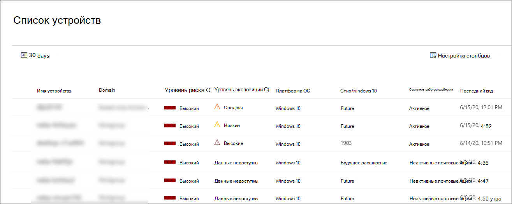

# Просмотр и организация списка конечных устройств Microsoft Defender для конечных точекView and organize the Microsoft Defender for Endpoint Devices list

[!INCLUDE [Microsoft 365 Defender rebranding](../../includes/microsoft-defender.md)]

**Область применения:****Applies to:**
- [Microsoft Defender для конечной точкиMicrosoft Defender for Endpoint](https://go.microsoft.com/fwlink/p/?linkid=2146631)
- [Microsoft 365 DefenderMicrosoft 365 Defender](https://go.microsoft.com/fwlink/?linkid=2118804)

> Хотите испытать Defender для конечной точки?Want to experience Defender for Endpoint? [Зарегистрився для бесплатной пробной.Sign up for a free trial.](https://www.microsoft.com/microsoft-365/windows/microsoft-defender-atp?ocid=docs-wdatp-machinesview-abovefoldlink)

В **списке Устройств** показан список устройств в сети, на которых были созданы оповещения.The **Devices list** shows a list of the devices in your network where alerts were generated. По умолчанию в очереди отображаются устройства, замеченные за последние 30 дней.By default, the queue displays devices seen in the last 30 days.  

С первого взгляда вы увидите такие сведения, как домен, уровень риска, платформа ОС и другие сведения для легкой идентификации устройств, наиболее опасных.At a glance you'll see information such as domain, risk level, OS platform, and other details for easy identification of devices most at risk.

Существует несколько вариантов настройки представления списка устройств.There are several options you can choose from to customize the devices list view. В верхней части навигации можно:On the top navigation you can:

- Добавление или удаление столбцовAdd or remove columns
- Экспортировать весь список в формате CSVExport the entire list in CSV format
- Выберите количество элементов, которые будут показываться на страницеSelect the number of items to show per page
- Применение фильтровApply filters

Во время процесса вмеяния список **Устройств** постепенно заполняется устройствами по мере того, как они начинают сообщать данные датчиков.During the onboarding process, the **Devices list** is gradually populated with devices as they begin to report sensor data. Используйте это представление для отслеживания бортовых конечных точек по мере их подключения к сети или скачивания полного списка конечных точек в качестве CSV-файла для автономного анализа.Use this view to track your onboarded endpoints as they come online, or download the complete endpoint list as a CSV file for offline analysis.

>[!NOTE]
> Если вы экспортируете список устройств, он будет содержать каждое устройство в вашей организации.If you export the device list, it will contain every device in your organization. Загрузка может занять значительное количество времени в зависимости от размера организации.It might take a significant amount of time to download, depending on how large your organization is. Экспорт списка в формате CSV отображает данные в неотобраченном виде.Exporting the list in CSV format displays the data in an unfiltered manner. CSV-файл будет включать все устройства в организации, независимо от фильтрации, применяемой в представлении.The CSV file will include all devices in the organization, regardless of any filtering applied in the view itself.

## Сортировка и фильтрация списка устройствSort and filter the device list

Вы можете применить следующие фильтры, чтобы ограничить список оповещений и получить более целенаправленное представление.You can apply the following filters to limit the list of alerts and get a more focused view.

### Уровень рискаRisk level

Уровень риска отражает общую оценку риска устройства на основе сочетания факторов, включая типы и серьезность активных оповещений на устройстве.The risk level reflects the overall risk assessment of the device based on a combination of factors, including the types and severity of active alerts on the device. Решение активных оповещений, одобрение действий по исправлению и подавление последующих оповещений могут снизить уровень риска.Resolving active alerts, approving remediation activities, and suppressing subsequent alerts can lower the risk level.

### Уровень экспозицииExposure level

Уровень экспозиции отражает текущее воздействие устройства на основе совокупного воздействия ожидающих рекомендаций по безопасности.The exposure level reflects the current exposure of the device based on the cumulative impact of its pending security recommendations. Возможные уровни являются низкими, средними и высокими.The possible levels are low, medium, and high. Низкая экспозиция означает, что ваши устройства менее уязвимы от эксплуатации.Low exposure means your devices are less vulnerable from exploitation.

Если на уровне экспозиции написано "Нет данных", существует несколько причин, по которым это может быть так:If the exposure level says "No data available," there are a few reasons why this may be the case:

- Устройство перестало отчитываться более чем на 30 дней — в этом случае оно считается неактивным, а экспозиция не вычисляетсяDevice stopped reporting for more than 30 days – in that case it is considered inactive, and the exposure isn't computed
- Ос-устройства не поддерживается - см. [минимальные требования к Microsoft Defender для конечной точки](minimum-requirements.md)Device OS not supported - see [minimum requirements for Microsoft Defender for Endpoint](minimum-requirements.md)
- Устройство со устаревшим агентом (очень маловероятно)Device with stale agent (very unlikely)

### Платформа ОСOS Platform

Выберите только платформы ОС, которые вам интересны в расследовании.Select only the OS platforms you're interested in investigating.

### Состояние работоспособностиHealth state

Фильтр по следующим состояниям состояния здоровья устройства:Filter by the following device health states:

- **Active** — устройства, которые активно сообщают данные датчиков службе.**Active** – Devices that are actively reporting sensor data to the service.
- **Неактивные** — устройства, которые перестали отправлять сигналы более 7 дней.**Inactive** – Devices that have completely stopped sending signals for more than 7 days.
- **Неправильное устройство** — устройства с нарушениями связи со службой или не могут отправлять данные датчиков.**Misconfigured** – Devices that have impaired communications with service or are unable to send sensor data. Неправильное устройство можно далее классифицировать так:Misconfigured devices can further be classified to:
  - Нет данных датчикаNo sensor data
  - Нарушение связиImpaired communications

  Дополнительные сведения о том, как устранять проблемы на неправильном устройстве, см. в выпуске [Исправление нездоровых датчиков.](fix-unhealthy-sensors.md)For more information on how to address issues on misconfigured devices see, [Fix unhealthy sensors](fix-unhealthy-sensors.md).

### Состояние антивирусаAntivirus status

Фильтруем устройства по статусу антивируса.Filter devices by antivirus status. Применяется только к активным устройствам с Windows 10.Applies to active Windows 10 devices only.

- **Отключено** — & отключается защита от угроз.**Disabled** - Virus & threat protection is turned off.
- **Не сообщается** . & защиты от угрозы не сообщается.**Not reporting** - Virus & threat protection is not reporting.
- **Не обновляется** . & защита от угроз не обновлена.**Not updated** - Virus & threat protection is not up to date.

Дополнительные сведения см. в странице Просмотр панели управления & [уязвимостей.](tvm-dashboard-insights.md)For more information, see [View the Threat & Vulnerability Management dashboard](tvm-dashboard-insights.md).

### Состояние смягчения угрозThreat mitigation status

Чтобы просмотреть устройства, на которые может повлиять определенная угроза, выберите угрозу из меню отсев, а затем выберите аспект уязвимости, который необходимо смягчить.To view devices that may be affected by a certain threat, select the threat from the dropdown menu, and then select what vulnerability aspect needs to be mitigated.

Дополнительные данные об определенных угрозах см. в [обзоре Аналитика угроз.](threat-analytics.md)To learn more about certain threats, see [Threat analytics](threat-analytics.md). Сведения о смягчении последствий см. в [& Threat & vulnerability Management.](next-gen-threat-and-vuln-mgt.md)For mitigation information, see [Threat & Vulnerability Management](next-gen-threat-and-vuln-mgt.md).

### Версия Windows 10Windows 10 version

Выберите только интересующие вас версии Windows 10.Select only the Windows 10 versions you're interested in investigating.

### Теги & группыTags & Groups

Фильтрация списка на основе группировки и тегов, добавленных на отдельные устройства.Filter the list based on the grouping and tagging that you've added to individual devices. См. [в рубке Создание и управление тегами устройств,](machine-tags.md) [а также создание и управление группами устройств.](machine-groups.md)See [Create and manage device tags](machine-tags.md) and [Create and manage device groups](machine-groups.md).

## Статьи по темеRelated topics

- [Исследование устройств в списке Устройств конечных точек Microsoft Defender для конечных точекInvestigate devices in the Microsoft Defender for Endpoint Devices list](investigate-machines.md)
