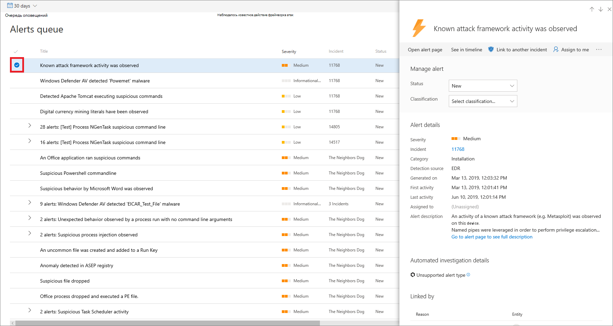

# Управление оповещениями Защитника Майкрософт для конечных точекManage Microsoft Defender for Endpoint alerts

[!INCLUDE [Microsoft 365 Defender rebranding](../../includes/microsoft-defender.md)]

**Область применения:****Applies to:**
- [Microsoft Defender для конечной точкиMicrosoft Defender for Endpoint](https://go.microsoft.com/fwlink/p/?linkid=2146631)
- [Microsoft 365 DefenderMicrosoft 365 Defender](https://go.microsoft.com/fwlink/?linkid=2118804)

> Хотите испытать Defender для конечной точки?Want to experience Defender for Endpoint? [Зарегистрився для бесплатной пробной.Sign up for a free trial.](https://www.microsoft.com/microsoft-365/windows/microsoft-defender-atp?ocid=docs-wdatp-managealerts-abovefoldlink)

Defender for Endpoint оповещает вас о возможных вредоносных событиях, атрибутах и контекстной информации с помощью оповещений.Defender for Endpoint notifies you of possible malicious events, attributes, and contextual information through alerts. Сводка новых оповещений отображается на панели мониторинга операций **безопасности,** и вы можете получить доступ ко всем оповещениям в **очереди Оповещения.**A summary of new alerts is displayed in the **Security operations dashboard**, and you can access all alerts in the **Alerts queue**.

Управлять оповещениями можно, выбрав оповещение в очереди Оповещений или вкладку **Оповещений** на странице Device для отдельного устройства. You can manage alerts by selecting an alert in the **Alerts queue**, or the **Alerts** tab of the Device page for an individual device.

Выбор оповещений в любом из этих мест приводит к области управления **оповещением.**Selecting an alert in either of those places brings up the **Alert management pane**.

## Ссылка на другой инцидентLink to another incident
Вы можете создать новый инцидент из оповещений или ссылки на существующий инцидент.You can create a new incident from the alert or link to an existing incident. 

## Назначение оповещенийAssign alerts
Если оповещение еще не назначено, вы можете выбрать **Назначение** мне, чтобы назначить оповещение себе.If an alert is not yet assigned, you can select **Assign to me** to assign the alert to yourself.

## Подавление оповещенийSuppress alerts
Возможны сценарии, в которых необходимо подавить оповещения, появляющиеся в Центре безопасности Защитника Майкрософт.There might be scenarios where you need to suppress alerts from appearing in Microsoft Defender Security Center. Defender for Endpoint позволяет создавать правила подавления для определенных оповещений, которые, как известно, являются безобидными, например известных инструментов или процессов в организации.Defender for Endpoint lets you create suppression rules for specific alerts that are known to be innocuous such as known tools or processes in your organization.

Правила подавления могут создаваться из существующего оповещения.Suppression rules can be created from an existing alert. При необходимости их можно отключить и повторно использовать.They can be disabled and reenabled if needed.

Когда создается правило подавления, оно вступает в силу с момента создания правила.When a suppression rule is created, it will take effect from the point when the rule is created. Правило не повлияет на существующие оповещения, уже в очереди, до создания правила.The rule will not affect existing alerts already in the queue, prior to the rule creation. Правило будет применяться только для оповещений, удовлетворяющих условиям, установленным после создания правила.The rule will only be applied on alerts that satisfy the conditions set after the rule is created.

Существует два контекста для правила подавления, которое можно выбрать из:There are two contexts for a suppression rule that you can choose from:

- **Подавление оповещения на этом устройстве****Suppress alert on this device**
- **Подавление оповещений в организации****Suppress alert in my organization**

Контекст правила позволяет адаптировать то, что попадает на портал, и убедиться, что на портале всплыли только реальные оповещения о безопасности.The context of the rule lets you tailor what gets surfaced into the portal and ensure that only real security alerts are surfaced into the portal.

Вы можете использовать примеры в следующей таблице, чтобы помочь выбрать контекст для правила подавления:You can use the examples in the following table to help you choose the context for a suppression rule:

| **Context****Context**                           | **Определение****Definition**                                                                                                                                              | **Примеры сценариев****Example scenarios**                                                                                                                                                                                                  |
|:--------------------------------------|:------------------------------------------------------------------------------------------------------------------------------------------------------------|:-----------------------------------------------------------------------------------------------------------------------------------------------------------------------------------------------------------------------|
| **Подавление оповещения на этом устройстве****Suppress alert on this device**    | Оповещения с тем же заголовком оповещения и только на этом конкретном устройстве будут подавлены.Alerts with the same alert title and on that specific device only will be suppressed.   Все остальные оповещения на этом устройстве не будут подавлены.All other alerts on that device will not be suppressed. | <ul><li>Исследователь безопасности изучает вредоносный сценарий, который использовался для атаки на другие устройства в вашей организации.A security researcher is investigating a malicious script that has been used to attack other devices in your organization.</li><li>Разработчик регулярно создает сценарии PowerShell для своей команды.A developer regularly creates PowerShell scripts for their team.</li></ul> |
| **Подавление оповещений в организации****Suppress alert in my organization** | Оповещения с одинаковым названием оповещений на любом устройстве будут подавлены.Alerts with the same alert title on any device will be suppressed.                                                                                         | <ul><li>Доброкачественная административная программа используется всеми в вашей организации.A benign administrative tool is used by everyone in your organization.</li></ul>                                                                                                                               |

### Подавляйте оповещение и создайте новое правило подавления:Suppress an alert and create a new suppression rule:
Создайте настраиваемые правила для управления при подавлении или урегулировании оповещений.Create custom rules to control when alerts are suppressed, or resolved. Вы можете контролировать контекст при подавлении оповещения, указав заголовок оповещений, индикатор компромисса и условия.You can control the context for when an alert is suppressed by specifying the alert title, Indicator of compromise, and the conditions. После указания контекста можно настроить действие и область в оповещении.After specifying the context, you’ll be able to configure the action and scope on the alert. 

1. Выберите оповещение, необходимое для подавления.Select the alert you'd like to suppress. Это приводит к области **управления alert.**This brings up the **Alert management** pane.

2.  Выберите **Создать правило подавления.**Select **Create a suppression rule**.

    С помощью этих атрибутов можно создать условие подавления.You can create a suppression condition using these attributes. Оператор AND применяется между каждым условием, поэтому подавление происходит только в том случае, если все условия выполнены.An AND operator is applied between each condition, so suppression occurs only if all conditions are met.
    
    * Файл SHA1File SHA1
    * Имя файла — поддерживаемая подмайкаFile name - wildcard supported
    * Путь папки — поддерживаемая подмастерьеFolder path - wildcard supported
    * IP-адресIP address
    * URL-адрес — поддерживаемая подмайкаURL - wildcard supported
    * Командная строка — подстройка поддерживаетсяCommand line - wildcard supported

3. Выберите **запуск МОК**.Select the **Triggering IOC**.
    
4. Укажите действие и область в оповещении.Specify the action and scope on the alert.  
   Вы можете автоматически разрешить предупреждение или скрыть его от портала.You can automatically resolve an alert or hide it from the portal. Оповещения, которые будут автоматически устранены, будут отображаться в разрешенных разделах очереди оповещений, страницы оповещения и временной шкалы устройств и будут отображаться как разрешенные в API Defender для конечных точек.Alerts that are automatically resolved will appear in the resolved section of the alerts queue, alert page, and device timeline and will appear as resolved across Defender for Endpoint APIs.    Оповещения, помеченные как скрытые, будут подавляться из всей системы, как на связанных оповещениях устройства, так и на панели мониторинга и не будут передаваться по API Defender для конечных точек.Alerts that are marked as hidden will be suppressed from the entire system, both on the device's associated alerts and from the dashboard and will not be streamed across Defender for Endpoint APIs.

5. Введите имя правила и комментарий.Enter a rule name and a comment.

6. Нажмите кнопку **Сохранить**.Click **Save**.

#### Просмотр списка правил подавленияView the list of suppression rules

1. В области навигации выберите подавление **параметров**  >  **оповещения.**In the navigation pane, select **Settings** > **Alert suppression**.

2. В списке правил подавления показаны все правила, созданные пользователями в организации.The list of suppression rules shows all the rules that users in your organization have created.

Дополнительные сведения об управлении правилами подавления см. в дополнительных сведениях [об управлении правилами подавления.](manage-suppression-rules.md)For more information on managing suppression rules, see [Manage suppression rules](manage-suppression-rules.md)

## Изменение состояния оповещенийChange the status of an alert

Вы можете классифицировать оповещения **(как New,** **In Progress** или **Resolved),** изменяя их состояние по мере выполнения расследования.You can categorize alerts (as **New**, **In Progress**, or **Resolved**) by changing their status as your investigation progresses. Это поможет вам организовать и управлять тем, как ваша команда может реагировать на оповещения.This helps you organize and manage how your team can respond to alerts.

Например, руководитель группы может  просмотреть все новые оповещений и назначить их в очередь **In Progress** для дальнейшего анализа.For example, a team leader can review all **New** alerts, and decide to assign them to the **In Progress** queue for further analysis.

Кроме того, руководитель группы может назначить оповещение в очередь **Resolved,** если они знают, что оповещение является доброкачественным, исходя из устройства, которое не имеет значения (например, одного из администраторов безопасности), или рассматривается с помощью более ранней оповещений.Alternatively, the team leader might assign the alert to the **Resolved** queue if they know the alert is benign, coming from a device that is irrelevant (such as one belonging to a security administrator), or is being dealt with through an earlier alert.

## Классификация оповещенийAlert classification
Вы можете не устанавливать классификацию или указывать, является ли предупреждение настоящим оповещением или ложным предупреждением.You can choose not to set a classification, or specify whether an alert is a true alert or a false alert. Важно предоставить классификацию истинного положительного или ложного срабатыва.It's important to provide the classification of true positive/false positive. Эта классификация используется для мониторинга качества оповещения и повышения точности оповещений.This classification is used to monitor alert quality, and make alerts more accurate. Поле "определение" определяет дополнительную верность для "истинно положительной" классификации.The "determination" field defines additional fidelity for a "true positive" classification. 

## Добавление комментариев и просмотр истории оповещенияAdd comments and view the history of an alert
Вы можете добавить комментарии и просмотреть исторические события о предупреждении, чтобы увидеть предыдущие изменения, внесенные в оповещение.You can add comments and view historical events about an alert to see previous changes made to the alert.

Всякий раз, когда в оповещение внося изменения или комментарии, они записывают в **разделе Комментарии и история.**Whenever a change or comment is made to an alert, it is recorded in the **Comments and history** section.

Добавленные комментарии сразу же появляются в соответствующей области.Added comments instantly appear on the pane.

## Статьи по темеRelated topics
- [Управление правилами подавленияManage suppression rules](manage-suppression-rules.md)
- [Просмотр и организация очереди оповещений Microsoft Defender для конечных точекView and organize the Microsoft Defender for Endpoint Alerts queue](alerts-queue.md)
- [Исследование оповещений Microsoft Defender для конечных точекInvestigate Microsoft Defender for Endpoint alerts](investigate-alerts.md)
- [Исследование файла, связанного с оповещением Microsoft Defender для конечных точекInvestigate a file associated with a Microsoft Defender for Endpoint alert](investigate-files.md)
- [Исследование устройств в списке Устройств конечных точек Microsoft Defender для конечных точекInvestigate devices in the Microsoft Defender for Endpoint Devices list](investigate-machines.md)
- [Исследование IP-адреса, связанного с оповещением Microsoft Defender for EndpointInvestigate an IP address associated with a Microsoft Defender for Endpoint alert](investigate-ip.md)
- [Исследование домена, связанного с оповещением Microsoft Defender for EndpointInvestigate a domain associated with a Microsoft Defender for Endpoint alert](investigate-domain.md)
- [Исследование учетной записи пользователя в Microsoft Defender для конечной точкиInvestigate a user account in Microsoft Defender for Endpoint](investigate-user.md)
