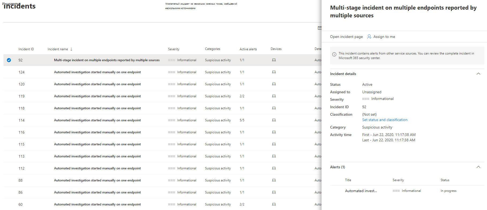
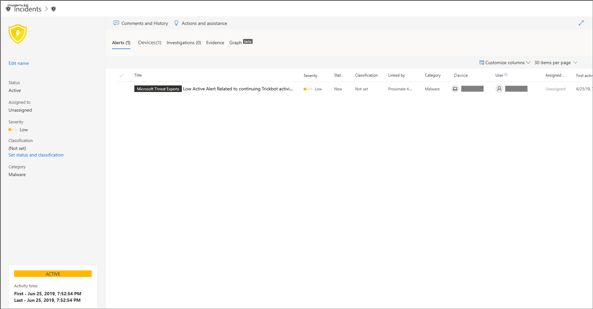

# Управление microsoft Defender для инцидентов конечной точкиManage Microsoft Defender for Endpoint incidents

[!INCLUDE [Microsoft 365 Defender rebranding](../../includes/microsoft-defender.md)]

**Область применения:****Applies to:**
- [Microsoft Defender для конечной точкиMicrosoft Defender for Endpoint](https://go.microsoft.com/fwlink/p/?linkid=2154037)
- [Microsoft 365 DefenderMicrosoft 365 Defender](https://go.microsoft.com/fwlink/?linkid=2118804)

> Хотите испытать Microsoft Defender для конечной точки?Want to experience Microsoft Defender for Endpoint? [Зарегистрився для бесплатной пробной.Sign up for a free trial.](https://www.microsoft.com/microsoft-365/windows/microsoft-defender-atp?ocid=docs-wdatp-exposedapis-abovefoldlink)

Управление инцидентами является важной частью каждой операции по кибербезопасности.Managing incidents is an important part of every cybersecurity operation. Вы можете управлять инцидентами, выбрав инцидент из очереди **Инциденты** или области управления **инцидентами.**You can manage incidents by selecting an incident from the **Incidents queue** or the **Incidents management pane**. 

Выбор инцидента из очереди **Инциденты**  приводит к области управления инцидентами, где можно открыть страницу инцидента для дополнительных сведений.Selecting an incident from the **Incidents queue** brings up the **Incident management pane** where you can open the incident page for details.

Вы можете назначить инциденты себе, изменить состояние и классификацию, переименовать или прокомментировать их, чтобы отслеживать их ход.You can assign incidents to yourself, change the status and classification, rename, or comment on them to keep track of their progress.

> [!TIP]
> Для дополнительной видимости с первого взгляда имена инцидентов автоматически создаются на основе атрибутов оповещений, таких как количество затронутых конечных точек, пострадавших пользователей, источников обнаружения или категорий.For additional visibility at a glance, incident names are automatically generated based on alert attributes such as the number of endpoints affected, users affected, detection sources or categories. Это позволяет быстро понять масштаб инцидента.This allows you to quickly understand the scope of the incident.
>
> Например: *многоэтапный инцидент на нескольких конечных точках, сообщаемой несколькими источниками.*For example: *Multi-stage incident on multiple endpoints reported by multiple sources.*
>
> Инциденты, существовающие до начала автоматического именования инцидентов, будут сохранять их имена.Incidents that existed prior the rollout of automatic incident naming will retain their names.
>

## Назначение инцидентовAssign incidents
Если инцидент еще не назначен, вы  можете назначить мне назначение инцидента самому.If an incident has not been assigned yet, you can select **Assign to me** to assign the incident to yourself. При этом передается не только владение инцидентом, но и все связанные с ним оповещения.Doing so assumes ownership of not just the incident, but also all the alerts associated with it.

## Установка статуса и классификацииSet status and classification
### Статус инцидентаIncident status
Инциденты можно распределять по категориям (например, **Активно** или **Устранено**), изменяя его статус в ходе расследования.You can categorize incidents (as **Active**, or **Resolved**) by changing their status as your investigation progresses. Это помогает организовать обработку инцидентов вашей группой и управлять ею.This helps you organize and manage how your team can respond to incidents.

Например, аналитик SoC может просмотреть срочные инциденты **Active** за день и назначить их себе для расследования.For example, your SoC analyst can review the urgent **Active** incidents for the day, and decide to assign them to himself for investigation.

Кроме того, аналитик SoC может установить, что инцидент **устранен,** если инцидент был исправлен.Alternatively, your SoC analyst might set the incident as **Resolved** if the incident has been remediated. 

### КлассификацияClassification
Можно не задавать классификацию, а также указать, будет ли инцидент истинным или ложным.You can choose not to set a classification, or decide to specify whether an incident is true or false. Это поможет заметить закономерности в инцидентах и изучить их.Doing so helps the team see patterns and learn from them.

### Добавление примечанийAdd comments
К инциденту можно добавить комментарии, а также просмотреть историю связанных с ним событий, чтобы узнать об изменениях, ранее внесенных в него.You can add comments and view historical events about an incident to see previous changes made to it.

Каждое изменение или комментарий к оповещению записывается в раздел комментариев и журнал.Whenever a change or comment is made to an alert, it is recorded in the Comments and history section.

Добавленные комментарии сразу же появляются в соответствующей области.Added comments instantly appear on the pane.

## Статьи по темеRelated topics
- [Очередь инцидентовIncidents queue](/microsoft-365/security/defender-endpoint/view-incidents-queue)
- [Просмотр и организация очереди инцидентовView and organize the Incidents queue](view-incidents-queue.md)
- [Исследование инцидентовInvestigate incidents](investigate-incidents.md)
