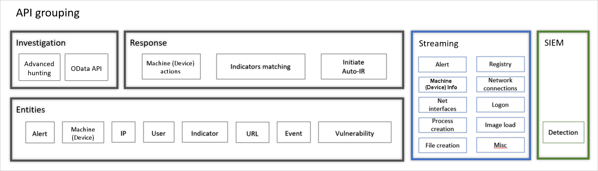

# Обзор управления и интерфейсов API 

[!INCLUDE [Microsoft 365 Defender rebranding](../../includes/microsoft-defender.md)]

**Область применения:**
- [Microsoft Defender для конечной точки](https://go.microsoft.com/fwlink/p/?linkid=2154037)
- [Microsoft 365 Defender](https://go.microsoft.com/fwlink/?linkid=2118804)

> Хотите испытать Defender для конечной точки? [Зарегистрився для бесплатной пробной.](https://www.microsoft.com/microsoft-365/windows/microsoft-defender-atp?ocid=docs-mgt-apis-abovefoldlink)

Defender for Endpoint поддерживает широкий спектр параметров, чтобы клиенты могли легко принять платформу. 

Признавая, что клиентские среды и структуры могут отличаться, Defender for Endpoint был создан с гибкостью и детализацией, чтобы соответствовать различным требованиям клиента. 

## Вход в конечную точку и доступ к порталу 

Встроенное устройство полностью интегрировано в Microsoft Endpoint Manager и Microsoft Intune для клиентских устройств и Azure Defender для серверных устройств, обеспечивая полный комплексный опыт настройки, развертывания и мониторинга. Кроме того, Microsoft Defender для конечной точки поддерживает групповую политику и другие сторонние средства, используемые для управления устройствами.

Defender for Endpoint обеспечивает тонкий контроль над тем, что пользователи с доступом к порталу могут видеть и делать с помощью гибкости управления доступом на основе ролей (RBAC). Модель RBAC поддерживает все вкусы структуры групп безопасности:
- Глобально распределенные организации и группы безопасности
- Многоуровневые группы операций по безопасности модели
- Полностью сегрегация подразделений с одними централизованными группами глобальных операций безопасности 

## Доступные API
Решение Microsoft Defender для конечной точки построено на платформе, готовой к интеграции.

Defender for Endpoint предоставляет большую часть своих данных и действий с помощью набора программных API. Эти API позволят автоматизировать рабочий процесс и инновациям на основе возможностей Defender для конечных точек.

  

API Defender для конечных точек можно сгруппить на три:
- Microsoft Defender для API конечных точек 
- API потоковой передачи необработанных данных
- Интеграция SIEM

## Microsoft Defender для API конечных точек

Defender for Endpoint предлагает многоуровневую модель API, которая предоставляет данные и возможности в структурированной, понятной и простой в использовании модели, выставленной через стандартную модель проверки подлинности и авторизации на основе Azure AD, позволяющую получать доступ в контексте пользователей или приложений SaaS. Модель API предназначена для последовательного использования сущностями и возможностями. 

Просмотрите это видео для краткого обзора API Defender для API endpoint. 
>[!VIDEO https://www.microsoft.com/en-us/videoplayer/embed/RE4d73M]

**API** исследования предоставляет богатство Defender для конечной точки — разоблачение вычисляемого или "профилного" сущностей (например, устройств, пользователей и файлов) и дискретных событий (например, создания процессов и создания файлов), которые обычно описывают поведение, связанное с объектом, позволяя доступ к данным с помощью интерфейсов расследования, позволяющих получать доступ к данным на основе запросов. Дополнительные сведения см. в [поддерживаемых API.](exposed-apis-list.md)

API **ответа** предоставляет возможность выполнять действия в службе и на устройствах, позволяя клиентам гнать индикаторы, управлять настройками, состоянием оповещения, а также принимать меры реагирования на устройствах программным образом, таких как изолирование устройств от сети, файлы карантина и другие. 

## API потоковой передачи необработанных данных 
API потоковой передачи необработанных данных Defender для конечных точек предоставляет клиентам возможность отгрузки событий и оповещений в режиме реального времени из своих экземпляров по мере их возникновения в едином потоке данных, обеспечивая низкую задержку и механизм доставки высокой пропускной способности.

Сведения о событиях Defender for Endpoint перенадвигаются непосредственно в хранилище Azure для долгосрочного хранения данных или в центры событий Azure для использования службами визуализации или дополнительными двигателями обработки данных. 

Дополнительные сведения см. в [API потоковой передачи необработанных данных.](raw-data-export.md)

Новый API потокового Microsoft 365 Defender включает события электронной почты и оповещения, а также события устройств. Дополнительные сведения см. [в Microsoft 365 API потоковой передачи Defender.](../defender/streaming-api.md)

## SIEM API
При включении интеграции сведений о безопасности и управления событиями (SIEM) это позволяет извлекть обнаружения из Центр безопасности в Microsoft Defender с помощью решения SIEM или напрямую подключаясь к API REST обнаружения. Это активирует раздел сведений о доступе к соединителем SIEM с предварительно заселяемыми значениями, и приложение создается под вашим клиентом Azure Active Directory Azure AD. Дополнительные сведения см. в [см. в деле интеграции SIEM.](enable-siem-integration.md)

## Связанные статьи
- [Доступ к API конечных точек Microsoft Defender ](apis-intro.md)
- [Поддерживаемые API](exposed-apis-list.md)
- [Возможности для технических партнеров](partner-integration.md)

