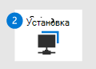

# Миграция из McAfee — этап 1. Подготовка к миграцииMigrate from McAfee - Phase 1: Prepare for your migration

**Область применения:****Applies to:**
- [Microsoft Defender для конечной точкиMicrosoft Defender for Endpoint](https://go.microsoft.com/fwlink/p/?linkid=2146631)
- [Microsoft 365 DefenderMicrosoft 365 Defender](https://go.microsoft.com/fwlink/?linkid=2118804)

| Этап 1. ПодготовкаPhase 1: Prepare | [Этап 2. НастройкаPhase 2: Set up](mcafee-to-microsoft-defender-setup.md) | [Этап 3. На бортуPhase 3: Onboard](mcafee-to-microsoft-defender-onboard.md) |
|--|--|--|
|*Вы здесь!**You are here!*| | |

Добро пожаловать на этап Подготовки к переходу из **[McAfee Endpoint Security (McAfee) в Microsoft Defender для конечной точки](mcafee-to-microsoft-defender-migration.md#the-migration-process)**.**Welcome to the Prepare phase of [migrating from McAfee Endpoint Security (McAfee) to Microsoft Defender for Endpoint](mcafee-to-microsoft-defender-migration.md#the-migration-process)**. 

Этот этап миграции включает следующие действия:This migration phase includes the following steps:
1. [Получать и развертывать обновления на устройствах организацииGet and deploy updates across your organization's devices](#get-and-deploy-updates-across-your-organizations-devices)
2. [Получите Microsoft Defender для конечной точки](#get-microsoft-defender-for-endpoint).[Get Microsoft Defender for Endpoint](#get-microsoft-defender-for-endpoint).
3. [Предоставление доступа к Центру безопасности Защитника Майкрософт.](#grant-access-to-the-microsoft-defender-security-center)[Grant access to the Microsoft Defender Security Center](#grant-access-to-the-microsoft-defender-security-center).
4. [Настройка параметров прокси-сервера устройства](#configure-device-proxy-and-internet-connectivity-settings)и подключения к Интернету.[Configure device proxy and internet connectivity settings](#configure-device-proxy-and-internet-connectivity-settings).

## Получать и развертывать обновления на устройствах организацииGet and deploy updates across your organization's devices

В качестве наилучшей практики следите за тем, чтобы устройства и конечные точки организации были в курсе.As a best practice, keep your organization's devices and endpoints up to date. Убедитесь, что решение McAfee Endpoint Security (McAfee) обновлено, а операционные системы и приложения организации также имеют последние обновления.Make sure your McAfee Endpoint Security (McAfee) solution is up to date, and that the operating systems and apps your organization is also have the latest updates. Это поможет предотвратить проблемы позже при переходе на антивирус Microsoft Defender для конечной точки и Microsoft Defender.Doing this now can help prevent problems later as you migrate to Microsoft Defender for Endpoint and Microsoft Defender Antivirus.

### Убедитесь, что решение McAfee устарелоMake sure your McAfee solution is up to date

Следите за обновлениями McAfee и убедитесь, что на устройствах организации имеются последние обновления безопасности.Keep McAfee up to date, and make sure that your organization's devices have the latest security updates. Нужна помощь?Need help? Вот некоторые ресурсы McAfee:Here are some McAfee resources:

- [Документация по корпоративным продуктам McAfee: как работает безопасность конечных точекMcAfee Enterprise Product Documentation: How Endpoint Security Works](https://docs.mcafee.com/bundle/endpoint-security-10.7.x-common-product-guide-windows/page/GUID-1207FF39-D1D2-481F-BBD9-E4079112A8DD.html)

- [Техническая статья Центра знаний McAfee: Центр безопасности Windows периодически неправильно сообщает о том, что при работе с Windows 10 безопасность конечных точек отключена.McAfee Knowledge Center Technical Article: Windows Security Center intermittently incorrectly reports that Endpoint Security is disabled when running on Windows 10](https://kc.mcafee.com/corporate/index?page=content&id=KB91830) 

- [Техническая статья Центра знаний McAfee: Центр безопасности Windows сообщает, что при запуске endpoint Security отключается служба безопасности конечных точек.McAfee Knowledge Center Technical Article: Windows Security Center reports Endpoint Security is disabled when Endpoint Security is running](https://kc.mcafee.com/corporate/index?page=content&id=KB91428)

- Поддержка службы McAfee ( [http://mysupport.mcafee.com](http://mysupport.mcafee.com) )Your McAfee support ServicePortal ([http://mysupport.mcafee.com](http://mysupport.mcafee.com))

### Убедитесь, что устройства организации устарелиMake sure your organization's devices are up to date

Нужна помощь в обновлении устройств организации?Need help updating your organization's devices? См. следующие ресурсы:See the following resources:

|OSOS | РесурсResource |
|:--|:--|
|WindowsWindows |[Центр обновления МайкрософтMicrosoft Update](https://www.update.microsoft.com) |
|macOSmacOS | [Обновление программного обеспечения на компьютере MacHow to update the software on your Mac](https://support.apple.com/HT201541)|
|iOSiOS |[Обновление iPhone, iPad или iPod touchUpdate your iPhone, iPad, or iPod touch](https://support.apple.com/HT204204)|
|AndroidAndroid |[Проверка & обновления версии AndroidCheck & update your Android version](https://support.google.com/android/answer/7680439) |
|LinuxLinux | [Linux 101: обновление системыLinux 101: Updating Your System](https://www.linux.com/training-tutorials/linux-101-updating-your-system) |

## Get Microsoft Defender for EndpointGet Microsoft Defender for Endpoint

Теперь, когда вы обновили устройства организации, следующим шагом будет получить Microsoft Defender для конечной точки, назначить лицензии и убедиться, что служба будет предусмотрена.Now that you've updated your organization's devices, the next step is to get Microsoft Defender for Endpoint, assign licenses, and make sure the service is provisioned.

1. Купить или попробовать Microsoft Defender для конечной точки сегодня.Buy or try Microsoft Defender for Endpoint today. [Начните бесплатную пробную работу или запросить цитату.](https://aka.ms/mdatp)[Start a free trial or request a quote](https://aka.ms/mdatp). 

2. Убедитесь, что лицензии надлежащим образом подготовить.Verify that your licenses are properly provisioned. [Проверьте состояние лицензии.](https://docs.microsoft.com/microsoft-365/security/defender-endpoint/production-deployment#check-license-state)[Check your license state](https://docs.microsoft.com/microsoft-365/security/defender-endpoint/production-deployment#check-license-state).

3. В качестве глобального администратора или администратора безопасности установите специальный облачный экземпляр Microsoft Defender для конечной точки.As a global administrator or security administrator, set up your dedicated cloud instance of Microsoft Defender for Endpoint. См. [в веб-сайте Microsoft Defender для установки конечной точки: конфигурация клиента.](https://docs.microsoft.com/microsoft-365/security/defender-endpoint/production-deployment#tenant-configuration)See [Microsoft Defender for Endpoint setup: Tenant configuration](https://docs.microsoft.com/microsoft-365/security/defender-endpoint/production-deployment#tenant-configuration).

4. Если конечные точки (например, устройства) в вашей организации используют прокси-сервер для доступа к Интернету, см. в [веб-сайте Microsoft Defender for Endpoint setup: Network configuration.](https://docs.microsoft.com/microsoft-365/security/defender-endpoint/production-deployment#network-configuration)If endpoints (such as devices) in your organization use a proxy to access the internet, see [Microsoft Defender for Endpoint setup: Network configuration](https://docs.microsoft.com/microsoft-365/security/defender-endpoint/production-deployment#network-configuration).
 
На этом этапе вы готовы предоставить доступ администраторам безопасности и операторам безопасности, которые будут использовать Центр безопасности Microsoft Defender ( [https://aka.ms/MDATPportal](https://aka.ms/MDATPportal) ).At this point, you are ready to grant access to your security administrators and security operators who will use the Microsoft Defender Security Center ([https://aka.ms/MDATPportal](https://aka.ms/MDATPportal)). 

> [!NOTE]
> Центр безопасности защитника Майкрософт иногда называют порталом Microsoft Defender для конечных точек.The Microsoft Defender Security Center is sometimes referred to as the Microsoft Defender for Endpoint portal. 

## Предоставление доступа к Центру безопасности защитника МайкрософтGrant access to the Microsoft Defender Security Center

Центр безопасности Защитника Майкрософт () — это место, где вы можете получить доступ и настроить функции и возможности [https://aka.ms/MDATPportal](https://aka.ms/MDATPportal) Microsoft Defender для конечной точки.The Microsoft Defender Security Center ([https://aka.ms/MDATPportal](https://aka.ms/MDATPportal)) is where you access and configure features and capabilities of Microsoft Defender for Endpoint. Дополнительные сведения см. в обзоре Центра безопасности [защитника Майкрософт.](https://docs.microsoft.com/microsoft-365/security/defender-endpoint/use)To learn more, see [Overview of the Microsoft Defender Security Center](https://docs.microsoft.com/microsoft-365/security/defender-endpoint/use).

Разрешения центру безопасности Microsoft Defender можно предоставить с помощью базовых разрешений или управления доступом на основе ролей (RBAC).Permissions to the Microsoft Defender Security Center can be granted by using either basic permissions or role-based access control (RBAC). Рекомендуется использовать RBAC для более детального контроля над разрешениями.We recommend using RBAC so that you have more granular control over permissions.

1. Планирование ролей и разрешений для администраторов безопасности и операторов безопасности.Plan the roles and permissions for your security administrators and security operators. См. [управление доступом на основе ролей.](https://docs.microsoft.com/microsoft-365/security/defender-endpoint/prepare-deployment#role-based-access-control)See [Role-based access control](https://docs.microsoft.com/microsoft-365/security/defender-endpoint/prepare-deployment#role-based-access-control).

2. Настройка и настройка RBAC.Set up and configure RBAC. Мы рекомендуем использовать [Intune](https://docs.microsoft.com/mem/intune/fundamentals/what-is-intune) для настройки RBAC, особенно если ваша организация использует сочетание устройств с Windows 10, macOS, iOS и Android.We recommend using [Intune](https://docs.microsoft.com/mem/intune/fundamentals/what-is-intune) to configure RBAC, especially if your organization is using a combination of Windows 10, macOS, iOS, and Android devices. Настройка [RBAC с помощью Intune](https://docs.microsoft.com/mem/intune/fundamentals/role-based-access-control).See [setting up RBAC using Intune](https://docs.microsoft.com/mem/intune/fundamentals/role-based-access-control).

    Если вашей организации требуется метод, не intune, выберите один из следующих вариантов:If your organization requires a method other than Intune, choose one of the following options:
    - [Диспетчер конфигурацийConfiguration Manager](https://docs.microsoft.com/mem/configmgr/core/servers/deploy/configure/configure-role-based-administration)
    - [Расширенное управление групповыми политикамиAdvanced Group Policy Management](https://docs.microsoft.com/microsoft-desktop-optimization-pack/agpm)
    - [Центр администрирования WindowsWindows Admin Center](https://docs.microsoft.com/windows-server/manage/windows-admin-center/overview)

3. Предоставление доступа к Центру безопасности Защитника Майкрософт.Grant access to the Microsoft Defender Security Center. (Нужна помощь?(Need help? См. [в руб. Управление доступом к порталу с помощью RBAC).](https://docs.microsoft.com/microsoft-365/security/defender-endpoint/rbac)See [Manage portal access using RBAC](https://docs.microsoft.com/microsoft-365/security/defender-endpoint/rbac)).

## Настройка параметров прокси-сервера устройства и подключения к ИнтернетуConfigure device proxy and internet connectivity settings

Чтобы включить связь между устройствами и Microsoft Defender для конечной точки, настройте параметры прокси и Интернета.To enable communication between your devices and Microsoft Defender for Endpoint, configure proxy and internet settings. В следующей таблице содержатся ссылки на ресурсы, которые можно использовать для настройки прокси-серверов и параметров Интернета для различных операционных систем и возможностей:The following table includes links to resources you can use to configure your proxy and internet settings for various operating systems and capabilities:

|ВозможностиCapabilities  | Операционная системаOperating System | РесурсыResources |
|--|--|--|
|[Обнаружение конечных точек и ответ](https://docs.microsoft.com/microsoft-365/security/defender-endpoint/overview-endpoint-detection-response) (EDR)[Endpoint detection and response](https://docs.microsoft.com/microsoft-365/security/defender-endpoint/overview-endpoint-detection-response) (EDR) |- [Windows 10](https://docs.microsoft.com/windows/release-health/release-information)- [Windows 10](https://docs.microsoft.com/windows/release-health/release-information)  - [Windows Server 2019](https://docs.microsoft.com/windows/release-health/status-windows-10-1809-and-windows-server-2019)- [Windows Server 2019](https://docs.microsoft.com/windows/release-health/status-windows-10-1809-and-windows-server-2019) - [Windows Server 1803 или более поздней версии](https://docs.microsoft.com/windows-server/get-started/whats-new-in-windows-server-1803)- [Windows Server 1803 or later](https://docs.microsoft.com/windows-server/get-started/whats-new-in-windows-server-1803)  |[Настройка параметров прокси-сервера и подключения к ИнтернетуConfigure machine proxy and internet connectivity settings](https://docs.microsoft.com/microsoft-365/security/defender-endpoint/configure-proxy-internet) |
|EDREDR |- [Windows Server 2016](https://docs.microsoft.com/windows/release-health/status-windows-10-1607-and-windows-server-2016)- [Windows Server 2016](https://docs.microsoft.com/windows/release-health/status-windows-10-1607-and-windows-server-2016)  - [Windows Server 2012 R2](https://docs.microsoft.com/windows/release-health/status-windows-8.1-and-windows-server-2012-r2)- [Windows Server 2012 R2](https://docs.microsoft.com/windows/release-health/status-windows-8.1-and-windows-server-2012-r2) - [Windows Server 2008 R2 SP1](https://docs.microsoft.com/windows/release-health/status-windows-7-and-windows-server-2008-r2-sp1)- [Windows Server 2008 R2 SP1](https://docs.microsoft.com/windows/release-health/status-windows-7-and-windows-server-2008-r2-sp1) - [Windows 8.1](https://docs.microsoft.com/windows/release-health/status-windows-8.1-and-windows-server-2012-r2)- [Windows 8.1](https://docs.microsoft.com/windows/release-health/status-windows-8.1-and-windows-server-2012-r2) - [Windows 7 SP1](https://docs.microsoft.com/windows/release-health/status-windows-7-and-windows-server-2008-r2-sp1)- [Windows 7 SP1](https://docs.microsoft.com/windows/release-health/status-windows-7-and-windows-server-2008-r2-sp1) |[Настройка параметров прокси и подключения к ИнтернетуConfigure proxy and internet connectivity settings](https://docs.microsoft.com/microsoft-365/security/defender-endpoint/onboard-downlevel#configure-proxy-and-internet-connectivity-settings) |
|EDREDR  |macOS:macOS:  - 10.15 (Каталина)- 10.15 (Catalina) - 10.14 (Mojave)- 10.14 (Mojave)  - 10.13 (Высокая сьерра)- 10.13 (High Sierra)  |[Защитник Microsoft для конечной точки для Mac: сетевые подключенияMicrosoft Defender for Endpoint for Mac: Network connections](https://docs.microsoft.com/microsoft-365/security/defender-endpoint/microsoft-defender-atp-mac#network-connections) |
|[Антивирус Microsoft DefenderMicrosoft Defender Antivirus](https://docs.microsoft.com/windows/security/threat-protection/microsoft-defender-antivirus/microsoft-defender-antivirus-in-windows-10) |- [Windows 10](https://docs.microsoft.com/windows/release-health/release-information)- [Windows 10](https://docs.microsoft.com/windows/release-health/release-information)  - [Windows Server 2019](https://docs.microsoft.com/windows/release-health/status-windows-10-1809-and-windows-server-2019)- [Windows Server 2019](https://docs.microsoft.com/windows/release-health/status-windows-10-1809-and-windows-server-2019) - [Windows Server 1803 или более поздней версии](https://docs.microsoft.com/windows-server/get-started/whats-new-in-windows-server-1803)- [Windows Server 1803 or later](https://docs.microsoft.com/windows-server/get-started/whats-new-in-windows-server-1803)  - [Windows Server 2016](https://docs.microsoft.com/windows-server/get-started/whats-new-in-windows-server-2016)- [Windows Server 2016](https://docs.microsoft.com/windows-server/get-started/whats-new-in-windows-server-2016) |[Настройка и проверка сетевого подключения антивирусной программы "Защитник Windows"Configure and validate Microsoft Defender Antivirus network connections](https://docs.microsoft.com/windows/security/threat-protection/microsoft-defender-antivirus/configure-network-connections-microsoft-defender-antivirus)  |
|Защита от вирусовAntivirus |macOS:macOS:  - 10.15 (Каталина)- 10.15 (Catalina) - 10.14 (Mojave)- 10.14 (Mojave)  - 10.13 (Высокая сьерра)- 10.13 (High Sierra) |[Защитник Microsoft для конечной точки для Mac: сетевые подключенияMicrosoft Defender for Endpoint for Mac: Network connections](https://docs.microsoft.com/microsoft-365/security/defender-endpoint/microsoft-defender-atp-mac#network-connections) |
|Защита от вирусовAntivirus |Linux:Linux:  - RHEL 7.2+- RHEL 7.2+ - CentOS Linux 7.2+- CentOS Linux 7.2+ - Ubuntu 16 LTS или более высокий LTS- Ubuntu 16 LTS, or higher LTS - SLES 12+- SLES 12+ - Debian 9+- Debian 9+ - Oracle Linux 7.2- Oracle Linux 7.2 |[Microsoft Defender для конечной точки для Linux: сетевые подключенияMicrosoft Defender for Endpoint for Linux: Network connections](https://docs.microsoft.com/microsoft-365/security/defender-endpoint/microsoft-defender-atp-linux#network-connections) 

## Следующий шагNext step

**Поздравляем!****Congratulations**! Вы завершили этап **подготовки** перехода из [McAfee в Microsoft Defender для конечной точки!](mcafee-to-microsoft-defender-migration.md#the-migration-process)You have completed the **Prepare** phase of [migrating from McAfee to Microsoft Defender for Endpoint](mcafee-to-microsoft-defender-migration.md#the-migration-process)!

- [Приступить к настройкам Microsoft Defender для конечной точки](mcafee-to-microsoft-defender-setup.md).[Proceed to set up Microsoft Defender for Endpoint](mcafee-to-microsoft-defender-setup.md).
