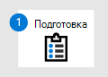
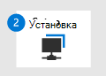

# Миграция из McAfee — этап 2. Настройка Microsoft Defender для конечной точки

**Область применения:**
- [Microsoft Defender для конечной точки](https://go.microsoft.com/fwlink/p/?linkid=2154037)
- [Microsoft 365 Defender](https://go.microsoft.com/fwlink/?linkid=2118804)

| [Этап 1. Подготовка](mcafee-to-microsoft-defender-prepare.md) | Этап 2. Настройка | [Этап 3. Подключение](mcafee-to-microsoft-defender-onboard.md) |
|--|--|--|
||*Вы здесь!* | |

Добро пожаловать на этап установки перехода из **[McAfee Endpoint Security (McAfee) в Defender для конечной точки.](mcafee-to-microsoft-defender-migration.md#the-migration-process)** Этот этап включает в себя следующие действия:

1. [Переустановка или антивирусная программа в Microsoft Defender на конечных точках.](#reinstall-or-enable-microsoft-defender-antivirus-on-your-endpoints)

2. [Настройка Защитника для конечной точки](#configure-defender-for-endpoint).

3. [Добавьте Microsoft Defender для конечной точки в список исключений для McAfee](#add-microsoft-defender-for-endpoint-to-the-exclusion-list-for-mcafee).

4. [Добавьте McAfee в список исключений для антивирусная программа в Microsoft Defender.](#add-mcafee-to-the-exclusion-list-for-microsoft-defender-antivirus)

5. [Настройка групп устройств, коллекций устройств и подразделений организации.](#set-up-your-device-groups-device-collections-and-organizational-units)

6. [Настройка политик антивирусного обеспечения и защиты в режиме реального времени.](#configure-antimalware-policies-and-real-time-protection)

## Переустановка или антивирусная программа в Microsoft Defender на конечных точках

В некоторых версиях Windows, антивирусная программа в Microsoft Defender при установке антивирусного и антивирусного решения, не включаемого в Корпорацию Майкрософт, антивирусная программа в Microsoft Defender отключены или отключены. Дополнительные сведения см. [в антивирусная программа в Microsoft Defender совместимости.](microsoft-defender-antivirus-compatibility.md)

В Windows клиенты при установке антивирусного и антивирусного решения, не включаемого в Microsoft, антивирусная программа в Microsoft Defender автоматически отключается до тех пор, пока эти устройства не будут переназначатся в Defender для endpoint. Когда конечные точки клиента находятся на борту в Defender for Endpoint, антивирусная программа в Microsoft Defender переходит в пассивный режим до тех пор, пока не будет отсечено антивирусное решение, не в microsoft. антивирусная программа в Microsoft Defender по-прежнему следует установить, но, скорее всего, отключен на данном этапе процесса миграции. Если антивирусная программа в Microsoft Defender не был неустановлен, вам не нужно принимать никаких действий для Windows клиентов.

На Windows серверах при установке антивирусного и антивирусного программного обеспечения, не включаемого в Microsoft, антивирусная программа в Microsoft Defender отключает вручную (если не отключать). Следующие задачи помогают убедиться, что антивирусная программа в Microsoft Defender установлен и настроен в пассивный режим на Windows Server.

Этот этап процесса миграции включает в себя следующие задачи:
- [Настройка параметра DisableAntiSpyware](#set-disableantispyware-to-false-on-windows-server) для ложного Windows Server (только при необходимости)
- [Переустановка антивирусная программа в Microsoft Defender на Windows Server;](#reinstall-microsoft-defender-antivirus-on-windows-server)
- [Настройка антивирусная программа в Microsoft Defender пассивного режима на Windows Server](#set-microsoft-defender-antivirus-to-passive-mode-on-windows-server)

### Установите отключениеAntiSpyware на ложный Windows Server

Ключ [реестра DisableAntiSpyware](/windows-hardware/customize/desktop/unattend/security-malware-windows-defender-disableantispyware) использовался в прошлом для отключения антивирусная программа в Microsoft Defender и развертывания другого антивирусного продукта, например McAfee. Как правило, этот ключ реестра не должен быть на Windows устройствах и конечных точках; Однако, если у вас есть настройка, вот как установить `DisableAntiSpyware` его значение false:

1. На устройстве Windows Server откройте редактор реестра.

2. Перейдите на сайт `HKEY_LOCAL_MACHINE\SOFTWARE\Policies\Microsoft\Windows Defender`.

3. В этой папке найди запись DWORD под названием **DisableAntiSpyware.**

   - Если вы не видите эту запись, вы все настроены.

   - Если вы видите **DisableAntiSpyware,** переходите к шагу 4.

4. Щелкните правой кнопкой мыши DWORD DisableAntiSpyware и выберите **Изменение**.

5. Установите значение `0` . (Это задает значение ключа реестра *ложным.)*

> [!TIP]
> Дополнительные информацию об этом ключе реестра см. в [см. в записи DisableAntiSpyware.](/windows-hardware/customize/desktop/unattend/security-malware-windows-defender-disableantispyware)

### Переустановка антивирусная программа в Microsoft Defender на Windows Server

> [!NOTE]
> Следующая процедура применяется только к конечным точкам или устройствам, которые запускают следующие версии Windows:
> - Windows Server 2019
> - Windows Сервер, версия 1803 (режим только для ядра)
> - Windows Server 2016

1. Как локальный администратор на конечной точке или устройстве откройте Windows PowerShell.

2. Запустите следующие cmdlets PowerShell:  
   
   `Dism /online /Get-FeatureInfo /FeatureName:Windows-Defender-Features`  
   
   `Dism /online /Get-FeatureInfo /FeatureName:Windows-Defender`  

   > [!NOTE]
   > При использовании команды DISM в последовательности задач под управлением PS требуется следующий путь к cmd.exe.
   > Примеры:
   >
   > `c:\windows\sysnative\cmd.exe /c Dism /online /Get-FeatureInfo /FeatureName:Windows-Defender-Features` 
   >
   > `c:\windows\sysnative\cmd.exe /c Dism /online /Get-FeatureInfo /FeatureName:Windows-Defender` 

3. Чтобы проверить антивирусная программа в Microsoft Defender запущен, используйте следующий комдлет PowerShell:  
   
   `Get-Service -Name windefend`

   И посмотрите на состояние *Running*.

### Настройка антивирусная программа в Microsoft Defender пассивного режима на Windows Server

1. Откройте редактор реестра, а затем перейдите к `Computer\HKEY_LOCAL_MACHINE\SOFTWARE\Policies\Microsoft\Windows Advanced Threat Protection` .

2. Изменить (или создать) запись DWORD под названием **ForcePassiveMode** и указать следующие параметры:

   - Установите значение DWORD в `1` .

   - В базе выберите **Hexadecimal**.

> [!NOTE]
> После встройки в Defender для конечной точки может потребоваться антивирусная программа в Microsoft Defender пассивный режим на Windows Server.

### Вы используете Windows Server 2016?

Если у вас есть конечные точки Windows Server 2016, вы не антивирусная программа в Microsoft Defender запустить антивирусная программа в Microsoft Defender наряду с антивирусным и антивирусным решением, не относя к Майкрософт. антивирусная программа в Microsoft Defender не может работать в пассивном режиме на Windows Server 2016. В этом случае необходимо удалить решение, не влияемого на антивирусы и антивирусные программы Майкрософт, и установить или включить антивирусная программа в Microsoft Defender. Дополнительные дополнительные возможности см. в этой ссылке в списке совместимость антивирусных [решений с Защитником для конечной точки.](/microsoft-365/security/defender-endpoint/microsoft-defender-antivirus-compatibility)

Если вы используете Windows Server 2016 и у вас возникли проблемы с включением антивирусная программа в Microsoft Defender, используйте следующий cmdlet PowerShell:

`mpcmdrun -wdenable`

Дополнительные сведения см. [в антивирусная программа в Microsoft Defender на Windows Server.](microsoft-defender-antivirus-on-windows-server.md)

### Настройка антивирусная программа в Microsoft Defender пассивного режима на Windows Server

Так как ваша организация по-прежнему использует McAfee, необходимо антивирусная программа в Microsoft Defender пассивный режим. Таким образом, McAfee и антивирусная программа в Microsoft Defender могут работать бок о бок, пока вы не закончите onboarding к Защитнику для конечной точки.

1. Откройте редактор реестра и перейдите к  
   `Computer\HKEY_LOCAL_MACHINE\SOFTWARE\Policies\Microsoft\Windows Advanced Threat Protection`.

2. Изменить (или создать) запись DWORD под названием **ForcePassiveMode** и указать следующие параметры:
   
   - Установите значение DWORD в **1**.
   
   - В **базовой** статье выберите **Hexadecimal**.

> [!NOTE]
> Для набора ключа реестра можно использовать другие методы, например следующие:
>- [Предпочтения групповой политики](/previous-versions/windows/it-pro/windows-server-2012-R2-and-2012/dn581922(v=ws.11))
>- [Пакет в диспетчере конфигурации](/mem/configmgr/apps/deploy-use/packages-and-programs)

## Настройка Защитника для конечной точки

Этот этап процесса миграции включает настройку Defender для конечной точки. Рекомендуется использовать Intune; Однако вы можете использовать любой из методов, перечисленных в следующей таблице:

|Метод  |Действия  |
|---------|---------|
|[Intune](/mem/intune/fundamentals/tutorial-walkthrough-endpoint-manager) 
**ПРИМЕЧАНИЕ.** Intune теперь является частью Microsoft Endpoint Manager. |1. Перейдите в [центр администрирования Microsoft Endpoint Manager и](https://go.microsoft.com/fwlink/?linkid=2109431) войдите.
2. **Выберите профили конфигурации** устройств и выберите тип профиля, который  >  необходимо настроить.  Если вы еще не  создали тип профиля ограничений устройства или хотите создать новый, см. в этой странице Настройка параметров ограничения устройств в [Microsoft Intune.](/intune/device-restrictions-configure)
3. Выберите **свойства,** а затем выберите **параметры конфигурации: Изменить**.
4. Расширение **антивирусная программа в Microsoft Defender**. 
5. Включить **облачную защиту.**
6. В **запросных пользователях перед** отсевом образца отправки выберите отправку всех **образцов автоматически.**
7. При **обнаружении потенциально нежелательных** приложений при отсеве выберите **Включить** или **Аудит.**
8. **Выберите обзор + сохранить,** а затем выберите **Сохранить**.
Дополнительные сведения о профилях устройств Intune, в том числе о создании и настройке параметров, см. в Microsoft Intune [профилей устройств?](/intune/device-profiles).|
|Панель управления в Windows     |Следуйте указаниям здесь: [включи антивирусная программа в Microsoft Defender](/mem/intune/user-help/turn-on-defender-windows). 
**ПРИМЕЧАНИЕ.** Вы можете *антивирусная программа* вместо антивирусная программа в Microsoft Defender *в* некоторых версиях Windows.        |
|[Расширенное управление групповыми политиками](/microsoft-desktop-optimization-pack/agpm/)  или [Консоль управления групповой политикой](use-group-policy-microsoft-defender-antivirus.md)  |1. Перейдите к `Computer configuration > Administrative templates > Windows components > Microsoft Defender Antivirus` . 
2. И посмотрите на политику, называемую **отключением антивирусная программа в Microsoft Defender**.
3. **Выберите параметр политики редактирования** и убедитесь, что политика отключена. Это позволяет антивирусная программа в Microsoft Defender. 
**ПРИМЕЧАНИЕ.** Вы можете *антивирусная программа* вместо антивирусная программа в Microsoft Defender *в* некоторых версиях Windows. |

## Добавление Защитника Майкрософт для конечной точки в список исключений для McAfee

Этот этап процесса настройки включает добавление Защитника для конечной точки в список исключений для McAfee и любых других продуктов безопасности, которые использует ваша организация. 

> [!TIP]
> Чтобы получить справку по настройке исключений, обратитесь к документации McAfee, например к следующей статье: [McAfee Endpoint Security 10.5.0 -](https://docs.mcafee.com/bundle/endpoint-security-10.5.0-threat-prevention-product-guide-epolicy-orchestrator-windows/page/GUID-71C5FB4B-A143-43E6-8BF0-8B2C16ABE6DA.html)Руководство по продуктам модуля предотвращения угроз (McAfee ePolicy Orchestrator) — Windows: Настройка исключений .

Конкретные исключения для настройки зависят от версии Windows конечных точек или устройств и указаны в следующей таблице:

|OS |Исключения |
|--|--|
| Windows 10 версии [1803](/windows/release-health/status-windows-10-1803) или более поздней версии [(см. Windows 10 сведения о выпуске)](/windows/release-health/release-information)
Windows 10 версии 1703 или [1709](/windows/release-health/status-windows-10-1709) с [установленным KB4493441](https://support.microsoft.com/help/4493441) 
[Windows Server 2019](/windows/release-health/status-windows-10-1809-and-windows-server-2019)
[Windows Сервер, версия 1803](/windows-server/get-started/whats-new-in-windows-server-1803) |`C:\Program Files\Windows Defender Advanced Threat Protection\MsSense.exe`
`C:\Program Files\Windows Defender Advanced Threat Protection\SenseCncProxy.exe`
`C:\Program Files\Windows Defender Advanced Threat Protection\SenseSampleUploader.exe`
`C:\Program Files\Windows Defender Advanced Threat Protection\SenseIR.exe`   |
| [Windows 8.1](/windows/release-health/status-windows-8.1-and-windows-server-2012-r2) 
[Windows 7](/windows/release-health/status-windows-7-and-windows-server-2008-r2-sp1)
[Windows Server 2016](/windows/release-health/status-windows-10-1607-and-windows-server-2016)
[Windows Server 2012 R2](/windows/release-health/status-windows-8.1-and-windows-server-2012-r2)
[Windows Сервер 2008 R2 SP1](/windows/release-health/status-windows-7-and-windows-server-2008-r2-sp1) |`C:\Program Files\Microsoft Monitoring Agent\Agent\Health Service State\Monitoring Host Temporary Files 6\45\MsSenseS.exe`
**ПРИМЕЧАНИЕ.** В тех случаях, когда мониторинг временных файлов 6\45 может быть различным про номерами подмостки.
`C:\Program Files\Microsoft Monitoring Agent\Agent\AgentControlPanel.exe`
`C:\Program Files\Microsoft Monitoring Agent\Agent\HealthService.exe`
`C:\Program Files\Microsoft Monitoring Agent\Agent\HSLockdown.exe`
`C:\Program Files\Microsoft Monitoring Agent\Agent\MOMPerfSnapshotHelper.exe`
`C:\Program Files\Microsoft Monitoring Agent\Agent\MonitoringHost.exe`
`C:\Program Files\Microsoft Monitoring Agent\Agent\TestCloudConnection.exe` |

## Добавьте McAfee в список исключений для антивирусная программа в Microsoft Defender

На этом этапе процесса настройки вы добавляете McAfee и другие решения безопасности в список антивирусная программа в Microsoft Defender исключений. 

При [добавлении исключений в антивирусная программа в Microsoft Defender проверки](configure-exclusions-microsoft-defender-antivirus.md)следует добавить исключения пути и процесса. 

Вы можете выбрать один из нескольких способов добавления исключений в антивирусная программа в Microsoft Defender, как указано в следующей таблице:

|Метод | Действия|
|--|--|
|[Intune](/mem/intune/fundamentals/tutorial-walkthrough-endpoint-manager) 
**ПРИМЕЧАНИЕ.** Intune теперь является частью Microsoft Endpoint Manager. |1. Перейдите в [центр администрирования Microsoft Endpoint Manager и](https://go.microsoft.com/fwlink/?linkid=2109431) войдите.
2. **Выберите профили**  >  **конфигурации устройств,** а затем выберите профиль, который необходимо настроить.
3. В **соответствии с управлением** выберите **свойства**. 
4. Выберите **параметры конфигурации: Изменить**.
5. **Расширь антивирусная программа в Microsoft Defender,** а затем **антивирусная программа в Microsoft Defender исключений.**
6. Укажите файлы и папки, расширения и процессы, чтобы исключить антивирусная программа в Microsoft Defender сканирования. Для справки [см. антивирусная программа в Microsoft Defender исключения.](/mem/intune/configuration/device-restrictions-windows-10#microsoft-defender-antivirus-exclusions)
7. **Выберите обзор + сохранить**, а затем выбрать **сохранить**.  |
|[Microsoft Endpoint Configuration Manager](/mem/configmgr/) |1. С помощью консоли [Configuration Manager](/mem/configmgr/core/servers/manage/admin-console)перейдите к политике Endpoint Protection ресурсов и соответствия требованиям, а затем выберите политику, которую   >    >  необходимо изменить. 
2. Укажите параметры исключения для файлов и папок, расширений и процессов, чтобы исключить антивирусная программа в Microsoft Defender проверки. |
|[Объект групповой политики](/previous-versions/windows/desktop/Policy/group-policy-objects) | 1. На компьютере управления групповой политикой откройте консоль управления групповой политикой [правой](https://technet.microsoft.com/library/cc731212.aspx)кнопкой мыши объект групповой политики, который необходимо настроить, и нажмите **кнопку Изменить**.
2. В **редакторе управления групповой политикой** перейдите к **конфигурации компьютера** и щелкните **административные шаблоны.**
3. Расширь дерево до **Windows компонентов > антивирусная программа в Microsoft Defender > исключений.** **ПРИМЕЧАНИЕ.** Вы можете *антивирусная программа* вместо антивирусная программа в Microsoft Defender *в* некоторых версиях Windows.
4. Дважды щелкните параметр **"Исключения** пути" и добавьте исключения. - Установите параметр **Включено**. - В разделе **Параметры** щелкните **Показать...**. - Укажите каждую папку по своей строке в столбце **Имя значения.** - Если вы указываете файл, убедитесь, что введите полностью квалифицированный путь к файлу, включая письмо диска, путь папки, имя файла и расширение. Введите **0** в **столбце Значение.**
5. Нажмите **кнопку ОК**.
6. Дважды щелкните параметр **Исключения расширения** и добавьте исключения. - Установите параметр **Включено**. - В разделе **Параметры** щелкните **Показать...**. - Введите каждое расширение файла по своей строке в столбце **Имя значения.**  Введите **0** в **столбце Значение.**
7. Нажмите **кнопку ОК**. |
|Объект локальной групповой политики |1. На конечной точке или устройстве откройте редактор локальной групповой политики. 
2. Перейдите к **административным** шаблонам конфигурации  >    >  **компьютера Windows компоненты**  >  **антивирусная программа в Microsoft Defender**  >  **исключений**. 
**ПРИМЕЧАНИЕ.** Вы можете *антивирусная программа* вместо антивирусная программа в Microsoft Defender *в* некоторых версиях Windows.
3. Укажите пути и исключения процесса. |
|Раздел реестра |1. Экспорт следующего ключа реестра: `HKEY_LOCAL_MACHINE\SOFTWARE\Policies\Microsoft\Windows Defender\exclusions` .
2. Импорт ключа реестра. Далее приведено два примера. - Локальный путь: `regedit.exe /s c:\temp\ MDAV_Exclusion.reg`  - Доля сети: `regedit.exe /s \\FileServer\ShareName\MDAV_Exclusion.reg` |

Имейте в виду следующие моменты:

- Исключения пути исключают определенные файлы и все, к каким именно файлам можно получить доступ.

- Исключения процесса исключают все, что касается процесса, но не исключают самого процесса.

- Если каждый исполняемый (.exe) как исключение пути, так и исключение процесса, процесс и все, к чем он прикасается, исключаются.

- Список исключений процесса с использованием полного пути, а не только их имени. (Метод только для имен менее безопасен.)

## Настройка групп устройств, коллекций устройств и подразделений организации

| Тип коллекции | Действия |
|--|--|
|[Группы устройств](machine-groups.md) (ранее называемые группами машин) позволяют группе операций безопасности настраивать возможности безопасности, такие как автоматическое расследование и исправление.
 Группы устройств также полезны для назначения доступа к этим устройствам, чтобы ваша группа операций безопасности при необходимости может принимать меры по исправлению. 
Группы устройств создаются в Центр безопасности в Microsoft Defender. |1. Перейдите к Центр безопасности в Microsoft Defender ( [https://aka.ms/MDATPportal](https://aka.ms/MDATPportal) ).
2. В области навигации слева выберите группы устройств **Параметры**  >    >  **разрешений.**  
3. Выберите **+ Добавить группу устройств**.
4. Укажите имя и описание группы устройств.
5. В **списке уровня автоматизации** выберите параметр. (Мы рекомендуем автоматически устранять угрозы full **- исправление.)** Дополнительные статьи о различных уровнях автоматизации см. в статьи Как устраняются [угрозы.](automated-investigations.md#how-threats-are-remediated)
6. Укажите условия для правила совпадения, чтобы определить, какие устройства относятся к группе устройств. Например, можно выбрать домен, версии ОС или даже использовать [теги устройств.](machine-tags.md) 
7. На **вкладке Доступ пользователя** укажите роли, которые должны иметь доступ к устройствам, включенным в группу устройств. 
8. Выберите **Готово**. |
|[Коллекции устройств позволяют](/mem/configmgr/core/clients/manage/collections/introduction-to-collections) группе операций безопасности управлять приложениями, развертывать параметры соответствия требованиям или устанавливать обновления программного обеспечения на устройствах в организации. 
Коллекции устройств создаются с помощью [диспетчера конфигурации.](/mem/configmgr/) |Выполните действия в [Create a collection](/mem/configmgr/core/clients/manage/collections/create-collections#bkmk_create). |
|[Организационные подразделения](/azure/active-directory-domain-services/create-ou) позволяют логически группить объекты, такие как учетные записи пользователей, учетные записи служб или учетные записи компьютера. Затем можно назначить администраторов определенным организационным подразделениям и применить групповую политику для применения целевых параметров конфигурации.
 Организационные подразделения определяются в [Azure Active Directory domain Services.](/azure/active-directory-domain-services) | Выполните действия в [создании организационного подразделения в управляемом домене Azure Active Directory служб домена.](/azure/active-directory-domain-services/create-ou) |

## Настройка политик антивирусного обеспечения и защиты в режиме реального времени

С помощью диспетчера конфигурации и коллекции устройств настройте политики антивирусного обеспечения.

- См. [в рублях Create and deploy antimalware policies for Endpoint Protection в Configuration Manager.](/mem/configmgr/protect/deploy-use/endpoint-antimalware-policies)

- При создании и настройке политик антивирусного программного обеспечения  убедитесь, что необходимо просмотреть параметры защиты в режиме реального времени и включить блокировку [на первый взгляд.](configure-block-at-first-sight-microsoft-defender-antivirus.md)

> [!TIP]
> Вы можете развернуть политики перед устройствами организации на борту.

## Следующий этап

**Поздравляем!** Вы завершили этап установки перехода из [McAfee в Defender для конечной точки!](mcafee-to-microsoft-defender-migration.md#the-migration-process)

- [Переходите к этапу 3. На борту в Defender для конечной точки](mcafee-to-microsoft-defender-onboard.md)
