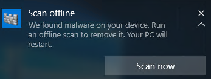

# <a name="run-and-review-the-results-of-a-microsoft-defender-offline-scan"></a><span data-ttu-id="49777-105">Запуск и просмотр результатов проверки в автономном Microsoft Defender</span><span class="sxs-lookup"><span data-stu-id="49777-105">Run and review the results of a Microsoft Defender Offline scan</span></span>

[!INCLUDE [Microsoft 365 Defender rebranding](../../includes/microsoft-defender.md)]


<span data-ttu-id="49777-106">**Область применения:**</span><span class="sxs-lookup"><span data-stu-id="49777-106">**Applies to:**</span></span>

- [<span data-ttu-id="49777-107">Microsoft Defender для конечной точки</span><span class="sxs-lookup"><span data-stu-id="49777-107">Microsoft Defender for Endpoint</span></span>](/microsoft-365/security/defender-endpoint/)

<span data-ttu-id="49777-108">автономный Microsoft Defender это средство сканирования антивирусных программ, которое позволяет загрузить и запустить сканирование из надежной среды.</span><span class="sxs-lookup"><span data-stu-id="49777-108">Microsoft Defender Offline is an antimalware scanning tool that lets you boot and run a scan from a trusted environment.</span></span> <span data-ttu-id="49777-109">Сканирование выполняется за пределами обычного Windows, поэтому оно может быть нацелено на вредоносные программы, которые пытаются обойти оболочку Windows, например вирусы и корневые наборы, которые заражают или переоценивают запись основной загрузки (MBR).</span><span class="sxs-lookup"><span data-stu-id="49777-109">The scan runs from outside the normal Windows kernel so it can target malware that attempts to bypass the Windows shell, such as viruses and rootkits that infect or overwrite the master boot record (MBR).</span></span>

<span data-ttu-id="49777-110">Вы можете использовать автономный Microsoft Defender, если вы подозреваете заражение вредоносными программами или хотите подтвердить тщательную очистку конечной точки после вспышки вредоносных программ.</span><span class="sxs-lookup"><span data-stu-id="49777-110">You can use Microsoft Defender Offline if you suspect a malware infection, or you want to confirm a thorough clean of the endpoint after a malware outbreak.</span></span>

<span data-ttu-id="49777-111">В Windows 10 автономный Microsoft Defender можно выполнить одним щелчком мыши непосредственно из [Безопасность Windows приложения](microsoft-defender-security-center-antivirus.md).</span><span class="sxs-lookup"><span data-stu-id="49777-111">In Windows 10, Microsoft Defender Offline can be run with one click directly from the [Windows Security app](microsoft-defender-security-center-antivirus.md).</span></span> <span data-ttu-id="49777-112">В предыдущих версиях Windows пользователю приходилось устанавливать автономный Microsoft Defender для загрузки мультимедиа, перезапускать конечную точку и загружать загружаемые носитли.</span><span class="sxs-lookup"><span data-stu-id="49777-112">In previous versions of Windows, a user had to install Microsoft Defender Offline to bootable media, restart the endpoint, and load the bootable media.</span></span>

## <a name="prerequisites-and-requirements"></a><span data-ttu-id="49777-113">необходимые условия и требования</span><span class="sxs-lookup"><span data-stu-id="49777-113">prerequisites and requirements</span></span>

<span data-ttu-id="49777-114">автономный Microsoft Defender в Windows 10 имеет те же требования к оборудованию, что и Windows 10.</span><span class="sxs-lookup"><span data-stu-id="49777-114">Microsoft Defender Offline in Windows 10 has the same hardware requirements as Windows 10.</span></span> 

<span data-ttu-id="49777-115">Дополнительные сведения о требованиях Windows 10 см. в следующих темах:</span><span class="sxs-lookup"><span data-stu-id="49777-115">For more information about Windows 10 requirements, see the following topics:</span></span>

- [<span data-ttu-id="49777-116">Минимальные требования к оборудованию</span><span class="sxs-lookup"><span data-stu-id="49777-116">Minimum hardware requirements</span></span>](/windows-hardware/design/minimum/minimum-hardware-requirements-overview)

- [<span data-ttu-id="49777-117">Инструкции по компонентам оборудования</span><span class="sxs-lookup"><span data-stu-id="49777-117">Hardware component guidelines</span></span>](/windows-hardware/design/component-guidelines/components)

> [!NOTE]
> <span data-ttu-id="49777-118">автономный Microsoft Defender не поддерживается на машинах с ARM процессорами или Windows единицах сохраняемого сервера.</span><span class="sxs-lookup"><span data-stu-id="49777-118">Microsoft Defender Offline is not supported on machines with ARM processors, or on Windows Server Stock Keeping Units.</span></span>

<span data-ttu-id="49777-119">Чтобы выполнить автономный Microsoft Defender с конечной точки, пользователь должен войти в систему с привилегиями администратора.</span><span class="sxs-lookup"><span data-stu-id="49777-119">To run Microsoft Defender Offline from the endpoint, the user must be logged in with administrator privileges.</span></span>
 
## <a name="microsoft-defender-offline-updates"></a><span data-ttu-id="49777-120">автономный Microsoft Defender обновления</span><span class="sxs-lookup"><span data-stu-id="49777-120">Microsoft Defender Offline updates</span></span>

<span data-ttu-id="49777-121">автономный Microsoft Defender использует последние обновления защиты, доступные в конечной точке; он обновляется при антивирусная программа обновления.</span><span class="sxs-lookup"><span data-stu-id="49777-121">Microsoft Defender Offline uses the most recent protection updates available on the endpoint; it's updated whenever Windows Defender Antivirus is updated.</span></span> 

> [!NOTE]
> <span data-ttu-id="49777-122">Перед запуском автономного сканирования необходимо попытаться обновить защиту авт.майкрософт защитника.</span><span class="sxs-lookup"><span data-stu-id="49777-122">Before running an offline scan, you should attempt to update Microsoft Defender AV protection.</span></span> <span data-ttu-id="49777-123">Вы можете либо принудить обновление с помощью групповой политики, либо обычно развертывать обновления в конечные точки, либо вручную скачать и установить последние обновления защиты из [Центр Майкрософт по защите от вредоносных программ](https://www.microsoft.com/security/portal/definitions/adl.aspx).</span><span class="sxs-lookup"><span data-stu-id="49777-123">You can either force an update with Group Policy or however you normally deploy updates to endpoints, or you can manually download and install the latest protection updates from the [Microsoft Malware Protection Center](https://www.microsoft.com/security/portal/definitions/adl.aspx).</span></span>

<span data-ttu-id="49777-124">Дополнительные [сведения см. в разделе Антивирусная программа в Microsoft Defender обновления службы](manage-protection-updates-microsoft-defender-antivirus.md) безопасности.</span><span class="sxs-lookup"><span data-stu-id="49777-124">See the [Manage Microsoft Defender Antivirus Security intelligence  updates](manage-protection-updates-microsoft-defender-antivirus.md) topic for more information.</span></span>

## <a name="usage-scenarios"></a><span data-ttu-id="49777-125">Сценарии использования</span><span class="sxs-lookup"><span data-stu-id="49777-125">Usage scenarios</span></span>

<span data-ttu-id="49777-126">В Windows 10 версии 1607 можно вручную принудить к автономному сканированию.</span><span class="sxs-lookup"><span data-stu-id="49777-126">In Windows 10, version 1607, you can manually force an offline scan.</span></span> <span data-ttu-id="49777-127">Кроме того, если Защитник Windows определяет, что автономный Microsoft Defender необходимо выполнить, он будет подсказок пользователю на конечной точке.</span><span class="sxs-lookup"><span data-stu-id="49777-127">Alternatively, if Windows Defender determines that Microsoft Defender Offline needs to run, it will prompt the user on the endpoint.</span></span> 

<span data-ttu-id="49777-128">Необходимость выполнения автономного сканирования также будет обнаружена в Microsoft Endpoint Manager, если вы используете его для управления конечными точками.</span><span class="sxs-lookup"><span data-stu-id="49777-128">The need to perform an offline scan will also be revealed in Microsoft Endpoint Manager if you're using it to manage your endpoints.</span></span>

<span data-ttu-id="49777-129">Запрос может происходить с помощью уведомления, аналогично следующему:</span><span class="sxs-lookup"><span data-stu-id="49777-129">The prompt can occur via a notification, similar to the following:</span></span>



<span data-ttu-id="49777-131">Пользователь также будет уведомлен в клиенте Защитник Windows клиента.</span><span class="sxs-lookup"><span data-stu-id="49777-131">The user will also be notified within the Windows Defender client.</span></span>

<span data-ttu-id="49777-132">В диспетчере конфигурации можно определить состояние конечных точек, перенаправление в Службу мониторинга > обзор > безопасности **> Endpoint Protection состояние > System Center Endpoint Protection состояние**.</span><span class="sxs-lookup"><span data-stu-id="49777-132">In Configuration Manager, you can identify the status of endpoints by navigating to **Monitoring > Overview > Security > Endpoint Protection Status > System Center Endpoint Protection Status**.</span></span> 

<span data-ttu-id="49777-133">автономный Microsoft Defender проверки указаны в состоянии **исправление вредоносных** программ, как **автономное сканирование требуется**.</span><span class="sxs-lookup"><span data-stu-id="49777-133">Microsoft Defender Offline scans are indicated under **Malware remediation status** as **Offline scan required**.</span></span>


## <a name="configure-notifications"></a><span data-ttu-id="49777-135">Настройка уведомлений</span><span class="sxs-lookup"><span data-stu-id="49777-135">Configure notifications</span></span>

<span data-ttu-id="49777-136">автономный Microsoft Defender настраиваются в том же параметре политики, что и другие уведомления Microsoft Defender AV.</span><span class="sxs-lookup"><span data-stu-id="49777-136">Microsoft Defender Offline notifications are configured in the same policy setting as other Microsoft Defender AV notifications.</span></span>

<span data-ttu-id="49777-137">Дополнительные сведения об уведомлениях в Защитник Windows см. в разделе Настройка уведомлений, которые отображаются в разделе [конечные точки.](configure-notifications-microsoft-defender-antivirus.md)</span><span class="sxs-lookup"><span data-stu-id="49777-137">For more information about notifications in Windows Defender, see the [Configure the notifications that appear on endpoints](configure-notifications-microsoft-defender-antivirus.md) topic.</span></span>

## <a name="run-a-scan"></a><span data-ttu-id="49777-138">Запустить сканирование</span><span class="sxs-lookup"><span data-stu-id="49777-138">Run a scan</span></span> 

> [!IMPORTANT]
> <span data-ttu-id="49777-139">Перед использованием автономный Microsoft Defender убедитесь, что вы сохраните все файлы и отключите запущенные программы.</span><span class="sxs-lookup"><span data-stu-id="49777-139">Before you use Microsoft Defender Offline, make sure you save any files and shut down running programs.</span></span> <span data-ttu-id="49777-140">Проверка автономный Microsoft Defender занимает около 15 минут.</span><span class="sxs-lookup"><span data-stu-id="49777-140">The Microsoft Defender Offline scan takes about 15 minutes to run.</span></span> <span data-ttu-id="49777-141">Она перезапустит конечную точку после завершения проверки.</span><span class="sxs-lookup"><span data-stu-id="49777-141">It will restart the endpoint when the scan is complete.</span></span> <span data-ttu-id="49777-142">Сканирование выполняется за пределами обычной Windows среды.</span><span class="sxs-lookup"><span data-stu-id="49777-142">The scan is performed outside of the usual Windows operating environment.</span></span> <span data-ttu-id="49777-143">Пользовательский интерфейс будет выглядеть иначе, чем обычная проверка, выполняемая Защитник Windows.</span><span class="sxs-lookup"><span data-stu-id="49777-143">The user interface will appear different to a normal scan performed by Windows Defender.</span></span> <span data-ttu-id="49777-144">После завершения сканирования конечная точка будет перезапущена и Windows будет загружаться нормально.</span><span class="sxs-lookup"><span data-stu-id="49777-144">After the scan is completed, the endpoint will be restarted and Windows will load normally.</span></span>

<span data-ttu-id="49777-145">Вы можете выполнить автономный Microsoft Defender проверку со следующими следующими примерами:</span><span class="sxs-lookup"><span data-stu-id="49777-145">You can run a Microsoft Defender Offline scan with the following:</span></span>

- <span data-ttu-id="49777-146">PowerShell</span><span class="sxs-lookup"><span data-stu-id="49777-146">PowerShell</span></span>
- <span data-ttu-id="49777-147">Инструментарий управления Windows (WMI)</span><span class="sxs-lookup"><span data-stu-id="49777-147">Windows Management Instrumentation (WMI)</span></span>
- <span data-ttu-id="49777-148">Приложение Безопасность Windows</span><span class="sxs-lookup"><span data-stu-id="49777-148">The Windows Security app</span></span>


### <a name="use-powershell-cmdlets-to-run-an-offline-scan"></a><span data-ttu-id="49777-149">Для запуска автономного сканирования используйте cmdlets PowerShell</span><span class="sxs-lookup"><span data-stu-id="49777-149">Use PowerShell cmdlets to run an offline scan</span></span>

<span data-ttu-id="49777-150">Используйте следующие cmdlets:</span><span class="sxs-lookup"><span data-stu-id="49777-150">Use the following cmdlets:</span></span>

```PowerShell
Start-MpWDOScan
```

<span data-ttu-id="49777-151">Дополнительные сведения об использовании PowerShell с антивирусной программой в Microsoft Defender см. в разделах [Использование командлетов PowerShell для настройки и запуска антивирусной программы в Microsoft Defender](use-powershell-cmdlets-microsoft-defender-antivirus.md) и [Командлеты Defender](/powershell/module/defender/).</span><span class="sxs-lookup"><span data-stu-id="49777-151">See [Use PowerShell cmdlets to configure and run Microsoft Defender Antivirus](use-powershell-cmdlets-microsoft-defender-antivirus.md) and [Defender cmdlets](/powershell/module/defender/) for more information on how to use PowerShell with Microsoft Defender Antivirus.</span></span>

### <a name="use-windows-management-instruction-wmi-to-run-an-offline-scan"></a><span data-ttu-id="49777-152">Использование Windows управления (WMI) для запуска автономного сканирования</span><span class="sxs-lookup"><span data-stu-id="49777-152">Use Windows Management Instruction (WMI) to run an offline scan</span></span>

<span data-ttu-id="49777-153">Используйте класс [**MSFT_MpWDOScan**](/previous-versions/windows/desktop/legacy/dn455323(v=vs.85)) для запуска автономного сканирования.</span><span class="sxs-lookup"><span data-stu-id="49777-153">Use the [**MSFT_MpWDOScan**](/previous-versions/windows/desktop/legacy/dn455323(v=vs.85)) class to run an offline scan.</span></span>

<span data-ttu-id="49777-154">В следующем фрагменте сценария WMI будет немедленно выполнить автономный Microsoft Defender, что приведет к перезапуску конечной точки, запуску автономного сканирования, а затем перезапуску и загрузке в Windows.</span><span class="sxs-lookup"><span data-stu-id="49777-154">The following WMI script snippet will immediately run a Microsoft Defender Offline scan, which will cause the endpoint to restart, run the offline scan, and then restart and boot into Windows.</span></span>

```console
wmic /namespace:\\root\Microsoft\Windows\Defender path MSFT_MpWDOScan call Start 
```

<span data-ttu-id="49777-155">Дополнительные сведения см. в следующих сведениях:</span><span class="sxs-lookup"><span data-stu-id="49777-155">See the following for more information:</span></span>
- [<span data-ttu-id="49777-156">Защитник Windows API WMIv2</span><span class="sxs-lookup"><span data-stu-id="49777-156">Windows Defender WMIv2 APIs</span></span>](/previous-versions/windows/desktop/defender/windows-defender-wmiv2-apis-portal)


### <a name="use-the-windows-defender-security-app-to-run-an-offline-scan"></a><span data-ttu-id="49777-157">Использование приложения Защитник Windows безопасности для запуска автономного сканирования</span><span class="sxs-lookup"><span data-stu-id="49777-157">Use the Windows Defender Security app to run an offline scan</span></span>

1. <span data-ttu-id="49777-158">Откройте приложение Безопасность Windows, щелкнув значок щита в панели задач или нажав меню пусков для **Defender.**</span><span class="sxs-lookup"><span data-stu-id="49777-158">Open the Windows Security app by clicking the shield icon in the task bar or searching the start menu for **Defender**.</span></span>

2. <span data-ttu-id="49777-159">Щелкните **плитку защиты &** вирусов (или значок щита в левой панели меню), а затем метку **Advanced scan:**</span><span class="sxs-lookup"><span data-stu-id="49777-159">Click the **Virus & threat protection** tile (or the shield icon on the left menu bar) and then the **Advanced scan** label:</span></span>
    
3. <span data-ttu-id="49777-160">Выберите **автономный Microsoft Defender и** нажмите **кнопку Сканирование сейчас**.</span><span class="sxs-lookup"><span data-stu-id="49777-160">Select **Microsoft Defender Offline scan** and click **Scan now**.</span></span>

    > [!NOTE]
    > <span data-ttu-id="49777-161">В Windows 10 версии 1607 автономное сканирование можно выполнить из Windows Параметры Update & безопасности Защитник Windows или Защитник Windows  >    >   клиента.</span><span class="sxs-lookup"><span data-stu-id="49777-161">In Windows 10, version 1607, the offline scan could be run from under **Windows Settings** > **Update & security** > **Windows Defender** or from the Windows Defender client.</span></span>


## <a name="review-scan-results"></a><span data-ttu-id="49777-162">Просмотр результатов сканирования</span><span class="sxs-lookup"><span data-stu-id="49777-162">Review scan results</span></span>

<span data-ttu-id="49777-163">автономный Microsoft Defender результаты сканирования будут перечислены в разделе История сканирования [приложения Безопасность Windows.](microsoft-defender-security-center-antivirus.md)</span><span class="sxs-lookup"><span data-stu-id="49777-163">Microsoft Defender Offline scan results will be listed in the [Scan history section of the Windows Security app](microsoft-defender-security-center-antivirus.md).</span></span> 


## <a name="related-articles"></a><span data-ttu-id="49777-164">Статьи по теме</span><span class="sxs-lookup"><span data-stu-id="49777-164">Related articles</span></span>

- [<span data-ttu-id="49777-165">Настройка, инициирование и проверка результатов проверки и устранения</span><span class="sxs-lookup"><span data-stu-id="49777-165">Customize, initiate, and review the results of scans and remediation</span></span>](customize-run-review-remediate-scans-microsoft-defender-antivirus.md)
- [<span data-ttu-id="49777-166">антивирусная программа в Microsoft Defender в Windows 10</span><span class="sxs-lookup"><span data-stu-id="49777-166">Microsoft Defender Antivirus in Windows 10</span></span>](microsoft-defender-antivirus-in-windows-10.md)