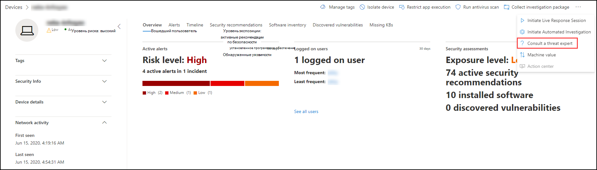
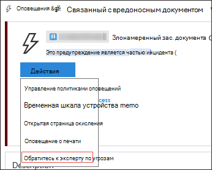
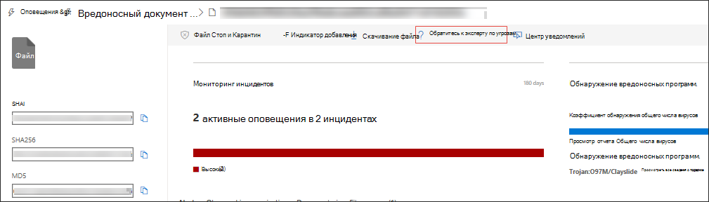

# Эксперты Майкрософт по угрозамMicrosoft Threat Experts

[!INCLUDE [Microsoft 365 Defender rebranding](../../includes/microsoft-defender.md)]

**Область применения:****Applies to:**
- [Microsoft Defender для конечной точкиMicrosoft Defender for Endpoint](https://go.microsoft.com/fwlink/p/?linkid=2154037)
- [Microsoft 365 DefenderMicrosoft 365 Defender](https://go.microsoft.com/fwlink/?linkid=2118804)

> Хотите испытать Microsoft Defender для конечной точки?Want to experience Microsoft Defender for Endpoint? [Зарегистрився для бесплатной пробной.Sign up for a free trial.](https://www.microsoft.com/microsoft-365/windows/microsoft-defender-atp?ocid=docs-wdatp-exposedapis-abovefoldlink)

эксперты Майкрософт по угрозам это служба управляемой охоты на угрозы, которая предоставляет вашим центрам операций безопасности (SOCs) мониторинг и анализ на уровне экспертов, чтобы обеспечить, чтобы критические угрозы в уникальных средах не пропускались.Microsoft Threat Experts is a managed threat hunting service that provides your Security Operation Centers (SOCs) with expert level monitoring and analysis to help them ensure that critical threats in your unique environments don’t get missed.
  
Эта служба управляемой охоты на угрозы предоставляет экспертные сведения и данные с помощью этих двух возможностей: целевого уведомления об атаке и доступа к экспертам по запросу.This managed threat hunting service provides expert-driven insights and data through these two capabilities: targeted attack notification and access to experts on demand.

## Прежде чем начатьBefore you begin 
> [!NOTE]
> Обсудите требования к требованиям с поставщиком технической службы Майкрософт и командой учетных записей перед тем, как примениться к службе управляемой охоты на угрозы.Discuss the eligibility requirements with your Microsoft Technical Service provider and account team before you apply to the managed threat hunting service.

Если вы клиент Microsoft Defender для конечных точек, вам необходимо подать заявку на **эксперты Майкрософт по угрозам -** Целевые уведомления об атаке, чтобы получить специальные сведения и анализ, которые помогут определить наиболее важные угрозы в вашей среде, чтобы вы могли быстро реагировать на них.If you're a Microsoft Defender for Endpoint customer, you need to apply for **Microsoft Threat Experts - Targeted Attack Notifications** to get special insights and analysis that help identify the most critical threats in your environment so you can respond to them quickly.

Чтобы зарегистрироваться в эксперты Майкрософт по угрозам - преимущества целевых уведомлений об атаках, перейдите в Параметры Конечные точки Общие расширенные функции эксперты Майкрософт по угрозам - Целевые уведомления об атаках, чтобы  >    >    >    >   применить.To enroll to Microsoft Threat Experts - Targeted Attack Notifications benefits, go to **Settings** > **Endpoints** > **General** > **Advanced features** > **Microsoft Threat Experts - Targeted Attack Notifications** to apply. После его принятие вы получите преимущества уведомлений о целевых атаках.Once accepted, you will get the benefits of Targeted Attack Notifications.

Свяжитесь с командой учетных записей или представителем **Майкрософт,** чтобы подписаться на эксперты Майкрософт по угрозам - эксперты по запросу, чтобы проконсультироваться с нашими экспертами по угрозам по соответствующим обнаружениям и противникам, с которыми сталкивается ваша организация.Contact your account team or Microsoft representative to subscribe to **Microsoft Threat Experts - Experts on Demand** to consult with our threat experts on relevant detections and adversaries that your organization is facing.

Сведения [см. в эксперты Майкрософт по угрозам возможности.](/microsoft-365/security/defender-endpoint/configure-microsoft-threat-experts#before-you-begin)See [Configure Microsoft Threat Experts capabilities](/microsoft-365/security/defender-endpoint/configure-microsoft-threat-experts#before-you-begin) for details. 

## эксперты Майкрософт по угрозам — уведомление о целевой атакеMicrosoft Threat Experts - Targeted attack notification 
эксперты Майкрософт по угрозам . Целевое уведомление о нападении обеспечивает активную охоту на наиболее важные угрозы для вашей сети, включая вторжение противника, атаки на клавиатуре или расширенные атаки, такие как кибершпионаж.Microsoft Threat Experts - Targeted attack notification provides proactive hunting for the most important threats to your network, including human adversary intrusions, hands-on-keyboard attacks, or advanced attacks like cyber-espionage. Эти уведомления показываются как новое оповещение.These notifications shows up as a new alert. Служба управляемой охоты включает в себя:The managed hunting service includes:  
- Мониторинг и анализ угроз, сокращение времени и риска для бизнесаThreat monitoring and analysis, reducing dwell time and risk to the business 
- Искусственный интеллект, обученный охотником, для обнаружения и расстановки приоритетов как известных, так и неизвестных атакHunter-trained artificial intelligence to discover and prioritize both known and unknown attacks  
- Определение наиболее важных рисков, помогая soCs увеличить время и энергиюIdentifying the most important risks, helping SOCs maximize time and energy 
- Область компрометации и максимальное количество контекста, которые можно быстро доставить для быстрого реагирования SOC.Scope of compromise and as much context as can be quickly delivered to enable fast SOC response. 
 
## эксперты Майкрософт по угрозам - Эксперты по запросуMicrosoft Threat Experts - Experts on Demand
Клиенты могут привлекать наших экспертов по безопасности непосредственно из Центр безопасности в Microsoft Defender для быстрого и точного ответа.Customers can engage our security experts directly from within Microsoft Defender Security Center for timely and accurate response. Эксперты предоставляют сведения, необходимые для лучшего понимания сложных угроз, затрагивающих организацию, от запросов оповещений, потенциально скомпрометных устройств, первопричины подозрительного сетевого подключения до дополнительных сведений об угрозах в отношении текущих расширенных кампаний сохраняющихся угроз.Experts provide insights needed to better understand the complex threats affecting your organization, from alert inquiries, potentially compromised devices, root cause of a suspicious network connection, to additional threat intelligence regarding ongoing advanced persistent threat campaigns. С помощью этой возможности можно:With this capability, you can:
- Дополнительные разъяснения по оповещениям, включая корневую причину или область инцидентаGet additional clarification on alerts including root cause or scope of the incident 
- Получение ясности в подозрительном поведении устройства и последующих действиях, если вы столкнулись с расширенным злоумышленникомGain clarity into suspicious device behavior and next steps if faced with an advanced attacker  
- Определение рисков и защиты в отношении субъектов угроз, кампаний или формирующихся методов злоумышленниковDetermine risk and protection regarding threat actors, campaigns, or emerging attacker techniques 

Возможность **проконсультироваться с экспертом** по угрозам доступна в нескольких местах на портале, чтобы вы могли взаимодействовать со специалистами в контексте вашего расследования:The option to **Consult a threat expert** is available in several places in the portal so you can engage with experts in the context of your investigation:

- <i>**Меню справки и поддержки**</i><i>**Help and support menu**</i> 

- <i>**Меню действий страницы устройства**</i><i>**Device page actions menu**</i> 

- <i>**Оповещает меню действий страницы**</i><i>**Alerts page actions menu**</i> 

- <i>**Меню действий страницы файлов**</i><i>**File page actions menu**</i> 

> [!NOTE]
> Если вы хотите отслеживать состояние дел "Эксперты по запросу" с помощью Центра служб Майкрософт, перенаправление в диспетчер технической учетной записи.If you would like to track the status of your Experts on Demand cases through Microsoft Services Hub, reach out to your Technical Account Manager. 

Просмотрите это видео для краткого обзора центра служб Майкрософт.Watch this video for a quick overview of the Microsoft Services Hub.

>[!VIDEO https://www.microsoft.com/videoplayer/embed/RE4pk9f] 

   
## Связанная темаRelated topic
- [Настройка эксперты Майкрософт по угрозам возможностейConfigure Microsoft Threat Experts capabilities](configure-microsoft-threat-experts.md)
