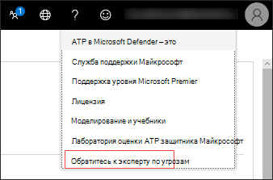

# Microsoft Threat Experts

[!INCLUDE [Microsoft 365 Defender rebranding](../../includes/microsoft-defender.md)]

**Область применения:**
- [Microsoft Defender для конечной точки](https://go.microsoft.com/fwlink/p/?linkid=2154037)
- [Microsoft 365 Defender](https://go.microsoft.com/fwlink/?linkid=2118804)

> Хотите испытать Microsoft Defender для конечной точки? [Зарегистрився для бесплатной пробной.](https://www.microsoft.com/microsoft-365/windows/microsoft-defender-atp?ocid=docs-wdatp-exposedapis-abovefoldlink)

Microsoft Threat Experts — это служба управляемой охоты на угрозы, которая предоставляет вашим центрам операций безопасности (SOCs) мониторинг и анализ на уровне экспертов, чтобы обеспечить, чтобы критические угрозы в уникальных средах не пропускались.
  
Эта служба управляемой охоты на угрозы предоставляет экспертные сведения и данные с помощью этих двух возможностей: целевого уведомления об атаке и доступа к экспертам по запросу.

## Прежде чем начать 
> [!NOTE]
> Обсудите требования к требованиям с поставщиком технической службы Майкрософт и командой учетных записей перед тем, как примениться к службе управляемой охоты на угрозы.

Если вы клиент Microsoft Defender для конечных точек, вам необходимо обратиться к **экспертам microsoft Threat Experts - Targeted Attack Notifications,** чтобы получить специальные сведения и анализ, которые помогут определить наиболее важные угрозы в вашей среде, чтобы вы могли быстро реагировать на них.

Чтобы зарегистрироваться в Microsoft Threat Experts - targeted Attack Notifications benefits, перейдите в параметры Общие расширенные функции   >    >    >  **Microsoft Threat Experts - Targeted Attack Notifications** to apply. После его принятие вы получите преимущества уведомлений о целевых атаках.

Свяжитесь с командой учетных записей или представителем Майкрософт, чтобы подписаться на **экспертов Microsoft Threat Experts - Experts on Demand,** чтобы проконсультироваться с нашими экспертами по угрозам по соответствующим обнаружениям и противникам, с которыми сталкивается ваша организация.

Подробнее [см. в материале "Настройка](https://docs.microsoft.com/microsoft-365/security/defender-endpoint/configure-microsoft-threat-experts#before-you-begin) возможностей экспертов по угрозам Майкрософт". 

## Эксперты по угрозам Microsoft — целевое уведомление об атаке 
Эксперты по угрозам Microsoft . Целевое уведомление об атаке обеспечивает активную охоту на наиболее важные угрозы для вашей сети, включая вторжение противника, атаки на клавиатуре или расширенные атаки, такие как кибершпионаж. Эти уведомления показываются как новое оповещение. Служба управляемой охоты включает в себя:  
- Мониторинг и анализ угроз, сокращение времени и риска для бизнеса 
- Искусственный интеллект, обученный охотником, для обнаружения и расстановки приоритетов как известных, так и неизвестных атак  
- Определение наиболее важных рисков, помогая soCs увеличить время и энергию 
- Область компрометации и максимальное количество контекста, которые можно быстро доставить для быстрого реагирования SOC. 
 
## Эксперты по угрозам Майкрософт — эксперты по запросу
Клиенты могут привлекать наших экспертов по безопасности непосредственно из Центра безопасности Защитника Майкрософт для быстрого и точного ответа. Эксперты предоставляют сведения, необходимые для лучшего понимания сложных угроз, затрагивающих организацию, от запросов оповещений, потенциально скомпрометных устройств, первопричины подозрительного сетевого подключения до дополнительных сведений об угрозах в отношении текущих расширенных кампаний сохраняющихся угроз. С помощью этой возможности можно:
- Дополнительные разъяснения по оповещениям, включая корневую причину или область инцидента 
- Получение ясности в подозрительном поведении устройства и последующих действиях, если вы столкнулись с расширенным злоумышленником  
- Определение рисков и защиты в отношении субъектов угроз, кампаний или формирующихся методов злоумышленников 

Возможность **проконсультироваться с экспертом** по угрозам доступна в нескольких местах на портале, чтобы вы могли взаимодействовать со специалистами в контексте вашего расследования:

- <i>**Меню справки и поддержки**</i> 

- <i>**Меню действий страницы устройства**</i> 

- <i>**Оповещает меню действий страницы**</i> 

- <i>**Меню действий страницы файлов**</i> 

> [!NOTE]
> Если вы хотите отслеживать состояние дел "Эксперты по запросу" с помощью Центра служб Майкрософт, перенаправление в диспетчер технической учетной записи. 

Просмотрите это видео для краткого обзора центра служб Майкрософт.

>[!VIDEO https://www.microsoft.com/videoplayer/embed/RE4pk9f] 

   
## Связанная тема
- [Настройка возможностей экспертов по угрозам Майкрософт](configure-microsoft-threat-experts.md)
