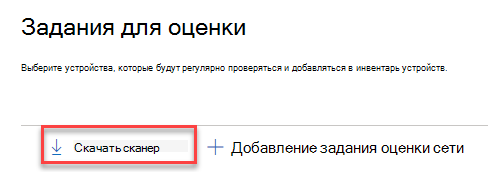
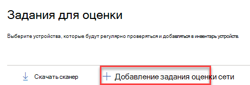

# Обнаружение и управление уязвимостями

[!INCLUDE [Microsoft 365 Defender rebranding](../../includes/microsoft-defender.md)]

**Область применения:**

- [Microsoft Defender для конечной точки](https://go.microsoft.com/fwlink/?linkid=2154037)
- [Угроза и управление уязвимостями](next-gen-threat-and-vuln-mgt.md)
- [Microsoft 365 Defender](https://go.microsoft.com/fwlink/?linkid=2118804)

> [!IMPORTANT]
> **Сканирование и управление сетевыми устройствами в настоящее время находятся в общедоступных предварительных просмотрах** 
> Эта версия предварительного просмотра предоставляется без соглашения об уровне обслуживания и не рекомендуется для рабочих нагрузок. Некоторые функции могут не поддерживаться или иметь ограниченные возможности.
> Дополнительные сведения см. в [веб-сайте Microsoft Defender для функций предварительного просмотра конечных точек.](preview.md)

>Хотите испытать Microsoft Defender для конечной точки? [Зарегистрився для бесплатной пробной.](https://www.microsoft.com/microsoft-365/windows/microsoft-defender-atp?ocid=docs-wdatp-portaloverview-abovefoldlink)

> [!NOTE]  
> Блог [по](https://techcommunity.microsoft.com/t5/microsoft-defender-for-endpoint/network-device-discovery-and-vulnerability-assessments/ba-p/2267548) обнаружению и оценке уязвимостей сетевых устройств, опубликованный \( 04-13-2021, содержит сведения о возможностях обнаружения новых сетевых устройств в \) Defender for Endpoint.  В этой статье представлен обзор  проблем, с которыми предназначено решение обнаружения сетевых устройств, и подробные сведения о том, как начать работу с этими новыми возможностями.

Возможности обнаружения сети доступны в разделе **Инвентаризация** устройств центра Microsoft 365 и Центр безопасности в Microsoft Defender консолей.  

Назначенное устройство Microsoft Defender для конечных точек будет использоваться в каждом сетевом сегменте для выполнения периодического проверки подлинности предварительно заранее заверяемых сетевых устройств. После обнаружения возможности defender for Endpoint контроль угроз и уязвимостей интегрированные рабочий процессы для защиты обнаруженных переключателей, маршрутизаторов, контроллеров WLAN, брандмауэров и шлюзов VPN.  

После обнаружения и классификации сетевых устройств администраторы безопасности смогут получать последние рекомендации по безопасности и рассматривать обнаруженные недавно уязвимости на сетевых устройствах, развернутых в их организациях.

## Способ

Сетевые устройства не управляются в качестве стандартных конечных точек, так как в Defender for Endpoint нет датчика, встроенного в сами сетевые устройства. Для таких устройств требуется безагентный подход, при котором удаленное сканирование будет получать необходимую информацию с устройств. В зависимости от топологии и характеристик сети одно устройство или несколько устройств, на борту которых находится Microsoft Defender для конечной точки, будут выполнять проверки подлинности сетевых устройств с помощью SNMP (только для чтения).

Необходимо помнить о двух типах устройств:

- **Устройство оценки.** Устройство, которое уже на борту, которое будет использовать для сканирования сетевых устройств.
- **Сетевые устройства.** Сетевые устройства, которые планируется сканировать и на борту.

### Управление уязвимостью для сетевых устройств 

После обнаружения и классификации сетевых устройств администраторы безопасности смогут получать последние рекомендации по безопасности и рассматривать обнаруженные недавно уязвимости на сетевых устройствах, развернутых в их организациях.  

## Поддерживаемые операционные системы

В настоящее время поддерживаются следующие операционные системы:

- Cisco IOS, IOS-XE, NX-OS
- JuNOS можжевельника
- HPE ArubaOS, программное обеспечение для коммутаторов
- Palo Alto Networks PAN-OS

Со временем будут добавлены дополнительные поставщики сетевых сетей и ОС на основе данных, собранных из использования клиентов. Поэтому рекомендуется настроить все сетевые устройства, даже если они не указаны в этом списке.

## Начало работы

Первым шагом является выбор устройства, которое будет выполнять проверку подлинности сети.

1. Определите бортовой устройство Defender для конечной точки (клиент или сервер), которое имеет сетевое подключение к порту управления для сетевых устройств, которые планируется сканировать. 

2. Трафик SNMP между устройством оценки Defender для конечных точек и целевыми сетевыми устройствами должен быть разрешен (например, брандмауэром).

3. Определите, какие сетевые устройства будут оцениваться на наличие уязвимостей (например, переключатель Cisco или брандмауэр Palo Alto Networks).  

4. Убедитесь, что только для чтения SNMP включен на всех настроенных сетевых устройствах, чтобы устройство оценки Defender для конечных точек запрашивал настроенные сетевые устройства. 'SNMP write' не требуется для надлежащей функциональности этой функции.

5. Получение IP-адресов сканированных сетевых устройств (или подсетей, в которых развернуты эти устройства).

6. Получение учетных данных SNMP сетевых устройств (например: Community String, noAuthNoPriv, authNoPriv, authPriv). При настройке нового задания оценки необходимо предоставить учетные данные.  

7. Конфигурация прокси-клиента. Не требуется дополнительная конфигурация, кроме требований прокси-сервера Defender для прокси-серверов конечных точек.

8. Чтобы разрешить проверку подлинности сетевого сканера и правильно работать, необходимо добавить следующие домены и URL-адреса:

    - login.windows.net  
    - *.securitycenter.windows.com
    - login.microsoftonline.com
    - *.blob.core.windows.net/networkscannerstable/ *

    > [!NOTE]
    > Не все URL-адреса указаны в документированном списке разрешенного сбора данных Defender для конечной точки.

## Разрешения

Для настройки заданий оценки требуется следующий параметр разрешения пользователя: **Управление настройками безопасности в Центре безопасности.** Вы можете найти разрешение, Параметры  >  **роли**. Дополнительные сведения см. в дополнительных сведениях о создании и [управлении ролями для](user-roles.md)управления доступом на основе ролей.

## Установка сетевого сканера

1. Перейдите **Microsoft 365 задания** Параметры оценки конечных точек  >    >    >   (в соответствии **с сетевыми оценками).**
    1. В Центр безопасности в Microsoft Defender перейдите на Параметры > задания оценки.

2. Скачайте сетевой сканер и установите его на назначенное устройство оценки Defender для конечной точки.

    > [!div class="mx-imgBorder"]
    > 

## Установка сетевого сканера & регистрации

Процесс регистрации может быть завершен на назначенном устройстве оценки или любом другом устройстве (например, вашем личном клиенте).

Чтобы завершить процесс регистрации сетевого сканера:

1. Скопируйте и выполните URL-адрес, который отображается в командной строке, и используйте предоставленный код установки для завершения процесса регистрации.

    > [!NOTE]
    > Возможно, потребуется изменить параметры командной подсказки, чтобы можно было скопировать URL-адрес.

2. Введите код и войдите в учетную запись Майкрософт с разрешением Defender for Endpoint под названием "Управление настройками безопасности в Центре безопасности".

3. По завершению следует увидеть сообщение, подтверждаее, что вы вписались.

## Настройка новой задания оценки  

На странице Задания оценки в **Параметры** выберите **задание Добавить работу по оценке сети.** Выполните процедуру настройка, чтобы выбрать сетевые устройства, которые будут регулярно сканироваться и добавляться в инвентарь устройств.

Чтобы предотвратить дублирование устройств в инвентаризации сетевых устройств, убедитесь, что каждый IP-адрес настраивается только один раз на нескольких устройствах оценки.

> [!div class="mx-imgBorder"]
> 

Добавление действий по оценке сети:

1. Выберите имя "Задание оценки" и "Устройство оценки", на котором установлен сетевой сканер. Это устройство выполняет периодические проверки подлинности.

2. Добавьте IP-адреса целевых сетевых устройств для сканирования (или подсети, в которых развернуты эти устройства). 

3. Добавление необходимых учетных данных SNMP целевых сетевых устройств. 

4. Сохраните вновь настроенную работу по оценке сети, чтобы начать периодическое сканирование сети. 

### Сканирование и добавление сетевых устройств

Во время процесса создания можно выполнить одно время проверки, чтобы убедиться, что:

- Существует подключение между устройством оценки Defender для конечной точки и настроенными целевыми сетевыми устройствами.
- Настроенные учетные данные SNMP являются правильными.

Каждое устройство оценки может поддерживать до 1500 успешных ip-адресов. Например, если вы сканируете 10 различных подсетей, в которых только 100 IP-адресов возвращают успешные результаты, вы сможете сканировать 1400 IP-адресов из других подсетей на том же устройстве оценки.  

Если для сканирования необходимо просмотреть несколько диапазонов IP-адресов и подсетей, результаты проверки будут показываться в течение нескольких минут. Тестовая проверка будет доступна для 1024 адресов.

Как только результаты покажут, можно выбрать, какие устройства будут включены в периодическое сканирование. Если пропустить просмотр результатов сканирования, все настроенные IP-адреса будут добавлены в задание по оценке сети (независимо от ответа устройства). Результаты сканирования также можно экспортировать.

## Инвентаризация устройств

Новые обнаруженные устройства будут показаны на вкладке **новые сетевые** устройства на странице **инвентаризации** устройств. После добавления задания оценки до обновления устройств может потребоваться до двух часов.

> [!div class="mx-imgBorder"]
> 

## Устранение неполадок

### Сбой установки сетевого сканера

Убедитесь, что необходимые URL-адреса добавляются в разрешенные домены в настройках брандмауэра. Кроме того, убедитесь, что параметры прокси настроены так, как описано в Настройка прокси-сервера устройства и параметров подключения [к Интернету.](configure-proxy-internet.md)

### Веб Microsoft.com/devicelogin страница не была

Убедитесь, что в разрешенные домены брандмауэра добавлены необходимые URL-адреса. Кроме того, убедитесь, что параметры прокси настроены так, как описано в Настройка прокси-сервера устройства и параметров подключения [к Интернету.](configure-proxy-internet.md)

### Сетевые устройства не показаны в инвентаризации устройств через несколько часов

Результаты сканирования должны обновляться через несколько часов после первоначального сканирования, проведенного после завершения конфигурации задания оценки.

Если устройства еще не показаны, убедитесь, что служба MdatpNetworkScanService запущена на устройствах оценки, на которых установлен сетевой сканер, и выполните "Сканирование выполнения" в соответствующей конфигурации задания оценки.  

Если вы все еще не получите результат через 5 минут, перезапустите службу.  

### Время последнего увиденного устройства превышает 24 часа

Проверьте правильность работы сканера. Затем перейдите к определению сканирования и выберите "Выполнить тест". Проверьте, какие сообщения об ошибках возвращаются с соответствующих IP-адресов.

### Обязательное контроль угроз и уязвимостей разрешения пользователя

Регистрация завершилась ошибкой: "Похоже, у вас нет достаточных разрешений для добавления нового агента. Необходимое разрешение — "Управление настройками безопасности в Центре безопасности".

Нажмите любой ключ, чтобы выйти.

Попросите системного администратора назначить вам необходимые разрешения. Поочередно попросите другого соответствующего участника помочь вам в процессе регистрации, предоставив им код и ссылку для регистрации.

### Процесс регистрации не удается с помощью предоставленной ссылки в командной строке в процессе регистрации

Попробуйте другой браузер или скопируйте входную ссылку и код на другое устройство.

### Текст слишком маленький или не может копировать текст из командной строки

Измените параметры командной строки на устройстве, чтобы разрешить копирование и изменение размера текста.

## Связанные статьи

- [Инвентаризация устройств](machines-view-overview.md)
- [Настройка дополнительных функций](advanced-features.md)
