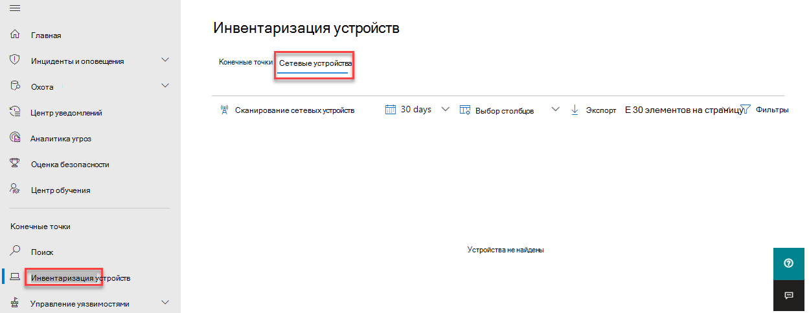

# Обнаружение и управление уязвимостямиNetwork device discovery and vulnerability management

[!INCLUDE [Microsoft 365 Defender rebranding](../../includes/microsoft-defender.md)]

**Область применения:****Applies to:**

- [Microsoft Defender для конечной точкиMicrosoft Defender for Endpoint](https://go.microsoft.com/fwlink/?linkid=2154037)
- [Угроза и управление уязвимостямиThreat and vulnerability management](next-gen-threat-and-vuln-mgt.md)
- [Microsoft 365 DefenderMicrosoft 365 Defender](https://go.microsoft.com/fwlink/?linkid=2118804)

> [!IMPORTANT]
> **Сканирование и управление сетевыми устройствами в настоящее время находятся в общедоступных предварительных просмотрах****Scanning and managing network devices is currently in public preview** 
> Эта версия предварительного просмотра предоставляется без соглашения об уровне обслуживания и не рекомендуется для рабочих нагрузок.This preview version is provided without a service level agreement, and it's not recommended for production workloads. Некоторые функции могут не поддерживаться или иметь ограниченные возможности.Certain features might not be supported or might have constrained capabilities.
> Дополнительные сведения см. в [веб-сайте Microsoft Defender для функций предварительного просмотра конечных точек.](preview.md)For more information, see [Microsoft Defender for Endpoint preview features](preview.md).

>Хотите испытать Microsoft Defender для конечной точки?Want to experience Microsoft Defender for Endpoint? [Зарегистрився для бесплатной пробной.Sign up for a free trial.](https://www.microsoft.com/microsoft-365/windows/microsoft-defender-atp?ocid=docs-wdatp-portaloverview-abovefoldlink)

> [!NOTE]  
> Блог [по](https://techcommunity.microsoft.com/t5/microsoft-defender-for-endpoint/network-device-discovery-and-vulnerability-assessments/ba-p/2267548) обнаружению и оценке уязвимостей сетевых устройств, опубликованный \( 04-13-2021, содержит сведения о возможностях обнаружения новых сетевых устройств в \) Defender for Endpoint. The [Network device discovery and vulnerability assessments](https://techcommunity.microsoft.com/t5/microsoft-defender-for-endpoint/network-device-discovery-and-vulnerability-assessments/ba-p/2267548) Blog \(published 04-13-2021\) provides insights into the new **Network device discovery** capabilities in Defender for Endpoint. В этой статье представлен обзор  проблем, с которыми предназначено решение обнаружения сетевых устройств, и подробные сведения о том, как начать работу с этими новыми возможностями.This article provides an overview of the challenge that **Network device discovery** is designed to address, and detailed information about how get started using these new capabilities.

Возможности обнаружения сети доступны в разделе **Инвентаризация** устройств центра Microsoft 365 и Центр безопасности в Microsoft Defender консолей.Network discovery capabilities are available in the **Device inventory** section of the Microsoft 365 security center and Microsoft Defender Security Center consoles.  

Назначенное устройство Microsoft Defender для конечных точек будет использоваться в каждом сетевом сегменте для выполнения периодического проверки подлинности предварительно заранее заверяемых сетевых устройств.A designated Microsoft Defender for Endpoint device will be used on each network segment to perform periodic authenticated scans of preconfigured network devices. После обнаружения возможности defender for Endpoint контроль угроз и уязвимостей интегрированные рабочий процессы для защиты обнаруженных переключателей, маршрутизаторов, контроллеров WLAN, брандмауэров и шлюзов VPN.Once discovered, Defender for Endpoint’s threat and vulnerability management capabilities provide integrated workflows to secure discovered switches, routers, WLAN controllers, firewalls, and VPN gateways.  

После обнаружения и классификации сетевых устройств администраторы безопасности смогут получать последние рекомендации по безопасности и рассматривать обнаруженные недавно уязвимости на сетевых устройствах, развернутых в их организациях.Once the network devices are discovered and classified, security administrators will be able to receive the latest security recommendations and review recently discovered vulnerabilities on network devices deployed across their organizations.

## СпособApproach

Сетевые устройства не управляются в качестве стандартных конечных точек, так как в Defender for Endpoint нет датчика, встроенного в сами сетевые устройства.Network devices are not managed as standard endpoints since Defender for Endpoint doesn’t have a sensor built into the network devices themselves. Для таких устройств требуется безагентный подход, при котором удаленное сканирование будет получать необходимую информацию с устройств.These types of devices require an agentless approach where a remote scan will obtain the necessary information from the devices. В зависимости от топологии и характеристик сети одно устройство или несколько устройств, на борту которых находится Microsoft Defender для конечной точки, будут выполнять проверки подлинности сетевых устройств с помощью SNMP (только для чтения).Depending on the network topology and characteristics, a single device or a few devices onboarded to Microsoft Defender for Endpoint will perform authenticated scans of network devices using SNMP (read-only).

Необходимо помнить о двух типах устройств:There will be two types of devices to keep in mind:

- **Устройство оценки.** Устройство, которое уже на борту, которое будет использовать для сканирования сетевых устройств.**Assessment device**: A device that's already onboarded that you'll use to scan the network devices.
- **Сетевые устройства.** Сетевые устройства, которые планируется сканировать и на борту.**Network devices**: The network devices you plan to scan and onboard.

### Управление уязвимостью для сетевых устройствVulnerability management for network devices 

После обнаружения и классификации сетевых устройств администраторы безопасности смогут получать последние рекомендации по безопасности и рассматривать обнаруженные недавно уязвимости на сетевых устройствах, развернутых в их организациях.Once the network devices are discovered and classified, security administrators will be able to receive the latest security recommendations and review recently discovered vulnerabilities on network devices deployed across their organizations.  

## Поддерживаемые операционные системыOperating systems that are supported

В настоящее время поддерживаются следующие операционные системы:The following operating systems are currently supported:

- Cisco IOS, IOS-XE, NX-OSCisco IOS, IOS-XE, NX-OS
- JuNOS можжевельникаJuniper JUNOS
- HPE ArubaOS, программное обеспечение для коммутаторовHPE ArubaOS, Procurve Switch Software
- Palo Alto Networks PAN-OSPalo Alto Networks PAN-OS

Со временем будут добавлены дополнительные поставщики сетевых сетей и ОС на основе данных, собранных из использования клиентов.More networking vendors and OS will be added over time, based on data gathered from customer usage. Поэтому рекомендуется настроить все сетевые устройства, даже если они не указаны в этом списке.Therefore, you are encouraged to configure all your network devices, even if they’re not specified in this list.

## Начало работыHow to get started

Первым шагом является выбор устройства, которое будет выполнять проверку подлинности сети.Your first step is to select a device that will perform the authenticated network scans.

1. Определите бортовой устройство Defender для конечной точки (клиент или сервер), которое имеет сетевое подключение к порту управления для сетевых устройств, которые планируется сканировать.Decide on a Defender for Endpoint onboarded device (client or server) that has a network connection to the management port for the network devices you plan on scanning. 

2. Трафик SNMP между устройством оценки Defender для конечных точек и целевыми сетевыми устройствами должен быть разрешен (например, брандмауэром).SNMP traffic between the Defender for Endpoint assessment device and the targeted network devices must be allowed (for example, by the Firewall).

3. Определите, какие сетевые устройства будут оцениваться на наличие уязвимостей (например, переключатель Cisco или брандмауэр Palo Alto Networks).Decide which network devices will be assessed for vulnerabilities (for example: a Cisco switch or a Palo Alto Networks firewall).  

4. Убедитесь, что только для чтения SNMP включен на всех настроенных сетевых устройствах, чтобы устройство оценки Defender для конечных точек запрашивал настроенные сетевые устройства.Make sure SNMP read-only is enabled on all configured network devices to allow the Defender for Endpoint assessment device to query the configured network devices. 'SNMP write' не требуется для надлежащей функциональности этой функции.‘SNMP write’ isn't needed for the proper functionality of this feature.

5. Получение IP-адресов сканированных сетевых устройств (или подсетей, в которых развернуты эти устройства).Obtain the IP addresses of the network devices to be scanned (or the subnets where these devices are deployed).

6. Получение учетных данных SNMP сетевых устройств (например: Community String, noAuthNoPriv, authNoPriv, authPriv).Obtain the SNMP credentials of the network devices (for example: Community String, noAuthNoPriv, authNoPriv, authPriv). При настройке нового задания оценки необходимо предоставить учетные данные.You’ll be required to provide the credentials when configuring a new assessment job.  

7. Конфигурация прокси-клиента. Не требуется дополнительная конфигурация, кроме требований прокси-сервера Defender для прокси-серверов конечных точек.Proxy client configuration: No extra configuration is required other than the Defender for Endpoint device proxy requirements.

8. Чтобы разрешить проверку подлинности сетевого сканера и правильно работать, необходимо добавить следующие домены и URL-адреса:To allow the network scanner to be authenticated and work properly, it's essential that you add the following domains/URLs:

    - login.windows.netlogin.windows.net  
    - \*.securitycenter.windows.com\*.securitycenter.windows.com
    - login.microsoftonline.comlogin.microsoftonline.com
    - \*.blob.core.windows.net/networkscannerstable/ \*\*.blob.core.windows.net/networkscannerstable/ \*

    > [!NOTE]
    > Не все URL-адреса указаны в документированном списке разрешенного сбора данных Defender для конечной точки.Not all URLs are specified in the Defender for Endpoint documented list of allowed data collection.

## РазрешенияPermissions

Для настройки заданий оценки требуется следующий параметр разрешения пользователя: **Управление настройками безопасности в Центре безопасности.**To configure assessment jobs, the following user permission option is required: **Manage security settings in Security Center**. Вы можете найти разрешение, Параметры  >  **роли**.You can find the permission by going to **Settings** > **Roles**. Дополнительные сведения см. в дополнительных сведениях о создании и [управлении ролями для](user-roles.md)управления доступом на основе ролей.For more information, see [Create and manage roles for role-based access control](user-roles.md).

## Установка сетевого сканераInstall the network scanner

1. Перейдите **Microsoft 365 задания** Параметры оценки конечных точек  >    >    >   (в соответствии **с сетевыми оценками).**Go to **Microsoft 365 security** > **Settings** > **Endpoints** > **Assessment jobs** (under **Network assessments**).
    1. В Центр безопасности в Microsoft Defender перейдите на Параметры > задания оценки.In the Microsoft Defender Security Center, go to Settings > Assessment jobs page.

2. Скачайте сетевой сканер и установите его на назначенное устройство оценки Defender для конечной точки.Download the network scanner and install it on the designated Defender for Endpoint assessment device.

    > [!div class="mx-imgBorder"]
    > 

## Установка сетевого сканера & регистрацииNetwork scanner installation & registration

Процесс регистрации может быть завершен на назначенном устройстве оценки или любом другом устройстве (например, вашем личном клиенте).The signing-in process can be completed on the designated assessment device itself or any other device (for example, your personal client device).

Чтобы завершить процесс регистрации сетевого сканера:To complete the network scanner registration process:

1. Скопируйте и выполните URL-адрес, который отображается в командной строке, и используйте предоставленный код установки для завершения процесса регистрации.Copy and follow the URL that appears on the command line and use the provided installation code to complete the registration process.

    > [!NOTE]
    > Возможно, потребуется изменить параметры командной подсказки, чтобы можно было скопировать URL-адрес.You may need to change Command Prompt settings to be able to copy the URL.

2. Введите код и войдите в учетную запись Майкрософт с разрешением Defender for Endpoint под названием "Управление настройками безопасности в Центре безопасности".Enter the code and sign in using a Microsoft account that has the Defender for Endpoint permission called "Manage security settings in Security Center."

3. По завершению следует увидеть сообщение, подтверждаее, что вы вписались.When finished, you should see a message confirming you have signed in.

## Настройка новой задания оценкиConfigure a new assessment job  

На странице Задания оценки в **Параметры** выберите **задание Добавить работу по оценке сети.**In the Assessment jobs page in **Settings**, select **Add network assessment job**. Выполните процедуру настройка, чтобы выбрать сетевые устройства, которые будут регулярно сканироваться и добавляться в инвентарь устройств.Follow the set-up process to choose network devices to be scanned regularly and added to the device inventory.

Чтобы предотвратить дублирование устройств в инвентаризации сетевых устройств, убедитесь, что каждый IP-адрес настраивается только один раз на нескольких устройствах оценки.To prevent device duplication in the network device inventory, make sure each IP address is configured only once across multiple assessment devices.

> [!div class="mx-imgBorder"]
> 

Добавление действий по оценке сети:Adding a network assessment job steps:

1. Выберите имя "Задание оценки" и "Устройство оценки", на котором установлен сетевой сканер.Choose an ‘Assessment job’ name and the ‘Assessment device’ on which the network scanner was installed. Это устройство выполняет периодические проверки подлинности.This device will perform the periodic authenticated scans.

2. Добавьте IP-адреса целевых сетевых устройств для сканирования (или подсети, в которых развернуты эти устройства).Add IP addresses of target network devices to be scanned (or the subnets where these devices are deployed). 

3. Добавление необходимых учетных данных SNMP целевых сетевых устройств.Add required SNMP credentials of the target network devices. 

4. Сохраните вновь настроенную работу по оценке сети, чтобы начать периодическое сканирование сети.Save the newly configured network assessment job to start the periodic network scan. 

### Сканирование и добавление сетевых устройствScan and add network devices

Во время процесса создания можно выполнить одно время проверки, чтобы убедиться, что:During the set-up process, you can perform a one time test scan to verify that:

- Существует подключение между устройством оценки Defender для конечной точки и настроенными целевыми сетевыми устройствами.There is connectivity between the Defender for Endpoint assessment device and the configured target network devices.
- Настроенные учетные данные SNMP являются правильными.The configured SNMP credentials are correct.

Каждое устройство оценки может поддерживать до 1500 успешных ip-адресов.Each assessment device can support up to 1,500 successful IP addresses scan. Например, если вы сканируете 10 различных подсетей, в которых только 100 IP-адресов возвращают успешные результаты, вы сможете сканировать 1400 IP-адресов из других подсетей на том же устройстве оценки.For example, if you scan 10 different subnets where only 100 IP addresses return successful results, you will be able to scan 1,400 IP additional addresses from other subnets on the same assessment device.  

Если для сканирования необходимо просмотреть несколько диапазонов IP-адресов и подсетей, результаты проверки будут показываться в течение нескольких минут.If there are multiple IP address ranges/subnets to scan, the test scan results will take several minutes to show up. Тестовая проверка будет доступна для 1024 адресов.A test scan will be available for up to 1,024 addresses.

Как только результаты покажут, можно выбрать, какие устройства будут включены в периодическое сканирование.Once the results show up, you can choose which devices will be included in the periodic scan. Если пропустить просмотр результатов сканирования, все настроенные IP-адреса будут добавлены в задание по оценке сети (независимо от ответа устройства).If you skip viewing the scan results, all configured IP addresses will be added to the network assessment job (regardless of the device’s response). Результаты сканирования также можно экспортировать.The scan results can also be exported.

## Инвентаризация устройствDevice inventory

Новые обнаруженные устройства будут показаны на вкладке **новые сетевые** устройства на странице **инвентаризации** устройств.Newly discovered devices will be shown under the new **Network devices** tab in the **Device inventory** page. После добавления задания оценки до обновления устройств может потребоваться до двух часов.It may take up to two hours after adding an assessment job until the devices are updated.

> [!div class="mx-imgBorder"]
> 

## Устранение неполадокTroubleshooting

### Сбой установки сетевого сканераNetwork scanner installation has failed

Убедитесь, что необходимые URL-адреса добавляются в разрешенные домены в настройках брандмауэра.Verify that the required URLs are added to the allowed domains in your firewall settings. Кроме того, убедитесь, что параметры прокси настроены так, как описано в Настройка прокси-сервера устройства и параметров подключения [к Интернету.](configure-proxy-internet.md)Also, make sure proxy settings are configured as described in [Configure device proxy and Internet connectivity settings](configure-proxy-internet.md).

### Веб Microsoft.com/devicelogin страница не былаThe Microsoft.com/devicelogin web page did not show up

Убедитесь, что в разрешенные домены брандмауэра добавлены необходимые URL-адреса.Verify that the required URLs are added to the allowed domains in your firewall. Кроме того, убедитесь, что параметры прокси настроены так, как описано в Настройка прокси-сервера устройства и параметров подключения [к Интернету.](configure-proxy-internet.md)Also, make sure proxy settings are configured as described in [Configure device proxy and Internet connectivity settings](configure-proxy-internet.md).

### Сетевые устройства не показаны в инвентаризации устройств через несколько часовNetwork devices are not shown in the device inventory after several hours

Результаты сканирования должны обновляться через несколько часов после первоначального сканирования, проведенного после завершения конфигурации задания оценки.The scan results should be updated a few hours after the initial scan that took place after completing the assessment job configuration.

Если устройства еще не показаны, убедитесь, что служба MdatpNetworkScanService запущена на устройствах оценки, на которых установлен сетевой сканер, и выполните "Сканирование выполнения" в соответствующей конфигурации задания оценки.If devices are still not shown, verify that the service ‘MdatpNetworkScanService’ is running on your assessment devices, on which you installed the network scanner, and perform a “Run scan” in the relevant assessment job configuration.  

Если вы все еще не получите результат через 5 минут, перезапустите службу.If you still don’t get results after 5 minutes, restart the service.  

### Время последнего увиденного устройства превышает 24 часаDevices last seen time is longer than 24 hours

Проверьте правильность работы сканера.Validate that the scanner is running properly. Затем перейдите к определению сканирования и выберите "Выполнить тест".Then go to the scan definition and select “Run test.” Проверьте, какие сообщения об ошибках возвращаются с соответствующих IP-адресов.Check what error messages are returning from the relevant IP addresses.

### Обязательное контроль угроз и уязвимостей разрешения пользователяRequired threat and vulnerability management user permission

Регистрация завершилась ошибкой: "Похоже, у вас нет достаточных разрешений для добавления нового агента.Registration finished with an error: "It looks like you don't have sufficient permissions for adding a new agent. Необходимое разрешение — "Управление настройками безопасности в Центре безопасности".The required permission is 'Manage security settings in Security Center'."

Нажмите любой ключ, чтобы выйти.Press any key to exit.

Попросите системного администратора назначить вам необходимые разрешения.Ask your system administrator to assign you the required permissions. Поочередно попросите другого соответствующего участника помочь вам в процессе регистрации, предоставив им код и ссылку для регистрации.Alternately, ask another relevant member to help you with the sign-in process by providing them with the sign-in code and link.

### Процесс регистрации не удается с помощью предоставленной ссылки в командной строке в процессе регистрацииRegistration process fails using provided link in the command line in registration process

Попробуйте другой браузер или скопируйте входную ссылку и код на другое устройство.Try a different browser or copy the sign-in link and code to a different device.

### Текст слишком маленький или не может копировать текст из командной строкиText too small or can’t copy text from command line

Измените параметры командной строки на устройстве, чтобы разрешить копирование и изменение размера текста.Change command-line settings on your device to allow copying and change text size.

## Связанные статьиRelated articles

- [Инвентаризация устройствDevice inventory](machines-view-overview.md)
- [Настройка дополнительных функцийConfigure advanced features](advanced-features.md)
